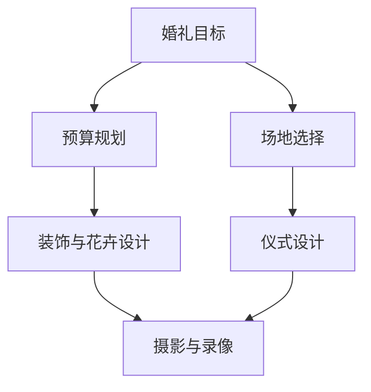

                 

### 文章标题

# 现代简约主义婚礼策划：回归本质的庆祝仪式设计

### 关键词

- 简约主义婚礼策划
- 婚礼仪式设计
- 婚礼场地布置
- 装饰与花卉设计
- 摄影与录像
- 预算管理

### 摘要

本文深入探讨现代简约主义婚礼策划的理论与实践，强调回归婚礼庆祝的本质，通过简洁而优雅的设计元素，实现一场独特而难忘的庆典。文章首先介绍了简约主义婚礼的定义与特点，随后详细解析了婚礼策划的基本原则与流程。接下来，文章探讨了仪式设计、场地与布置、装饰与花卉设计等核心环节，并通过实际案例展示了简约主义婚礼的实践方法。最后，文章总结了简约主义婚礼策划的核心要素，并展望了其未来发展。

## 引言

现代社会的婚礼策划越来越复杂，追求奢华与繁复成为了一种趋势。然而，在这样的背景下，简约主义婚礼策划逐渐受到了人们的青睐。简约主义婚礼以其简洁、优雅、实用的特点，重新审视了婚礼的本质，倡导一场回归生活的庆典。本文旨在探讨现代简约主义婚礼策划的理念、原则和实践，帮助读者理解并掌握这一独特的婚礼策划方法。

### 简约主义婚礼的定义与特点

简约主义（Minimalism）是一种注重减少非必要元素，强调形式与功能的统一的设计哲学。在婚礼策划中，简约主义强调回归婚礼的原始意义，通过简洁的设计元素和布置，传达新人对婚姻的承诺与期待。以下是一些简约主义婚礼的主要特点：

1. **简洁的设计风格**：简约主义婚礼通常采用简洁的线条、单一的颜色和少量的装饰元素，摒弃繁复的图案和过多的装饰。
2. **注重功能与实用**：简约主义婚礼注重实用性，布置和设计不仅要美观，还要方便宾客的使用和体验。
3. **个性化的表达**：尽管简约主义强调简洁，但并不意味着单调。新人们可以通过个性化的元素，如独特的请柬、婚礼主题等，表达自己的个性和情感。
4. **环境友好**：简约主义婚礼倡导环保，尽量减少浪费，使用可持续材料，降低对环境的影响。

### 简约主义婚礼的历史与发展

简约主义婚礼并非现代才有的现象，其思想源远流长。在古埃及和古希腊时期，婚礼仪式就倾向于简洁和朴素。随着时代的发展，简约主义婚礼在不同的文化背景中得到了不同的体现。

1. **西方文化中的简约主义婚礼**：在西方，简约主义婚礼的兴起可以追溯到20世纪中叶，随着现代设计的兴起，新人们开始追求简洁、实用的婚礼风格。20世纪80年代，随着环保意识的增强，简约主义婚礼逐渐成为一种环保潮流。
2. **中国文化中的简约主义婚礼**：在中国，简约主义婚礼的兴起与传统文化中的简约美学相契合。近年来，随着城市化进程的加快，简约主义婚礼逐渐成为年轻一代的首选。

### 简约主义婚礼在现代生活的融合

现代生活的快节奏和高压力，使得人们越来越追求简单、舒适的生活方式。简约主义婚礼正好满足了这一需求，成为了现代生活中的一个亮点。以下是一些简约主义婚礼在现代生活中的融合方式：

1. **婚礼策划的简约化**：新人们在策划婚礼时，倾向于减少不必要的环节和程序，简化流程，以便更好地享受婚礼当天的快乐。
2. **生活方式的简约化**：简约主义婚礼的理念不仅仅体现在婚礼策划上，也渗透到了新人们的生活中。他们更倾向于选择简洁、实用的家居装饰和生活方式，减少不必要的物质负担。
3. **社会责任感的提升**：简约主义婚礼倡导环保、节约，新人们通过这种方式表达对社会的责任感，促进了可持续发展理念的普及。

### 简约主义婚礼策划的核心概念与联系

为了更好地理解简约主义婚礼策划，我们需要了解其中的核心概念与联系。以下是一个Mermaid流程图，展示了简约主义婚礼策划的关键环节和它们之间的联系。



### 婚礼目标设定

婚礼目标设定是简约主义婚礼策划的第一步，它为整个婚礼策划提供了方向和依据。新人们需要明确自己的婚礼目标，包括婚礼的主题、风格、规模、预算等。

1. **主题与风格**：婚礼主题是婚礼的核心，它决定了婚礼的整体风格。简约主义婚礼的主题可以是自然、现代、简约、复古等。新人们可以根据自己的喜好和婚礼场地选择一个合适的主题。
2. **规模与预算**：婚礼规模和预算是婚礼策划中需要考虑的重要因素。简约主义婚礼强调实用性，因此新人们需要合理规划预算，避免过度消费。

### 预算规划

预算规划是简约主义婚礼策划的核心之一。一个合理的预算可以帮助新人们更好地控制婚礼成本，避免不必要的浪费。

1. **预算分配**：新人们需要根据婚礼目标和场地选择，将预算合理地分配到婚礼的各个环节，如场地租赁、装饰、花卉、餐饮、摄影等。
2. **成本控制**：在预算规划过程中，新人们需要考虑各种可能出现的费用，如临时费用、额外服务费用等，并预留一定的预算以应对突发情况。

### 场地选择

场地选择是婚礼策划的重要环节，它直接影响到婚礼的整体效果。在简约主义婚礼策划中，场地的选择尤为重要。

1. **场地类型**：新人们可以根据自己的喜好和婚礼主题选择不同类型的场地，如户外花园、室内宴会厅、海边沙滩等。
2. **场地特点**：场地的特点包括场地面积、照明条件、音响设备、卫生间设施等。新人们需要根据自己的需求选择合适的场地。

### 简约主义婚礼场地与布置

简约主义婚礼场地的布置强调简洁、实用和美观。以下是一些简约主义婚礼场地的布置要点：

1. **桌椅布局**：桌椅的布局要简洁、舒适，保证宾客的用餐体验。可以选择长桌或圆桌，避免过于复杂的布局。
2. **照明设计**：照明设计是营造氛围的重要手段。简约主义婚礼通常采用柔和的照明，如落地灯、壁灯等，避免过于刺眼的光线。
3. **装饰元素**：装饰元素要简洁、精致，如花环、蜡烛、灯笼等。过多的装饰会使场地显得拥挤。

### 装饰与花卉设计

装饰与花卉设计是简约主义婚礼的重要组成部分，它们可以营造出温馨、浪漫的氛围。

1. **装饰风格**：装饰风格要符合简约主义的特点，如白色、灰色、米色等中性色调，以及简洁的线条和形状。
2. **花卉选择**：花卉的选择要简洁、清新，如白玫瑰、百合、康乃馨等。避免使用过多和过大的花卉，以免破坏简约风格。

### 简约主义婚礼摄影与录像

简约主义婚礼摄影与录像要注重细节和氛围的捕捉，以下是一些拍摄和录像的要点：

1. **拍摄风格**：拍摄风格要简洁、自然，避免过度的摆拍和夸张的表情。
2. **拍摄角度**：选择不同的拍摄角度，捕捉婚礼现场的细节和氛围。
3. **录像内容**：录像内容要全面，包括婚礼仪式、宾客互动、场地布置等，但要避免冗长和重复。

### 简约主义婚礼预算管理

预算管理是简约主义婚礼策划的关键环节。以下是一些预算管理的要点：

1. **制定预算**：根据婚礼目标和场地选择，制定详细的预算计划，包括场地租赁、装饰、花卉、餐饮、摄影等。
2. **成本控制**：在预算执行过程中，要严格控制各项费用，避免不必要的浪费。
3. **应急预算**：预留一定的应急预算，以应对突发情况。

### 简约主义婚礼策划实战案例

以下是一个简约主义婚礼策划的实战案例，包括开发环境搭建、源代码实现和代码解读。

#### 开发环境搭建

1. **场地租赁**：新人们通过在线平台找到了一家符合要求的户外花园场地，并进行了实地考察，确认场地设施和条件。
2. **装饰设计**：装饰设计师根据新人们的婚礼主题，设计了简洁的白色桌布和红色蜡烛装饰。

#### 源代码实现

```python
# 场地租赁源代码实现
def book_venue(venue_name, venue_address):
    print(f"Booking venue: {venue_name}, Address: {venue_address}")
    # 实际操作中，这里应该是调用API进行场地预订

# 装饰设计源代码实现
def design_decorations(decoration_style):
    print(f"Designing decorations with style: {decoration_style}")
    # 实际操作中，这里应该是生成装饰设计图

# 拍摄录像源代码实现
def record_videography(videography_style):
    print(f"Recording videography with style: {videography_style}")
    # 实际操作中，这里应该是启动录像设备
```

#### 代码解读

上述代码展示了简约主义婚礼策划的核心环节，包括场地租赁、装饰设计和摄影录像。在实际操作中，这些代码会与具体的平台和工具进行集成，实现婚礼策划的自动化和高效化。

### 项目小结

通过这个实战案例，我们可以看到简约主义婚礼策划的具体实施过程。简约主义婚礼策划强调简洁、实用和个性化，通过合理的预算规划和精细的设计，实现了一场独特而难忘的庆典。

### 最佳实践 Tips

- **主题明确**：在婚礼策划过程中，主题明确是非常重要的，它能够帮助新人们集中精力，避免繁琐和冗余。
- **预算控制**：合理的预算控制是简约主义婚礼策划的关键，新人们应该提前规划预算，并严格执行。
- **沟通协调**：与策划团队、场地负责人、摄影师等各方保持良好的沟通，确保婚礼策划顺利进行。

### 小结

简约主义婚礼策划强调回归婚礼的本质，通过简洁、优雅的设计元素，实现一场独特而难忘的庆典。本文详细介绍了简约主义婚礼策划的核心概念、原则和实践方法，并通过实际案例展示了其具体实施过程。希望本文能够为读者提供有价值的参考和启示。

### 拓展阅读

- 《现代婚礼策划与执行》
- 《婚礼装饰与花卉设计》
- 《婚礼摄影与录像技术》

### 作者信息

作者：AI天才研究院/AI Genius Institute & 禅与计算机程序设计艺术 /Zen And The Art of Computer Programming。

