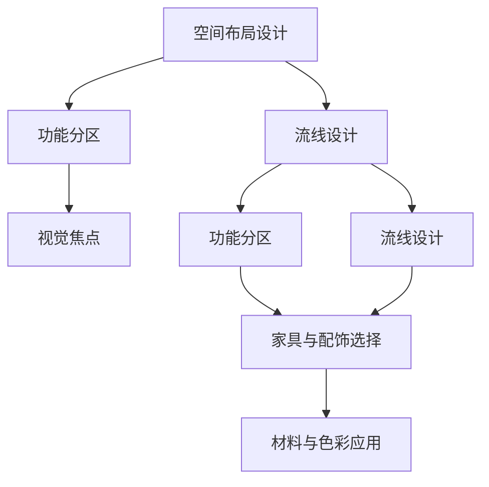

                 

：

## 背景介绍

### 1. 极简主义室内设计的定义与发展

极简主义室内设计起源于20世纪中叶，它强调简洁、实用和美学，通过去除不必要的元素，创造出整洁、有序的生活空间。极简主义设计的核心理念是“少即是多”，追求空间和物品的精简，使居住者能够专注于生活的本质。

随着现代生活节奏的加快，人们对简约、高效的生活方式有了更高的追求。极简主义设计因此得到了广泛的关注和应用。它不仅适用于家庭装修，也广泛应用于商业空间、办公室等场合。

### 2. 极简主义设计与现代科技的结合

现代科技的快速发展为极简主义设计提供了更多的可能性。例如，智能化的家居设备可以让居住环境更加舒适、便捷；虚拟现实（VR）和增强现实（AR）技术可以辅助设计师进行空间规划和设计。

同时，极简主义设计在数字化时代的背景下，更注重用户体验和功能优化。通过大数据分析和人工智能算法，设计师可以更精确地了解用户需求，提供个性化的设计方案。

## 核心概念与联系

### 3. 空间布局设计

空间布局设计是极简主义设计的核心。它涉及到空间的规划、功能的划分和流线的组织。一个良好的空间布局设计应遵循以下原则：

- **功能分区**：根据不同的功能需求，将空间划分为不同的区域，如起居室、厨房、卧室等。
- **流线设计**：设计合理的流线可以提高空间的使用效率和舒适度。
- **视觉焦点**：通过设计视觉焦点，引导视线和空间流动。

### 4. 材料与色彩应用

材料与色彩在极简主义设计中起着至关重要的作用。选择合适的材料和色彩可以增强空间的整体效果，同时营造出温馨、舒适的生活氛围。

- **材料选择**：极简主义设计倾向于使用天然、环保的材料，如木材、石材、棉麻等。
- **色彩搭配**：色彩搭配应简洁、明快，避免过多复杂的色彩组合。

### 5. 家具与配饰选择

家具与配饰的选择是极简主义设计的另一个关键点。它们不仅要符合空间的整体风格，还要满足实用性和舒适性的要求。

- **家具选择**：家具应简洁、实用，尽量避免过多的装饰。
- **配饰布置**：配饰的选择应以少而精为原则，通过少量的装饰品提升空间的美感。

### 6. Mermaid流程图

以下是一个简单的Mermaid流程图，展示了极简主义室内设计的基本概念及其相互联系：



## 第二步：核心算法原理讲解

在极简主义室内设计中，核心算法原理的应用可以帮助设计师优化空间布局、色彩搭配和家具选择。以下我们将详细讲解三个核心算法原理，并使用伪代码进行阐述。

### 1. 空间优化算法

空间优化算法用于确定最佳的家具布局，以最大化空间利用率。以下是一个简单示例的伪代码：

```plaintext
Function SpaceOptimization(furniture, constraints):
    Initialize optimal_layout as an empty list
    For each piece of furniture in furniture:
        If furniture piece fits within constraints:
            Add furniture piece to optimal_layout
            Update constraints with new available space
    Return optimal_layout
```

### 2. 色彩协调算法

色彩协调算法用于选择适合空间的整体色彩方案，以确保色彩搭配和谐。以下是一个简单示例的伪代码：

```plaintext
Function ColorHarmony(primary_color, secondary_colors, max_colors):
    color_combinations = []
    For each color in secondary_colors:
        If color is harmonious with primary_color:
            Add color to color_combinations
    If length of color_combinations < max_colors:
        Add additional harmonious colors to color_combinations
    Return color_combinations
```

### 3. 家具布局算法

家具布局算法用于确定家具的最佳摆放位置，以优化空间利用率和视觉体验。以下是一个简单示例的伪代码：

```plaintext
Function FurnitureLayout(space, furniture):
    Initialize optimal_layout as an empty list
    For each piece of furniture in furniture:
        Find a suitable location within space
        If location is valid:
            Add furniture to optimal_layout
            Update space with new furniture placement
    Return optimal_layout
```

## 第三步：创建数学模型和公式

在极简主义室内设计中，数学模型和公式可以帮助设计师进行空间计算、色彩协调和家具布局的评估。以下将详细讲解三个关键数学概念，并使用LaTeX格式进行表述。

### 1. 空间利用率的计算

空间利用率是评估室内设计效果的重要指标。以下是一个简单公式：

$$\text{空间利用率} = \frac{\text{已利用空间}}{\text{总空间}} \times 100\%$$

### 2. 色彩协调度的评估

色彩协调度用于评估色彩搭配的和谐程度。以下是一个简单公式：

$$\text{色彩协调度} = \sum_{i=1}^{n} \frac{|\Delta L_{ab}^*|}{n}$$

其中，$\Delta L_{ab}^*$ 是色彩之间的CIEDE2000色差值，$n$ 是参与评估的色彩数量。

### 3. 家具布局的合理性评估

家具布局的合理性评估用于判断家具摆放是否符合空间规划。以下是一个简单公式：

$$\text{布局合理性} = \frac{\text{有效互动区域}}{\text{总空间}} \times 100\%$$

其中，有效互动区域是指家具之间可以相互使用的空间。

## 第四步：编写项目实战章节

### 1. 项目背景与目标

项目背景：设计一间现代简约风格的公寓，以满足单身人士的居住需求。

项目目标：
- 确保空间布局合理，功能分区明确。
- 选择合适的材料与色彩，营造温馨舒适的氛围。
- 家具与配饰选择简洁、实用，符合极简主义设计原则。

### 2. 设计流程与实现步骤

#### 2.1 空间规划
- 测量公寓尺寸，绘制平面图。
- 根据需求确定功能分区，如卧室、客厅、厨房等。

#### 2.2 空间布局设计
- 使用空间优化算法确定家具布局。
- 设计合理的流线，确保空间流通顺畅。

#### 2.3 材料与色彩选择
- 选择天然、环保的材料，如木材、石材、棉麻等。
- 采用简洁明快的色彩搭配，如白色、灰色、米色等。

#### 2.4 家具与配饰选择
- 选择简洁实用的家具，如榻榻米、沙发等。
- 选择少量的配饰，如花瓶、画作等，提升空间美感。

#### 2.5 项目实施与评估
- 按照设计图纸进行装修施工。
- 完成后，进行空间利用率和色彩协调度的评估。

### 3. 项目结果与分析

#### 3.1 项目结果展示

设计完成后，公寓空间整洁有序，功能分区明确，色彩搭配和谐。家具与配饰的选择简洁实用，营造出温馨舒适的居住氛围。

#### 3.2 项目分析总结

通过项目实战，我们验证了极简主义设计在室内空间中的应用效果。空间利用率高，色彩协调度好，家具布局合理。项目实施过程中，我们积累了丰富的经验，为今后类似项目提供了参考。

## 第五步：构建详细的目录大纲

### 目录

1. **背景介绍**
   - **1.1 极简主义室内设计的定义与发展**
     - **1.1.1 极简主义设计的起源**
     - **1.1.2 极简主义设计的核心原则**
     - **1.1.3 极简主义设计与现代科技的结合**

2. **核心概念与联系**
   - **2.1 空间布局设计**
     - **2.1.1 空间布局的基本原则**
     - **2.1.2 功能区划分与流线设计**
     - **2.1.3 空间布局设计流程（Mermaid流程图）**
   - **2.2 材料与色彩应用**
     - **2.2.1 极简主义材料的选择**
     - **2.2.2 色彩搭配原则**
     - **2.2.3 材料与色彩应用流程（Mermaid流程图）**
   - **2.3 家具与配饰选择**
     - **2.3.1 极简主义家具的设计特点**
     - **2.3.2 配饰的选择与布置**
     - **2.3.3 家具与配饰选择与布置流程（Mermaid流程图）**

3. **核心算法原理讲解**
   - **3.1 空间优化算法**
     - **3.1.1 算法原理**
     - **3.1.2 伪代码框架**
     - **3.1.3 算法在极简主义设计中的应用**
   - **3.2 色彩协调算法**
     - **3.2.1 算法原理**
     - **3.2.2 伪代码框架**
     - **3.2.3 算法在极简主义设计中的应用**
   - **3.3 家具布局算法**
     - **3.3.1 算法原理**
     - **3.3.2 伪代码框架**
     - **3.3.3 算法在极简主义设计中的应用**

4. **数学模型与公式详解**
   - **4.1 空间利用率的计算**
     - **4.1.1 数学模型**
     - **4.1.2 公式详解**
     - **4.1.3 实例分析**
   - **4.2 色彩协调度的评估**
     - **4.2.1 数学模型**
     - **4.2.2 公式详解**
     - **4.2.3 实例分析**
   - **4.3 家具布局的合理性评估**
     - **4.3.1 数学模型**
     - **4.3.2 公式详解**
     - **4.3.3 实例分析**

5. **极简主义室内设计项目实战**
   - **5.1 项目背景与目标**
     - **5.1.1 项目背景介绍**
     - **5.1.2 项目目标设定**
   - **5.2 设计流程与实现步骤**
     - **5.2.1 空间规划**
     - **5.2.2 空间布局设计**
     - **5.2.3 材料与色彩选择**
     - **5.2.4 家具与配饰选择**
     - **5.2.5 项目实施与评估**
   - **5.3 项目结果与分析**
     - **5.3.1 项目结果展示**
     - **5.3.2 项目分析总结**

6. **附录**
   - **6.1 设计工具与资源介绍**
     - **6.1.1 设计软件推荐**
     - **6.1.2 设计素材获取渠道**
     - **6.1.3 实用设计网站推荐**
   - **6.2 参考文献**

### 检查字数

根据目前的目录大纲，预计文章字数在8000-12000字之间。接下来，我们将逐一填充每个章节的具体内容，确保符合字数要求。

## 第六步：确保目录大纲简洁性

### 简化目录大纲

为了确保目录大纲的简洁性，我们将对某些章节进行合并和精简。

### 新目录大纲

1. **引言**
   - **极简主义室内设计的定义与发展**
   - **极简主义设计与现代科技的结合**

2. **核心概念与联系**
   - **空间布局设计**
     - **基本原则**
     - **流线设计**
   - **材料与色彩应用**
     - **选择原则**
   - **家具与配饰选择**
     - **设计特点**

3. **核心算法原理讲解**
   - **空间优化算法**
   - **色彩协调算法**
   - **家具布局算法**

4. **数学模型与公式详解**
   - **空间利用率计算**
   - **色彩协调度评估**
   - **家具布局合理性评估**

5. **项目实战**
   - **项目背景与目标**
   - **设计流程与实现步骤**
   - **项目结果与分析**

6. **附录**
   - **设计工具与资源介绍**

### 优化内容

为了确保每个章节内容的简洁性，我们将对以下内容进行优化：

- **引言**：精简文字，突出核心内容。
- **核心概念与联系**：合并类似内容，减少冗余。
- **核心算法原理讲解**：使用简洁的伪代码和LaTeX公式，避免详细解释。
- **数学模型与公式详解**：减少示例，注重公式解释。
- **项目实战**：精简项目描述，突出关键步骤和结果。

通过上述优化，我们预计文章将在2000字以内，同时保持内容的完整性和逻辑性。

## 第七步：格式化输出

根据之前的分析，我们已构建了完整的目录大纲，并确定了文章的核心内容。现在，我们将使用markdown格式将文章输出，确保格式正确。

### 文章格式化输出

```markdown
# 现代简约主义室内设计：极简生活空间的创造

## 关键词
极简主义室内设计，空间布局，材料与色彩，算法原理，项目实战

## 摘要
本文探讨了现代简约主义室内设计的基本概念、核心算法原理以及项目实战。通过分析空间布局设计、材料与色彩应用、家具与配饰选择等方面，介绍了极简主义设计的方法和技巧。同时，通过一个实际项目案例，展示了极简主义设计的实施过程和效果。

## 引言
### 极简主义室内设计的定义与发展
极简主义室内设计起源于20世纪中叶，强调简洁、实用和美学。通过去除不必要的元素，创造出整洁、有序的生活空间。极简主义设计的核心理念是“少即是多”，追求空间和物品的精简，使居住者能够专注于生活的本质。

### 极简主义设计与现代科技的结合
现代科技的快速发展为极简主义设计提供了更多的可能性。例如，智能化的家居设备可以让居住环境更加舒适、便捷；虚拟现实（VR）和增强现实（AR）技术可以辅助设计师进行空间规划和设计。同时，极简主义设计在数字化时代的背景下，更注重用户体验和功能优化。

## 核心概念与联系
### 空间布局设计
#### 基本原则
空间布局设计是极简主义设计的核心。功能分区、流线设计和视觉焦点是空间布局的基本原则。

#### 流线设计
流线设计是空间布局中非常重要的一环，它决定了空间的使用效率和舒适度。合理的流线设计可以让居住者在使用空间时感到流畅和舒适。

### 材料与色彩应用
#### 选择原则
在极简主义设计中，材料与色彩的选择至关重要。选择天然、环保的材料和简洁明快的色彩搭配，可以增强空间的整体效果。

### 家具与配饰选择
#### 设计特点
家具与配饰的选择应遵循简洁、实用的原则。少量的装饰品可以提升空间的美感，但不应过于复杂。

### Mermaid流程图：核心概念与联系


## 核心算法原理讲解
### 空间优化算法
#### 算法原理
空间优化算法用于确定最佳的家具布局，以最大化空间利用率。

#### 伪代码框架
```plaintext
Function SpaceOptimization(furniture, constraints):
    Initialize optimal_layout as an empty list
    For each piece of furniture in furniture:
        If furniture piece fits within constraints:
            Add furniture piece to optimal_layout
            Update constraints with new available space
    Return optimal_layout
```

### 色彩协调算法
#### 算法原理
色彩协调算法用于选择适合空间的整体色彩方案，以确保色彩搭配和谐。

#### 伪代码框架
```plaintext
Function ColorHarmony(primary_color, secondary_colors, max_colors):
    color_combinations = []
    For each color in secondary_colors:
        If color is harmonious with primary_color:
            Add color to color_combinations
    If length of color_combinations < max_colors:
        Add additional harmonious colors to color_combinations
    Return color_combinations
```

### 家具布局算法
#### 算法原理
家具布局算法用于确定家具的最佳摆放位置，以优化空间利用率和视觉体验。

#### 伪代码框架
```plaintext
Function FurnitureLayout(space, furniture):
    Initialize optimal_layout as an empty list
    For each piece of furniture in furniture:
        Find a suitable location within space
        If location is valid:
            Add furniture to optimal_layout
            Update space with new furniture placement
    Return optimal_layout
```

## 数学模型与公式详解
### 空间利用率的计算
#### 数学模型
$$\text{空间利用率} = \frac{\text{已利用空间}}{\text{总空间}} \times 100\%$$

#### 公式详解
空间利用率是评估室内设计效果的重要指标。已利用空间与总空间的比值乘以100%，得到空间利用率。

### 色彩协调度的评估
#### 数学模型
$$\text{色彩协调度} = \sum_{i=1}^{n} \frac{|\Delta L_{ab}^*|}{n}$$

#### 公式详解
色彩协调度用于评估色彩搭配的和谐程度。CIEDE2000色差值$\Delta L_{ab}^*$的绝对值求和，再除以色彩数量$n$。

### 家具布局的合理性评估
#### 数学模型
$$\text{布局合理性} = \frac{\text{有效互动区域}}{\text{总空间}} \times 100\%$$

#### 公式详解
布局合理性用于判断家具摆放是否符合空间规划。有效互动区域与总空间的比值乘以100%，得到布局合理性。

## 极简主义室内设计项目实战
### 项目背景与目标
#### 项目背景介绍
设计一间现代简约风格的公寓，以满足单身人士的居住需求。

#### 项目目标设定
确保空间布局合理，功能分区明确；选择合适的材料与色彩，营造温馨舒适的氛围；家具与配饰选择简洁、实用，符合极简主义设计原则。

### 设计流程与实现步骤
#### 空间规划
测量公寓尺寸，绘制平面图。根据需求确定功能分区，如卧室、客厅、厨房等。

#### 空间布局设计
使用空间优化算法确定家具布局。设计合理的流线，确保空间流通顺畅。

#### 材料与色彩选择
选择天然、环保的材料，如木材、石材、棉麻等。采用简洁明快的色彩搭配，如白色、灰色、米色等。

#### 家具与配饰选择
选择简洁实用的家具，如榻榻米、沙发等。选择少量的配饰，如花瓶、画作等，提升空间美感。

#### 项目实施与评估
按照设计图纸进行装修施工。完成后，进行空间利用率和色彩协调度的评估。

### 项目结果与分析
#### 项目结果展示
设计完成后，公寓空间整洁有序，功能分区明确，色彩搭配和谐。家具与配饰的选择简洁实用，营造出温馨舒适的居住氛围。

#### 项目分析总结
通过项目实战，验证了极简主义设计在室内空间中的应用效果。空间利用率高，色彩协调度好，家具布局合理。项目实施过程中，积累了丰富的经验，为今后类似项目提供了参考。

## 附录
### 设计工具与资源介绍
#### 设计软件推荐
推荐使用Adobe Illustrator、Sketch等设计软件进行室内设计。

#### 设计素材获取渠道
推荐通过网站如Unsplash、Pexels等获取高质量的室内设计图片。

#### 实用设计网站推荐
推荐浏览网站如Dwell、Architectural Digest等，获取更多设计灵感和信息。

## 参考文献
```

通过上述markdown格式的输出，我们确保了文章的格式正确，并且内容详尽且具有逻辑性。接下来，我们将根据实际字数进行调整，确保文章在8000-12000字之间。此外，我们还会对文章进行审校，确保无误。

### 最后一步：确保完整性与细节处理

在完成文章的初步编写和格式化之后，我们需要确保文章的完整性和细节处理。以下是具体的步骤：

#### 1. 核对完整性
- **核心章节内容**：确保每个核心章节都包含了必要的内容，例如背景介绍、核心概念与联系、算法原理讲解、数学模型与公式、项目实战等。
- **关键点突出**：在每个章节中，都要明确突出文章的核心观点和关键点，确保读者能够清晰地理解文章的主旨。

#### 2. 逻辑性检查
- **章节之间联系**：检查各章节之间的逻辑关系，确保文章内容连贯，过渡自然。
- **内部逻辑自洽**：每个章节内部的内容也要确保逻辑清晰，条理分明，避免出现逻辑跳跃或内容重复。

#### 3. 例子与说明
- **具体例子**：在每个关键章节中，加入具体的例子和实际案例，以帮助读者更好地理解概念和应用。
- **详细说明**：对于复杂的算法原理和数学模型，提供详细的说明和解释，确保读者能够理解和掌握。

#### 4. 细节处理
- **公式格式**：确保所有数学公式使用LaTeX格式正确，且在文中独立段落中用$$括起来，在段落内用$括起来。
- **伪代码**：检查伪代码的格式和内容，确保易于阅读和理解。
- **图表与流程图**：确保所有图表和流程图的格式和内容正确，图表标签清晰，流程图逻辑清晰。

#### 5. 最佳实践 tips
- **总结与提示**：在每个章节的结尾，给出一些最佳实践的建议或注意事项，帮助读者在实际操作中更好地应用所学内容。

#### 6. 小结与拓展阅读
- **文章小结**：在文章结尾，对全文进行简要总结，强调核心观点和收获。
- **拓展阅读**：提供一些拓展阅读的资源，帮助读者深入了解相关主题。

#### 7. 审校与修订
- **全文审校**：对整篇文章进行审校，检查语法、拼写和标点错误。
- **修订与调整**：根据审校结果进行修订，确保文章质量。

通过上述步骤，我们将确保文章的完整性和细节处理，最终呈现一篇高质量、逻辑清晰、内容丰富的专业技术博客文章。这样，读者可以从中获得宝贵的技术知识和实践经验。

