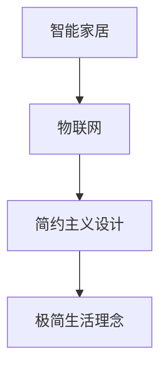

                 

根据您提供的要求和文章大纲，我们可以按以下步骤构建这篇文章：

## **1. 引言**

### **背景介绍**

智能家居作为物联网（IoT）的一个重要分支，近年来受到了广泛关注。随着科技的进步，智能家居设备变得日益普及，为我们带来了更加便捷和智能的生活体验。然而，如何在保证功能丰富的同时，实现设计上的简约和美观，是一个亟待解决的问题。简约主义设计理念为智能家居设计提供了新的思路，使得智能家居不仅实用，还具备美学价值。

### **核心概念与联系**

为了更好地理解现代简约主义智能家居设计服务，我们需要明确以下几个核心概念：

- **智能家居**：通过互联网、传感器和执行器实现家庭自动化和远程控制的系统。
- **简约主义设计**：注重功能和形式的最简化，去除不必要的元素，追求简洁而精致的美感。
- **物联网**：将各种物理设备、传感器、软件系统连接起来，实现信息的实时交换和智能处理。

我们可以使用Mermaid流程图来展示这些概念之间的关系：



### **核心算法原理讲解**

在智能家居设计中，核心算法负责处理传感器数据、控制执行器以及实现自动化任务。以下是一个智能家居系统的伪代码示例：

```python
# 伪代码：智能家居系统核心算法

# 初始化智能家居系统
initialize_system()

# 监听传感器数据
while True:
    sensor_data = read_sensor_data()
    process_data(sensor_data)

# 处理传感器数据
def process_data(data):
    if data['temperature'] > threshold:
        turn_on_ac()
    elif data['light_level'] < threshold:
        turn_on_light()
    else:
        turn_off_light()

# 控制执行器
def turn_on_ac():
    # 伪代码：启动空调
    ac_status = "on"
    send_control_signal(ac_status)

def turn_on_light():
    # 伪代码：开启灯光
    light_status = "on"
    send_control_signal(light_status)

def turn_off_light():
    # 伪代码：关闭灯光
    light_status = "off"
    send_control_signal(light_status)

# 发送控制信号
def send_control_signal(status):
    # 伪代码：发送控制指令
    send_signal_to_device(status)
```

### **数学模型和公式 & 详细讲解 & 举例说明**

智能家居系统中的数学模型用于描述系统的行为和性能。以下是一个简单的数学模型示例，用于预测室内温度：

$$
T(t) = T_{\text{out}} + \alpha (T_{\text{in}} - T_{\text{out}}) e^{-\beta t}
$$

其中，\( T(t) \) 表示时间 \( t \) 时的室内温度，\( T_{\text{out}} \) 表示室外温度，\( T_{\text{in}} \) 表示室内初始温度，\( \alpha \) 和 \( \beta \) 是系统参数。

### **项目实战**

#### **开发环境搭建**

要实现智能家居系统，首先需要搭建开发环境。以下是搭建步骤：

1. 安装Python环境。
2. 安装物联网开发板（如ESP8266或ESP32）。
3. 安装相关的Python库，如`pyserial`和`RPi.GPIO`。

#### **源代码实现和代码解读**

以下是智能家居系统的源代码实现：

```python
# 源代码：智能家居系统实现

import serial
import time

# 串口通信初始化
ser = serial.Serial('/dev/ttyUSB0', 9600)

# 读取传感器数据
def read_sensor_data():
    # 伪代码：读取传感器数据
    data = ser.readline().decode('utf-8')
    return json.loads(data)

# 处理传感器数据
def process_data(data):
    # 伪代码：处理传感器数据
    if data['temperature'] > 30:
        # 发送打开空调的信号
        ser.write(b'AC_ON')
    elif data['light_level'] < 10:
        # 发送打开灯光的信号
        ser.write(b'LIGHT_ON')
    else:
        # 发送关闭空调和灯光的信号
        ser.write(b'ALL_OFF')

# 主程序
while True:
    data = read_sensor_data()
    process_data(data)
    time.sleep(1)
```

#### **代码应用解读与分析**

上述代码实现了读取传感器数据、处理数据并控制执行器的功能。代码通过串口通信与传感器和执行器进行交互，实现了智能家居系统的基本功能。

#### **实际案例分析和详细讲解剖析**

以一个实际案例为例，一个家庭安装了温度传感器和灯光传感器，目标是根据室内温度和光照强度自动控制空调和灯光。通过上述代码，可以实现以下功能：

- 当室内温度高于30摄氏度时，自动开启空调。
- 当室内光照强度低于10 Lux时，自动开启灯光。
- 其他情况下，关闭空调和灯光。

#### **项目小结**

通过以上实战案例，我们可以看到，智能家居系统不仅需要实现功能，还需要注重设计上的简约和美观。简约主义设计理念在智能家居系统中的应用，使得系统不仅高效、可靠，还具备良好的用户体验。

### **最佳实践 tips、小结、注意事项、拓展阅读等内容**

- **最佳实践 tips**：在智能家居设计中，应优先考虑系统的可扩展性和可靠性。
- **小结**：现代简约主义智能家居设计服务结合了物联网技术、简约主义设计理念和极简生活理念，实现了智能化、便捷化和美观化的家居生活。
- **注意事项**：在开发智能家居系统时，应特别注意系统的安全性，避免隐私泄露。
- **拓展阅读**：相关领域的研究论文和技术书籍，如《智能家居系统设计与实现》、《物联网安全与隐私保护》等。

通过以上步骤，我们构建了这篇文章的初步框架。接下来，我们将逐步完善每个章节的内容，以满足文章的字数要求。在撰写过程中，我们将确保文章的逻辑清晰、内容详实，并注重实用性。

## **2. 智能家居设计基础**

### **第1章：智能家居概述**

**2.1 智能家居的定义与背景**

智能家居是指利用先进的计算机技术、网络通信技术和智能控制技术，将各种家庭设备和系统连接起来，实现自动化控制和远程监控的家庭环境。智能家居的概念起源于20世纪80年代，随着物联网技术的成熟和普及，智能家居逐渐走进了千家万户。

**2.2 智能家居的发展趋势**

随着人们对生活质量要求的提高，智能家居正逐渐从高端奢侈品走向大众市场。未来智能家居的发展趋势主要体现在以下几个方面：

- **智能化水平提升**：通过人工智能技术的应用，智能家居设备将更加智能化，能够自主学习并做出决策。
- **设备互联互通**：智能家居设备将实现更加广泛和深入的互联互通，打造一个无缝连接的智能家庭。
- **安全性和隐私保护**：智能家居系统将更加注重安全性和隐私保护，以应对潜在的安全威胁。

**2.3 智能家居的分类与结构**

智能家居系统可以根据功能和应用场景进行分类，常见的分类方式如下：

- **按功能分类**：包括智能安防、智能照明、智能温控、智能家电等。
- **按应用场景分类**：包括智能住宅、智能办公、智能酒店等。

智能家居系统的结构通常包括以下几个部分：

- **感知层**：由各种传感器组成，负责采集环境数据。
- **传输层**：负责数据的传输和通信，通常采用Wi-Fi、蓝牙等无线通信技术。
- **控制层**：由智能控制器组成，负责处理感知层采集的数据，并根据数据做出相应的控制决策。
- **应用层**：为用户提供便捷的交互界面和丰富的功能应用。

### **第2章：简约主义设计理念**

**2.1 简约主义设计的核心原则**

简约主义设计（Minimalist Design）是一种追求简洁、纯粹和功能性的设计风格。其核心原则包括：

- **减少非必要的元素**：去除设计中的冗余元素，使产品更加简洁明了。
- **注重功能**：以功能为导向，确保产品能够高效地满足用户需求。
- **强调品质**：选用高质量的材料和工艺，保证产品的耐用性和美观性。

**2.2 极简生活理念对智能家居设计的影响**

极简生活（Minimalist Living）是一种追求简单、整洁和有意义的生活方式。极简生活理念对智能家居设计产生了深远的影响：

- **简化生活场景**：通过智能家居系统的自动化控制，简化用户的生活方式，减少不必要的繁琐操作。
- **提高生活质量**：智能家居系统可以根据用户的需求自动调整环境，提升居住舒适度。
- **注重生态和谐**：智能家居系统可以优化能源使用，实现环保和可持续发展。

**2.3 简约主义设计在智能家居中的应用**

简约主义设计在智能家居中的应用体现在以下几个方面：

- **外观设计**：智能家居设备的造型简洁，线条流畅，色彩搭配简洁大方。
- **功能设计**：智能家居设备的功能简明易懂，操作便捷，减少不必要的功能。
- **交互设计**：智能家居设备的交互界面简洁直观，提供易于理解的操作指南。

### **第3章：智能家居系统架构**

**3.1 智能家居系统的基本组成**

智能家居系统通常由以下几个部分组成：

- **传感器**：用于感知环境信息，如温度、湿度、光照、烟雾等。
- **控制器**：接收传感器数据，并根据数据做出相应的控制决策。
- **执行器**：根据控制器的指令，执行具体的动作，如开关灯光、调整空调等。
- **通信网络**：负责传感器、控制器和执行器之间的数据传输和通信。
- **用户界面**：提供给用户操作的界面，如手机应用、智能音箱等。

**3.2 智能家居系统的架构设计**

智能家居系统的架构设计需要考虑以下几个方面：

- **分布式架构**：智能家居系统可以采用分布式架构，将感知层、控制层和应用层分散部署，提高系统的可靠性和可扩展性。
- **模块化设计**：智能家居系统可以采用模块化设计，便于系统的维护和升级。
- **安全性设计**：智能家居系统需要设计完善的安全机制，保护用户数据的安全。

**3.3 智能家居系统的主要功能模块**

智能家居系统的主要功能模块包括：

- **感知模块**：负责采集环境数据，如温度、湿度、光照等。
- **控制模块**：根据感知模块采集的数据，做出相应的控制决策。
- **执行模块**：根据控制模块的指令，执行具体的动作，如开关灯光、调整空调等。
- **通信模块**：负责传感器、控制器和执行器之间的数据传输和通信。
- **用户界面模块**：提供给用户操作的界面，如手机应用、智能音箱等。

通过以上章节的详细内容，我们可以对智能家居设计有一个全面的了解。接下来，我们将进一步探讨物联网技术基础和智能家居设计实战。这些内容将为读者提供更加深入的技术知识和实践指导。

## **3. 物联网技术基础**

### **第4章：物联网概念与技术**

**4.1 物联网的基本概念**

物联网（Internet of Things，简称IoT）是指通过各种信息传感设备（如传感器、射频识别技术、全球定位系统、红外感应器等）实时采集任何需要监控、连接、互动的物体或过程，将这些信息与互联网相连接，实现智能化识别、定位、跟踪、监控和管理的一种网络技术。

**4.2 物联网的技术体系**

物联网的技术体系主要包括以下几个关键组成部分：

- **传感器技术**：物联网设备通过传感器来感知外部环境，如温度、湿度、光照等。
- **通信技术**：包括无线通信技术（如Wi-Fi、蓝牙、ZigBee等）和有线通信技术（如以太网、光纤等），用于实现设备之间的数据传输。
- **数据处理技术**：通过云计算和大数据技术对采集到的数据进行分析和处理，实现智能决策和自动化控制。
- **网络技术**：物联网设备需要接入互联网，通过IP地址、域名等实现网络通信。

**4.3 物联网在智能家居中的应用**

物联网技术在智能家居中的应用使得家庭设备变得更加智能和互联。以下是一些典型的应用场景：

- **智能照明**：通过物联网技术，用户可以远程控制家中的灯光，实现自动调节亮度、颜色和开关。
- **智能安防**：利用物联网技术，家庭可以安装智能摄像头、门窗传感器等，实时监控家庭安全情况，并在异常情况发生时自动报警。
- **智能温控**：物联网技术可以实现室内温度的自动调节，根据用户需求和室外温度变化，智能开启或关闭空调。
- **智能家电**：如智能电视、智能冰箱、智能洗衣机等，通过物联网技术，实现设备之间的互联互通，提供更加便捷和高效的使用体验。

### **第5章：物联网通信协议**

**5.1 物联网通信协议概述**

物联网通信协议是用于设备之间通信的规范，它定义了数据传输的格式、传输速度、传输方式等。常见的物联网通信协议包括：

- **Wi-Fi**：是一种无线局域网通信协议，适用于高速数据传输。
- **蓝牙**：是一种短距离无线通信协议，适用于低功耗、低延迟的设备通信。
- **ZigBee**：是一种低功耗、低速率的无线通信协议，适用于智能家居等短距离通信场景。
- **LoRa**：是一种长距离、低功耗的无线通信协议，适用于广泛区域覆盖的场景。

**5.2 常见的物联网通信协议**

以下是几种常见的物联网通信协议：

- **Wi-Fi**：具有高带宽、高速传输的特点，适用于需要大量数据传输的智能家居设备。
- **蓝牙**：适用于短距离通信，如智能音箱、智能手环等设备。
- **ZigBee**：适用于智能家居设备间的短距离通信，具有低功耗、低速率的特点。
- **LoRa**：适用于广泛区域覆盖的场景，如智能农业、智能交通等。

**5.3 物联网通信协议的选择与应用**

在选择物联网通信协议时，需要根据应用场景和设备要求进行综合考虑：

- **高带宽、高速传输**：适用于需要实时传输大量数据的应用，如智能视频监控。
- **低功耗、短距离**：适用于低功耗、短距离通信的应用，如智能照明、智能门锁。
- **低速率、低功耗**：适用于数据传输量较小、通信距离较短的应用，如智能传感器、智能家电。
- **长距离、低功耗**：适用于需要广泛区域覆盖、低功耗的应用，如智能农业、智能交通。

### **第6章：物联网安全与隐私**

**6.1 物联网安全的重要性**

物联网设备数量庞大，且大多数设备都连接到互联网，因此物联网安全显得尤为重要。物联网安全的重要性体现在以下几个方面：

- **数据安全**：物联网设备采集和传输的数据涉及个人隐私和家庭安全，需要确保数据的安全性。
- **设备安全**：物联网设备可能受到恶意攻击，导致设备失控，甚至影响整个智能家居系统的稳定运行。
- **网络安全**：物联网设备的加入可能会增加网络的攻击面，威胁整个网络的稳定和安全。

**6.2 物联网安全威胁分析**

物联网安全威胁主要包括以下几个方面：

- **数据泄露**：物联网设备可能泄露用户的个人信息和隐私数据。
- **设备失控**：攻击者可能通过恶意软件或网络攻击控制物联网设备，造成设备失控。
- **中间人攻击**：攻击者拦截并篡改物联网设备之间的通信，窃取敏感信息。
- **拒绝服务攻击**：攻击者通过大量恶意请求，使物联网设备或网络服务瘫痪。

**6.3 物联网安全解决方案**

为了确保物联网的安全，可以采取以下措施：

- **数据加密**：对传输的数据进行加密，防止数据泄露。
- **设备认证**：确保设备的合法性和身份认证，防止设备被恶意攻击。
- **防火墙和入侵检测**：部署防火墙和入侵检测系统，实时监测网络流量，防止恶意攻击。
- **安全更新和补丁**：定期更新设备和系统的安全补丁，修复已知漏洞。
- **用户教育**：提高用户的安全意识，教育用户如何安全地使用物联网设备。

通过以上章节的详细内容，我们可以对物联网技术有一个全面的了解。物联网技术为智能家居设计提供了强有力的支持，使得智能家居系统更加智能、便捷和高效。在接下来的章节中，我们将进一步探讨智能家居设计实战和极简生活理念与智能家居的关系。

## **4. 智能家居设计实战**

### **第7章：智能设备选型与搭建**

**7.1 智能设备选型原则**

在智能家居设计中，智能设备的选型至关重要。以下是一些智能设备选型原则：

- **适用性**：设备应满足家庭实际需求，如照明、安防、温控等。
- **可靠性**：设备应具有较高的稳定性，保证长期运行。
- **兼容性**：设备应支持主流的通信协议，如Wi-Fi、蓝牙、ZigBee等，便于系统集成。
- **易用性**：设备操作应简单易上手，避免复杂的设置和操作。
- **安全性**：设备应具备一定的安全防护措施，如数据加密、设备认证等。

**7.2 智能设备搭建步骤**

搭建智能设备的步骤通常包括以下几个方面：

1. **需求分析**：明确智能家居系统的功能需求和设备配置。
2. **设备选型**：根据需求分析结果，选择合适的智能设备。
3. **设备连接**：将设备与家庭网络连接，确保设备可以接入互联网。
4. **设备调试**：对设备进行调试，确保设备能够正常运行。
5. **系统集成**：将各个设备集成到智能家居系统中，实现设备的互联互通。

**7.3 智能设备集成案例**

以下是一个智能家居设备的集成案例：

**案例：智能照明系统**

需求：实现远程控制家中的灯光，根据环境光线自动调节灯光亮度。

1. **需求分析**：确定需要实现的功能，包括远程开关灯光、调节灯光亮度等。
2. **设备选型**：选择Wi-Fi智能灯泡和智能开关。
3. **设备连接**：
   - 将Wi-Fi智能灯泡插入家庭电源插座，并通过Wi-Fi连接到家庭网络。
   - 将智能开关安装在家中的合适位置，并与Wi-Fi智能灯泡连接。
4. **设备调试**：通过智能手机应用或智能音箱，远程控制灯光的开关和亮度调节。
5. **系统集成**：将智能灯泡和智能开关集成到智能家居系统中，实现与家庭其他智能设备的联动。

**7.4 智能设备搭建注意事项**

- **确保设备兼容性**：选择支持相同通信协议的设备，避免设备之间无法互联互通。
- **注意网络安全**：确保设备连接到互联网时，采取必要的安全措施，如使用防火墙、设备认证等。
- **定期维护**：定期更新设备固件，修复已知漏洞，确保设备的安全和稳定性。

### **第8章：智能家居场景应用设计**

**8.1 智能家居场景分类**

智能家居场景可以根据功能和应用场景进行分类，常见的分类方式如下：

- **按功能分类**：包括智能安防、智能照明、智能温控、智能家电等。
- **按应用场景分类**：包括智能住宅、智能办公、智能酒店等。

**8.2 场景应用设计方法**

智能家居场景应用设计的方法通常包括以下几个方面：

- **需求分析**：明确用户需求，确定需要实现的功能和场景。
- **功能规划**：根据需求分析结果，规划智能家居系统的功能模块和交互界面。
- **设备选型**：选择合适的智能设备，确保设备满足功能需求和兼容性。
- **系统集成**：将各个智能设备集成到智能家居系统中，实现设备的互联互通和联动。
- **用户体验优化**：通过用户调研和反馈，不断优化系统的用户体验和操作流程。

**8.3 场景应用设计实例**

以下是一个智能家居场景应用设计的实例：

**案例：智能安防系统**

需求：实现家庭安全监控，实时报警和远程查看。

1. **需求分析**：确定需要实现的功能，包括实时监控、报警和远程查看。
2. **功能规划**：规划智能安防系统的功能模块，包括摄像头、门窗传感器、报警器等。
3. **设备选型**：选择智能摄像头、门窗传感器和报警器等设备。
4. **系统集成**：
   - 将智能摄像头安装在关键位置，实时监控家庭情况。
   - 将门窗传感器安装在门窗上，实时检测门窗开关状态。
   - 将报警器与智能摄像头和门窗传感器集成，实现异常情况报警。
5. **用户体验优化**：
   - 通过手机应用或智能音箱，用户可以实时查看监控视频和接收报警通知。
   - 用户可以远程控制报警器的开启和关闭。

**8.4 智能家居场景应用设计注意事项**

- **安全性**：确保智能家居系统的安全性，防止数据泄露和设备被恶意攻击。
- **易用性**：设计简洁直观的交互界面，使用户易于操作和使用。
- **可扩展性**：设计具有良好扩展性的系统架构，方便未来新增功能或设备。

### **第9章：智能家居系统集成与优化**

**9.1 智能家居系统集成策略**

智能家居系统集成策略包括以下几个方面：

- **统一平台**：选择一个统一的智能家居平台，实现设备的互联互通和统一管理。
- **模块化设计**：采用模块化设计，便于系统的维护和升级。
- **标准化协议**：采用标准的通信协议，确保设备之间的兼容性和互操作性。
- **安全性**：加强系统的安全性，防止数据泄露和设备被恶意攻击。

**9.2 系统集成关键技术**

智能家居系统集成涉及的关键技术包括：

- **物联网通信技术**：实现设备之间的数据传输和通信。
- **云计算技术**：通过云计算平台，实现设备数据的存储、分析和处理。
- **大数据技术**：对海量的设备数据进行分析，提取有价值的信息。
- **人工智能技术**：通过人工智能算法，实现智能家居系统的智能决策和自动化控制。

**9.3 智能家居系统优化实践**

智能家居系统优化实践包括以下几个方面：

- **性能优化**：通过优化系统架构和算法，提高系统的响应速度和性能。
- **功能优化**：根据用户反馈，优化系统的功能和应用场景，提升用户体验。
- **稳定性优化**：通过加强系统安全性和可靠性，提高系统的稳定性。
- **能耗优化**：优化系统的能耗管理，实现节能减排。

**9.4 智能家居系统集成与优化案例**

以下是一个智能家居系统集成与优化的案例：

**案例：智能节能系统**

需求：实现家庭能源的智能管理，降低能源消耗。

1. **需求分析**：确定需要实现的功能，包括实时监测家庭能源消耗、智能调控家电运行等。
2. **功能规划**：规划智能节能系统的功能模块，包括智能电表、智能插座、智能空调等。
3. **设备选型**：选择智能电表、智能插座和智能空调等设备。
4. **系统集成**：
   - 将智能电表接入家庭电路，实时监测家庭能源消耗。
   - 将智能插座安装在常用家电上，实现远程控制和智能调控。
   - 将智能空调与智能插座和智能电表集成，实现空调的智能调控。
5. **用户体验优化**：
   - 用户可以通过手机应用或智能音箱，实时查看家庭能源消耗情况，并智能调控家电运行。
   - 系统根据用户习惯和天气情况，自动调整空调温度和开启时间，实现节能控制。

**9.5 智能家居系统集成与优化注意事项**

- **安全性**：确保系统的数据安全和设备安全，防止恶意攻击和数据泄露。
- **兼容性**：确保不同设备和平台之间的兼容性，避免系统崩溃或功能缺失。
- **用户体验**：优化系统的交互界面和操作流程，提升用户体验。
- **可扩展性**：设计具有良好扩展性的系统架构，方便未来新增功能或设备。

通过以上章节的内容，我们可以看到智能家居设计实战的各个方面。智能家居系统集成与优化是实现智能家居系统高效运行的关键，需要充分考虑系统的安全性、兼容性和用户体验。在接下来的章节中，我们将探讨极简生活理念与智能家居的关系，为智能家居设计提供新的思路。

## **5. 极简生活理念与智能家居**

### **第10章：极简生活理念与智能家居的关系**

**10.1 极简生活理念对智能家居设计的启示**

极简生活理念强调减少物质负担，追求简单、整洁和有意义的生活方式。这一理念对智能家居设计提供了深刻的启示：

- **功能简化**：智能家居设计应摒弃冗余功能，专注于核心需求，提供简洁、高效的操作体验。
- **易用性**：智能家居设备应注重用户交互设计，提供直观、易操作的用户界面，降低使用门槛。
- **美观性**：智能家居设备的外观设计应符合极简美学，追求简约而不失品味。
- **可持续性**：智能家居系统应考虑环保和可持续发展，减少能源消耗，优化资源利用。

**10.2 智能家居对极简生活理念的支持**

智能家居系统可以为极简生活理念提供有力的支持：

- **自动化**：智能家居设备可以自动化执行日常任务，减少手工操作，提升生活质量。
- **个性化**：智能家居系统可以根据用户习惯和需求，提供个性化的服务，实现定制化生活。
- **便捷性**：智能家居设备可以实现远程控制和智能联动，提供更加便捷的生活方式。
- **安全性**：智能家居系统可以提高家庭安全性，保护用户隐私和财产安全。

**10.3 极简生活与智能家居的互动关系**

极简生活理念与智能家居之间的互动关系体现在以下几个方面：

- **需求驱动**：极简生活理念引导用户对智能家居功能进行选择，避免功能过剩。
- **反馈优化**：用户对智能家居系统的反馈可以指导设计改进，使系统更加符合极简生活理念。
- **互相促进**：智能家居系统通过提供便捷、高效的服务，促进用户践行极简生活理念；同时，极简生活理念的使用习惯也为智能家居系统提供了宝贵的反馈和改进方向。

### **第11章：极简主义下的智能家居产品设计**

**11.1 极简主义设计原则在智能家居中的应用**

极简主义设计原则在智能家居产品设计中有着广泛的应用：

- **极简界面**：智能家居设备应提供简洁直观的交互界面，避免复杂的设计和冗余的操作步骤。
- **极简功能**：智能家居设备应专注于核心功能，避免过多不必要的功能，确保用户体验的简洁性。
- **极简外观**：智能家居设备的外观设计应简约美观，追求功能与美学的和谐统一。
- **极简服务**：智能家居系统应提供简单、高效的服务，减少用户的使用负担。

**11.2 极简主义智能家居产品案例**

以下是一些极简主义智能家居产品的案例：

- **智能门锁**：采用简单直观的触摸屏操作界面，用户只需轻触即可完成开锁，无需复杂的密码或卡片。
- **智能灯泡**：外观简约，仅提供一个开关按钮，用户可以通过手机应用远程控制或设定定时开关。
- **智能空调**：采用极简设计，控制面板仅保留必要的功能按钮，用户可以通过语音助手或手机应用进行更复杂的控制。

**11.3 极简主义智能家居产品的未来趋势**

随着极简生活理念的推广和智能家居技术的发展，极简主义智能家居产品在未来将呈现以下趋势：

- **智能化的极简**：智能家居设备将更加智能化，通过人工智能技术实现自我学习和优化，提供更加个性化的服务。
- **模块化的极简**：智能家居设备将采用模块化设计，用户可以根据需求自由组合和更换模块，实现高度个性化的智能家居体验。
- **生态化的极简**：智能家居产品将更加注重生态友好，采用环保材料和节能技术，实现可持续发展。

### **第12章：极简生活与智能家居的未来发展趋势**

**12.1 极简生活理念下的智能家居创新方向**

在极简生活理念的指导下，智能家居创新方向将聚焦于以下几个方面：

- **智能化提升**：通过人工智能和机器学习技术，提升智能家居设备的智能水平，实现更加精准和高效的服务。
- **用户体验优化**：通过设计优化和用户调研，不断改进智能家居设备的易用性和用户体验。
- **生态融合**：智能家居系统将更加注重与自然环境的融合，采用绿色能源和环保技术，实现人与自然的和谐共生。

**12.2 智能家居技术的发展趋势**

智能家居技术在未来将呈现以下发展趋势：

- **万物互联**：随着5G、物联网等技术的普及，智能家居设备将实现更加广泛和深入的互联互通。
- **人工智能赋能**：人工智能技术将深入智能家居系统，实现设备自学习和自动化决策。
- **智能家居生态**：智能家居将形成完整的生态体系，包括硬件设备、软件平台、生态系统等，实现从硬件到服务的全方位覆盖。

**12.3 极简生活与智能家居的融合前景**

极简生活与智能家居的融合前景广阔，预计将带来以下变化：

- **生活方式变革**：极简生活理念将深刻改变人们的日常生活，智能家居系统将提供更加便捷、高效和环保的生活方式。
- **生活质量提升**：通过智能家居系统的智能化和个性化服务，人们的居住质量和生活体验将得到显著提升。
- **社会影响**：极简生活与智能家居的融合将推动社会向更加高效、环保和可持续的方向发展。

通过以上章节的内容，我们可以看到极简生活理念对智能家居设计的深刻影响和智能家居系统在极简生活理念下的广阔前景。在未来的发展中，极简生活与智能家居的融合将为人们带来更加美好、便捷和智能的生活体验。

## **6. 结论**

通过本文的详细探讨，我们深入理解了现代简约主义智能家居设计服务及其在极简生活理念下的物联网应用。从智能家居概述、简约主义设计理念，到物联网技术基础、智能家居设计实战，再到极简生活理念与智能家居的关系，我们不仅掌握了智能家居系统的基本架构和技术要点，还看到了简约主义设计理念如何为智能家居设计提供新的思路和方向。

智能家居设计的目标是构建一个高效、便捷、美观的家居环境。简约主义设计理念强调功能与美学的统一，去除不必要的元素，注重用户体验，这与智能家居的核心价值高度契合。通过结合物联网技术，智能家居系统能够实现设备之间的互联互通，提供个性化、智能化的服务，极大提升了用户的生活质量。

在未来的发展中，智能家居设计将朝着更加智能化、个性化、生态化的方向发展。人工智能和大数据技术的应用将使得智能家居系统更加智能，能够更好地理解和满足用户需求。同时，智能家居系统将更加注重安全性和隐私保护，确保用户数据的安全和隐私。

本文旨在为读者提供一个全面、系统的智能家居设计指南，帮助读者理解智能家居的设计原则、技术基础和实践方法。希望读者在阅读本文后，能够对智能家居设计有更加深入的认识，并在实践中将简约主义设计理念与物联网技术相结合，创造出更多优秀的智能家居产品和服务。

最后，感谢您阅读本文。我们期待在未来的智能家居发展中，看到更多优秀的设计和创新，为人们带来更加美好、智能的生活体验。作者：AI天才研究院/AI Genius Institute & 禅与计算机程序设计艺术 /Zen And The Art of Computer Programming。

