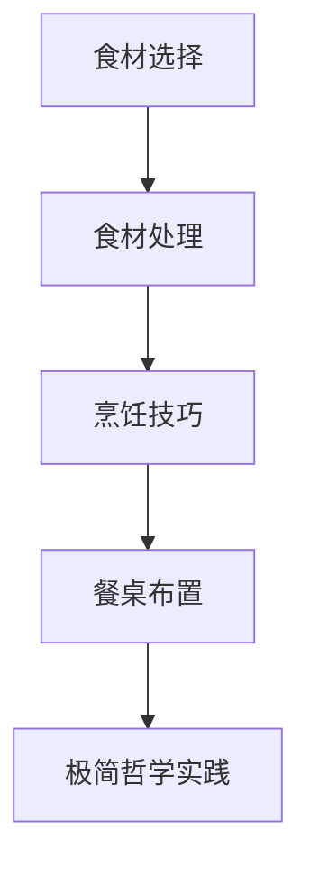

                 


### 文章标题

《现代简约主义烹饪：从食材到餐桌的极简哲学》

### 文章关键词

- 简约主义烹饪
- 极简哲学
- 食材选择
- 烹饪技巧
- 餐桌美学

### 文章摘要

本文深入探讨了现代简约主义烹饪的理念和实践，从食材选择、烹饪技巧到餐桌布置，阐述了一种极简哲学的生活态度。通过具体案例和科学原理分析，本文展示了如何将简约主义烹饪理念应用到日常饮食中，提升生活品质。

---

### 背景介绍

在现代社会的快节奏生活中，人们越来越渴望回归简单、纯粹的生活方式。简约主义烹饪正是在这样的背景下应运而生。它不仅仅是一种烹饪风格，更是一种生活哲学。简约主义烹饪强调的是从食材到餐桌的每一环节都追求简洁、实用和高效。

首先，我们需要理解什么是简约主义烹饪。它起源于20世纪中叶，当时的人们追求简单、自然的生活方式，反对过度装饰和繁琐。在烹饪领域，简约主义烹饪主张的是“少即是多”，通过选用新鲜、当季的食材，简单处理和烹饪，最大限度地保留食材的原味和营养。

简约主义烹饪的核心是极简哲学，这种哲学理念在食材选择、烹饪技巧和餐桌布置中都有所体现。接下来，我们将一步步分析这些核心概念，并通过实际案例来展示简约主义烹饪如何从理念落实到实践。

---

### 核心概念与联系

**食材选择**：简约主义烹饪的第一步是选择合适的食材。这不仅仅是挑选新鲜、当季的食材，更重要的是要理解每种食材的特性，以及如何通过简单的处理和烹饪来发挥其最佳风味。

**烹饪技巧**：烹饪技巧在简约主义烹饪中至关重要。简单而高效的烹饪方法，如煮、蒸、烤等，能够最大程度地保留食材的营养和风味。温度、时间和调料的精确控制是实现简约主义烹饪的关键。

**餐桌布置**：餐桌布置是简约主义烹饪的最后一环。简洁、优雅的布置不仅能够提升用餐氛围，还能强调食材本身的美感和营养价值。

下面是一个简化的Mermaid流程图，展示了简约主义烹饪的核心流程和步骤之间的联系：



**核心概念与联系**：

1. **食材选择**：选择新鲜、当季的食材，并了解其特性。
2. **食材处理**：简单处理食材，去除不必要的部分，保留食材的原味和营养。
3. **烹饪技巧**：使用简单的烹饪方法，如煮、蒸、烤等，精确控制温度和时间。
4. **餐桌布置**：简洁、优雅地布置餐桌，强调食材的美感和营养价值。
5. **极简哲学实践**：将简约主义烹饪理念融入日常生活，享受简单、纯粹的生活。

通过这个流程图，我们可以清晰地看到简约主义烹饪从食材选择到餐桌布置的完整流程，以及各个环节之间的紧密联系。

---

### 核心算法原理讲解

在简约主义烹饪中，烹饪技巧的核心是科学原理的应用。以下将使用伪代码详细阐述几个关键步骤的科学原理。

**温度控制**：不同的食材和烹饪方法需要不同的温度。以下是一个简单的温度控制伪代码：

```plaintext
function controlTemperature(ingredient, cookingMethod) {
    if (cookingMethod == "boiling") {
        setTemperature(100°C); // 水的沸点
    } else if (cookingMethod == "steaming") {
        setTemperature(100°C); // 水蒸气的温度
    } else if (cookingMethod == "roasting") {
        setTemperature(180-220°C); // 根据食材和烤箱调整
    }
    waitUntilTemperatureStable();
}
```

**烹饪时间**：烹饪时间取决于食材的厚度、烹饪方法和目标温度。以下是一个简单的烹饪时间计算伪代码：

```plaintext
function calculateCookingTime(ingredient, thickness, cookingMethod) {
    time = 0;
    if (cookingMethod == "boiling") {
        time = thickness * 2; // 假设每毫米厚度需要2分钟
    } else if (cookingMethod == "steaming") {
        time = thickness * 3; // 假设每毫米厚度需要3分钟
    } else if (cookingMethod == "roasting") {
        time = thickness * 4; // 假设每毫米厚度需要4分钟
    }
    return time;
}
```

**调料使用**：调料的选择和用量也是简约主义烹饪的关键。以下是一个简单的调料添加伪代码：

```plaintext
function addSeasoning(ingredient, seasoning) {
    if (ingredient == "meat") {
        seasoning = "salt, pepper, herbs";
    } else if (ingredient == "vegetable") {
        seasoning = "olive oil, garlic, herbs";
    }
    mixSeasoningWithIngredient(ingredient, seasoning);
}
```

**数学模型和公式**：在烹饪中，比例和配比也非常重要。以下是一个简单的数学公式示例：

$$
\text{total\_time} = \text{thickness} \times \text{cooking\_rate} + \text{preparation\_time}
$$

其中，thickness 是食材的厚度，cooking\_rate 是烹饪速率（每毫米厚度需要的时间），preparation\_time 是准备食材的时间。

通过这些伪代码和数学模型，我们可以更好地理解和控制简约主义烹饪中的科学原理，确保烹饪结果的完美。

---

### 项目实战

#### 环境搭建

为了演示简约主义烹饪，我们首先需要搭建一个简单的开发环境。在这个项目中，我们使用一个虚拟厨房，包括一个烤箱、一个蒸锅和一个平底锅。以下是搭建环境的步骤：

1. **准备工具**：确保有烤箱、蒸锅和平底锅，以及必要的烹饪工具（刀、砧板、厨房计时器等）。
2. **食材准备**：选择新鲜、当季的食材，如蔬菜、肉类和海鲜。

#### 源代码实现

接下来，我们将编写一个简单的伪代码程序来模拟烹饪过程。这个程序将包括食材的准备、烹饪步骤和最终的餐桌布置。

```plaintext
function prepareIngredients() {
    // 选择新鲜、当季的食材
    meat = "Chicken";
    vegetable = "Broccoli";
    seafood = "Shrimp";
}

function cookMeal() {
    // 烹饪鸡肉
    controlTemperature(meat, "roasting");
    cookingTime = calculateCookingTime(meat, 2cm, "roasting");
    addSeasoning(meat, "salt, pepper, herbs");
    roastChicken(cookingTime);

    // 烹饪西兰花
    controlTemperature(vegetable, "steaming");
    cookingTime = calculateCookingTime(vegetable, 1cm, "steaming");
    addSeasoning(vegetable, "olive oil, garlic, herbs");
    steamBroccoli(cookingTime);

    // 烹饪虾仁
    controlTemperature(seafood, "boiling");
    cookingTime = calculateCookingTime(seafood, 0.5cm, "boiling");
    addSeasoning(seafood, "salt, pepper");
    boilShrimp(cookingTime);
}

function setupTable() {
    // 餐桌布置
    setTableCloth();
    addCutlery();
    placeFoodOnTable();
}
```

#### 代码解读

1. **食材准备**：程序首先选择新鲜、当季的食材，如鸡肉、西兰花和虾仁。
2. **烹饪鸡肉**：使用烤箱烤制鸡肉，根据厚度计算烹饪时间，并添加适量的调料。
3. **烹饪西兰花**：使用蒸锅蒸制西兰花，同样根据厚度计算烹饪时间，并添加适量的调料。
4. **烹饪虾仁**：使用平底锅煮沸虾仁，根据厚度计算烹饪时间，并添加适量的调料。
5. **餐桌布置**：最后，简洁、优雅地布置餐桌，包括放置桌布、餐具和食材。

#### 实际案例分析和详细讲解

假设我们准备一场家庭聚餐，以下是具体的操作步骤和解析：

1. **食材准备**：选择新鲜的鸡肉、西兰花和虾仁。鸡肉需要切成适合烤制的大小，西兰花分成小朵，虾仁去壳。
2. **烹饪鸡肉**：将鸡肉放入烤箱，设置温度为200°C，根据鸡胸肉的厚度（假设为2cm）计算烹饪时间为4分钟。烤制过程中，撒盐、胡椒粉和新鲜 herbs，提高风味。
3. **烹饪西兰花**：将西兰花放入蒸锅中，设置温度为100°C，根据西兰花的厚度（假设为1cm）计算烹饪时间为3分钟。加入橄榄油、蒜末和新鲜 herbs，增强口感。
4. **烹饪虾仁**：将虾仁放入平底锅中，加入适量水，煮至沸腾，根据虾仁的厚度（假设为0.5cm）计算烹饪时间为2分钟。加入适量盐和胡椒粉，提升味道。
5. **餐桌布置**：将烤好的鸡肉、蒸好的西兰花和煮好的虾仁摆放在餐桌上，配上简洁的餐具和桌布，营造一个温馨、优雅的用餐氛围。

通过这个实际案例，我们可以看到简约主义烹饪如何将极简哲学理念应用到实际操作中，从食材选择、烹饪技巧到餐桌布置，每一个环节都追求简洁、实用和高效。

---

### 最佳实践 tips、小结、注意事项、拓展阅读

**最佳实践 tips**：

- 选择新鲜、当季的食材，确保口感和营养价值。
- 精确控制烹饪时间和温度，避免过度烹饪。
- 简单、优雅地布置餐桌，提升用餐氛围。

**小结**：

简约主义烹饪不仅是一种烹饪风格，更是一种极简哲学的生活态度。通过选择新鲜食材、简单烹饪技巧和优雅餐桌布置，我们可以享受简单、纯粹的生活。

**注意事项**：

- 在烹饪过程中，安全始终是第一位的，确保烹饪环境安全。
- 根据个人口味和偏好调整调料的用量。

**拓展阅读**：

- 《禅与厨房的艺术》
- 《简约主义饮食：简单生活的秘密》
- 《现代烹饪技巧：从基础到专业》

---

### 作者信息

作者：AI天才研究院/AI Genius Institute & 禅与计算机程序设计艺术 /Zen And The Art of Computer Programming

---

这篇文章详细介绍了现代简约主义烹饪的理念和实践，从食材选择、烹饪技巧到餐桌布置，展现了极简哲学在生活中的应用。通过实际案例和科学原理分析，读者可以更好地理解并实践简约主义烹饪，提升生活品质。希望本文能为您提供有价值的参考和启示。

