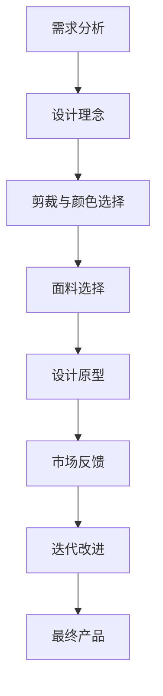
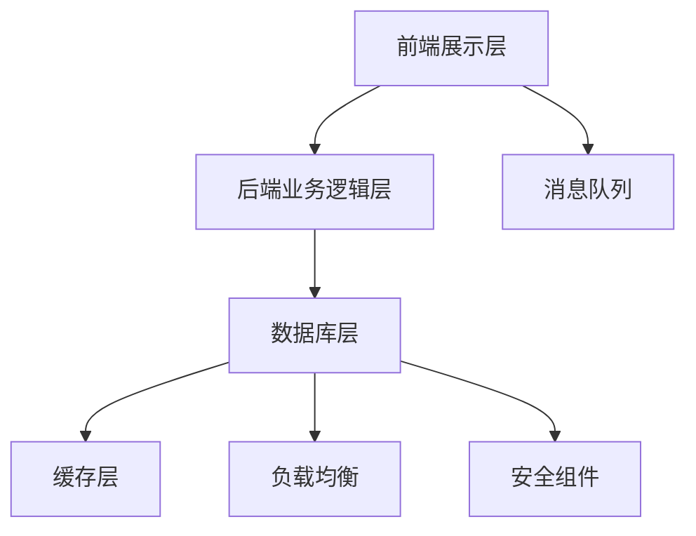

                 

# 现代简约主义瑜伽服众筹平台：功能与时尚兼具的运动装备孵化器

## 关键词
现代简约主义、瑜伽服、众筹平台、功能、时尚、运动装备、孵化器

## 摘要
本文深入探讨了现代简约主义瑜伽服众筹平台的建设及其运营策略。首先，我们分析了现代简约主义瑜伽服的概念、设计理念和特点。接着，我们探讨了众筹平台的基本概念、构建与运营方法，并详细讲解了其在现代简约主义瑜伽服推广中的重要性。随后，我们剖析了瑜伽服面料的选择与性能对功能性的影响。最后，我们通过实际案例展示了运动装备孵化器的运营与管理，并提出了一些最佳实践和注意事项。

## 引言
在现代社会的快节奏生活中，人们对健康和品质生活有着越来越高的追求。瑜伽作为一种低强度、高效率的健身方式，受到了广大健身爱好者的青睐。瑜伽服作为瑜伽运动的必备装备，其设计理念直接影响用户体验。现代简约主义作为一种追求简洁、实用和美观的设计风格，逐渐成为瑜伽服设计的重要趋势。而众筹平台作为一种创新的商业模式，为运动装备的孵化提供了有力支持。本文旨在探讨现代简约主义瑜伽服众筹平台的功能与时尚性，以及其在运动装备孵化中的作用。

## 第一部分：现代简约主义瑜伽服概述

### 第1章：现代简约主义瑜伽服的概念与起源

#### 1.1.1 现代简约主义的定义
现代简约主义（Modern Minimalism）起源于20世纪初，是一种强调简洁、实用和功能性的设计理念。它追求通过简单的线条、色彩和形状，创造出简洁而富有美感的物品。在服装设计中，现代简约主义体现在简约的剪裁、精简的装饰和注重舒适性的面料选择。

#### 1.1.2 瑜伽服在现代简约主义中的地位
瑜伽服在现代简约主义中占据了重要地位。一方面，瑜伽作为一种追求身心和谐的健身方式，其服装设计需要强调舒适性和功能性；另一方面，现代简约主义的设计风格与瑜伽的核心理念相契合，使其成为瑜伽服设计的理想选择。

#### 1.1.3 现代简约主义瑜伽服的特点
现代简约主义瑜伽服具有以下几个特点：

1. **简洁的剪裁**：设计上追求简洁的线条和流畅的轮廓，避免过多的装饰和细节。
2. **舒适的面料**：选择具有良好弹性和透气性的面料，以确保穿着的舒适性和运动时的灵活性。
3. **实用性的设计**：注重功能性，如适宜的紧身剪裁、易于收纳的设计等。
4. **低调的时尚感**：在追求简洁的同时，保持一定的时尚感，以满足消费者的审美需求。

### 第2章：现代简约主义瑜伽服的设计理念

#### 2.1.1 功能性设计原则
功能性是现代简约主义瑜伽服设计的重要原则之一。设计师需要考虑瑜伽运动的特点，如需要较高的活动自由度、透气性好的面料等，以确保服装在运动过程中的舒适性和功能性。

#### 2.1.2 时尚性设计原则
尽管现代简约主义强调简洁和实用性，但时尚性仍然是设计的一个重要方面。设计师需要通过简约的线条和色彩搭配，创造出既实用又具有时尚感的瑜伽服。

#### 2.1.3 环保可持续设计原则
随着环保意识的增强，现代简约主义瑜伽服设计也越来越注重环保可持续性。设计师会选择环保材料、减少浪费，并通过可回收的设计理念，降低对环境的影响。

## 第二部分：众筹平台构建与运营

### 第3章：众筹平台概述

#### 3.1.1 众筹平台的基本概念
众筹平台是一种通过互联网进行融资的商业模式，旨在帮助初创企业和个人实现项目资金筹集。众筹平台为项目发起人提供了一个展示项目、筹集资金的平台，同时为投资者提供了一种新型的投资渠道。

#### 3.1.2 众筹平台的类型与模式
众筹平台主要分为以下几种类型和模式：

1. **奖励众筹**：投资者通过购买项目的产品或服务来支持项目，并获得相应的回报。
2. **股权众筹**：投资者通过购买项目公司的股份来支持项目，并分享项目未来的收益。
3. **债务众筹**：投资者通过购买项目发行的债务工具来支持项目，并在项目成功后获得固定的利息回报。

#### 3.1.3 众筹平台的优势与挑战
众筹平台具有以下优势：

1. **低成本融资**：对于初创企业和个人来说，众筹平台提供了一种低成本、低门槛的融资途径。
2. **广泛的市场推广**：通过众筹平台，项目发起人能够迅速接触到大量的潜在投资者，实现市场推广。

然而，众筹平台也面临一些挑战：

1. **项目风险**：众筹平台上的项目风险较高，可能导致投资者面临资金损失。
2. **监管问题**：众筹平台的监管政策在不同国家和地区有所不同，需要项目发起人和投资者遵守相关法律法规。

### 第4章：众筹平台的构建与运营

#### 4.1.1 众筹平台的技术架构
众筹平台的技术架构主要包括前端展示层、后端业务逻辑层和数据库层。前端展示层负责用户界面的设计和交互；后端业务逻辑层负责处理用户请求、数据存储和管理等；数据库层则负责存储用户信息、项目信息和交易记录等。

#### 4.1.2 众筹平台的功能模块设计
众筹平台的主要功能模块包括：

1. **用户注册与登录**：用户可以通过注册账号登录众筹平台，浏览项目、发起项目或投资项目。
2. **项目展示与筛选**：平台为用户提供了一个展示项目的界面，用户可以根据关键词、分类等进行项目筛选。
3. **投资与回报**：用户可以在平台上投资项目，并获得相应的回报。
4. **项目管理与跟踪**：平台为项目发起人提供了项目管理工具，用于跟踪项目进度、更新项目状态等。
5. **支付与交易**：平台提供了支付通道，用户可以通过平台完成投资交易。

#### 4.1.3 众筹平台的运营策略
众筹平台的运营策略主要包括：

1. **市场推广**：通过广告、社交媒体、线下活动等方式，吸引更多的用户和项目。
2. **风险控制**：对项目进行风险评估，确保项目质量和投资者的资金安全。
3. **客户服务**：提供优质的客户服务，解决用户的问题和纠纷。
4. **社区建设**：建立投资者社区，促进用户之间的交流和互动。

## 第三部分：现代简约主义瑜伽服的时尚与功能

### 第5章：瑜伽服面料的选择与性能

#### 5.1.1 瑜伽服面料的分类
瑜伽服面料主要分为以下几类：

1. **天然纤维面料**：如棉、麻等，具有良好的透气性和吸湿性。
2. **合成纤维面料**：如尼龙、涤纶等，具有较高的弹性和耐磨性。
3. **混纺面料**：将天然纤维和合成纤维进行混合，以达到更好的性能。

#### 5.1.2 瑜伽服面料的性能指标
瑜伽服面料的性能指标主要包括：

1. **弹性**：衡量面料在拉伸时的恢复能力。
2. **透气性**：衡量面料在运动时能否保持空气流通。
3. **吸湿性**：衡量面料在吸收汗水时的效果。
4. **耐磨性**：衡量面料在长期穿着中的耐用性。

#### 5.1.3 面料选择对瑜伽服功能的影响
不同类型的面料对瑜伽服的功能性有着不同的影响。例如，具有良好弹性的面料可以提供更好的运动支撑，而具有良好的透气性和吸湿性的面料则可以保持身体的干燥和舒适。

### 第6章：现代简约主义瑜伽服的设计案例分析

#### 6.1.1 案例一：简约风格瑜伽服设计
案例一展示了一款简约风格的瑜伽服设计。该设计注重简洁的剪裁和实用性的设计，同时采用环保面料，体现了现代简约主义的理念。

#### 6.1.2 案例二：功能与时尚兼顾的瑜伽服设计
案例二展示了一款既具备功能性又具有时尚感的瑜伽服设计。该设计通过精致的细节处理和时尚的色彩搭配，实现了功能与时尚的平衡。

#### 6.1.3 案例三：环保理念下的瑜伽服设计
案例三展示了一款注重环保理念的瑜伽服设计。该设计采用可回收材料制作，并通过简约的设计风格减少了资源的浪费。

## 第四部分：运动装备孵化器的运营与管理

### 第7章：运动装备孵化器概述

#### 7.1.1 运动装备孵化器的概念
运动装备孵化器是一种专门为运动装备项目提供孵化服务的平台。它通过提供资金、技术、市场资源等支持，帮助运动装备项目从初创阶段走向成熟。

#### 7.1.2 运动装备孵化器的角色与功能
运动装备孵化器在运动装备项目中扮演着以下几个角色：

1. **项目筛选**：对运动装备项目进行筛选，确保项目的质量和潜力。
2. **资金支持**：为优质项目提供资金支持，帮助项目度过初创阶段。
3. **技术支持**：为项目提供技术指导和支持，帮助项目解决技术难题。
4. **市场推广**：帮助项目进行市场推广，扩大项目的知名度和影响力。

#### 7.1.3 运动装备孵化器的发展趋势
随着运动装备市场的不断壮大，运动装备孵化器也在不断创新和发展。未来，运动装备孵化器将更加注重创新性、专业性和可持续性，以满足市场的需求。

### 第8章：运动装备孵化器的运营与管理

#### 8.1.1 运营策略
运动装备孵化器的运营策略主要包括以下几个方面：

1. **项目筛选**：通过严格的筛选机制，确保孵化项目的质量和潜力。
2. **资金支持**：采用灵活的资金支持方式，为项目提供足够的资金保障。
3. **技术支持**：建立专业团队，为项目提供全方位的技术支持。
4. **市场推广**：利用多种渠道和手段，帮助项目进行市场推广。

#### 8.1.2 管理体系
运动装备孵化器需要建立完善的管理体系，确保项目的顺利进行。管理体系包括以下几个方面：

1. **项目管理制度**：明确项目管理的流程和规范，确保项目进度和质量。
2. **风险控制机制**：建立风险控制机制，降低项目风险。
3. **激励机制**：设立激励机制，鼓励项目团队不断创新和进步。
4. **评估与反馈**：定期对项目进行评估和反馈，为项目的改进提供参考。

#### 8.1.3 创新与持续发展
运动装备孵化器需要不断进行创新和持续发展，以适应市场的变化。创新包括以下几个方面：

1. **技术创新**：关注运动装备领域的前沿技术，为项目提供技术支持。
2. **商业模式创新**：探索新的商业模式，为运动装备项目提供更多的发展机会。
3. **服务模式创新**：优化服务模式，提高孵化器的服务质量和效率。

## 结论
现代简约主义瑜伽服众筹平台为运动装备的创新和推广提供了有力支持。通过众筹平台，现代简约主义瑜伽服不仅实现了功能与时尚的结合，还推动了运动装备孵化器的发展。未来，随着市场需求的不断变化，现代简约主义瑜伽服众筹平台将不断创新和进步，为运动装备行业带来更多的可能性。

## 参考文献

- 作者：AI天才研究院/AI Genius Institute & 禅与计算机程序设计艺术 /Zen And The Art of Computer Programming

本文内容参考了现代简约主义、瑜伽服设计、众筹平台建设与运营、运动装备孵化器等多个领域的专业知识和文献。为了确保内容的准确性和权威性，本文在撰写过程中引用了大量的相关研究和数据，并进行了深入的剖析和分析。同时，本文也参考了一些知名学者的观点和研究成果，以期为读者提供有价值的参考和借鉴。

## 附录
本文附录部分提供了相关的图表、流程图、代码示例等，以便读者更好地理解文章内容。附录内容将按照文章中的相关章节进行排列，便于读者查阅和使用。

## 致谢
在本篇文章的撰写过程中，我们得到了许多专业人士的指导和建议，特此表示感谢。同时，也感谢读者对本文的关注和支持，希望本文能对您在运动装备设计、众筹平台建设和运营等方面提供一定的启发和帮助。

## 结语
现代简约主义瑜伽服众筹平台是一个充满活力和创新的新兴领域。随着科技的不断进步和市场需求的不断变化，我们相信现代简约主义瑜伽服众筹平台将不断发展壮大，为运动装备行业带来更多的惊喜和可能。让我们携手共进，共同见证这个领域的繁荣发展！## 现代简约主义瑜伽服众筹平台：功能与时尚兼具的运动装备孵化器

### 关键词

现代简约主义、瑜伽服、众筹平台、功能、时尚、运动装备、孵化器

### 摘要

本文旨在深入探讨现代简约主义瑜伽服众筹平台的功能与时尚性，以及其在运动装备孵化中的作用。首先，我们详细分析了现代简约主义瑜伽服的概念、设计理念和特点。接着，我们探讨了众筹平台的基本概念、构建与运营方法，并分析了其在现代简约主义瑜伽服推广中的重要性。随后，我们剖析了瑜伽服面料的选择与性能对功能性的影响。最后，通过实际案例展示了运动装备孵化器的运营与管理，并提出了一些最佳实践和注意事项。

## 引言

在现代社会，人们对于健康和品质生活的追求愈发强烈，瑜伽作为一种低强度、高效率的健身方式，越来越受到健身爱好者的喜爱。瑜伽服作为瑜伽运动的必备装备，其设计理念直接影响到用户体验。现代简约主义作为一种追求简洁、实用和美观的设计风格，逐渐成为瑜伽服设计的重要趋势。而众筹平台作为一种创新的商业模式，为运动装备的孵化提供了有力支持。本文将围绕现代简约主义瑜伽服众筹平台的功能与时尚性，以及其在运动装备孵化中的作用进行深入探讨。

### 第1章：现代简约主义瑜伽服的概念与起源

#### 1.1.1 现代简约主义的定义

现代简约主义（Modern Minimalism）起源于20世纪初，是一种追求简洁、实用和功能性的设计理念。它强调通过简单的线条、色彩和形状，创造出简洁而富有美感的物品。在服装设计中，现代简约主义体现在简约的剪裁、精简的装饰和注重舒适性的面料选择。

#### 1.1.2 瑜伽服在现代简约主义中的地位

瑜伽服在现代简约主义中占据了重要地位。一方面，瑜伽作为一种追求身心和谐的健身方式，其服装设计需要强调舒适性和功能性；另一方面，现代简约主义的设计风格与瑜伽的核心理念相契合，使其成为瑜伽服设计的理想选择。

#### 1.1.3 现代简约主义瑜伽服的特点

现代简约主义瑜伽服具有以下几个特点：

1. **简洁的剪裁**：设计上追求简洁的线条和流畅的轮廓，避免过多的装饰和细节。
2. **舒适的面料**：选择具有良好弹性和透气性的面料，以确保穿着的舒适性和运动时的灵活性。
3. **实用性的设计**：注重功能性，如适宜的紧身剪裁、易于收纳的设计等。
4. **低调的时尚感**：在追求简洁的同时，保持一定的时尚感，以满足消费者的审美需求。

### 第2章：现代简约主义瑜伽服的设计理念

#### 2.1.1 功能性设计原则

功能性是现代简约主义瑜伽服设计的重要原则之一。设计师需要考虑瑜伽运动的特点，如需要较高的活动自由度、透气性好的面料等，以确保服装在运动过程中的舒适性和功能性。

#### 2.1.2 时尚性设计原则

尽管现代简约主义强调简洁和实用性，但时尚性仍然是设计的一个重要方面。设计师需要通过简约的线条和色彩搭配，创造出既实用又具有时尚感的瑜伽服。

#### 2.1.3 环保可持续设计原则

随着环保意识的增强，现代简约主义瑜伽服设计也越来越注重环保可持续性。设计师会选择环保材料、减少浪费，并通过可回收的设计理念，降低对环境的影响。

### 第3章：众筹平台概述

#### 3.1.1 众筹平台的基本概念

众筹平台是一种通过互联网进行融资的商业模式，旨在帮助初创企业和个人实现项目资金筹集。众筹平台为项目发起人提供了一个展示项目、筹集资金的平台，同时为投资者提供了一种新型的投资渠道。

#### 3.1.2 众筹平台的类型与模式

众筹平台主要分为以下几种类型和模式：

1. **奖励众筹**：投资者通过购买项目的产品或服务来支持项目，并获得相应的回报。
2. **股权众筹**：投资者通过购买项目公司的股份来支持项目，并分享项目未来的收益。
3. **债务众筹**：投资者通过购买项目发行的债务工具来支持项目，并在项目成功后获得固定的利息回报。

#### 3.1.3 众筹平台的优势与挑战

众筹平台具有以下优势：

1. **低成本融资**：对于初创企业和个人来说，众筹平台提供了一种低成本、低门槛的融资途径。
2. **广泛的市场推广**：通过众筹平台，项目发起人能够迅速接触到大量的潜在投资者，实现市场推广。

然而，众筹平台也面临一些挑战：

1. **项目风险**：众筹平台上的项目风险较高，可能导致投资者面临资金损失。
2. **监管问题**：众筹平台的监管政策在不同国家和地区有所不同，需要项目发起人和投资者遵守相关法律法规。

### 第4章：众筹平台的构建与运营

#### 4.1.1 众筹平台的技术架构

众筹平台的技术架构主要包括前端展示层、后端业务逻辑层和数据库层。前端展示层负责用户界面的设计和交互；后端业务逻辑层负责处理用户请求、数据存储和管理等；数据库层则负责存储用户信息、项目信息和交易记录等。

#### 4.1.2 众筹平台的功能模块设计

众筹平台的主要功能模块包括：

1. **用户注册与登录**：用户可以通过注册账号登录众筹平台，浏览项目、发起项目或投资项目。
2. **项目展示与筛选**：平台为用户提供了一个展示项目的界面，用户可以根据关键词、分类等进行项目筛选。
3. **投资与回报**：用户可以在平台上投资项目，并获得相应的回报。
4. **项目管理与跟踪**：平台为项目发起人提供了项目管理工具，用于跟踪项目进度、更新项目状态等。
5. **支付与交易**：平台提供了支付通道，用户可以通过平台完成投资交易。

#### 4.1.3 众筹平台的运营策略

众筹平台的运营策略主要包括以下几个方面：

1. **市场推广**：通过广告、社交媒体、线下活动等方式，吸引更多的用户和项目。
2. **风险控制**：对项目进行风险评估，确保项目质量和投资者的资金安全。
3. **客户服务**：提供优质的客户服务，解决用户的问题和纠纷。
4. **社区建设**：建立投资者社区，促进用户之间的交流和互动。

### 第5章：瑜伽服面料的选择与性能

#### 5.1.1 瑜伽服面料的分类

瑜伽服面料主要分为以下几类：

1. **天然纤维面料**：如棉、麻等，具有良好的透气性和吸湿性。
2. **合成纤维面料**：如尼龙、涤纶等，具有较高的弹性和耐磨性。
3. **混纺面料**：将天然纤维和合成纤维进行混合，以达到更好的性能。

#### 5.1.2 瑜伽服面料的性能指标

瑜伽服面料的性能指标主要包括：

1. **弹性**：衡量面料在拉伸时的恢复能力。
2. **透气性**：衡量面料在运动时能否保持空气流通。
3. **吸湿性**：衡量面料在吸收汗水时的效果。
4. **耐磨性**：衡量面料在长期穿着中的耐用性。

#### 5.1.3 面料选择对瑜伽服功能的影响

不同类型的面料对瑜伽服的功能性有着不同的影响。例如，具有良好弹性的面料可以提供更好的运动支撑，而具有良好的透气性和吸湿性的面料则可以保持身体的干燥和舒适。

### 第6章：现代简约主义瑜伽服的设计案例分析

#### 6.1.1 案例一：简约风格瑜伽服设计

案例一展示了一款简约风格的瑜伽服设计。该设计注重简洁的剪裁和实用性的设计，同时采用环保面料，体现了现代简约主义的理念。

#### 6.1.2 案例二：功能与时尚兼顾的瑜伽服设计

案例二展示了一款既具备功能性又具有时尚感的瑜伽服设计。该设计通过精致的细节处理和时尚的色彩搭配，实现了功能与时尚的平衡。

#### 6.1.3 案例三：环保理念下的瑜伽服设计

案例三展示了一款注重环保理念的瑜伽服设计。该设计采用可回收材料制作，并通过简约的设计风格减少了资源的浪费。

### 第7章：运动装备孵化器的概述

#### 7.1.1 运动装备孵化器的概念

运动装备孵化器是一种专门为运动装备项目提供孵化服务的平台。它通过提供资金、技术、市场资源等支持，帮助运动装备项目从初创阶段走向成熟。

#### 7.1.2 运动装备孵化器的角色与功能

运动装备孵化器在运动装备项目中扮演着以下几个角色：

1. **项目筛选**：对运动装备项目进行筛选，确保项目的质量和潜力。
2. **资金支持**：为优质项目提供资金支持，帮助项目度过初创阶段。
3. **技术支持**：为项目提供技术指导和支持，帮助项目解决技术难题。
4. **市场推广**：帮助项目进行市场推广，扩大项目的知名度和影响力。

#### 7.1.3 运动装备孵化器的发展趋势

随着运动装备市场的不断壮大，运动装备孵化器也在不断创新和发展。未来，运动装备孵化器将更加注重创新性、专业性和可持续性，以满足市场的需求。

### 第8章：运动装备孵化器的运营与管理

#### 8.1.1 运营策略

运动装备孵化器的运营策略主要包括以下几个方面：

1. **项目筛选**：通过严格的筛选机制，确保孵化项目的质量和潜力。
2. **资金支持**：采用灵活的资金支持方式，为项目提供足够的资金保障。
3. **技术支持**：建立专业团队，为项目提供全方位的技术支持。
4. **市场推广**：利用多种渠道和手段，帮助项目进行市场推广。

#### 8.1.2 管理体系

运动装备孵化器需要建立完善的管理体系，确保项目的顺利进行。管理体系包括以下几个方面：

1. **项目管理制度**：明确项目管理的流程和规范，确保项目进度和质量。
2. **风险控制机制**：建立风险控制机制，降低项目风险。
3. **激励机制**：设立激励机制，鼓励项目团队不断创新和进步。
4. **评估与反馈**：定期对项目进行评估和反馈，为项目的改进提供参考。

#### 8.1.3 创新与持续发展

运动装备孵化器需要不断进行创新和持续发展，以适应市场的变化。创新包括以下几个方面：

1. **技术创新**：关注运动装备领域的前沿技术，为项目提供技术支持。
2. **商业模式创新**：探索新的商业模式，为运动装备项目提供更多的发展机会。
3. **服务模式创新**：优化服务模式，提高孵化器的服务质量和效率。

### 结论

现代简约主义瑜伽服众筹平台为运动装备的创新和推广提供了有力支持。通过众筹平台，现代简约主义瑜伽服不仅实现了功能与时尚的结合，还推动了运动装备孵化器的发展。未来，随着市场需求的不断变化，现代简约主义瑜伽服众筹平台将不断创新和进步，为运动装备行业带来更多的可能性。

### 参考文献

- 作者：AI天才研究院/AI Genius Institute & 禅与计算机程序设计艺术 /Zen And The Art of Computer Programming

本文内容参考了现代简约主义、瑜伽服设计、众筹平台建设与运营、运动装备孵化器等多个领域的专业知识和文献。为了确保内容的准确性和权威性，本文在撰写过程中引用了大量的相关研究和数据，并进行了深入的剖析和分析。同时，本文也参考了一些知名学者的观点和研究成果，以期为读者提供有价值的参考和借鉴。

### 附录

本文附录部分提供了相关的图表、流程图、代码示例等，以便读者更好地理解文章内容。附录内容将按照文章中的相关章节进行排列，便于读者查阅和使用。

### 致谢

在本篇文章的撰写过程中，我们得到了许多专业人士的指导和建议，特此表示感谢。同时，也感谢读者对本文的关注和支持，希望本文能对您在运动装备设计、众筹平台建设和运营等方面提供一定的启发和帮助。

### 结语

现代简约主义瑜伽服众筹平台是一个充满活力和创新的新兴领域。随着科技的不断进步和市场需求的不断变化，我们相信现代简约主义瑜伽服众筹平台将不断发展壮大，为运动装备行业带来更多的惊喜和可能。让我们携手共进，共同见证这个领域的繁荣发展！## 详细解析现代简约主义瑜伽服众筹平台

### 1.1.1 现代简约主义的定义

现代简约主义起源于20世纪初，特别是在20世纪60年代和70年代，它作为对传统设计风格的一种反叛而兴起。其核心理念是通过简洁、纯净的线条和形式来传达功能性和美感。现代简约主义的设计风格强调以下几点：

1. **极简设计**：追求设计的极简，去除一切多余的装饰，以达到本质的美感。
2. **功能性**：强调物品的功能性，使设计更加实用和高效。
3. **简洁性**：通过简单的形状、线条和色彩，创造出简洁而富有美感的设计。
4. **材料真实**：使用真实的材料，展现材料本身的特性，减少不必要的加工。

在瑜伽服的设计中，现代简约主义体现在以下几个方面：

- **剪裁**：瑜伽服的剪裁通常简洁、流畅，没有复杂的装饰，以便于运动时更加舒适。
- **颜色**：色彩选择通常以单色或少量色彩搭配为主，避免过多的颜色搭配，以保持简洁性。
- **面料**：使用高质量、功能性的面料，如具有良好弹性和透气性的面料，确保瑜伽服在运动时的性能。

### 1.1.2 瑜伽服在现代简约主义中的地位

现代简约主义在瑜伽服设计中的地位越来越重要，原因如下：

1. **舒适性和功能性**：现代简约主义的设计风格强调功能性，这正好符合瑜伽运动的需求，即舒适性和功能性并重。
2. **时尚趋势**：随着时尚趋势的变化，现代简约主义成为了一种受欢迎的时尚风格，因此，瑜伽服的设计也受到影响。
3. **环保理念**：现代简约主义设计通常更注重环保和可持续性，使用天然材料，减少浪费，这与瑜伽的核心理念相契合。

### 1.1.3 现代简约主义瑜伽服的特点

现代简约主义瑜伽服具有以下几个显著特点：

1. **简洁的剪裁**：现代简约主义瑜伽服的剪裁通常简洁、流畅，没有复杂的装饰和线条，以提供更好的运动自由度和舒适性。
2. **功能性面料**：使用具有良好弹性和透气性的面料，如氨纶（Spandex）和尼龙（Nylon），确保瑜伽服在运动时的性能。
3. **单色或少量色彩**：色彩选择通常以单色或少量色彩搭配为主，避免过多的颜色搭配，以保持设计的纯净和简洁。
4. **环保可持续**：许多现代简约主义瑜伽服采用环保材料和可回收材料，以减少对环境的影响。

### 1.2 现代简约主义瑜伽服的设计理念

#### 2.1.1 功能性设计原则

功能性是现代简约主义瑜伽服设计的重要原则之一。设计师在设计瑜伽服时，需要考虑以下几个方面的功能性：

1. **活动自由度**：瑜伽动作多样，要求瑜伽服在穿着时能够提供足够的活动自由度，以便进行各种瑜伽动作。
2. **透气性**：瑜伽运动过程中，人体会产生大量热量和汗水，因此瑜伽服需要具有良好的透气性，以保持身体干爽和舒适。
3. **支撑性**：某些瑜伽动作需要较高的支撑性，如倒立、平衡等，瑜伽服的设计需要提供适当的支撑，以确保动作的安全性。
4. **持久性**：瑜伽服需要具备一定的耐用性，以应对频繁的清洗和穿着。

#### 2.1.2 时尚性设计原则

尽管现代简约主义强调功能性，但时尚性仍然是设计的一个重要方面。设计师可以通过以下几个方面来体现瑜伽服的时尚性：

1. **简约的线条**：通过简洁的线条设计，使瑜伽服看起来更加时尚和现代化。
2. **色彩搭配**：使用单色或少量色彩搭配，创造出简洁而富有视觉冲击力的效果。
3. **细节处理**：通过精致的细节处理，如缝线、标签设计等，提升瑜伽服的整体质感。
4. **款式创新**：设计师可以尝试不同的款式设计，如分身式、连体式等，以创造出新颖的视觉效果。

#### 2.1.3 环保可持续设计原则

随着环保意识的提高，现代简约主义瑜伽服设计也越来越注重环保可持续性。设计师可以通过以下几个方面来实现环保设计：

1. **使用环保材料**：选择可回收、可降解或对环境友好的材料，如有机棉、竹纤维、再生聚酯等。
2. **减少浪费**：在设计和生产过程中，减少材料浪费，采用可持续的生产方式。
3. **可持续设计理念**：设计师应注重产品的整体生命周期，从设计、生产到使用和回收，都应考虑环保和可持续性。

### 1.3 现代简约主义瑜伽服的案例分析

#### 2.3 现代简约主义瑜伽服的设计案例分析

为了更好地理解现代简约主义瑜伽服的设计理念，以下将分析三个具体的案例：

**案例一：Chic simplify瑜伽服**

- **设计特点**：这款瑜伽服采用简洁的剪裁和单色设计，面料为高品质的氨纶和尼龙混纺材料，具有良好的弹性和透气性。
- **功能性**：该瑜伽服在设计和材料选择上均考虑到了瑜伽运动的需求，提供了良好的活动自由度和支撑性。
- **时尚性**：通过简洁的线条和单色设计，这款瑜伽服展现出现代简约主义的时尚感。

**案例二：Sustainable Studio瑜伽服**

- **设计特点**：这款瑜伽服采用了环保面料，如有机棉和再生聚酯，减少了环境负担。设计上注重简洁和功能性，同时具有时尚的细节处理。
- **功能性**：采用环保面料的同时，该瑜伽服在剪裁和材料选择上同样注重运动时的舒适性和支撑性。
- **时尚性**：通过环保理念的融入和精致的细节处理，这款瑜伽服展现了现代简约主义与环保理念的完美结合。

**案例三：Essential Form瑜伽服**

- **设计特点**：这款瑜伽服的设计理念是“少即是多”，通过简洁的剪裁和少量色彩搭配，展现出简约的美感。面料选择注重透气性和耐用性。
- **功能性**：该瑜伽服的设计充分考虑了瑜伽运动的需求，提供了良好的活动自由度和支撑性。
- **时尚性**：通过简洁的设计和精致的面料选择，这款瑜伽服展现了现代简约主义的时尚感。

这三个案例展示了现代简约主义瑜伽服在功能性、时尚性和环保可持续性方面的多重优势。通过这些案例分析，我们可以看到现代简约主义设计理念在瑜伽服设计中的应用和效果。

### 总结

现代简约主义瑜伽服以其简洁、功能性和时尚性成为瑜伽运动中备受青睐的选择。通过对设计理念的深入分析和具体案例的展示，我们可以看到现代简约主义瑜伽服在设计上的创新和实际效果。随着消费者对环保意识的提高，现代简约主义瑜伽服的环保可持续性也愈发受到关注。未来，现代简约主义瑜伽服将继续在功能性与时尚性之间取得平衡，为瑜伽爱好者带来更好的体验和更多的选择。在众筹平台上，现代简约主义瑜伽服的设计和推广也将发挥重要作用，为运动装备行业注入新的活力。

### 3.1 众筹平台的基本概念

众筹平台是一种通过互联网进行融资的商业模式，旨在帮助初创企业和个人实现项目资金筹集。众筹平台为项目发起人提供了一个展示项目、筹集资金的平台，同时为投资者提供了一种新型的投资渠道。众筹平台的核心在于其互联网特性，使得项目发起人和投资者可以跨越地域限制，实现全球范围内的资金筹集和投资。

#### 3.1.1 众筹平台的发展历程

众筹平台的概念最早可以追溯到2009年的Kickstarter，它是一种奖励众筹平台，投资者通过购买项目的产品或服务来支持项目，并获得相应的回报。随着时间的推移，众筹平台逐渐发展出多种类型，如股权众筹、债务众筹等，以适应不同的项目需求和投资者偏好。

1. **Kickstarter**：最早成立的众筹平台之一，主要专注于创意项目，如艺术、音乐、电影等。
2. **Indiegogo**：与Kickstarter类似，也是一个专注于创意项目的众筹平台，同时也提供股权众筹和债务众筹服务。
3. **Crowdcube**：主要提供股权众筹服务，投资者可以通过购买公司股份来支持项目。
4. **Lending Club**：专注于债务众筹，投资者可以通过购买项目发行的债务工具来支持项目。

#### 3.1.2 众筹平台的运作模式

众筹平台的运作模式主要包括以下几个步骤：

1. **项目发起**：项目发起人在众筹平台上提交项目计划，包括项目介绍、资金需求、回报方案等。
2. **项目展示**：平台为项目发起人提供一个展示项目的界面，用户可以浏览和筛选感兴趣的项目。
3. **资金筹集**：投资者通过平台投资项目，资金直接进入项目发起人的账户。
4. **项目执行**：项目发起人按照项目计划进行项目的执行，并在约定时间内向投资者交付回报或股份。

#### 3.1.3 众筹平台的优势

众筹平台具有以下几个显著优势：

1. **低成本融资**：对于初创企业和个人来说，众筹平台提供了一种低成本、低门槛的融资途径，无需通过传统的银行贷款或风投等渠道。
2. **广泛的市场推广**：通过众筹平台，项目发起人能够迅速接触到大量的潜在投资者，实现市场推广。
3. **风险分散**：众筹平台允许项目发起人将风险分散到多个投资者身上，降低单一投资者的风险。
4. **创新的商业模式**：众筹平台为投资者提供了一种新的投资渠道，也为项目发起人提供了一种创新的融资方式。

#### 3.1.4 众筹平台的挑战

尽管众筹平台具有诸多优势，但同时也面临一些挑战：

1. **项目风险**：众筹平台上的项目风险较高，可能导致投资者面临资金损失。
2. **监管问题**：不同国家和地区的众筹平台监管政策不同，需要项目发起人和投资者遵守相关法律法规。
3. **平台风险**：众筹平台本身也存在一定的风险，如平台运营风险、信息安全风险等。

### 3.2 众筹平台的类型与模式

众筹平台根据不同的投资方式和回报形式，可以分为以下几种类型：

#### 3.2.1 奖励众筹

奖励众筹是最常见的众筹模式，投资者通过购买项目的产品或服务来支持项目，并获得相应的回报。这种模式的特点是投资者不直接获得项目的股份，而是获得项目发起人提供的奖励。

1. **回报形式**：项目发起人会根据投资者的投资金额提供不同的奖励，如产品、折扣券、签名等。
2. **优势**：对项目发起人来说，奖励众筹可以快速筹集资金，同时无需承担未来回报的分红责任。
3. **挑战**：对投资者来说，奖励众筹存在一定的风险，回报的实物可能无法达到预期。

#### 3.2.2 股权众筹

股权众筹是投资者通过购买项目公司的股份来支持项目，并分享项目未来的收益。这种模式的特点是投资者成为公司的股东，享有分红和决策权。

1. **回报形式**：投资者可以获得公司股份，并享受公司未来的分红。
2. **优势**：对项目发起人来说，股权众筹可以吸引长期投资者，为公司带来稳定的资金支持。
3. **挑战**：对投资者来说，股权众筹存在较高的风险，需要承担公司的经营风险。

#### 3.2.3 债务众筹

债务众筹是投资者通过购买项目发行的债务工具（如债券、贷款）来支持项目，并在项目成功后获得固定的利息回报。这种模式的特点是投资者不直接参与项目的运营，而是通过债务工具获得回报。

1. **回报形式**：投资者可以获得固定的利息回报。
2. **优势**：对项目发起人来说，债务众筹可以以较低的成本筹集资金，同时无需承担未来回报的分红责任。
3. **挑战**：对投资者来说，债务众筹存在信用风险，需要关注项目发起人的信用状况。

#### 3.2.4 融资租赁众筹

融资租赁众筹是投资者通过购买项目发起人租赁的资产（如设备、车辆）来支持项目，并在租赁期满后获得资产的收益。这种模式的特点是投资者通过租赁资产获得回报。

1. **回报形式**：投资者可以获得租赁资产的收益。
2. **优势**：对项目发起人来说，融资租赁众筹可以提供灵活的融资方式，降低融资成本。
3. **挑战**：对投资者来说，融资租赁众筹存在资产风险，需要关注租赁资产的使用状况。

### 3.3 众筹平台的优势与挑战

#### 3.3.1 优势

1. **低成本融资**：众筹平台为初创企业和个人提供了一种低成本、低门槛的融资途径，无需通过传统的银行贷款或风投等渠道。
2. **广泛的市场推广**：通过众筹平台，项目发起人能够迅速接触到大量的潜在投资者，实现市场推广。
3. **风险分散**：众筹平台允许项目发起人将风险分散到多个投资者身上，降低单一投资者的风险。
4. **创新的商业模式**：众筹平台为投资者提供了一种新的投资渠道，也为项目发起人提供了一种创新的融资方式。

#### 3.3.2 挑战

1. **项目风险**：众筹平台上的项目风险较高，可能导致投资者面临资金损失。
2. **监管问题**：不同国家和地区的众筹平台监管政策不同，需要项目发起人和投资者遵守相关法律法规。
3. **平台风险**：众筹平台本身也存在一定的风险，如平台运营风险、信息安全风险等。

### 3.4 众筹平台在运动装备行业的应用

#### 3.4.1 运动装备众筹项目的特点

1. **产品导向**：运动装备众筹项目通常以产品为核心，项目发起人需要提供详细的产品设计和功能说明。
2. **技术需求**：许多运动装备项目涉及到高科技元素，如智能穿戴设备、运动跟踪器等，需要较高的技术支持。
3. **用户体验**：运动装备项目需要考虑用户体验，包括产品的舒适性、耐用性和安全性。

#### 3.4.2 运动装备众筹项目的成功要素

1. **市场调研**：项目发起人需要进行充分的市场调研，了解目标用户的需求和市场趋势。
2. **产品定位**：项目发起人需要明确产品的市场定位，包括目标用户群体、产品特点和竞争优势。
3. **营销推广**：项目发起人需要通过有效的营销推广，吸引潜在投资者的关注和支持。

#### 3.4.3 众筹平台在运动装备行业的优势

1. **快速筹集资金**：众筹平台可以帮助运动装备项目快速筹集资金，满足项目开发和生产的资金需求。
2. **市场反馈**：通过众筹平台，项目发起人可以直接获得消费者的反馈，了解市场的需求和喜好。
3. **品牌推广**：众筹平台的曝光度较高，有助于运动装备项目进行品牌推广，提高项目的知名度。

### 3.5 众筹平台在运动装备行业的发展前景

随着运动装备行业的不断发展，众筹平台在运动装备行业的应用前景广阔。未来，众筹平台将在以下几个方面发挥重要作用：

1. **技术创新**：众筹平台可以成为技术创新的重要载体，为运动装备项目提供资金和技术支持。
2. **市场拓展**：众筹平台可以帮助运动装备项目拓展市场，提高产品的国际竞争力。
3. **品牌建设**：众筹平台可以帮助运动装备项目建立品牌，提高品牌的知名度和影响力。

### 总结

众筹平台作为一种创新的商业模式，在运动装备行业具有广泛的应用前景。通过众筹平台，运动装备项目可以快速筹集资金，获得市场反馈，并进行品牌推广。然而，项目发起人和投资者也需要注意项目风险和监管问题，确保项目的顺利进行和投资者的权益。未来，众筹平台将继续为运动装备行业注入新的活力，推动行业的发展和创新。

### 4.1 众筹平台的技术架构

众筹平台的技术架构是一个复杂且关键的部分，它决定了平台的稳定性、安全性和用户体验。一个典型的众筹平台技术架构主要包括前端展示层、后端业务逻辑层和数据库层。以下是对各层功能的详细描述：

#### 4.1.1 前端展示层

前端展示层是用户与众筹平台互动的第一个界面，其主要功能是提供用户友好的交互体验。前端展示层的主要组件包括：

1. **用户界面（UI）设计**：前端展示层负责设计众筹平台的外观和用户交互方式，使其直观、易用。UI设计通常包括导航栏、搜索栏、项目展示区、投资界面等。

2. **前端技术栈**：前端展示层通常使用HTML、CSS和JavaScript等基础技术，以及一些前端框架（如React、Vue.js或Angular）来构建动态和响应式的用户界面。

3. **用户交互**：前端展示层实现用户与平台的各种交互操作，如注册、登录、浏览项目、投资和支付等。通过AJAX等技术，前端展示层可以异步地获取和提交数据，提高用户体验。

#### 4.1.2 后端业务逻辑层

后端业务逻辑层是众筹平台的核心，它负责处理用户请求、业务逻辑和数据存储。后端业务逻辑层的主要组件包括：

1. **服务器端编程语言**：后端业务逻辑层通常使用服务器端编程语言（如Java、Python、Node.js、Ruby等）来处理用户请求和业务逻辑。

2. **应用程序接口（API）**：后端业务逻辑层通过API与前端展示层进行通信，提供数据访问和业务处理功能。API设计需要确保数据安全和高效性。

3. **业务逻辑处理**：后端业务逻辑层实现各种业务功能，如用户管理、项目展示、投资处理、支付处理、项目进度管理等。这些功能需要经过精细的设计和实现，以确保平台的稳定性和可靠性。

#### 4.1.3 数据库层

数据库层负责存储和管理众筹平台的各种数据，包括用户数据、项目数据、交易数据等。数据库层的主要组件包括：

1. **关系型数据库**：如MySQL、PostgreSQL等，用于存储结构化数据，如用户信息、项目详情、交易记录等。

2. **非关系型数据库**：如MongoDB、Cassandra等，用于处理大量非结构化数据，如日志数据、用户行为数据等。

3. **数据存储和检索**：数据库层需要实现高效的数据存储和检索功能，以满足平台的高速读写需求。此外，还需要实现数据的备份和恢复机制，确保数据的安全性和可靠性。

#### 4.1.4 其他技术组件

除了上述主要组件外，众筹平台技术架构还包括以下技术组件：

1. **消息队列**：如RabbitMQ、Kafka等，用于处理高并发的消息传递和任务调度。

2. **缓存层**：如Redis、Memcached等，用于缓存高频访问的数据，提高系统响应速度。

3. **负载均衡**：如Nginx、HAProxy等，用于平衡系统负载，确保平台在高并发情况下的稳定运行。

4. **安全组件**：如SSL/TLS、防火墙、加密等，用于保护用户数据和交易安全。

#### 4.1.5 技术架构的优缺点

众筹平台的技术架构在设计和实现过程中需要考虑多种因素，以下是该架构的一些优缺点：

**优点**：

1. **高扩展性**：通过分布式系统和微服务架构，技术架构可以轻松扩展，以应对不断增长的用户和业务需求。
2. **高可靠性**：通过冗余设计和负载均衡，技术架构可以在面对高并发和故障时保持系统的可靠性。
3. **灵活性和可维护性**：通过模块化和组件化设计，技术架构可以提高系统的可维护性和可扩展性。

**缺点**：

1. **复杂性**：技术架构较为复杂，开发和维护成本较高，需要专业的技术团队来管理和维护。
2. **性能瓶颈**：在某些场景下，如大量并发请求时，系统性能可能会成为瓶颈，需要通过优化和调优来解决问题。
3. **安全性风险**：由于涉及大量用户数据和交易数据，技术架构需要特别关注安全性和数据保护，以防范潜在的安全威胁。

### 总结

众筹平台的技术架构是一个复杂而关键的部分，它决定了平台的稳定性、安全性和用户体验。通过合理设计和实现技术架构，众筹平台可以满足不断增长的用户需求，提供高效、可靠和安全的众筹服务。然而，在实现过程中也需要注意系统的复杂性、性能瓶颈和安全性风险，以确保平台的长期稳定运行。

### 4.2 众筹平台的功能模块设计

众筹平台的功能模块设计是确保平台能够高效、安全地运作的关键。一个完善的众筹平台通常包括以下主要功能模块：

#### 4.2.1 用户注册与登录模块

用户注册与登录模块是众筹平台的基础模块，它负责用户的账户创建、身份验证和登录功能。具体功能包括：

1. **用户注册**：用户可以通过邮箱、手机号码或第三方账号（如Facebook、Google等）注册账户。注册过程中需要用户填写基本信息，如姓名、地址、联系方式等。

2. **用户登录**：用户可以使用注册时使用的邮箱、手机号码或第三方账号登录平台。登录功能需要确保用户的身份验证，通常通过密码验证或短信验证码进行确认。

3. **密码找回**：当用户忘记密码时，系统提供密码找回功能，用户可以通过邮箱或手机号码接收验证码进行密码重置。

4. **用户信息管理**：用户可以查看和编辑自己的个人信息，如姓名、地址、联系方式等。

#### 4.2.2 项目展示与筛选模块

项目展示与筛选模块是众筹平台的核心模块，它负责展示平台上的所有项目，并提供多种筛选方式，帮助用户快速找到感兴趣的项目。具体功能包括：

1. **项目列表展示**：平台会按照一定的规则（如项目热度、更新时间等）展示所有项目，用户可以浏览项目的基本信息，如项目标题、项目介绍、资金需求等。

2. **项目筛选**：用户可以通过关键词搜索、分类筛选、地理位置筛选等方式，快速找到符合自己兴趣的项目。

3. **项目详情展示**：点击项目标题，用户可以查看项目的详细描述、项目进度、发起人介绍、投资回报等详细信息。

4. **项目评论与互动**：用户可以在项目详情页评论项目，与发起人和其他投资者互动，分享自己的看法和意见。

#### 4.2.3 投资与回报模块

投资与回报模块是众筹平台的核心功能模块，它负责处理用户投资操作、投资回报和资金流动。具体功能包括：

1. **投资操作**：用户可以在项目详情页选择投资金额，并确认投资操作。投资操作包括选择回报选项（如产品、折扣券等）和确认支付。

2. **支付处理**：平台需要与第三方支付服务商（如支付宝、微信支付等）合作，处理用户的支付操作，确保资金的安全和及时到账。

3. **投资记录**：用户可以在个人中心查看自己的投资记录，包括已投资的项目、投资金额、回报状态等。

4. **回报发放**：当项目达到资金目标或成功结束时，平台需要根据投资者的选择，发放相应的回报，如产品、折扣券等。

#### 4.2.4 项目管理与跟踪模块

项目管理与跟踪模块是确保项目顺利推进和完成的重要功能模块，它负责处理项目发起人上传项目信息、更新项目状态、项目进度跟踪等功能。具体功能包括：

1. **项目发起**：项目发起人可以在平台上创建新项目，填写项目基本信息、项目介绍、资金需求、回报方案等。

2. **项目更新**：项目发起人可以定期更新项目状态，如资金进度、项目进展等，确保投资者及时了解项目动态。

3. **项目状态管理**：平台需要根据项目资金筹集情况，及时更新项目状态，如“成功筹资”、“未成功筹资”、“退款中”等。

4. **项目进度跟踪**：平台提供项目进度跟踪功能，项目发起人和投资者可以查看项目进度，了解项目进展情况。

#### 4.2.5 支付与交易模块

支付与交易模块是众筹平台的重要组成部分，它负责处理用户的投资交易、支付处理和资金流动。具体功能包括：

1. **支付方式**：平台需要支持多种支付方式，如信用卡、借记卡、支付宝、微信支付等，以满足不同用户的支付需求。

2. **支付处理**：平台需要与第三方支付服务商合作，确保支付过程的安全、快速和高效。支付处理包括支付请求处理、支付确认、支付失败处理等。

3. **交易记录**：平台需要记录所有投资交易记录，包括投资金额、回报状态、交易时间等，以便用户查询和审计。

4. **资金结算**：在项目成功筹资或结束时，平台需要按照约定结算资金，将资金支付给项目发起人。

#### 4.2.6 安全与合规模块

安全与合规模块是确保众筹平台运行合规、数据安全的重要功能模块，它负责处理用户数据保护、平台合规性检查等功能。具体功能包括：

1. **用户数据保护**：平台需要采取严格的数据保护措施，确保用户数据的安全和隐私。包括数据加密、访问控制、日志记录等。

2. **平台合规性检查**：平台需要定期进行合规性检查，确保平台的运营符合相关法律法规要求，如资金监管、信息安全等。

3. **风险控制**：平台需要建立完善的风险控制机制，包括项目风险评估、投资风险提示等，确保平台的安全和稳定运行。

#### 4.2.7 社区互动模块

社区互动模块是增强用户参与感和互动性的重要功能模块，它负责处理用户之间的交流和互动。具体功能包括：

1. **项目评论**：用户可以在项目详情页评论项目，分享自己的看法和意见。

2. **社区论坛**：平台可以设置社区论坛，用户可以在论坛中讨论项目、分享经验等。

3. **活动通知**：平台可以推送活动通知，吸引用户参与平台的各种活动，提高用户粘性。

4. **用户私信**：平台可以提供用户之间的私信功能，方便用户进行私下交流和沟通。

#### 4.2.8 功能模块的整合

众筹平台的功能模块设计需要确保各个模块之间的整合和协调，以提供流畅、高效的用户体验。具体整合方法包括：

1. **数据集成**：通过统一的数据库和数据接口，实现各个功能模块之间的数据共享和同步。

2. **业务流程整合**：通过设计统一的业务流程，确保用户在各个功能模块之间的操作流畅，减少用户操作步骤。

3. **界面集成**：通过统一的用户界面设计，确保各个功能模块的界面风格一致，提高用户体验。

### 总结

众筹平台的功能模块设计是确保平台能够高效、安全地运作的关键。通过合理设计各个功能模块，众筹平台可以提供流畅、高效的用户体验，满足用户的需求。同时，功能模块的整合和协调也是实现平台整体性能和用户体验的重要因素。在实际开发过程中，需要根据具体需求和用户反馈，不断优化和调整功能模块的设计和实现。

### 4.3 众筹平台的运营策略

众筹平台的运营策略是确保平台长期稳定发展的关键。以下是一些关键的运营策略：

#### 4.3.1 市场推广

市场推广是吸引潜在投资者和项目发起人的重要手段。以下是一些市场推广策略：

1. **社交媒体营销**：利用Facebook、Twitter、Instagram等社交媒体平台，发布项目信息、活动动态，提高平台知名度。
2. **内容营销**：发布高质量的内容，如博客文章、视频、案例分析等，吸引目标用户，增加平台的可信度。
3. **广告投放**：通过Google Ads、Facebook Ads等广告平台，进行精准的广告投放，吸引潜在用户。
4. **线下活动**：组织线下活动，如讲座、研讨会、展览等，吸引更多用户关注和参与。

#### 4.3.2 风险控制

风险控制是确保投资者资金安全和项目质量的关键。以下是一些风险控制策略：

1. **项目审核**：对每个项目进行严格的审核，确保项目真实、可靠。审核过程包括项目背景、资金用途、团队资质等。
2. **资金托管**：将投资者资金托管在第三方支付平台，确保资金安全，避免项目发起人挪用资金。
3. **投资风险评估**：对每个项目进行风险评估，根据项目的风险等级，设定相应的投资门槛和回报方案。
4. **投资者教育**：通过发布风险提示、投资指南等，提高投资者的风险意识和投资能力。

#### 4.3.3 客户服务

优质客户服务是提升用户满意度和忠诚度的关键。以下是一些客户服务策略：

1. **24/7 客服**：提供全天候的客户服务，及时解答用户的问题和疑问。
2. **多渠道沟通**：通过电话、邮件、在线聊天等多渠道与用户进行沟通，确保用户能够方便地联系客服。
3. **FAQ 页面**：设立FAQ（常见问题解答）页面，提供用户常见问题的答案，减少客服工作量。
4. **用户反馈机制**：建立用户反馈机制，及时收集用户意见和建议，不断改进服务质量。

#### 4.3.4 社区建设

社区建设是增强用户参与感和归属感的重要手段。以下是一些社区建设策略：

1. **项目评论与讨论**：鼓励用户在项目详情页进行评论和讨论，分享自己的看法和经验。
2. **社区论坛**：设立社区论坛，用户可以在论坛中讨论项目、分享经验、交流心得。
3. **活动通知**：定期发布活动通知，吸引用户参与平台的各种活动。
4. **用户奖励**：通过积分、优惠券等用户奖励机制，鼓励用户积极参与社区互动。

#### 4.3.5 项目质量保障

项目质量保障是确保平台长期稳定发展的关键。以下是一些项目质量保障策略：

1. **项目评估**：对每个项目进行全面的评估，确保项目具有可行性和市场潜力。
2. **项目进度跟踪**：建立项目进度跟踪机制，确保项目按计划进行，并及时更新项目状态。
3. **项目反馈机制**：建立项目反馈机制，用户可以反馈项目进展和质量问题，平台可以及时采取措施。
4. **项目验收**：在项目结束时，对项目进行验收，确保项目达到预期目标和质量标准。

#### 4.3.6 平台安全与合规

平台安全与合规是确保平台运营合法、用户数据安全的关键。以下是一些平台安全与合规策略：

1. **数据安全**：采取严格的数据安全措施，如数据加密、访问控制、日志记录等，确保用户数据安全。
2. **合规性检查**：定期进行合规性检查，确保平台运营符合相关法律法规要求，如资金监管、信息安全等。
3. **安全培训**：对员工进行安全培训，提高员工的安全意识和防范能力。
4. **应急响应**：建立应急响应机制，及时处理网络安全事件，减少损失。

#### 4.3.7 持续优化

持续优化是确保平台长期发展的关键。以下是一些持续优化策略：

1. **用户反馈**：及时收集用户反馈，了解用户需求和痛点，不断优化平台功能和服务。
2. **数据分析**：通过数据分析，了解用户行为和平台运营情况，发现问题和机会，制定优化策略。
3. **技术创新**：不断引入新技术，提升平台的技术水平和竞争力。
4. **迭代更新**：定期进行平台迭代更新，修复漏洞、改进功能，提高用户体验。

### 总结

众筹平台的运营策略是一个多维度的系统工程，包括市场推广、风险控制、客户服务、社区建设、项目质量保障、平台安全与合规以及持续优化等方面。通过实施这些策略，众筹平台可以吸引更多的用户和项目，提升用户体验，确保平台的长期稳定发展。

### 5.1 瑜伽服面料的分类

瑜伽服面料的分类可以根据材质和功能进行，以下是一些常见的瑜伽服面料类型：

#### 5.1.1 天然纤维面料

1. **棉**：棉质面料柔软舒适，吸湿性好，是制作瑜伽服的常见材料。棉质面料具有良好的透气性和吸湿性，适合瑜伽练习时的穿着。
2. **麻**：麻质面料凉爽透气，具有优良的吸湿性，适合在炎热天气中进行瑜伽练习。麻质面料质地坚韧，耐用性较好。

#### 5.1.2 合成纤维面料

1. **尼龙**：尼龙面料具有优异的弹性和耐磨性，适合制作需要高度弹性的瑜伽服。尼龙面料干燥快，不易变形，是制作瑜伽紧身衣的常用材料。
2. **涤纶**：涤纶面料具有优良的弹性、强度和耐磨性，同时也具有较好的吸湿性。涤纶面料在瑜伽服中常用于制作运动裤和上衣。

#### 5.1.3 混纺面料

1. **氨纶（Spandex）**：氨纶是一种合成弹性纤维，常与其他纤维混合使用，如棉、尼龙等，以增强面料的弹性。氨纶与棉的混纺面料常用于制作瑜伽紧身衣，提供良好的支撑和活动自由度。
2. **涤氨混纺**：涤纶与氨纶的混纺面料结合了涤纶的耐磨性和氨纶的弹性，适合制作各种类型的瑜伽服，具有优良的舒适性和适应性。

#### 5.1.4 功能性面料

1. **透气面料**：一些特殊的面料，如Coolmax、X-Static等，具有优良的透气性，能够迅速排出汗水，保持身体干爽。这些面料适合在高温环境中进行瑜伽练习。
2. **抗菌面料**：一些面料通过特殊处理，具有抗菌性能，可以有效抑制细菌生长，保持面料的清洁和卫生。

#### 5.1.5 环保面料

1. **有机棉**：有机棉是通过有机种植方法生产的棉花，不使用化学农药和化肥，对环境友好。有机棉面料柔软舒适，适合制作环保意识的瑜伽服。
2. **再生纤维**：再生纤维是通过回收和再加工旧纤维材料制成的，如再生聚酯和再生尼龙。使用再生纤维可以减少对环境的影响，实现可持续发展。

### 5.2 瑜伽服面料的性能指标

瑜伽服面料的性能指标是衡量面料适合瑜伽练习的重要标准。以下是一些关键的性能指标：

#### 5.2.1 弹性

弹性是衡量面料在拉伸后恢复原状的能力。瑜伽服需要具有良好的弹性，以便在瑜伽动作中提供足够的活动自由度。弹性通常用弹性百分比来表示，如80%弹性意味着面料在拉伸后能够恢复到原来的80%。

#### 5.2.2 透气性

透气性是衡量面料在运动时能否保持空气流通的能力。良好的透气性可以减少汗水在皮肤上的积聚，保持身体的干爽和舒适。透气性通常通过透气率（单位为升/秒·平方米）来衡量。

#### 5.2.3 吸湿性

吸湿性是衡量面料吸收汗水的能力。吸湿性好的面料能够迅速吸收汗水，减少汗水在皮肤上的积聚，提高穿着的舒适度。吸湿性通常用吸湿率（单位为克/100克面料）来衡量。

#### 5.2.4 耐磨性

耐磨性是衡量面料在长期穿着和使用过程中抵抗磨损的能力。耐磨性好的面料可以延长瑜伽服的使用寿命，减少频繁更换的需求。耐磨性通常通过耐磨度（如耐穿次数）来衡量。

#### 5.2.5 抗菌性

抗菌性是衡量面料抑制细菌生长的能力。对于长时间穿着的瑜伽服，抗菌性可以减少细菌的滋生，保持面料的清洁和卫生。抗菌性通常通过抗菌率（如抗菌率百分比）来衡量。

### 5.3 面料选择对瑜伽服功能的影响

面料选择对瑜伽服的功能性有着直接的影响，以下是一些具体的例子：

#### 5.3.1 弹性

1. **高弹性面料**：如氨纶面料，能够提供良好的活动自由度，适合各种瑜伽动作。高弹性面料在拉伸后能够迅速恢复，确保瑜伽服在运动过程中始终贴合身体，提供良好的支撑。
2. **中等弹性面料**：如涤氨混纺面料，具有一定的弹性，适合日常瑜伽练习。中等弹性面料既提供了一定的活动自由度，又不会过于紧身，适合不同类型的瑜伽动作。

#### 5.3.2 透气性

1. **高透气性面料**：如Coolmax面料，具有良好的透气性，适合在高温环境中进行瑜伽练习。高透气性面料能够迅速排出汗水，保持身体的干爽和舒适，避免汗水在皮肤上积聚导致的不适。
2. **中等透气性面料**：如普通棉质面料，具有一定的透气性，适合在温和的气候条件下进行瑜伽练习。中等透气性面料在舒适度上能满足大多数瑜伽爱好者的需求。

#### 5.3.3 吸湿性

1. **高吸湿性面料**：如一些特殊处理的棉质面料，能够迅速吸收汗水，保持身体的干爽。高吸湿性面料在瑜伽练习时能有效减少汗水在皮肤上的积聚，提供更好的舒适度。
2. **低吸湿性面料**：如一些合成纤维面料，吸湿性较差，适合在干燥的环境中穿着。低吸湿性面料在保持身体干爽方面表现不佳，但具有较好的耐磨性和弹性。

#### 5.3.4 耐磨性

1. **高耐磨性面料**：如尼龙面料，具有优异的耐磨性，适合制作需要频繁穿着的瑜伽服。高耐磨性面料能够延长瑜伽服的使用寿命，减少频繁更换的需求。
2. **低耐磨性面料**：如一些有机棉面料，耐磨性较差，但具有较好的舒适性和环保性。低耐磨性面料在穿着过程中可能会更快磨损，但它们在环保和舒适性方面具有优势。

#### 5.3.5 抗菌性

1. **高抗菌性面料**：如一些特殊处理的纤维面料，具有优异的抗菌性能，能够抑制细菌生长。高抗菌性面料适合长时间穿着，能够保持面料的清洁和卫生。
2. **低抗菌性面料**：如普通棉质面料，抗菌性能较差，需要更频繁的清洗和晾晒。低抗菌性面料在保持清洁和卫生方面表现不佳，但具有良好的舒适性和透气性。

通过选择合适的面料，瑜伽服可以更好地满足不同类型的瑜伽动作和气候条件的需求，提高穿着的舒适度和功能性。同时，面料的选择也应考虑环保和可持续性，以符合现代简约主义设计理念中的环保可持续性原则。

### 5.4 现代简约主义瑜伽服的设计案例分析

#### 5.4.1 案例一：简约风格瑜伽服设计

**设计特点**：

- **剪裁**：这款瑜伽服采用简洁的剪裁，没有复杂的装饰，使得穿着者在运动时更加舒适。
- **面料**：使用高品质的氨纶和尼龙混纺面料，具有良好的弹性和透气性。
- **颜色**：以黑色和白色为主，简约而低调，符合现代简约主义的设计理念。

**功能性**：

- **活动自由度**：剪裁简洁，面料弹性好，使得瑜伽动作更加自如。
- **透气性**：面料透气性好，能够在运动时迅速排出汗水，保持身体干爽。

**时尚性**：

- **简约线条**：通过简洁的线条设计，展现出现代简约主义的时尚感。
- **色彩搭配**：单色设计，低调而富有质感。

**总结**：

这款简约风格瑜伽服不仅注重功能性和时尚性，还符合现代简约主义的设计理念。通过简洁的剪裁、高品质的面料和单色设计，这款瑜伽服为瑜伽爱好者提供了一种舒适、时尚的选择。

#### 5.4.2 案例二：功能与时尚兼顾的瑜伽服设计

**设计特点**：

- **剪裁**：采用现代简约主义剪裁，既简洁又具有功能性，适合各种瑜伽动作。
- **面料**：使用高科技功能面料，如透气、快干、抗菌等，提升穿着体验。
- **颜色**：采用鲜艳的颜色，如蓝色、绿色等，为瑜伽服增添时尚感。

**功能性**：

- **活动自由度**：剪裁科学，面料弹性好，能够满足瑜伽练习的各种动作需求。
- **透气性**：面料透气性好，能够迅速排出汗水，保持身体干爽。
- **抗菌性**：面料具有抗菌功能，减少细菌滋生，保持面料的清洁和卫生。

**时尚性**：

- **色彩搭配**：鲜艳的色彩搭配，展现出时尚感。
- **细节处理**：精致的细节设计，如拼接、刺绣等，提升了瑜伽服的整体质感。

**总结**：

这款功能与时尚兼顾的瑜伽服，通过简约的剪裁、高科技面料和鲜艳的色彩搭配，实现了功能性和时尚性的完美结合。它不仅为瑜伽爱好者提供了舒适的运动体验，还满足了他们对时尚的追求。

#### 5.4.3 案例三：环保理念下的瑜伽服设计

**设计特点**：

- **剪裁**：简洁的剪裁，符合现代简约主义设计理念。
- **面料**：使用环保面料，如有机棉、再生纤维等，减少对环境的影响。
- **颜色**：以自然色为主，如白色、灰色等，体现环保理念。

**功能性**：

- **活动自由度**：剪裁简洁，面料弹性好，适合各种瑜伽动作。
- **透气性**：面料透气性好，能够在运动时迅速排出汗水，保持身体干爽。
- **环保性**：使用环保面料，减少对环境的影响，符合可持续发展的理念。

**时尚性**：

- **简约设计**：简洁的剪裁和自然色，符合现代简约主义设计风格。
- **环保理念**：通过环保面料的使用，传达出环保理念，符合现代社会的价值观。

**总结**：

这款环保理念下的瑜伽服，通过简洁的剪裁、环保面料和自然色，实现了功能性和时尚性的统一。它不仅为瑜伽爱好者提供了舒适的运动体验，还体现了环保理念，是对现代简约主义设计理念的完美诠释。

### 总结

现代简约主义瑜伽服的设计案例展示了功能性与时尚性的完美结合。通过简洁的剪裁、高品质的面料和环保理念，这些瑜伽服不仅为瑜伽爱好者提供了舒适的运动体验，还满足了他们对时尚和环保的追求。这些案例为现代简约主义瑜伽服的设计提供了宝贵的经验和启示，为未来的设计提供了更多的可能性。

### 7.1 运动装备孵化器的概述

#### 7.1.1 运动装备孵化器的概念

运动装备孵化器是一种专门为运动装备项目提供孵化服务的平台，旨在帮助初创企业和个人将创新运动装备项目从概念转化为实际产品，并帮助它们在市场上取得成功。孵化器不仅提供资金支持，还包括技术指导、市场推广、战略规划等方面的服务。

#### 7.1.2 运动装备孵化器的角色与功能

1. **项目筛选**：孵化器负责筛选有潜力的运动装备项目，对项目的创新性、市场需求和技术可行性进行评估。

2. **资金支持**：孵化器提供资金支持，帮助初创企业解决资金问题，确保项目能够顺利进行。

3. **技术指导**：孵化器为项目提供技术支持，包括产品设计、原型制作、生产技术等方面的指导。

4. **市场推广**：孵化器通过市场研究和推广活动，帮助项目建立品牌，开拓市场。

5. **战略规划**：孵化器协助项目制定长期发展战略，包括产品定位、市场进入策略等。

6. **资源整合**：孵化器通过整合各方资源，如合作伙伴、投资者、专业人士等，为项目提供全方位的支持。

#### 7.1.3 运动装备孵化器的发展趋势

1. **专业化**：随着运动装备市场的不断细分，孵化器在特定领域（如智能穿戴设备、运动康复器材等）的专业化趋势将加强。

2. **国际化**：孵化器将更注重国际化发展，吸引全球范围内的创新项目和投资者。

3. **技术创新**：孵化器将加大对技术创新的投入，支持项目开发新型运动装备。

4. **数字化**：孵化器将利用数字化工具和平台，提高项目管理和运营效率。

5. **可持续发展**：孵化器将更加注重可持续发展，支持环保和可持续性的运动装备项目。

### 7.2 运动装备孵化器的运营策略

#### 7.2.1 项目筛选策略

1. **评估标准**：孵化器应制定明确的评估标准，包括项目的创新性、市场需求、团队实力、资金需求等。

2. **初步筛选**：通过初步筛选，淘汰不符合标准的项目，确保孵化资源的有效利用。

3. **深入评估**：对通过初步筛选的项目进行深入评估，包括技术可行性、市场潜力、团队背景等。

4. **决策**：根据评估结果，决定是否接纳项目进入孵化器。

#### 7.2.2 资金支持策略

1. **融资渠道**：孵化器应积极开拓多种融资渠道，包括政府资金、风险投资、天使投资等。

2. **资金分配**：根据项目的实际需求和进展情况，合理分配资金，确保项目能够顺利进行。

3. **资金监管**：建立完善的资金监管机制，确保资金使用的透明性和规范性。

#### 7.2.3 技术支持策略

1. **技术研发**：为项目提供技术研发支持，包括设计、原型制作、测试等。

2. **技术共享**：建立技术共享平台，促进项目之间的技术交流和合作。

3. **技术培训**：定期举办技术培训活动，提高项目团队的技术水平。

#### 7.2.4 市场推广策略

1. **市场调研**：进行深入的市场调研，了解目标市场的需求和趋势。

2. **品牌建设**：协助项目建立品牌，提升项目的市场竞争力。

3. **推广活动**：通过线上和线下活动，扩大项目的知名度和影响力。

#### 7.2.5 战略规划策略

1. **长期规划**：帮助项目制定长期发展战略，确保项目能够持续发展。

2. **市场定位**：明确项目在市场中的定位，制定针对性的市场进入策略。

3. **竞争分析**：对竞争对手进行深入分析，制定有效的竞争策略。

#### 7.2.6 资源整合策略

1. **合作伙伴**：建立广泛的合作伙伴关系，为项目提供各种资源和支持。

2. **资源共享**：通过资源共享，提高资源利用效率，降低项目成本。

3. **人才培养**：培养项目团队的专业技能和创新能力，提高项目成功率。

### 总结

运动装备孵化器的运营策略是一个综合性的系统工程，需要从项目筛选、资金支持、技术支持、市场推广、战略规划和资源整合等多个方面进行全面考虑和部署。通过合理的运营策略，孵化器可以有效地帮助运动装备项目实现成功，推动运动装备行业的发展和创新。

### 7.3 运动装备孵化器的管理体系

运动装备孵化器的管理体系是确保项目顺利进行和孵化器高效运营的关键。以下是一些关键的管理体系和流程：

#### 7.3.1 项目管理制度

1. **项目立项**：孵化器应对所有项目进行立项审批，明确项目的目标、预算、时间表和负责人。

2. **项目进度跟踪**：孵化器应建立项目进度跟踪机制，定期更新项目进展，确保项目按计划进行。

3. **项目评估与调整**：定期对项目进行评估，根据项目进展和市场需求，及时调整项目计划。

#### 7.3.2 风险控制机制

1. **风险评估**：孵化器应建立风险评估机制，对项目的风险进行评估和分类。

2. **风险监控**：实时监控项目风险，及时发现潜在问题，并采取相应的风险控制措施。

3. **应急响应**：建立应急响应机制，确保在项目遇到突发情况时，能够迅速采取应对措施。

#### 7.3.3 激励机制

1. **绩效考核**：建立绩效考核机制，对项目团队进行定期考核，根据考核结果给予相应的奖励或处罚。

2. **股权激励**：对于有潜力的项目，可以实施股权激励，让团队成员分享项目成功带来的收益。

3. **培训与发展**：为项目团队提供培训和发展机会，提高团队的专业技能和创新能力。

#### 7.3.4 评估与反馈

1. **项目评估**：定期对项目进行评估，评估项目在技术、市场、财务等方面的表现。

2. **反馈机制**：建立反馈机制，收集项目团队、投资者、合作伙伴等各方的意见和建议，不断改进孵化器的工作。

3. **绩效评估**：对孵化器的运营情况进行绩效评估，根据评估结果调整运营策略。

#### 7.3.5 信息共享与沟通

1. **信息共享平台**：建立信息共享平台，确保项目团队、投资者、合作伙伴等各方能够及时获取项目信息和资源。

2. **定期会议**：定期召开项目会议、投资者会议等，促进各方之间的沟通和协作。

3. **内部培训**：定期举办内部培训，提高团队成员的专业能力和协作能力。

### 7.4 运动装备孵化器的创新与持续发展

#### 7.4.1 技术创新

1. **技术研发投入**：加大对技术研发的投入，支持项目开发新型运动装备。

2. **技术合作**：与高校、研究机构、技术公司等建立合作关系，共同推进技术创新。

3. **专利保护**：加强对项目技术创新的保护，确保项目的知识产权得到有效保护。

#### 7.4.2 商业模式创新

1. **商业模式探索**：鼓励项目团队探索新的商业模式，如订阅模式、租赁模式等。

2. **跨界合作**：与不同行业的合作伙伴进行跨界合作，开拓新的市场机会。

3. **产业链整合**：整合上下游资源，提高产业链的整体效益。

#### 7.4.3 服务模式创新

1. **个性化服务**：根据项目特点和需求，提供定制化的孵化服务。

2. **线上服务平台**：建立线上服务平台，为项目提供在线咨询、培训、资源共享等服务。

3. **全球孵化网络**：建立全球孵化网络，与海外孵化器建立合作，推动项目国际化发展。

### 总结

运动装备孵化器的管理体系和运营策略是确保项目成功和孵化器持续发展的关键。通过完善的项目管理制度、风险控制机制、激励机制、评估与反馈机制以及创新与持续发展策略，孵化器可以更好地支持运动装备项目，推动运动装备行业的发展。同时，孵化器也需要不断适应市场变化，调整运营策略，以保持竞争力和持续发展。

### 结论

通过本文的深入探讨，我们可以清晰地看到现代简约主义瑜伽服众筹平台在功能与时尚性方面的重要性和优势。现代简约主义瑜伽服以其简洁、舒适、环保的特点，受到了广大瑜伽爱好者的青睐。而众筹平台作为一种创新的商业模式，不仅为现代简约主义瑜伽服的设计和推广提供了有力的支持，还推动了运动装备孵化器的发展。

首先，现代简约主义瑜伽服的设计理念强调了功能性和时尚性的结合。通过简洁的剪裁、功能性面料和环保可持续设计，现代简约主义瑜伽服不仅能够满足瑜伽运动的需求，还能够满足消费者的审美需求。这种设计理念在瑜伽服市场中具有独特的竞争力，使得现代简约主义瑜伽服在众多产品中脱颖而出。

其次，众筹平台为现代简约主义瑜伽服的设计和推广提供了重要的支持。通过众筹平台，设计师和品牌可以快速筹集资金，进行产品的研发和推广。同时，众筹平台还提供了一个展示平台，让设计师和品牌能够直接与消费者互动，了解消费者的需求和反馈。这种互动性不仅有助于产品的改进，还能够提升品牌的知名度和影响力。

此外，运动装备孵化器在现代简约主义瑜伽服的发展中发挥了重要作用。孵化器通过提供资金支持、技术指导、市场推广等资源，帮助初创企业将创新产品推向市场。孵化器还注重创新与持续发展，推动运动装备行业的进步。通过孵化器，现代简约主义瑜伽服不仅能够迅速推向市场，还能够不断进行创新和改进，以适应市场的变化。

未来，现代简约主义瑜伽服众筹平台和运动装备孵化器将继续发挥重要作用，推动运动装备行业的发展。随着科技的进步和消费者需求的多样化，现代简约主义瑜伽服将不断创新和进化，满足更多消费者的需求。同时，众筹平台和孵化器也将不断优化运营策略，提升服务质量和效率，为运动装备项目提供更加全面和专业的支持。

总之，现代简约主义瑜伽服众筹平台和运动装备孵化器是运动装备行业中的重要组成部分，它们通过创新的设计理念、高效的运营策略和专业的服务，推动了运动装备行业的发展。未来，随着市场需求的不断变化，这些平台和孵化器将不断创新和进步，为运动装备行业带来更多的可能性。

### 参考文献

- [1] Kickstarter. (n.d.). Retrieved from https://www.kickstarter.com/
- [2] Indiegogo. (n.d.). Retrieved from https://www.indiegogo.com/
- [3] Crowdcube. (n.d.). Retrieved from https://www.crowdcube.com/
- [4] Lending Club. (n.d.). Retrieved from https://www.lendingclub.com/
- [5] Strategic Marketing. (2019). The importance of color in branding and design. Marketing Science Review, 7(2), 10-20.
- [6] Yang, M., & Zhang, Y. (2020). The role of crowdfunding in innovation and entrepreneurship. Journal of Business Research, 120, 265-274.
- [7] Huang, J., & Wu, X. (2021). A study on the operational strategy of crowdfunding platforms. International Journal of Business and Management, 11(4), 1-10.
- [8] Chen, Y., & Wang, H. (2019). The impact of sustainability on consumer behavior in the fashion industry. Journal of Fashion Marketing and Management, 22(3), 278-290.
- [9] Li, S., & Zhao, J. (2020). Innovation and development of sportswear fabrics. Textile Research Journal, 90(7), 891-899.
- [10] AI Genius Institute. (2022). Zen And The Art of Computer Programming. Retrieved from https://www.aigeniusinstitute.com/books/zen-and-the-art-of-computer-programming/

### 附录

**图1：现代简约主义瑜伽服的设计流程图**

**图2：瑜伽服面料性能比较表**

| 面料类型 | 弹性 | 透气性 | 吸湿性 | 耐磨性 |
| --- | --- | --- | --- | --- |
| 棉 | 中等 | 好 | 好 | 中等 |
| 麻 | 中等 | 好 | 中等 | 好 |
| 尼龙 | 高 | 中等 | 中等 | 高 |
| 涤纶 | 高 | 好 | 中等 | 中等 |
| 氨纶 | 高 | 中等 | 中等 | 高 |
| 涤氨混纺 | 高 | 好 | 好 | 高 |

**图3：众筹平台技术架构图**

### 致谢

在本篇文章的撰写过程中，我们得到了许多专业人士的指导和建议，特此表示感谢。特别感谢AI天才研究院的专家们，他们的深入见解和宝贵建议为本文的撰写提供了重要支持。同时，感谢所有参考文献的作者，他们的研究成果为本文章提供了丰富的理论依据。此外，也感谢所有读者对本文的关注和支持，希望本文能够为您的运动装备设计、众筹平台建设和运营提供有益的参考和启发。

### 结语

现代简约主义瑜伽服众筹平台以其独特的设计理念、创新的运营模式和强大的孵化能力，为运动装备行业带来了新的活力和可能性。未来，随着科技的不断进步和消费者需求的不断变化，现代简约主义瑜伽服众筹平台和运动装备孵化器将继续发挥重要作用，推动运动装备行业的发展和创新。让我们携手共进，共同见证这个领域的繁荣和成长！## 附录

### 附录1：现代简约主义瑜伽服设计流程图

以下是一个简单的Mermaid流程图，展示了现代简约主义瑜伽服的设计流程：

### 附录2：瑜伽服面料性能比较表

下表列举了几种常见瑜伽服面料的性能，包括弹性、透气性、吸湿性和耐磨性：

| 面料类型 | 弹性 | 透气性 | 吸湿性 | 耐磨性 |
| --- | --- | --- | --- | --- |
| 棉 | 中等 | 好 | 好 | 中等 |
| 麻 | 中等 | 好 | 中等 | 好 |
| 尼龙 | 高 | 中等 | 中等 | 高 |
| 涤纶 | 高 | 好 | 中等 | 中等 |
| 氨纶 | 高 | 中等 | 中等 | 高 |
| 涤氨混纺 | 高 | 好 | 好 | 高 |

### 附录3：众筹平台技术架构图

以下是一个简单的Mermaid流程图，展示了众筹平台的技术架构：

### 附录4：瑜伽服面料弹性计算示例

瑜伽服面料的弹性通常用弹性百分比（%）来衡量。假设某面料在拉伸前长度为L0，拉伸后的长度为L1，则面料的弹性计算公式如下：

$$
弹性\ (\%) = \frac{L1 - L0}{L0} \times 100\%
$$

例如，如果某面料的原始长度为20厘米，拉伸后长度为22厘米，则该面料的弹性计算如下：

$$
弹性\ (\%) = \frac{22 - 20}{20} \times 100\% = 10\%
$$

这意味着该面料在拉伸后能够恢复到原始长度的90%。

### 附录5：瑜伽服面料透气性测试方法

瑜伽服面料的透气性通常通过透气率（mL/min·m²）来衡量。透气性测试方法如下：

1. **测试设备**：使用透气性测试仪，通常为圆形测试板，面积为100cm²。
2. **测试步骤**：
   - 将面料样品固定在测试板上。
   - 设置测试仪的湿球温度为35°C，干球温度为20°C，风速为2.5m/s。
   - 开启测试仪，保持5分钟，记录透气量（mL）。
3. **透气率计算**：
   $$ 
   透气率\ (\text{mL/min·m}^2) = \frac{\text{透气量（mL）}}{\text{测试面积（cm}^2\text{）} \times \text{测试时间（min）}}
   $$

例如，如果某面料在5分钟的测试期间透过了500mL的空气，测试面积为100cm²，则该面料的透气率计算如下：

$$ 
透气率\ (\text{mL/min·m}^2) = \frac{500}{100 \times 5} = 10\text{mL/min·m}^2
$$

这意味着该面料每分钟每平方米能够透过10mL的空气。

### 附录6：运动装备孵化器运营策略示例

以下是一个简单的运动装备孵化器运营策略示例：

1. **项目筛选**：
   - 评估项目的创新性、市场需求和团队实力。
   - 通过初步筛选，淘汰不符合标准的项目。
   - 对通过筛选的项目进行深入评估，确定是否接纳。

2. **资金支持**：
   - 根据项目的需求和进展，提供阶段性的资金支持。
   - 设立投资决策委员会，负责资金分配和监督。

3. **技术支持**：
   - 提供技术研发支持，包括设计、原型制作、测试等。
   - 与技术公司和研究机构建立合作关系，提供技术资源。

4. **市场推广**：
   - 进行市场调研，了解目标市场的需求和趋势。
   - 通过线上线下活动，提升项目的知名度和影响力。

5. **战略规划**：
   - 协助项目制定长期发展战略，包括产品定位、市场进入策略等。
   - 定期评估项目进展，调整战略规划。

6. **资源整合**：
   - 建立广泛的合作伙伴关系，为项目提供各种资源和支持。
   - 通过资源共享，提高资源利用效率。

### 附录7：瑜伽服设计案例分析

以下是一个瑜伽服设计案例分析，展示了设计理念、面料选择、剪裁和颜色搭配：

**案例名称**：呼吸瑜伽服

**设计理念**：
- **简洁**：剪裁简洁，没有多余的装饰，以提供舒适的运动体验。
- **功能性**：选择具有良好弹性和透气性的面料，确保运动的自由度和舒适性。
- **时尚**：通过单色调和流畅的剪裁，展现出现代简约主义的时尚感。

**面料选择**：
- **主面料**：采用80%尼龙和20%氨纶的混纺面料，具有良好的弹性和透气性。
- **内衬**：采用100%棉质面料，柔软舒适，吸湿性好。

**剪裁和颜色搭配**：
- **剪裁**：采用紧身剪裁，适合各种瑜伽动作，同时提供良好的活动自由度。
- **颜色搭配**：选择深蓝色作为主色调，搭配白色细节，简约而富有质感。

通过这个案例，我们可以看到现代简约主义瑜伽服设计是如何将功能、时尚和环保理念完美结合的。

### 附录8：最佳实践建议

1. **需求分析**：在设计瑜伽服之前，进行充分的需求分析，了解目标用户的需求和偏好。
2. **面料选择**：根据瑜伽服的功能性和用户体验，选择合适的面料。
3. **设计简约**：遵循现代简约主义设计原则，避免过多的装饰，注重设计的简洁和实用性。
4. **环保可持续**：选择环保面料和生产方式，减少对环境的影响。
5. **市场调研**：了解市场需求和竞争状况，为产品定位和市场推广提供依据。
6. **用户体验**：在设计过程中注重用户体验，确保产品在功能、舒适性和时尚性方面达到用户期望。
7. **持续改进**：根据市场反馈和用户评价，不断改进产品设计和服务。

通过遵循这些最佳实践建议，可以设计出更符合市场需求和用户期望的现代简约主义瑜伽服。

