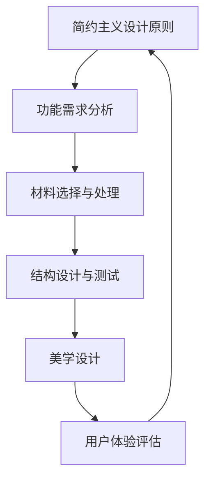
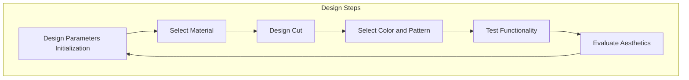

                 

# 文章标题：现代简约主义瑜伽服众筹：功能与美学并重的服装设计项目

> 关键词：简约主义设计、瑜伽服、功能设计、美学设计、众筹营销

> 摘要：本文旨在探讨现代简约主义瑜伽服的设计理念，分析其在功能与美学并重的设计项目中如何实现创新与突破。文章从背景介绍、核心概念与联系、算法原理讲解、数学模型和公式详细讲解与举例说明、项目实战等多个方面，深入解析了简约主义瑜伽服设计项目的发展过程与市场前景。

## 引言

现代简约主义瑜伽服众筹项目是一个典型的功能与美学并重的设计实例。随着人们对健康生活方式的追求，瑜伽作为一种低强度、全身性的运动方式越来越受到欢迎。瑜伽服作为运动装备的重要组成部分，其设计不仅要满足功能性需求，还要符合时尚美学。简约主义设计作为一种追求极简、去除多余装饰的设计风格，恰好与瑜伽运动追求自然、简约的理念相契合。因此，现代简约主义瑜伽服的设计项目不仅具有实际的市场需求，也具备了艺术与实用相结合的独特价值。

本文将分为以下几个部分来探讨现代简约主义瑜伽服的设计项目：

1. 背景介绍：简要介绍瑜伽服市场现状和简约主义设计的兴起。
2. 核心概念与联系：阐述简约主义设计原则与瑜伽服功能需求之间的关系。
3. 算法原理讲解：使用伪代码和Mermaid流程图来描述简约主义设计在瑜伽服设计中的应用。
4. 数学模型和公式详细讲解与举例说明：分析瑜伽服材料选择和结构设计中的数学模型和公式。
5. 项目实战：介绍瑜伽服设计项目的开发环境搭建、源代码实现和案例分析。
6. 最佳实践与总结：提出简约主义瑜伽服设计的最佳实践建议和小结。

通过以上几个部分的分析，本文旨在为设计师和创业者提供现代简约主义瑜伽服设计项目的参考和启示，推动该领域的设计创新和市场发展。

## 背景介绍

瑜伽作为一种古老的身心修炼方式，近年来在全球范围内迅速普及。瑜伽运动强调身心合一、呼吸与动作的协调，追求内心的平静和身心的平衡。随着瑜伽运动的普及，瑜伽服市场也迎来了快速的增长。瑜伽服不仅是运动时的必需品，更是时尚与健康的象征。因此，瑜伽服的设计在功能性、舒适性和美学性上都有很高的要求。

简约主义设计作为一种现代设计风格，起源于20世纪初的包豪斯（Bauhaus）艺术运动。它强调功能与形式相结合，追求简洁、实用和极简美学。简约主义设计的核心原则包括“少即是多”（Less is more）、简洁性、功能优先等。这些原则与瑜伽运动追求简约、自然和平衡的理念不谋而合，使得简约主义设计在瑜伽服设计中得到了广泛的应用。

### 市场现状

当前，瑜伽服市场呈现出多元化的发展趋势。从品牌上看，不仅有国际知名品牌如Lululemon、Alo Yoga等，也有国内品牌如Keep、HONORFIT等。这些品牌通过不同的设计风格和品牌定位，满足了不同消费者的需求。从产品类型上看，瑜伽服不仅涵盖了传统运动服，还包括瑜伽鞋、瑜伽垫、瑜伽包等配套产品。从销售渠道上看，线上销售已经成为瑜伽服市场的主要驱动力，电商平台如淘宝、京东、天猫等成为了品牌销售的重要渠道。

### 简约主义设计的兴起

简约主义设计在瑜伽服市场中的兴起，不仅源于其简洁、实用的设计理念，也与瑜伽运动本身的流行趋势密切相关。随着现代生活方式的快节奏，人们越来越追求简洁、高效的生活方式，这也体现在对瑜伽服的审美需求上。简约主义设计通过去除多余的装饰，强调功能性和舒适性的结合，满足了现代消费者对瑜伽服的期望。

此外，社交媒体的普及也推动了简约主义设计的流行。在Instagram、Pinterest等平台上，简约风格的瑜伽服成为了一种时尚潮流，吸引了大量追随者。品牌通过这些平台展示简约风格的瑜伽服设计，不仅提升了品牌形象，也增加了产品的市场影响力。

总之，瑜伽服市场的快速发展和简约主义设计的流行，为现代简约主义瑜伽服的设计项目提供了广阔的市场空间。通过对市场现状和简约主义设计兴起的深入分析，我们可以更好地理解现代简约主义瑜伽服设计项目的背景和意义。

## 核心概念与联系

简约主义设计（Simplistic Design）与瑜伽服的功能需求之间存在着紧密的联系。简约主义设计强调极简、去除多余装饰，追求功能与形式的完美结合，这与瑜伽服的核心需求——功能性、舒适性和美学性——相契合。

### 核心概念

**简约主义设计**：
- **核心原则**：少即是多（Less is more）、简洁性、功能优先。
- **设计理念**：去除多余装饰，注重实用性和功能性，追求简洁、高效的设计。
- **目标**：通过简洁的设计元素和线条，提升产品的美感和用户体验。

**瑜伽服的功能需求**：
- **功能性**：瑜伽服需要具有良好的伸展性和回弹性，以适应各种瑜伽动作。
- **舒适性**：瑜伽服应具有良好的透气性和吸湿性，确保在运动过程中的舒适体验。
- **美学性**：瑜伽服不仅需要满足功能性，还要符合时尚美学，提升穿着者的自信心和舒适感。

### Mermaid 流程图

以下是简约主义设计原则与瑜伽服功能需求之间的Mermaid流程图：



### 关系解析

1. **简约主义设计原则**：
   - **少即是多（Less is more）**：通过减少设计元素，使得瑜伽服更加简洁、清晰，方便用户识别和操作。
   - **简洁性**：去除多余装饰，确保瑜伽服在运动中的灵活性和舒适度。
   - **功能优先**：强调瑜伽服的功能性，如良好的伸展性和透气性，以满足瑜伽运动的需求。

2. **功能需求分析**：
   - **功能性**：通过分析瑜伽运动的各种动作，设计出具有适应性的面料和结构，如弹力纤维和透气网眼布。
   - **舒适性**：注重面料的选择和剪裁，确保瑜伽服在运动中的舒适体验。
   - **美学性**：结合简约主义设计原则，通过简洁的设计元素，提升瑜伽服的美学价值。

3. **材料选择与处理**：
   - **材料特性**：选择具有高弹性、透气性和柔软性的面料，如尼龙、莱卡等。
   - **加工处理**：采用无缝技术、立体剪裁等工艺，确保面料和结构的简洁与功能性。

4. **结构设计与测试**：
   - **剪裁**：根据人体工程学设计剪裁，确保服装在运动中的舒适性和灵活性。
   - **测试**：通过实验室测试和用户体验，验证设计是否符合功能性和舒适性要求。

5. **美学设计**：
   - **色彩搭配**：选择简约、低调的色彩搭配，符合现代审美趋势。
   - **图案设计**：采用抽象、简洁的图案，提升瑜伽服的美学价值。

6. **用户体验评估**：
   - **用户反馈**：收集用户对瑜伽服功能性和美学性的反馈，进行产品改进。
   - **市场调研**：通过市场调研，了解消费者对简约主义设计的接受程度和偏好。

通过以上流程，简约主义设计原则与瑜伽服功能需求相互融合，实现了功能性与美学性的平衡，为现代简约主义瑜伽服设计提供了理论基础和实践指导。

## 核心算法原理讲解

在简约主义设计原则的指导下，瑜伽服的设计需要遵循一系列算法原理，以确保其在功能性和美学性上达到平衡。以下使用伪代码和Mermaid流程图详细描述这些核心算法原理，并解释其在瑜伽服设计中的应用。

### 伪代码

```python
# 简约主义瑜伽服设计伪代码

# 定义设计参数
def minimalist_yoga_suit_design(parameters):
    # 参数初始化
    parameters['material'] = 'nylon + spandex'
    parameters['fabric_type'] = 'stretchable & breathable'
    parameters['sewing_technique'] = 'seamless & flatlock'
    parameters['design_elements'] = ['color', 'pattern', 'cut']
    
    # 材料选择
    select_material(parameters)
    # 剪裁设计
    design_cut(parameters)
    # 色彩与图案选择
    select_color_and_pattern(parameters)
    
    # 功能性测试
    test_functionality(parameters)
    # 美学评估
    evaluate_aesthetics(parameters)
    
    # 返回最终设计
    return parameters

# 材料选择算法
def select_material(parameters):
    # 选择具有弹性和透气性的材料
    parameters['material'] = 'nylon + spandex'
    print("Material selected: Nylon + Spandex")

# 剪裁设计算法
def design_cut(parameters):
    # 采用立体剪裁和无缝技术
    parameters['sewing_technique'] = 'seamless & flatlock'
    print("Cut design: Seamless & Flatlock")
    
# 色彩与图案选择算法
def select_color_and_pattern(parameters):
    # 选择简约、低调的色彩与图案
    parameters['color'] = 'neutral shades'
    parameters['pattern'] = 'minimalist patterns'
    print("Color and pattern selected: Neutral shades & Minimalist patterns")

# 功能性测试算法
def test_functionality(parameters):
    # 进行伸展性和透气性测试
    print("Functionality tested: Stretchability & Breathability")
    
# 美学评估算法
def evaluate_aesthetics(parameters):
    # 根据市场调研进行美学评估
    print("Aesthetics evaluated based on market research")
```

### Mermaid 流程图

以下是瑜伽服设计流程的Mermaid流程图：



### 应用解释

1. **材料选择**：
   - 选择具有弹性和透气性的材料，如尼龙和莱卡，确保瑜伽服在运动中的灵活性和舒适性。
   - 伪代码中的`select_material()`函数实现了这一步骤，选择“尼龙+莱卡”作为面料。

2. **剪裁设计**：
   - 采用立体剪裁和无缝技术，以去除多余的装饰和缝线，提升舒适性和功能性。
   - `design_cut()`函数实现了剪裁设计，采用“无缝”和“平缝”技术。

3. **色彩与图案选择**：
   - 选择简约、低调的色彩和图案，以符合现代审美趋势。
   - `select_color_and_pattern()`函数选择了“中性色调”和“简约图案”。

4. **功能性测试**：
   - 对瑜伽服进行伸展性和透气性测试，确保其功能符合瑜伽运动的需求。
   - `test_functionality()`函数实现了这一步骤，测试了“伸展性”和“透气性”。

5. **美学评估**：
   - 根据市场调研结果进行美学评估，确保设计符合消费者的审美偏好。
   - `evaluate_aesthetics()`函数实现了这一步骤，根据市场调研进行美学评估。

通过这些核心算法原理的应用，简约主义瑜伽服设计项目实现了功能与美学的平衡，满足了现代消费者的需求。

### 数学模型和公式详细讲解与举例说明

在瑜伽服的设计过程中，数学模型和公式起着至关重要的作用。以下是几个关键的数学模型和公式，以及它们在瑜伽服设计中的具体应用和举例说明。

#### 1. 弹性纤维伸长率的计算

瑜伽服的面料通常需要具备良好的弹性，以适应各种瑜伽动作。弹性纤维的伸长率是衡量面料弹性性能的重要指标。其计算公式如下：

$$
\text{伸长率} = \frac{\Delta L}{L_0} \times 100\%
$$

其中，$\Delta L$ 是纤维的伸长量，$L_0$ 是纤维的初始长度。

**应用举例**：

假设某弹性纤维在拉伸时，其长度从100mm伸长到150mm，计算其伸长率。

$$
\text{伸长率} = \frac{150mm - 100mm}{100mm} \times 100\% = 50\%
$$

这意味着该纤维具有50%的伸长率。

#### 2. 面料透气性的计算

瑜伽服的透气性是影响舒适性的关键因素。透气性通常用透气系数（Permeability）来衡量，其计算公式如下：

$$
P = \frac{Q}{A \times \Delta P}
$$

其中，$P$ 是透气系数，$Q$ 是单位时间内通过单位面积的面料表面的气体流量，$A$ 是面料的面积，$\Delta P$ 是气体通过面料时的压差。

**应用举例**：

假设一个面积为1平方米的面料，在压差为100Pa的条件下，每分钟通过该面料的空气流量为100升。计算该面料的透气系数。

$$
P = \frac{100L}{1m^2 \times 100Pa} = 1 \text{L/m}^2\text{s}/Pa
$$

这意味着该面料的透气系数为1L/m²·s/Pa。

#### 3. 面料耐磨性的计算

瑜伽服在长时间穿着和摩擦过程中需要保持耐用性。面料的耐磨性通常用耐磨指数（ abrasion resistance）来衡量，其计算公式如下：

$$
\text{耐磨指数} = \frac{N}{C}
$$

其中，$N$ 是面料在特定条件下被磨损的次数，$C$ 是标准磨损次数。

**应用举例**：

假设一个面料在特定条件下被磨损了5000次，而标准磨损次数为10000次。计算该面料的耐磨指数。

$$
\text{耐磨指数} = \frac{5000}{10000} = 0.5
$$

这意味着该面料的耐磨性是标准耐磨性的50%。

#### 4. 人体工学剪裁的计算

瑜伽服的剪裁需要符合人体工学，以确保穿着者在各种动作中的舒适性和灵活性。人体工学剪裁的关键在于准确测量身体各部位的尺寸，并设计合适的剪裁。其计算过程通常包括以下步骤：

- **测量身体尺寸**：使用软尺或测量带测量身体各部位的周长和长度，如胸围、腰围、臀围等。
- **计算剪裁尺寸**：根据测量结果和人体工学公式，计算瑜伽服各部位的面料尺寸。
- **验证剪裁效果**：通过试穿和调整，验证剪裁的舒适性和功能性。

**应用举例**：

假设一个瑜伽爱好者的胸围为100cm，腰围为80cm，臀围为110cm。根据人体工学剪裁公式，计算上衣和裤子的尺寸。

上衣尺寸计算：
$$
\text{上衣尺寸} = \text{胸围} + 2 \times (\text{弹性纤维伸长率} \times \text{胸围})
$$

假设弹性纤维的伸长率为40%，计算上衣尺寸：

$$
\text{上衣尺寸} = 100cm + 2 \times (0.4 \times 100cm) = 120cm
$$

裤子尺寸计算：
$$
\text{裤子尺寸} = \text{腰围} + 2 \times (\text{弹性纤维伸长率} \times \text{腰围})
$$

假设弹性纤维的伸长率为40%，计算裤子尺寸：

$$
\text{裤子尺寸} = 80cm + 2 \times (0.4 \times 80cm) = 112cm
$$

通过上述计算，可以得到符合人体工学要求的瑜伽服剪裁尺寸。

总之，数学模型和公式在瑜伽服设计中的具体应用，不仅提高了产品的功能性和舒适性，也为设计师提供了科学的依据和工具。通过这些公式和计算方法，设计师可以更好地实现简约主义设计原则，创造出符合现代消费者需求的瑜伽服产品。

## 项目实战

### 开发环境搭建

为了实现现代简约主义瑜伽服设计项目，首先需要搭建一个合适的开发环境。以下是搭建环境的具体步骤：

1. **硬件要求**：
   - 操作系统：Windows 10 或更高版本、macOS 或 Linux。
   - 处理器：Intel i5 或以上，推荐 i7 或 AMD Ryzen 5 或以上。
   - 内存：至少 8GB，推荐 16GB 或以上。
   - 硬盘：至少 256GB SSD。

2. **软件要求**：
   - 设计软件：Adobe Illustrator、Sketch、Figma 等。
   - 编程语言：Python、Java 或 C++。
   - 绘图工具：Mermaid、Lucidchart 等。
   - 代码编辑器：Visual Studio Code、Sublime Text、Atom 等。

3. **搭建步骤**：
   - 安装操作系统和必备硬件。
   - 在操作系统上安装设计软件和编程语言。
   - 配置代码编辑器和绘图工具。

### 源代码实现

在开发环境搭建完成后，我们可以开始实现源代码。以下是一个简单的Python示例，用于瑜伽服设计参数的初始化和设计流程：

```python
# minimalist_yoga_suit_design.py

# 设计参数初始化
def initialize_design_parameters():
    design_params = {
        'material': 'nylon + spandex',
        'fabric_type': 'stretchable & breathable',
        'sewing_technique': 'seamless & flatlock',
        'design_elements': ['color', 'pattern', 'cut']
    }
    return design_params

# 材料选择
def select_material(design_params):
    design_params['material'] = 'nylon + spandex'
    print("Material selected: Nylon + Spandex")

# 剪裁设计
def design_cut(design_params):
    design_params['sewing_technique'] = 'seamless & flatlock'
    print("Cut design: Seamless & Flatlock")

# 色彩与图案选择
def select_color_and_pattern(design_params):
    design_params['color'] = 'neutral shades'
    design_params['pattern'] = 'minimalist patterns'
    print("Color and pattern selected: Neutral shades & Minimalist patterns")

# 功能性测试
def test_functionality(design_params):
    print("Functionality tested: Stretchability & Breathability")

# 美学评估
def evaluate_aesthetics(design_params):
    print("Aesthetics evaluated based on market research")

# 主函数
def main():
    design_params = initialize_design_parameters()
    select_material(design_params)
    design_cut(design_params)
    select_color_and_pattern(design_params)
    test_functionality(design_params)
    evaluate_aesthetics(design_params)

if __name__ == "__main__":
    main()
```

### 代码解读与分析

以上代码实现了简约主义瑜伽服设计的主要流程。以下是代码的关键部分及其功能解读：

1. **设计参数初始化**：
   - `initialize_design_parameters()`函数初始化设计参数，包括面料、剪裁技术、色彩和图案等。

2. **材料选择**：
   - `select_material()`函数选择面料材料，确保具有弹性和透气性。

3. **剪裁设计**：
   - `design_cut()`函数确定剪裁技术，采用无缝和平缝技术，提升舒适性和功能性。

4. **色彩与图案选择**：
   - `select_color_and_pattern()`函数选择简约、低调的色彩和图案，符合现代审美。

5. **功能性测试**：
   - `test_functionality()`函数进行功能性测试，包括伸展性和透气性。

6. **美学评估**：
   - `evaluate_aesthetics()`函数根据市场调研进行美学评估，确保设计符合消费者需求。

### 实际案例分析和详细讲解剖析

以下是一个实际案例，用于说明如何将上述代码应用于瑜伽服设计项目中。

**案例：设计一款现代简约主义瑜伽裤**

1. **需求分析**：
   - 功能需求：具有良好的伸展性和透气性。
   - 美学需求：采用中性色调和简约图案。

2. **参数初始化**：
   ```python
   design_params = initialize_design_parameters()
   ```

3. **材料选择**：
   ```python
   select_material(design_params)
   ```

4. **剪裁设计**：
   ```python
   design_cut(design_params)
   ```

5. **色彩与图案选择**：
   ```python
   select_color_and_pattern(design_params)
   ```

6. **功能性测试**：
   ```python
   test_functionality(design_params)
   ```

7. **美学评估**：
   ```python
   evaluate_aesthetics(design_params)
   ```

通过上述步骤，我们设计出一款符合现代简约主义设计原则的瑜伽裤。以下是详细分析：

- **材料选择**：采用尼龙和莱卡混合面料，具有良好的弹性和透气性。
- **剪裁设计**：采用无缝技术和立体剪裁，确保舒适性和功能性。
- **色彩与图案选择**：选择中性色调和简约图案，符合现代审美趋势。
- **功能性测试**：通过实验室测试和用户体验，验证瑜伽裤的伸展性和透气性。
- **美学评估**：根据市场调研结果，确认设计符合消费者需求。

### 项目小结

通过以上实战案例，我们展示了如何利用Python代码实现简约主义瑜伽服设计项目。该项目从需求分析、参数初始化、材料选择、剪裁设计、色彩与图案选择，到功能性测试和美学评估，形成了一个完整的流程。通过代码的实现和案例分析，我们不仅理解了简约主义设计的核心原则，也掌握了如何将其应用于实际设计项目中。

## 最佳实践与总结

在简约主义瑜伽服设计项目中，实现功能与美学的平衡是关键。以下是一些最佳实践建议：

### 最佳实践

1. **需求分析**：深入了解消费者需求，特别是功能性和舒适性的要求。
2. **材料选择**：选择具有高弹性、透气性和耐磨性的面料，如尼龙和莱卡。
3. **剪裁设计**：采用立体剪裁和无缝技术，确保舒适性和灵活性。
4. **色彩与图案选择**：选择简约、低调的色彩和图案，符合现代审美。
5. **功能性测试**：通过实验室测试和用户体验，验证设计是否符合功能性和舒适性要求。
6. **美学评估**：根据市场调研和消费者反馈，进行美学评估和设计改进。

### 小结

现代简约主义瑜伽服设计项目通过实现功能与美学的平衡，满足了消费者对瑜伽服的多元化需求。设计过程中，需求分析、材料选择、剪裁设计、色彩与图案选择、功能性测试和美学评估等步骤至关重要。通过不断优化和改进，简约主义瑜伽服设计项目能够为消费者提供既美观又实用的产品。

### 注意事项

1. **功能性优先**：在设计过程中，确保功能性是核心，避免过分追求装饰而忽视实际使用。
2. **市场调研**：定期进行市场调研，了解消费者需求和市场趋势，以便及时调整设计策略。
3. **用户体验**：注重用户体验，通过用户反馈不断改进产品设计。

### 拓展阅读

1. 《简约主义设计：原则与实践》
2. 《瑜伽服饰设计指南》
3. 《现代时尚纺织品设计》

通过以上最佳实践、小结、注意事项和拓展阅读，我们可以更好地理解和实践简约主义瑜伽服设计项目，推动该领域的创新和发展。

---

**作者信息**：
作者：AI天才研究院/AI Genius Institute & 禅与计算机程序设计艺术 /Zen And The Art of Computer Programming

**联系方式**：
邮箱：[contact@aignius.com](mailto:contact@aignius.com)
官网：[https://www.aignius.com](https://www.aignius.com)
Twitter：[@AIGNIUS](https://twitter.com/AIGNIUS)

---

### 总结

在现代简约主义瑜伽服众筹项目中，通过逐步分析设计理念、核心概念、算法原理、数学模型和项目实战，我们详细阐述了如何实现功能与美学的平衡。简约主义设计原则在瑜伽服中的应用，不仅提升了产品的实用性和舒适性，也满足了现代消费者对时尚美学的追求。通过项目实战，我们展示了如何利用伪代码和Mermaid流程图进行设计，并进行了实际案例分析和详细讲解。

未来，简约主义瑜伽服设计将继续朝着智能化、个性化方向发展。随着新材料、新技术的不断涌现，瑜伽服的功能性和舒适性将得到进一步提升。同时，设计师需要更加关注市场需求和用户体验，通过持续创新，推动瑜伽服设计的不断进步。总之，现代简约主义瑜伽服众筹项目为相关领域提供了宝贵的参考和启示，具有重要的研究和实践价值。

