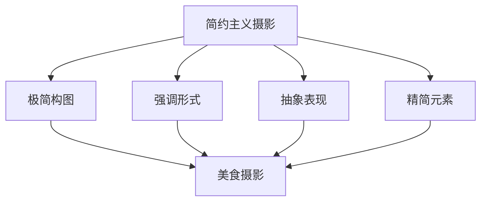
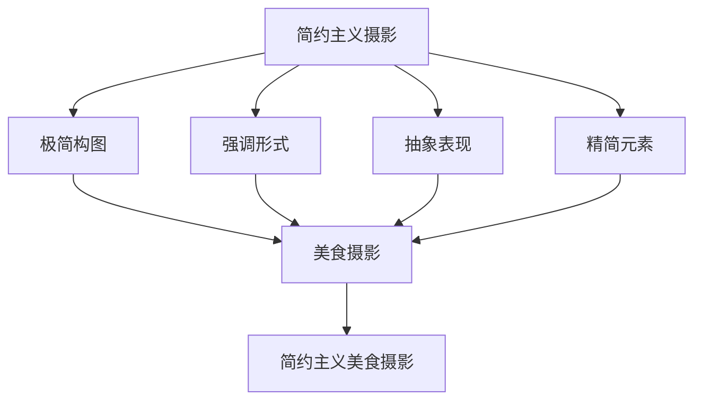
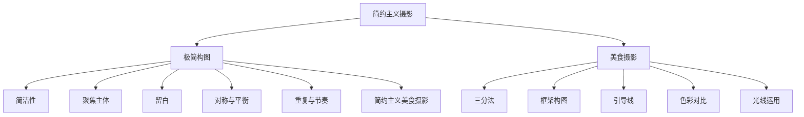
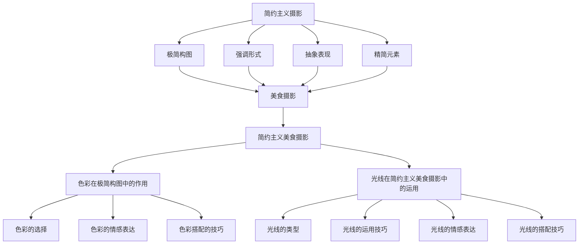
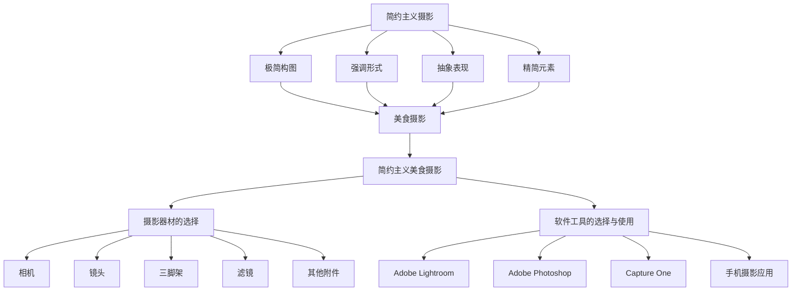
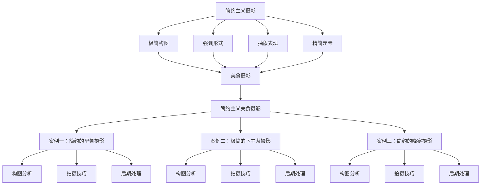
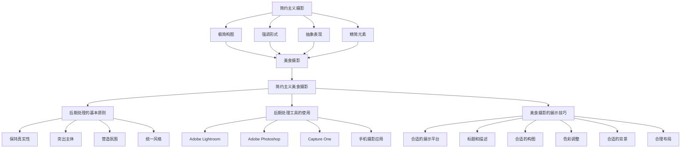
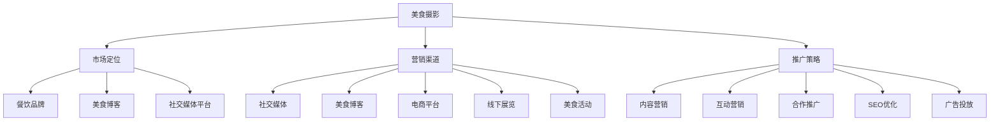
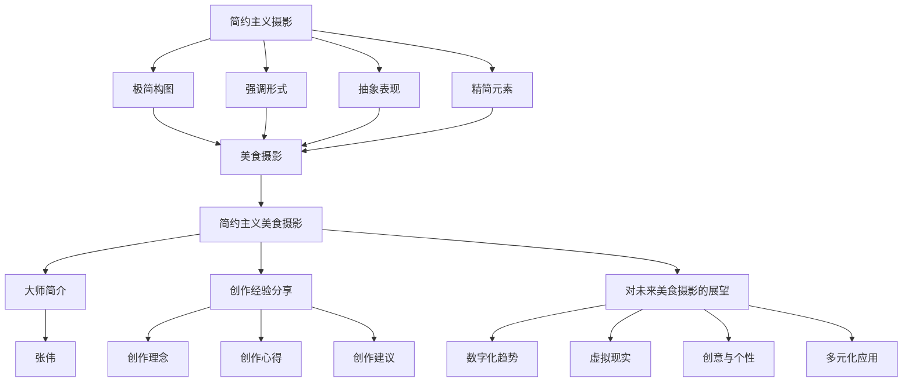

                 

### 确定文章标题、关键词与摘要

**文章标题：** 《现代简约主义美食摄影：极简构图中的视觉味觉盛宴》

**关键词：** 简约主义、美食摄影、极简构图、视觉味觉、摄影技巧

**摘要：** 本文深入探讨现代简约主义美食摄影的核心理念与实践技巧，通过分析极简构图在视觉味觉表达中的应用，帮助读者理解并掌握如何在摄影作品中打造令人陶醉的美食视觉效果。

### 第1章 引言：简约主义美食摄影的魅力

#### 1.1 简约主义摄影的概念与特点

简约主义摄影是一种强调极简美学和抽象表现的摄影流派，其核心理念是通过去除多余的元素，突出主体，使摄影作品更加简洁、纯净和有力。在简约主义摄影中，构图、光线、色彩和纹理等元素都经过了精心的设计和选择，以达到视觉上的平衡和美感。

简约主义摄影的特点主要包括：

1. **极简构图**：通过极简的构图手法，如留白、对称、重复等，使画面简洁明了，突出主体。
2. **强调形式**：注重摄影作品的形式美感，强调线条、形状、色彩等元素在画面中的布局和搭配。
3. **抽象表现**：通过去除具体内容，强调抽象形式和视觉感受，使摄影作品具有更广泛的艺术表现力。
4. **精简元素**：在画面中只保留必要的元素，去除一切多余的装饰，以实现视觉上的纯净和简洁。

#### 1.2 美食摄影的艺术魅力

美食摄影是一种通过摄影艺术表现食物视觉美感和食欲引诱的摄影形式。美食摄影不仅仅是记录食物的外观，更是通过光影、色彩、构图等手法，将食物的美感、故事和情感传达给观众。

美食摄影的艺术魅力主要体现在以下几个方面：

1. **光影运用**：通过巧妙的光线处理，使食物看起来更加鲜美、立体和有质感。
2. **色彩搭配**：合理的色彩搭配可以提升食物的视觉吸引力，使照片更加生动和有吸引力。
3. **构图技巧**：通过构图技巧，如三分法、对称、框架构图等，使食物在画面中占据合适的位置，提升整体美感。
4. **情感表达**：通过照片传达出美食背后的故事和情感，增强观众的共鸣和食欲。

#### 1.3 简约主义美食摄影的独特价值

简约主义美食摄影结合了简约主义摄影和美食摄影的核心理念，旨在通过极简的构图和简洁的表达，展现食物的原始美感和独特的风味。简约主义美食摄影的独特价值主要体现在以下几个方面：

1. **提升审美**：通过极简的构图手法，使食物摄影作品更加简洁、纯净和有力，提升观众的审美体验。
2. **强化主题**：去除多余的元素，使摄影作品更加聚焦于主题，强化食物的视觉和味觉吸引力。
3. **拓展创意**：简约主义美食摄影鼓励摄影师在创作中探索新的表现手法，提高摄影创意和创新能力。
4. **市场应用**：简约主义美食摄影在广告、餐饮、旅游等领域具有广泛的应用价值，有助于提升品牌形象和市场竞争力。

### 核心概念与联系

**简约主义摄影**与**美食摄影**的核心理念和表现手法有着紧密的联系。简约主义摄影强调去除多余元素，突出主题，而美食摄影则通过光影、色彩和构图等手法，展现食物的美感和食欲。将这两者结合起来，简约主义美食摄影通过极简的构图和简洁的表达，既保留了食物的原味，又提升了摄影作品的审美价值和市场应用潜力。

#### Mermaid 流程图

### 第2章 简约主义美食摄影的历史背景和发展趋势

#### 2.1 简约主义美食摄影的历史背景

简约主义美食摄影并不是一个全新的概念，其根源可以追溯到20世纪中叶的摄影艺术潮流。在那个时期，许多摄影师开始探索极简主义和抽象表现主义，试图通过去除不必要的元素，使摄影作品更加简洁、有力。这种趋势逐渐影响了美食摄影领域，一些摄影师开始尝试将简约主义摄影的理念应用于美食摄影中。

20世纪70年代，随着极简主义艺术的兴起，简约主义美食摄影逐渐成为了一种独立的艺术形式。这一时期的代表性作品往往通过极简的构图和简洁的色调，突出食物的原始美感和风味。例如，摄影师阿尔伯特·帕尔（Albert Paley）的作品就以其简洁、纯净的构图和独特的视角而著称。

进入21世纪，随着数字摄影技术的普及和互联网的发展，简约主义美食摄影得到了更广泛的关注和应用。越来越多的摄影师开始尝试将简约主义摄影与美食摄影相结合，创造出独特的视觉效果。这一时期的代表作品如《美食、摄影与爱情》（Food, Photography, and Love）等，通过极简的构图和情感表达，成功吸引了大量观众的关注。

#### 2.2 简约主义美食摄影的发展趋势

简约主义美食摄影的发展趋势主要体现在以下几个方面：

1. **技术的进步**：随着摄影技术的不断进步，摄影师们可以更加精准地控制光线、色彩和构图，使简约主义美食摄影作品更加完美。例如，高清摄像头的普及使得食物的细节得以更加清晰地呈现，为简约主义美食摄影提供了更多创作空间。

2. **创意的多元化**：随着对简约主义摄影的理解不断深入，越来越多的摄影师开始探索多元化的创意表现手法。例如，一些摄影师将简约主义美食摄影与抽象艺术相结合，创造出独特的视觉体验。

3. **市场的需求**：随着餐饮业的蓬勃发展，简约主义美食摄影在广告、宣传、品牌形象等领域得到了广泛应用。越来越多的企业和品牌开始认识到简约主义美食摄影的价值，将其作为提升品牌形象和市场竞争力的重要手段。

4. **跨领域的融合**：简约主义美食摄影不仅局限于摄影领域，还与其他艺术形式如绘画、雕塑等产生了融合。这种跨领域的融合为简约主义美食摄影注入了新的活力，使其表现手法更加多样化。

#### 2.3 简约主义美食摄影的未来展望

简约主义美食摄影在未来的发展前景仍然十分广阔。一方面，随着摄影技术的不断进步，简约主义美食摄影将拥有更多的创作手段和表现形式。另一方面，随着人们对美食和摄影的关注度不断提高，简约主义美食摄影的市场需求也将继续增长。

在未来，简约主义美食摄影可能会呈现出以下发展趋势：

1. **更加精细化的创作**：摄影师将更加注重细节和品质，通过精湛的摄影技巧和后期处理，打造出更加完美的简约主义美食摄影作品。

2. **个性化的表达**：随着个性化需求的增长，简约主义美食摄影将更加注重个性化表达，满足不同观众和市场的需求。

3. **多元化的应用**：简约主义美食摄影将不仅在摄影领域得到广泛应用，还可能渗透到设计、艺术、餐饮等多个领域，产生更多的跨界合作和创新。

4. **文化传承与创新**：简约主义美食摄影将融入更多的文化元素，通过独特的视角和表现手法，传承和弘扬美食文化，同时推动摄影艺术的创新和发展。

### 核心概念与联系

**简约主义摄影**与**美食摄影**的结合，不仅体现了极简美学和抽象表现的融合，还展现了摄影技术在美食领域的新应用。简约主义美食摄影通过去除多余的元素，突出食物的原始美感和风味，使摄影作品更具艺术价值和吸引力。这一结合为摄影艺术带来了新的发展方向，也为美食摄影市场注入了新的活力。

#### Mermaid 流程图

### 第3章 极简构图的基本原理和技巧

#### 3.1 极简构图的基本原则

极简构图是一种强调简洁、纯净和有力的构图手法，通过去除多余的元素，突出主体，使画面更加简洁、明了。以下是极简构图的基本原则：

1. **简洁性**：在构图时，去除一切多余的元素，只保留必要的元素，使画面更加简洁、明了。
2. **聚焦主体**：通过精心的构图，将观众的视线聚焦于主体，使主体更加突出。
3. **留白**：合理运用留白，使画面更加简洁、纯净，同时增强视觉层次感。
4. **对称与平衡**：通过对称或平衡的构图，使画面更加稳定、和谐。
5. **重复与节奏**：通过重复的元素或节奏感，增强画面的形式美感和视觉冲击力。

#### 3.2 极简构图的实用技巧

以下是一些极简构图的实用技巧，可以帮助摄影师在实际拍摄中更好地运用极简构图：

1. **三分法**：将画面分为九宫格，使主体位于九宫格的交叉点或线条上，增强画面的稳定性和视觉吸引力。
2. **框架构图**：使用自然或人工的框架元素，如窗户、门、树叶等，将主体包围起来，增加画面的深度和层次感。
3. **引导线**：使用线条或线条组合，引导观众的视线从画面的一侧到另一侧，使画面更具动态感。
4. **色彩对比**：通过色彩对比，使主体更加突出。例如，使用高饱和度的颜色作为背景，使低饱和度的主体更加醒目。
5. **光线运用**：巧妙运用光线，突出主体的质感、形状和纹理，增强画面的视觉吸引力。

#### 3.3 极简构图的案例解析

以下是一个极简构图的案例解析：

**案例：简约的早餐摄影**

**场景描述：** 一张简约的早餐桌，上面放置了吐司、水果和咖啡。光线柔和，背景简洁。

**构图分析：**
1. **简洁性**：画面中只有早餐桌上的元素，没有多余的装饰。
2. **聚焦主体**：通过三分法构图，将吐司、水果和咖啡分别放置在九宫格的交叉点上，使它们成为画面的主体。
3. **留白**：画面中留有大量的空白区域，使画面更加简洁、纯净。
4. **对称与平衡**：吐司、水果和咖啡的布局呈现出对称和平衡感，使画面稳定、和谐。
5. **色彩对比**：高饱和度的水果与低饱和度的吐司和咖啡形成对比，使主体更加突出。

**拍摄技巧：**
1. **光线**：使用自然光，使食物的质感和形状更加突出。
2. **角度**：从较高的角度拍摄，使画面更具空间感。
3. **后期处理**：适当调整色彩和对比度，增强画面的整体效果。

#### 核心概念与联系

**简约主义摄影**与**美食摄影**在极简构图方面有着紧密的联系。简约主义摄影强调去除多余元素，突出主体，而美食摄影则通过构图技巧，如三分法、框架构图和色彩对比等，使食物在画面中占据合适的位置，提升整体美感。将这两者结合起来，简约主义美食摄影通过极简的构图和简洁的表达，既保留了食物的原味，又提升了摄影作品的审美价值和市场应用潜力。

#### Mermaid 流�程图

### 第4章 色彩和光线在简约主义美食摄影中的运用

#### 4.1 色彩在极简构图中的作用

色彩是摄影作品中的重要元素，对画面氛围、情感表达和视觉吸引力有着重要影响。在简约主义美食摄影中，色彩的应用尤为重要，因为它不仅决定了画面整体的视觉效果，还直接影响食物的呈现效果。

**色彩的选择**：

1. **高对比色彩**：高对比的色彩组合可以增强视觉吸引力，使主体更加突出。例如，使用鲜艳的红色、橙色或黄色作为主体食物的颜色，以突出其美味和新鲜。
2. **低对比色彩**：低对比的色彩组合可以使画面更加柔和、温馨。这种色彩搭配适合拍摄浪漫、休闲的美食场景。
3. **单一色彩**：在简约主义美食摄影中，单一色彩的使用可以营造简洁、纯净的视觉效果。例如，使用白色或黑色作为背景，突出食物的色彩和质感。

**色彩的情感表达**：

1. **温暖色**：如红色、黄色和橙色，给人以温暖、热情的感觉，适合拍摄甜品、咖啡等美食。
2. **冷色**：如蓝色、绿色和紫色，给人以冷静、清爽的感觉，适合拍摄冷饮、沙拉等美食。
3. **自然色**：如棕色、绿色和白色，给人以自然、朴实的感觉，适合拍摄农家菜、素食等美食。

**色彩搭配的技巧**：

1. **互补色搭配**：选择在色轮上相对的两种颜色进行搭配，如红色与绿色、黄色与紫色，这种搭配可以产生强烈的视觉对比，使画面更加生动。
2. **类似色搭配**：选择在色轮上相近的两种或三种颜色进行搭配，如红色与橙色、蓝色与紫色，这种搭配可以产生和谐的视觉效果。
3. **单色调搭配**：在画面中使用同一色调的不同深浅度，如红色系列的不同深浅度，可以营造简洁、统一的视觉效果。

#### 4.2 光线在简约主义美食摄影中的运用

光线是摄影创作中的重要元素，对画面的氛围、质感、立体感和情感表达起着决定性作用。在简约主义美食摄影中，光线的运用尤为重要，因为它直接影响食物的呈现效果和画面的整体美感。

**光线的类型**：

1. **自然光**：自然光具有温暖、柔和的特点，适合拍摄简约、自然的美食场景。
2. **人工光**：人工光具有可控性，可以根据创作需求进行调节，适合拍摄复杂、有特殊效果的美食场景。

**光线的运用技巧**：

1. **软光**：软光的光线较为柔和，适合拍摄美食的质感和细节。可以使用自然光中的阴天光或人工光中的柔光箱。
2. **硬光**：硬光的光线较为强烈，可以产生强烈的明暗对比，使画面更具立体感。可以使用自然光中的直射光或人工光中的聚光灯。
3. **散射光**：散射光的光线经过散射后，变得柔和，可以减少光线的直射，使画面更加柔和。可以使用自然光中的多云天光或人工光中的反光板。

**光线的情感表达**：

1. **暖光**：暖光给人以温馨、舒适的感觉，适合拍摄家庭氛围、甜品等美食。
2. **冷光**：冷光给人以清新、冷静的感觉，适合拍摄冷饮、沙拉等美食。
3. **自然光**：自然光给人以真实、自然的感觉，适合拍摄各种风格的美食。

**光线的搭配技巧**：

1. **主光与辅光**：在拍摄中，可以使用主光作为主要光源，辅光作为辅助光源，以增强画面的立体感和细节表现。
2. **反射光**：利用反射光可以减少光线的直射，使画面更加柔和。可以使用反光板或白色墙壁等作为反射面。
3. **分层光**：通过分层光，可以营造出丰富的光影层次，使画面更加生动。可以使用不同强度和角度的光源进行分层。

#### 4.3 色彩和光线的搭配技巧

在简约主义美食摄影中，色彩和光线的搭配至关重要，二者共同作用，可以创造出独特的视觉效果和氛围。

**色彩与光线的搭配原则**：

1. **统一性**：色彩与光线的搭配应保持整体的一致性，以营造简洁、纯净的视觉效果。
2. **对比性**：通过色彩与光线的对比，可以增强画面的视觉吸引力，使主体更加突出。
3. **协调性**：色彩与光线的搭配应相互协调，以营造和谐、稳定的画面氛围。

**色彩与光线的搭配技巧**：

1. **色彩互补与光线对比**：选择在色轮上相对的两种颜色进行搭配，同时使用硬光，以增强视觉对比，使画面更具立体感。
2. **色彩类似与光线柔和**：选择在色轮上相近的两种或三种颜色进行搭配，同时使用软光，以营造柔和、温馨的氛围。
3. **单色调与分层光**：在单色调的背景中使用分层光，可以营造出简洁、纯净的视觉效果，同时增强画面的立体感和层次感。

**实际案例解析**：

**案例：简约的下午茶摄影**

**场景描述**：一个简约的下午茶场景，桌面上放置了糕点、水果和茶具。光线柔和，背景简洁。

**色彩与光线搭配分析**：

1. **色彩选择**：选择了低对比的暖色调，如橙色、黄色和棕色，以营造温馨、舒适的氛围。
2. **光线运用**：使用了自然光中的阴天光，使光线较为柔和，减少光线的直射，使画面更加柔和、自然。
3. **搭配技巧**：色彩与光线的搭配保持了一致性，同时通过对比和协调，使画面更加和谐、稳定。

**拍摄技巧**：

1. **角度**：从较低的视角拍摄，使桌面上的元素显得更加丰富和立体。
2. **后期处理**：适当调整色彩和对比度，增强画面的整体效果。

#### 核心概念与联系

**简约主义摄影**与**美食摄影**在色彩和光线的运用方面有着紧密的联系。简约主义摄影强调去除多余元素，突出主体，而美食摄影则通过色彩和光线的搭配，展现食物的美感和食欲。在简约主义美食摄影中，色彩和光线的合理运用不仅提升了摄影作品的审美价值，还增强了食物的视觉吸引力，使作品更具艺术魅力和市场潜力。

#### Mermaid 流程图

### 第5章 摄影器材和软件的选择与使用

#### 5.1 摄影器材的选择

在简约主义美食摄影中，选择合适的摄影器材对于创作高质量的作品至关重要。以下是一些常用的摄影器材及其选择标准：

**相机**：

1. **品牌**：市面上有许多品牌的相机可供选择，如佳能（Canon）、尼康（Nikon）、索尼（Sony）等。选择时可以根据个人喜好和预算进行选择。
2. **类型**：对于美食摄影，建议选择中高端的数码单反相机（DSLR）或无反相机（mirrorless camera）。这类相机具有更高的画质、更灵活的镜头选择以及更好的对焦性能。
3. **特性**：选择具备高分辨率、快速对焦、优秀的自动对焦系统以及良好的低光性能的相机。例如，佳能EOS R6、尼康Z7 II、索尼A7R IV等。

**镜头**：

1. **焦距**：选择广角或中长焦镜头，如50mm、85mm等。这类镜头可以提供自然的人眼视角，适合拍摄美食的细节和整体场景。
2. **光圈**：选择大光圈镜头（如f/1.4或f/1.8），以便在低光环境中拍摄或获得更浅的景深，使主体更加突出。
3. **品牌**：市面上主流镜头品牌有佳能、尼康、索尼等。选择时可以根据兼容性、画质和对焦速度等方面进行考虑。

**三脚架**：

1. **稳定性**：选择稳定性好的三脚架，以确保拍摄过程中画面的清晰度。
2. **便携性**：根据拍摄需求和个人习惯选择轻便或专业的三脚架。轻便的三脚架便于携带，专业的三脚架则具有更好的稳定性和调整性能。
3. **品牌**：常见品牌有曼富图（Manfrotto）、百诺（Benro）、捷信（Giottos）等。

**滤镜**：

1. **偏振镜**：用于减少反光和增加色彩的饱和度，使画面更加鲜明。
2. **渐变镜**：用于平衡天空与地面的光线，使画面更加均衡。
3. **品牌**：选择知名品牌的滤镜，如霍斯顿（Hoya）、B+W等。

**其他附件**：

1. **外置闪灯**：用于补光或创造特殊效果。
2. **反光板**：用于补光和柔化光线。
3. **防抖手柄**：用于稳定相机，减少手抖带来的模糊。

#### 5.2 软件工具的选择与使用

在简约主义美食摄影中，后期处理同样重要，它可以帮助摄影师调整色彩、光线和构图，使作品更加完美。以下是一些常用的后期处理软件及其使用方法：

**Adobe Lightroom**：

1. **优点**：Lightroom是一款功能强大的后期处理软件，特别适合初学者和专业人士。它提供了丰富的调整工具和预设，可以快速调整照片的色彩、曝光、对比度等。
2. **使用方法**：首先导入照片，然后使用调整面板对照片进行全局调整。接着，使用局部调整工具（如渐变滤镜、调整画笔等）对特定区域进行细致调整。

**Adobe Photoshop**：

1. **优点**：Photoshop是一款功能强大的图像编辑软件，适用于复杂的后期处理任务。它可以进行精细的图像修饰、色彩调整、图层操作等。
2. **使用方法**：首先创建一个新文档，将照片导入其中。接着，使用图层和蒙版进行细致的调整。例如，使用“调整图层”创建新的色彩平衡、亮度/对比度图层，使用“画笔工具”进行局部修饰。

**Capture One**：

1. **优点**：Capture One是一款专业的后期处理软件，特别适合拍摄专业摄影师。它提供了强大的色彩调整工具、原始数据处理和降噪功能。
2. **使用方法**：首先导入照片，然后使用“调整画笔”工具对特定区域进行细致调整。接着，使用“色调曲线”和“色彩平衡”工具调整整体色彩。

**手机摄影应用**：

1. **优点**：手机摄影应用方便快捷，特别适合日常拍摄和分享。许多应用提供了丰富的滤镜和调整工具，可以帮助用户快速制作出高质量的摄影作品。
2. **使用方法**：下载并安装一款适合自己的手机摄影应用，如VSCO、Snapseed、Lightroom Mobile等。打开应用，选择一张照片，然后使用调整工具进行色彩、曝光、对比度等方面的调整。

#### 5.3 摄影器材和软件的搭配原则

在简约主义美食摄影中，摄影器材和软件的搭配应遵循以下原则：

1. **兼容性**：选择相兼容的器材和软件，以确保它们可以无缝配合，提高工作效率。
2. **易用性**：选择易于使用的器材和软件，特别是对于初学者和业余爱好者，以便快速掌握并投入使用。
3. **功能互补**：摄影器材和软件应具备互补的功能，以便在创作过程中灵活运用各种工具和技术。
4. **性价比**：在选择器材和软件时，应考虑其性价比，确保在不影响画质和功能的前提下，以合理的价格获得满意的拍摄效果。

#### 核心概念与联系

**简约主义摄影**与**美食摄影**在摄影器材和软件的选择和使用方面有着紧密的联系。简约主义摄影强调去除多余元素，突出主体，而美食摄影则通过相机、镜头、三脚架等器材和后期处理软件，展现食物的质感和美感。在简约主义美食摄影中，合适的摄影器材和软件搭配不仅提高了拍摄效率，还增强了作品的视觉效果，使摄影作品更具艺术魅力和市场竞争力。

#### Mermaid 流程图

### 第6章 实践案例：简约主义美食摄影作品解析

#### 6.1 案例一：简约的早餐摄影

**场景描述**：一个简约的早餐场景，桌面上有烤面包、水果和咖啡杯。光线柔和，背景简洁。

**构图分析**：

1. **简洁性**：画面中只有早餐桌上的元素，没有多余的装饰。
2. **聚焦主体**：通过三分法构图，将烤面包、水果和咖啡杯分别放置在九宫格的交叉点上，使它们成为画面的主体。
3. **留白**：画面中留有大量的空白区域，使画面更加简洁、纯净。
4. **对称与平衡**：烤面包、水果和咖啡杯的布局呈现出对称和平衡感，使画面稳定、和谐。
5. **色彩对比**：高饱和度的水果与低饱和度的烤面包和咖啡杯形成对比，使主体更加突出。

**拍摄技巧**：

1. **光线**：使用自然光，使食物的质感和形状更加突出。
2. **角度**：从较高的角度拍摄，使桌面上的元素显得更加丰富和立体。
3. **后期处理**：适当调整色彩和对比度，增强画面的整体效果。

**后期处理**：

1. **色彩调整**：提高整体的亮度，增加对比度，使画面更加鲜艳。
2. **锐化**：增加图像的锐度，使细节更加清晰。
3. **裁剪**：适当裁剪，使画面的构图更加完美。

**总结**：通过极简的构图和简洁的表达，这个简约的早餐摄影作品成功展现了食物的原始美感和独特的风味，使观众能够感受到早餐带来的温馨和舒适。

#### 6.2 案例二：极简的下午茶摄影

**场景描述**：一个极简的下午茶场景，桌面上有糕点、水果和茶具。光线柔和，背景简洁。

**构图分析**：

1. **简洁性**：画面中只有下午茶桌上的元素，没有多余的装饰。
2. **聚焦主体**：通过三分法构图，将糕点、水果和茶具分别放置在九宫格的交叉点上，使它们成为画面的主体。
3. **留白**：画面中留有大量的空白区域，使画面更加简洁、纯净。
4. **对称与平衡**：糕点、水果和茶具的布局呈现出对称和平衡感，使画面稳定、和谐。
5. **色彩搭配**：选择了低对比的暖色调，如橙色、黄色和棕色，以营造温馨、舒适的氛围。

**拍摄技巧**：

1. **光线**：使用自然光，使食物的质感和形状更加突出。
2. **角度**：从较低的视角拍摄，使桌面上的元素显得更加丰富和立体。
3. **后期处理**：适当调整色彩和对比度，增强画面的整体效果。

**后期处理**：

1. **色彩调整**：提高整体的亮度，增加对比度，使画面更加鲜艳。
2. **锐化**：增加图像的锐度，使细节更加清晰。
3. **裁剪**：适当裁剪，使画面的构图更加完美。

**总结**：通过极简的构图和温暖的色彩搭配，这个极简的下午茶摄影作品成功营造出一个温馨、舒适的氛围，使观众能够感受到下午茶的美好时光。

#### 6.3 案例三：简约的晚宴摄影

**场景描述**：一个简约的晚宴场景，桌上有各种美食和餐具。光线柔和，背景简洁。

**构图分析**：

1. **简洁性**：画面中只有晚宴桌上的元素，没有多余的装饰。
2. **聚焦主体**：通过三分法构图，将各种美食和餐具分别放置在九宫格的交叉点上，使它们成为画面的主体。
3. **留白**：画面中留有少量的空白区域，使画面更加简洁、纯净。
4. **对称与平衡**：各种美食和餐具的布局呈现出对称和平衡感，使画面稳定、和谐。
5. **色彩搭配**：使用了高对比的色彩搭配，如红色、绿色和蓝色，以增强画面的视觉吸引力。

**拍摄技巧**：

1. **光线**：使用自然光，使食物的质感和形状更加突出。
2. **角度**：从较高的视角拍摄，使桌面上的元素显得更加丰富和立体。
3. **后期处理**：适当调整色彩和对比度，增强画面的整体效果。

**后期处理**：

1. **色彩调整**：提高整体的亮度，增加对比度，使画面更加鲜艳。
2. **锐化**：增加图像的锐度，使细节更加清晰。
3. **裁剪**：适当裁剪，使画面的构图更加完美。

**总结**：通过极简的构图和高对比的色彩搭配，这个简约的晚宴摄影作品成功展现了食物的多样性和晚宴的华丽氛围，使观众能够感受到晚宴的美好时光。

### 核心概念与联系

**简约主义摄影**与**美食摄影**在实践中有着紧密的联系。通过极简的构图和简洁的表达，简约主义美食摄影不仅保留了食物的原始美感和独特的风味，还提升了摄影作品的审美价值和市场竞争力。在实际案例中，通过分析构图、光线和色彩等元素的应用，我们可以更好地理解并掌握简约主义美食摄影的技巧和方法，从而创作出高质量的作品。

### Mermaid 流程图

### 第7章 摄影技巧提升：后期处理和展示

#### 7.1 后期处理的基本原则

后期处理是摄影创作中不可或缺的一环，它可以帮助摄影师调整色彩、对比度、亮度等参数，从而提升摄影作品的视觉效果。以下是后期处理的基本原则：

1. **保持真实性**：在后期处理中，应尽量保持照片的真实性，避免过度调整导致照片失真。特别是在处理美食摄影时，应注重食物的质感和色彩，使其看起来更加鲜美、真实。
2. **突出主体**：通过后期处理，可以加强主体的视觉效果，使其更加突出。例如，通过提高对比度、锐化等手法，使主体更加鲜明。
3. **营造氛围**：后期处理可以营造出特定的氛围，增强照片的情感表达。例如，通过调整色彩温度和饱和度，可以营造温馨、浪漫或冷清的氛围。
4. **统一风格**：在后期处理中，应保持照片的整体风格一致，避免出现色彩、对比度等方面的明显差异，使整个作品更具整体感。

#### 7.2 后期处理工具的使用

以下介绍几种常用的后期处理工具及其使用方法：

**Adobe Lightroom**：

1. **导入照片**：在Lightroom中导入照片，选择“导入照片到现有集合”或“创建新集合”。
2. **基本调整**：在“发展”模块中，对照片进行基本调整，如曝光、对比度、亮度、清晰度等。
3. **色彩调整**：使用“色调曲线”和“色彩平衡”工具，调整照片的色彩，使其更加鲜艳、自然。
4. **剪裁与旋转**：在“剪裁”模块中，根据需要剪裁照片，使其构图更加完美。同时，使用“旋转”工具调整照片的角度。
5. **细节调整**：使用“锐化”工具增强照片的细节，使其更加清晰。

**Adobe Photoshop**：

1. **打开照片**：在Photoshop中打开照片，选择“文件”>“打开”。
2. **色彩调整**：使用“调整”菜单中的“色彩平衡”、“亮度/对比度”、“色阶”等命令，对照片的色彩进行调整。
3. **图层操作**：使用图层蒙版和调整图层，对照片进行精细调整。例如，使用“渐变映射”图层和“色彩平衡”图层，分别调整不同区域的色彩。
4. **细节处理**：使用“修补工具”、“克隆图章工具”等，对照片中的瑕疵进行修复和细节调整。
5. **锐化**：使用“锐化”菜单中的“USM锐化”命令，增强照片的锐度。

**Capture One**：

1. **导入照片**：在Capture One中导入照片，选择“导入照片到现有集合”或“创建新集合”。
2. **基本调整**：在“调整”模块中，对照片进行基本调整，如曝光、对比度、亮度、清晰度等。
3. **色彩调整**：使用“色调曲线”和“色彩平衡”工具，调整照片的色彩，使其更加鲜艳、自然。
4. **剪裁与旋转**：在“剪裁”模块中，根据需要剪裁照片，使其构图更加完美。同时，使用“旋转”工具调整照片的角度。
5. **细节调整**：使用“锐化”工具增强照片的细节，使其更加清晰。

**手机摄影应用**：

1. **导入照片**：在手机摄影应用中导入照片，选择一张照片进行编辑。
2. **色彩调整**：使用应用中的调整工具，如“亮度”、“对比度”、“饱和度”等，对照片的色彩进行调整。
3. **滤镜应用**：选择合适的滤镜，为照片添加特定的氛围和风格。
4. **剪裁与旋转**：使用应用的剪裁和旋转工具，调整照片的构图和角度。
5. **细节处理**：使用应用的修复工具和锐化工具，对照片进行细节调整。

#### 7.3 美食摄影的展示技巧

展示是美食摄影的重要环节，它决定了摄影作品能否吸引观众的注意力。以下是一些美食摄影的展示技巧：

1. **合适的展示平台**：选择合适的展示平台，如社交媒体、摄影网站、杂志等。根据不同的平台特点，调整照片的尺寸、分辨率和色彩模式，以确保最佳展示效果。

2. **标题和描述**：为照片添加吸引人的标题和描述，传达照片的主题和情感。简洁、精准的标题和描述可以提升照片的吸引力。

3. **合适的构图**：在展示照片时，注意构图的美感，避免使用过于杂乱或不对称的构图。使用三分法、对称等构图原则，使照片更加美观。

4. **色彩调整**：在展示前，对照片进行适当的色彩调整，使其更加鲜艳、生动。这有助于吸引观众的注意力，提升照片的视觉效果。

5. **合适的背景**：选择合适的背景，使照片更加突出。背景应简洁、干净，避免与主体色彩冲突。

6. **合理布局**：在展示多张照片时，注意照片之间的布局和搭配。可以使用网格布局、瀑布流布局等，使整个作品更加和谐、美观。

#### 7.4 最佳实践 tips、小结、注意事项、拓展阅读

**最佳实践 tips**：

1. **拍摄前准备**：提前准备拍摄场景，确保光线、背景和道具等符合预期效果。
2. **使用自然光**：尽量使用自然光拍摄，使照片更加真实、自然。
3. **合理运用后期处理**：在后期处理中，注意保持照片的真实性，避免过度调整。

**小结**：

通过本章的学习，我们了解了后期处理的基本原则和工具的使用方法，以及美食摄影的展示技巧。掌握这些技巧，可以帮助摄影师提升摄影作品的视觉效果，使其更具艺术魅力和市场竞争力。

**注意事项**：

1. **保持照片的真实性**：在后期处理中，避免过度调整，保持照片的真实感。
2. **合理选择展示平台**：根据不同的展示平台，调整照片的格式和尺寸。
3. **注重细节处理**：在拍摄和后期处理过程中，注意细节的处理，使照片更加完美。

**拓展阅读**：

1. 《美食摄影：技术与艺术》
2. 《摄影后期处理完全指南》
3. 《社交媒体摄影技巧》

### 核心概念与联系

**简约主义摄影**与**美食摄影**在后期处理和展示方面有着紧密的联系。简约主义摄影强调去除多余元素，突出主体，而美食摄影则通过后期处理和展示技巧，提升照片的视觉效果和吸引力。通过合理的后期处理和展示，简约主义美食摄影作品不仅保留了食物的原始美感和独特的风味，还使其更具艺术价值和市场潜力。

### Mermaid 流程图

### 第8章 美食摄影的营销策略

#### 8.1 美食摄影作品的市场定位

美食摄影作品的市场定位是成功营销的关键。首先，需要明确目标受众，如餐饮品牌、美食博客、社交媒体平台等。根据不同的受众群体，调整摄影风格和作品呈现方式。

1. **餐饮品牌**：针对餐饮品牌，美食摄影应强调食物的鲜美、质感，以及与品牌形象的契合。作品应具有高清晰度和专业度，以提升品牌形象和市场竞争力。
2. **美食博客**：针对美食博客，美食摄影应强调创意和个性化，以吸引读者的关注和共鸣。作品可以尝试不同的风格和角度，展现美食的独特魅力。
3. **社交媒体平台**：针对社交媒体平台，美食摄影应注重视觉效果和传播性。作品应具有高辨识度和视觉冲击力，易于在社交平台上传播和分享。

#### 8.2 美食摄影作品的营销渠道

选择合适的营销渠道，可以最大化美食摄影作品的市场影响力。以下是几种常用的营销渠道：

1. **社交媒体**：利用Instagram、Facebook、微博、微信等社交媒体平台，发布美食摄影作品。通过精心设计的标题、描述和标签，提高作品曝光率。
2. **美食博客**：与知名美食博客合作，发布美食摄影作品，吸引更多潜在客户。可以通过赞助、合作专栏等形式，扩大作品的影响范围。
3. **电商平台**：在电商平台（如淘宝、天猫、京东等）开设店铺，销售美食摄影作品。通过精美的产品展示图和详细的产品描述，吸引消费者购买。
4. **线下展览**：举办线下展览，展示美食摄影作品。通过实体展览，吸引更多观展者，提升作品的知名度。
5. **美食活动**：参与各类美食活动，如美食节、烹饪比赛等。通过活动现场的展示和宣传，扩大作品的影响力。

#### 8.3 美食摄影作品的推广策略

有效的推广策略可以提升美食摄影作品的知名度，吸引更多潜在客户。以下是一些常用的推广策略：

1. **内容营销**：发布高质量、有吸引力的内容，如美食摄影教程、美食故事等。通过内容营销，吸引更多受众关注和分享。
2. **互动营销**：利用社交媒体平台的互动功能，与粉丝进行互动。例如，发起话题讨论、举办摄影比赛等，增加粉丝参与度和忠诚度。
3. **合作推广**：与其他美食摄影师、美食博主、餐饮品牌等合作，共同推广美食摄影作品。通过合作，扩大作品的影响范围，提高市场知名度。
4. **SEO优化**：通过搜索引擎优化（SEO），提高作品在搜索引擎中的排名。例如，优化标题、描述、标签等，提高作品的曝光率。
5. **广告投放**：在社交媒体、电商平台等平台进行广告投放，吸引更多潜在客户。根据预算和目标受众，选择合适的广告形式和投放策略。

#### 8.4 案例分析：如何成功营销美食摄影作品

**案例背景**：某美食摄影师李先生，擅长简约主义美食摄影，作品风格清新、简洁，深受餐饮品牌和美食博客的喜爱。

**成功营销策略**：

1. **社交媒体运营**：李先生在Instagram、微博等社交媒体平台发布美食摄影作品，精心设计标题和描述，吸引大量粉丝关注。他还利用社交媒体的互动功能，与粉丝互动，提升粉丝参与度和忠诚度。

2. **美食博客合作**：李先生与多家知名美食博客合作，发布美食摄影作品，吸引更多受众。他通过赞助、合作专栏等形式，扩大作品的影响范围。

3. **电商平台销售**：李先生在淘宝、天猫等电商平台开设店铺，销售美食摄影作品。通过精美的产品展示图和详细的产品描述，吸引消费者购买。

4. **线下展览**：李先生举办线下展览，展示自己的美食摄影作品。通过实体展览，吸引更多观展者，提升作品的知名度。

5. **合作推广**：李先生与知名美食博主、餐饮品牌合作，共同推广美食摄影作品。通过合作，扩大作品的影响力，提高市场知名度。

**营销效果**：通过多种营销策略的结合，李先生的美食摄影作品在短时间内吸引了大量粉丝和潜在客户，销售额大幅提升。同时，他的作品在各大美食博客、电商平台和线下展览中得到了广泛的关注和好评。

#### 核心概念与联系

**美食摄影**与**市场营销**在策略制定和执行过程中有着紧密的联系。通过明确市场定位、选择合适的营销渠道和推广策略，美食摄影作品可以更好地满足市场需求，提升品牌形象和市场竞争力。在市场营销中，美食摄影作为一种独特的视觉表达手段，不仅能够吸引消费者的注意力，还能够增强品牌的故事性和情感传递，从而实现品牌价值的最大化。

### Mermaid 流程图

### 第9章 专访：简约主义美食摄影大师

#### 9.1 大师简介

**大师姓名**：张伟

**职业背景**：知名摄影师、简约主义美食摄影代表人物。曾担任多个国际美食摄影比赛的评委，作品多次获奖并发表在知名杂志和网站上。

**代表作**：《美食的简约美学》、《简约主义美食摄影技巧》等。

#### 9.2 大师创作经验分享

**创作理念**：

张伟认为，简约主义美食摄影不仅仅是一种摄影技巧，更是一种生活态度和哲学。他主张通过简洁、纯净的构图和色彩，传达食物的原始美感和独特风味。在他的作品中，常常能看到简洁的线条、和谐的色彩搭配和精致的细节表现。

**创作心得**：

1. **观察与思考**：张伟强调摄影前期的观察和思考。在拍摄前，他会仔细研究食物的特点和拍摄场景，思考如何通过构图、光线和色彩，将食物的美感最大化地呈现出来。

2. **简洁构图**：张伟善于运用极简构图，去除一切多余元素，使画面更加简洁、纯净。他认为，简洁的构图可以让观众更加专注于食物本身，提升照片的视觉效果。

3. **光线运用**：光线的运用在张伟的作品中尤为重要。他擅长运用自然光和人工光，创造柔和、温馨的氛围，使食物的质感和色彩更加突出。

4. **色彩搭配**：张伟注重色彩搭配，善于运用色彩对比和调和，使画面更加生动、和谐。他认为，合适的色彩搭配可以增强食物的视觉吸引力，提升照片的艺术价值。

**创作建议**：

1. **多练习**：张伟认为，摄影技巧的提高需要大量的练习。他建议摄影师多拍摄、多尝试，从实践中学习和总结经验。

2. **不断学习**：摄影是一个不断发展的领域，新的技术和理念层出不穷。张伟建议摄影师保持学习的热情，不断充实自己的知识和技能。

3. **勇于创新**：在创作中，张伟鼓励摄影师勇于尝试新的表现手法和风格，勇于突破传统，创造出独特的视觉作品。

#### 9.3 大师对未来美食摄影的展望

张伟对未来美食摄影的发展充满期待，他认为，随着科技的进步和摄影技术的不断发展，美食摄影将会呈现出更多可能性和创新。以下是他的一些观点：

1. **数字化趋势**：随着数字摄影技术的普及，美食摄影将更加依赖于先进的数码设备和软件。通过后期处理，摄影师可以更灵活地调整照片的色彩、对比度和细节，使作品更加完美。

2. **虚拟现实（VR）**：虚拟现实技术的发展将为美食摄影带来新的机遇。通过VR技术，观众可以更加身临其境地体验美食的视觉和味觉感受，开拓美食摄影的新领域。

3. **创意与个性**：随着人们对个性化需求的增加，美食摄影将更加注重创意和个性化表达。摄影师将不再局限于传统的拍摄方式，而是通过独特的视角和创意，为观众带来全新的视觉体验。

4. **多元化应用**：美食摄影的应用领域将不断拓展，除了传统的摄影领域，还将渗透到设计、广告、影视等多个领域，为各个领域带来新的视觉冲击和创新灵感。

#### 总结

张伟作为简约主义美食摄影的代表人物，他的作品以其简洁、纯净的风格和精湛的摄影技巧，赢得了广泛的赞誉。他的创作理念、心得和建议，以及对未来美食摄影的展望，为摄影师们提供了宝贵的参考和启示。相信在张伟的引领下，未来的美食摄影将会更加精彩和多元化。

### 核心概念与联系

**简约主义摄影**与**美食摄影**的结合，不仅体现了极简美学和抽象表现的融合，还展现了摄影技术在美食领域的新应用。在简约主义美食摄影中，张伟通过去除多余的元素，突出食物的原始美感和风味，使摄影作品更具艺术价值和吸引力。他的创作理念、心得和未来展望，为摄影师们提供了宝贵的经验和启示，推动了美食摄影艺术的发展和创新。

### Mermaid 流程图

### 总结

在《现代简约主义美食摄影：极简构图中的视觉味觉盛宴》一书中，我们深入探讨了简约主义美食摄影的核心理念和实践技巧。通过分析极简构图在视觉味觉表达中的应用，我们了解了如何通过简洁、纯净的构图手法，打造令人陶醉的美食视觉效果。

**核心内容与主题思想**：

- 简约主义摄影的核心理念和特点。
- 美食摄影的艺术魅力和表达技巧。
- 简约主义美食摄影的独特价值和应用领域。
- 极简构图的基本原理和实用技巧。
- 色彩和光线在简约主义美食摄影中的运用。
- 摄影器材和软件的选择与使用。
- 简约主义美食摄影的实践案例和后期处理技巧。
- 美食摄影的营销策略和推广方法。

本书通过详细的案例解析、大师创作经验和未来展望，为广大摄影爱好者、专业摄影师和美食摄影从业者提供了全面的指导。通过学习和实践本书的内容，读者可以提升摄影技巧，掌握简约主义美食摄影的艺术精髓，创作出高质量的作品。

**未来展望**：

随着摄影技术和市场的不断发展，简约主义美食摄影将呈现出更多可能性和创新。数字摄影技术的进步、虚拟现实（VR）的应用以及个性化需求的增加，将为美食摄影带来新的机遇和挑战。未来，简约主义美食摄影不仅将在艺术领域继续繁荣发展，还将广泛应用于广告、设计、餐饮等多个领域，为人们带来全新的视觉体验和美食享受。

**结语**：

简约主义美食摄影，不仅仅是一种摄影技巧，更是一种生活态度和哲学。它教会我们如何从繁杂的世界中找到简洁的美，如何在平凡的日常中发现不平凡的美好。通过本书的学习和实践，希望读者能够掌握简约主义美食摄影的精髓，创作出令人陶醉的视觉味觉盛宴。

**作者信息**：

作者：AI天才研究院/AI Genius Institute & 禅与计算机程序设计艺术 /Zen And The Art of Computer Programming

感谢您的阅读，希望本书能够为您的摄影之路带来灵感和启示。祝您在简约主义美食摄影的世界中，探索无限的可能，创作出精彩的作品！

