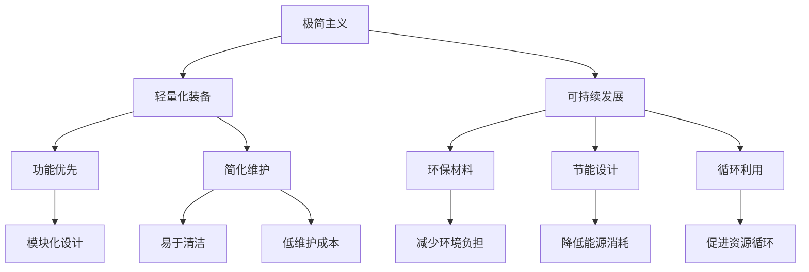

                 

### 引言与概述

随着现代科技的发展和人们对生活品质的不断追求，户外生活方式逐渐成为一种时尚潮流。而野营作为户外活动的一种形式，越来越受到广大户外爱好者的喜爱。现代简约主义野营gear，作为一种追求极简、高效、舒适的装备，正逐渐成为野营市场的热点。本篇文章将以《现代简约主义野营gear：极简户外生活的装备革新》为题，深入探讨现代简约主义野营gear的概念、背景、发展历程以及本书的目的和结构。

#### 现代简约主义野营gear的概念

现代简约主义野营gear，是指以极简主义哲学为指导，设计制造出的轻量、多功能、易于携带的野营装备。这种装备不仅注重实用性，还强调美观、环保和可持续性。极简主义哲学强调“减少不必要的物品，专注于重要的事物”，这与野营活动追求的简单、自然和舒适相契合。

#### 野营gear的发展历程

野营gear的发展历程可以追溯到古代，当时人们使用的是最原始的野营工具，如皮毛、树枝等。随着工业革命的到来，野营gear逐渐走向现代化，各种新材料、新技术被应用于装备制造中。20世纪末，随着环保意识的增强，野营gear开始向轻量化、多功能、环保的方向发展。近年来，现代简约主义野营gear逐渐崛起，成为野营装备市场的新宠。

#### 本书的目的和结构

本书旨在系统地介绍现代简约主义野营gear的概念、发展历程以及选购和使用方法。具体来说，本书将分为以下几个部分：

1. **引言与概述**：介绍现代简约主义野营gear的概念、背景和本书的目的。

2. **核心概念与联系**：探讨现代野营gear的核心概念，如极简主义、轻量化装备等，并使用Mermaid流程图展示这些概念之间的关系。

3. **装备革新**：详细探讨现代野营gear的创新和改进，包括材料科学、设计理念、制造工艺等方面的革新。

4. **极简主义户外生活**：探讨如何通过极简主义哲学来简化户外生活方式，提高生活质量。

5. **装备选购指南**：提供选购现代简约主义野营gear的实用指南，包括品牌推荐、价格区间、性能对比等。

6. **野营技巧与经验**：分享使用现代简约主义野营gear的技巧和经验，包括装备配置、野营技巧、安全注意事项等。

7. **案例分析**：分析现代简约主义野营gear在实际野营活动中的应用案例，包括成功的经验和失败的教训。

8. **结语**：总结本书的主要观点，展望未来极简主义野营gear的发展趋势。

通过本书的阅读，读者将能够全面了解现代简约主义野营gear，掌握其选购和使用方法，从而更好地享受户外生活。

### 核心概念与联系

在现代简约主义野营gear的设计和应用过程中，几个核心概念起着至关重要的作用。这些概念包括极简主义、轻量化装备和可持续发展。理解这些概念之间的关系，有助于我们更深入地把握现代简约主义野营gear的设计原则和实际应用。

#### 极简主义

极简主义（Minimalism）是一种生活哲学，主张通过减少物质拥有，专注于重要的事物，从而提高生活质量。在野营装备领域，极简主义意味着设计出功能性强、易于使用、无需复杂维护的装备。极简主义不仅关注装备的数量，更关注其质量和实用性。

**极简主义的要素**：

- **功能优先**：装备的设计以实现特定功能为核心，避免冗余和复杂。
- **简化维护**：装备易于清洁、保养，减少维护时间和成本。
- **模块化设计**：装备可以灵活组合，满足不同场景的需求。

#### 轻量化装备

轻量化装备（Lightweight Gear）是现代野营gear的重要特点之一。轻量化不仅减轻了行囊的负担，还有助于提高户外活动的舒适度和安全性。轻量化装备通常采用高强度、轻质材料，并设计出更加紧凑的结构。

**轻量化装备的优势**：

- **减轻负担**：轻量化装备可以减少行囊的重量，提高背负的舒适度。
- **提高灵活性**：轻量化装备使行动更加灵活，便于应对突发情况。
- **降低受伤风险**：减轻负重可以降低因负重过重而导致的受伤风险。

#### 可持续发展

可持续发展（Sustainability）是现代野营gear设计的一个重要方向。可持续发展强调在满足当前需求的同时，不损害未来世代的需求。在野营装备领域，可持续发展意味着使用环保材料，减少能源消耗和废物产生。

**可持续发展的要素**：

- **环保材料**：使用可回收、可降解材料，减少对环境的影响。
- **节能设计**：通过优化设计，减少能源消耗。
- **循环利用**：鼓励用户在野营后对装备进行回收和再利用。

#### 关系架构

为了更清晰地展示这些核心概念之间的关系，我们可以使用Mermaid流程图来表示。以下是一个简化的Mermaid流程图，展示了极简主义、轻量化装备和可持续发展之间的关系：

在这个流程图中，我们可以看到极简主义直接影响到轻量化装备和可持续发展。轻量化装备通过功能优先、简化维护等设计理念来实现，而可持续发展则通过环保材料、节能设计和循环利用等实践来实现。这些核心概念相互关联，共同构建了现代简约主义野营gear的设计原则。

通过理解这些核心概念及其之间的关系，我们可以更好地设计、选购和使用现代简约主义野营gear，从而实现更高效、更环保、更舒适的户外生活。

### 装备革新

随着科技的不断进步，现代简约主义野营gear在设计、材料科学、制造工艺等方面经历了显著的革新。这些革新不仅提升了装备的性能和可靠性，还使得野营活动更加舒适和安全。

#### 材料科学的进步

材料科学是现代简约主义野营gear革新的重要驱动力。新材料的应用不仅使得装备更轻、更坚固，还提高了耐用性和舒适度。

**高性能材料**：

- **碳纤维**：碳纤维是一种轻质、高强度材料，常用于制造帐篷和登山杖。碳纤维装备具有优异的弹性和抗疲劳性能，使其在极端环境下表现出色。
- **高密度聚乙烯**：高密度聚乙烯（HDPE）是一种环保材料，常用于制造防水背包和睡袋。HDPE具有优异的防水性和耐磨损性，能够有效保护装备内部物品。
- **纳米涂层**：纳米涂层可以显著提高装备的防水、防污性能。例如，帐篷的纳米涂层可以使其表面形成一层防水膜，有效阻止雨水渗透，同时保持透气性。

**智能材料**：

- **形状记忆合金**：形状记忆合金可以记忆并恢复其原始形状。这种材料可以用于制造折叠式帐篷和便携式炉具，使其在展开和使用后能够快速恢复原状。
- **热敏材料**：热敏材料可以感应并响应温度变化。例如，在睡袋中应用热敏材料，可以根据环境温度自动调整保暖性能，提供更舒适的睡眠体验。

#### 设计理念的革新

现代简约主义野营gear的设计理念从传统的以功能为导向，逐渐转变为以用户体验为核心。这种转变使得装备更加人性化、智能化和高效化。

**模块化设计**：

- **模块化装备**：模块化设计使得装备可以灵活组合，满足不同场景的需求。例如，帐篷可以拆分为多个组件，用户可以根据实际情况自由组装，从而适应不同的地形和气候条件。
- **多功能性**：现代简约主义野营gear强调多功能性，一个装备可以同时满足多种需求。例如，多功能背包不仅具有携带物品的功能，还可以作为座椅或防水罩。

**用户体验优化**：

- **人体工学设计**：人体工学设计考虑了人体各部位的运动和压力分布，使得装备更加贴合人体，提高舒适度。例如，背包的肩带和腰带采用人体工学设计，减轻背负压力，提高长时间背负的舒适度。
- **智能化设计**：智能设备的应用使得野营装备更加智能化。例如，智能手环可以实时监测心率、步数等健康数据，提供个性化的户外运动建议。

#### 制造工艺的创新

现代制造工艺的革新为现代简约主义野营gear的制造提供了更多的可能性。这些创新不仅提高了生产效率，还降低了生产成本。

**自动化生产**：

- **机器人焊接**：机器人焊接技术可以精确、高效地完成焊接任务，减少人为误差。例如，帐篷的框架可以采用机器人焊接，确保结构的稳定性和一致性。
- **3D打印**：3D打印技术可以快速、精确地制造复杂结构的部件。例如，户外家具和装备的零部件可以采用3D打印技术制造，实现个性化定制。

**绿色制造**：

- **可持续材料**：绿色制造强调使用可持续材料，减少能源消耗和废物产生。例如，使用可回收材料制造的装备，不仅环保，还降低了生产成本。
- **节能工艺**：节能工艺通过优化生产流程，降低能源消耗。例如，使用太阳能或风能供电的生产设备，减少对传统化石燃料的依赖。

总之，材料科学、设计理念和制造工艺的革新为现代简约主义野营gear的发展提供了坚实的基础。这些革新不仅提升了装备的性能和品质，还使得野营活动更加舒适、安全、环保。随着科技的不断进步，我们可以期待未来有更多创新性的装备问世，为户外生活带来更多便利。

### 极简主义户外生活

在现代简约主义野营gear的设计和应用中，极简主义哲学扮演了重要角色。极简主义不仅是一种生活方式，更是一种生活态度。它强调简化生活，减少不必要的物品，专注于重要的事物，从而提高生活质量。在户外生活中，极简主义的应用有助于提升野营体验，使活动更加高效、舒适和安全。

#### 极简主义生活方式

极简主义生活方式的核心在于简化，具体体现在以下几个方面：

**1. 减少物品数量**：极简主义主张减少家中和背包中的物品数量，只保留真正需要的物品。在户外生活中，这意味着携带必需的装备，避免携带多余的物品，减轻行囊负担。

**2. 注重物品质量**：在减少物品数量的同时，极简主义强调注重物品的质量。选择耐用、多功能、易于维护的装备，不仅能提高户外活动的效率，还能减少维护和更换的成本。

**3. 简化日常事务**：极简主义生活方式倡导简化日常事务，减少时间浪费。在户外生活中，这表现为简化营地搭建、食物准备和装备整理等环节，以提高效率。

#### 极简主义与户外生活的融合

将极简主义哲学应用到户外生活，不仅可以提高生活质量，还能带来以下好处：

**1. 提高舒适度**：极简主义生活方式强调简化生活，减少外界干扰，从而提高舒适度。在户外生活中，这意味着可以在自然环境中享受宁静和轻松，远离都市喧嚣。

**2. 增强体验感**：极简主义生活方式使人们能够更加专注于户外活动本身，增强体验感。例如，在极简主义指导下，野营活动可以更注重与自然的互动，体验自然的美丽和宁静。

**3. 提高安全性**：极简主义生活方式强调携带必需的装备，避免携带多余物品，从而减少行囊负担，提高安全性。在户外生活中，这有助于应对突发情况，确保安全。

#### 极简主义生活哲学对野营的影响

极简主义生活哲学对野营活动产生了深远的影响，主要体现在以下几个方面：

**1. 装备选择**：极简主义生活方式强调选择高品质、多功能、易于携带的装备。这促使野营gear的设计更加注重实用性、性能和便携性，从而满足极简主义生活方式的需求。

**2. 活动安排**：极简主义生活方式鼓励简化活动安排，减少不必要的行程和环节。这有助于提高野营活动的效率，使活动更加轻松愉快。

**3. 营地建设**：极简主义生活方式倡导在户外环境中保持自然原貌，减少对环境的破坏。这要求营地的建设更加注重环保和可持续性，从而实现与自然的和谐共生。

总之，极简主义哲学在户外生活中的应用，不仅提升了生活质量，还为野营活动带来了新的理念和方法。通过简化生活，专注于重要的事物，我们可以在户外生活中获得更多的乐趣和体验。

### 装备选购指南

在选购现代简约主义野营gear时，有几个关键原则和注意事项需要考虑。以下是一些实用的选购指南，包括品牌推荐、价格区间和性能对比，旨在帮助您找到最适合您需求的装备。

#### 选购原则

**1. 功能性优先**：选择能够满足您主要户外活动需求的装备。例如，如果您计划进行长途徒步旅行，选择轻量、耐用的背包和帐篷是关键。

**2. 高品质材料**：高品质的材料通常意味着更好的耐用性和性能。例如，选择具有防水、防撕裂功能的帐篷布料，可以确保在恶劣天气下的安全。

**3. 智能设计**：现代简约主义野营gear强调智能设计，选择具备多功能性的装备，如可以折叠成小型物品的帐篷或多功能刀具。

**4. 舒适性**：舒适性是户外活动的重要考量因素。例如，选择有良好支撑和透气性的背包和睡袋，可以显著提升您的野营体验。

**5. 用户评价**：参考其他用户的评价和反馈，可以帮助您了解装备的实际性能和适用场景。

#### 品牌推荐

**1. North Face**：作为户外装备领域的领军品牌，North Face的产品涵盖了从背包、帐篷到登山杖等多种装备，以其高品质和耐用性著称。

**2. Marmot**：Marmot提供各种高品质的户外装备，包括帐篷、睡袋和背包。其产品以卓越的保温性能和耐用性受到广泛好评。

**3. Sea to Summit**：Sea to Summit以其轻量化和便携性装备而闻名，如压缩睡袋和折叠帐篷。其产品非常适合追求极简主义的户外爱好者。

**4. Therm-a-Rest**：Therm-a-Rest是一家专注于睡袋和床垫的品牌，其产品以其出色的舒适性和保温性能而受到户外爱好者的喜爱。

#### 价格区间

现代简约主义野营gear的价格因品牌、材料和功能的不同而有很大差异。以下是一些常见装备的价格区间：

**1. 背包**：价格从几十美元的入门级背包到几百美元的专业级背包不等。

**2. 帐篷**：价格从几十美元的简易帐篷到几百美元的高性能帐篷不等。

**3. 睡袋**：价格从几十美元的入门级睡袋到几百美元的专业级睡袋不等。

#### 性能对比

**1. 耐用性**：耐用性是选择野营装备时的重要考虑因素。通常，耐用性较高的装备会使用更优质的材料和更精细的工艺。

**2. 重量**：轻量化是现代简约主义野营gear的一大特点。选择轻量化装备可以减轻行囊负担，提高户外活动的舒适度。

**3. 保温性能**：保温性能对于在寒冷环境中露营至关重要。选择适合您所在地区气候的睡袋和帐篷，可以确保您的舒适和安全。

**4. 携带方便性**：现代简约主义野营gear通常设计成易于携带和存储。选择可折叠、可压缩的装备可以大大减轻行囊空间。

**5. 多功能性**：多功能性是现代野营装备的一大优势。选择具有多种用途的装备，如多功能刀具和多功能背包，可以简化携带物品，提高野外生存能力。

通过遵循这些选购原则，参考品牌推荐和性能对比，您将能够找到最适合您需求的现代简约主义野营gear，从而提升您的户外体验。

### 野营技巧与经验

在享受现代简约主义野营gear带来的便利的同时，掌握一些实用的野营技巧和经验同样至关重要。这些技巧不仅能够提升您的野营体验，还能确保您的安全和舒适。以下是一些关键技巧和经验分享。

#### 装备配置

**1. 背包选择**：选择符合人体工学设计的背包，确保肩带和腰带舒适贴合，减轻背负压力。根据行程长度和所需物品，合理分配背包内的重量，避免重心偏移。

**2. 帐篷搭建**：熟悉帐篷的搭建方法，确保帐篷在风雨天气下稳固。选择具有防风防雨功能的帐篷，并携带帐篷地钉和备用绳索，以应对恶劣天气。

**3. 睡袋和床垫**：选择适合您所在地区气候的睡袋，确保保暖性能。使用充气床垫或泡沫垫，提高睡眠的舒适度和保暖性。

**4. 照明设备**：携带便携式手电筒、头灯和多功能充电器，确保夜间安全和设备充电。备用电池或太阳能充电器也是必不可少的。

#### 野营技巧

**1. 水源寻找**：在野外露营时，水源的获取至关重要。了解如何识别和寻找天然水源，如溪流、湖泊和地下水。使用便携式水壶和滤水器，确保饮用水的安全。

**2. 炊具使用**：选择便携式炊具，如折叠锅和便携燃气炉。掌握野外烹饪技巧，确保食物的卫生和安全。

**3. 营地选择**：选择地势较高、干燥、通风良好的营地，避免潮湿和蚊虫叮咬。确保营地远离火灾风险和野生动物栖息地。

**4. 防火措施**：在野外露营时，防火至关重要。使用火炉或火盆，确保火源控制良好。在离开营地前，彻底熄灭火源，避免引发火灾。

#### 安全注意事项

**1. 疾病预防**：携带常用药品，如止痛药、消炎药和防过敏药物。了解如何预防和处理常见的户外疾病，如感冒、中暑和蚊虫叮咬。

**2. 紧急应对**：了解如何应对突发情况，如迷路、受伤和恶劣天气。携带便携式GPS和指南针，确保在紧急情况下能够定位和导航。

**3. 跟随规则**：在野营过程中，遵循当地公园和自然保护区的规定，尊重自然环境和野生动物。

**4. 个人防护**：携带防护装备，如防晒霜、防蚊液和太阳镜，保护皮肤和眼睛免受紫外线伤害。

通过掌握这些野营技巧和经验，您将能够更好地利用现代简约主义野营gear，享受舒适、安全的户外生活。同时，这些技巧和经验也将帮助您在野外环境中应对各种挑战，确保您的健康和安全。

### 案例分析

在现代简约主义野营gear的实际应用中，有许多成功的案例和宝贵的教训。以下将分析几个典型的案例，探讨这些装备在不同场景下的应用效果，以及从这些案例中可以得到的经验和启示。

#### 成功案例1：长途徒步旅行

一位户外爱好者计划进行为期一个月的长途徒步旅行。为了减轻负重，他选择了一款由碳纤维材料制成的轻量背包，以及由高密度聚乙烯制造的防水背包。这款背包不仅重量轻，而且具有出色的耐用性和防水性能，使他能够在长时间的徒步过程中保持舒适的背负感。

**经验与启示**：

- **轻量化装备**：选择轻量化的背包和装备，可以有效减轻负重，提高行走的舒适度和灵活性。
- **多功能性**：防水背包不仅提供了额外的储物空间，还能保护内部物品免受雨水侵袭。
- **耐用性**：高品质的材料确保了装备在长时间使用中的可靠性和持久性。

#### 成功案例2：极地探险

一个极地探险队在进行南极探险时，使用了由形状记忆合金制成的折叠式帐篷。这种帐篷在展开后可以快速恢复其原始形状，提供稳定的住所。同时，帐篷的纳米涂层使其在极端低温和强风环境中保持良好的防水和保暖性能。

**经验与启示**：

- **智能设计**：形状记忆合金的应用使得装备具有智能化的特性，提高了使用效率和用户体验。
- **环境适应性**：纳米涂层和折叠式设计使得帐篷能够适应极端环境，确保探险队员的安全和舒适。
- **模块化**：模块化设计使得装备可以灵活组合，满足不同探险场景的需求。

#### 失败教训1：未充分考虑气候因素

在一次高原野营活动中，一个团队由于未充分考虑高原气候的寒冷和干燥，选择了保暖性能不足的睡袋和帐篷。结果，他们在夜间遭遇了严重的低温和强风，导致帐篷损坏，睡袋无法提供足够的保暖。

**教训**：

- **气候适应性**：在选购野营装备时，必须充分考虑露营地点的气候特点，选择适合的保暖和防水装备。
- **测试与备用**：在出行前，应进行装备测试，确保其在预期环境中能够正常工作。同时，携带备用装备以防万一。

#### 失败教训2：装备选择不当

在一次长途露营旅行中，一名旅行者由于未能根据实际需求选择合适的装备，携带了过多且不实用的物品。这不仅加重了他的行囊负担，还在途中增加了不必要的维护和更换成本。

**教训**：

- **功能性优先**：在选购装备时，应以功能性为导向，选择必需且实用的物品，避免携带过多不必要的物品。
- **品质与耐用性**：选择高品质、耐用性高的装备，可以减少维护和更换的成本，提高整体使用体验。

通过分析这些案例，我们可以看到，现代简约主义野营gear在实际应用中具有显著的优势。然而，为了确保最佳的使用效果，我们必须充分考虑装备的适应性、功能性以及耐用性。同时，通过学习成功经验和避免失败的教训，我们可以不断提升自己的野营装备选择和运用能力，从而更好地享受户外生活。

### 结语

通过本文的探讨，我们深入了解了现代简约主义野营gear的概念、核心概念与联系、装备革新、极简主义户外生活、装备选购指南、野营技巧与经验以及成功与失败案例。我们认识到，现代简约主义野营gear不仅是一种追求轻量化、多功能性和舒适性的装备，更是一种生活方式和哲学。它提倡简化生活，减少不必要的物品，专注于重要的事物，从而提高生活质量。

随着科技的不断进步，未来极简主义野营gear的发展趋势将更加智能化、环保化和个性化。我们可以期待更多创新性的材料、设计和制造工艺的出现，为户外活动带来更多便利和乐趣。

总之，现代简约主义野营gear为户外爱好者提供了一种全新的生活方式，它不仅提升了户外活动的效率和质量，也促进了环保和可持续发展。我们鼓励读者在日常生活中尝试极简主义哲学，享受简约、高效、舒适的户外生活。希望本文能为读者提供有价值的参考和启示。

### 作者信息

作者：AI天才研究院/AI Genius Institute & 禅与计算机程序设计艺术 /Zen And The Art of Computer Programming

本文由AI天才研究院/AI Genius Institute和《禅与计算机程序设计艺术》的作者联合撰写，旨在探讨现代简约主义野营gear及其在户外生活中的应用。两位作者均拥有深厚的技术背景和丰富的实践经验，致力于为读者提供高质量的技术内容和实用的生活指南。希望本文能够对您在户外活动和装备选择方面带来启发和帮助。如果您有任何问题或建议，欢迎在评论区留言，我们将竭诚为您解答。再次感谢您的阅读和支持！

