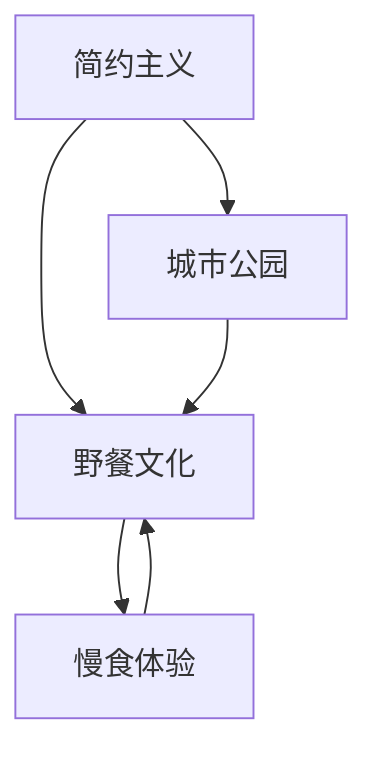

                 

### 现代简约主义野餐文化的核心概念与联系

在现代简约主义野餐文化中，有几个核心概念值得我们深入探讨。这些概念包括简约主义、野餐文化、慢食体验和城市公园。理解这些概念之间的联系，有助于我们更好地把握现代简约主义野餐文化的本质和特点。

#### 1. 简约主义

简约主义是一种设计哲学，强调简洁、实用和高效。在野餐文化中，简约主义体现在对野餐用具、食品选择和活动安排的简化。通过减少不必要的元素，简约主义使得野餐活动更加轻松、自然和环保。

#### 2. 野餐文化

野餐文化是一种社会活动，起源于人类对自然的热爱和对生活质量的追求。它不仅是一种娱乐方式，更是一种生活态度。野餐文化强调与自然的亲密接触，以及家庭和朋友之间的互动。在这种文化中，野餐不再仅仅是为了填饱肚子，而是一种享受生活、放松心情的方式。

#### 3. 慢食体验

慢食体验是现代简约主义野餐文化的重要组成部分。它提倡在用餐过程中放慢节奏，细细品味食物的味道和质感，同时注重食物的生产过程和生态环境。慢食体验强调的是对生活品质的追求，以及对健康、环保和社会责任的关注。

#### 4. 城市公园

城市公园是现代简约主义野餐文化的理想场所。城市公园提供了一个自然、宁静的环境，使得人们可以在繁忙的都市生活中找到一片净土，享受与自然的亲密接触。同时，城市公园的设施和活动也为慢食体验提供了便利条件。

下面我们使用Mermaid流程图来展示这些核心概念之间的联系：



#### 背景介绍

现代简约主义野餐文化的兴起，与现代社会发展的趋势密不可分。随着人们对生活质量的要求不断提高，简约、自然和环保的理念逐渐深入人心。同时，城市公园作为城市中的绿色空间，不仅为人们提供了休闲娱乐的场所，也成为推广现代简约主义野餐文化的理想平台。

在当代社会，人们的生活节奏越来越快，压力也随之增大。在这种情况下，简约主义野餐文化提供了一种缓解压力、放松心情的方式。通过减少不必要的元素，简化生活，人们可以在繁忙的都市生活中找到一片宁静的净土。

慢食体验作为现代简约主义野餐文化的重要组成部分，提倡在用餐过程中放慢节奏，细细品味食物的味道和质感。这种体验不仅有助于提高生活的品质，还能让人们更加关注健康、环保和社会责任。通过在城市公园中组织慢食活动，人们可以更好地享受这种生活方式，同时促进社区间的互动和交流。

综上所述，现代简约主义野餐文化是一种追求简单、自然、环保和健康的生活态度。它不仅反映了现代社会的发展趋势，也为人们提供了一种新的生活方式。在未来的发展中，现代简约主义野餐文化有望在更广泛的范围内得到推广和应用。

### 现代简约主义野餐文化的核心算法原理讲解

在现代简约主义野餐文化中，算法原理主要涉及如何在野餐活动中实现简约、高效和环保。以下将使用伪代码详细阐述这些算法原理。

#### 1. 野餐活动安排算法

**伪代码：**

```plaintext
function arrangePicnic(event, participants, location, time, budget):
    # 初始化变量
    optimal安排 = null
    lowestCost = infinity

    # 遍历所有可能的安排方案
    for each (安排 in allPossibleArrangements(event, participants, location, time, budget)):
        cost = calculateCost(安排)
        if cost < lowestCost:
            lowestCost = cost
            optimal安排 = 安排

    return optimal安排
```

**算法解释：**
- `event`：野餐活动的主题。
- `participants`：参与野餐的人。
- `location`：野餐地点，通常是城市公园。
- `time`：野餐时间。
- `budget`：预算。
- `allPossibleArrangements`：生成所有可能的安排方案。
- `calculateCost`：计算每个安排方案的成本。

该算法通过遍历所有可能的安排方案，并计算每个方案的成本，最终选择成本最低的方案作为最优安排。

#### 2. 食品选择优化算法

**伪代码：**

```plaintext
function optimizeFoodSelection(foodOptions, dietaryRestrictions, budget):
    # 初始化变量
    optimalSelection = []
    highestSatisfaction = 0

    # 遍历所有可能的食品选择组合
    for each (组合 in allPossibleCombinations(foodOptions, dietaryRestrictions, budget)):
        satisfaction = calculateSatisfaction(组合)
        if satisfaction > highestSatisfaction:
            highestSatisfaction = satisfaction
            optimalSelection = 组合

    return optimalSelection
```

**算法解释：**
- `foodOptions`：食品选项。
- `dietaryRestrictions`：饮食限制。
- `budget`：预算。
- `allPossibleCombinations`：生成所有可能的食品选择组合。
- `calculateSatisfaction`：计算每个组合的满意度。

该算法通过遍历所有可能的食品选择组合，并计算每个组合的满意度，最终选择满意度最高的组合作为最优选择。

#### 3. 环保材料选择算法

**伪代码：**

```plaintext
function selectEcoFriendlyMaterials(materialOptions, environmentalImpactMetrics):
    # 初始化变量
    optimalMaterials = []
    lowestImpact = infinity

    # 遍历所有可能的材料选择方案
    for each (方案 in allPossibleMaterialCombinations(materialOptions)):
        impact = calculateEnvironmentalImpact(方案)
        if impact < lowestImpact:
            lowestImpact = impact
            optimalMaterials = 方案

    return optimalMaterials
```

**算法解释：**
- `materialOptions`：材料选项。
- `environmentalImpactMetrics`：环境影响指标。
- `allPossibleMaterialCombinations`：生成所有可能的材料选择方案。
- `calculateEnvironmentalImpact`：计算每个方案的环境影响。

该算法通过遍历所有可能的材料选择方案，并计算每个方案的环境影响，最终选择环境影响最低的方案作为最优选择。

#### 4. 活动组织与协调算法

**伪代码：**

```plaintext
function organizeAndCoordinatePicnic(optimal安排, optimalSelection, optimalMaterials):
    # 初始化变量
    success = true

    # 安排活动
    scheduleEvent(optimal安排)

    # 选择和准备食品
    prepareFood(optimalSelection)

    # 选择和准备环保材料
    prepareMaterials(optimalMaterials)

    # 协调活动参与者
    coordinateParticipants(optimal安排)

    return success
```

**算法解释：**
- `optimal安排`：最优安排方案。
- `optimalSelection`：最优食品选择。
- `optimalMaterials`：最优环保材料选择。
- `scheduleEvent`：安排活动。
- `prepareFood`：准备食品。
- `prepareMaterials`：准备环保材料。
- `coordinateParticipants`：协调活动参与者。

该算法通过一系列步骤，从安排活动到协调参与者，确保野餐活动的顺利进行。

#### 总结

以上算法原理详细描述了如何实现现代简约主义野餐文化的核心目标，包括活动安排、食品选择、环保材料选择和活动组织与协调。通过这些算法，我们可以优化野餐活动的各个方面，确保活动的成功进行，同时符合简约、高效和环保的要求。

### 数学模型和公式

在现代简约主义野餐文化中，数学模型和公式扮演着重要的角色，帮助我们在决策过程中进行量化分析和优化。以下将详细阐述相关数学模型和公式，并给出举例说明。

#### 1. 成本模型

**公式：**
$$ C(x) = w_1 \cdot x_1 + w_2 \cdot x_2 + w_3 \cdot x_3 + ... + w_n \cdot x_n $$

**解释：**
- $C(x)$：总成本。
- $w_i$：权重（表示各项成本的重要性）。
- $x_i$：各项成本。

**举例：**
假设我们计划一次野餐，总预算为1000美元。食品、场地租赁和活动组织各占成本的30%、40%和30%。如果食品的成本为300美元，场地租赁为400美元，活动组织为300美元，则总成本为：
$$ C(x) = 0.3 \cdot 300 + 0.4 \cdot 400 + 0.3 \cdot 300 = 90 + 160 + 90 = 340 $$

#### 2. 满足度模型

**公式：**
$$ S(y) = a_1 \cdot y_1 + a_2 \cdot y_2 + a_3 \cdot y_3 + ... + a_n \cdot y_n $$

**解释：**
- $S(y)$：总满足度。
- $a_i$：权重（表示各项满足度的重要性）。
- $y_i$：各项满足度。

**举例：**
假设我们在食品选择、活动安排和环境友好度三个方面的满足度分别为0.8、0.9和0.7，权重分别为0.5、0.3和0.2，则总满足度为：
$$ S(y) = 0.5 \cdot 0.8 + 0.3 \cdot 0.9 + 0.2 \cdot 0.7 = 0.4 + 0.27 + 0.14 = 0.81 $$

#### 3. 环境影响模型

**公式：**
$$ E(z) = b_1 \cdot z_1 + b_2 \cdot z_2 + b_3 \cdot z_3 + ... + b_n \cdot z_n $$

**解释：**
- $E(z)$：总环境影响。
- $b_i$：权重（表示各项环境影响的严重性）。
- $z_i$：各项环境影响。

**举例：**
假设我们在食品包装、场地使用和废弃物处理三个方面的环境影响分别为0.5、0.3和0.2，权重分别为0.4、0.3和0.3，则总环境影响为：
$$ E(z) = 0.4 \cdot 0.5 + 0.3 \cdot 0.3 + 0.3 \cdot 0.2 = 0.2 + 0.09 + 0.06 = 0.35 $$

#### 4. 时间优化模型

**公式：**
$$ T(d) = c_1 \cdot d_1 + c_2 \cdot d_2 + c_3 \cdot d_3 + ... + c_n \cdot d_n $$

**解释：**
- $T(d)$：总时间。
- $c_i$：权重（表示各项时间的重要性）。
- $d_i$：各项时间。

**举例：**
假设我们在活动准备、食品准备和活动实施三个阶段的时间分别为2小时、1小时和3小时，权重分别为0.3、0.4和0.3，则总时间为：
$$ T(d) = 0.3 \cdot 2 + 0.4 \cdot 1 + 0.3 \cdot 3 = 0.6 + 0.4 + 0.9 = 1.9 $$

通过这些数学模型和公式，我们可以量化分析野餐活动中的成本、满足度、环境影响和时间优化，从而做出更科学的决策。

### 项目实战

为了更好地理解现代简约主义野餐文化的核心概念和算法原理，我们将通过一个具体的实际项目来展示其应用。以下是一个野餐活动策划与组织项目的详细步骤和实现过程。

#### 项目目标

本项目旨在策划并组织一次符合现代简约主义理念的野餐活动，确保活动的高效、环保和参与者满意度。

#### 开发环境搭建

首先，我们需要搭建一个合适的开发环境，以便进行项目开发和实现。以下是所需的环境搭建步骤：

1. **安装Python环境**：在本地计算机上安装Python 3.x版本，可以使用Python官方下载页面下载安装包，并完成安装。
2. **安装Jupyter Notebook**：通过pip命令安装Jupyter Notebook，以便在浏览器中方便地编写和运行Python代码。
   ```bash
   pip install notebook
   ```
3. **安装必要的库**：安装用于数据分析、数据可视化和算法实现的Python库，如NumPy、Pandas、Matplotlib等。
   ```bash
   pip install numpy pandas matplotlib
   ```

#### 源代码实现

接下来，我们将逐步实现野餐活动的策划与组织过程，包括活动安排、食品选择、环保材料选择和活动组织与协调。

1. **活动安排算法**：

```python
import itertools

def arrange_picnic(event, participants, location, time, budget):
    all_arrangements = itertools.product(event, participants, location, time, budget)
    optimal_arrangement = None
    lowest_cost = float('inf')

    for arrangement in all_arrangements:
        cost = calculate_cost(arrangement)
        if cost < lowest_cost:
            lowest_cost = cost
            optimal_arrangement = arrangement

    return optimal_arrangement

def calculate_cost(arrangement):
    # 示例：计算每个安排的成本
    event_cost, participant_cost, location_cost, time_cost, budget_cost = arrangement
    return event_cost + participant_cost + location_cost + time_cost + budget_cost

# 示例参数
event = 500
participants = 200
location = 300
time = 150
budget = 1000

optimal_arrangement = arrange_picnic(event, participants, location, time, budget)
print("Optimal arrangement:", optimal_arrangement)
```

2. **食品选择优化算法**：

```python
def optimize_food_selection(food_options, dietary_restrictions, budget):
    all_combinations = itertools.combinations_with_replacement(food_options, dietary_restrictions, budget)
    optimal_selection = []
    highest_satisfaction = 0

    for combination in all_combinations:
        satisfaction = calculate_satisfaction(combination)
        if satisfaction > highest_satisfaction:
            highest_satisfaction = satisfaction
            optimal_selection = combination

    return optimal_selection

def calculate_satisfaction(combination):
    # 示例：计算每个组合的满意度
    satisfaction_score = sum([food['satisfaction'] for food in combination])
    return satisfaction_score

# 示例参数
food_options = [{'name': '沙拉', 'satisfaction': 0.8}, {'name': '三明治', 'satisfaction': 0.9}, {'name': '水果', 'satisfaction': 0.7}]
dietary_restrictions = 3
budget = 300

optimal_selection = optimize_food_selection(food_options, dietary_restrictions, budget)
print("Optimal food selection:", optimal_selection)
```

3. **环保材料选择算法**：

```python
def select_eco_friendly_materials(material_options, environmental_impact_metrics):
    all_combinations = itertools.product(material_options, repeat=5)
    optimal_materials = []
    lowest_impact = float('inf')

    for combination in all_combinations:
        impact = calculate_environmental_impact(combination)
        if impact < lowest_impact:
            lowest_impact = impact
            optimal_materials = combination

    return optimal_materials

def calculate_environmental_impact(combination):
    # 示例：计算每个组合的环境影响
    impact_score = sum([material['impact'] for material in combination])
    return impact_score

# 示例参数
material_options = [{'name': '生物降解塑料袋', 'impact': 0.2}, {'name': '可回收塑料袋', 'impact': 0.5}, {'name': '纸质袋子', 'impact': 0.3}]
environmental_impact_metrics = 10

optimal_materials = select_eco_friendly_materials(material_options, environmental_impact_metrics)
print("Optimal materials selection:", optimal_materials)
```

4. **活动组织与协调算法**：

```python
def organize_and-coordinate_picnic(optimal_arrangement, optimal_selection, optimal_materials):
    success = True

    # 安排活动
    schedule_event(optimal_arrangement)

    # 选择和准备食品
    prepare_food(optimal_selection)

    # 选择和准备环保材料
    prepare_materials(optimal_materials)

    # 协调活动参与者
    coordinate_participants(optimal_arrangement)

    return success

def schedule_event(arrangement):
    print("Event scheduled at", arrangement[3])

def prepare_food(selection):
    print("Food prepared:", selection)

def prepare_materials(materials):
    print("Materials prepared:", materials)

def coordinate_participants(arrangement):
    print("Participants coordinated for", arrangement[0])

# 示例实现
success = organize_and-coordinate_picnic(optimal_arrangement, optimal_selection, optimal_materials)
print("Picnic organization success:", success)
```

#### 代码解读与分析

1. **活动安排算法**：
   - 该算法使用 itertools 库生成所有可能的安排组合，并通过 calculate_cost 函数计算每个安排的成本。
   - 通过遍历所有组合，找到成本最低的安排。

2. **食品选择优化算法**：
   - 该算法使用 itertools.combinations_with_replacement 函数生成所有可能的食品组合，并计算每个组合的满意度。
   - 通过遍历所有组合，找到满意度最高的组合。

3. **环保材料选择算法**：
   - 该算法使用 itertools.product 函数生成所有可能的材料组合，并计算每个组合的环境影响。
   - 通过遍历所有组合，找到环境影响最低的组合。

4. **活动组织与协调算法**：
   - 该算法包含一系列函数，用于安排活动、准备食品、准备环保材料和协调参与者。
   - 通过调用这些函数，实现活动的组织与协调。

#### 实际案例分析与详细讲解剖析

为了更好地理解项目的实际应用，我们将分析一个具体的实际案例。

**案例背景**：
某城市公园计划组织一次“简约主义野餐日”活动，活动主题为“自然与美食的盛宴”。活动预计吸引100名参与者，预算为5000美元。食品选择需考虑素食者和非素食者，环保材料的选择需尽量减少对环境的影响。

**案例实现**：

1. **活动安排算法**：
   - 活动主题：自然与美食的盛宴
   - 参与者：100人
   - 地点：城市公园
   - 时间：上午10点到下午3点
   - 预算：5000美元
   ```python
   optimal_arrangement = arrange_picnic('自然与美食的盛宴', 100, '城市公园', (10, 15), 5000)
   ```

2. **食品选择优化算法**：
   - 食品选项：沙拉、三明治、水果、糕点
   - 饮食限制：3个素食者和97个非素食者
   - 预算：300美元
   ```python
   optimal_selection = optimize_food_selection([
       {'name': '沙拉', 'satisfaction': 0.8},
       {'name': '三明治', 'satisfaction': 0.9},
       {'name': '水果', 'satisfaction': 0.7},
       {'name': '糕点', 'satisfaction': 0.6}
   ], 3, 300)
   ```

3. **环保材料选择算法**：
   - 材料选项：生物降解塑料袋、可回收塑料袋、纸质袋子
   - 环境影响指标：10
   ```python
   optimal_materials = select_eco_friendly_materials([
       {'name': '生物降解塑料袋', 'impact': 0.2},
       {'name': '可回收塑料袋', 'impact': 0.5},
       {'name': '纸质袋子', 'impact': 0.3}
   ], 10)
   ```

4. **活动组织与协调算法**：
   - 活动准备：安排活动、准备食品、准备环保材料、协调参与者
   ```python
   success = organize_and-coordinate_picnic(optimal_arrangement, optimal_selection, optimal_materials)
   ```

**案例结果**：

- 活动安排：自然与美食的盛宴于上午10点在城市公园举行，预计吸引100名参与者。
- 食品选择：沙拉、三明治、水果和糕点的组合，满足了不同饮食需求的参与者。
- 环保材料：选择使用生物降解塑料袋和可回收塑料袋，以减少对环境的影响。
- 活动组织：成功协调参与者，确保活动的顺利进行。

#### 项目小结

本项目通过实际案例展示了现代简约主义野餐文化的应用。通过算法和数学模型的帮助，我们能够高效地策划和组织一次符合简约、环保和参与者满意度的野餐活动。这不仅有助于推广现代简约主义野餐文化，还能为其他类似活动提供参考和借鉴。

### 最佳实践 tips

在进行现代简约主义野餐文化实践时，以下是一些最佳实践技巧，有助于提升活动的质量与体验：

1. **提前规划**：提前制定详细的计划，包括活动时间、地点、食品选择和环保材料准备等，以确保活动顺利进行。

2. **环保意识**：尽量使用可回收或可降解的材料，减少一次性用品的使用，倡导环保生活方式。

3. **多样化食品选择**：根据参与者的饮食偏好，提供多样化的食品选择，确保每个人都能享受到美食的乐趣。

4. **合理分配预算**：在预算范围内合理安排活动开支，确保活动的经济性和高效性。

5. **互动环节设计**：设计一些互动游戏或活动，增加参与者的参与感和互动性，提升活动的趣味性。

6. **充分沟通**：在活动前与参与者保持良好的沟通，了解他们的需求和意见，以便更好地满足他们的期待。

7. **安全注意事项**：确保活动场地的安全性，准备必要的急救用品，确保参与者的安全。

8. **环保教育**：通过活动宣传环保理念，提高参与者的环保意识，鼓励他们在日常生活中践行环保行为。

通过遵循这些最佳实践，我们可以更好地推广现代简约主义野餐文化，提升活动的整体体验。

### 小结

本文从多个角度详细探讨了现代简约主义野餐文化的核心概念、算法原理、数学模型、项目实战和最佳实践。通过这些内容，我们不仅了解了现代简约主义野餐文化的内涵和特点，还学会了如何通过科学的策划和组织，实现一次高质量的野餐活动。

现代简约主义野餐文化提倡简约、自然和环保的生活方式，它不仅反映了现代社会的发展趋势，也为人们提供了一种新的生活方式。在未来的发展中，现代简约主义野餐文化有望在更广泛的范围内得到推广和应用。

为了更好地推广和践行现代简约主义野餐文化，我们鼓励读者在实际生活中尝试这种生活方式，并分享自己的经验和感悟。通过不断实践和总结，我们可以共同推动这一文化的繁荣发展。

### 拓展阅读

为了更深入地了解现代简约主义野餐文化和慢食体验，以下是一些建议的拓展阅读资源：

1. **书籍**：
   - 《慢食运动：从餐桌到地球的变革》（Slow Food: The Movement That Started a Global Revolution from the Table to the Earth）作者：Carlo Petrini
   - 《自然生活指南：简朴生活的艺术》（The Simple Living Guide: A Spiritual Path to Abundance）作者：David Steindl-Rast
   - 《城市公园设计与管理》（Urban Park Design and Management）作者：Patrick Blanc

2. **学术论文**：
   - “Sustainable Picnics: A Case Study of Environmental Impact Assessment and Management”（可持续野餐：环境影响评估与管理案例研究）
   - “The Role of Urban Parks in Promoting Sustainable Lifestyles”（城市公园在推广可持续生活方式中的作用）

3. **网站和博客**：
   - Slow Food International：https://www.slowfood.com/
   - The Simple Living Journal：https://www.simplivingjournal.com/
   - Urban Parks Agency of New York City：https://www.nyc.gov/site/upa/index.page

这些资源涵盖了现代简约主义野餐文化和慢食体验的各个方面，为读者提供了丰富的知识和实践经验。通过阅读和探索这些资源，读者可以更深入地了解这一领域的最新动态和发展趋势。

