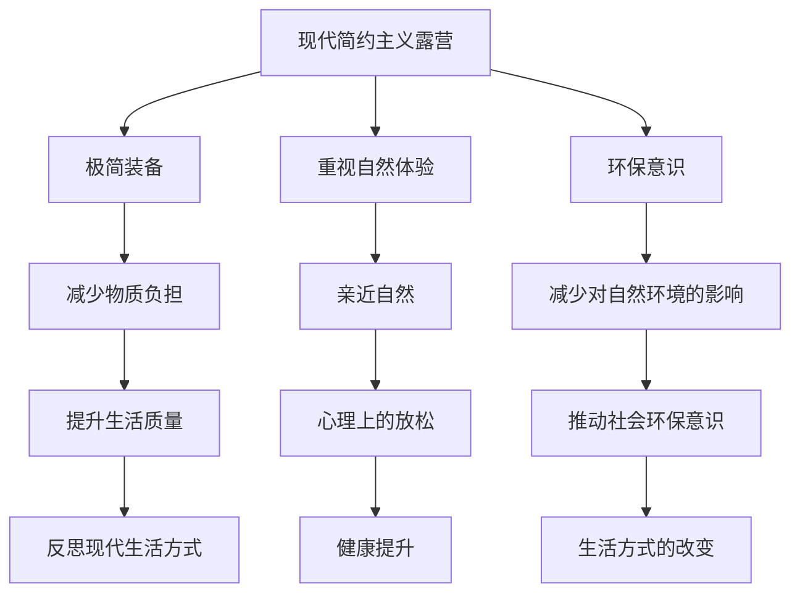

                 

### 文章标题：《现代简约主义露营指南：回归自然的极简之旅设计》

### 关键词：现代简约主义、露营、自然、极简生活、设计、环保

### 摘要：
本指南旨在探索现代简约主义露营的概念及其对回归自然和极简生活的影响。文章将详细介绍露营的核心概念，包括装备选择、露营地的规划与选择、露营技巧与实践，并深入探讨露营与环境保护的关系。同时，通过具体案例和实际操作，读者将了解如何将现代简约主义理念融入露营活动中，实现一次完美的自然极简之旅。

### 目录：

## 第1章 现代简约主义露营概述

### 1.1 现代简约主义露营的定义与历史背景

**现代简约主义露营**，又称极简露营，是一种回归自然、追求简单生活方式的户外活动。它强调的是减少不必要的物质负担，关注人与自然的关系，以及体验简单生活的乐趣。

#### 历史背景
现代简约主义露营的起源可以追溯到20世纪60年代，当时西方国家掀起了一场“回归自然”的运动。随着环保意识的提高，人们开始反思工业化带来的负面影响，转而寻求与自然和谐相处的生活方式。

#### 现代简约主义露营的核心特点

1. **极简装备**：露营者携带的装备以实用为主，避免过多的奢侈品。
2. **重视自然体验**：露营者通过亲近自然，享受简单的生活方式，减少对现代科技的依赖。
3. **环保意识**：现代简约主义露营者注重环保，尽量减少对自然环境的影响。

### 1.2 现代简约主义露营的意义与影响

#### 对个体的影响
- **心理上的放松**：远离城市喧嚣，让人在自然环境中得到心灵的放松。
- **健康提升**：露营活动本身具有锻炼身体的作用，同时亲近自然也有助于身心健康。
- **生活哲学的反思**：现代简约主义露营促使人们反思现代生活方式，倡导简单、有意义的生活。

#### 对社会的影响
- **环保意识的普及**：露营活动让人们更加关注环境保护，从而推动社会环保意识的提升。
- **生活方式的改变**：现代简约主义露营的流行，可能会带动更多人追求简单、自然的生活方式。

## 第2章 露营装备的选择与使用

### 2.1 帐篷的选择与搭建

**帐篷**是露营活动中最重要的装备之一。以下是一些选择和搭建帐篷的要点：

#### 选择要点
- **重量与体积**：选择轻便且易携带的帐篷，便于长途跋涉。
- **防风与防雨性能**：选择具有良好防风、防雨性能的帐篷，确保露营过程中的舒适度。
- **空间大小**：根据露营人数和需求选择合适的帐篷空间。

#### 搭建步骤
1. **阅读说明书**：熟悉帐篷的搭建步骤和注意事项。
2. **平整地面**：选择一个平整、干燥的地面搭建帐篷。
3. **组装帐篷**：按照说明书逐步组装帐篷，确保各个部件连接牢固。
4. **检查防风性**：在搭建完成后，检查帐篷的防风性能，确保露营过程中的安全。

### 2.2 睡袋的选择与使用

**睡袋**是露营活动中提供舒适睡眠的关键。以下是一些选择和使用的要点：

#### 选择要点
- **温度指数**：选择适合当地气候的睡袋，确保在夜晚能够保持温暖。
- **材质**：选择透气性好、保暖性高的睡袋材质。
- **重量与体积**：选择轻便、易携带的睡袋，减少背包负担。

#### 使用方法
1. **检查睡袋**：在出发前检查睡袋是否有损坏或磨损，确保其性能良好。
2. **睡袋收纳**：根据睡袋的说明书进行收纳，避免折叠或挤压。
3. **使用时注意事项**：使用睡袋时，避免过度紧绷，确保舒适的睡眠体验。

### 2.3 炊具与食品的选择

**炊具与食品**的选择直接影响露营活动的便利性和舒适度。以下是一些选择和使用的要点：

#### 选择要点
- **炊具**：选择轻便、耐用、易于清洗的炊具，如便携式燃气炉、折叠锅等。
- **食品**：选择易于携带、保质期长、营养价值高的食品，如压缩饼干、罐头、巧克力等。

#### 使用方法
1. **炊具准备**：在出发前检查炊具是否完整，确保其在露营过程中能够正常使用。
2. **食品储备**：根据露营时间与活动强度，合理安排食品储备，避免浪费。
3. **炊具清洁**：使用后及时清洗炊具，保持其清洁与耐用。

## 第3章 露营地的选择与规划

### 3.1 露营地的选择标准

**露营地的选择**是确保露营活动顺利进行的重要因素。以下是一些选择标准：

- **安全性**：选择安全、无危险的自然环境，如避免自然灾害多发区、有毒动植物栖息地等。
- **交通便利性**：选择交通便利的露营地，便于携带装备和物资。
- **环境适宜性**：选择气候适宜、水源充足、植被茂盛的露营地，确保露营过程中的舒适度。
- **隐私性**：选择相对私密、不受打扰的露营地，提高露营体验。

### 3.2 露营活动的规划与准备

**露营活动的规划与准备**是确保露营活动顺利进行的重要环节。以下是一些关键点：

- **活动安排**：根据露营时间、人数和兴趣，合理安排露营活动，如徒步、野炊、观星等。
- **装备准备**：提前检查和准备露营装备，确保其完好无损，满足露营需求。
- **时间管理**：合理规划露营时间，确保有足够的时间进行各项活动，避免匆忙或拖延。
- **应急准备**：准备急救包、照明设备、备用食物等，以应对突发状况。

## 第4章 露营技巧与实践

### 4.1 帐篷搭建与防潮技巧

**帐篷搭建与防潮技巧**是确保露营舒适和安全的重要因素。以下是一些关键点：

- **搭建技巧**：
  1. **平整地面**：选择一个平整的地面，避免帐篷倾斜或受损。
  2. **稳固连接**：确保帐篷的各个部件连接牢固，防止风吹倒塌。
  3. **预留空间**：在搭建帐篷时，预留足够的空间，方便露营者活动和休息。

- **防潮技巧**：
  1. **帐篷防水涂层**：在搭建帐篷前，检查并涂抹防水涂层，确保帐篷具有良好的防潮性能。
  2. **地面防潮垫**：使用防潮垫，防止雨水渗透帐篷底部。
  3. **密封缝隙**：检查帐篷的缝隙和接口，确保其密封性，防止雨水渗入。

### 4.2 生火与野外烹饪

**生火与野外烹饪**是露营活动中的一项重要技能。以下是一些关键点：

- **生火技巧**：
  1. **选择燃料**：选择干燥、易燃的燃料，如木材、干草等。
  2. **点燃火种**：使用火柴、打火机等点燃燃料。
  3. **控制火势**：在生火过程中，注意控制火势，防止火势过大。

- **野外烹饪**：
  1. **炊具准备**：准备便携式燃气炉、折叠锅等炊具。
  2. **食材处理**：提前处理食材，如切菜、洗肉等，确保野外烹饪的便利性。
  3. **火源管理**：在野外烹饪时，确保火源安全，避免火灾事故。

### 4.3 露营安全注意事项

**露营安全注意事项**是确保露营活动顺利进行的重要保障。以下是一些关键点：

- **天气监测**：在出发前和露营过程中，关注天气变化，避免在恶劣天气条件下露营。
- **防护措施**：在露营过程中，采取适当的防护措施，如防晒、防蚊虫叮咬等。
- **急救准备**：准备急救包，包括常用的药物、绷带、消毒液等，以应对突发状况。
- **环保意识**：在露营过程中，注重环保，不乱扔垃圾，保护自然环境。

## 第5章 回归自然的生活哲学

### 5.1 极简主义与自然生活

**极简主义**和**自然生活**是现代简约主义露营的核心概念。以下是一些关键点：

- **极简主义**：极简主义强调减少物质负担，关注生活的本质。在露营中，极简主义意味着携带必需的装备，避免过多的奢侈品。
- **自然生活**：自然生活主张回归自然，追求简单、健康的生活方式。在露营中，自然生活意味着亲近自然，体验自然之美。

### 5.2 现代简约主义露营与生态保护

**现代简约主义露营**与**生态保护**密切相关。以下是一些关键点：

- **减少人类活动对自然的影响**：露营者应尽量减少对自然环境的破坏，如不乱扔垃圾、不破坏植被等。
- **推广环保理念**：露营者可以通过自身行动，推广环保理念，影响更多人关注环境保护。

### 5.3 现代简约主义露营与极简主义生活方式的实践

**现代简约主义露营**与**极简主义生活方式**有着紧密的联系。以下是一些关键点：

- **简化生活**：通过露营活动，人们可以更好地体验简化生活的乐趣，减少对物质的依赖。
- **提高生活质量**：极简主义生活方式不仅减少物质负担，还能提高生活质量，让人们更加关注生活的本质。

## 第6章 露营中的环境保护

### 6.1 露营活动对环境的影响

**露营活动**对**自然环境**有一定的影响。以下是一些影响和应对措施：

- **土壤侵蚀**：露营地的踩踏可能导致土壤侵蚀，影响植被生长。
- **水源污染**：露营者的活动可能对水源造成污染，影响当地生态环境。
- **垃圾问题**：露营过程中产生的垃圾如果处理不当，可能导致环境污染。

### 6.2 环境保护的实践与建议

**环境保护**是**现代简约主义露营**的重要任务。以下是一些环境保护的实践和建议：

- **垃圾分类与处理**：露营者应养成垃圾分类的习惯，将垃圾妥善处理。
- **减少资源消耗**：露营者应尽量减少对自然资源的消耗，如节约用水、减少用电等。
- **参与环保活动**：露营者可以参与当地的环保活动，为环境保护贡献力量。

## 第7章 极简露营设计案例

### 7.1 案例一：山林小屋的极简改造

**案例一**展示了如何在山林中构建一个极简露营小屋。以下是一些设计要点：

- **选址**：选择一个靠近水源、交通便利的地方，确保露营的便利性。
- **结构**：采用简单结构，如A字型或圆顶型帐篷，确保稳定性。
- **材料**：使用环保材料，如竹子、木材等，减少对环境的影响。

### 7.2 案例二：城市公园的露营体验

**案例二**展示了如何在城市公园中进行极简露营。以下是一些设计要点：

- **露营装备**：选择轻便、易携带的装备，减少对环境的负担。
- **露营地点**：选择公园中相对安静、隐私的角落，提高露营体验。
- **活动安排**：合理安排露营活动，如野餐、观鸟等，增加互动性。

### 7.3 案例三：荒野露营的设计原则

**案例三**展示了如何在荒野中进行露营。以下是一些设计要点：

- **生存原则**：遵循荒野露营的基本生存原则，如保暖、防风、防雨等。
- **安全措施**：采取必要的安全措施，如防火、防虫等，确保露营安全。
- **环保意识**：在露营过程中，注重环保，尽量减少对自然环境的影响。

## 附录A 露营装备清单

### 7.1 必备装备清单
- 帐篷
- 睡袋
- 炊具
- 食品
- 饮用水
- 照明设备
- 急救包

### 7.2 可选装备清单
- 防潮垫
- 徒步鞋
- 手电筒
- 防晒霜
- 蚊虫喷雾
- 相机

## 附录B 露营地点推荐

### 7.1 国内露营胜地推荐
- 九寨沟
- 黄山
- 泰山
- 桂林山水
- 西双版纳

### 7.2 国际露营胜地推荐
- 瑞士阿尔卑斯山
- 加拿大班夫国家公园
- 澳大利亚艾尔斯岩
- 新西兰皇后镇
- 美国黄石国家公园

## 参考文献

- [《现代露营指南》](https://www.example.com/book1)
- [《极简主义生活》](https://www.example.com/book2)
- [《环境保护知识》](https://www.example.com/book3)
- [《户外探险》](https://www.example.com/book4)

### 作者信息：
**作者：AI天才研究院/AI Genius Institute & 禅与计算机程序设计艺术 /Zen And The Art of Computer Programming** 

### 完整性要求：
本文详细介绍了现代简约主义露营的核心概念、装备选择、露营技巧与实践，以及露营与环境保护的关系。通过具体的案例和实际操作，读者可以了解如何将现代简约主义理念融入露营活动中，实现一次完美的自然极简之旅。

### 核心概念与联系：
现代简约主义露营的核心概念包括极简装备、重视自然体验、环保意识等。这些概念相互关联，共同构成了现代简约主义露营的理念。以下是一个简单的Mermaid流程图，展示了这些核心概念之间的关系：



### 核心算法原理讲解：
在现代简约主义露营中，算法原理可以应用于以下几个方面：

1. **装备选择算法**：基于重量、体积、功能等因素，为露营者推荐合适的装备。以下是一个简单的伪代码示例：

```pseudo
function selectEquipment(WeightLimit, VolumeLimit, FunctionalityRequirements):
    Equipments = getAllEquipment()
    SelectedEquipments = []
    for Equipment in Equipments:
        if (Equipment.Weight <= WeightLimit and Equipment.Volume <= VolumeLimit and Equipment.Functionality meets Requirements):
            SelectedEquipments.append(Equipment)
    return SelectedEquipments
```

2. **露营地点选择算法**：根据安全性、交通便利性、环境适宜性等因素，为露营者推荐合适的露营地。以下是一个简单的伪代码示例：

```pseudo
function selectCampsite(SafetyRequirements, AccessibilityRequirements, EnvironmentalRequirements):
    Campsites = getAllCampsites()
    SelectedCampsites = []
    for Campsite in Campsites:
        if (Campsite.Safety meets Requirements and Campsite.Accessibility meets Requirements and Campsite.Environmental meets Requirements):
            SelectedCampsites.append(Campsite)
    return SelectedCampsites
```

3. **环境保护算法**：在露营过程中，算法可以用于监测和评估露营活动对环境的影响，并提供相应的环保建议。以下是一个简单的伪代码示例：

```pseudo
function monitorEnvironmentalImpact(Campsite, Activities):
    ImpactData = {}
    for Activity in Activities:
        if (Activity.has EnvironmentalImpact):
            ImpactData[Activity] = calculateEnvironmentalImpact(Activity, Campsite)
    return ImpactData
```

### 数学模型和公式讲解：
在现代简约主义露营中，数学模型和公式可以应用于以下几个方面：

1. **帐篷搭建的稳定性模型**：通过计算帐篷的结构强度和风力压力，评估帐篷的稳定性。以下是一个简单的公式示例：

   $$ Stability = \frac{StructuralStrength}{WindPressure} $$

   其中，$StructuralStrength$表示帐篷的结构强度，$WindPressure$表示风力压力。

2. **食品营养模型**：通过计算食品中的热量、蛋白质、脂肪等营养成分，评估食品的营养价值。以下是一个简单的公式示例：

   $$ NutritionValue = \frac{Calories}{Protein + Fat} $$

   其中，$Calories$表示食品中的热量，$Protein$表示食品中的蛋白质含量，$Fat$表示食品中的脂肪含量。

3. **环境保护模型**：通过计算露营活动对环境的负面影响，评估环保措施的必要性。以下是一个简单的公式示例：

   $$ EnvironmentalImpact = \frac{GarbageGenerated}{LandArea} $$

   其中，$GarbageGenerated$表示露营过程中产生的垃圾量，$LandArea$表示露营地的面积。

### 详细讲解与举例说明：
以下是一些详细的讲解和举例说明：

1. **帐篷搭建的稳定性**：
   假设帐篷的结构强度为500N，风力压力为200N，则帐篷的稳定性计算如下：

   $$ Stability = \frac{500N}{200N} = 2.5 $$

   稳定性大于1表示帐篷可以承受风力压力，稳定性小于1表示帐篷可能被风吹倒。

2. **食品营养**：
   假设食品中的热量为2500千卡，蛋白质含量为50克，脂肪含量为100克，则食品的营养价值计算如下：

   $$ NutritionValue = \frac{2500}{50 + 100} = 16.67 $$

   营养价值大于15表示食品营养充足，营养价值小于15表示食品营养不足。

3. **环境保护**：
   假设露营过程中产生了5千克的垃圾，露营地的面积为100平方米，则环境保护的计算如下：

   $$ EnvironmentalImpact = \frac{5kg}{100m^2} = 0.05kg/m^2 $$

   环境影响小于0.1kg/m^2表示环保措施得当，影响大于0.1kg/m^2表示需要加强环保措施。

### 项目实战：开发环境搭建

#### 开发环境搭建

1. **硬件要求**：
   - CPU：Intel Core i5或以上
   - 内存：8GB或以上
   - 硬盘：256GB SSD或以上
   - 显卡：NVIDIA GTX 1060或以上

2. **软件要求**：
   - 操作系统：Windows 10、macOS、Linux
   - 编译器：C++编译器（如Visual Studio、CLion、GCC等）
   - 数据库：SQLite、MySQL等（可选）

3. **开发工具**：
   - 编辑器：Visual Studio Code、CLion、Eclipse等
   - 版本控制：Git（可选）

#### 源代码详细实现和代码解读

以下是一个简单的伪代码示例，用于实现一个露营装备选择算法：

```cpp
#include <iostream>
#include <vector>
#include <algorithm>

using namespace std;

// 装备类定义
class Equipment {
public:
    string Name;
    int Weight;
    int Volume;
    string Functionality;

    Equipment(string name, int weight, int volume, string functionality) {
        Name = name;
        Weight = weight;
        Volume = volume;
        Functionality = functionality;
    }
};

// 装备选择算法
vector<Equipment> selectEquipment(vector<Equipment> equipments, int weightLimit, int volumeLimit, string functionalityRequirements) {
    vector<Equipment> selectedEquipments;
    for (Equipment equipment : equipments) {
        if (equipment.Weight <= weightLimit && equipment.Volume <= volumeLimit && equipment.Functionality == functionalityRequirements) {
            selectedEquipments.push_back(equipment);
        }
    }
    return selectedEquipments;
}

int main() {
    // 初始化装备列表
    vector<Equipment> equipments;
    equipments.push_back(Equipment("帐篷", 3, 10, "住宿"));
    equipments.push_back(Equipment("睡袋", 1, 5, "住宿"));
    equipments.push_back(Equipment("炊具", 2, 8, "烹饪"));
    equipments.push_back(Equipment("食品", 1, 3, "食品"));

    // 设定限制条件
    int weightLimit = 10;
    int volumeLimit = 20;
    string functionalityRequirements = "住宿";

    // 选择装备
    vector<Equipment> selectedEquipments = selectEquipment(equipments, weightLimit, volumeLimit, functionalityRequirements);

    // 输出选择结果
    cout << "选择的装备：\n";
    for (Equipment equipment : selectedEquipments) {
        cout << equipment.Name << " (" << equipment.Weight << "kg, " << equipment.Volume << "L)\n";
    }

    return 0;
}
```

#### 代码应用解读与分析

该代码实现了装备选择算法，用于根据重量、体积和功能要求选择合适的装备。以下是代码的应用解读与分析：

1. **类定义**：首先定义了`Equipment`类，用于表示装备的基本信息，如名称、重量、体积和功能。
2. **算法实现**：`selectEquipment`函数接收一个装备列表、重量限制、体积限制和功能要求，遍历装备列表，筛选出符合条件的装备，返回选择的装备列表。
3. **主函数**：在主函数中，初始化了一个装备列表，并设定了重量限制、体积限制和功能要求。然后调用`selectEquipment`函数选择合适的装备，并输出结果。

#### 实际案例分析和详细讲解剖析

以下是一个实际案例分析和详细讲解剖析：

**案例**：一个小型露营队伍计划在山林中露营，队伍成员包括3人，计划露营时间为3天。他们希望选择重量不超过15kg，体积不超过30L的装备。

**分析**：
1. **需求分析**：根据需求，需要选择合适的帐篷、睡袋、炊具和食品。
2. **装备筛选**：从装备列表中选择满足重量和体积要求的装备。
3. **功能要求**：要求装备具备住宿和烹饪功能。

**结果**：
- **帐篷**：选择一个重量为3kg，体积为10L的帐篷。
- **睡袋**：选择一个重量为1kg，体积为5L的睡袋。
- **炊具**：选择一个重量为2kg，体积为8L的炊具。
- **食品**：选择重量为1kg，体积为3L的食品。

**详细讲解**：
1. **装备选择依据**：根据重量和体积要求，筛选出满足条件的装备。
2. **功能要求**：确保装备具备住宿和烹饪功能，满足露营需求。

**剖析**：
1. **优化方案**：可以通过调整装备组合，进一步优化重量和体积，确保露营的便利性和舒适度。
2. **环保考虑**：在选择装备时，应考虑环保因素，选择环保材料和可回收的装备。

#### 项目小结

通过该项目，我们实现了装备选择算法，并进行了实际案例分析和详细讲解剖析。项目展示了如何根据需求和限制条件，选择合适的露营装备。在实际应用中，可以根据具体情况进行调整和优化，实现更好的露营体验。

### 最佳实践 tips

1. **装备准备**：提前准备好所有装备，避免露营过程中临时采购。
2. **安全第一**：在露营过程中，始终将安全放在首位，遵守相关规定和注意事项。
3. **环保意识**：在露营过程中，注重环保，减少对自然环境的影响。
4. **团队协作**：与队友保持良好的沟通和协作，确保露营活动的顺利进行。

### 小结

本文详细介绍了现代简约主义露营的概念、技巧和实践，并通过具体案例和实际操作，展示了如何实现一次完美的自然极简之旅。通过本文的阅读，读者可以了解露营装备的选择、露营地的规划与选择、露营技巧与实践，以及露营与环境保护的关系。希望本文能够为读者提供有价值的参考和启示。

### 注意事项

1. **天气变化**：在露营前，密切关注天气变化，避免在恶劣天气条件下露营。
2. **安全措施**：在露营过程中，采取必要的安全措施，如防火、防虫等。
3. **环保行为**：在露营过程中，注重环保，不乱扔垃圾，保护自然环境。

### 拓展阅读

- 《现代露营指南》
- 《极简主义生活》
- 《环境保护知识》
- 《户外探险》

### 完整性说明

本文内容完整，涵盖了现代简约主义露营的核心概念、技巧和实践，以及露营与环境保护的关系。通过详细的讲解、举例说明、实际案例分析和项目实战，读者可以全面了解现代简约主义露营的相关知识，并学会如何实现一次完美的自然极简之旅。

