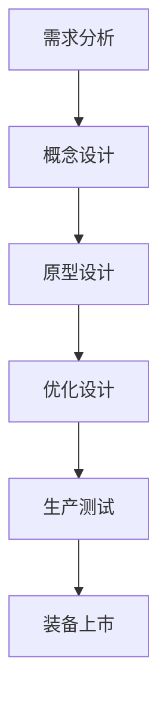

                 

## 《现代简约主义露营装备设计：极简户外生活的装备革新》

### 关键词

- 简约主义
- 露营装备设计
- 极简户外生活
- 轻量化
- 环保材料
- 智能技术

### 摘要

本文深入探讨了现代简约主义露营装备设计，旨在为读者呈现一种极简户外生活方式的革新。文章首先介绍了简约主义设计理念及其在露营文化中的应用，接着分析了极简户外生活的重要性。随后，文章详细阐述了现代露营装备的设计原则、材料选择、人体工程学设计以及创新设计案例。最后，文章探讨了装备革新的技术趋势和实际案例分析，并给出了极简户外生活的装备选择指南。本文旨在通过详细的技术分析和实际案例，引导读者了解和掌握现代简约主义露营装备设计的精髓，从而提升户外生活的品质。

### 目录大纲

1. **简约主义与露营文化**
   - **1.1 简约主义设计理念的历史与发展**
   - **1.2 露营文化中的简约主义元素**
   - **1.3 简约主义设计在现代露营装备中的应用**

2. **极简户外生活的重要性**
   - **2.1 极简户外生活的理念**
   - **2.2 极简户外生活对身心健康的影响**
   - **2.3 极简户外生活与可持续发展**

3. **现代露营装备的设计原则**
   - **3.1 轻量化设计**
   - **3.2 功能性与美观性的结合**
   - **3.3 环保与可持续性**

4. **露营装备的材料选择**
   - **4.1 常用露营装备材料的特性**
   - **4.2 材料选择的原则**
   - **4.3 材料在简约主义露营装备设计中的应用**

5. **露营装备的人体工程学设计**
   - **5.1 人体工程学基础**
   - **5.2 人体工程学在露营装备设计中的应用**
   - **5.3 人体工程学案例分析**

6. **露营装备的创新设计案例**
   - **6.1 轻量化帐篷设计**
   - **6.2 环保露营炊具设计**
   - **6.3 智能露营设备设计**

7. **装备革新的技术趋势**
   - **7.1 新材料在露营装备中的应用**
   - **7.2 智能技术在露营装备中的应用**
   - **7.3 革新装备对露营体验的改善**

8. **装备革新的实例分析**
   - **8.1 轻量化露营装备市场分析**
   - **8.2 环保露营装备案例分析**
   - **8.3 智能露营装备市场前景**

9. **极简户外生活的装备选择指南**
   - **9.1 露营装备选购原则**
   - **9.2 装备选购流程**
   - **9.3 装备选择案例分析**

10. **附录**
    - **10.1 现代简约主义露营装备设计资源推荐**
    - **10.2 设计书籍推荐**
    - **10.3 露营装备品牌推荐**
    - **10.4 网络资源推荐**

## 第一部分：简约主义露营装备设计理念

### 1.1 简约主义设计理念的历史与发展

简约主义设计起源于20世纪初期，起源于欧洲的艺术流派，如荷兰的“新表现主义”和德国的“包豪斯运动”。这一设计理念强调简洁、功能性、少即是多的设计原则，反对装饰的累赘，追求简约的美学效果。随着时间的发展，简约主义设计逐渐渗透到各个领域，包括建筑、家居和产品设计等。

在露营装备设计中，简约主义理念的应用主要体现在以下几个方面：

1. **简洁性**：露营装备设计注重简洁的外观和结构，去除不必要的装饰，使装备更加轻便和易于使用。
2. **功能性**：简约主义强调装备的功能性，设计时考虑装备在户外环境中的实用性和可靠性。
3. **模块化**：露营装备设计采用模块化设计，使装备易于组装和拆卸，提高使用效率。

### 1.2 露营文化中的简约主义元素

露营文化是一种追求自然、自由和简约的生活方式。在这种文化中，简约主义元素主要体现在以下几个方面：

1. **装备轻量化**：露营者追求轻量化装备，以减少行走的负担，提高户外活动的舒适性。
2. **环保意识**：简约主义强调减少浪费，露营者注重使用环保材料，减少对自然环境的影响。
3. **自我依赖**：露营文化鼓励露营者自我独立，装备设计需要考虑到露营者自身的生存能力，提供必要的功能，同时避免过度依赖。

### 1.3 简约主义设计在现代露营装备中的应用

现代露营装备设计在简约主义理念的指导下，不断推陈出新，以下是一些典型的应用案例：

1. **帐篷**：现代帐篷设计采用了轻量化材料和模块化设计，使得帐篷不仅易于搭建，而且易于携带。
2. **睡袋**：现代睡袋设计注重保暖性能和轻量化，采用高科技材料，如纳米材料，以提高保暖效果，同时减轻重量。
3. **炊具**：现代露营炊具设计注重功能性和便携性，采用折叠式或模块化设计，方便露营者快速搭建和使用。

### 1.3.1 简约主义设计流程

为了更好地理解简约主义设计在现代露营装备中的应用，我们可以通过以下步骤进行设计：

1. **需求分析**：首先，了解露营者的需求，包括重量、体积、功能、耐用性等。
2. **概念设计**：根据需求分析，提出初步的设计概念，如轻量化、模块化等。
3. **原型设计**：制作原型，通过实验和测试，验证设计概念的有效性。
4. **优化设计**：根据原型测试结果，对设计进行优化，如改进材料、调整结构等。
5. **生产测试**：在生产前，对设计进行全面的测试，确保装备的质量和性能符合要求。

### 1.3.2 简约主义设计流程 Mermaid 流程图

## 第二部分：极简户外生活的重要性

### 2.1 极简户外生活的理念

极简户外生活是一种追求简约、自然和自我独立的生活方式。其核心理念包括：

1. **简化生活**：通过减少物质负担，简化生活内容，追求内心的平静和自由。
2. **回归自然**：通过户外活动，与自然和谐相处，体验自然之美，提升身心健康。
3. **自我挑战**：通过户外挑战，锻炼自我能力，提升生活品质。

### 2.2 极简户外生活对身心健康的影响

极简户外生活对身心健康有着积极的影响：

1. **减压放松**：户外活动有助于释放压力，放松身心，改善心理健康。
2. **增强体质**：户外活动如徒步、登山等，有助于增强体质，提高免疫力。
3. **促进睡眠**：户外活动有助于改善睡眠质量，使人更容易入睡。

### 2.3 极简户外生活与可持续发展

极简户外生活与可持续发展有着紧密的联系：

1. **减少浪费**：极简户外生活强调减少物质消费，减少对环境的负担。
2. **环保意识**：极简户外生活倡导使用环保材料，减少对自然环境的破坏。
3. **可持续性**：极简户外生活鼓励露营者自我依赖，减少对自然资源的依赖，实现可持续发展。

### 2.4 极简户外生活的装备需求

为了实现极简户外生活，露营者需要选择合适的装备：

1. **轻量化装备**：轻量化装备可以减少行走的负担，提高户外活动的舒适性。
2. **多功能装备**：多功能装备可以提高露营者的自我依赖能力，减少对额外物品的依赖。
3. **环保材料**：使用环保材料，减少对自然环境的破坏，实现可持续发展。

### 2.4.1 极简户外生活装备选择原则

选择极简户外生活装备时，应遵循以下原则：

1. **实用性**：装备必须具备足够的实用性和可靠性，以满足露营需求。
2. **轻便性**：装备应尽量轻便，以减轻行走的负担。
3. **多功能性**：装备应具备多功能性，以提高露营者的自我依赖能力。
4. **环保性**：装备应使用环保材料，减少对自然环境的破坏。

### 2.4.2 极简户外生活装备选择流程

选择极简户外生活装备时，可以遵循以下流程：

1. **确定露营需求**：根据露营活动类型、持续时间等因素，确定装备需求。
2. **比较装备性能**：对不同品牌和类型的装备进行性能比较，选择性能更优的产品。
3. **考虑装备重量**：选择重量较轻的装备，以减轻行走的负担。
4. **考虑装备多功能性**：选择多功能装备，以提高露营体验。
5. **考虑环保性**：选择使用环保材料的装备，减少对自然环境的破坏。

### 2.4.3 极简户外生活装备选择案例分析

以帐篷为例，选择一款适合极简户外生活的帐篷，应考虑以下因素：

1. **材质**：选择轻便、耐用、防水性能好的帐篷材料。
2. **结构**：选择模块化、易于搭建和拆卸的帐篷结构。
3. **尺寸**：选择适合露营人数的帐篷尺寸，确保空间足够舒适。
4. **功能**：选择具备防风、防雨、保暖等功能的帐篷，以提高露营体验。

### 2.4.4 极简户外生活装备选择实例分析

假设一位露营者计划进行为期五天的徒步露营活动，可以选择以下装备：

1. **帐篷**：选择一款轻量化、模块化、易于搭建的帐篷，如X品牌的三人帐篷。
2. **睡袋**：选择一款轻便、保暖性好的睡袋，如Y品牌的0度睡袋。
3. **炊具**：选择一款多功能、便携的炊具，如Z品牌的折叠炉具。
4. **背包**：选择一款轻量化、容量合适的背包，如A品牌的户外背包。

通过以上装备选择，露营者可以更好地享受极简户外生活，减少物质负担，提高露营体验。

### 2.4.5 极简户外生活装备选择小结

选择适合的极简户外生活装备，可以显著提升露营体验，减少物质负担。在选择装备时，应遵循实用性、轻便性、多功能性和环保性的原则，综合考虑露营需求和个人喜好。通过合理的装备选择，露营者可以更好地享受户外生活的乐趣。

### 2.4.6 注意事项

1. **装备检查**：在出发前，务必检查装备的完好性和适用性，确保在露营过程中能够正常使用。
2. **环保意识**：在露营过程中，注意环保，妥善处理垃圾，避免对自然环境造成破坏。
3. **适应能力**：提高自身适应能力，学会在恶劣环境下生存，增强户外露营的经验。

### 2.4.7 拓展阅读

1. **《极简户外生活指南》**：一本关于极简户外生活的实用指南，介绍露营装备的选择和露营技巧。
2. **《户外探险装备选购技巧》**：一篇关于户外探险装备选购技巧的文章，帮助读者了解如何选择适合的装备。

## 第三部分：现代露营装备的设计原则

### 3.1 轻量化设计

轻量化设计是现代露营装备设计的重要原则之一。通过减少装备的重量，可以提高露营者的舒适度和移动性，同时降低对环境的负担。

#### 3.1.1 轻量化设计的原理

轻量化设计的原理主要涉及以下几个方面：

1. **材料选择**：选择轻质、高强度的材料，如碳纤维、铝合金等，以降低装备的重量。
2. **结构优化**：通过优化装备的结构设计，减少材料的使用，降低重量。
3. **模块化设计**：采用模块化设计，将装备拆分为多个独立模块，便于携带和组装。

#### 3.1.2 轻量化设计的方法

1. **减重材料的应用**：使用轻质材料，如碳纤维、铝合金、钛合金等，替代传统材料。
2. **优化结构设计**：通过优化结构设计，减少材料的使用量，如采用空心结构、流线型设计等。
3. **模块化设计**：将装备拆分为多个独立模块，便于携带和组装，减少整体重量。

#### 3.1.3 轻量化设计的案例分析

1. **帐篷**：现代帐篷采用轻质材料，如铝合金和聚酯纤维，以减轻重量。同时，采用模块化设计，便于快速搭建和拆卸。
2. **睡袋**：采用纳米材料，如纳米银纤维，提高保暖性能，同时降低重量。采用压缩技术，将睡袋压缩至更小的体积，便于携带。

#### 3.1.4 轻量化设计的优势

1. **提高舒适性**：轻量化装备可以减少露营者的负担，提高户外活动的舒适性。
2. **增强移动性**：轻量化装备便于携带，提高露营者的移动性，便于探索更多的户外景点。
3. **降低环境负担**：轻量化装备减少对自然资源的消耗，降低对环境的负担。

### 3.2 功能性与美观性的结合

现代露营装备设计不仅要求功能性强，还要求美观性。通过结合功能性与美观性，可以提高露营者的使用体验。

#### 3.2.1 功能性与美观性的结合原则

1. **简洁性**：设计应简洁明了，去除不必要的装饰，使装备更具功能性。
2. **协调性**：设计应协调一致，色彩搭配和形态设计应相互配合，提高美观性。
3. **创新性**：设计应具有创新性，通过独特的设计风格和功能，提升装备的吸引力。

#### 3.2.2 功能性与美观性的结合方法

1. **一体化设计**：将功能性和美观性融入整体设计，使装备整体协调，美观且实用。
2. **细节处理**：在细节处理上，注重美观性和功能性，如使用细腻的纹理、独特的配色等。
3. **创新设计**：通过创新设计，如采用新型材料、独特的外观造型等，提高装备的吸引力。

#### 3.2.3 功能性与美观性的结合案例分析

1. **帐篷**：现代帐篷在功能上强调防风、防雨、保暖等特性，同时在设计上注重外观的美观性，采用流线型设计、独特色彩搭配等。
2. **睡袋**：现代睡袋在保暖性能上强调高效、舒适，同时在设计上注重美观性，采用独特的花纹、鲜艳的色彩等。

#### 3.2.4 功能性与美观性的结合优势

1. **提升使用体验**：结合功能性与美观性的设计，可以提升露营者的使用体验，使装备更具吸引力。
2. **提高市场竞争力**：具有独特外观和功能的装备，可以增强市场竞争力，吸引更多消费者。
3. **推动行业创新**：通过不断探索功能性与美观性的结合，可以推动露营装备行业的创新和发展。

### 3.3 环保与可持续性

现代露营装备设计应充分考虑环保和可持续性，以减少对自然环境的破坏，实现可持续发展。

#### 3.3.1 环保与可持续性的原则

1. **材料选择**：选择环保材料，如可再生材料、生物降解材料等，减少对自然资源的消耗。
2. **生产过程**：采用环保生产工艺，减少污染物排放，降低对环境的影响。
3. **使用过程**：提高装备的使用寿命，减少废弃物的产生，降低对环境的负担。
4. **回收利用**：鼓励装备的回收和再利用，减少废弃物对环境的污染。

#### 3.3.2 环保与可持续性的方法

1. **可再生材料的应用**：使用可再生材料，如竹子、棉花等，替代传统材料。
2. **环保生产工艺**：采用环保工艺，如无水染色、低温等离子处理等，减少污染物排放。
3. **延长使用寿命**：通过提高装备的耐用性，减少更换频率，降低废弃物产生。
4. **回收利用**：建立装备回收系统，鼓励消费者回收和再利用装备。

#### 3.3.3 环保与可持续性的案例分析

1. **帐篷**：现代帐篷采用环保材料，如可再生纤维和生物降解塑料，同时采用无污染的染色工艺，降低对环境的影响。
2. **睡袋**：现代睡袋采用可再生材料，如竹纤维和生物降解塑料，同时采用环保生产工艺，减少污染物排放。

#### 3.3.4 环保与可持续性的优势

1. **保护环境**：通过减少废弃物产生和资源消耗，保护自然环境，实现可持续发展。
2. **提高品牌形象**：注重环保和可持续性的品牌，可以提高市场竞争力，吸引更多消费者。
3. **推动行业进步**：通过不断探索环保和可持续性，可以推动露营装备行业的进步和发展。

### 3.4 现代露营装备设计原则小结

现代露营装备设计应遵循轻量化、功能性与美观性的结合、环保与可持续性的原则。通过这些原则，可以提升露营装备的性能、舒适度和环保性，为露营者提供更好的户外体验，同时推动露营装备行业的可持续发展。

### 3.4.1 最佳实践 tips

1. **注重材料选择**：选择环保、耐用、轻质的材料，提高装备的性能和环保性。
2. **关注设计细节**：注重细节设计，提高装备的美观性和功能性。
3. **鼓励创新设计**：鼓励创新设计，不断探索新的材料和设计方法，推动行业进步。

### 3.4.2 小结

现代露营装备设计应综合考虑性能、舒适度、环保性和可持续性，通过轻量化、功能性与美观性的结合，为露营者提供更好的户外体验。同时，注重环保和可持续性，为保护自然环境、实现可持续发展做出贡献。

### 3.4.3 注意事项

1. **材料选择**：在材料选择上，要充分考虑环保性和耐用性，避免选择有害物质。
2. **设计细节**：在设计细节上，要注重用户体验，提高装备的实用性和美观性。
3. **生产过程**：在生产过程中，要采用环保工艺，减少污染物排放，降低对环境的影响。

### 3.4.4 拓展阅读

1. **《环保露营装备设计》**：一篇关于环保露营装备设计的文章，介绍环保材料和技术在露营装备中的应用。
2. **《现代露营装备设计发展趋势》**：一篇关于现代露营装备设计发展趋势的文章，探讨行业未来的发展方向和挑战。

## 第四部分：露营装备的材料选择

### 4.1 常用露营装备材料的特性

在露营装备的设计与制造中，材料的选择至关重要。不同材料具有各自独特的特性，这些特性直接影响到装备的性能、耐用性和用户体验。以下是一些常用露营装备材料的特性：

#### 4.1.1 铝合金

铝合金是一种常用的轻量化材料，具有以下特性：

1. **高强度**：铝合金具有较高的强度，能够承受较大的压力。
2. **轻质**：相对于其他金属材料，铝合金的密度较低，能够减轻装备的重量。
3. **耐腐蚀**：铝合金表面容易形成一层氧化膜，具有良好的耐腐蚀性能。
4. **耐高温**：铝合金具有良好的耐高温性能，适合用于高温环境。

#### 4.1.2 碳纤维

碳纤维是一种高性能材料，具有以下特性：

1. **超高强度**：碳纤维具有极高的强度，能够承受极端的拉伸和压缩力。
2. **轻质**：碳纤维的密度较低，是一种极其轻质的材料。
3. **耐腐蚀**：碳纤维耐腐蚀性能良好，不易受化学物质的侵蚀。
4. **耐磨损**：碳纤维具有较好的耐磨性能，适合用于高磨损环境。

#### 4.1.3 聚酯纤维

聚酯纤维是一种常用的合成纤维，具有以下特性：

1. **轻质**：聚酯纤维的密度较低，是一种轻质材料。
2. **耐用性**：聚酯纤维具有较高的耐用性，适合用于长时间使用的装备。
3. **防水性能**：聚酯纤维具有良好的防水性能，适合用于户外防水装备。
4. **弹性**：聚酯纤维具有较好的弹性，能够适应不同形状的装备。

#### 4.1.4 氨纶

氨纶是一种弹性纤维，具有以下特性：

1. **高弹性**：氨纶具有极高的弹性，能够拉伸至原长的数倍，具有良好的回弹性。
2. **耐用性**：氨纶具有良好的耐用性，能够经受长时间的拉伸和压缩。
3. **透气性**：氨纶具有较好的透气性，能够保持身体干爽。
4. **抗磨损**：氨纶具有较好的抗磨损性能，适合用于需要高弹性的装备。

### 4.2 材料选择的原则

在露营装备的设计过程中，材料的选择应遵循以下原则：

#### 4.2.1 适用性原则

根据装备的使用环境和功能需求，选择适合的材料。例如，在高温环境中使用耐高温材料，在防水环境中使用防水材料。

#### 4.2.2 性能优先原则

在满足适用性的基础上，优先考虑材料的高性能。高性能材料能够提升装备的耐用性和用户体验。

#### 4.2.3 经济性原则

在保证性能的前提下，尽量选择成本较低的材料，以提高装备的经济性。经济性原则能够降低生产成本，使装备更具市场竞争力。

#### 4.2.4 环保性原则

在材料选择中，应考虑材料的环保性。选择可再生材料或可降解材料，以减少对环境的负面影响。

### 4.3 材料在简约主义露营装备设计中的应用

简约主义露营装备设计强调功能性和美观性的结合，材料的选择在这一过程中起到关键作用。以下是一些材料在简约主义露营装备设计中的应用案例：

#### 4.3.1 铝合金在帐篷中的应用

铝合金广泛应用于现代帐篷的框架设计。其高强度和轻质特性使得帐篷不仅坚固耐用，而且易于携带。例如，某品牌的高端帐篷采用铝合金框架，结合模块化设计，使得帐篷搭建过程更加简便快捷。

#### 4.3.2 碳纤维在户外背包中的应用

碳纤维的高强度和轻质特性使其成为高端户外背包的理想材料。碳纤维背包不仅重量轻，而且具有优异的耐用性和抗磨损性能。例如，某品牌的专业户外背包采用碳纤维材料，结合人体工程学设计，提供更好的背负舒适度。

#### 4.3.3 聚酯纤维在睡袋中的应用

聚酯纤维具有良好的防水性能和耐用性，是制作睡袋的理想材料。现代睡袋采用聚酯纤维面料，结合高效保暖材料，提供舒适的睡眠环境。例如，某品牌的四季睡袋采用聚酯纤维面料，结合纳米保暖材料，提供全天候的保暖效果。

#### 4.3.4 氨纶在户外服装中的应用

氨纶的高弹性和透气性使其成为户外服装的理想材料。现代户外服装采用氨纶纤维，结合透气面料，提供舒适、干爽的穿着体验。例如，某品牌的户外运动服装采用氨纶纤维，结合透气网眼面料，提供良好的运动性能和舒适度。

### 4.4 材料选择的案例分析与技术讲解

以下是一个具体的材料选择案例，并结合相关技术进行详细讲解。

#### 4.4.1 案例背景

某户外品牌计划推出一款高端露营帐篷，该帐篷需具备高强度、轻质和易于搭建的特点。品牌方希望选用合适的材料，以提升帐篷的性能和用户体验。

#### 4.4.2 案例分析

1. **材料选择**：品牌方考虑了多种材料，包括铝合金、碳纤维和聚酯纤维。经过评估，最终选择了铝合金材料作为主要框架材料。

2. **性能分析**：铝合金材料具有高强度和轻质特性，能够满足帐篷的结构需求。同时，铝合金表面形成的氧化膜具有良好的耐腐蚀性能，适合在户外环境中使用。

3. **技术讲解**：

   - **高强度**：铝合金的屈服强度约为280 MPa，远高于传统金属材料，如钢（屈服强度约为235 MPa）。这种高强度使得铝合金框架在承受风力和雪压时具有更好的稳定性。

   - **轻质**：铝合金的密度约为2.7 g/cm³，相对于钢（密度约为7.85 g/cm³）和铜（密度约为8.96 g/cm³）等传统金属材料，铝合金的密度较低，能够显著减轻帐篷的重量。

   - **耐腐蚀**：铝合金表面形成的氧化膜（Al2O3）具有良好的耐腐蚀性能，能够有效防止氧化和腐蚀。这对于在潮湿和恶劣气候条件下使用的露营装备尤为重要。

4. **成本分析**：尽管铝合金材料的成本高于某些传统金属材料，但其优异的性能和轻量化特点能够提高露营帐篷的市场竞争力。此外，铝合金材料具有良好的回收价值，有助于实现可持续发展。

#### 4.4.3 案例小结

通过上述案例分析，我们可以看到铝合金材料在高端露营帐篷设计中的应用优势。铝合金材料的高强度、轻质和耐腐蚀特性，使得露营帐篷在结构稳定性、便携性和耐用性方面具有显著提升，为露营者提供更优质的户外体验。

### 4.5 材料选择总结

材料选择在简约主义露营装备设计中至关重要。通过合理选择材料，可以提升装备的性能、耐用性和用户体验。在实际应用中，应根据装备的具体需求和使用环境，综合考虑材料的性能、成本和环保性，以实现最优的材料选择。

### 4.5.1 最佳实践 tips

1. **性能评估**：在材料选择过程中，应进行全面的性能评估，确保所选材料能够满足装备的需求。
2. **成本控制**：在保证性能的前提下，尽量选择成本较低的材料，以提高装备的经济性。
3. **环保性**：在材料选择中，应考虑材料的环保性，选择可再生材料或可降解材料，以减少对环境的负面影响。

### 4.5.2 小结

材料选择是简约主义露营装备设计的关键环节。通过合理选择材料，可以提升装备的性能、耐用性和用户体验。在实际应用中，应综合考虑材料的性能、成本和环保性，以实现最优的材料选择。

### 4.5.3 注意事项

1. **材料测试**：在选用新材料时，应进行充分的材料测试，确保材料性能符合要求。
2. **环保合规**：在材料选择过程中，应确保材料符合环保法规，避免使用有害物质。
3. **用户需求**：在材料选择中，应充分考虑用户的需求，确保材料能够满足用户的期望。

### 4.5.4 拓展阅读

1. **《户外装备材料选择指南》**：一本关于户外装备材料选择的专业指南，详细介绍各类材料的特性和应用。
2. **《高性能材料在户外装备中的应用》**：一篇关于高性能材料在户外装备中应用的文章，探讨高性能材料在提升装备性能方面的作用。

## 第五部分：露营装备的人体工程学设计

### 5.1 人体工程学基础

人体工程学，也称为工效学，是一门研究人类与设备、环境之间交互作用的学科。人体工程学设计的目标是确保设备、环境与人类之间的交互能够最大化地提高效率和舒适度。在露营装备设计中，人体工程学尤为重要，因为它直接影响到露营者的使用体验和安全性。

#### 5.1.1 人体工程学的基本概念

1. **人体尺寸**：人体尺寸是人体工程学设计的基础。人体尺寸包括身高、臂长、手宽、手指长度等，这些数据对于设计合适尺寸的装备至关重要。
2. **人体姿势**：人体姿势包括站立、坐姿、躺卧等多种状态。了解人体在各种姿势下的生理变化，有助于设计更加符合人体生理需求的装备。
3. **人体功能**：人体功能包括视觉、听觉、触觉等感官功能以及人体的运动功能。人体工程学设计需要考虑这些功能在装备使用过程中的应用。

#### 5.1.2 人体工程学的设计原则

1. **适应性原则**：设计应能够适应不同人群的身体尺寸和生理特征，确保装备适用于不同年龄段、性别和体型的用户。
2. **舒适性原则**：设计应考虑人体在长时间使用装备时的舒适度，减少疲劳和不适。
3. **安全性原则**：设计应确保装备在极端条件下使用时的安全性，防止意外伤害。
4. **效率原则**：设计应提高装备的使用效率，减少用户完成任务的时间。

### 5.2 人体工程学在露营装备设计中的应用

人体工程学在露营装备设计中的应用主要体现在以下几个方面：

#### 5.2.1 帐篷设计

帐篷是露营装备中最重要的组成部分之一，其人体工程学设计直接影响到露营者的舒适度和安全性。

1. **尺寸设计**：帐篷的尺寸设计应考虑人体工程学原理，确保帐篷内部空间足够容纳露营者的身体，同时保持合适的宽度、高度和长度比例。
2. **通风设计**：帐篷的通风设计应考虑人体呼吸需求，确保帐篷内空气流通，保持空气清新。
3. **入口设计**：帐篷的入口设计应方便露营者进出，同时避免风雨入侵。

#### 5.2.2 睡袋设计

睡袋是露营者夜晚休息的必备装备，其人体工程学设计对露营者的睡眠质量有直接影响。

1. **保暖性设计**：睡袋的保暖性能设计应考虑人体热量散失的原理，确保睡袋能够有效保暖。
2. **舒适度设计**：睡袋的填充物和面料设计应考虑人体舒适度，确保睡袋柔软、透气。
3. **尺寸设计**：睡袋的尺寸设计应考虑人体尺寸，确保睡袋能够紧密贴合身体，避免漏风和不适。

#### 5.2.3 背包设计

背包是露营者携带装备的重要工具，其人体工程学设计对露营者的背负舒适度有重要影响。

1. **背负系统设计**：背包的背负系统设计应考虑人体脊柱的生理结构，确保背负重量均匀分布，减少脊柱负担。
2. **肩带设计**：背包的肩带设计应柔软舒适，具有良好的人体工程学形状，减少肩部压力。
3. **胸带设计**：背包的胸带设计应能够固定背包，防止背包滑动，同时提供额外的支撑。

### 5.3 人体工程学案例分析

以下是一个关于人体工程学在露营装备设计中的应用案例。

#### 5.3.1 案例背景

某品牌推出了一款新型露营帐篷，该帐篷的设计重点之一是优化人体工程学设计，以提高露营者的舒适度和使用体验。

#### 5.3.2 案例分析

1. **尺寸设计**：品牌方通过大量的人体测量数据，设计了适合各种身高的露营者的帐篷尺寸。帐篷的内部空间布局合理，确保露营者能够舒适地休息和活动。
2. **通风设计**：帐篷采用了新型通风设计，通过设置多个通风口和空气通道，确保帐篷内空气流通，提高睡眠质量。
3. **入口设计**：帐篷的入口设计采用了可拆卸的防风门帘，既方便露营者进出，又有效防止风雨入侵。
4. **结构设计**：帐篷采用了模块化设计，露营者可以根据个人需求自由组合帐篷模块，实现个性化的空间布局。

#### 5.3.3 案例小结

通过人体工程学设计，该品牌的新型露营帐篷在舒适度、通风性和安全性方面取得了显著提升，为露营者提供了更好的户外体验。

### 5.4 人体工程学设计在露营装备中的应用总结

人体工程学设计在露营装备中的应用，不仅提高了装备的性能和用户体验，还增强了装备的安全性。通过合理的人体工程学设计，露营装备能够更好地适应不同用户的身体特征和需求，提高户外活动的舒适度和安全性。

### 5.4.1 最佳实践 tips

1. **人体测量数据**：在设计过程中，收集和分析人体测量数据，确保装备尺寸符合人体工程学原理。
2. **用户反馈**：重视用户反馈，根据用户的使用体验，不断优化设计。
3. **多学科合作**：人体工程学设计涉及多个学科，包括人体生物学、材料科学和工程学等，多学科合作有助于提高设计的科学性和实用性。

### 5.4.2 小结

人体工程学设计在露营装备设计中具有重要意义。通过合理的人体工程学设计，可以提高装备的性能和用户体验，增强装备的安全性。在实际应用中，应重视人体测量数据、用户反馈和多学科合作，不断提高人体工程学设计的水平。

### 5.4.3 注意事项

1. **安全性**：在设计过程中，始终将安全性放在首位，确保装备在极端条件下使用时的安全性。
2. **舒适度**：在设计过程中，关注用户的舒适度，确保装备能够长时间使用而不引起疲劳和不适。
3. **实用性**：在设计过程中，充分考虑装备的实用性，确保装备能够满足用户的需求。

### 5.4.4 拓展阅读

1. **《人体工程学原理与应用》**：一本关于人体工程学原理和应用的专业书籍，详细介绍人体工程学在各个领域中的应用。
2. **《户外装备设计指南》**：一本关于户外装备设计的专业指南，介绍户外装备设计的基本原理和方法。

## 第六部分：露营装备的创新设计案例

### 6.1 轻量化帐篷设计

轻量化帐篷设计是现代露营装备创新的一个重要方向。通过采用新型材料和优化结构设计，轻量化帐篷不仅减轻了露营者的负担，还提高了露营的舒适度和安全性。

#### 6.1.1 轻量化帐篷的设计原则

1. **材料选择**：选择轻质高强度的材料，如碳纤维、铝合金和超细聚酯纤维等。
2. **结构优化**：采用模块化设计和流线型结构，减少材料使用和重量。
3. **功能集成**：将帐篷的配件如地席、雨罩等集成到整体设计中，减少附加重量。

#### 6.1.2 轻量化帐篷的设计方法

1. **材料替代**：使用碳纤维替代传统的铝合金或钢材料，显著减轻重量。
2. **结构优化**：采用空间框架结构，如三角形结构，提高强度同时减少材料使用。
3. **功能集成**：将帐篷的配件集成到主体设计中，减少额外的装配和携带重量。

#### 6.1.3 轻量化帐篷的案例分析

1. **案例分析1**：某品牌推出了采用碳纤维材料的轻量化帐篷，帐篷框架采用模块化设计，用户可以根据需要自由组合。这款帐篷不仅重量轻，而且具有出色的防风性能和稳定性。

2. **案例分析2**：另一品牌推出的轻量化帐篷采用了超细聚酯纤维材料，这种材料具有出色的强度和防水性能。帐篷的内部结构经过优化设计，实现了轻质高强的特点，同时内部空间宽敞，露营体验大大提升。

### 6.2 环保露营炊具设计

环保露营炊具设计是露营装备创新中的另一个重要领域。随着人们对环境保护意识的提高，环保露营炊具逐渐成为市场热点。

#### 6.2.1 环保露营炊具的设计原则

1. **材料选择**：选择环保材料，如可再生材料、可降解材料等。
2. **能源利用**：采用太阳能、风能等可再生能源，减少对传统燃料的依赖。
3. **减少废弃物**：设计过程中考虑废弃物的减量化和回收利用。

#### 6.2.2 环保露营炊具的设计方法

1. **材料替代**：使用生物塑料、竹子等环保材料替代传统塑料和金属。
2. **结构优化**：采用模块化设计，减少部件数量，简化制造过程。
3. **能源利用**：设计太阳能炊具，利用太阳能进行烹饪，减少对传统燃料的需求。

#### 6.2.3 环保露营炊具的案例分析

1. **案例分析1**：某品牌推出了太阳能露营炊具，采用高效太阳能板和保温设计，可以在没有传统燃料的情况下进行烹饪。这种炊具不仅环保，而且操作简便，非常适合户外活动使用。

2. **案例分析2**：另一品牌推出了采用竹子制作的环保露营炊具，包括锅具、餐具等。这种炊具不仅环保，而且具有天然质感，符合现代露营者对环保和品质的追求。

### 6.3 智能露营设备设计

智能露营设备设计是现代科技与户外生活的完美结合。智能设备不仅提高了露营的便利性，还增强了露营的安全性和舒适度。

#### 6.3.1 智能露营设备的设计原则

1. **智能化**：将现代科技融入露营装备，实现智能化操作。
2. **便携性**：设计应考虑设备的便携性，方便露营者携带。
3. **易用性**：设计应考虑用户的使用习惯，实现直观、易操作的用户界面。

#### 6.3.2 智能露营设备的设计方法

1. **物联网技术**：利用物联网技术，将设备与智能手机或平板电脑连接，实现远程控制和数据传输。
2. **传感器应用**：在装备中嵌入传感器，实时监测环境参数，如温度、湿度、气压等。
3. **人机交互**：设计易用的用户界面，通过触控、语音等方式实现设备操作。

#### 6.3.3 智能露营设备的案例分析

1. **案例分析1**：某品牌推出了智能帐篷，配备智能传感器和Wi-Fi模块。用户可以通过智能手机或平板电脑远程控制帐篷的通风、照明和锁具，实现智能化露营体验。

2. **案例分析2**：另一品牌推出了智能睡袋，内置温度传感器和智能加热系统。根据用户设定的温度范围，智能睡袋可以自动调节加热温度，确保用户在寒冷环境中保持舒适。

### 6.4 露营装备创新设计总结

露营装备的创新设计不仅提高了露营的舒适度和安全性，还推动了户外生活的发展。通过轻量化设计、环保材料和智能技术，露营装备在不断革新，为用户提供更好的体验。未来，随着科技的不断进步，露营装备的创新设计将继续引领户外生活的新潮流。

### 6.4.1 最佳实践 tips

1. **材料创新**：不断探索新型材料，提高装备的性能和环保性。
2. **智能融合**：将智能技术融入装备设计，提升用户体验。
3. **用户反馈**：重视用户反馈，持续改进产品设计。

### 6.4.2 小结

露营装备的创新设计为现代户外生活带来了巨大的变革。通过轻量化、环保和智能技术的应用，露营装备不仅更加高效、舒适，还更加环保和可持续。未来，随着科技的不断发展，露营装备的创新设计将继续引领户外生活的新趋势。

### 6.4.3 注意事项

1. **安全性**：在设计过程中，始终将安全性放在首位，确保装备的安全可靠。
2. **用户体验**：关注用户的实际使用体验，确保设计符合用户需求。
3. **环保性**：在设计过程中，充分考虑装备的环保性，减少对环境的影响。

### 6.4.4 拓展阅读

1. **《现代露营装备设计创新》**：一本关于现代露营装备设计创新的书籍，探讨创新设计在提升露营体验方面的作用。
2. **《智能户外装备发展趋势》**：一篇关于智能户外装备发展趋势的文章，分析智能技术在未来户外装备中的应用前景。

## 第七部分：装备革新的技术趋势

### 7.1 新材料在露营装备中的应用

新材料在露营装备中的应用，极大地提升了装备的性能和用户体验。以下是一些新材料及其在露营装备中的具体应用：

#### 7.1.1 碳纤维

碳纤维是一种高强度、轻质的材料，广泛应用于高端露营装备中。例如，碳纤维帐篷框架不仅轻便，还具备出色的抗风和耐用性能。此外，碳纤维背包和登山杖等装备也因其优异的力学性能和轻量化特点，受到户外爱好者的青睐。

#### 7.1.2 超细聚酯纤维

超细聚酯纤维具有出色的防水和透气性能，常用于制作露营帐篷和睡袋等装备。这种材料不仅能够有效防止雨水侵入，还能保持装备的干爽，提升露营者的舒适度。

#### 7.1.3 钛合金

钛合金是一种轻质、高强度的材料，广泛应用于露营装备中的关键部件，如登山杖、帐篷支架和炊具等。钛合金具有优异的耐腐蚀性能，能够适应各种恶劣环境，同时其重量轻，有利于提升露营者的移动性。

#### 7.1.4 纳米材料

纳米材料在露营装备中的应用日益广泛。例如，纳米涂层可以显著提升帐篷和睡袋的防水性能，纳米技术还可以用于提高露营炊具的加热效率，使烹饪过程更加高效和节能。

### 7.2 智能技术在露营装备中的应用

智能技术在露营装备中的应用，为户外活动带来了前所未有的便利和安全保障。以下是一些智能技术在露营装备中的具体应用：

#### 7.2.1 智能传感器

智能传感器可以实时监测露营环境中的各种参数，如温度、湿度、气压和光线等。这些数据通过无线传输到用户的智能手机或智能手表，帮助露营者更好地适应环境变化，确保安全。

#### 7.2.2 智能定位系统

智能定位系统（如GPS）可以帮助露营者准确掌握自身位置，避免迷路。此外，智能定位系统还可以在紧急情况下自动发送求救信号，为露营者提供安全保障。

#### 7.2.3 智能照明系统

智能照明系统可以根据环境亮度和用户需求自动调节亮度，提供舒适的光线。例如，智能帐篷可以配备可调节亮度的LED灯具，使露营者在夜晚拥有更好的照明效果。

#### 7.2.4 智能烹饪设备

智能烹饪设备，如智能炉具和电热杯，可以通过智能手机控制，实现远程启动和自动烹饪。这种设备不仅提高了烹饪的效率，还使露营者在户外也能享受到便捷的烹饪体验。

### 7.3 革新装备对露营体验的改善

新材料和智能技术的应用，显著改善了露营体验。以下是一些具体改善：

#### 7.3.1 舒适性提升

轻量化装备和高性能材料的采用，使露营者能够更加轻松地携带和搭建装备，提高了户外活动的舒适度。例如，轻量化帐篷和睡袋的使用，使露营者在长时间户外活动中保持更好的体力和精神状态。

#### 7.3.2 安全性增强

智能传感器和智能定位系统的应用，为露营者提供了实时环境监测和紧急求救功能，增强了露营的安全保障。例如，智能帐篷可以自动监测内部温度和湿度，防止过热和潮湿，保障露营者的健康。

#### 7.3.3 便利性提高

智能烹饪设备和智能照明系统的应用，使露营者在户外也能享受到便捷的烹饪和照明服务。例如，智能炉具和电热杯可以远程控制，使露营者在户外也能轻松烹饪美食。

### 7.4 新材料和智能技术在露营装备设计中的应用案例

以下是一些新材料和智能技术在露营装备设计中的应用案例：

#### 7.4.1 案例一：智能帐篷

某品牌推出了一款智能帐篷，帐篷内配备了智能传感器和Wi-Fi模块。用户可以通过智能手机或智能手表实时监控帐篷内部的环境参数，如温度、湿度和光线等。此外，智能帐篷还可以通过Wi-Fi连接外部网络，提供无线充电和智能照明等功能，使露营者在夜间拥有更好的照明效果。

#### 7.4.2 案例二：轻量化登山杖

某品牌推出了一款采用碳纤维材料的轻量化登山杖。这款登山杖不仅重量轻，还具备出色的强度和耐腐蚀性能。此外，登山杖内置了智能传感器，可以实时监测使用者的运动状态，如步频、步幅和心率等。这些数据可以通过蓝牙传输到用户的智能手机或智能手表，帮助使用者更好地规划户外运动。

#### 7.4.3 案例三：太阳能露营炊具

某品牌推出了一款太阳能露营炊具，利用太阳能进行烹饪。这种炊具采用了高效的太阳能板和保温设计，可以在没有传统燃料的情况下进行烹饪。炊具还配备了智能控制模块，用户可以通过智能手机控制炊具的加热时间和温度，实现远程烹饪。

### 7.5 革新装备的技术趋势总结

新材料和智能技术的应用，正在推动露营装备向更高效、更安全、更舒适的方向发展。随着科技的不断进步，未来露营装备的设计将更加注重性能提升和用户体验，为户外活动带来更多的便利和乐趣。

### 7.5.1 最佳实践 tips

1. **技术创新**：不断探索新材料和新技术的应用，提升装备的性能和用户体验。
2. **用户体验**：关注用户的实际需求，根据用户反馈进行产品改进。
3. **可持续发展**：在设计中注重环保和可持续性，减少对环境的负面影响。

### 7.5.2 小结

新材料和智能技术的应用，为露营装备带来了显著的变革。通过技术创新，露营装备在性能、舒适性和安全性方面得到了大幅提升，为户外活动带来了更多便利。未来，随着科技的不断发展，露营装备将迎来更多创新和突破。

### 7.5.3 注意事项

1. **安全性**：在设计过程中，始终将安全性放在首位，确保装备的安全可靠。
2. **用户体验**：关注用户的实际使用体验，确保设计符合用户需求。
3. **环保性**：在设计中注重环保和可持续性，减少对环境的负面影响。

### 7.5.4 拓展阅读

1. **《新材料在户外装备中的应用》**：一本关于新材料在户外装备中应用的专业书籍，详细介绍各类新材料的特点和应用。
2. **《智能户外装备发展趋势》**：一篇关于智能户外装备发展趋势的文章，分析智能技术在未来户外装备中的应用前景。

## 第八部分：装备革新的实例分析

### 8.1 轻量化露营装备市场分析

随着户外运动和露营活动的日益普及，轻量化露营装备市场需求持续增长。以下是对轻量化露营装备市场的分析：

#### 8.1.1 市场规模

根据市场研究报告，全球轻量化露营装备市场在过去五年中保持了稳定增长，预计未来几年将继续保持上升趋势。特别是高端轻量化装备市场，随着消费者对产品质量和性能的要求提高，市场份额逐步扩大。

#### 8.1.2 市场驱动因素

1. **户外运动普及**：随着全球户外运动热潮的兴起，越来越多的人开始关注露营活动，推动了轻量化露营装备的需求。
2. **性能要求提升**：户外活动爱好者对装备的轻量化、强度和耐用性要求越来越高，促使制造商不断推出高性能的轻量化产品。
3. **环保意识增强**：消费者对环保问题的关注逐渐提高，选择轻量化装备有助于减少对环境的影响，成为市场的一大驱动因素。

#### 8.1.3 市场挑战

1. **成本问题**：轻量化装备通常采用高性能材料，如碳纤维和钛合金，这些材料成本较高，可能影响产品的市场普及。
2. **技术门槛**：轻量化装备设计需要较高的技术水平和专业知识，对于中小企业来说，研发和生产轻量化产品可能存在一定的挑战。

### 8.2 环保露营装备案例分析

环保露营装备越来越受到消费者的青睐，以下是一些环保露营装备的案例分析：

#### 8.2.1 案例一：太阳能帐篷

某品牌推出了一款太阳能帐篷，帐篷顶部安装有高效太阳能板，可以收集太阳能并储存于电池中，用于帐篷内部的照明和充电。这款帐篷不仅减少了传统电力消耗，还提供了便捷的充电解决方案，受到了户外爱好者的欢迎。

#### 8.2.2 案例二：环保炊具

某品牌推出了一款环保炊具，采用生物塑料和可降解材料制作，减少了传统塑料对环境的影响。炊具还配备了可回收的铝合金锅具和耐用的不锈钢餐具，为露营者提供了环保的烹饪解决方案。

#### 8.2.3 案例三：环保睡袋

某品牌推出了一款环保睡袋，采用可再生纤维材料制作，不仅保暖性能优良，还减少了对自然资源的消耗。此外，睡袋的填充物也是可回收材料，符合环保理念。

### 8.3 智能露营装备市场前景

智能露营装备作为科技与户外生活的结合体，具有广阔的市场前景。以下是对智能露营装备市场前景的分析：

#### 8.3.1 市场潜力

1. **科技发展**：随着物联网、人工智能和5G技术的不断进步，智能露营装备将越来越普及，市场潜力巨大。
2. **用户体验**：智能露营装备提供了更加便捷、安全和舒适的使用体验，满足了消费者对高质量生活的追求。
3. **市场细分**：智能露营装备市场将出现更多细分领域，如智能帐篷、智能炊具、智能背包等，满足不同用户的需求。

#### 8.3.2 发展挑战

1. **技术成熟度**：智能露营装备需要较高的技术成熟度，涉及多个技术领域的融合，这对制造商提出了较高要求。
2. **成本控制**：智能露营装备的研发和生产成本较高，如何实现成本控制是市场推广的关键。

### 8.4 装备革新的案例分析

以下是一些装备革新的具体案例分析：

#### 8.4.1 案例一：可折叠智能帐篷

某品牌推出了一款可折叠智能帐篷，帐篷采用模块化设计，用户可以根据需求自由组合帐篷的尺寸和功能。帐篷内置智能传感器，可以实时监测环境参数，并通过Wi-Fi模块与用户手机连接，提供远程控制和数据监测功能。这款智能帐篷在市场上取得了良好的反响。

#### 8.4.2 案例二：环保可降解背包

某品牌推出了一款环保可降解背包，采用生物塑料和可降解纤维材料制作，背包的框架和配件也采用可再生材料。这款背包不仅环保，还具有良好的耐用性和舒适性，受到了消费者的青睐。

#### 8.4.3 案例三：智能便携炊具

某品牌推出了一款智能便携炊具，炊具内置智能传感器和加热模块，用户可以通过手机APP控制炊具的加热时间和温度，实现远程烹饪。炊具还配备了可回收的铝合金锅具和不锈钢餐具，为用户提供了环保的烹饪解决方案。

### 8.5 装备革新的市场前景总结

装备革新的趋势不可逆转，随着新材料、新技术的不断应用，露营装备的性能、舒适性和安全性将得到进一步提升。未来，智能露营装备将成为市场的主流，环保露营装备也将得到更广泛的应用。市场前景广阔，但也需要克服技术成熟度和成本控制等挑战。

### 8.5.1 最佳实践 tips

1. **技术创新**：不断探索新材料和新技术的应用，提升装备的性能和用户体验。
2. **用户研究**：深入了解用户需求，根据用户反馈进行产品改进。
3. **环保意识**：在设计过程中注重环保和可持续性，减少对环境的负面影响。

### 8.5.2 小结

装备革新的趋势不可逆转，随着新材料、新技术的不断应用，露营装备的性能、舒适性和安全性将得到进一步提升。未来，智能露营装备将成为市场的主流，环保露营装备也将得到更广泛的应用。市场前景广阔，但也需要克服技术成熟度和成本控制等挑战。

### 8.5.3 注意事项

1. **安全性**：在设计过程中，始终将安全性放在首位，确保装备的安全可靠。
2. **用户体验**：关注用户的实际使用体验，确保设计符合用户需求。
3. **环保性**：在设计过程中，注重环保和可持续性，减少对环境的负面影响。

### 8.5.4 拓展阅读

1. **《现代露营装备市场分析》**：一篇关于现代露营装备市场趋势和前景的分析文章，提供市场数据和研究。
2. **《智能露营装备发展趋势》**：一篇关于智能露营装备未来发展趋势的文章，探讨智能技术对露营装备的影响。

## 第九部分：极简户外生活的装备选择指南

### 9.1 露营装备选购原则

选择合适的露营装备是确保户外活动顺利进行的关键。以下是一些露营装备选购的原则，帮助您做出明智的选择：

#### 9.1.1 实用性

首先，考虑装备的实用性。根据您的露营活动类型、持续时间和个人需求，选择合适的装备。例如，如果您计划进行短途徒步露营，可以选择轻便的装备；如果您计划进行长途探险，则需要选择耐用且功能齐全的装备。

#### 9.1.2 舒适性

舒适性是露营装备选购的重要考量因素。选择适合您体型的装备，如背包、帐篷和睡袋，确保在长时间使用过程中不会感到不适或疲劳。此外，考虑装备的材料和设计，选择透气性好、保暖性能佳的装备，以提升露营体验。

#### 9.1.3 环保性

随着环保意识的增强，越来越多的露营者开始关注装备的环保性。选择使用环保材料制作的装备，如可再生纤维、生物降解塑料等，以减少对自然环境的负面影响。同时，考虑装备的耐用性和回收利用性，以延长其使用寿命。

#### 9.1.4 多功能性

多功能性装备可以提升露营体验，减少携带物品的数量。例如，选择一款具有多种功能的炊具，可以满足您的烹饪需求，同时减少行李负担。此外，考虑装备的模块化设计，便于根据实际情况进行调整和组合。

### 9.2 装备选购流程

在选购露营装备时，可以遵循以下流程，以确保购买到合适的装备：

#### 9.2.1 明确需求

首先，明确您的露营需求，包括活动类型、持续时间、气候条件等。了解您的需求和预算，有助于缩小选择范围。

#### 9.2.2 研究产品

在明确需求后，开始研究市场上的露营装备产品。可以通过互联网搜索、阅读产品评价、咨询专业人士等方式，了解不同品牌和型号的装备特点。

#### 9.2.3 比较性能

在了解不同产品后，进行比较分析。比较装备的实用性、舒适性、环保性、多功能性等方面，选择性能优异的产品。

#### 9.2.4 实地体验

在条件允许的情况下，实地体验装备的使用效果。例如，可以在户外商店试穿睡袋、试背背包等，确保装备的实际使用体验符合您的期望。

#### 9.2.5 咨询专业人士

如果您对某款装备不确定，可以咨询专业人士或户外活动爱好者，获取他们的使用体验和建议。

### 9.3 装备选择案例分析

以下是一个具体的装备选择案例分析，帮助您更好地理解如何选择合适的露营装备。

#### 9.3.1 案例背景

假设您计划进行为期三天的徒步露营活动，露营地点位于山区，气候条件较为复杂，需要应对高温和低温变化。

#### 9.3.2 装备选择

1. **帐篷**：选择一款适合山区露营的帐篷，如三季帐篷，具备防风、防雨和保暖性能。帐篷应具备良好的通风性能，以适应高温天气。

2. **睡袋**：选择一款适合0度以下气温的睡袋，确保在低温环境下保持温暖。同时，选择透气性好的睡袋，以适应高温天气。

3. **背包**：选择一款适合徒步露营的背包，具备足够的容量和舒适的背负系统。背包应具备防水功能，以防止雨水侵入。

4. **炊具**：选择一款多功能炊具，如便携式燃气炉，能够满足烹饪需求。炊具应易于携带和清洁，以适应户外环境。

5. **其他装备**：根据需求，选择一些辅助装备，如徒步鞋、防晒帽、防风衣等，以提高户外活动的舒适度和安全性。

#### 9.3.3 案例总结

通过以上装备选择，您可以确保在三天徒步露营活动中，有足够的装备满足您的需求。在选购过程中，注重实用性、舒适性和环保性，并根据实际需求进行装备搭配，以确保露营体验的顺利进行。

### 9.4 装备选择总结

在选择露营装备时，应遵循实用性、舒适性、环保性和多功能性的原则，结合实际需求进行装备搭配。通过明确需求、研究产品、比较性能、实地体验和咨询专业人士的流程，您可以确保选购到合适的装备，提升露营体验。

### 9.4.1 最佳实践 tips

1. **提前准备**：在出行前，提前准备装备，确保所有物品齐全，避免遗漏。
2. **适应环境**：根据露营地点的气候条件和地形特点，选择合适的装备，确保适应各种环境。
3. **环保意识**：在选购装备时，注重环保性，选择使用环保材料的装备，减少对自然环境的负面影响。

### 9.4.2 小结

选择合适的露营装备是确保户外活动顺利进行的关键。通过明确需求、研究产品、比较性能、实地体验和咨询专业人士的流程，您可以选购到符合需求的装备，提升露营体验。在实际操作中，应注重实用性、舒适性、环保性和多功能性，确保装备能够满足各种露营活动的需求。

### 9.4.3 注意事项

1. **安全第一**：在选择装备时，始终将安全性放在首位，确保装备在极端条件下使用时的可靠性。
2. **实用性优先**：根据实际需求选择装备，避免购买不必要的物品，以免增加负担。
3. **环保意识**：在选购装备时，注重环保性，选择使用环保材料的装备，减少对自然环境的负面影响。

### 9.4.4 拓展阅读

1. **《户外装备选购指南》**：一篇关于户外装备选购的实用指南，详细介绍各类装备的选购要点。
2. **《极简户外生活装备选择》**：一篇关于极简户外生活装备选择的文章，探讨如何在简约主义露营中选购合适的装备。

