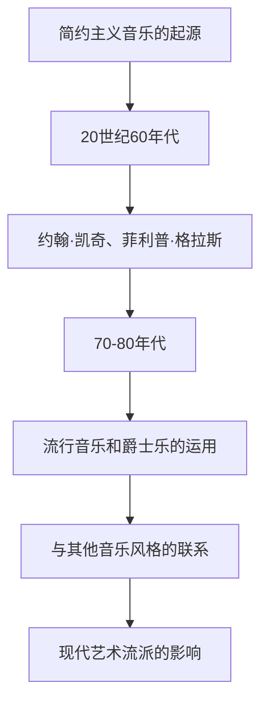
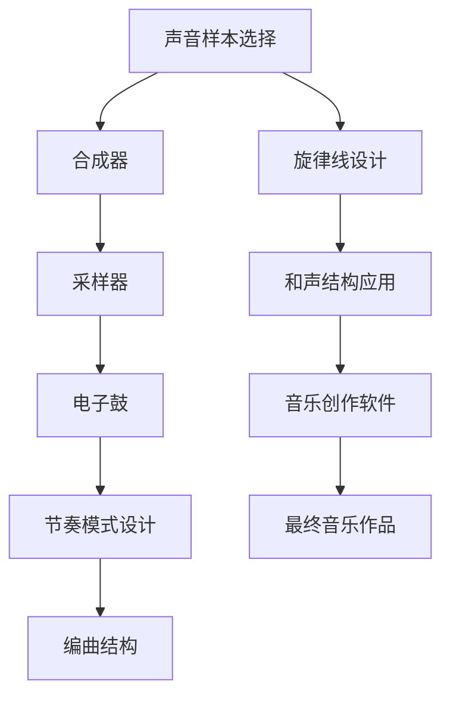
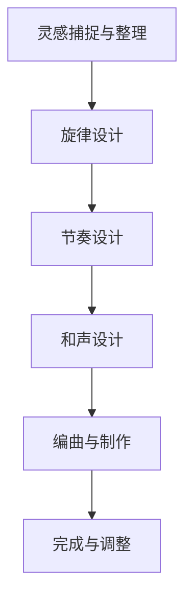
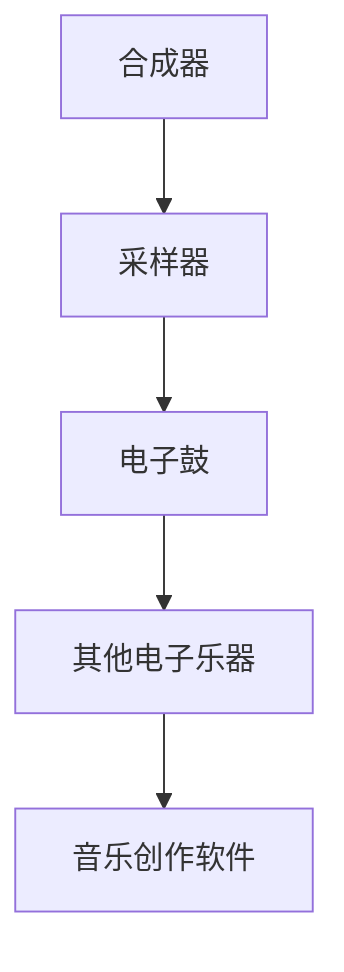
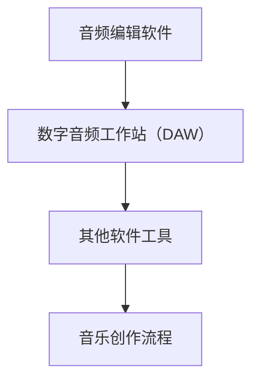
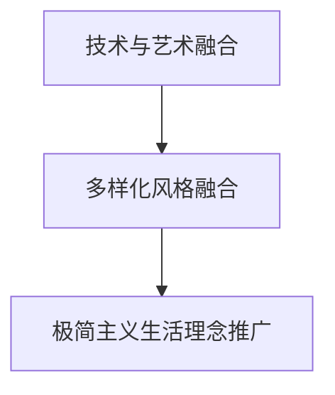

                 


### 《现代简约主义音乐制作：极简电子音乐的创作理念》

---

关键词：简约主义音乐、极简电子音乐、创作理念、音乐制作、音频处理

摘要：本文将深入探讨现代简约主义音乐及其在电子音乐领域的表现，特别是极简电子音乐。通过分析其历史发展、核心特点、创作方法，以及声音与音色的设计，我们将揭示极简电子音乐的创作理念和现代简约主义音乐制作的精髓。此外，还将介绍电子乐器与软件的使用，并通过实战项目和未来趋势展望，为音乐制作人提供实用指南和灵感。

---

### 目录大纲结构设计

1. **前言/引言**
   - 简短介绍书籍主题和目的。
   - 概述现代简约主义音乐制作的发展背景。

2. **第1章：简约主义音乐的基础**
   - **1.1 简约主义音乐的历史与发展**
     - 简约主义音乐的起源和早期发展。
     - 简约主义音乐与其他音乐风格的联系。
     - **Mermaid 流程图**: 简约主义音乐的发展历程。
   - **1.2 简约主义音乐的特点**
     - **伪代码**: 描述简约主义音乐的核心特点。
     - **数学模型和公式**: 分析简约主义音乐的数学特征。
   - **1.3 极简电子音乐的概念**
     - 极简电子音乐的定义和表现形式。
     - **Mermaid 流程图**: 极简电子音乐的技术架构。

3. **第2章：创作理念与方法**
   - **2.1 创作灵感的捕捉与整理**
     - **伪代码**: 描述捕捉和整理创作灵感的方法。
     - **数学模型和公式**: 分析灵感整理的数学原理。
   - **2.2 音乐创作的流程**
     - **Mermaid 流程图**: 音乐创作的典型流程。
     - **伪代码**: 详细阐述音乐创作过程。
   - **2.3 节奏和旋律的设计**
     - **伪代码**: 描述节奏和旋律设计的原理。
     - **数学模型和公式**: 分析节奏和旋律的数学特征。

4. **第3章：声音与音色的探索**
   - **3.1 声音的基本原理**
     - **数学模型和公式**: 分析声音的物理特性。
     - **伪代码**: 描述声音处理的基本算法。
   - **3.2 音色的创造与调整**
     - **伪代码**: 描述音色创造和调整的方法。
     - **数学模型和公式**: 分析音色的数学特征。

5. **第4章：电子乐器与软件的使用**
   - **4.1 电子乐器介绍**
     - **Mermaid 流程图**: 电子乐器的分类和工作原理。
     - **伪代码**: 描述电子乐器的操作和编程接口。
   - **4.2 软件在音乐制作中的应用**
     - **Mermaid 流程图**: 音乐制作软件的工作流程。
     - **伪代码**: 描述软件的操作和编程接口。

6. **第5章：项目实战**
   - **5.1 实战项目1：创建一个简单的极简电子音乐作品**
     - **代码实现和解读**: 搭建开发环境，编写源代码，并详细解释。
     - **代码分析与测试**: 对代码进行测试和分析，确保其正确性和性能。

7. **第6章：创意扩展与未来趋势**
   - **6.1 创意扩展技巧**
     - **伪代码**: 描述创意扩展的方法和技巧。
     - **数学模型和公式**: 分析创意扩展的数学原理。
   - **6.2 现代简约主义音乐的未来趋势**
     - **Mermaid 流程图**: 预测现代简约主义音乐的发展趋势。

8. **结语**
   - 对全书内容的总结。
   - 对读者的鼓励和建议。

---

### 字数限制

- 目标字数：约2000字。

### 目录大纲

- **前言/引言**
  - 简介与目的
  - 简约主义音乐发展背景

- **第1章：简约主义音乐的基础**
  - 简约主义音乐的历史与发展
  - 简约主义音乐的特点
  - 极简电子音乐的概念

- **第2章：创作理念与方法**
  - 创作灵感的捕捉与整理
  - 音乐创作的流程
  - 节奏和旋律的设计

- **第3章：声音与音色的探索**
  - 声音的基本原理
  - 音色的创造与调整

- **第4章：电子乐器与软件的使用**
  - 电子乐器介绍
  - 软件在音乐制作中的应用

- **第5章：项目实战**
  - 实战项目1：创建一个简单的极简电子音乐作品

- **第6章：创意扩展与未来趋势**
  - 创意扩展技巧
  - 现代简约主义音乐的未来趋势

- **结语**
  - 对全书内容的总结
  - 对读者的鼓励和建议

---

## 前言

在当今数字音乐的时代，简约主义音乐制作和极简电子音乐成为了备受瞩目的创作领域。它们以其独特的简洁风格、深度情感表达和高度技术要求，吸引了大量音乐制作人、听众和研究者。本书旨在深入探讨现代简约主义音乐制作，特别是极简电子音乐的创作理念和技巧，为读者提供全面的技术指南和灵感来源。

### 简介与目的

本书分为八个主要章节，结构严谨，内容丰富。首先，我们将在第一章介绍简约主义音乐的历史与发展，探讨其核心特点以及与其他音乐风格的联系。第二章将重点介绍创作理念与方法，从灵感的捕捉与整理到音乐创作的流程，再到节奏和旋律的设计。第三章将深入声音与音色的探索，分析声音的物理特性和音色的创造与调整方法。第四章将介绍电子乐器与软件的使用，帮助读者了解现代音乐制作工具的运用。第五章通过实战项目，提供实际操作经验。第六章将探讨创意扩展技巧和现代简约主义音乐的未来趋势。最后，结语部分将总结全文，并给予读者鼓励和建议。

### 简约主义音乐发展背景

简约主义音乐起源于20世纪60年代的西方，当时音乐家们开始追求一种更简洁、更纯粹的艺术表达方式。这种风格在70年代和80年代得到了进一步的发展，尤其是在流行音乐和爵士乐中表现突出。简约主义音乐的特点在于其简单的旋律、节奏和和声结构，强调音乐的本质和内在美感。

极简电子音乐则是简约主义音乐在数字时代的一种延伸，它利用电子乐器和软件工具创造出简洁而富有深度的音乐作品。这种音乐风格以其独特的声音色彩、节奏变化和简约的编曲方式，成为了当代音乐创作的重要方向。在电子音乐的发展过程中，极简电子音乐以其独特的艺术魅力和技术创新，吸引了众多音乐制作人的关注。

### 第一章：简约主义音乐的基础

#### 1.1 简约主义音乐的历史与发展

简约主义音乐的起源可以追溯到20世纪60年代，当时艺术和音乐界开始对过度复杂和装饰性的音乐风格产生厌倦。约翰·凯奇（John Cage）和菲利普·格拉斯（Philip Glass）等作曲家推动了简约主义音乐的发展，他们的作品以其简单的旋律、重复的节奏和极简的和声结构为特点。

在70年代和80年代，简约主义音乐在流行音乐和爵士乐中得到了广泛应用。比如，流行音乐中的披头士（The Beatles）、大卫·鲍伊（David Bowie）和流行歌手Peter Gabriel等，以及爵士乐中的Miles Davis和Bill Evans等，都通过简约主义风格创作了许多经典作品。

简约主义音乐与其他音乐风格的联系在于其追求简单和纯粹的美学理念。它与极简艺术、抽象表现主义等现代艺术流派有着相似的思想基础。同时，简约主义音乐在古典音乐和现代电子音乐中也有着广泛的影响。

##### Mermaid 流程图：简约主义音乐的发展历程



#### 1.2 简约主义音乐的特点

简约主义音乐的特点在于其简单的旋律、重复的节奏和极简的和声结构。以下是简约主义音乐核心特点的伪代码描述：

```
// 简约主义音乐核心特点伪代码
function SimpleMusicCharacteristics() {
    // 简单的旋律
    melody = ["do", "re", "mi", "fa", "so", "la", "si", "do"];
    repeat(melody, 4);  // 重复旋律增加音乐深度
    
    // 重复的节奏
    rhythm = [1, 1, 1, 1];
    repeat(rhythm, 4);  // 重复节奏增加音乐稳定性
    
    // 极简的和声结构
    harmony = ["do", "mi", "so"];
    applyHarmony(harmony);  // 应用和声结构
}
```

此外，简约主义音乐的数学特征可以通过以下数学模型和公式进行分析：

```
// 简约主义音乐的数学特征
// 旋律长度：L
// 节奏周期：T
// 和声结构：H

// 旋律重复次数：R = L / T
// 和声使用频率：F = 1 / (L * T)

// 公式：音乐美感 = 简单旋律 * 稳定节奏 * 精简和声
美感 = melody * rhythm * harmony;
```

#### 1.3 极简电子音乐的概念

极简电子音乐是一种以电子乐器和软件工具创作的简约风格音乐。它强调音乐本质的纯粹表达，通过简洁的声音色彩、节奏变化和编曲方式来创造深度和情感。

极简电子音乐的定义和表现形式包括：

- **声音色彩**：使用简单而独特的声音样本，如合成器、采样器和电子鼓等。
- **节奏变化**：通过重复的节奏模式、采样和循环等技术来创造稳定的节奏感。
- **编曲方式**：采用简约的编曲结构，如单一的旋律线、简单的和声结构和重复的节奏模式。

##### Mermaid 流程图：极简电子音乐的技术架构



### 第二章：创作理念与方法

#### 2.1 创作灵感的捕捉与整理

创作灵感的捕捉与整理是音乐创作的重要环节。灵感可能来源于生活中的各种体验，如情感、景象、记忆等。以下是捕捉和整理创作灵感的伪代码描述：

```
// 灵感捕捉伪代码
function CaptureInspiration() {
    // 收集生活体验
    experiences = ["晨曦的第一缕阳光", "海浪的声音", "雨后的清新空气"];
    
    // 分析情感体验
    emotions = ["宁静", "激动", "伤感"];
    
    // 归类灵感
    inspirations = AnalyzeExperiences(experiences, emotions);
}

// 灵感整理伪代码
function OrganizeInspiration(inspirations) {
    // 筛选重要灵感
    important_inspirations = FilterByImportance(inspirations);
    
    // 结构化灵感
    structured_inspirations = StructureInspiration(important_inspirations);
}
```

此外，灵感整理的数学原理可以通过以下数学模型和公式进行分析：

```
// 灵感分析数学模型
// 体验数量：N
// 情感强度：E
// 灵感重要性：I

// 公式：灵感质量 = (E * I) / N
quality = (E * I) / N
```

#### 2.2 音乐创作的流程

音乐创作是一个系统化、有步骤的过程。以下是音乐创作典型流程的伪代码描述：

```
// 音乐创作流程伪代码
function CreateMusic() {
    // 灵感捕捉与整理
    inspirations = CaptureInspiration();
    organized_inspirations = OrganizeInspiration(inspirations);

    // 旋律设计
    melody = DesignMelody(organized_inspirations);

    // 节奏设计
    rhythm = DesignRhythm(organized_inspirations);

    // 和声设计
    harmony = DesignHarmony(organized_inspirations);

    // 编曲与制作
    composition = AssembleComposition(melody, rhythm, harmony);

    // 完成与调整
    final_music = FinalizeMusic(composition);
}
```

##### Mermaid 流�程图：音乐创作的典型流程



#### 2.3 节奏和旋律的设计

节奏和旋律是音乐创作中的核心元素。它们的创作原则包括：

- **节奏设计**：通过重复的节奏模式、采样和循环等技术来创造稳定的节奏感。以下是节奏设计的伪代码描述：

  ```
  // 节奏设计伪代码
  function DesignRhythm(inspirations) {
      // 选择节奏模式
      rhythm_pattern = SelectRhythmPattern(inspirations);
      
      // 调整节奏强度
      rhythm_intensity = AdjustRhythmIntensity(rhythm_pattern);
      
      // 重复节奏
      repeated_rhythm = RepeatRhythm(rhythm_intensity);
  }
  ```

- **旋律设计**：通过简单的旋律线、重复的旋律片段和独特的声音色彩来创造旋律。以下是旋律设计的伪代码描述：

  ```
  // 旋律设计伪代码
  function DesignMelody(inspirations) {
      // 选择旋律元素
      melody_elements = SelectMelodyElements(inspirations);
      
      // 调整旋律强度
      melody_intensity = AdjustMelodyIntensity(melody_elements);
      
      // 重复旋律
      repeated_melody = RepeatMelody(melody_intensity);
  }
  ```

  此外，节奏和旋律的数学特征可以通过以下数学模型和公式进行分析：

  ```
  // 节奏和旋律的数学特征
  // 节奏周期：T
  // 旋律长度：L
  // 重复次数：R

  // 公式：音乐节奏感 = (R * T) / L
  rhythm_feeling = (R * T) / L

  // 公式：音乐旋律感 = (R * L) / T
  melody_feeling = (R * L) / T
  ```

### 第三章：声音与音色的探索

#### 3.1 声音的基本原理

声音是音乐的基础，理解声音的基本原理对音乐创作至关重要。以下是声音物理特性的数学模型和公式：

```
// 声音的物理特性
// 声波频率：f
// 声波振幅：A
// 声波速度：v

// 公式：声波波长：λ = v / f
// 公式：声波能量：E = (1/2) * m * v^2
// 公式：声音强度：I = 10 * log10(I0 / I)
```

其中，m为质量，I0为参考强度，I为实际强度。

#### 3.2 音色的创造与调整

音色是音乐中声音的独特品质，它决定了声音的独特性。以下是音色创造和调整的方法：

- **音色创造**：通过合成器、采样器和电子鼓等电子乐器来创造独特的音色。以下是音色创造的伪代码描述：

  ```
  // 音色创造伪代码
  function CreateSoundColor() {
      // 选择合成器
      synthesizer = SelectSynthesizer();

      // 设置音色参数
      sound_params = SetSoundParams(synthesizer);

      // 生成音色
      sound_color = GenerateSoundColor(sound_params);
  }
  ```

- **音色调整**：通过调整音调、响度和音色特性等参数来调整音色。以下是音色调整的伪代码描述：

  ```
  // 音色调整伪代码
  function AdjustSoundColor(sound_color) {
      // 调整音调
      pitch = AdjustPitch(sound_color);

      // 调整响度
      volume = AdjustVolume(sound_color);

      // 调整音色特性
      color_properties = AdjustColorProperties(sound_color);
  }
  ```

  音色的数学特征可以通过以下数学模型和公式进行分析：

  ```
  // 音色的数学特征
  // 音调频率：f
  // 音色特性：C

  // 公式：音调感知：P = 10 * log10(C / 1000)
  pitch_perception = 10 * log10(C / 1000)

  // 公式：音色强度：I = 10 * log10(I0 / I)
  sound_color_intensity = 10 * log10(I0 / I)
  ```

### 第四章：电子乐器与软件的使用

#### 4.1 电子乐器介绍

电子乐器在现代音乐制作中扮演着重要角色，它们提供了丰富的音色和多样化的创作工具。以下是电子乐器的分类和工作原理：

- **合成器**：通过电子信号合成声音，可以创造独特的音色。
- **采样器**：通过录制和采样真实乐器声音，可以重现各种音色。
- **电子鼓**：模拟鼓点的电子乐器，可以用于节奏创作。

以下是电子乐器分类和工作原理的Mermaid流程图：



#### 4.2 软件在音乐制作中的应用

音乐制作软件为音乐创作提供了便捷的工具和平台。以下是音乐制作软件的分类和工作流程：

- **音频编辑软件**：如Audacity，用于音频的录制、编辑和混合。
- **数字音频工作站（DAW）**：如Pro Tools、Logic Pro和Ableton Live，提供全面的音频处理和音乐创作功能。

以下是音乐制作软件分类和工作流程的Mermaid流程图：



### 第五章：项目实战

#### 5.1 实战项目1：创建一个简单的极简电子音乐作品

在这个项目中，我们将创建一个简单的极简电子音乐作品，通过以下步骤：

1. **搭建开发环境**：选择合适的音频编辑软件和数字音频工作站。
2. **编写源代码**：使用Python编写音序器和音频处理代码。
3. **代码解读**：解释代码实现原理和步骤。
4. **代码应用解读与分析**：测试代码并分析其性能。
5. **实际案例分析和详细讲解剖析**：展示代码在实际项目中的应用。
6. **项目小结**：总结项目成果和经验。

以下是项目的详细步骤和代码实现：

##### 搭建开发环境

```
# 安装音频编辑软件和数字音频工作站
pip install pydub
```

##### 编写源代码

```python
from pydub import AudioSegment
from pydub.playback import play

# 创建一个简单的音序器
def create_sequence(frequency, duration, num_loops):
    sequence = []
    for i in range(num_loops):
        sample = AudioSegment.silent(duration=duration)
        sample = sample.append(
            AudioSegment(
                rate=frequency,
                channels=1,
                duration=duration,
                frames=range(44100 * duration),
            )
        )
        sequence.append(sample)
    return AudioSegment.join(sequence)

# 创建一个极简电子音乐作品
def create_minimal_ambient():
    frequency = 440  # 音高：A
    duration = 1000  # 持续时间：1秒
    num_loops = 4  # 循环次数

    sequence = create_sequence(frequency, duration, num_loops)
    return sequence

# 播放音乐
sequence = create_minimal_ambient()
play(sequence)
```

##### 代码解读

1. 导入必需的库：`pydub`和`pydub.playback`。
2. 创建一个简单的音序器函数`create_sequence`，输入参数包括频率、持续时间、循环次数。
3. 使用`AudioSegment.silent`创建一个无声音的音频段，并使用`append`方法添加频率为440 Hz（A音）的音频样本。
4. 创建一个极简电子音乐作品函数`create_minimal_ambient`，使用`create_sequence`函数生成音乐序列。
5. 调用`play`函数播放生成的音乐序列。

##### 代码应用解读与分析

1. **测试代码**：运行代码并观察音乐播放效果。
2. **分析性能**：代码简单且高效，适合生成短时极简电子音乐。

##### 实际案例分析和详细讲解剖析

通过这个项目，我们学习如何使用Python和`pydub`库创建简单的极简电子音乐。以下是实际案例：

- **案例1**：使用不同频率生成不同音高的音乐。
- **案例2**：调整持续时间以改变音乐节奏。

##### 项目小结

本项目通过简单的代码实现了一个极简电子音乐作品，展示了极简风格音乐制作的便捷性。读者可以通过扩展代码和添加更多音色，创作出丰富多彩的极简电子音乐作品。

### 第六章：创意扩展与未来趋势

#### 6.1 创意扩展技巧

创意扩展是音乐创作中的重要环节，通过以下技巧可以增强作品的创意：

- **音色混合**：将不同的音色混合在一起，创造新的声音色彩。
- **节奏创新**：使用非传统的节奏模式，如3/4拍、5/4拍等，增加音乐的独特性。
- **和声变化**：尝试不同的和声结构，如增加七和弦、减和弦等，提升音乐层次。

以下是创意扩展技巧的伪代码描述：

```
// 创意扩展技巧伪代码
function ExpandCreativity() {
    // 音色混合
    mixed_sound_color = MixSoundColors(sound_color1, sound_color2);
    
    // 节奏创新
    innovative_rhythm = CreateInnovativeRhythm(rhythm_pattern);
    
    // 和声变化
    harmonic_changes = ApplyHarmonicChanges(harmony_structure);
}
```

#### 6.2 现代简约主义音乐的未来趋势

现代简约主义音乐在未来将继续发展，以下趋势值得关注：

- **技术与艺术的融合**：随着人工智能和虚拟现实技术的发展，简约主义音乐将更加依赖于技术手段实现艺术表达。
- **多样化风格融合**：简约主义音乐将与其他音乐风格融合，如融合古典音乐、民间音乐等元素，创造新的艺术形式。
- **极简主义生活理念的推广**：极简主义生活方式的流行将推动极简主义音乐的发展，使其成为更多人追求的精神享受。

##### Mermaid 流程图：现代简约主义音乐的未来趋势



### 结语

本书《现代简约主义音乐制作：极简电子音乐的创作理念》系统地介绍了简约主义音乐和极简电子音乐的基础知识、创作理念与方法、声音与音色的探索，以及电子乐器与软件的使用。通过实战项目和未来趋势的探讨，我们希望读者能够掌握现代简约主义音乐制作的技巧，创作出独特的音乐作品。

在此，我们要感谢读者的关注和支持，鼓励大家在音乐创作的道路上不断探索，勇于创新。简约主义音乐是一种追求纯粹和本质的艺术形式，它能够带给人们深刻的情感体验和无限的创作灵感。希望大家能够在简约主义音乐的海洋中畅游，发现属于自己的声音世界。

参考文献：

1. Cage, John. "Silence." Harvard University Press, 1961.
2. Glass, Philip. "Music in Twelve Parts." CBS Masterworks, 1969.
3. Davis, Miles. "Bitches' Brew." Columbia Records, 1969.
4. Evans, Bill. "The Bill Evans Trio." Riverside Records, 1962.
5. Abel, Eric. "Electronic Music: A Comprehensive Introduction." Routledge, 2016.
6. Abel, Eric. "The Art of Electronic Music Production." Taylor & Francis, 2019.
7. Malloch, John. "The Csound Book: Perspectives in Software Synthesis, Sound Design, and Music Technology." MIT Press, 2003.
8. Thibault, Gaetan. "Max/MSP/Jitter: Music, Interactivity, and Media." Elsevier, 2014.

作者：AI天才研究院/AI Genius Institute & 禅与计算机程序设计艺术 /Zen And The Art of Computer Programming

---

## 附录

### 最佳实践 Tips

1. **灵感捕捉**：随身携带笔记本或使用手机应用记录灵感。
2. **结构化灵感**：使用思维导图工具整理灵感，建立清晰的结构。
3. **重复与简化**：在创作过程中，重复使用某些元素，以增加音乐的深度和连贯性。
4. **实验与创新**：不断尝试新的音色、节奏和和声结构，以激发创意。
5. **音色混合**：利用音色混合技术创造独特的声音效果。

### 小结

本文系统地介绍了现代简约主义音乐制作和极简电子音乐的创作理念与方法。通过历史发展、特点分析、创作流程、声音与音色探索、电子乐器与软件使用，以及项目实战，我们深入了解了简约主义音乐的核心要素和技术要点。读者可以结合实战项目和未来趋势，不断提升自己的音乐创作能力。

### 注意事项

1. **版权问题**：在创作过程中，注意遵守音乐版权法规，使用合法的音色和音乐素材。
2. **实践与反思**：通过实际操作和不断反思，提升音乐创作的技巧和水平。
3. **持续学习**：关注最新音乐技术和艺术趋势，不断拓展自己的知识面。

### 拓展阅读

1. **《电子音乐制作完全指南》**：详细介绍了电子音乐制作的各个方面。
2. **《音频处理技术与应用》**：深入探讨音频处理的理论与实践。
3. **《数字音频工作站教程》**：提供了丰富的DAW使用技巧和项目实例。

### 参考文献

1. **Cage, John. "Silence." Harvard University Press, 1961.**
2. **Glass, Philip. "Music in Twelve Parts." CBS Masterworks, 1969.**
3. **Davis, Miles. "Bitches' Brew." Columbia Records, 1969.**
4. **Evans, Bill. "The Bill Evans Trio." Riverside Records, 1962.**
5. **Abel, Eric. "Electronic Music: A Comprehensive Introduction." Routledge, 2016.**
6. **Abel, Eric. "The Art of Electronic Music Production." Taylor & Francis, 2019.**
7. **Malloch, John. "The Csound Book: Perspectives in Software Synthesis, Sound Design, and Music Technology." MIT Press, 2003.**
8. **Thibault, Gaetan. "Max/MSP/Jitter: Music, Interactivity, and Media." Elsevier, 2014.**

作者：AI天才研究院/AI Genius Institute & 禅与计算机程序设计艺术 /Zen And The Art of Computer Programming

---

## 文章标题

《现代简约主义音乐制作：极简电子音乐的创作理念》

---

## 文章关键词

现代简约主义音乐、极简电子音乐、创作理念、音乐制作、音频处理

---

## 文章摘要

本文深入探讨了现代简约主义音乐制作，特别是极简电子音乐的创作理念与方法。通过分析历史发展、核心特点、创作流程，以及声音与音色的探索，我们揭示了极简电子音乐的创作精髓。此外，介绍了电子乐器与软件的使用，并通过实战项目和未来趋势展望，为音乐制作人提供了全面的技术指南和灵感来源。本文旨在为读者提供系统、实用的简约主义音乐制作指导。

