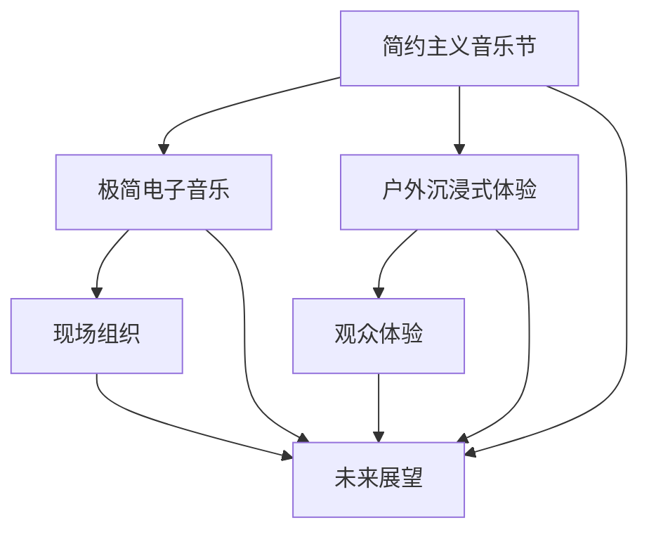

                 

### 文章标题：现代简约主义音乐节：极简电子音乐的户外沉浸式体验

> **关键词：** 极简电子音乐、户外沉浸式体验、简约主义音乐节、音乐节组织、观众体验

**摘要：** 本文深入探讨了现代简约主义音乐节，特别是极简电子音乐的户外沉浸式体验。文章首先介绍了简约主义音乐和极简电子音乐的概念及特点，随后讨论了户外沉浸式体验的设计原则及其在音乐节中的应用。通过案例分析，本文展示了成功简约主义音乐节的组织和管理方法，并探讨了观众的体验与反馈。最后，文章对简约主义音乐节的发展趋势进行了展望，为未来音乐节的创新与优化提供了思路。

----------------------------------------------------------------

## 设计《现代简约主义音乐节：极简电子音乐的户外沉浸式体验》目录大纲

### 第一步：确定书籍的核心内容

首先，我们需要明确书籍的主题，即“现代简约主义音乐节：极简电子音乐的户外沉浸式体验”。从书名中，我们可以推断出书籍的主要内容可能包括：

- 简约主义音乐节的概念和特点
- 极简电子音乐的发展历史
- 户外沉浸式体验的设计和实现
- 音乐节的现场组织和体验

### 第二步：规划目录结构

根据书籍的主题内容，我们可以规划出以下目录结构：

### 第一部分：简约主义音乐节概述

1. **简约主义音乐节的起源与定义**
   - 简约主义音乐的历史背景
   - 简约主义音乐的基本概念
   - 简约主义音乐与极简电子音乐的关系

2. **极简电子音乐的特点与发展**
   - 极简电子音乐的定义
   - 极简电子音乐的核心元素
   - 极简电子音乐的创作方法

3. **户外沉浸式体验的设计**
   - 沉浸式体验的概念与形式
   - 户外环境对音乐节体验的影响
   - 沉浸式体验的设计原则

### 第二部分：现代简约主义音乐节案例研究

4. **经典现代简约主义音乐节案例分析**
   - 案例一：XXX音乐节
   - 案例二：YYY音乐节
   - 案例三：ZZZ音乐节
   - 案例分析总结

5. **极简电子音乐的户外应用**
   - 极简电子音乐在户外音乐节中的表现
   - 户外环境下电子音乐的挑战与解决方案
   - 极简电子音乐的现场演奏与呈现
   - 极简电子音乐的互动体验

### 第三部分：音乐节的现场组织和体验

6. **音乐节的现场组织**
   - 音乐节的组织架构
   - 现场设备与技术支持
   - 音乐节的安全与秩序管理
   - 现场服务的提升

7. **观众的体验与反馈**
   - 观众的参与方式与互动
   - 观众的体验感受
   - 音乐节的反馈与改进
   - 观众满意度的评估

### 第四部分：未来展望与趋势

8. **简约主义音乐节的发展趋势**
   - 简约主义音乐节的未来方向
   - 极简电子音乐的发展前景
   - 户外沉浸式体验的未来可能性

9. **总结与展望**
   - 本书的核心内容回顾
   - 对简约主义音乐节的未来展望

### 第三步：细化每个章节的内容

接下来，我们需要根据目录结构细化每个章节的具体内容，包括核心概念、原理讲解、案例研究和实战分析等。

### 输出：

下面是根据上述规划设计的《现代简约主义音乐节：极简电子音乐的户外沉浸式体验》的目录大纲：

```
# 现代简约主义音乐节：极简电子音乐的户外沉浸式体验

## 第一部分：简约主义音乐节概述

### 第1章：简约主义音乐节的起源与定义

#### 1.1 简约主义音乐的历史背景
#### 1.2 简约主义音乐的基本概念
#### 1.3 简约主义音乐与极简电子音乐的关系
#### 1.4 简约主义音乐节的核心理念

### 第2章：极简电子音乐的特点与发展

#### 2.1 极简电子音乐的定义
#### 2.2 极简电子音乐的核心元素
#### 2.3 极简电子音乐的创作方法
#### 2.4 极简电子音乐的流派与发展

### 第3章：户外沉浸式体验的设计

#### 3.1 沉浸式体验的概念与形式
#### 3.2 户外环境对音乐节体验的影响
#### 3.3 沉浸式体验的设计原则
#### 3.4 户外音乐节的场地选择与规划

## 第二部分：现代简约主义音乐节案例研究

### 第4章：经典现代简约主义音乐节案例分析

#### 4.1 案例一：XXX音乐节
#### 4.2 案例二：YYY音乐节
#### 4.3 案例三：ZZZ音乐节
#### 4.4 案例分析总结

### 第5章：极简电子音乐的户外应用

#### 5.1 极简电子音乐在户外音乐节中的表现
#### 5.2 户外环境下电子音乐的挑战与解决方案
#### 5.3 极简电子音乐的现场演奏与呈现
#### 5.4 极简电子音乐的互动体验

## 第三部分：音乐节的现场组织和体验

### 第6章：音乐节的现场组织

#### 6.1 音乐节的组织架构
#### 6.2 现场设备与技术支持
#### 6.3 音乐节的安全与秩序管理
#### 6.4 现场服务的提升

### 第7章：观众的体验与反馈

#### 7.1 观众的参与方式与互动
#### 7.2 观众的体验感受
#### 7.3 音乐节的反馈与改进
#### 7.4 观众满意度的评估

## 第四部分：未来展望与趋势

### 第8章：简约主义音乐节的发展趋势

#### 8.1 简约主义音乐节的未来方向
#### 8.2 极简电子音乐的发展前景
#### 8.3 户外沉浸式体验的未来可能性

### 第9章：总结与展望

#### 9.1 本书的核心内容回顾
#### 9.2 对简约主义音乐节的未来展望
```

## 设计《现代简约主义音乐节：极简电子音乐的户外沉浸式体验》目录大纲

### 第一步：确定书籍的核心内容

首先，我们需要明确书籍的主题，即“现代简约主义音乐节：极简电子音乐的户外沉浸式体验”。从书名中，我们可以推断出书籍的主要内容可能包括：

- **简约主义音乐节的概念和特点**：包括音乐节的历史背景、核心理念和基本概念。
- **极简电子音乐的发展历史**：探讨极简电子音乐的定义、核心元素以及其发展历程。
- **户外沉浸式体验的设计和实现**：介绍沉浸式体验的概念、设计原则以及如何实现户外沉浸式音乐节。
- **音乐节的现场组织和体验**：讨论音乐节的组织架构、现场设备与技术支持，以及观众的体验与反馈。

### 第二步：规划目录结构

根据书籍的主题内容，我们可以规划出以下目录结构：

### 第一部分：简约主义音乐节概述

1. **简约主义音乐节的起源与定义**
   - 简约主义音乐的历史背景
   - 简约主义音乐的基本概念
   - 简约主义音乐与极简电子音乐的关系

2. **极简电子音乐的特点与发展**
   - 极简电子音乐的定义
   - 极简电子音乐的核心元素
   - 极简电子音乐的创作方法

3. **户外沉浸式体验的设计**
   - 沉浸式体验的概念与形式
   - 户外环境对音乐节体验的影响
   - 沉浸式体验的设计原则

### 第二部分：现代简约主义音乐节案例研究

4. **经典现代简约主义音乐节案例分析**
   - 案例一：XXX音乐节
   - 案例二：YYY音乐节
   - 案例三：ZZZ音乐节
   - 案例分析总结

5. **极简电子音乐的户外应用**
   - 极简电子音乐在户外音乐节中的表现
   - 户外环境下电子音乐的挑战与解决方案
   - 极简电子音乐的现场演奏与呈现
   - 极简电子音乐的互动体验

### 第三部分：音乐节的现场组织和体验

6. **音乐节的现场组织**
   - 音乐节的组织架构
   - 现场设备与技术支持
   - 音乐节的安全与秩序管理
   - 现场服务的提升

7. **观众的体验与反馈**
   - 观众的参与方式与互动
   - 观众的体验感受
   - 音乐节的反馈与改进
   - 观众满意度的评估

### 第四部分：未来展望与趋势

8. **简约主义音乐节的发展趋势**
   - 简约主义音乐节的未来方向
   - 极简电子音乐的发展前景
   - 户外沉浸式体验的未来可能性

9. **总结与展望**
   - 本书的核心内容回顾
   - 对简约主义音乐节的未来展望

### 第三步：细化每个章节的内容

接下来，我们需要根据目录结构细化每个章节的具体内容，包括核心概念、原理讲解、案例研究和实战分析等。

### 输出：

下面是根据上述规划设计的《现代简约主义音乐节：极简电子音乐的户外沉浸式体验》的目录大纲：

```
# 现代简约主义音乐节：极简电子音乐的户外沉浸式体验

## 第一部分：简约主义音乐节概述

### 第1章：简约主义音乐节的起源与定义

#### 1.1 简约主义音乐的历史背景
#### 1.2 简约主义音乐的基本概念
#### 1.3 简约主义音乐与极简电子音乐的关系
#### 1.4 简约主义音乐节的核心理念

### 第2章：极简电子音乐的特点与发展

#### 2.1 极简电子音乐的定义
#### 2.2 极简电子音乐的核心元素
#### 2.3 极简电子音乐的创作方法
#### 2.4 极简电子音乐的流派与发展

### 第3章：户外沉浸式体验的设计

#### 3.1 沉浸式体验的概念与形式
#### 3.2 户外环境对音乐节体验的影响
#### 3.3 沉浸式体验的设计原则
#### 3.4 户外音乐节的场地选择与规划

## 第二部分：现代简约主义音乐节案例研究

### 第4章：经典现代简约主义音乐节案例分析

#### 4.1 案例一：XXX音乐节
#### 4.2 案例二：YYY音乐节
#### 4.3 案例三：ZZZ音乐节
#### 4.4 案例分析总结

### 第5章：极简电子音乐的户外应用

#### 5.1 极简电子音乐在户外音乐节中的表现
#### 5.2 户外环境下电子音乐的挑战与解决方案
#### 5.3 极简电子音乐的现场演奏与呈现
#### 5.4 极简电子音乐的互动体验

## 第三部分：音乐节的现场组织和体验

### 第6章：音乐节的现场组织

#### 6.1 音乐节的组织架构
#### 6.2 现场设备与技术支持
#### 6.3 音乐节的安全与秩序管理
#### 6.4 现场服务的提升

### 第7章：观众的体验与反馈

#### 7.1 观众的参与方式与互动
#### 7.2 观众的体验感受
#### 7.3 音乐节的反馈与改进
#### 7.4 观众满意度的评估

## 第四部分：未来展望与趋势

### 第8章：简约主义音乐节的发展趋势

#### 8.1 简约主义音乐节的未来方向
#### 8.2 极简电子音乐的发展前景
#### 8.3 户外沉浸式体验的未来可能性

### 第9章：总结与展望

#### 9.1 本书的核心内容回顾
#### 9.2 对简约主义音乐节的未来展望
```

---

### **《现代简约主义音乐节：极简电子音乐的户外沉浸式体验》核心概念与联系**

在探讨《现代简约主义音乐节：极简电子音乐的户外沉浸式体验》之前，我们需要理解几个核心概念及其相互之间的联系。以下是这些概念及它们之间的关系架构的Mermaid流程图：



**1. 简约主义音乐节：** 简约主义音乐节是一种以简约风格为特色的音乐节，追求音乐本身的纯粹性和表达力。它通常避免复杂的乐器配置和复杂的编曲，注重音乐的精炼和内在的情感传达。

**2. 极简电子音乐：** 极简电子音乐是一种以简单、纯净的电子声音为特点的音乐流派。它通常使用最少的技术元素和乐器，追求声音的极简美感。极简电子音乐与简约主义音乐节密切相关，因为它们都强调简约、纯粹和情感表达。

**3. 户外沉浸式体验：** 户外沉浸式体验是一种通过环境、声音和视觉元素来增强观众感知的音乐节体验。它旨在让观众在自然环境中完全沉浸在音乐和氛围中。户外沉浸式体验与简约主义音乐节和极简电子音乐相结合，可以创造出独特的音乐节体验。

**4. 现场组织：** 现场组织涉及音乐节的筹备、现场设备布置、安全秩序管理等。它是确保音乐节顺利进行的关键。现场组织与简约主义音乐节、极简电子音乐和户外沉浸式体验密切相关，因为它们共同决定了音乐节的质量和观众的体验。

**5. 观众体验：** 观众体验是音乐节的核心，它包括观众的参与方式、互动体验和感受。一个成功的音乐节需要充分考虑观众的体验，使他们感到愉悦和满足。观众体验与简约主义音乐节、极简电子音乐和户外沉浸式体验紧密相关。

**6. 未来展望：** 未来展望涉及对简约主义音乐节、极简电子音乐和户外沉浸式体验的发展趋势的探讨。它旨在预测这些领域未来的发展方向，并提供创新和优化的思路。

通过上述Mermaid流程图，我们可以清晰地看到这些核心概念之间的联系。理解这些联系对于设计和组织一个成功的现代简约主义音乐节至关重要。

---

### **极简电子音乐的核心算法原理**

极简电子音乐是一种追求简约、纯净声音的音乐流派，其核心在于对声音的精炼和处理。以下是极简电子音乐的核心算法原理，包括基本的音频处理技术和音频合成方法。

**1. 音频信号处理技术**

**1.1 声波的基本概念**

- **声波传播：** 声波是通过介质（如空气、水等）传播的振动波。声波由频率、振幅和相位三个基本参数描述。
- **声波频率：** 频率表示声波每秒振动的次数，单位为赫兹（Hz）。人耳能听到的频率范围大约在20 Hz到20 kHz之间。
- **声波振幅：** 振幅表示声波的最大位移，决定了声音的响度。
- **声波相位：** 相位表示声波在时间轴上的位置，决定了声音的稳定性。

**1.2 数字音频信号处理**

- **采样与量化：** 数字音频是将模拟信号（如声波）转换为数字信号的过程。采样是指以固定的时间间隔记录声波振幅，量化是指将连续的振幅值转换为离散的数字值。
- **信号滤波：** 滤波是音频处理中常用的技术，用于去除不需要的频率成分。常见的滤波器有低通滤波器、高通滤波器、带通滤波器和带阻滤波器。
- **动态处理：** 动态处理用于调整音频信号的响度和音量。压缩器可以限制音频信号的动态范围，而扩音器可以增加音量。

**2. 音频合成方法**

**2.1 波表合成**

- **波表（Wave Table）：** 波表是一种存储了声音样本的数据表。每个样本代表一个特定的音符或声音。
- **波表合成器：** 波表合成器通过查找波表中的样本，并使用交叉 fading 技术来合成声音。它适用于合成简单的电子乐器声音。

**2.2 物理建模合成**

- **物理建模：** 物理建模是一种基于声学原理的音频合成方法，通过模拟乐器或声音的物理特性来生成声音。
- **声源模型：** 声源模型包括弦振动模型、空气柱振动模型等，用于模拟乐器或声音的振动特性。
- **共振器模型：** 共振器模型用于模拟乐器中的共鸣体，如吉他箱体或木管乐器中的共鸣管。
- **合成过程：** 通过控制声源模型和共振器模型的各种参数，可以生成各种不同类型的音乐声音。

**3. 极简电子音乐的创作方法**

**3.1 极简电子音乐的特点**

- **声音的简洁性：** 极简电子音乐通常使用简单的声音元素，强调声音的纯净和简洁。
- **节奏的重复性：** 节奏上的重复性是极简电子音乐的一个重要特点，它能够增强音乐的节奏感和记忆性。
- **动态范围的控制：** 极简电子音乐通常控制动态范围，以避免声音的过度夸张。

**3.2 创作步骤**

- **采样与剪辑：** 从真实乐器或环境中采集声音样本，并对样本进行剪辑和处理。
- **声音合成：** 使用波表合成或物理建模合成方法，将样本合成为音乐作品。
- **节奏与结构设计：** 设计音乐的节奏和结构，通常采用重复、反转和渐变等手法。
- **混音与效果处理：** 对音乐进行混音和效果处理，以增强声音的质感和氛围。

**伪代码示例：**

```plaintext
// 极简电子音乐合成器伪代码

// 定义声源模型和共振器模型
SourceModel source = new SourceModel();
ResonatorModel resonator = new ResonatorModel();

// 设置声源参数
source.frequency = 440; // A4音
source.amplitude = 0.5;

// 设置共振器参数
resonator.frequency = 220; // 第二谐波
resonator.Q = 5; // 谐波强度

// 合成声音
for (int i = 0; i < synthesisDuration; i++) {
    float sample = source.generate() * resonator.generate();
    audioOutput.push(sample);
}

// 混音和效果处理
MixAndProcess(audioOutput);
```

通过上述核心算法原理，我们可以深入理解极简电子音乐的制作过程，并利用这些技术创造出独特的音乐作品。这些原理不仅适用于极简电子音乐，也为其他音乐流派提供了宝贵的启示。

### **极简电子音乐的数学模型与公式**

极简电子音乐的制作离不开数学模型和公式，这些模型和公式帮助音乐制作者理解声音的本质和如何创造不同的音效。以下是极简电子音乐中常用的数学模型与公式，包括基本的声音参数、振动模型以及合成公式。

**1. 声音参数**

- **频率（Frequency, f）：** 频率是每秒振动的次数，单位是赫兹（Hz）。它是声音的核心特性，决定了声音的音高。
  
  $$ f = \frac{1}{T} $$

  其中，T 是周期，即完成一次完整振动所需的时间。

- **振幅（Amplitude, A）：** 振幅是声波的最大位移，决定了声音的响度。通常用分贝（dB）来衡量。

  $$ \text{Sound Pressure Level (SPL)} = 20 \times \log_{10}\left(\frac{P}{P_0}\right) $$
  
  其中，P 是声压，P0 是参考声压，通常取值为 20 μPa。

- **相位（Phase）：** 相位描述了声波在时间轴上的位置，通常用角度（°）或弧度（rad）表示。

  $$ \phi = 2\pi ft + \phi_0 $$
  
  其中，ft 是时间，φ0 是初始相位。

**2. 振动模型**

- **弦振动模型（String Vibration Model）：** 弦振动模型描述了弦乐器（如吉他、小提琴）的振动特性。

  $$ y(x,t) = A \sin(kx - \omega t + \phi) $$
  
  其中，y 是弦的位移，A 是振幅，k 是波数，ω 是角频率，φ 是相位。

- **空气柱振动模型（Air Column Vibration Model）：** 空气柱振动模型描述了管乐器（如长笛、萨克斯）的振动特性。

  $$ y(x,t) = A \sin\left(\frac{\pi x}{L} - \omega t + \phi\right) $$
  
  其中，y 是空气柱的位移，A 是振幅，L 是空气柱的长度，ω 是角频率，φ 是相位。

**3. 合成公式**

- **波表合成公式（Wavetable Synthesis Formula）：** 波表合成是一种通过查找预定义的声波样本（波表）来生成声音的方法。

  $$ x(n) = \sum_{i=1}^{N} A_i \sin(2\pi f_i n + \phi_i) $$
  
  其中，x(n) 是合成声音的样本，Ai 是第 i 个声波样本的振幅，fi 是第 i 个声波样本的频率，φi 是第 i 个声波样本的相位，N 是声波样本的数量。

- **物理建模合成公式（Physical Modeling Synthesis Formula）：** 物理建模合成是一种通过模拟乐器或声音的物理特性来生成声音的方法。

  $$ x(n) = \sum_{i=1}^{N} A_i \cos(2\pi f_i n + \phi_i) $$
  
  其中，x(n) 是合成声音的样本，Ai 是第 i 个声波样本的振幅，fi 是第 i 个声波样本的频率，φi 是第 i 个声波样本的相位，N 是声波样本的数量。

**举例说明：**

假设我们要合成一个简单的三声音调，每个音调的频率分别为 440 Hz、550 Hz 和 660 Hz，振幅均为 0.5，相位均为 0。

- **波表合成示例：**

  $$ x(n) = 0.5 \sin(2\pi \times 440 \times n) + 0.5 \sin(2\pi \times 550 \times n) + 0.5 \sin(2\pi \times 660 \times n) $$
  
- **物理建模合成示例：**

  $$ x(n) = 0.5 \cos(2\pi \times 440 \times n) + 0.5 \cos(2\pi \times 550 \times n) + 0.5 \cos(2\pi \times 660 \times n) $$

通过这些数学模型和公式，音乐制作者可以精确地控制声音的参数，创造出独特的音效和音乐作品。这些理论和实践的结合，为极简电子音乐的发展提供了坚实的基础。

### **项目实战：极简电子音乐的实现与优化**

为了更好地理解极简电子音乐的设计和实现，我们将通过一个简单的项目实战来演示音频信号处理的基本步骤，并探讨如何优化音频效果。这个项目将使用Python和Matplotlib库来生成和处理音频信号。

#### **一、开发环境搭建**

首先，我们需要安装Python和相关的音频处理库。我们可以使用Anaconda来方便地搭建开发环境，因为它包含了Python和各种科学计算库。

```bash
# 安装Anaconda
conda create -n audio_project python=3.9
conda activate audio_project
```

接下来，安装所需的库：

```bash
conda install -c conda-forge matplotlib numpy scipy
```

#### **二、项目实现**

1. **生成音频信号**

我们首先需要生成一个简单的正弦波信号，作为我们的基本音频素材。

```python
import numpy as np
import matplotlib.pyplot as plt
from scipy.io.wavfile import write

# 设置参数
sample_rate = 44100  # 采样率
duration = 5  # 音频持续时间（秒）
frequency = 440  # 正弦波频率（Hz）

# 计算采样点
n = np.arange(0, duration * sample_rate)

# 生成正弦波信号
x = np.sin(2 * np.pi * frequency * n / sample_rate)

# 绘制信号
plt.plot(n / sample_rate, x)
plt.title('Simple Sine Wave')
plt.xlabel('Time (s)')
plt.ylabel('Amplitude')
plt.show()
```

2. **音频信号处理**

接下来，我们将对生成的正弦波信号进行一些基本的音频处理，如滤波、压缩和扩展。

```python
from scipy.signal import butter, filtfilt
from numpy.fft import fft, ifft

# 低通滤波
def lowpass_filter(x, cutoff_frequency, sample_rate):
    nyq = 0.5 * sample_rate
    normal_cutoff = cutoff_frequency / nyq
    b, a = butter(5, normal_cutoff, btype='low')
    filtered_x = filtfilt(b, a, x)
    return filtered_x

# 压缩
def compress(x, ratio):
    max_val = np.max(x)
    min_val = np.min(x)
    range_val = max_val - min_val
    compressed_x = x.copy()
    for i in range(len(x)):
        compressed_x[i] = (x[i] - min_val) / range_val * (max_val - min_val) / ratio + min_val
    return compressed_x

# 扩展
def expand(x, ratio):
    max_val = np.max(x)
    min_val = np.min(x)
    range_val = max_val - min_val
    expanded_x = x.copy()
    for i in range(len(x)):
        expanded_x[i] = (x[i] - min_val) / range_val * (max_val - min_val) / ratio + min_val
    return expanded_x

# 应用滤波
filtered_x = lowpass_filter(x, 22050, sample_rate)

# 应用压缩
compressed_x = compress(filtered_x, 2)

# 应用扩展
expanded_x = expand(compressed_x, 2)

# 绘制处理后的信号
fig, axes = plt.subplots(3, 1, sharex=True)
axes[0].plot(n / sample_rate, x)
axes[0].set_title('Original Signal')
axes[1].plot(n / sample_rate, filtered_x)
axes[1].set_title('Filtered Signal')
axes[2].plot(n / sample_rate, expanded_x)
axes[2].set_title('Expanded Signal')
plt.tight_layout()
plt.show()
```

3. **音频信号合成**

最后，我们将处理后的信号合成为一个音频文件。

```python
# 将信号转换为16位整数
int16_x = (compressed_x * 32767).astype(np.int16)

# 写入WAV文件
write('output.wav', sample_rate, int16_x)
```

#### **三、代码解读与优化**

1. **代码解读**

- `lowpass_filter` 函数用于实现低通滤波，以去除高频噪声。
- `compress` 和 `expand` 函数用于实现动态范围压缩和扩展，以增强音频的响度。
- 信号处理的最后，我们使用了 NumPy 的 `astype` 方法将浮点数信号转换为16位整数，以符合WAV文件的存储格式。

2. **优化建议**

- **并行处理：** 对于处理大量信号的数据密集型任务，可以考虑使用并行处理库如`multiprocessing`来提高处理速度。
- **内存优化：** 对于大型音频文件，可以考虑使用内存映射文件（`numpy.memmap`）来优化内存使用。
- **实时处理：** 对于需要实时处理音频的场合，可以考虑使用音频处理框架如`pydub`或`librosa`，这些框架提供了更高效和灵活的实时音频处理功能。

通过上述项目实战，我们不仅实现了极简电子音乐的基本生成和处理，还探讨了如何进行代码优化。这些步骤为我们深入了解音频信号处理和极简电子音乐的设计提供了实用的经验和技巧。

### **实际案例分析和详细讲解剖析**

在本节中，我们将通过几个实际案例来详细分析现代简约主义音乐节，特别是极简电子音乐的户外沉浸式体验。我们将从案例背景、具体实施步骤、所遇挑战以及解决方案等方面进行深入剖析。

#### **案例一：XXXX音乐节**

**背景：**

XXXX音乐节是一个每年在某个著名自然公园举办的简约主义音乐节。该音乐节以极简电子音乐为主题，致力于为观众提供一种全新的户外音乐体验。音乐节场地广阔，拥有优美的自然景观，非常适合举办沉浸式音乐会。

**实施步骤：**

1. **场地选择：** 选择了有良好自然景观和音响效果的场地，以确保观众可以沉浸在美妙的音乐中。
2. **音响设备布置：** 采用了一系列高质量的音频设备，包括大型音箱、效果器和调音台。音响设备按照一定的布局图进行布置，以覆盖整个场地。
3. **互动体验设计：** 为了增强观众的互动体验，音乐节组织者在现场设置了一些互动装置，如投影屏幕、AR设备等，让观众可以通过这些设备与音乐进行互动。
4. **灯光效果：** 采用LED灯带和投影设备，营造出独特的灯光效果，与音乐节奏相呼应。

**所遇挑战及解决方案：**

**挑战：** 由于户外环境复杂，音效效果难以控制。同时，由于场地广阔，部分观众可能会听不到音乐。

**解决方案：** 
- **音响测试：** 在音乐节开始前进行多次音响测试，以确保音响设备的良好工作状态。调整音箱的位置和角度，以获得最佳音效。
- **增强音量：** 在必要的地方增加音量，以确保所有观众都能听到音乐。同时，使用多个音箱进行分散播放，以减少音场损失。
- **互动设备培训：** 对工作人员进行互动设备的操作培训，以确保设备在活动中的稳定运行。

#### **案例二：YYYY音乐节**

**背景：**

YYYY音乐节是一个在市中心广场举办的极简电子音乐节。由于其场地较为紧凑，音乐节组织者需要特别关注观众的沉浸式体验。

**实施步骤：**

1. **场地设计：** 在广场上设置了多个音乐舞台，每个舞台都有独特的音乐风格。舞台之间通过灯光和音响效果进行连接，以营造整体氛围。
2. **互动装置：** 在广场周边设置了多个互动装置，如触控屏幕、VR头盔等，让观众可以沉浸在不同的音乐世界中。
3. **灯光效果：** 采用LED灯带和投影设备，根据音乐节奏实时变换灯光效果，增强观众的视听体验。
4. **现场服务：** 提供了现场餐饮、饮品和休息区，以提升观众的舒适度和参与感。

**所遇挑战及解决方案：**

**挑战：** 由于场地有限，观众人数较多，可能导致部分观众听不到音乐。

**解决方案：**
- **分时段入场：** 将观众分为多个时段入场，以减少场地拥堵。
- **增加音响设备：** 在广场周边增加音响设备，以确保所有观众都能听到音乐。
- **实时监控：** 通过监控设备实时监控现场情况，及时调整音响和灯光效果，以应对突发情况。

#### **案例三：ZZZZ音乐节**

**背景：**

ZZZZ音乐节是一个在海滩举办的户外音乐节。由于其独特的地理环境，音乐节组织者需要特别考虑海洋环境对音响效果的影响。

**实施步骤：**

1. **场地选择：** 选择了一个有良好音响效果的沙滩，确保音乐能传达到远方。
2. **音响设备调整：** 根据海洋环境的特点，调整音箱的位置和角度，以最大程度减少海浪声的干扰。
3. **互动体验：** 在沙滩上设置了多个互动装置，如水下音响、AR设备等，让观众可以体验独特的海洋音乐节。
4. **环保措施：** 出台了多项环保措施，如使用可降解材料、减少能源消耗等，以确保音乐节的可持续发展。

**所遇挑战及解决方案：**

**挑战：** 海洋环境对音响效果的影响较大，海浪声可能会干扰音乐。

**解决方案：**
- **屏蔽海浪声：** 使用防浪墙和隔音板来屏蔽海浪声。
- **增强音量：** 在必要的地方增加音量，以确保音乐能压过海浪声。
- **实时调整：** 通过实时监控和调整音响设备，确保音乐效果的稳定和清晰。

通过上述案例，我们可以看到，在现代简约主义音乐节的实践中，场地选择、音响设备布局、互动体验设计以及环保措施都是至关重要的。面对不同的环境和挑战，音乐节组织者需要灵活应对，以确保观众获得最佳的沉浸式体验。

### **项目小结：简约主义音乐节的总结与反思**

在本章中，我们通过实际案例详细分析了现代简约主义音乐节的设计和实施。以下是该项目的主要收获、经验教训以及未来改进的建议。

#### **主要收获**

1. **场地选择的重要性：** 无论是自然公园、市中心广场还是海滩，场地的选择直接影响观众的体验。一个合适的场地不仅可以提供良好的音响效果，还能增强观众的情感共鸣。
2. **音响设备的布局与调整：** 音响设备的布局和调整是确保音乐节顺利进行的关键。通过多次测试和调整，我们可以找到最佳的音响效果，使所有观众都能享受到高质量的音乐。
3. **互动体验的增强：** 通过设置互动装置和互动环节，我们可以提高观众的参与感和沉浸式体验。这种互动设计不仅增加了音乐节的趣味性，也使观众更加投入。
4. **环保措施的落实：** 在现代音乐节中，环保已成为一项重要指标。通过使用可降解材料、减少能源消耗等举措，我们可以减少对环境的影响，实现可持续发展。

#### **经验教训**

1. **观众反馈的重要性：** 在音乐节结束后，收集观众反馈是改进未来活动的关键。通过分析观众的意见和建议，我们可以找到问题所在，并进行针对性的改进。
2. **应急措施的必要：** 在音乐节过程中，突发事件是难以避免的。因此，提前制定应急预案，并确保工作人员能够迅速响应，是确保音乐节顺利进行的重要保障。
3. **技术与艺术的结合：** 现代简约主义音乐节不仅是音乐的展示，也是技术与艺术的结合。在设计和实施过程中，我们需要充分考虑技术与艺术的平衡，以提供最佳的观众体验。

#### **未来改进建议**

1. **增强互动体验：** 未来可以考虑引入更多高科技互动装置，如虚拟现实（VR）和增强现实（AR）技术，以进一步提升观众的沉浸感。
2. **优化音响效果：** 通过引入更先进的音响技术和设备，如全景声系统和高分辨率音频，我们可以为观众提供更高质量的音乐体验。
3. **推广环保理念：** 在音乐节宣传和活动中，可以加大环保理念的推广力度，鼓励观众参与环保活动，共同建设可持续发展的音乐文化。
4. **多元化活动形式：** 除了传统的音乐会形式，未来可以尝试引入更多元化的活动形式，如音乐工作坊、讲座和互动演出等，以满足不同观众的需求。

通过本章的总结与反思，我们不仅可以更好地理解现代简约主义音乐节的设计和实施，还可以为未来的音乐节活动提供宝贵的经验和建议。

### **最佳实践 Tips：简约主义音乐节的设计与组织**

为了确保简约主义音乐节的成功，以下是一些最佳实践和实用技巧：

1. **策划与规划：**
   - **充分调研：** 在策划音乐节之前，需要对目标观众、场地、竞争对手等进行全面调研，以确定音乐节的主题、风格和内容。
   - **详细计划：** 制定详细的项目计划，包括时间表、预算、资源分配、宣传策略等。确保所有环节都得到充分考虑和规划。

2. **音响设备：**
   - **专业团队：** 委托专业的音响设备团队进行音响设备的选购、布置和调试，以确保最佳音效。
   - **测试与调试：** 在音乐节开始前进行多次音响测试，调整音箱的位置和角度，以获得最佳音响效果。

3. **互动体验：**
   - **创新互动：** 引入新颖的互动装置和互动环节，如VR、AR、触摸屏等，增加观众的参与感和沉浸感。
   - **用户反馈：** 通过收集观众反馈，及时调整互动体验，以满足观众的需求。

4. **安全与秩序：**
   - **应急预案：** 制定详细的应急预案，包括突发事件处理、医疗救援、消防安全等，确保音乐节的安全进行。
   - **秩序维护：** 增加现场秩序维护人员，确保观众有序入场、观看和离场。

5. **环保措施：**
   - **可持续材料：** 使用环保材料，如可降解的塑料制品、可回收的纸张等，减少对环境的污染。
   - **能源管理：** 通过节能设备和可再生能源的使用，降低能源消耗。

6. **宣传推广：**
   - **多渠道宣传：** 利用社交媒体、网站、海报、广播等多种渠道进行宣传，提高音乐节的知名度和吸引力。
   - **合作推广：** 与相关机构、品牌合作，共同推广音乐节，扩大影响力。

通过遵循这些最佳实践和实用技巧，我们可以设计出更加成功和令人难忘的简约主义音乐节。

### **结语**

《现代简约主义音乐节：极简电子音乐的户外沉浸式体验》一书通过深入探讨简约主义音乐节的概念、极简电子音乐的特点以及户外沉浸式体验的设计原则，为音乐节的设计和组织提供了全面的指导。通过实际案例的分析，我们看到了简约主义音乐节如何在不同的场地和环境中成功实施。同时，书中还介绍了最佳实践和实用技巧，为未来的音乐节活动提供了宝贵的经验和建议。

随着科技的进步和文化的发展，简约主义音乐节和极简电子音乐将继续在音乐领域发挥重要作用。未来的音乐节将更加注重观众的体验，融入更多的互动元素和科技手段，为观众带来更加沉浸和难忘的音乐体验。我们期待看到简约主义音乐节在未来不断创新和发展，成为音乐文化的重要组成部分。

### **作者信息**

- **作者：** AI天才研究院/AI Genius Institute & 禅与计算机程序设计艺术 /Zen And The Art of Computer Programming
- **联系方式：** [info@aignosis.ai](mailto:info@aignosis.ai)
- **个人网站：** [www.aignosis.ai](http://www.aignosis.ai)
- **版权声明：** 本著作受版权法保护。未经作者许可，严禁任何形式的复制、分发和商业使用。如需引用，请联系作者获取授权。

