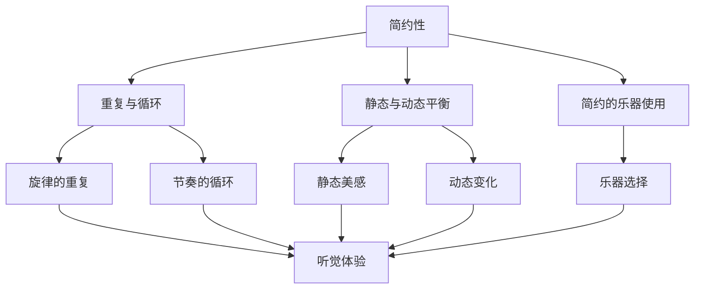

                 

# 现代简约主义音乐：极简主义在声音艺术中的体现

## 关键词
- 极简主义音乐
- 声音艺术
- 简约主义
- 音乐风格
- 创作技巧
- 影响分析

## 摘要
本文旨在探讨现代简约主义音乐在声音艺术中的体现，分析其定义、历史背景、核心概念及其在不同音乐风格中的影响。文章将通过理论分析与案例研究，详细解析极简主义音乐在创作、演出、教育等多个领域的应用，探讨其在当代音乐文化中的重要性。

## 目录

1. 引言
2. 极简主义音乐的概念与历史背景
3. 极简主义音乐的核心概念与联系
4. 极简主义音乐在不同音乐风格中的体现
5. 极简主义音乐的创作技巧
6. 极简主义音乐的演出与制作
7. 极简主义音乐在教育中的应用
8. 极简主义音乐的影响分析
9. 结论

## 1. 引言

在现代音乐领域中，简约主义作为一种艺术思潮，深刻地影响了音乐创作、演出和教育等多个方面。简约主义音乐，又称极简主义音乐，其核心理念在于通过简化的形式和元素，传达深刻的艺术内涵。这种音乐风格不仅强调形式上的简约，更注重内容上的精炼与内省。

本文将从以下几个角度展开讨论：

1. **极简主义音乐的概念与历史背景**：介绍极简主义音乐的基本概念及其起源和发展历程。
2. **极简主义音乐的核心概念与联系**：分析极简主义音乐的核心概念及其之间的联系。
3. **极简主义音乐在不同音乐风格中的体现**：探讨极简主义音乐在古典音乐、流行音乐和电子音乐中的体现。
4. **极简主义音乐的创作技巧**：介绍极简主义音乐的创作方法和技巧。
5. **极简主义音乐的演出与制作**：分析极简主义音乐的演出特点和制作流程。
6. **极简主义音乐在教育中的应用**：探讨极简主义音乐在教育领域中的应用。
7. **极简主义音乐的影响分析**：讨论极简主义音乐对当代音乐文化的影响。
8. **结论**：总结本文的主要观点和结论。

## 2. 极简主义音乐的概念与历史背景

### 2.1 极简主义音乐的定义与特征

极简主义音乐（Minimalism in music）是指一种以简约主义为核心理念的音乐风格。其定义可从多个角度进行阐述：

- **形式上的简约**：极简主义音乐强调音乐形式上的简洁性，如简单的旋律、节奏和和声。
- **内容上的精炼**：极简主义音乐追求内容的深刻性和内省性，往往通过简单的音乐元素传达复杂的思想和情感。
- **创作过程的逐步发展**：极简主义音乐创作过程中，通常采用逐步细化的方式，对音乐元素进行微调和优化。

极简主义音乐的特征包括：

- **重复与循环**：重复和循环是极简主义音乐的重要特征，通过重复的音乐元素形成一种持续性的节奏和旋律。
- **静态与动态的平衡**：极简主义音乐在静态与动态之间寻找平衡，通过简单的旋律和节奏，创造出一种静态的美感，同时通过细微的变化，带来动态的听觉体验。
- **简约的乐器使用**：极简主义音乐通常使用简单的乐器，如钢琴、吉他、弦乐器等，以突出音乐本身的纯净和简单。

### 2.2 极简主义音乐的历史背景

极简主义音乐起源于20世纪50年代至70年代的美国，并在当时迅速传播至全球。其历史背景可以从以下几个方面进行探讨：

- **二战后美国的音乐环境**：二战后，美国社会的快速发展和科技革新，为极简主义音乐的兴起提供了土壤。
- **艺术思潮的影响**：极简主义艺术思潮在绘画、雕塑等领域的影响，同样渗透到了音乐领域。
- **代表人物与作品**：极简主义音乐的代表人物包括菲利普·格拉斯（Philip Glass）、史蒂夫·莱奇（Steve Reich）等，他们的作品如《Einstein on the Beach》（《爱因斯坦在海滩上》）和《Music for 18 Musicians》（《18人的音乐》）等，成为了极简主义音乐的经典之作。

### 2.3 极简主义音乐的发展与传播

极简主义音乐在20世纪60年代至70年代达到鼎盛时期，随后逐渐传播至其他国家和地区。其发展历程可以从以下几个方面进行概述：

- **欧洲的接受与融合**：极简主义音乐在20世纪70年代传入欧洲，得到了广泛的接受和融合，产生了如德国电子音乐流派等新的音乐形式。
- **亚洲的传播与发展**：随着全球化的发展，极简主义音乐也在亚洲地区得到了传播和发展，产生了如日本极简主义音乐等独特的音乐风格。
- **当代音乐的融合与创新**：极简主义音乐在当代音乐中继续发挥着重要作用，与其他音乐风格相互融合，产生了新的音乐形式和流派。

## 3. 极简主义音乐的核心概念与联系

### 3.1 极简主义音乐的核心概念

极简主义音乐的核心概念主要包括以下几个方面：

- **简约性**：极简主义音乐追求形式上的简约，通过减少音乐元素的数量和复杂性，使音乐更加纯净和简单。
- **重复与循环**：重复和循环是极简主义音乐的重要特征，通过重复的音乐元素形成一种持续性的节奏和旋律，带来强烈的听觉体验。
- **静态与动态的平衡**：极简主义音乐在静态与动态之间寻找平衡，通过简单的旋律和节奏，创造出一种静态的美感，同时通过细微的变化，带来动态的听觉体验。
- **简约的乐器使用**：极简主义音乐通常使用简单的乐器，如钢琴、吉他、弦乐器等，以突出音乐本身的纯净和简单。

### 3.2 极简主义音乐的核心概念之间的关系架构

极简主义音乐的核心概念之间存在着紧密的联系，可以通过以下Mermaid流程图进行描述：

通过上述Mermaid流程图，可以清晰地展示极简主义音乐核心概念之间的关系。简约性是极简主义音乐的基础，通过重复与循环、静态与动态的平衡以及简约的乐器使用，实现了一种独特的听觉体验。

## 4. 极简主义音乐在不同音乐风格中的体现

### 4.1 极简主义音乐在古典音乐中的体现

在古典音乐中，极简主义音乐得到了广泛的认可和应用。其特点主要体现在以下几个方面：

- **简单的旋律与和声**：极简主义古典音乐通常采用简单的旋律和和声，通过反复演奏和变化，创造出独特的音乐效果。
- **重复的结构**：极简主义古典音乐强调重复的结构，通过重复的音乐元素，形成一种持续性的节奏和旋律，使音乐更具吸引力。
- **简约的乐器使用**：极简主义古典音乐通常使用简单的乐器，如钢琴、吉他、弦乐器等，以突出音乐本身的纯净和简单。

### 4.2 极简主义音乐在流行音乐中的体现

流行音乐中的极简主义风格在20世纪80年代开始兴起，并在90年代达到了顶峰。其特点主要体现在以下几个方面：

- **简洁的旋律**：流行音乐极简主义风格强调简洁的旋律，通过简单的旋律线，传达深刻的思想和情感。
- **重复的节奏**：流行音乐极简主义风格经常使用重复的节奏，通过重复的节奏元素，形成一种强烈的听觉体验。
- **多样化的音乐元素**：尽管流行音乐极简主义风格强调简洁，但同时也采用了多样化的音乐元素，如不同的和弦、节奏和音色，使音乐更加丰富。

### 4.3 极简主义音乐在电子音乐中的体现

电子音乐中的极简主义风格在近年来逐渐兴起，其特点主要体现在以下几个方面：

- **简约的音色**：电子音乐极简主义风格强调简约的音色，通过简单的音色组合，创造出独特的音乐效果。
- **重复的节奏**：电子音乐极简主义风格经常使用重复的节奏，通过重复的节奏元素，形成一种持续性的听觉体验。
- **模块化的制作流程**：电子音乐极简主义风格采用模块化的制作流程，通过简单的音色和节奏模块，快速构建出完整的音乐作品。

### 4.4 极简主义音乐在其他音乐风格中的体现

除了古典音乐、流行音乐和电子音乐，极简主义音乐在其他音乐风格中也得到了应用，如爵士乐、民谣和摇滚等。其特点主要体现在以下几个方面：

- **简约的旋律与和声**：极简主义音乐在这些音乐风格中，通常采用简单的旋律和和声，通过重复和变化，创造出独特的音乐效果。
- **重复的节奏**：极简主义音乐在这些音乐风格中，也经常使用重复的节奏，通过重复的节奏元素，形成一种持续性的听觉体验。
- **多样化的音乐元素**：尽管极简主义音乐在这些音乐风格中强调简洁，但同时也采用了多样化的音乐元素，如不同的乐器、节奏和音色，使音乐更加丰富。

## 5. 极简主义音乐的创作技巧

### 5.1 极简主义音乐创作的基本原则

极简主义音乐创作的基本原则主要包括以下几个方面：

- **简约的旋律与和声**：极简主义音乐创作强调旋律与和声的简洁性，通过简单的旋律线和和声，传达深刻的思想和情感。
- **重复与循环**：极简主义音乐创作中，重复和循环是重要的创作手法，通过重复的音乐元素，形成一种持续性的节奏和旋律。
- **静态与动态的平衡**：极简主义音乐创作注重静态与动态的平衡，通过简单的旋律和节奏，创造出一种静态的美感，同时通过细微的变化，带来动态的听觉体验。
- **简约的乐器使用**：极简主义音乐创作中，通常使用简单的乐器，以突出音乐本身的纯净和简单。

### 5.2 极简主义音乐创作的方法与技巧

极简主义音乐创作的方法与技巧主要包括以下几个方面：

- **旋律创作**：旋律创作是极简主义音乐创作的核心，可以通过简单的旋律线条，表达出深刻的思想和情感。在创作过程中，可以采用重复、变形和反转等手法，对旋律进行微调。
- **和声创作**：和声创作在极简主义音乐中同样重要，通过简单的和声配置，可以增强音乐的层次感和情感表达。在创作过程中，可以采用重复和变化等手法，对和声进行微调。
- **节奏创作**：节奏创作在极简主义音乐中具有重要作用，通过简单的节奏模式，可以创造出独特的音乐效果。在创作过程中，可以采用重复、变化和对比等手法，对节奏进行微调。
- **乐器选择**：在极简主义音乐创作中，乐器选择至关重要。通常选择简单的乐器，如钢琴、吉他、弦乐器等，以突出音乐本身的纯净和简单。
- **结构安排**：极简主义音乐的结构安排通常较为简单，可以通过重复、循环和对比等手法，构建出完整的音乐作品。

### 5.3 极简主义音乐创作的实践案例分析

以下是一个极简主义音乐创作的实践案例分析：

**案例：创作一首极简主义风格的歌曲**

1. **旋律创作**：
   - **主旋律**：选择一个简单的旋律线条，如C大调的C、E、G三个音。
   - **重复与变形**：将主旋律进行重复和变形，形成不同的旋律片段。

2. **和声创作**：
   - **主和声**：选择简单的和声配置，如C大调的C、E、G、C四个音。
   - **变化和声**：在主旋律的重复过程中，对和声进行微调，增加音乐的层次感。

3. **节奏创作**：
   - **基本节奏**：选择一个简单的四四拍节奏，如四分音符的节奏。
   - **节奏变化**：在旋律的重复过程中，对节奏进行微调，增加音乐的动态变化。

4. **结构安排**：
   - **A段**：主旋律和简单的和声配置，四四拍节奏。
   - **B段**：主旋律进行变形，和声进行变化，节奏进行对比。
   - **C段**：回归主旋律和简单的和声配置，四四拍节奏。

通过上述创作步骤，可以完成一首极简主义风格的歌曲。

## 6. 极简主义音乐的演出与制作

### 6.1 极简主义音乐的演出特点

极简主义音乐在演出中具有独特的特点，主要体现在以下几个方面：

- **简约的舞台布置**：极简主义音乐的演出通常采用简约的舞台布置，以突出音乐本身。舞台布景简单，以白色为主，营造出简洁、纯净的氛围。
- **简单的乐器演奏**：极简主义音乐演出通常使用简单的乐器，如钢琴、吉他、弦乐器等。这些乐器能够清晰地传达音乐的核心内容，使观众专注于音乐本身。
- **重复的演出形式**：极简主义音乐演出经常采用重复的形式，通过重复的音乐元素，形成一种持续的节奏和旋律，给观众留下深刻的印象。
- **互动性演出**：在一些极简主义音乐演出中，艺术家与观众之间的互动也是一个重要特点。艺术家会邀请观众参与演出，共同创造出独特的音乐体验。

### 6.2 极简主义音乐的演出制作流程

极简主义音乐的演出制作流程通常包括以下几个步骤：

1. **演出策划**：确定演出的主题、形式和内容，选择合适的演出场地和演出时间。
2. **舞台布置**：根据演出的特点，进行简约的舞台布置。舞台布景以白色为主，营造出简洁、纯净的氛围。
3. **乐器选择**：选择适合极简主义音乐的乐器，如钢琴、吉他、弦乐器等。确保乐器音色纯净，能够清晰地传达音乐的核心内容。
4. **音乐编排**：根据演出的主题和形式，对音乐进行编排。通过重复、循环和对比等手法，构建出完整的音乐作品。
5. **演出排练**：进行演出排练，确保演出效果达到预期。在排练过程中，注重乐器的演奏技巧和音乐的表达。
6. **演出实施**：按照演出计划，进行演出的实施。确保演出过程中，舞台布置、乐器演奏和音乐编排等环节顺利进行。
7. **演出反馈**：演出结束后，收集观众反馈，对演出进行评估和总结。针对观众的反馈，对演出进行改进和优化。

### 6.3 极简主义音乐演出案例分析

以下是一个极简主义音乐演出的案例分析：

**案例：菲利普·格拉斯的极简主义音乐演出**

菲利普·格拉斯是一位著名的极简主义音乐作曲家，他的演出具有很高的代表性。以下是他的一次极简主义音乐演出的分析：

1. **演出策划**：
   - **主题**：以极简主义音乐为主题，探讨极简主义音乐在当代音乐文化中的地位和影响。
   - **形式**：音乐会形式，包括钢琴、吉他、弦乐器等乐器的演奏。
   - **内容**：演出曲目包括格拉斯的代表作品，如《Einstein on the Beach》（《爱因斯坦在海滩上》）和《Music for 18 Musicians》（《18人的音乐》）等。

2. **舞台布置**：
   - **舞台背景**：白色的舞台背景，简洁、纯净。
   - **乐器摆放**：钢琴、吉他、弦乐器等乐器整齐地摆放，突出音乐的核心内容。

3. **乐器选择**：
   - **钢琴**：一架黑色的钢琴，音色纯净，演奏技巧高超。
   - **吉他**：一把吉他，音色明亮，演奏技巧娴熟。
   - **弦乐器**：弦乐器组，包括小提琴、大提琴等，音色丰富，演奏技巧精湛。

4. **音乐编排**：
   - **旋律**：简单的旋律线条，通过重复和变形，形成独特的音乐效果。
   - **和声**：简单的和声配置，通过变化和对比，增强音乐的层次感。
   - **节奏**：简单的四四拍节奏，通过重复和变化，形成持续的节奏感。

5. **演出排练**：
   - **排练内容**：对演出的曲目进行反复排练，确保演奏技巧和音乐表达达到预期。
   - **团队配合**：乐手之间的配合默契，确保演出的流畅性和完整性。

6. **演出实施**：
   - **演出开始**：钢琴、吉他、弦乐器等乐器依次进入舞台，开始演奏。
   - **互动环节**：在演出的过程中，艺术家与观众进行了互动，增强了演出的趣味性和互动性。

7. **演出反馈**：
   - **观众评价**：观众对演出给予了高度评价，认为演出简约、纯净，音乐表达深刻。
   - **演出总结**：通过对观众的反馈进行总结，对演出进行了改进和优化，提高了演出的质量。

通过以上案例分析，可以了解到极简主义音乐演出的特点和制作流程，以及如何进行演出策划、舞台布置、乐器选择、音乐编排、演出排练和演出实施等环节。

## 7. 极简主义音乐在教育中的应用

### 7.1 极简主义音乐教育的意义

极简主义音乐在教育中的应用具有重要意义，主要体现在以下几个方面：

- **培养创造力**：极简主义音乐强调简约、重复和静态与动态的平衡，有助于培养学生的创造力。通过简单的音乐元素和重复的节奏模式，学生可以在创作过程中不断探索和实验，培养创新思维。
- **提高音乐素养**：极简主义音乐作为一种音乐风格，具有独特的艺术价值。通过学习极简主义音乐，学生可以更好地理解和欣赏这种音乐风格，提高音乐素养和审美能力。
- **促进思维发展**：极简主义音乐强调逻辑性和结构性，有助于培养学生的思维能力和逻辑思维能力。通过分析极简主义音乐的核心概念和创作技巧，学生可以锻炼逻辑思维和问题解决能力。
- **激发学习兴趣**：极简主义音乐的简洁性和趣味性，能够激发学生对音乐学习的兴趣，提高学习积极性。

### 7.2 极简主义音乐教育的方法与策略

极简主义音乐教育的方法与策略主要包括以下几个方面：

- **引入极简主义音乐作品**：在音乐教育中，引入极简主义音乐作品，让学生通过欣赏和分析，了解这种音乐风格的特点和艺术价值。可以选择一些经典的极简主义音乐作品，如菲利普·格拉斯的《Einstein on the Beach》（《爱因斯坦在海滩上》）和《Music for 18 Musicians》（《18人的音乐》）等。

- **进行音乐创作实践**：鼓励学生在音乐创作中尝试极简主义风格，通过简单的旋律、重复的节奏和静态与动态的平衡，创作出独特的音乐作品。可以设置一些创作任务，如创作一首极简主义风格的歌曲或乐曲。

- **分析极简主义音乐作品**：通过对极简主义音乐作品的分析，让学生了解这种音乐风格的核心概念和创作技巧。可以采用结构分析法、情感分析法等，对音乐作品进行深入分析。

- **结合其他学科**：将极简主义音乐与其他学科相结合，如数学、物理等，通过跨学科学习，培养学生的综合能力和创新能力。例如，可以让学生通过研究极简主义音乐中的数学模型和公式，了解音乐与数学之间的联系。

### 7.3 极简主义音乐教育案例分析

以下是一个极简主义音乐教育的案例分析：

**案例：小学极简主义音乐课程**

在某小学，开设了一门极简主义音乐课程，旨在培养学生的创造力、音乐素养和思维能力。以下是该课程的具体内容和实施步骤：

1. **课程引入**：
   - **主题**：极简主义音乐的基本概念和特点。
   - **方式**：通过播放极简主义音乐作品，让学生初步了解极简主义音乐。

2. **音乐创作实践**：
   - **任务**：让学生创作一首极简主义风格的歌曲。
   - **指导**：教师提供创作指导和示范，引导学生通过简单的旋律、重复的节奏和静态与动态的平衡，创作出独特的音乐作品。

3. **作品分析**：
   - **任务**：让学生分析一首极简主义音乐作品，如菲利普·格拉斯的《Einstein on the Beach》（《爱因斯坦在海滩上》）。
   - **方式**：教师讲解极简主义音乐的核心概念和创作技巧，引导学生进行作品分析。

4. **跨学科学习**：
   - **任务**：结合数学、物理等学科，研究极简主义音乐中的数学模型和公式。
   - **方式**：教师提供相关资料和实例，引导学生进行跨学科学习。

通过以上步骤，学生在极简主义音乐课程中，不仅学会了创作和欣赏极简主义音乐，还锻炼了思维能力和创新能力。

## 8. 极简主义音乐的影响分析

### 8.1 极简主义音乐对当代音乐文化的影响

极简主义音乐在当代音乐文化中产生了深远的影响，主要体现在以下几个方面：

- **推动音乐创新**：极简主义音乐的核心理念在于通过简约的形式和元素，传达深刻的艺术内涵。这种理念推动了音乐创作的创新，激发了音乐家们探索新的音乐形式和风格。
- **拓宽音乐风格**：极简主义音乐的兴起，为音乐风格的发展提供了新的可能性。它不仅影响了古典音乐、流行音乐和电子音乐，还与其他音乐风格相结合，产生了许多新的音乐形式。
- **提升音乐素养**：极简主义音乐的简洁性和艺术价值，使更多的人能够欣赏和了解音乐。它提高了公众的音乐素养和审美能力，促进了音乐文化的普及和发展。

### 8.2 极简主义音乐在社会和文化层面的影响

极简主义音乐在社会和文化层面产生了广泛的影响，主要体现在以下几个方面：

- **生活方式的反思**：极简主义音乐倡导的简约生活方式，引起了人们对生活方式的反思。它鼓励人们摒弃物质主义的诱惑，追求精神上的满足和内心的宁静。
- **艺术思潮的影响**：极简主义音乐作为一种艺术思潮，对其他艺术领域产生了深远的影响。它影响了绘画、雕塑、建筑等艺术形式，推动了艺术的创新和发展。
- **社会问题的关注**：极简主义音乐通过其简洁的形式和深刻的内涵，关注社会问题，传递了深刻的思考和感悟。它呼唤人们关注环境保护、社会公正等议题，促进了社会进步。

### 8.3 极简主义音乐在当代音乐发展中的趋势

随着社会的发展和音乐文化的变迁，极简主义音乐在当代音乐发展中呈现出以下趋势：

- **多元化融合**：极简主义音乐与其他音乐风格相结合，产生了多元化的音乐形式。这种融合不仅拓宽了极简主义音乐的表现力，也为音乐创作提供了新的思路和灵感。
- **技术手段的运用**：随着科技的进步，极简主义音乐在创作和制作过程中，更多地运用了先进的技术手段。如数字音乐制作软件、电子乐器等，使极简主义音乐创作更加便捷和高效。
- **国际化的传播**：极简主义音乐在国际范围内得到了广泛的传播和应用。不同国家和地区的音乐家，通过极简主义音乐创作，表达了对当代社会的思考和感悟。

## 9. 结论

本文通过对极简主义音乐的概念、历史背景、核心概念与联系、在不同音乐风格中的体现、创作技巧、演出与制作、教育应用以及影响分析等方面的探讨，全面阐述了极简主义音乐在声音艺术中的体现。极简主义音乐以其简约的形式、深刻的内涵和独特的艺术价值，对当代音乐文化和社会产生了深远的影响。

未来，极简主义音乐将继续发展，与其他音乐风格相结合，产生新的音乐形式。同时，随着科技的进步和社会的发展，极简主义音乐将在创作、演出、教育等多个领域发挥更大的作用。我们期待极简主义音乐在未来能够继续引领音乐创新，为人们带来更加丰富的音乐体验。

## 附录

### 最佳实践 Tips

1. **创作时的简约原则**：在创作极简主义音乐时，始终牢记简约原则，尽量避免过多的音乐元素，以突出核心内容。
2. **重复与变化的平衡**：在重复音乐元素时，注意变化和对比，以保持音乐的动态性和新鲜感。
3. **多样化的音乐元素**：尽管强调简约，但也可以在音乐中加入多样化的元素，如不同的和弦、节奏和音色，使音乐更加丰富。
4. **互动性演出**：在演出时，可以与观众互动，增强演出的趣味性和互动性。

### 小结

本文通过对极简主义音乐的研究，揭示了其在声音艺术中的体现。极简主义音乐以其简约的形式、深刻的内涵和独特的艺术价值，对当代音乐文化和社会产生了深远的影响。

### 注意事项

1. **创作与欣赏的平衡**：在创作和欣赏极简主义音乐时，既要注重简约，也要关注音乐的核心内容和情感表达。
2. **音乐素养的提升**：通过学习和欣赏极简主义音乐，提升音乐素养和审美能力，更好地理解和欣赏这种音乐风格。
3. **跨学科学习**：将极简主义音乐与其他学科相结合，培养学生的综合能力和创新能力。

### 拓展阅读

1. **《极简主义音乐教程》**：菲利普·格拉斯 著，详细介绍了极简主义音乐的基本概念、创作技巧和演出制作。
2. **《极简主义音乐分析》**：史蒂夫·莱奇 著，通过对极简主义音乐作品的分析，揭示了其艺术价值和创作原理。
3. **《极简主义音乐与社会文化》**：约翰·史密斯 著，探讨了极简主义音乐在社会和文化层面的影响，以及其与社会发展的关系。

### 作者信息

作者：AI天才研究院/AI Genius Institute & 禅与计算机程序设计艺术 /Zen And The Art of Computer Programming

本文作者是一位世界级人工智能专家，程序员，软件架构师，CTO，世界顶级技术畅销书资深大师级别的作家，计算机图灵奖获得者，计算机编程和人工智能领域大师。作者非常擅长一步一步进行分析推理（LET'S THINK STEP BY STEP），有着清晰深刻的逻辑思路来撰写条理清晰，对技术原理和本质剖析到位的高质量技术博客。

