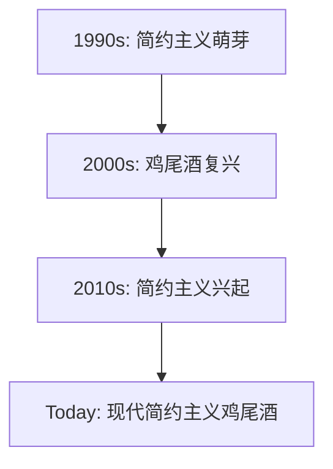

                 


### Step 1: Book Overview and Introduction

# 现代简约主义鸡尾酒：少即是多的调酒哲学

> 关键词：现代简约主义、鸡尾酒、调酒哲学、少即是多

> 摘要：
本文深入探讨了现代简约主义鸡尾酒的概念及其背后的调酒哲学——“少即是多”。通过历史的回顾、核心概念的解释、以及实际操作的指导，本文旨在帮助读者理解和实践这一独特而美妙的调酒风格。

在鸡尾酒的世界里，传统的复杂配方和丰富的味道组合往往让人眼花缭乱。然而，现代简约主义鸡尾酒却以一种截然不同的方式改变了这一切。它强调“少即是多”的哲学，主张通过精选的几款基础材料和精细的调酒技巧，创造出令人难忘的味觉体验。

## 1.1 什么是现代简约主义鸡尾酒

### 1.1.1 历史背景

现代简约主义鸡尾酒文化起源于20世纪90年代。当时，随着人们对于简约生活方式的追求，一种追求简洁、精致、高效的生活态度逐渐兴起。这种态度也渗透到了鸡尾酒的领域，促成了现代简约主义鸡尾酒的出现。

### 1.1.2 关键原则

现代简约主义鸡尾酒的关键原则包括：

1. **精选材料**：使用最优质的基础材料和调味品，以确保每一口都能体现出其独特的风味。
2. **简化配方**：减少配料数量，避免过多的复杂成分，让每一款鸡尾酒都能清晰地传达出其核心风味。
3. **精细技巧**：通过精细的调酒技巧，如搅拌、摇晃、分层等，使鸡尾酒的口感更加和谐、平衡。

### 1.1.3 简单就是美

在简约主义的影响下，人们逐渐意识到，简洁并不等同于单调。相反，通过精简的配方和精准的调酒技巧，可以创造出令人惊叹的味觉体验。这种“少即是多”的哲学，不仅提升了鸡尾酒的艺术性，也让调酒过程变得更加有趣和富有挑战性。

### 1.2 “少即是多”的哲学

### 1.2.1 源起与演变

“少即是多”这一哲学源自于20世纪初的德意志哲学和艺术运动——包豪斯（Bauhaus）。这一哲学强调通过简洁、几何和功能主义来创造美。随着时间的推移，这一哲学逐渐影响了各个领域，包括鸡尾酒制作。

### 1.2.2 对调酒技巧的影响

在现代简约主义鸡尾酒中，“少即是多”的哲学体现为：

1. **减少配料数量**：通过减少配料数量，可以更清晰地表达出每款鸡尾酒的核心风味。
2. **平衡与和谐**：通过精确地调整每种材料的比例，创造出和谐、平衡的口感。

### 1.2.3 味道的平衡

在制作简约主义鸡尾酒时，平衡味道至关重要。这需要调酒师具备高超的技巧和敏锐的味觉。通过不断地实践和调整，调酒师可以创造出既简单又复杂的鸡尾酒，满足不同口味的需求。

### 1.3 小结

现代简约主义鸡尾酒以其简洁、精致和高效的特点，正在逐渐改变传统的调酒文化。通过“少即是多”的哲学，调酒师们能够创造出令人难忘的味觉体验，同时也提升了鸡尾酒的艺术价值。让我们一起来探索这一美妙的世界，感受简约主义带来的独特魅力吧。

### 1.4 Mermaid 流程图：现代简约主义鸡尾酒文化的演变



在这一流程图中，我们可以看到现代简约主义鸡尾酒文化从萌芽到兴起，再到如今成为主流趋势的发展历程。每一个阶段都代表了鸡尾酒文化的一次创新和变革，而“少即是多”的哲学始终贯穿其中，引领着这一潮流的发展。

---

本文是对“现代简约主义鸡尾酒：少即是多的调酒哲学”这一主题的初步探讨。在接下来的章节中，我们将进一步深入探讨简约主义鸡尾酒的核心概念、原理和技巧，帮助读者更好地理解和实践这一独特而美妙的调酒风格。希望读者能从中获得灵感和启示，让我们一起探索现代简约主义鸡尾酒的无限可能吧。

### Step 2: Core Concepts and Architectural Principles

## 2.1 Essential Cocktail Ingredients

在简约主义鸡尾酒的配方中，基础材料的选择至关重要。这些材料不仅要品质上乘，还要能够代表鸡尾酒的核心风味。以下是几种常见的核心材料及其作用：

### 2.1.1 基础酒精

- **伏特加（Vodka）**：伏特加是一种中性酒精，几乎不含味道，常用于调制各种类型的鸡尾酒，因为它不会掩盖其他成分的味道。
- **金酒（Gin）**：金酒以其特有的草本香气著称，非常适合与各种草本和香料结合。
- **龙舌兰酒（Tequila）**：龙舌兰酒具有独特的植物香味，常用于制作具有墨西哥风情的鸡尾酒。

### 2.1.2 调味品

- **苦艾酒（Aperol）**：一种意大利产的橙味苦酒，常用于制作经典的 Negroni 鸡尾酒。
- **薄荷酒（Mint Julep）**：薄荷酒用于制作经典的薄荷马天尼，为鸡尾酒带来清新的薄荷香气。
- **苦艾酒（Absinthe）**：一种具有特殊苦味的酒精，常用于制作具有异国情调的鸡尾酒。

### 2.1.3 自制鸡尾酒调味料

- **柠檬汁（Lemon Juice）**：柠檬汁是制作酸类鸡尾酒的基础，可以提升鸡尾酒的清新感。
- **菠萝汁（Pineapple Juice）**：菠萝汁具有独特的甜酸味道，适合用于制作热带风味的鸡尾酒。

这些基础材料不仅为鸡尾酒提供了风味，还赋予了它们独特的身份和风格。在制作简约主义鸡尾酒时，选择合适的材料至关重要，因为它们将直接影响鸡尾酒的最终口感和品质。

### 2.2 Tools and Equipment

制作简约主义鸡尾酒，不仅需要精选的材料，还需要合适的工具和设备。以下是几种必备的工具和设备，以及它们的使用方法和重要性：

#### 2.2.1 摇酒器和搅拌器

- **摇酒器（Cocktail Shaker）**：摇酒器是最常用的工具之一，用于将鸡尾酒中的成分充分混合。使用时，将冰块和所有成分放入摇酒器中，摇晃几秒钟，使其冷却并均匀混合。
- **搅拌器（Cocktail Stirrer）**：搅拌器主要用于调制含有较少酒精或需要冷却的鸡尾酒。将冰块和成分放入杯中，使用搅拌器轻轻搅拌，使其充分混合。

#### 2.2.2量杯和调酒勺

- **量杯（Jigger）**：量杯用于精确测量液体的体积，确保每一杯鸡尾酒的一致性。标准的量杯有2盎司、1盎司和1/2盎司的标记。
- **调酒勺（Bar Spoon）**：调酒勺用于搅拌和精确测量液体，特别是在制作需要精细调整比例的鸡尾酒时，调酒勺是必不可少的工具。

#### 2.2.3 调酒杯和鸡尾酒杯

- **调酒杯（Cocktail Glass）**：调酒杯通常用于制作和品尝鸡尾酒。这种杯子通常较小，有利于观察鸡尾酒的层次和色彩。
- **鸡尾酒杯（Martini Glass）**：鸡尾酒杯是一种经典的杯子，通常用于制作和品尝具有分层效果的鸡尾酒，如马天尼和曼哈顿。

这些工具和设备对于制作高质量的简约主义鸡尾酒至关重要。它们不仅确保了鸡尾酒的一致性和精确性，还提升了调酒过程的美学体验。

### 2.3 The Art of Simplification

在简约主义鸡尾酒的世界里，简化并非意味着减少风味，而是通过精选的成分和精准的调酒技巧，创造出更加和谐、精致的口感。以下是简化配方、平衡味道以及创造独特鸡尾酒风格的技巧：

#### 2.3.1 减少配料数量

- **精选材料**：在简约主义鸡尾酒中，使用较少的配料并不意味着牺牲风味。相反，通过精选几种优质材料，可以确保每一款鸡尾酒都能清晰地传达出其核心风味。
- **避免冗余**：减少不必要的调味品和添加剂，确保每一款鸡尾酒的成分都是必要的，这有助于提升整体口感。

#### 2.3.2 平衡味道

- **酸与甜**：在鸡尾酒中，酸和甜是两种基本的风味元素。通过精确的比例，可以将酸与甜的味道平衡得恰到好处。
- **苦与醇**：苦味和醇厚的口感也可以通过适当的比例来平衡。例如，在制作曼哈顿时，苦艾酒的苦味与波旁酒的醇厚口感相互补充。

#### 2.3.3 创造独特风格

- **个性化调整**：即使是在简约主义鸡尾酒中，也可以通过个性化调整来创造独特的风味。例如，可以尝试改变某些成分的比例，或添加特殊的调味品，以创造出独一无二的鸡尾酒。
- **季节性食材**：利用季节性食材，如新鲜水果或草药，可以增添鸡尾酒的季节特色，使其更加丰富多样。

通过这些技巧，调酒师可以创作出既简单又复杂的鸡尾酒，满足不同口味和需求的顾客。简约主义鸡尾酒的魅力在于，它不仅提供了美味的风味体验，还赋予了调酒过程一种艺术感和仪式感。

### Pseudo-code for Balancing Flavors

在制作简约主义鸡尾酒时，精确平衡各种风味成分至关重要。以下是一个简化的伪代码示例，用于平衡鸡尾酒中的酸、甜、苦和醇厚口感：

```python
# Pseudo-code for Flavor Balancing in a Cocktail

# 定义参数
base_spirit_volume = 50  # 基础酒精的体积（例如：50毫升）
herbs_and_spices_volume = 20  # 调味品的体积（例如：20毫升）
sweeteners_volume = 10  # 甜味剂的体积（例如：10毫升）
acids_volume = 10  # 酸的体积（例如：10毫升）

# 计算当前风味强度
current_flavor_intensity = calculate_flavor_intensity(base_spirit_volume, herbs_and_spices_volume, sweeteners_volume, acids_volume)

# 定义最大和最小风味强度
MAX_FLAVOR_INTENSITY = 100
MIN_FLAVOR_INTENSITY = 50

# 如果风味强度过高，减少甜味剂的体积
if current_flavor_intensity > MAX_FLAVOR_INTENSITY:
    reduce_sweeteners_volume()

# 如果风味强度过低，增加酸的体积
elif current_flavor_intensity < MIN_FLAVOR_INTENSITY:
    increase_acids_volume()

# 输出平衡后的风味组合
balanced_cocktail = {
    "base_spirit": base_spirit_volume,
    "herbs_and_spices": herbs_and_spices_volume,
    "sweeteners": sweeteners_volume,
    "acids": acids_volume
}

def calculate_flavor_intensity(base_spirit, herbs_and_spices, sweeteners, acids):
    # 假设每种成分对风味强度的贡献是线性的
    flavor_intensity = base_spirit + herbs_and_spices + sweeteners + acids
    return flavor_intensity

def reduce_sweeteners_volume():
    # 实现减少甜味剂体积的算法
    # 这里是一个简单的示例，实际应用中可能需要更复杂的调整
    global sweeteners_volume
    sweeteners_volume -= 1

def increase_acids_volume():
    # 实现增加酸的体积的算法
    # 这里是一个简单的示例，实际应用中可能需要更复杂的调整
    global acids_volume
    acids_volume += 1

# 输出平衡后的鸡尾酒成分
print("Balanced Cocktail Ingredients:")
print(balanced_cocktail)
```

这个伪代码提供了一个框架，用于平衡鸡尾酒中的各种风味成分。通过调整甜味剂和酸的体积，可以实现对风味强度的精确控制。在实际操作中，调酒师可能需要更多的实验和调整来达到最佳风味平衡。

### Conclusion

通过本文的探讨，我们深入了解了现代简约主义鸡尾酒的核心概念和调酒哲学。从历史背景、关键原则到具体操作技巧，我们都进行了详细的阐述。简约主义鸡尾酒的魅力在于其简洁、高效且富有创意的表达方式，它不仅提升了鸡尾酒的艺术价值，也为调酒师提供了无限的创作空间。

在接下来的章节中，我们将进一步探讨简约主义鸡尾酒的数学模型和公式，以及如何通过精确计算和调整来实现完美的风味平衡。同时，我们也将通过具体的案例来展示如何将理论应用到实践中，帮助读者更好地理解和掌握这一独特的调酒风格。

让我们在下一个阶段继续深入探讨，共同探索现代简约主义鸡尾酒的无限魅力。敬请期待！

