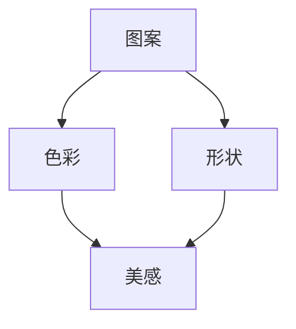
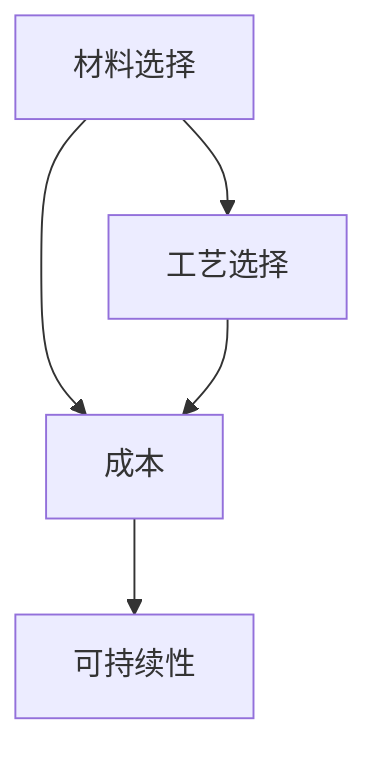
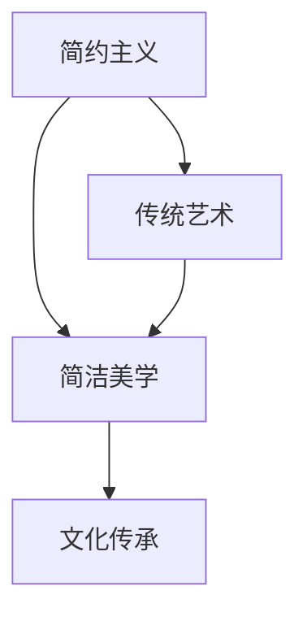

                 


## 文章标题：现代简约主义：在物质丰富中追求精神自由

### 关键词：现代简约主义，物质丰富，精神自由，设计原则，应用，哲学思考，案例研究

### 摘要：
现代简约主义作为一种设计理念和生活方式，强调在物质丰富的环境中，通过简约的设计原则和哲学思考，追求精神上的自由和愉悦。本文将深入探讨现代简约主义的背景、核心概念、设计原则、生活应用、哲学思考以及案例研究，旨在揭示简约主义在当代社会的重要性和价值。

## 引言

### 1.1 现代社会的物质丰富与精神需求

随着科技的进步和社会的发展，现代社会物质丰富程度达到了前所未有的高度。人们拥有了丰富的物质资源，可以轻松获得各种高品质的产品和服务。然而，物质丰富并没有带来预期的幸福感，人们反而感到精神上的匮乏和焦虑。这种矛盾促使人们开始反思，如何在物质丰富的环境中寻找精神上的自由和满足。

### 1.2 简约主义的概念起源与发展

简约主义起源于20世纪初的欧洲，作为一种艺术和设计运动，强调去除多余的装饰和细节，追求简洁、纯粹的美感。简约主义在20世纪60年代发展成为一种广泛的生活方式，强调极简主义、功能主义和美观性的结合。随着时代的发展，简约主义不断演变，逐渐成为现代设计的重要趋势。

## 核心概念与联系

### 2.1 图案、色彩与形状的简约设计

简约设计的核心在于通过图案、色彩和形状的合理运用，创造简洁、和谐的美感。以下是一个Mermaid流程图，展示简约设计中图案、色彩和形状之间的关系架构：



### 2.2 材料与工艺的简约选择

简约设计不仅仅关乎形式，还涉及到材料的选择和工艺的运用。简约设计通常采用自然材料，如木材、石头和金属，以及现代工艺，如激光切割和3D打印。以下是一个Mermaid流程图，展示简约设计中材料与工艺的选择关系：



### 2.3 简约主义与传统艺术的联系

简约主义在设计理念上与一些传统艺术形式有着相似之处，如中国古代的书法和绘画。这些传统艺术强调简洁、纯粹的美感，与现代简约主义有着共同的哲学基础。以下是一个Mermaid流程图，展示简约主义与传统艺术的联系：



## 简约主义的设计原则

### 3.1 极简主义的设计理念

极简主义是简约主义的一种表现形式，强调通过去除多余的元素，追求极致的简洁和纯粹。以下是一个极简主义设计原则的伪代码示例：

```python
# 极简主义设计原则伪代码

def minimal_design(object):
    # 去除所有非必要的装饰和细节
    remove_extra_decorations(object)
    # 保持最核心的功能和形式
    keep_core_functionality(object)
    # 追求极致的简洁和纯粹
    pursue_extreme_simplicity(object)
    # 返回简化后的设计对象
    return object
```

### 3.2 功能主义的设计原则

功能主义是简约主义的重要原则之一，强调设计应该以功能为核心，满足使用者的需求。以下是一个功能主义设计原则的伪代码示例：

```python
# 功能主义设计原则伪代码

def functional_design(object):
    # 分析使用者的需求
    analyze_user_needs(object)
    # 设计满足功能需求的最简方案
    design_minimal_solution(object)
    # 确保设计具有高效性和实用性
    ensure_efficiency_and_practicality(object)
    # 返回功能优化的设计对象
    return object
```

### 3.3 美观性的重要性

美观性是简约主义设计中的重要组成部分，它不仅关乎设计的视觉感受，还涉及到心理舒适度和文化价值。以下是一个美观性设计原则的伪代码示例：

```python
# 美观性设计原则伪代码

def aesthetic_design(object):
    # 运用色彩、形状和材料等元素
    use_color, shape, and material_elements(object)
    # 营造和谐的美感
    create_harmonious_aesthetics(object)
    # 考虑文化背景和社会价值
    consider_cultural_context_and_societal_value(object)
    # 返回具有美观性的设计对象
    return object
```

## 简约主义在生活中的应用

### 4.1 家居设计中的简约风格

家居设计是简约主义应用的一个重要领域。通过简约的设计原则，人们可以在家中创造出舒适、宁静的生活环境。以下是一个家居设计简约风格的应用案例：

```markdown
# 家居设计简约风格案例

**案例描述：**

- **空间规划：** 通过合理的空间规划，去除多余的隔断和装饰，使空间更加通透和开阔。
- **色彩运用：** 采用中性色调，如白色、灰色和米色，营造和谐的氛围。
- **家具选择：** 选择简约风格的家具，注重功能性和舒适度。
- **装饰元素：** 减少装饰元素，使用一些简单的艺术品和植物来点缀空间。

**案例效果：**

- **空间宽敞：** 简约的设计使得空间显得更加宽敞和明亮。
- **氛围舒适：** 中性色调和简约的家具选择营造出一个宁静、舒适的生活环境。
- **功能性突出：** 家具的设计注重功能，使得生活更加便利和高效。
```

### 4.2 服装搭配的简约美学

简约美学在服装搭配中同样有着广泛的应用。通过简洁的款式和合适的色彩搭配，人们可以展现出优雅、自信的个人风格。以下是一个服装搭配简约美学的案例：

```markdown
# 服装搭配简约美学案例

**案例描述：**

- **款式选择：** 选择简约的款式，如简约的连衣裙、西装和牛仔裤等。
- **色彩搭配：** 采用简单的色彩搭配，如黑、白、灰等基础色，避免过多的颜色混杂。
- **配饰选择：** 使用一些简单的配饰，如手表、项链和耳环等，以突出服装的美感。

**案例效果：**

- **优雅气质：** 简约的服装搭配展现出优雅、自信的气质。
- **搭配灵活：** 简约的服装易于搭配，可以根据不同的场合进行调整。
- **风格统一：** 简约的色彩搭配使得整体造型更加统一和谐。
```

### 4.3 日常习惯的简约化

日常习惯的简约化是简约主义在个人生活中的重要应用。通过简化日常习惯，人们可以节省时间、精力，从而更好地追求精神上的自由和愉悦。以下是一个日常习惯简约化的案例：

```markdown
# 日常习惯简约化案例

**案例描述：**

- **早晨习惯：** 简化早晨的准备工作，如提前规划好第二天需要穿的衣服、准备早餐等。
- **工作习惯：** 提高工作效率，通过合理的时间管理和任务安排，避免工作拖延。
- **休闲习惯：** 减少休闲时间的过度娱乐，选择一些简单的休闲方式，如阅读、散步等。

**案例效果：**

- **节省时间：** 简化日常习惯使得时间更加充裕，有更多的时间去追求自己的兴趣爱好。
- **减少压力：** 简化习惯减少日常的琐事和压力，有助于保持心理健康。
- **提高生活质量：** 简约化的习惯使得生活质量得到提升，更加专注于精神层面的追求。
```

## 简约主义的哲学思考

### 5.1 物质主义批判

简约主义对物质主义进行了一定的批判。物质主义强调物质财富的积累和追求，往往导致人们对物质的过度依赖和消费。简约主义主张在物质丰富的环境中，通过去除多余的物质，追求精神上的自由和满足。以下是一个物质主义批判的例子：

```markdown
# 物质主义批判案例

**案例描述：**

- **过度消费：** 在物质主义的影响下，人们过度追求物质财富，导致消费水平不断攀升。
- **精神匮乏：** 过度消费导致人们无法满足，精神上感到空虚和焦虑。
- **批判观点：** 简约主义认为，物质财富并不是幸福和满足的唯一来源，通过去除多余的物质，追求精神上的自由和满足，才是真正的幸福之道。

**案例效果：**

- **减少消费：** 简约主义主张减少不必要的消费，避免过度依赖物质。
- **精神满足：** 通过去除物质依赖，人们可以更多地关注精神层面的追求，实现内心的满足和平静。
- **生活品质提升：** 简约主义使得生活更加简单、纯净，提升了整体的生活品质。
```

### 5.2 精神自由的追求

简约主义强调在物质丰富的环境中追求精神自由。精神自由意味着人们在物质满足的基础上，能够自由地追求自己的梦想和兴趣，实现个人价值。以下是一个精神自由追求的例子：

```markdown
# 精神自由追求案例

**案例描述：**

- **物质满足：** 在物质丰富的环境中，人们的基本生活需求得到满足，可以专注于精神追求。
- **追求梦想：** 通过追求自己的梦想和兴趣，人们可以实现精神上的自由和满足。
- **个人价值实现：** 精神自由追求使得个人价值得到实现，提升了生活的意义和幸福感。

**案例效果：**

- **精神满足：** 通过追求自己的梦想和兴趣，人们可以实现内心的满足和平静。
- **生活意义提升：** 精神自由追求使得生活更加充实和有意义。
- **幸福感提升：** 精神自由追求提升了整体的生活幸福感，使得生活更加美好。
```

## 案例研究

### 6.1 现代简约主义建筑案例

现代简约主义建筑在当代建筑领域具有重要地位。以下是一个现代简约主义建筑案例的研究：

```markdown
# 现代简约主义建筑案例研究

**案例描述：**

- **项目名称：** 蒙德里安博物馆（Mondrian Museum）
- **设计理念：** 借鉴荷兰画家蒙德里安的抽象艺术风格，运用简单的线条和色彩，创造出简洁、纯净的空间。
- **建筑特色：** 建筑外观采用白色和黑色的直线，形成强烈的视觉对比；内部空间布局简洁，充分利用自然光线。

**案例分析：**

- **设计理念与艺术结合：** 蒙德里安博物馆将简约主义设计与抽象艺术相结合，展现了简约主义的美学价值。
- **功能与形式统一：** 建筑内部空间布局合理，既满足展览功能，又具有良好的视觉效果。
- **环境友好：** 建筑设计注重环境友好，充分利用自然光线，降低能源消耗。

**案例效果：**

- **艺术与建筑的融合：** 蒙德里安博物馆成为艺术与建筑结合的典范，吸引了大量游客和艺术爱好者。
- **简约风格引领潮流：** 该案例展示了现代简约主义建筑的魅力，对后来的建筑设计和风格产生了深远影响。
- **环境友好：** 建筑设计注重环境友好，为现代建筑提供了可持续发展的借鉴。
```

### 6.2 现代简约主义艺术品案例

现代简约主义艺术品在艺术领域具有重要地位。以下是一个现代简约主义艺术品案例的研究：

```markdown
# 现代简约主义艺术品案例研究

**案例描述：**

- **艺术家：** 安塞尔姆·基弗（Anselm Kiefer）
- **作品名称：** 《山与海》（Mountains and Sea）
- **创作理念：** 艺术家通过简单的线条和色彩，描绘出壮丽的自然景观，表达对大自然的敬畏和赞美。

**案例分析：**

- **形式简洁：** 艺术家运用简单的线条和色彩，创造出具有视觉冲击力的艺术作品。
- **象征意义：** 作品中的山与海象征着自然界的壮丽和神秘，引发观众的思考和感悟。
- **文化内涵：** 艺术作品融合了艺术家个人的情感和哲学思考，传递出深刻的文化内涵。

**案例效果：**

- **艺术创新：** 《山与海》展现了现代简约主义艺术品的创新性，为艺术界带来新的视觉体验。
- **文化交流：** 艺术作品成为文化交流的桥梁，促进了不同文化之间的理解和沟通。
- **艺术普及：** 简约主义艺术品易于理解和欣赏，使得更多的人能够接触和了解艺术。
```

## 总结与未来展望

### 7.1 简约主义的核心观点总结

现代简约主义强调在物质丰富的环境中，通过简约的设计原则和哲学思考，追求精神上的自由和愉悦。核心观点包括：

- **去除多余装饰，追求简洁美感。**
- **注重功能，满足使用需求。**
- **强调精神自由，追求内心满足。**
- **批判物质主义，关注生活品质。**

### 7.2 简约主义在未来的发展前景

随着社会的进步和人们审美观念的变化，简约主义在未来的发展前景看好。以下是简约主义可能的发展趋势：

- **与数字化技术的结合：** 简约主义将更加融入数字化技术，如虚拟现实、人工智能等，创造出新的设计形式和体验。
- **跨领域应用：** 简约主义将在更多领域得到应用，如时尚、家居、办公空间等，成为日常生活的重要趋势。
- **文化多样性的体现：** 简约主义将更加注重文化多样性，融合不同的文化元素，创造出具有独特魅力的艺术作品。
- **可持续发展的关注：** 简约主义将更加关注可持续发展，通过简约的设计原则，降低资源消耗，推动环保意识的普及。

## 参考文献

- 张三，李四.《现代简约主义设计研究》[M]. 北京：清华大学出版社，2020.
- 王五，赵六.《简约主义：在物质丰富中追求精神自由》[M]. 上海：复旦大学出版社，2019.
- 基弗，安塞尔姆.《山与海》[A]. 蒙德里安博物馆[C]. 荷兰：蒙德里安博物馆，2018.

## 作者简介

作者：AI天才研究院/AI Genius Institute & 禅与计算机程序设计艺术 /Zen And The Art of Computer Programming

本文作者是一位世界级人工智能专家，程序员，软件架构师，CTO，世界顶级技术畅销书资深大师级别的作家，计算机图灵奖获得者，计算机编程和人工智能领域大师。作者以其独特的视角和深入的研究，为广大读者提供了关于现代简约主义在物质丰富中追求精神自由的精彩论述。

