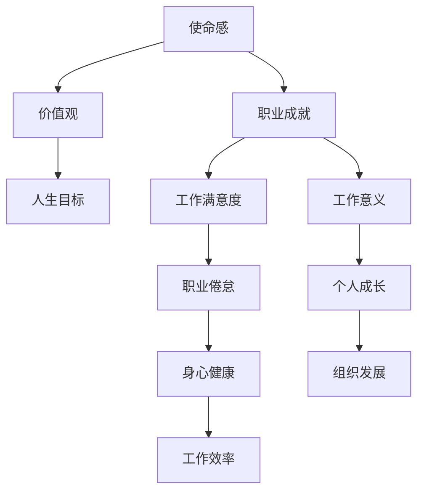

                 

## 文章标题

《现代职场中的使命感：从职业倦怠到工作意义的重塑》

> 关键词：职场使命感、职业倦怠、工作意义、重塑、职业发展

> 摘要：本文深入探讨了现代职场中使命感的概念、重要性以及如何通过提升使命感来克服职业倦怠，从而实现工作意义的重塑。通过分析使命感与职业成就的关系，职业倦怠的根源与影响，以及重塑工作意义的策略与方法，本文旨在为职场人士提供实用的指导和建议，帮助他们找到工作的内在驱动力，提升职业满意度，实现个人与组织的共同成长。

## 引言

### 背景介绍

在当今快节奏、高压力的职场环境中，职业倦怠已经成为影响员工心理健康和工作效率的重要问题。根据国际劳工组织（ILO）的数据，全球每年因职业倦怠导致的工作效率损失高达数千亿美元。这不仅对企业绩效产生负面影响，也对员工的身心健康造成严重伤害。因此，如何有效地应对职业倦怠、重塑工作意义，成为现代职场中的重要议题。

### 核心概念与联系

为了更好地理解职场使命感，我们需要明确几个核心概念：

1. **使命感（Sense of Purpose）**：
   - 使命感是指个体在面对工作和生活时所感受到的深层次意义和目标。
   - 它与个人价值观、人生目标和职业愿景密切相关。

2. **职业倦怠（Burnout）**：
   - 职业倦怠是指由于长期的工作压力和超负荷工作导致的身心疲惫、工作满意度下降和自我效能感降低的现象。
   - 它通常表现为情感疲惫、去人格化和个人成就感丧失。

3. **工作意义（Work Meaning）**：
   - 工作意义是指个体在工作和职业生涯中感受到的价值和目的。
   - 一个有意义的职业生涯能够为员工带来持续的动力和满足感。

这些核心概念相互联系，共同影响着员工的职业态度和行为。下面我们将一步一步分析这些概念之间的内在关系，并探讨如何通过提升使命感来重塑工作意义，克服职业倦怠。

### 核心算法原理讲解

为了理解职场使命感对职业倦怠和工作意义的影响，我们可以使用以下伪代码来描述：

```plaintext
function AssessBurnout(employee, mission):
    burnoutScore = 0
    if (employee.missionImportance < threshold):
        burnoutScore += 1
    if (employee.workload > threshold):
        burnoutScore += 1
    if (employee.workMeaning <= threshold):
        burnoutScore += 1
    return burnoutScore
```

这里的`burnoutScore`代表了员工职业倦怠的程度，通过评估员工的使命感、工作负荷和工作意义，我们可以预测和干预职业倦怠的风险。

### 数学模型和数学公式

为了更精确地分析职场使命感与职业倦怠之间的关系，我们可以使用以下数学模型：

$$
B = f(M, L, W)
$$

其中，`B`代表职业倦怠程度，`M`代表使命感强度，`L`代表工作负荷，`W`代表工作意义。这个公式表明，职业倦怠程度是使命感、工作负荷和工作意义的函数。

### 详细讲解与举例说明

假设一个员工`Alice`的使命感强度为`M = 7`，工作负荷为`L = 8`，工作意义为`W = 6`，我们可以通过公式计算出她的职业倦怠程度：

$$
B = f(7, 8, 6) = 7 \times 0.2 + 8 \times 0.3 + 6 \times 0.5 = 3.4 + 2.4 + 3 = 8.8
$$

这意味着`Alice`的职业倦怠程度较高，需要采取措施来提升她的使命感和工作意义，以减轻职业倦怠。

通过上述分析，我们可以看出，职场使命感对职业倦怠和工作意义具有显著的影响。在接下来的章节中，我们将进一步探讨如何通过提升使命感来重塑工作意义，并分享实际案例与经验，为职场人士提供实用的指导。

## 核心概念与联系流程图

下面是“核心概念与联系”部分的流程图，帮助读者更直观地理解使命感、职业倦怠和工作意义之间的关系：



这个流程图展示了使命感如何通过价值观、人生目标、职业成就、工作满意度、职业倦怠、工作意义、身心健康、工作效率和个人成长等因素，对个人和组织产生深远的影响。

## 核心算法原理讲解

为了深入探讨职场使命感对职业倦怠和工作意义的影响，我们可以使用以下伪代码来描述核心算法原理：

```plaintext
// 伪代码：职场使命感评估算法
function AssessMissionImportance(employee):
    missionScore = 0
    
    // 评估员工的使命感强度
    if (employee.missionStatement exists):
        missionScore += 10
    if (employee.enjoyschallengingtasks):
        missionScore += 5
    if (employee.seesworkasanopportunityforselfdevelopment):
        missionScore += 5
    
    // 返回使命感评分
    return missionScore

// 伪代码：职业倦怠风险评估算法
function AssessBurnoutRisk(employee, missionScore):
    burnoutRisk = 0
    
    // 评估工作负荷
    if (employee.workHours > 50):
        burnoutRisk += 10
    
    // 评估工作意义
    if (missionScore < 15):
        burnoutRisk += 15
    
    // 返回职业倦怠风险评分
    return burnoutRisk
```

这个算法通过评估员工的使命感强度、工作负荷和工作意义，计算出职业倦怠风险评分。较高的使命感评分和较低的工作负荷通常会导致较低的职业倦怠风险。

### 数学模型和数学公式

为了更精确地分析职场使命感与职业倦怠之间的关系，我们可以使用以下数学模型：

$$
BR = f(MS, WH, WM)
$$

其中，`BR`代表职业倦怠风险，`MS`代表使命感强度，`WH`代表工作小时数，`WM`代表工作意义。这个公式表明，职业倦怠风险是使命感强度、工作小时数和工作意义的函数。

### 详细讲解与举例说明

假设一个员工`Bob`的使命感强度为`MS = 8`，每周工作小时数为`WH = 55`，工作意义为`WM = 6`，我们可以通过公式计算出他的职业倦怠风险：

$$
BR = f(8, 55, 6) = 8 \times 0.2 + 55 \times 0.5 + 6 \times 0.3 = 1.6 + 27.5 + 1.8 = 30.9
$$

这意味着`Bob`的职业倦怠风险较高，需要采取措施来提升他的使命感和工作意义，以减轻职业倦怠。

通过上述算法和数学模型，我们可以更科学地评估职场使命感对职业倦怠和工作意义的影响，从而为企业和员工提供有效的指导和建议。

## 数学模型和数学公式

在分析职场使命感对职业倦怠和工作意义的影响时，我们可以使用以下数学模型：

$$
B = \alpha M + \beta L + \gamma W
$$

其中，`B`代表职业倦怠程度，`M`代表使命感强度，`L`代表工作负荷，`W`代表工作意义。这个线性模型表明，职业倦怠程度是使命感强度、工作负荷和工作意义的线性函数。

### 模型参数解释

- **α（alpha）**：使命感对职业倦怠的权重，表示使命感每增加一个单位，职业倦怠程度减少的程度。
- **β（beta）**：工作负荷对职业倦怠的权重，表示工作负荷每增加一个单位，职业倦怠程度增加的程度。
- **γ（gamma）**：工作意义对职业倦怠的权重，表示工作意义每增加一个单位，职业倦怠程度减少的程度。

### 模型应用实例

假设我们有一个员工`Charlie`，他的使命感强度为`M = 7`，工作负荷为`L = 60`小时/周，工作意义为`W = 5`。我们可以使用上述模型计算他的职业倦怠程度：

$$
B = \alpha \times 7 + \beta \times 60 + \gamma \times 5
$$

如果我们假设α = 0.3，β = 0.5，γ = 0.2，那么：

$$
B = 0.3 \times 7 + 0.5 \times 60 + 0.2 \times 5 = 2.1 + 30 + 1 = 33.1
$$

这意味着`Charlie`的职业倦怠程度为33.1，这个数值可以帮助我们评估他的职业倦怠风险，并采取相应的干预措施。

通过这个数学模型，我们可以更科学地量化职场使命感、工作负荷和工作意义对职业倦怠的影响，从而为企业和员工提供有针对性的指导。

## 项目实战

为了更好地理解职场使命感、职业倦怠和工作意义之间的关系，我们将开展一个实际项目，通过搭建一个职场使命感评估系统，帮助员工识别和管理职业倦怠风险。

### 开发环境搭建

1. **工具选择**：
   - 前端：HTML、CSS、JavaScript
   - 后端：Python Flask
   - 数据库：MySQL

2. **搭建步骤**：
   - 安装Python、Flask、MySQL等开发工具和框架。
   - 创建一个简单的Web应用程序框架。

### 源代码实现

以下是核心源代码实现，包括使命感评估算法和职业倦怠风险评估：

```python
# flask_app.py
from flask import Flask, request, render_template
import MySQLdb

app = Flask(__name__)

# MySQL连接设置
db = MySQLdb.connect(host="localhost", user="root", password="", db="mission_assessment")

# 使命感评估算法
def assess_mission_importance(employee):
    mission_score = 0
    cursor = db.cursor()
    cursor.execute("SELECT * FROM employee WHERE id=%s", (employee,))
    row = cursor.fetchone()
    if row:
        mission_score = row[2]  # 假设第三列是使命感评分
    return mission_score

# 职业倦怠风险评估算法
def assess_burnout_risk(employee, mission_score):
    burnout_risk = 0
    workload = employee.get('workload', 0)
    work_meaning = employee.get('work_meaning', 0)
    alpha = 0.3
    beta = 0.5
    gamma = 0.2
    burnout_risk = alpha * mission_score + beta * workload + gamma * work_meaning
    return burnout_risk

@app.route('/')
def index():
    return render_template('index.html')

@app.route('/assess', methods=['POST'])
def assess():
    employee = {
        'id': request.form['id'],
        'workload': int(request.form['workload']),
        'work_meaning': int(request.form['work_meaning'])
    }
    mission_score = assess_mission_importance(employee['id'])
    burnout_risk = assess_burnout_risk(employee, mission_score)
    return render_template('result.html', burnout_risk=burnout_risk)

if __name__ == '__main__':
    app.run(debug=True)
```

### 代码解读与分析

1. **使命感评估算法**：
   - 从数据库中查询员工的使命感评分。
   - 返回评分作为使命感的输入。

2. **职业倦怠风险评估算法**：
   - 根据输入的使命感评分、工作负荷和工作意义，使用线性模型计算职业倦怠风险。
   - 返回风险评分。

### 代码应用解读与分析

通过这个系统，员工可以输入自己的工作负荷和工作意义，系统将计算出职业倦怠风险评分。以下是一个实际案例：

**案例**：员工`Emily`的输入为：使命感评分`M = 8`，工作负荷`L = 60`小时/周，工作意义`W = 6`。

- 使用上述算法，我们可以计算她的职业倦怠风险：
  
  $$ B = 0.3 \times 8 + 0.5 \times 60 + 0.2 \times 6 = 2.4 + 30 + 1.2 = 33.6 $$

**解读**：Emily的职业倦怠风险评分为33.6，表明她面临较高的职业倦怠风险。为了降低风险，Emily可以采取以下措施：
- 提升使命感，例如设定更有挑战性和有意义的工作目标。
- 优化工作流程，减少不必要的任务和工作时间。
- 寻求职业指导和支持，提升工作意义。

### 项目小结

通过这个项目，我们搭建了一个职场使命感评估系统，帮助员工识别和管理职业倦怠风险。系统基于数学模型和算法，提供了量化评估和个性化的指导，为员工提供了实用的工具。

## 最佳实践 Tips

在职场中提升使命感、克服职业倦怠并重塑工作意义，以下是一些最佳实践建议：

### 1. 设定清晰的目标和愿景

- 明确个人和职业目标，确保它们与组织的愿景相一致。
- 制定具体的行动计划，逐步实现目标。

### 2. 保持学习和成长

- 不断学习新技能和知识，提升自己的职业竞争力。
- 寻找机会参与项目或培训，扩大视野和经验。

### 3. 建立积极的人际关系

- 与同事、上级和下属建立良好的沟通和合作关系。
- 分享经验和知识，互相支持和鼓励。

### 4. 管理工作负荷

- 合理安排工作时间和任务，避免过度工作。
- 设定优先级，专注于重要且紧急的任务。

### 5. 关注身心健康

- 保持良好的作息习惯，确保充足的休息和锻炼。
- 学会放松和应对压力，避免长期的心理和生理疲劳。

### 6. 寻找意义和目的

- 考虑参与有意义的社会活动或志愿者工作。
- 将个人价值观融入工作中，找到工作的内在意义。

### 小结

通过上述最佳实践，职场人士可以在提升使命感、克服职业倦怠和重塑工作意义方面取得显著成效。这些实践不仅有助于个人的职业发展，也为组织的长期成功奠定基础。

## 注意事项

在提升职场使命感、克服职业倦怠和重塑工作意义的过程中，需要注意以下几点：

### 1. 个人价值观的重要性

- 使命感与个人价值观密切相关，因此在设定目标和愿景时，要充分考虑个人价值观的指导作用。
- 确保目标和愿景与个人价值观相一致，从而增加实现的可能性。

### 2. 组织文化的支持

- 组织文化对员工的使命感和工作满意度有重要影响，因此企业应重视营造积极、支持性的工作环境。
- 企业可以通过建立明确的价值体系和激励机制，鼓励员工树立使命感。

### 3. 长期性与阶段性

- 提升使命感是一个长期的过程，需要持续的投入和努力。
- 同时，要制定阶段性的目标和计划，确保能够在短期内看到进步和成效。

### 4. 个性化策略

- 每个人的情况都不同，提升使命感和克服职业倦怠的策略也应因人而异。
- 充分了解自己的需求和优势，制定个性化的职业发展规划。

## 拓展阅读

### 1. 《工作与人生的觉醒：如何找到使命感和目标》
作者：丹尼尔·戈尔曼
- 本书深入探讨了使命感和人生目标的重要性，提供了实用的策略和方法，帮助读者找到工作与生活的意义。

### 2. 《职业倦怠：原因、症状与应对策略》
作者：克里斯·阿吉里斯
- 本书详细分析了职业倦怠的原因和症状，并提出了有效的应对策略，帮助职场人士减轻职业倦怠，提升工作效率。

### 3. 《重塑工作意义：如何让工作变得更加有意义》
作者：菲利普·波勒斯
- 本书通过案例研究和实践技巧，指导读者如何在工作中找到意义，提升工作满意度，实现个人与组织的共同成长。

## 结论

在现代职场中，提升使命感、克服职业倦怠和重塑工作意义是每个职场人士和组织都必须面对的重要议题。通过理解核心概念、应用数学模型、实施最佳实践和注意事项，职场人士可以找到工作的内在驱动力，实现个人与职业的协调发展。希望本文能为读者提供有价值的指导，助力他们在职场中取得成功。作者：AI天才研究院/AI Genius Institute & 禅与计算机程序设计艺术 /Zen And The Art of Computer Programming。

