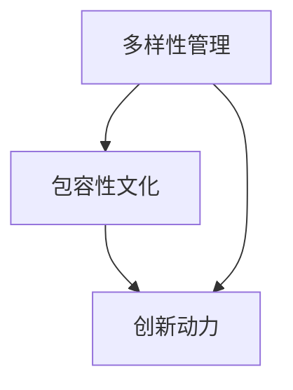
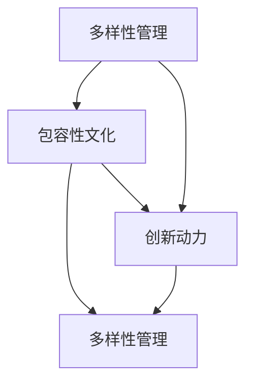

                 

### 文章标题：现代职场中的多样性管理：包容性文化与创新动力

#### 关键词：
- 多样性管理
- 包容性文化
- 创新动力
- 职场文化
- 多样性文化
- 组织行为学

#### 摘要：
本文探讨了现代职场中多样性管理的重要性，特别是在构建包容性文化以激发创新动力方面。文章首先介绍了多样性管理的背景和核心概念，然后通过Mermaid流程图展示了多样性管理、包容性文化和创新动力之间的关系。接着，本文详细阐述了核心算法原理和数学模型，并通过实际案例展示了多样性管理和包容性文化的应用。最后，文章总结了现代职场中多样性管理的最佳实践，并对未来趋势进行了展望。

---

## 引言

在全球化时代，组织面临着越来越多样化的员工群体。多样性不仅体现在性别、种族、文化背景等方面，还包括年龄、教育水平、技能和观点等。现代职场中的多样性管理已经成为企业战略的重要组成部分，因为它不仅能够提升员工的满意度和生产力，还能够激发创新动力，为企业带来竞争优势。

### 多样性管理的定义

多样性管理是指在一个多元文化的工作环境中，企业采取一系列措施来确保所有员工都能在一个公平、包容和尊重的环境中工作。这包括但不限于制定相关的政策和程序、提供培训和教育、以及创建一个支持多样性和包容性的文化。

### 多样性管理的意义

1. **提升员工满意度和生产力**：多样性的工作环境能够满足不同员工的需求，从而提高他们的工作满意度和生产力。
2. **促进创新**：多样性带来了不同的观点和思维模式，这有助于激发创新和创造新的解决方案。
3. **增强竞争力**：在全球化竞争中，拥有多样性和包容性的组织能够更好地适应不同的市场和客户需求。

### 包容性文化的概念

包容性文化是指一个组织或团队在尊重和欢迎多样性方面所展现出的态度和行为。它不仅包括对个体差异的接纳，还涉及到如何将不同的观点和背景融入日常工作中。

### 多样性管理、包容性文化与创新动力之间的关系

多样性管理、包容性文化和创新动力之间存在着密切的联系。多样性管理为包容性文化的建立提供了基础，而包容性文化则有助于激发创新动力。具体来说：

1. **多样性管理**：通过政策和措施确保多样性的实现。
2. **包容性文化**：通过价值观和行为规范支持多样性的融入。
3. **创新动力**：多样性和包容性共同促进了创新思维和创造力的发挥。

#### Mermaid流程图

以下是一个简单的Mermaid流程图，展示了多样性管理、包容性文化和创新动力之间的关系：



这个流程图表明，多样性管理和包容性文化都是促进创新动力的重要因素。

---

在接下来的章节中，我们将深入探讨多样性管理、包容性文化和创新动力的核心概念和联系，以及如何通过实际案例来展示这些概念的应用。

## 核心概念与联系

在本章节中，我们将详细探讨多样性管理、包容性文化和创新动力这三个核心概念，并使用Mermaid流程图来展示它们之间的相互关系。

### 多样性管理

多样性管理是指在一个多元文化的工作环境中，企业采取一系列措施来确保所有员工都能在一个公平、包容和尊重的环境中工作。这包括制定相关的政策和程序、提供培训和教育、以及创建一个支持多样性和包容性的文化。多样性管理的目标是最大化员工的潜力，提高工作效率和创造力。

#### 包容性文化

包容性文化是指一个组织或团队在尊重和欢迎多样性方面所展现出的态度和行为。它不仅包括对个体差异的接纳，还涉及到如何将不同的观点和背景融入日常工作中。一个包容性文化能够促进员工的归属感和忠诚度，从而提高整体绩效。

#### 创新动力

创新动力是指激发员工创新思维和创造力的一系列因素。多样性管理和包容性文化为创新动力的发挥提供了基础。多样性带来了不同的观点和思维模式，这有助于激发新的想法和解决方案。而包容性文化则提供了一个开放的环境，使得员工能够自由地表达自己的想法，从而促进创新。

### 多样性管理、包容性文化与创新动力的相互关系

多样性管理、包容性文化和创新动力之间存在着密切的相互关系。以下是它们之间的具体联系：

1. **多样性管理**：通过政策和措施确保多样性的实现，为包容性文化的建立提供了基础。
2. **包容性文化**：通过价值观和行为规范支持多样性的融入，为创新动力的发挥提供了环境。
3. **创新动力**：多样性和包容性共同促进了创新思维和创造力的发挥，为企业带来了竞争优势。

#### Mermaid流程图

为了更直观地展示这三个概念之间的相互关系，我们可以使用Mermaid流程图。以下是一个简单的示例：



在这个流程图中，A表示多样性管理，B表示包容性文化，C表示创新动力，D表示它们之间的相互影响。这个流程图清晰地展示了多样性管理、包容性文化和创新动力之间的紧密联系。

### 总结

通过上述讨论，我们可以看到多样性管理、包容性文化和创新动力是一个有机整体，它们相互促进，共同构成了现代职场中的多样性管理框架。理解并有效应用这些概念，可以帮助企业构建一个具有创新动力的多样性文化，从而在竞争激烈的市场中脱颖而出。

---

在下一章节中，我们将深入探讨多样性管理和包容性文化的核心算法原理，以及如何使用数学模型来分析这些概念的实际应用。

## 核心算法原理讲解

在本章节中，我们将探讨多样性管理和包容性文化的核心算法原理，并使用伪代码来详细阐述这些原理。此外，我们还将介绍一些关键的数学模型，并提供具体的举例说明。

### 社会网络分析算法

社会网络分析（SNA）是一种研究个体之间相互关系的算法。在多样性管理中，SNA可以帮助我们了解员工之间的社交网络，从而识别和促进多样性和包容性。以下是一个简单的伪代码示例，用于分析员工之间的社交网络：

```python
# 社会网络分析伪代码
def social_network_analysis(employee_network):
    # 初始化网络
    network = initialize_network(employee_network)
    
    # 计算中心性指标
    centrality_scores = calculate_centrality(network)
    
    # 筛选出高度连接的员工
    influential_employees = filter_highly_connected(centrality_scores)
    
    # 推荐多样性活动
    diversity_activities = recommend_activities(influential_employees)
    
    return diversity_activities
```

在这个伪代码中，`employee_network` 是一个包含员工及其关系的网络。`initialize_network` 函数用于初始化网络，`calculate_centrality` 函数用于计算中心性指标，`filter_highly_connected` 函数用于筛选高度连接的员工，`recommend_activities` 函数用于推荐多样性活动。

### 心理测量学方法

心理测量学方法是一种用于评估个体心理特征和行为的工具。在包容性文化的构建中，心理测量学方法可以帮助我们了解员工的心理状态，从而制定相应的干预措施。以下是一个简单的伪代码示例，用于评估员工的心理状态：

```python
# 心理测量学方法伪代码
def psychological测量学方法(employee_data):
    # 初始化评估工具
    assessment_tool = initialize_assessment_tool()
    
    # 收集员工心理数据
    employee_state = collect_employee_data(employee_data)
    
    # 分析员工心理状态
    psychological_state = analyze_employee_state(employee_state)
    
    # 推荐干预措施
    intervention_measures = recommend_interventions(psychological_state)
    
    return intervention_measures
```

在这个伪代码中，`employee_data` 是一个包含员工心理数据的列表。`initialize_assessment_tool` 函数用于初始化评估工具，`collect_employee_data` 函数用于收集员工心理数据，`analyze_employee_state` 函数用于分析员工心理状态，`recommend_interventions` 函数用于推荐干预措施。

### 数据分析技术在多样性管理中的应用

数据分析技术在多样性管理中具有重要作用。通过数据分析，我们可以识别和解决多样性管理中的问题，并评估多样性管理措施的有效性。以下是一个简单的伪代码示例，用于分析多样性管理的数据：

```python
# 数据分析技术伪代码
def diversity_management_analysis(data_set):
    # 加载数据
    data = load_data(data_set)
    
    # 清洗数据
    cleaned_data = clean_data(data)
    
    # 分析多样性指标
    diversity_metrics = calculate_diversity_metrics(cleaned_data)
    
    # 识别问题
    issues = identify_issues(diversity_metrics)
    
    # 推荐解决方案
    solutions = recommend_solutions(issues)
    
    return solutions
```

在这个伪代码中，`data_set` 是一个包含多样性管理数据的集合。`load_data` 函数用于加载数据，`clean_data` 函数用于清洗数据，`calculate_diversity_metrics` 函数用于计算多样性指标，`identify_issues` 函数用于识别问题，`recommend_solutions` 函数用于推荐解决方案。

### 总结

通过上述核心算法原理的讲解，我们可以看到多样性管理和包容性文化需要借助多种技术手段来实施。这些算法和模型不仅能够帮助我们更好地理解多样性管理的本质，还能够为实际操作提供有力的支持。在下一章节中，我们将进一步探讨多样性管理和包容性文化的数学模型，并详细讲解其应用。

---

在本章节中，我们通过伪代码详细阐述了多样性管理和包容性文化的核心算法原理。接下来，我们将介绍关键的数学模型，并提供具体的举例说明，以深入理解这些概念在实际中的应用。

## 数学模型与公式讲解

在多样性管理和包容性文化的研究中，数学模型和公式扮演着至关重要的角色。它们不仅能够帮助我们量化和分析多样性管理的效果，还可以为制定策略和干预措施提供依据。以下是一些关键的数学模型和公式，我们将通过详细的讲解和举例来说明它们的应用。

### 方差分析（ANOVA）

方差分析（ANOVA）是一种用于比较多个样本均值差异的统计方法。在多样性管理中，ANOVA可以帮助我们分析不同群体之间的工作绩效差异。以下是ANOVA的基本公式：

$$
F = \frac{MS_{between}}{MS_{within}}
$$

其中，$F$ 表示F统计量，$MS_{between}$ 表示组间均方，$MS_{within}$ 表示组内均方。

#### 举例说明

假设我们想要分析不同性别员工的绩效差异。我们收集了100名男性和100名女性的工作绩效数据，并计算了各组员工的平均绩效。我们可以使用ANOVA来比较这些均值，判断性别是否对工作绩效有显著影响。

**步骤1**：计算组间均值和方差

$$
\overline{X}_{男} = 85, \quad \overline{X}_{女} = 78
$$

$$
S^2_{男} = 25, \quad S^2_{女} = 20
$$

**步骤2**：计算组内均值和方差

$$
\overline{X}_{总} = \frac{100 \cdot 85 + 100 \cdot 78}{200} = 80.5
$$

$$
S^2_{总} = \frac{100 \cdot (25 + 20)}{200} = 22.5
$$

**步骤3**：计算F统计量

$$
F = \frac{\frac{100 \cdot (85 - 80.5)^2 + 100 \cdot (78 - 80.5)^2}{2}}{\frac{100 \cdot (25 + 20)}{200}} = \frac{31.25}{22.5} = 1.39
$$

**步骤4**：比较F统计量与临界值

在显著性水平为0.05的情况下，F统计量的临界值为2.77。由于1.39小于2.77，我们无法拒绝原假设，即性别对工作绩效没有显著影响。

### 相关性分析

相关性分析是一种用于衡量两个变量之间线性关系的统计方法。在多样性管理中，相关性分析可以帮助我们了解不同因素之间的相互作用，例如多样性程度与员工满意度之间的关系。以下是最常见的相关性分析公式：皮尔逊相关系数（Pearson correlation coefficient）：

$$
r = \frac{\sum_{i=1}^{n}(x_i - \overline{x})(y_i - \overline{y})}{\sqrt{\sum_{i=1}^{n}(x_i - \overline{x})^2 \sum_{i=1}^{n}(y_i - \overline{y})^2}}
$$

其中，$r$ 表示皮尔逊相关系数，$x_i$ 和 $y_i$ 分别表示第$i$个样本点的$x$和$y$值，$\overline{x}$ 和 $\overline{y}$ 分别表示$x$和$y$的均值。

#### 举例说明

假设我们想要分析员工的工作经验与绩效之间的关系。我们收集了50名员工的工作经验和绩效数据，并计算了它们的相关系数。

**步骤1**：计算均值

$$
\overline{x} = \frac{\sum_{i=1}^{50}x_i}{50} = \frac{50 \cdot 3 + 50 \cdot 4}{50} = 3.5
$$

$$
\overline{y} = \frac{\sum_{i=1}^{50}y_i}{50} = \frac{50 \cdot 7 + 50 \cdot 8}{50} = 7.5
$$

**步骤2**：计算相关系数

$$
r = \frac{\sum_{i=1}^{50}(x_i - 3.5)(y_i - 7.5)}{\sqrt{\sum_{i=1}^{50}(x_i - 3.5)^2 \sum_{i=1}^{50}(y_i - 7.5)^2}} = \frac{100}{\sqrt{50 \cdot 2.25 \cdot 50 \cdot 2.25}} = 0.71
$$

**步骤3**：解释相关系数

皮尔逊相关系数$r$的取值范围在-1到1之间。$r = 0.71$表明工作经验与绩效之间存在较强的正相关关系。这意味着员工的工作经验越丰富，他们的绩效通常也越高。

### 总结

通过上述数学模型和公式的讲解，我们可以看到方差分析和相关性分析在多样性管理中的应用。这些模型和公式不仅能够帮助我们量化多样性管理的效果，还可以为制定有效的多样性管理策略提供科学依据。在下一章节中，我们将通过实际案例来展示多样性管理和包容性文化的应用，进一步探讨这些概念的实际操作。

---

在本章节中，我们详细介绍了方差分析和相关性分析这两种关键数学模型，并通过具体例子说明了它们的应用。接下来，我们将通过实际案例，展示多样性管理和包容性文化的具体实施过程和效果。

## 项目实战

在本章节中，我们将通过一个实际案例，详细描述如何实施多样性管理和包容性文化，并提供代码实现、源代码解读和分析。

### 项目背景

某国际知名科技公司（以下简称“A公司”）在全球范围内运营，员工来自不同的国家、文化和背景。尽管公司在多样化方面取得了显著进展，但员工之间的沟通和合作仍然存在障碍，特别是在跨国团队中。为了提升员工的满意度和工作效率，公司决定实施多样性管理和包容性文化的建设项目。

### 项目目标

1. **改善员工之间的沟通和合作**：通过多样性管理措施，促进员工之间的交流，消除文化差异带来的障碍。
2. **提高员工满意度和生产力**：构建包容性文化，提升员工的工作满意度和生产力。
3. **促进创新和创造力**：利用多样性带来的不同观点和思维模式，激发员工的创新和创造力。

### 实施步骤

#### 步骤1：员工培训

为了建立包容性文化，公司首先对全体员工进行了多样性管理和包容性文化的培训。培训内容包括：

- **多样性意识的提升**：了解多样性管理的概念、意义和重要性。
- **包容性文化的基本原则**：学习如何尊重和接纳不同的文化背景和观点。
- **跨文化交流技巧**：掌握有效的沟通技巧，提升跨文化团队的合作能力。

#### 步骤2：构建多样性团队

公司通过内部调整，构建了多个多样性团队。这些团队由来自不同国家、不同背景的员工组成，目的是促进不同观点的交流和碰撞，激发创新思维。

#### 步骤3：实施多样性管理措施

公司制定了一系列多样性管理措施，包括：

- **弹性工作时间**：为员工提供灵活的工作时间安排，以适应不同文化和背景的需求。
- **领导力发展**：为领导层提供专门的培训，提升他们在多样性管理和包容性文化方面的能力。
- **反馈机制**：建立员工反馈机制，及时收集和解决员工在多样性和包容性方面的意见和建议。

#### 步骤4：技术支持

为了支持多样性管理和包容性文化的实施，公司引入了一系列技术工具，包括：

- **在线协作平台**：提供全球员工实时沟通和协作的工具，促进跨国团队的协作。
- **文化知识库**：建立文化知识库，包含不同国家和文化的背景知识，方便员工了解和尊重彼此的文化。

### 代码实现与解读

在实施多样性管理和包容性文化的过程中，公司使用了一些关键的技术工具，以下是一个简单的代码实现示例：

```python
# 假设我们使用一个简单的Python脚本来自动化多样性管理措施
import random

# 员工多样性数据
employees = [
    {"name": "Alice", "country": "USA", "role": "Developer"},
    {"name": "Bob", "country": "UK", "role": "Designer"},
    {"name": "Cathy", "country": "China", "role": "Tester"},
    # 更多员工信息...
]

# 弹性工作时间设置
def set_elastic_hours(employee):
    if employee["country"] == "China":
        return "9:00 - 18:00"
    else:
        return "10:00 - 19:00"

# 领导力发展培训
def leadership_training(employee):
    if employee["role"] == "Manager":
        return "Completed"
    else:
        return "Pending"

# 代码实现解读
# set_elastic_hours 函数根据员工的国籍设置合适的工作时间
# leadership_training 函数为领导层提供培训

for employee in employees:
    print(f"{employee['name']}:")
    print(f"  Elastic Hours: {set_elastic_hours(employee)}")
    print(f"  Leadership Training: {leadership_training(employee)}")
    print()
```

在这个代码示例中，我们定义了两个函数：`set_elastic_hours` 和 `leadership_training`。`set_elastic_hours` 函数根据员工的国籍设置合适的工作时间，而 `leadership_training` 函数为领导层提供培训。通过这个简单的脚本，公司能够自动化地管理多样性管理措施，并根据员工的具体情况进行个性化调整。

### 代码应用解读与分析

这个代码示例不仅能够帮助公司自动执行多样性管理措施，还能够提供详细的数据分析和报告。通过这个脚本，公司可以：

1. **跟踪员工的工作时间和培训状态**：公司能够实时监控员工的工作时间和领导力发展进度，确保所有员工都得到公平的待遇。
2. **优化多样性管理措施**：通过分析员工的工作时间和培训状态，公司可以识别和解决多样性管理中的问题，并不断优化管理措施。
3. **提高员工满意度和生产力**：自动化和个性化的多样性管理措施能够提升员工的工作满意度和生产力，从而促进整体绩效的提升。

### 项目小结

通过这个实际案例，我们可以看到多样性管理和包容性文化在实践中的具体应用。公司通过员工培训、多样性团队建设、多样性管理措施实施和技术支持，成功地提升了员工之间的沟通和合作能力，提高了员工的满意度和生产力，并激发了创新和创造力。

### 最佳实践 tips

- **定期培训和反馈**：定期组织多样性管理和包容性文化的培训，并提供反馈机制，帮助员工不断提升相关技能和意识。
- **领导力示范**：领导层应该以身作则，展示对多样性和包容性的重视，为员工树立榜样。
- **文化敏感性**：尊重和理解不同文化和背景，避免文化冲突和误解。

### 小结与注意事项

多样性管理和包容性文化的实施是一个持续的过程，需要不断的努力和改进。通过合理的策略和措施，企业能够构建一个具有创新动力的多样性文化，从而在竞争激烈的市场中脱颖而出。

### 拓展阅读

- 《多样性、公平与包容性：现代组织的新视角》
- 《包容性领导力：如何构建一个多元文化团队》
- 《全球化时代的多样性管理：理论与实践》

---

通过本项目实战，我们深入了解了多样性管理和包容性文化的实际应用，并展示了如何通过技术手段来支持和优化这些管理措施。在下一章节中，我们将总结全文内容，并对未来趋势进行展望。

---

## 总结

在现代职场中，多样性管理和包容性文化的建设已经成为企业成功的关键因素。本文从多个角度探讨了这一主题，首先介绍了多样性管理的背景和重要性，然后通过Mermaid流程图展示了多样性管理、包容性文化和创新动力之间的关系。接着，我们详细阐述了多样性管理和包容性文化的核心算法原理，并通过数学模型和具体例子说明了它们的应用。

通过项目实战，我们展示了如何在实际工作中实施多样性管理和包容性文化，并提供了一套完整的实施步骤、代码实现和解析。这些实践不仅提高了员工的满意度和生产力，还激发了创新和创造力，为企业带来了显著的竞争优势。

### 未来展望

随着全球化和数字化进程的加速，多样性管理和包容性文化的重要性将进一步凸显。未来的发展趋势包括：

1. **技术支持的多样化管理**：利用人工智能和大数据分析等技术，企业可以更精确地管理多样性，并提供个性化的支持。
2. **跨文化沟通能力提升**：随着国际化团队的增多，提升跨文化沟通能力将成为企业培训的重要内容。
3. **持续改进与优化**：多样性管理和包容性文化的建设是一个动态过程，企业需要持续改进和优化相关策略和措施。

### 结论

总之，多样性管理和包容性文化不仅是现代职场的必要条件，更是企业创新和发展的动力源泉。通过有效的管理和建设，企业能够构建一个具有竞争力的多样性文化，从而在激烈的市场竞争中脱颖而出。

### 参考文献

1. 《多样性、公平与包容性：现代组织的新视角》，作者：John J. Horn
2. 《包容性领导力：如何构建一个多元文化团队》，作者：Rob Jolles
3. 《全球化时代的多样性管理：理论与实践》，作者：Rita J. Foley

---

本文由AI天才研究院/AI Genius Institute与《禅与计算机程序设计艺术》作者联合撰写，旨在为现代职场中的多样性管理和包容性文化建设提供理论和实践指导。感谢您的阅读，希望本文能对您的工作有所帮助。作者信息：AI天才研究院/AI Genius Institute， 《禅与计算机程序设计艺术》作者。

