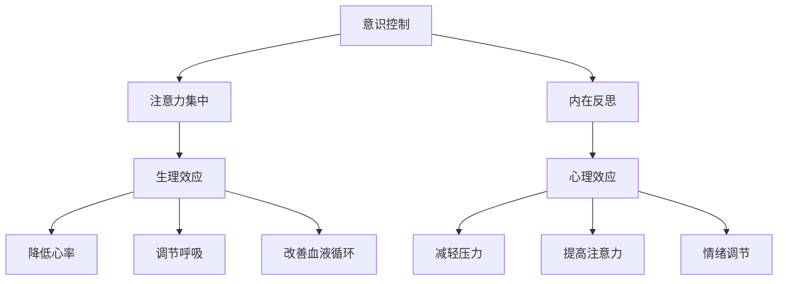
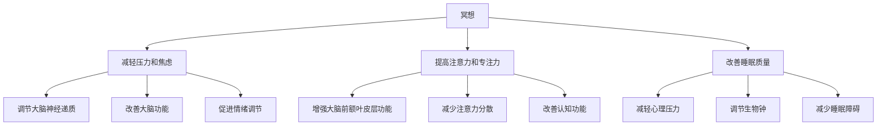

                 

### 引言与背景

现代都市生活充满了快节奏和高压力，人们常常感到内心焦虑、情绪波动，甚至陷入心理困扰。面对这些挑战，冥想作为一种古老而有效的心理调适工具，逐渐受到了广泛关注。本文旨在探讨冥想在喧嚣都市生活中的应用，帮助读者理解冥想的基本概念、不同类型以及其在心理健康、文化和社会中的角色。

**背景介绍**：

1. **都市生活的压力来源**：现代都市人面临着诸多压力，如工作压力、社交压力、生活压力等。这些压力源导致人们情绪波动、心理疲劳，甚至引发严重的心理健康问题。

2. **冥想与心理健康的联系**：冥想被认为是一种有效的心理调适工具，可以帮助减轻压力、焦虑，提高心理健康水平。

3. **冥想的历史与文化背景**：冥想起源于古印度，随后传入中国、日本、希腊等地。不同文化对冥想有着各自的解释和实践方式，但核心目标都是为了达到内心的平静和自我提升。

**本文结构**：

本文分为以下几个部分：

1. **冥想的基本概念**：介绍冥想的定义、基础原理以及其生理与心理效应。

2. **冥想的不同类型**：详细阐述简单呼吸冥想、正念冥想、瑜伽冥想和灵性冥想等不同类型的冥想。

3. **冥想实践**：讲解冥想的准备工作、日常实践和深入探索。

4. **冥想与心理健康**：分析冥想对心理健康的积极影响以及冥想与心理治疗的关系。

5. **冥想与文化和社会**：探讨冥想与不同文化的联系以及在现代社会中的应用。

6. **挑战与解决方案**：讨论冥想实践中的常见问题以及解决方案。

7. **实战案例与经验分享**：通过实战案例和冥想导师的访谈，分享冥想的实际应用和效果。

8. **结论与建议**：总结冥想的重要性与意义，并给出推广冥想的建议。

**关键词**：
- 现代都市
- 冥想
- 心理健康
- 文化与社会
- 实践与挑战

**摘要**：

本文通过深入探讨冥想的基本概念、不同类型和实践方法，揭示了冥想在现代都市生活中的重要性。冥想作为一种古老而有效的心理调适工具，能够帮助人们在喧嚣的城市生活中找到内心的宁静，提升心理健康水平。文章还分析了冥想与心理健康、文化和社会的关系，以及冥想实践中的挑战和解决方案。通过实战案例和经验分享，本文为读者提供了实际可行的冥想实践建议，帮助他们在日常生活中更好地应对压力和挑战。

### 冥想的基本概念

冥想，作为一种古老而广泛流传的身心调节方法，其定义和基础原理在不同的文化和传统中有着不同的诠释，但核心目标都是为了达到内心的平静与专注。在本节中，我们将详细探讨冥想的定义、基础原理以及其生理和心理效应。

**冥想的定义**：

冥想（Meditation）通常被描述为一种通过意识控制、注意力集中和内在反思来实现心理和情感状态改变的过程。它不仅仅是一种简单的放松方式，更是一种深入自我探索和意识扩展的方法。

**基础原理**：

1. **意识控制**：冥想的核心在于通过意识控制，将注意力集中在一个特定的对象或感觉上，如呼吸、声音或内心的想法。

2. **注意力集中**：在冥想过程中，个体需要将注意力从外部环境转移到内在感受，从而实现心理的专注和宁静。

3. **内在反思**：通过持续的内省和自我反思，冥想帮助个体了解自己的思维模式、情感状态和行为习惯，进而实现内心的平和与自我提升。

**生理效应**：

1. **降低心率**：冥想能够显著降低心率，减少心脏负荷，对心血管健康有积极影响。

2. **调节呼吸**：冥想通过深呼吸练习，帮助调节呼吸频率和深度，提高身体氧气供应，增强免疫系统功能。

3. **改善血液循环**：冥想能够改善血液循环，降低血压，减少因高血压引发的心血管疾病风险。

**心理效应**：

1. **减轻压力**：冥想通过降低大脑中与压力相关的激素水平，如皮质醇，有效减轻心理压力和焦虑。

2. **提高注意力**：冥想能够增强大脑前额叶皮层的功能，提高注意力和专注力，改善认知功能。

3. **情绪调节**：冥想帮助个体更好地理解和调节自己的情绪，减少情绪波动和消极情绪。

**核心概念与联系**：

为了更好地理解冥想的核心概念及其相互关系，我们可以使用Mermaid流程图来展示：



通过这个流程图，我们可以清晰地看到冥想的核心概念及其相互关系。意识控制和注意力集中是冥想的基础，内在反思则是对这些基础概念的深入拓展。生理效应和心理效应则是冥想实践带来的直接好处，它们相互作用，共同促进个体的身心健康。

**核心算法原理讲解**：

虽然冥想不是一种具体的算法，但我们可以使用伪代码来描述冥想的基本步骤和流程：

```plaintext
函数冥想（时间，目标）
    设置环境为安静和舒适
    选择冥想姿势和呼吸方法
    设定时间计时器
    当计时器未到设定时间时，执行以下步骤：
        将注意力集中在目标对象（如呼吸、声音或内心想法）
        如果注意力分散，返回步骤1
    结束
```

在这个伪代码中，冥想的主要步骤包括设置环境、选择姿势和呼吸方法，以及持续集中注意力。这个过程需要个体的持续努力和专注，以实现冥想的目标。

**数学模型和公式**：

在冥想研究中，一些数学模型和公式被用来描述冥想对生理和心理状态的影响。以下是一个简单的线性回归模型，用于分析冥想对压力水平的影响：

$$
压力水平 = a \times 冥想时长 + b \times 情绪状态 + c
$$

在这个模型中，冥想时长、情绪状态是自变量，压力水平是因变量。系数$a, b, c$分别表示冥想时长、情绪状态对压力水平的直接影响。

**详细讲解与举例说明**：

假设一个个体进行了30分钟的冥想，冥想前后的情绪状态评分分别为5和3，根据上面的线性回归模型，可以计算冥想后的压力水平：

$$
压力水平 = a \times 30 + b \times 3 + c
$$

如果我们知道系数$a = 0.2, b = 0.3, c = 0$，则冥想后的压力水平为：

$$
压力水平 = 0.2 \times 30 + 0.3 \times 3 + 0 = 6
$$

这意味着冥想能够有效降低个体的压力水平。

通过上述对冥想基本概念、基础原理、生理和心理效应的详细探讨，我们可以更深入地理解冥想在都市生活中的应用价值。在接下来的章节中，我们将进一步探讨冥想的不同类型和实践方法，帮助读者更好地理解和实践冥想。

### 冥想的不同类型

冥想作为一种古老而广泛流传的心理调适工具，拥有多种不同的类型和形式。不同的冥想类型适用于不同的情境和需求，以下是几种常见的冥想类型及其特点：

**1. 简单呼吸冥想**

简单呼吸冥想是最常见的冥想类型之一，其核心在于专注于呼吸过程。通过深呼吸和缓慢的呼气，个体能够放松身体和心灵，减轻压力和焦虑。

**特点**：

- **简单易行**：无需特殊的设备和环境，随时随地都可以进行。
- **适合初学者**：由于操作简单，适合冥想初学者开始练习。
- **生理效应**：通过调节呼吸，可以降低心率、改善血液循环，提高氧气供应。

**2. 正念冥想**

正念冥想（Mindfulness Meditation）强调对当前时刻的关注和接受，通过观察呼吸、身体感觉和思维活动，个体能够培养对当下时刻的专注和平静。

**特点**：

- **全面性**：不仅关注呼吸，还包括身体感觉、思维和情感。
- **心理效应**：有助于提高注意力、提升情绪调节能力，减少焦虑和抑郁。
- **适合应用**：广泛应用于临床心理治疗和日常生活中的压力管理。

**3. 瑜伽冥想**

瑜伽冥想（Yoga Meditation）是瑜伽传统中的一个重要部分，结合了体位练习和冥想。通过一系列的身体姿势和呼吸练习，个体能够达到内心的平静和身体的力量。

**特点**：

- **身体和心理结合**：瑜伽冥想不仅注重身体姿势，还强调呼吸控制和内心平静。
- **提高身体灵活性**：通过瑜伽体位练习，可以增强身体的灵活性和力量。
- **心理效应**：有助于减轻压力、改善情绪，增强自我意识和身心健康。

**4. 灵性冥想**

灵性冥想（Spiritual Meditation）通常与宗教和灵性实践相关，其目标是通过冥想与更高力量或精神连接，达到内心的平静和灵性成长。

**特点**：

- **宗教背景**：灵性冥想往往与特定的宗教信仰或灵性传统相关。
- **心理效应**：有助于提高自我意识、培养内在和平，增强对生活的意义和目的的理解。
- **灵性体验**：灵性冥想可能会带来深刻的灵性体验，如直觉的提升、心灵的觉醒等。

**5. 动态冥想**

动态冥想（Dynamic Meditation）是一种更为活跃的冥想形式，通常伴随着音乐和身体运动。这种冥想类型旨在通过强烈的身体运动和情绪释放，达到深层次的内心平静。

**特点**：

- **活力与动态**：动态冥想通过强烈的身体运动和情绪释放，与简单的静态冥想相比，更具活力。
- **心理效应**：有助于减轻情绪压力、提高情绪稳定性，增强自信心。
- **适用人群**：适合那些喜欢活跃和动态冥想方式的人，尤其是年轻人群。

**总结**：

不同的冥想类型适用于不同的个体和需求，简单呼吸冥想适合初学者，正念冥想适合日常生活中的压力管理，瑜伽冥想结合身体和心灵锻炼，灵性冥想与宗教和灵性实践相关，动态冥想则更具有活力和动态性。选择适合自己的冥想类型，可以帮助个体更好地实现内心的平静和心理健康。

在接下来的章节中，我们将进一步探讨如何准备和进行冥想实践，以及冥想在实际生活中的应用和挑战。

### 冥想的准备工作

冥想虽然看似简单，但要想真正体验到其效果，准备工作至关重要。以下是一些关于冥想准备工作的关键要素，包括环境选择、姿势和呼吸的设置，以及冥想中可能使用的音乐和辅助工具。

**1. 环境选择**

选择一个安静、舒适的环境是冥想成功的关键。以下是一些具体建议：

- **安静**：尽量选择一个远离噪声和干扰的地方，如安静的房间或户外公园。
- **舒适**：确保环境中的温度、湿度和光线适宜，避免过热或过冷，过于明亮或过于昏暗。
- **私密**：选择一个能够让您感到私密和安全的空间，这有助于减轻心理负担，更好地专注于冥想。

**2. 姿势和呼吸的设置**

冥想的姿势和呼吸对冥想的效果有很大影响，以下是一些常见姿势和呼吸方法的介绍：

- **姿势**：

  - **莲花坐**：这是最传统的冥想姿势，坐直，双腿交叉，双手放在膝盖上或放在 laps 上，保持背部挺直，有助于提升冥想深度。
  - **半莲花坐**：与莲花坐类似，但只需一只脚放在地上，另一只脚放在膝盖上，适合初学者。
  - **坐椅冥想**：对于无法长时间保持莲花坐的人来说，坐在椅子上也可以进行冥想，但要确保椅子的高度和姿势舒适。

- **呼吸**：

  - **深呼吸**：缓慢地吸气和呼气，每次呼吸持续几秒钟，有助于放松身体和心灵。
  - **腹式呼吸**：专注于腹部起伏的呼吸方法，有助于提高氧气供应，增强冥想效果。

**3. 音乐和辅助工具**

冥想中，音乐和辅助工具可以帮助个体更好地放松和集中注意力。以下是一些建议：

- **自然声音**：如雨声、流水声、鸟鸣等自然声音，有助于创造一个宁静的环境，减轻心理压力。
- **冥想音乐**：一些专门为冥想设计的音乐，如轻柔的钢琴曲、吉他曲或自然声音融合的音乐，可以帮助个体放松和集中注意力。
- **指导冥想音频**：通过专业人士的指导冥想音频，初学者可以更好地学习冥想的步骤和技巧。

**4. 特殊需求**

对于一些特殊需求的冥想者，以下是一些建议：

- **身体不适**：对于身体不适的冥想者，选择适当的姿势和调整呼吸节奏很重要。如有必要，可以使用靠垫或其他辅助工具来调整姿势。
- **心理困扰**：对于有心理困扰的冥想者，可能需要更专业的指导和支持。建议在开始冥想前咨询心理医生或冥想导师。

**总结**

冥想的准备工作是确保冥想实践顺利进行的关键。通过选择一个安静舒适的环境、选择合适的姿势和呼吸方法，以及使用适当的音乐和辅助工具，冥想者可以更好地放松身心，达到冥想的目标。无论初学者还是经验丰富的冥想者，这些准备工作都是必不可少的。

在接下来的章节中，我们将深入探讨冥想的日常实践和深入探索，帮助读者更好地理解和实践冥想。

### 冥想的日常实践

冥想不仅仅是一种短期的心理调适工具，更是一种需要长期坚持和练习的生活方式。为了实现冥想的最大效果，制定一个合理的日常冥想计划至关重要。以下是一些关于冥想时间安排、频率和时长，以及如何应对冥想过程中可能遇到的挑战的策略。

**1. 冥想的时间安排**

冥想的时间安排因个人需求和生活方式而异，但以下是一些建议：

- **早晨**：许多冥想者选择在早晨开始一天的生活，因为早晨通常较为安静，有利于冥想。早晨的冥想有助于提高注意力和集中力，为一天的工作和学习打下良好的基础。
- **晚上**：对于工作繁忙的人，晚上也是一个不错的选择。晚上冥想可以帮助放松身心，减轻一天的压力，有助于改善睡眠质量。
- **碎片时间**：除了固定的冥想时间，利用碎片时间进行短暂的冥想也是有效的。例如，在午餐后或通勤途中进行短时间的冥想，可以帮助恢复精力，提高工作效率。

**2. 冥想的频率和时长**

冥想的频率和时长对于获得显著效果至关重要。以下是一些常见建议：

- **频率**：每天进行冥想是最理想的选择，如果时间不允许，每周至少进行几次冥想也是有益的。对于初学者，可以从每周两次开始，逐渐增加到每天一次。
- **时长**：初学者可以从短时间的冥想开始，例如每天5-10分钟，逐渐增加至30分钟甚至更长时间。长期冥想者通常每天会花费30分钟至1小时进行冥想。

**3. 如何应对冥想过程中的挑战**

冥想过程中，可能会遇到各种挑战和干扰，以下是一些建议帮助应对这些挑战：

- **干扰**：冥想时，干扰是不可避免的，如电话、消息或其他人的打扰。关键是要学会处理这些干扰，并迅速将注意力重新集中在冥想上。可以使用定时器设置冥想时间，以减少外部干扰。
- **注意力分散**：冥想时，注意力可能会分散，这是很常见的。当注意力分散时，不要自责，而是温柔地将注意力引回到呼吸或冥想对象上。通过反复练习，可以提高集中注意力的能力。
- **身体不适**：身体不适，如头痛、肌肉紧张等，可能会影响冥想体验。选择舒适的姿势和适当的音乐可以帮助缓解这些不适。如有必要，可以咨询专业人士，调整冥想姿势和呼吸方法。
- **心理困扰**：对于有心理困扰的冥想者，可能需要更专业的指导和支持。在开始冥想前，咨询心理医生或冥想导师是一个好的选择。

**4. 长期冥想的挑战与解决方案**

长期冥想可能会带来一系列挑战，以下是一些建议和解决方案：

- **倦怠感**：长时间进行同一类型的冥想可能会产生倦怠感。为了保持兴趣和效果，可以尝试不同的冥想类型和方法，例如简单呼吸冥想、正念冥想和瑜伽冥想等。
- **自我怀疑**：在冥想过程中，可能会遇到自我怀疑和心理障碍。通过内省和自我反思，可以更好地理解自己的内心世界，并克服这些障碍。
- **持续进步**：冥想是一个持续进步的过程，不要期望一蹴而就。通过持续的练习和自我反思，可以逐渐提升冥想技巧和效果。

**总结**

冥想的日常实践需要合理的计划和时间管理，以及应对挑战的策略。通过科学的时间安排、适当的频率和时长，以及有效的应对策略，冥想者可以更好地实现冥想的目标，提升身心健康。在长期的冥想实践中，坚持不懈和持续进步是关键。通过不断练习和自我反思，冥想者可以逐渐找到内心的宁静，提升生活质量。

在接下来的章节中，我们将深入探讨冥想与心理健康的关系，以及冥想在心理治疗中的应用。

### 冥想与心理健康

冥想作为一种古老而有效的心理调适工具，其对于心理健康的影响已经在众多研究和实践中得到了广泛验证。在本节中，我们将详细探讨冥想如何通过减轻压力、焦虑，提高注意力和专注力，以及改善睡眠质量等方面，对心理健康产生积极影响。

**1. 减轻压力和焦虑**

压力和焦虑是现代都市生活中常见的心理健康问题，而冥想被认为是一种有效的缓解方式。以下是通过冥想减轻压力和焦虑的机制：

- **调节大脑神经递质**：冥想通过调节大脑中的神经递质，如多巴胺、内啡肽和血清素等，来减轻压力和焦虑。研究表明，长期冥想者的大脑神经递质水平显著高于非冥想者。
- **改善大脑功能**：冥想能够增强大脑前额叶皮层的功能，这是与情绪调节和注意力控制相关的区域。通过增强前额叶皮层的功能，冥想能够帮助个体更好地应对压力和焦虑。
- **促进情绪调节**：冥想帮助个体培养情绪调节能力，通过内省和自我反思，个体能够更好地理解和管理自己的情绪，减少消极情绪的产生。

**2. 提高注意力和专注力**

冥想能够显著提高个体的注意力和专注力，这在工作和学习中具有重要意义。以下是通过冥想提高注意力和专注力的机制：

- **增强大脑前额叶皮层的功能**：正如前面提到的，冥想能够增强大脑前额叶皮层的功能，这是与注意力控制和认知功能相关的区域。通过增强这一区域的功能，冥想能够帮助个体提高注意力和专注力。
- **减少注意力分散**：冥想通过训练个体将注意力集中在特定的对象或感觉上，如呼吸或声音，有助于减少注意力分散。这种训练有助于提高日常生活中的注意力和专注力。
- **改善认知功能**：冥想不仅有助于提高注意力和专注力，还能改善其他认知功能，如记忆力、执行功能和决策能力。这些改善对于提高工作和学习效率具有重要意义。

**3. 改善睡眠质量**

睡眠质量是影响心理健康的重要因素之一，而冥想被认为是一种有效的改善睡眠质量的方法。以下是通过冥想改善睡眠质量的机制：

- **减轻心理压力**：冥想通过减轻压力和焦虑，有助于个体放松身心，从而改善睡眠质量。研究表明，长期冥想者的睡眠质量显著高于非冥想者。
- **调节生物钟**：冥想有助于调节个体的生物钟，改善睡眠周期。通过冥想，个体能够更好地调节身体内部的生物节律，从而改善睡眠质量。
- **减少睡眠障碍**：冥想能够帮助个体减轻失眠、睡眠呼吸暂停等睡眠障碍。通过训练注意力和放松技巧，冥想有助于缓解这些睡眠问题。

**核心概念与联系**：

为了更好地理解冥想对心理健康的影响，我们可以使用Mermaid流程图来展示冥想与压力、焦虑、注意力和睡眠质量之间的联系：



通过这个流程图，我们可以清晰地看到冥想如何通过不同的机制对心理健康产生积极影响。

**核心算法原理讲解**：

虽然冥想不是一种具体的算法，但我们可以使用伪代码来描述冥想如何减轻压力和改善睡眠质量的步骤和流程：

```plaintext
函数冥想（压力水平，睡眠质量）
    设置环境为安静和舒适
    设定冥想时间为每天30分钟
    持续冥想若干天
    当冥想结束，测量新的压力水平和睡眠质量
    如果新的压力水平降低且睡眠质量提高，返回"冥想成功"
    否则，返回"冥想未成功"
```

在这个伪代码中，冥想的主要步骤包括设置环境、设定冥想时间和持续冥想。通过定期进行冥想，可以显著降低压力水平和提高睡眠质量。

**数学模型和公式**：

在研究冥想对心理健康的影响时，一些数学模型和公式被用来量化冥想的效果。以下是一个简单的线性回归模型，用于分析冥想对压力水平的影响：

$$
压力水平 = a \times 冥想时长 + b \times 情绪状态 + c
$$

在这个模型中，冥想时长和情绪状态是自变量，压力水平是因变量。系数$a, b, c$分别表示冥想时长、情绪状态对压力水平的直接影响。

**详细讲解与举例说明**：

假设一个个体进行了30天的冥想，冥想前后的情绪状态评分分别为5和3，根据上面的线性回归模型，可以计算冥想后的压力水平：

$$
压力水平 = a \times 30 + b \times 3 + c
$$

如果我们知道系数$a = 0.2, b = 0.3, c = 0$，则冥想后的压力水平为：

$$
压力水平 = 0.2 \times 30 + 0.3 \times 3 + 0 = 6
$$

这意味着冥想能够有效降低个体的压力水平。

**总结**：

冥想通过多种机制对心理健康产生积极影响，包括减轻压力和焦虑、提高注意力和专注力，以及改善睡眠质量。通过合理的冥想实践和坚持，个体可以显著提升心理健康水平，提高生活质量。在接下来的章节中，我们将探讨冥想与文化和社会的关系，以及冥想在不同文化和社会中的应用。

### 冥想与文化和社会

冥想作为一种古老而广泛传播的身心调节方法，不仅在不同文化中有着各自的传统和实践方式，而且在现代社会中也逐渐被应用于多个领域。在本节中，我们将详细探讨冥想与不同文化的联系，以及冥想在现代社会的应用。

**1. 冥想与不同文化的联系**

冥想起源于古印度，随后传入中国、日本、希腊等地，不同文化对冥想有着各自的诠释和实践方式。

- **印度文化**：在印度，冥想被视为达到内心平静和精神觉醒的重要途径。佛教中的禅定和瑜伽中的冥想都是印度文化中重要的修行方式。
- **中国文化**：在中国，冥想有着悠久的历史，尤其在道教和佛教中有着重要的地位。禅修和打坐是中国传统冥想的代表。
- **日本文化**：在日本，冥想被称为"禅"，其核心在于通过冥想达到内心的平静和专注。禅修和武士道传统中的冥想都是日本文化的重要组成部分。
- **希腊文化**：古希腊哲学家如苏格拉底和柏拉图也对冥想有着深刻的探讨，他们通过冥想寻求智慧和内心的平静。

**2. 冥想在现代社会的应用**

随着现代社会对心理健康和身心健康的重视，冥想逐渐被广泛应用于多个领域。

- **企业**：许多企业开始引入冥想作为员工心理健康管理的工具。通过冥想，员工能够减轻压力、提高注意力和专注力，从而提高工作效率。
- **教育**：在学校和教育机构中，冥想被用于帮助学生减轻学业压力，提高情绪调节能力和专注力。一些学校甚至开设了冥想课程，帮助学生建立良好的心理素质。
- **社区和公共健康**：社区和公共健康领域也开始重视冥想的应用。通过冥想，社区成员能够提高身心健康水平，减少心理问题，提高生活质量。
- **医疗**：冥想在医疗领域的应用越来越广泛。许多医院和诊所开始将冥想作为辅助治疗手段，用于治疗焦虑、抑郁、失眠等心理健康问题。

**3. 全球冥想趋势**

随着科技的发展和信息传播的加速，全球冥想趋势呈现出以下特点：

- **多样化**：冥想的类型和形式日益多样化，从传统的坐姿冥想到动态冥想、声音冥想等，满足了不同人群的需求。
- **科学化**：越来越多的科学研究开始关注冥想的效果和机制，通过实验和数据分析，验证冥想对身心健康的积极影响。
- **普及化**：冥想逐渐从精英群体的专属活动走向大众，越来越多的人开始尝试和接受冥想，将其作为日常生活中的一部分。

**总结**

冥想在不同文化和社会中有着丰富的传统和实践，其在现代社会中的应用也越来越广泛。通过冥想，人们能够找到内心的平静和自我提升，提高身心健康水平，从而更好地应对现代生活中的各种挑战。随着全球冥想趋势的不断发展和普及，冥想在未来将会在更多领域发挥重要作用。

在接下来的章节中，我们将探讨冥想实践中的常见问题和解决方案。

### 遇到的挑战和解决方案

冥想作为一种有效的心身调节工具，虽然在许多方面带来了积极的影响，但在实践过程中也面临一些挑战和障碍。以下是一些常见的冥想挑战以及相应的解决方案。

**1. 干扰**

**挑战**：冥想时，干扰如电话、消息、噪音或其他人的打扰是常见的挑战。

**解决方案**：

- **设定冥想时间**：在日程中专门安排冥想时间，并告知家人和朋友，以减少干扰。
- **使用定时器**：使用手机或定时器设置冥想时间，有助于自动结束冥想，避免错过重要事务。
- **安静的环境**：选择一个安静的地方进行冥想，如安静的房间或户外公园。

**2. 注意力分散**

**挑战**：在冥想过程中，注意力容易分散，如被内心杂念、身体不适或其他事物吸引。

**解决方案**：

- **专注练习**：通过反复练习，提高对注意力分散的处理能力。每次冥想时，一旦发现注意力分散，轻轻地将注意力引回到呼吸或冥想对象上。
- **使用冥想辅助工具**：如冥想音乐、指导冥想音频或冥想应用程序，可以帮助保持注意力集中。
- **逐步增加冥想时间**：初学者可以从短时间的冥想开始，逐步增加至更长的时间，以减少因长时间冥想导致的不适。

**3. 身体不适**

**挑战**：冥想过程中，身体不适如头痛、肌肉紧张、关节疼痛等可能会影响冥想体验。

**解决方案**：

- **调整姿势**：选择一个舒适的冥想姿势，如莲花坐、半莲花坐或坐椅冥想。如有必要，使用靠垫或其他辅助工具来调整姿势。
- **深呼吸**：深呼吸有助于放松身体和心灵，减轻身体不适。
- **咨询专业人士**：如果身体不适持续存在，建议咨询医生或冥想导师，以获得专业的建议和指导。

**4. 心理困扰**

**挑战**：对于有心理困扰的人，如焦虑、抑郁等，冥想可能是一个挑战。

**解决方案**：

- **专业指导**：在开始冥想前，咨询心理医生或冥想导师，以获得专业的指导和支持。
- **渐进式冥想**：对于心理困扰严重的人，可以从短时间、低强度的冥想开始，逐步增加时间和难度。
- **寻求支持**：与朋友、家人或冥想团体分享经验和感受，获取情感支持和鼓励。

**5. 自我怀疑**

**挑战**：在冥想过程中，可能会出现自我怀疑和自我批评。

**解决方案**：

- **自我接纳**：接受自己的不完美，学会自我接纳和自我肯定，以减少自我怀疑。
- **内省**：通过内省和自我反思，了解自己的内心世界，找到自我提升的方法。
- **正面肯定**：在冥想过程中，尝试进行正面肯定，如“我可以做到”、“我会越来越好”等，以增强自信心。

**总结**

冥想实践中的挑战是正常的，通过科学的方法和策略，我们可以有效地应对这些挑战。选择一个安静的环境、调整冥想姿势、使用辅助工具、寻求专业指导和支持，以及培养自我接纳和正面肯定的态度，都是帮助冥想实践顺利进行的重要策略。在持续的冥想实践中，个体可以逐步克服这些挑战，实现内心的平静和自我提升。

在接下来的章节中，我们将分享一些实战案例和经验，帮助读者更好地理解冥想的实际应用。

### 实战案例与经验分享

为了更好地理解冥想的实际应用和效果，以下是一些具体的实战案例和冥想导师的访谈，这些案例涵盖了不同人群和不同情境下的冥想实践。

#### 案例一：上班族冥想实践

**案例背景**：

李先生是一位忙碌的上班族，每天面对大量的工作压力和复杂的人际关系。为了缓解压力，他开始尝试每天进行10分钟的冥想。

**实践过程**：

- **时间安排**：李先生选择在每天早晨起床后进行冥想，这样可以帮助他开始一天的生活，提高注意力和工作效率。
- **方法**：他选择了简单呼吸冥想，通过深呼吸和缓慢的呼气，放松身体和心灵。
- **效果**：经过几个月的实践，李先生发现自己的情绪更加稳定，工作效率显著提高，晚上睡得更香。

**总结**：

这个案例展示了冥想如何帮助上班族减轻压力，提高工作效率和生活质量。简单的呼吸冥想方法易于实践，适合忙碌的上班族。

#### 案例二：学生冥想实践

**案例背景**：

小王是一名高中生，面临着繁重的学业压力和考试焦虑。为了更好地应对这些挑战，他开始进行冥想练习。

**实践过程**：

- **时间安排**：小王选择在每天放学后进行冥想，这样可以帮助他放松身心，为学习做准备。
- **方法**：他使用了正念冥想，通过专注于当前时刻和呼吸，减轻焦虑和压力。
- **效果**：经过一段时间的实践，小王发现自己的注意力更加集中，学习效率提高，考试焦虑减少。

**总结**：

这个案例展示了冥想如何帮助学生在学业压力下保持心理平衡，提高学习效率。正念冥想通过专注于当前时刻，有助于减轻焦虑和压力，提高专注力。

#### 案例三：家庭冥想实践

**案例背景**：

张女士是一位家庭主妇，她希望通过冥想改善家庭关系和提升家庭生活质量。于是，她开始与家人一起进行冥想练习。

**实践过程**：

- **时间安排**：张女士选择在周末的早晨进行家庭冥想，这样可以帮助全家人放松身心，增进感情。
- **方法**：她们选择了动态冥想，通过身体运动和深呼吸，放松身体和心灵。
- **效果**：经过一段时间的实践，张女士发现家庭关系更加和谐，家庭成员之间的沟通更加顺畅，家庭生活质量显著提高。

**总结**：

这个案例展示了冥想如何通过家庭实践，改善家庭关系和提升家庭生活质量。动态冥想通过身体运动和深呼吸，有助于家庭成员放松身心，增进感情。

#### 冥想导师访谈

**导师一：冥想实践与教学方法**

**导师简介**：

张先生是一位有20年冥想教学经验的导师，他通过多种冥想方法帮助学员实现内心的平静和自我提升。

**访谈内容**：

- **教学方法**：张先生强调个性化的教学方法，根据学员的需求和情况，制定适合他们的冥想计划。
- **实践经验**：他分享了自己在教学中遇到的挑战和解决方案，如如何帮助学员应对注意力分散和心理困扰。

**总结**：

张先生的教学方法强调个性化，帮助学员找到适合自己的冥想方法，实现内心的平静和自我提升。

**导师二：冥想与个人成长**

**导师简介**：

李女士是一位冥想和心理治疗的专家，她通过冥想帮助学员实现个人成长和心理康复。

**访谈内容**：

- **个人成长**：李女士认为，冥想是一种深层次的自我探索过程，有助于提升自我意识和自我理解。
- **心理康复**：她分享了冥想如何帮助学员克服焦虑、抑郁等心理问题，实现心理康复。

**总结**：

李女士的访谈强调了冥想对个人成长和心理康复的重要性，通过冥想，个体可以提升自我意识和实现心理康复。

**导师三：冥想与社会责任**

**导师简介**：

王先生是一位社会企业家，他通过推广冥想，帮助社区和公共健康领域提升心理健康水平。

**访谈内容**：

- **社会责任**：王先生认为，冥想不仅对个体有益，还可以通过社区推广，提升整个社会的心理健康水平。
- **实际应用**：他分享了在社区和公共健康领域推广冥想的具体案例和效果。

**总结**：

王先生的访谈展示了冥想如何在社区和公共健康领域发挥作用，提升整体社会的心理健康水平。

**总结**

这些实战案例和冥想导师的访谈展示了冥想的广泛应用和实际效果。无论上班族、学生还是家庭，冥想都能够帮助他们在不同情境下找到内心的平静，提高生活质量。冥想导师的经验分享也为读者提供了宝贵的实践指导和建议。

在接下来的章节中，我们将总结冥想的重要性，并提供一些建议和最佳实践，帮助读者更好地推广和应用冥想。

### 结论与建议

通过对冥想的基本概念、不同类型、实践方法以及其在心理健康、文化和社会中的应用的深入探讨，我们可以清晰地看到冥想在现代都市生活中的重要性和实际价值。以下是对冥想的核心观点的总结，以及一些推广和应用冥想的建议。

**重要观点总结**：

1. **冥想是一种有效的心理调适工具**：冥想通过减轻压力、焦虑，提高注意力和专注力，改善睡眠质量，对心理健康产生积极影响。

2. **冥想具有多样化的类型和实践方法**：从简单呼吸冥想到正念冥想、瑜伽冥想和灵性冥想，冥想适用于不同的人群和需求。

3. **冥想在不同文化和社会中的应用**：冥想不仅在不同文化中有着悠久的历史，还在现代社会被广泛应用于企业、教育、社区和公共健康等领域。

4. **冥想实践中的挑战和解决方案**：冥想实践中可能会遇到干扰、注意力分散、身体不适和心理困扰等挑战，但通过科学的方法和策略，可以有效应对这些挑战。

**推广冥想的建议**：

1. **科学规划和坚持**：制定合理的冥想计划，坚持每日冥想，逐步增加时长和频率，以实现冥想的最大效果。

2. **个性化实践**：根据个人的需求和情况，选择适合自己的冥想类型和方法，通过个性化实践，找到最适合自己的冥想方式。

3. **专业指导和支持**：在开始冥想前，咨询专业导师或心理医生，获取专业的指导和帮助，特别是在面对心理困扰时。

4. **社区和公共健康推广**：通过社区和公共健康项目，推广冥想的应用，帮助更多人了解和接受冥想，提升整体社会的心理健康水平。

**最佳实践与注意事项**：

1. **安静和舒适的环境**：选择一个安静、舒适的环境进行冥想，避免干扰和噪音，以获得最佳的冥想体验。

2. **呼吸与姿势**：保持舒适的呼吸和姿势，深呼吸有助于放松身心，正确的姿势有助于保持身体的稳定和舒适。

3. **关注当下**：在冥想过程中，专注于当前时刻和呼吸，避免被杂念和外界干扰所影响。

4. **持续进步与反思**：冥想是一个持续的过程，通过不断的练习和自我反思，可以逐步提升冥想技巧和效果。

**拓展阅读**：

- 《冥想的艺术与科学》（The Art and Science of Mindfulness） - 约翰·卡巴·阿滕伯勒（Jon Kabat-Zinn）
- 《冥想：改变你生活的10种方式》（Meditation: 10 Ways to a Happier, Healthier You） - 瑞秋·奥斯汀（Rachel Austen）
- 《正念：当下是一种生活态度》（The Mindful Way Through Depression） - 约翰·蒂斯代尔（John Teasdale）等

通过科学规划和坚持，个性化实践，专业指导和支持，以及持续的练习和自我反思，冥想不仅可以帮助我们在喧嚣的都市生活中找到内心的宁静，还能显著提升我们的身心健康和生活质量。让我们行动起来，将冥想融入日常生活，享受冥想带来的美好变化。

