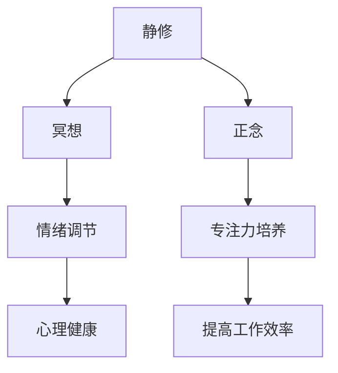

                 

## 文章标题

# 现代静修retreat：在繁忙生活中寻找内在平静

> 关键词：静修、冥想、内在平静、心理健康、生活方式

在当今快节奏的社会中，寻找内心的平静成为许多人的追求。现代静修retreat作为一种独特的放松方式，可以帮助我们从繁忙的生活中抽离，找到内心的宁静。本文将带领读者深入了解静修的概念、重要性以及实践方法，探讨静修对身心健康的益处，并分享一些实际案例和经验。

## 摘要

本文将围绕现代静修retreat的主题，分为以下几个部分进行详细阐述：

1. **静修概述**：介绍静修的定义、历史和重要性。
2. **心理益处**：探讨冥想、正念等静修方式对情绪调节和心理健康的影响。
3. **生理益处**：分析静修对神经系统、免疫系统和内分泌系统的好处。
4. **准备与实践**：讲解如何准备和进行静修，包括环境、身体和心理的准备。
5. **特殊情况处理**：针对不同环境和生活状况下的静修方法进行探讨。
6. **深化与持续**：分享如何将静修融入日常生活，实现长期持续的内在平静。

通过本文的阅读，读者将能够全面了解静修的价值和意义，掌握静修的基本方法，并在实际生活中运用，收获内心的宁静和健康。

## 静修概述

### 定义与历史

静修，又称静坐、冥想或内观，是一种通过调整心态、专注呼吸和身体放松来达到内心平静的修行方式。静修的历史可以追溯到古代印度、中国和埃及等文明，其目的是帮助人们达到精神上的觉醒和内在的和谐。在现代社会，静修已经发展成为一种广泛接受的心理健康促进方法。

### 重要性

静修在现代生活中的重要性不言而喻。首先，它可以帮助我们缓解压力和焦虑，提高情绪调节能力。其次，静修有助于提升专注力和记忆力，增强工作效率。此外，静修还可以改善睡眠质量，增强免疫力，促进身体健康。因此，越来越多的人开始将静修纳入日常生活，以追求身心健康和幸福感。

### 与现代生活的联系

现代人的生活节奏快，工作压力大，常常处于焦虑和紧张的状态。静修提供了一种有效的应对方式，帮助我们从繁忙的生活中抽离，重新找到内心的平衡。通过静修，我们不仅可以缓解压力，还可以培养积极的心态，提高生活质量。

## 核心概念与联系

为了更好地理解静修的核心概念，我们可以通过一个Mermaid流程图来展示它们之间的关系。



在这个流程图中，静修是核心，它涵盖了冥想和正念这两个主要方法。冥想可以帮助我们调节情绪，正念则培养专注力。这些方法共同作用于心理健康，最终提高工作效率和生活质量。

### 冥想与情绪调节

冥想是静修中最常见的方法之一，它通过专注于呼吸、身体感觉或特定物体来达到内心的平静。研究表明，冥想可以降低焦虑、抑郁等负面情绪，提高情绪调节能力。

伪代码示例：

```plaintext
function 冥想（时间）{
    设置专注对象（呼吸、身体感觉或特定物体）
    开始计时（时间）
    while（时间 > 0）{
        专注于专注对象
        深呼吸
        放松身体
        记录感受和情绪变化
        减少计时（1秒）
    }
    结束冥想
}
```

### 正念练习：专注力的培养

正念练习强调活在当下，通过全神贯注地体验每一个瞬间来提高专注力。正念练习可以帮助我们在日常生活中更好地处理压力和任务，提高工作效率。

伪代码示例：

```plaintext
function 正念练习（任务）{
    设置专注对象（任务或当前活动）
    开始计时（任务所需时间）
    while（时间 > 0）{
        专注于专注对象
        避免分心
        记录感受和情绪变化
        减少计时（1秒）
    }
    完成任务
}
```

### 静修与心理健康

静修不仅有助于情绪调节和专注力的培养，还可以直接作用于心理健康。研究表明，定期进行静修可以降低抑郁、焦虑等心理问题的发生概率，提高生活满意度。

### 生理益处

静修对生理健康同样有着显著的益处。首先，静修可以改善神经系统功能，降低压力反应，提高免疫系统功能。其次，静修有助于调节内分泌系统，改善睡眠质量，增强身体的抗病能力。

#### 静修与神经系统

静修有助于降低大脑中的压力激素水平，如皮质醇，从而改善神经系统功能。具体来说，静修可以：

- 降低焦虑和抑郁症状
- 提高情绪调节能力
- 提高专注力和记忆力

#### 静修与免疫系统

静修可以增强免疫系统功能，提高身体对疾病的抵抗力。研究表明，定期进行静修可以：

- 增强免疫细胞活性
- 提高抗病能力
- 减少感染风险

#### 静修与内分泌系统

静修有助于调节内分泌系统，改善激素水平，从而提高整体健康。具体来说，静修可以：

- 改善睡眠质量
- 调节血糖水平
- 减轻炎症反应

### 静修的准备

#### 环境准备

选择一个安静、舒适的环境进行静修非常重要。理想的静修环境应具备以下条件：

- 安静：避免噪音和其他干扰
- 舒适：确保舒适的温度和光线
- 私密：提供一个不受打扰的空间

#### 身体状态的调整

在进行静修前，确保身体处于良好的状态。以下是一些准备工作：

- 保持适当的饮食习惯
- 确保充足的睡眠
- 进行适度的身体活动

#### 心理状态的准备

心理准备同样重要。以下是一些方法来调整心理状态：

- 设定静修目标：明确自己希望通过静修实现的目标，如减轻压力、提高专注力等。
- 放松心态：不要对静修抱有过高的期望，而是将其视为一种放松和探索的过程。
- 专注练习：在静修前进行一些专注练习，如深呼吸、正念散步等，以帮助身体和心灵进入放松状态。

### 日常静修实践

#### 简单冥想技巧

冥想是静修的核心，以下是一些简单的冥想技巧：

1. **呼吸冥想**：专注于呼吸，感受气息进出身体的感觉。
2. **身体扫描**：从头到脚逐个扫描身体，放松每一个部位。
3. **正念行走**：在行走时专注于脚步的感觉，体验每一个步伐。

#### 正念步行

正念步行是一种通过专注于当下步态和感觉来达到内心平静的方法。以下是一些建议：

1. **选择合适的路线**：选择一个安静、自然环境优美的路线。
2. **慢步**：放慢步伐，感受每一步的细节。
3. **专注于感觉**：专注于脚底的触感、空气的流动等。

#### 静坐与瑜伽

静坐和瑜伽是静修的常见形式。以下是一些建议：

1. **静坐**：选择一个舒适的姿势，如莲花座、半莲花座等，保持姿势稳定。
2. **瑜伽**：通过一系列瑜伽动作，如深呼吸、前弯、后弯等，放松身体和心灵。

### 特殊情况处理

#### 城市生活的静修

在城市中寻找宁静的地方进行静修可能更具挑战性。以下是一些建议：

1. **室内静修**：在家中设立一个静修区域，保持安静和舒适。
2. **白噪音**：使用白噪音机或应用来减少外部干扰。
3. **在线课程**：参加在线冥想和静修课程，获取专业指导。

#### 长期静修的挑战

长期静修可能会遇到一些挑战，如孤独、疲惫等。以下是一些建议：

1. **设定明确的目标**：明确自己希望通过长期静修实现的目标，保持动力。
2. **与导师交流**：定期与导师交流，获取指导和支持。
3. **合理安排时间**：在静修期间合理安排时间，确保休息和活动之间的平衡。

### 静修中的障碍与应对

#### 常见障碍

1. **分心**：在静修过程中，我们可能会被外界干扰或内心杂念所困扰。
2. **疲劳**：长时间静修可能会导致身体和心灵的疲劳。
3. **缺乏动力**：有时我们可能会对静修失去兴趣或动力。

#### 应对策略

1. **分心**：采用正念练习，专注于呼吸和当下感觉，逐渐减少分心的机会。
2. **疲劳**：合理安排静修时间，确保休息和活动之间的平衡，适当调整静修强度。
3. **缺乏动力**：设定明确的目标和奖励机制，保持对静修的热情和动力。

### 静修的持续与深化

#### 静修日记的维护

记录静修日记可以帮助我们回顾和总结静修过程中的体验和收获。以下是一些建议：

1. **定期回顾**：每周或每月回顾静修日记，总结经验和教训。
2. **记录感受**：详细记录静修过程中的感受、情绪变化和身体反应。
3. **设定目标**：根据日记回顾，设定新的静修目标和计划。

#### 静修社群的参与

参与静修社群可以提供支持和鼓励，同时也可以从其他人的经验中获得启示。以下是一些建议：

1. **线上社群**：参加线上冥想和静修社群，分享经验和心得。
2. **线下活动**：参加线下静修工作坊或活动，与其他静修者交流。
3. **导师指导**：寻求专业导师的指导，获得更深入的静修体验。

#### 静修与生活平衡

将静修融入日常生活是实现长期内在平静的关键。以下是一些建议：

1. **日常实践**：将静修技巧融入日常生活中的每一刻，如正念用餐、正念行走等。
2. **时间管理**：合理安排时间，确保静修与其他生活事务之间的平衡。
3. **持续学习**：不断学习和探索新的静修技巧和方法，深化静修体验。

## 结论

静修作为一种独特的放松方式，在繁忙的现代生活中发挥着重要作用。通过冥想、正念等静修方法，我们可以找到内心的平静，提高心理健康，促进生理健康。本文详细介绍了静修的定义、重要性、心理和生理益处，以及实践方法和特殊情况处理。希望读者能够通过本文的阅读，了解静修的价值，并在实际生活中实践，收获内心的宁静和健康。

## 作者信息

作者：AI天才研究院/AI Genius Institute & 禅与计算机程序设计艺术 /Zen And The Art of Computer Programming

### 静修的定义与历史

静修，也称为冥想或内观，是一种通过调整心态、专注呼吸和身体放松来达到内心平静的修行方式。它不仅存在于东方文化中，如印度、中国和日本，也在西方世界得到了广泛的认可和应用。在古代文明中，静修被视为一种精神修炼和心灵净化的方法，用以达到精神上的觉醒和内在的和谐。

#### 印度传统中的静修

在印度，静修有着悠久的历史，可追溯至公元前5000年。当时的智者们通过冥想和内观来寻求宇宙的真理和生命的意义。乔达摩·悉达多（佛陀）通过长时间的冥想最终达到了涅槃的境界，成为后人追求的榜样。瑜伽作为一种结合了身体练习和呼吸控制的静修方式，也在印度得到了广泛的传播和应用。

#### 中国传统中的静修

在中国，静修有着深厚的文化底蕴，尤其是道家和佛家的修行实践。道家强调通过静坐、呼吸调整和内观来达到身心合一的状态。而佛教中的禅修，尤其是坐禅，被视为修行的重要途径，通过冥想和正念来消除杂念，达到心灵的宁静。古代中国的文人墨客也常常通过静修来提升精神境界，追求内心的平和。

#### 西方文化中的静修

在西方，静修的概念在20世纪初开始兴起，特别是在心理学和精神医学领域。威廉·詹姆斯和威廉·亨利·布拉瓦茨基等心理学家和哲学家对冥想和静修进行了深入研究，将其视为一种心理健康促进的方法。随着现代医学的发展，科学研究开始证明冥想对身心健康的积极影响，静修逐渐成为西方世界的一种流行生活方式。

#### 静修在现代社会的意义

在现代快节奏的生活中，人们面临着前所未有的压力和挑战。静修作为一种缓解压力、提高心理健康和促进整体福祉的方法，显得尤为重要。通过静修，我们可以：

1. **降低压力**：静修有助于减少体内的压力激素，如皮质醇，从而减轻压力和焦虑。
2. **提升心理健康**：定期的静修练习可以提高情绪调节能力，减少抑郁和焦虑的发生。
3. **增强专注力**：静修有助于提高专注力和记忆力，从而提高工作和学习效率。
4. **改善身体健康**：静修可以增强免疫系统功能，改善睡眠质量，提高整体健康水平。

### 静修的重要性

静修作为一种心理和生理的调节方法，具有多方面的益处，对现代社会中的个人和社会生活都具有重要影响。

#### 心理益处

1. **情绪调节**：静修可以帮助人们降低焦虑和抑郁水平，提高情绪稳定性。通过专注于呼吸和身体感觉，个体可以更好地掌握情绪，减少负面情绪的干扰。
   
2. **专注力提升**：静修练习，如冥想，有助于提高个体的专注力和注意力，减少分心现象。这不仅能提高日常生活中的效率，也有助于提高工作和学习的表现。

3. **心理韧性增强**：静修可以提高个体的心理韧性，帮助人们更好地应对生活中的挑战和压力。通过培养内心的平静和专注，个体可以更加从容地面对困难和挫折。

4. **情绪智力发展**：静修有助于个体更好地理解和管理自己的情绪，提高情绪智力。这不仅可以改善人际关系，还能提高沟通能力和团队合作效果。

#### 生理益处

1. **神经系统健康**：静修可以改善神经系统的功能，降低压力反应，提高大脑的可塑性。定期的静修练习有助于减轻神经紧张，提高神经传导效率。

2. **免疫系统增强**：静修有助于增强免疫系统功能，提高机体对抗疾病的能力。研究表明，定期的冥想练习可以增强免疫细胞的活性，减少感染的风险。

3. **内分泌系统调节**：静修可以调节内分泌系统，改善激素水平。这有助于改善睡眠质量，调节血糖水平，减轻炎症反应。

4. **身体健康**：静修可以降低血压和心率，改善心血管健康。通过减轻身体紧张和压力，静修有助于降低慢性疾病的风险，如心脏病和糖尿病。

#### 社会影响

1. **社会和谐**：静修有助于培养个体的内在平和，减少社会冲突。通过提高个体的情绪调节能力和心理韧性，社会整体的冲突和矛盾可以减少，社会和谐得以提升。

2. **心理健康服务**：静修作为一种有效的心理健康促进方法，可以为心理健康服务提供新的思路和方法。通过推广静修，可以减轻心理健康服务的压力，提高服务效果。

3. **工作效率提升**：静修可以提高个体的专注力和工作效率，这对于企业和组织来说具有显著的经济效益。通过培养员工的静修习惯，企业可以提高整体的工作效率和生产力。

### 与现代生活的联系

在现代快节奏的生活中，人们常常感到压力重重，身心疲惫。静修作为一种放松和减压的方式，与现代社会的生活紧密相连。

#### 减缓压力

静修可以帮助人们从日常繁忙的生活中抽离出来，专注于当下的呼吸和身体感觉，从而减缓压力和焦虑。通过定期的冥想练习，个体可以学会更好地管理自己的情绪，减少负面情绪的干扰。

#### 增强心理健康

静修不仅有助于缓解压力，还可以提高心理健康水平。通过培养专注力和情绪调节能力，个体可以更加从容地应对生活中的挑战和困难，提高生活满意度和幸福感。

#### 提高工作效率

静修可以显著提高个体的专注力和工作效率。通过减少分心和焦虑，个体可以更加集中精力完成任务，提高工作质量和效率。此外，静修还有助于提高记忆力，从而增强学习和创新能力。

#### 促进身体健康

静修对身体健康也有诸多益处。通过降低压力和焦虑，静修可以改善心血管健康，降低慢性疾病的风险。同时，静修还可以增强免疫系统功能，提高机体的抗病能力。

#### 社会效益

静修不仅对个人有益，也对社会有着积极的影响。通过培养个体的内在平和和情绪稳定性，社会整体的冲突和矛盾可以减少，社会和谐得以提升。此外，静修还可以作为一种心理健康服务手段，为心理健康领域提供新的解决方案。

### 核心概念与联系

为了更好地理解静修的核心概念，我们可以通过一个Mermaid流程图来展示它们之间的关系。


在这个流程图中，静修是核心，它涵盖了冥想和正念这两个主要方法。冥想可以帮助我们调节情绪，正念则培养专注力。这些方法共同作用于心理健康，最终提高工作效率和生活质量。

#### 冥想与情绪调节

冥想是一种通过专注于呼吸、身体感觉或特定物体来达到内心平静的修行方式。它通过减少思维杂念和情感波动，帮助我们更好地管理情绪。

- **情绪调节原理**：冥想可以通过以下几个步骤来调节情绪：

  1. **呼吸调整**：通过深呼吸，我们能够放松身体，降低心率，从而减少焦虑和压力。
  2. **专注练习**：将注意力集中在呼吸或身体感觉上，有助于减少思维杂念，降低情感波动。
  3. **放松身心**：在冥想过程中，身体和心灵逐渐放松，情绪得到稳定。

- **情绪调节效果**：定期的冥想练习有助于：

  1. **降低焦虑和抑郁**：研究表明，冥想可以显著降低焦虑和抑郁水平，提高情绪稳定性。
  2. **缓解压力**：通过放松身心，冥想有助于缓解日常生活中的压力和紧张情绪。
  3. **提高情绪调节能力**：冥想可以帮助个体更好地掌握自己的情绪，减少负面情绪对生活的影响。

#### 正念练习：专注力的培养

正念练习，也称为正念冥想，是一种专注于当下的修行方式。它强调全身心地投入到当前的活动或感受中，而不是被思维杂念所干扰。

- **专注力培养原理**：正念练习通过以下几个步骤来培养专注力：

  1. **专注当下**：将注意力集中在当前的活动或感受上，避免被杂念所干扰。
  2. **呼吸练习**：通过深呼吸和专注呼吸的感觉，放松身心，提高专注力。
  3. **反复练习**：通过反复练习，逐渐提高专注力，减少分心现象。

- **专注力培养效果**：定期的正念练习有助于：

  1. **提高注意力**：正念练习可以显著提高个体的注意力，减少分心现象，提高工作效率。
  2. **改善心理健康**：专注力的提高有助于减少焦虑和抑郁，提高心理健康水平。
  3. **提高学习效果**：正念练习有助于提高学习时的专注力，提高学习效果和记忆力。

#### 静修与心理健康

静修不仅有助于情绪调节和专注力的培养，还对心理健康有着深远的影响。通过定期的冥想和正念练习，个体可以在以下几个方面收获显著的好处：

- **情绪稳定性**：静修可以帮助个体更好地管理情绪，减少焦虑和抑郁的发生。通过专注于呼吸和身体感觉，个体可以逐渐学会如何放松身心，从而更好地应对压力和挑战。

- **心理韧性**：静修可以提高个体的心理韧性，帮助个体更好地应对生活中的挫折和困难。通过培养内心的平静和专注力，个体可以更加从容地面对挑战，增强心理弹性。

- **心理健康**：静修有助于改善心理健康，减少心理问题的发生。通过减少压力和焦虑，静修可以提高个体的生活满意度和幸福感，促进心理健康的发展。

- **睡眠质量**：静修可以显著改善睡眠质量，减少失眠和焦虑。通过放松身心，个体可以更容易地入睡，保持良好的睡眠状态，从而提高整体健康状况。

#### 提高工作效率

静修不仅对心理健康有着积极影响，还可以显著提高工作效率。通过以下方式，静修有助于提升工作效率：

- **专注力提升**：静修可以显著提高个体的专注力，减少分心现象。这有助于个体在工作和学习时更加集中注意力，提高工作效率和准确性。

- **情绪调节**：静修有助于减少焦虑和压力，提高情绪稳定性。这使得个体在工作和学习中能够更加平和、冷静地应对各种挑战，提高工作效果。

- **心理健康提升**：静修可以提高个体的心理健康水平，减少心理问题的发生。这有助于个体更好地处理工作和生活中的压力，提高工作满意度和幸福感。

### 静修的生理益处

静修不仅对心理健康有显著益处，还对生理健康有着积极的影响。通过调整心态、专注呼吸和身体放松，静修能够改善多个生理系统的功能，提升整体健康水平。

#### 静修与神经系统

静修对神经系统有深远的影响，特别是在降低压力反应和改善神经系统功能方面。以下是静修对神经系统的几个关键益处：

1. **降低压力反应**：静修可以帮助个体减少体内的压力激素水平，如皮质醇。这有助于减轻压力和焦虑，改善神经系统功能。

2. **提高神经传导效率**：定期的静修练习可以提高神经传导效率，使神经系统更加协调和有效。这有助于提高思维敏捷性和反应速度。

3. **增强心理韧性**：静修可以提高个体的心理韧性，帮助个体更好地应对生活中的挑战和压力。通过培养内心的平静和专注力，个体可以更加从容地面对挫折，增强神经系统的稳定性。

#### 静修与免疫系统

静修对免疫系统有着显著的增强作用。以下是一些静修对免疫系统的益处：

1. **增强免疫细胞活性**：研究表明，定期进行静修可以增强免疫细胞的活性，提高机体的抗病能力。这有助于降低感染的风险，提高整体健康水平。

2. **减少炎症反应**：静修可以减少体内的炎症反应，降低慢性疾病的风险。通过调节免疫系统的功能，静修有助于改善身体的炎症状态，提高免疫系统的适应性。

3. **提高抗病能力**：静修有助于增强机体的抗病能力，减少慢性疾病的发生。通过改善免疫细胞的功能和减少炎症反应，静修可以显著降低慢性疾病的风险。

#### 静修与内分泌系统

静修对内分泌系统也有显著的影响，特别是在调节激素水平和改善睡眠质量方面。以下是静修对内分泌系统的几个关键益处：

1. **调节激素水平**：静修可以改善内分泌系统的功能，调节激素水平。这有助于改善睡眠质量，降低焦虑和抑郁水平。

2. **改善睡眠质量**：静修有助于提高睡眠质量，减少失眠和睡眠障碍。通过放松身心，静修可以使人更容易入睡，保持良好的睡眠状态，从而提高整体健康水平。

3. **减轻压力反应**：静修可以减少体内的压力激素水平，如皮质醇，从而改善内分泌系统的功能。这有助于减轻压力和焦虑，提高生活质量。

### 静修的准备

#### 环境准备

选择一个合适的静修环境是顺利进行静修的关键。以下是一些关于环境准备的建议：

1. **安静**：确保静修环境安静，避免噪音和其他干扰。可以使用白噪音机或耳塞来帮助屏蔽外界噪音。

2. **舒适**：选择一个舒适的座位或躺椅，确保身体的姿势舒适。可以使用垫子或靠垫来调整身体的支撑。

3. **私密**：确保静修环境私密，避免被打扰。可以选择一个专门的静修室，或在家中设立一个静修角落。

4. **光线**：选择适当的光线，避免过于明亮或过于昏暗。可以使用柔和的灯光，营造一个放松的氛围。

#### 身体状态的调整

在进行静修前，确保身体处于良好的状态。以下是一些关于身体状态调整的建议：

1. **适当的饮食**：在静修前避免过度进食或饮用咖啡、茶等刺激性饮料。可以选择一些轻食，如水果、蔬菜或坚果，保持身体的能量水平。

2. **充足的睡眠**：确保在静修前有一个充足的睡眠。良好的睡眠有助于放松身心，提高静修的效果。

3. **适度的运动**：在进行静修前，可以进行一些适度的运动，如散步、瑜伽等，帮助身体放松。但应避免剧烈运动，以免身体过于疲劳。

4. **喝水**：保持身体水分充足，避免在静修过程中感到口渴。

#### 心理状态的准备

心理准备同样重要，以下是一些关于心理状态调整的建议：

1. **设定静修目标**：在静修前，明确自己希望通过静修实现的目标，如减轻压力、提高专注力等。这有助于保持静修的动力和专注。

2. **放松心态**：静修是一种放松和探索的过程，不应抱有过高的期望。放松心态，享受静修的过程，有助于提高静修的效果。

3. **正念练习**：在静修前进行一些正念练习，如深呼吸、正念散步等，帮助身体和心灵进入放松状态。

4. **减少分心**：在静修前，尽量减少外界的干扰，关闭手机、电脑等电子设备，创造一个安静的环境。

### 日常静修实践

#### 简单冥想技巧

冥想是静修中最常见的技巧之一，以下是一些简单的冥想技巧，适合初学者开始日常冥想练习：

1. **呼吸冥想**：
   - 找一个安静舒适的地方坐下或躺下。
   - 关闭眼睛，专注于呼吸，感受气息进出身体的感觉。
   - 当思绪飘散时，轻轻地将其带回呼吸。
   - 保持冥想5-10分钟，逐渐增加时间。

2. **身体扫描冥想**：
   - 找一个安静舒适的地方坐下或躺下。
   - 关闭眼睛，从头到脚逐个扫描身体，放松每一个部位。
   - 感受身体的感觉，释放紧张和压力。
   - 保持冥想10-15分钟。

3. **正念冥想**：
   - 找一个安静舒适的地方坐下或躺下。
   - 关闭眼睛，专注于当下的感觉，如呼吸、身体感觉或周围的声音。
   - 当思绪飘散时，轻轻地将其带回当前的感觉。
   - 保持冥想5-10分钟。

#### 正念步行

正念步行是一种通过专注于当下的步伐和感觉来达到内心平静的方法，适合在户外进行。以下是一些正念步行的技巧：

1. **选择合适的路线**：
   - 选择一个安静、自然环境优美的路线，如公园或海边。
   - 避免选择繁忙的街道或噪音很大的地方。

2. **慢步**：
   - 放慢步伐，全身心地投入到每一步的体验中。
   - 注意脚底的触感、空气的流动和周围的声音。

3. **专注于感觉**：
   - 在步行过程中，专注于当下的感觉，避免被杂念所干扰。
   - 当思绪飘散时，轻轻地将其带回当下的步伐和感觉。

#### 静坐与瑜伽

静坐和瑜伽是静修的另一种常见形式，它们可以帮助我们在身体和心灵上达到更深层次的平静。以下是一些静坐和瑜伽的技巧：

1. **静坐**：
   - 找一个安静舒适的地方坐下，保持背直，闭上眼睛。
   - 将注意力集中在呼吸上，感受气息进出身体的感觉。
   - 当思绪飘散时，轻轻地将其带回呼吸。
   - 保持静坐5-10分钟，逐渐增加时间。

2. **瑜伽**：
   - 选择适合的瑜伽姿势，如莲花座、半莲花座或英雄坐。
   - 保持姿势稳定，专注于呼吸和身体感觉。
   - 可以配合深呼吸和冥想，进一步提升静修效果。

### 特殊情况处理

#### 城市生活的静修

在城市中，找到安静的静修环境可能更具挑战性。以下是一些在城市中进行静修的建议：

1. **室内静修**：
   - 在家中设立一个静修区域，保持安静和舒适。
   - 使用白噪音机或应用来减少外部干扰。

2. **利用公共空间**：
   - 选择安静的公共场所，如公园、图书馆或咖啡馆的角落进行静修。
   - 注意选择人流量较少的时间段，避免被打扰。

3. **在线课程**：
   - 参加在线冥想和静修课程，获取专业指导。
   - 在线课程可以在任何有网络的地方进行，方便快捷。

#### 长期静修的挑战

长期静修可能会遇到一些挑战，如孤独、疲惫等。以下是一些应对长期静修挑战的建议：

1. **设定明确的目标**：
   - 在开始长期静修前，设定明确的目标和计划。
   - 目标应具体、可实现，以保持动力和专注。

2. **与导师交流**：
   - 定期与导师交流，获取指导和支持。
   - 导师可以提供专业的建议和帮助，解决静修中的问题。

3. **合理安排时间**：
   - 在静修期间合理安排时间，确保休息和活动之间的平衡。
   - 适当调整静修强度，避免身体和心理的过度疲劳。

### 静修中的障碍与应对

#### 常见障碍

1. **分心**：
   - 分心是静修过程中最常见的障碍之一。为了避免分心，可以采用以下策略：
     - **集中注意力**：将注意力集中在呼吸、身体感觉或特定物体上，逐渐减少分心的机会。
     - **正念练习**：定期进行正念练习，提高对分心的警觉和应对能力。
     - **环境调整**：选择一个安静、舒适的环境进行静修，减少外界干扰。

2. **疲劳**：
   - 长时间的静修可能会导致身体和心灵的疲劳。应对疲劳的策略包括：
     - **合理安排时间**：在静修前制定合理的计划，避免过度疲劳。
     - **休息和恢复**：确保有足够的休息时间，适当进行放松和恢复。
     - **营养补充**：保持良好的饮食习惯，摄取足够的营养和水分。

3. **缺乏动力**：
   - 缺乏动力可能是静修中断的原因之一。以下是一些应对缺乏动力的策略：
     - **设定目标**：设定具体、可实现的目标，保持静修的动力。
     - **记录进展**：记录静修过程中的进展和感受，看到自己的成长和进步。
     - **寻求支持**：与朋友、家人或导师交流，获取支持和鼓励。

#### 应对策略

1. **分心**：
   - 采用正念练习，专注于呼吸和当下感觉，逐渐减少分心的机会。
   - 创造一个安静、舒适的环境，减少外界干扰。
   - 练习专注力，通过逐渐增加冥想时间来提高专注能力。

2. **疲劳**：
   - 合理安排静修时间，避免长时间连续静修。
   - 确保有足够的休息和恢复时间，保持良好的睡眠质量。
   - 进行适当的身体活动，如散步、瑜伽等，帮助身体放松。

3. **缺乏动力**：
   - 设定明确的目标和奖励机制，保持静修的动力。
   - 记录静修过程中的进展和感受，看到自己的成长和进步。
   - 寻求朋友、家人或导师的支持和鼓励。

### 静修日记的维护

记录静修日记是一种有效的自我反思和跟踪进展的方式。以下是一些建议：

1. **定期回顾**：每周或每月回顾静修日记，总结经验和教训。
2. **详细记录**：记录每次静修的感受、情绪变化、身体反应等细节。
3. **设定目标**：根据日记回顾，设定新的静修目标和计划。
4. **持续学习**：通过日记记录，不断学习和探索新的静修技巧和方法。

### 静修社群的参与

参与静修社群可以提供支持和鼓励，同时也可以从其他人的经验中获得启示。以下是一些建议：

1. **线上社群**：参加线上冥想和静修社群，分享经验和心得。
2. **线下活动**：参加线下静修工作坊或活动，与其他静修者交流。
3. **导师指导**：寻求专业导师的指导，获得更深入的静修体验。

### 静修与生活平衡

将静修融入日常生活是实现长期内在平静的关键。以下是一些建议：

1. **日常实践**：将静修技巧融入日常生活中的每一刻，如正念用餐、正念行走等。
2. **时间管理**：合理安排时间，确保静修与其他生活事务之间的平衡。
3. **持续学习**：不断学习和探索新的静修技巧和方法，深化静修体验。

## 结论

现代静修retreat作为一种独特的放松方式，在繁忙的现代生活中发挥着重要作用。通过冥想、正念等静修方法，我们可以找到内心的平静，提高心理健康，促进生理健康。本文详细介绍了静修的定义、重要性、心理和生理益处，以及实践方法和特殊情况处理。希望读者能够通过本文的阅读，了解静修的价值，并在实际生活中实践，收获内心的宁静和健康。

## 作者信息

作者：AI天才研究院/AI Genius Institute & 禅与计算机程序设计艺术 /Zen And The Art of Computer Programming

## 总结与扩展

通过本文的阅读，我们详细了解了现代静修retreat的概念、重要性以及多种实践方法。静修不仅可以帮助我们在繁忙的生活中找到内心的平静，提高心理健康，还对生理健康有着显著的益处。以下是一些总结和扩展建议：

### 总结

1. **静修的定义与历史**：静修是一种通过调整心态、专注呼吸和身体放松来达到内心平静的修行方式，具有悠久的历史和深厚的文化底蕴。
2. **心理益处**：静修有助于情绪调节、提高专注力和心理韧性，改善心理健康。
3. **生理益处**：静修对神经系统、免疫系统和内分泌系统有显著的益处，提高整体健康水平。
4. **实践方法**：本文介绍了呼吸冥想、正念练习、静坐和瑜伽等简单的静修技巧，以及如何准备和进行静修。
5. **特殊情况处理**：对于城市生活和长期静修的挑战，提供了一些应对策略和建议。

### 扩展

1. **深入研究**：对于对静修感兴趣的读者，可以进一步深入研究冥想、正念等技巧的具体方法和科学依据。
2. **实践分享**：参与线上或线下的静修社群，分享静修经验，获取支持和建议。
3. **专业指导**：寻求专业导师的指导，获取更深入和个性化的静修体验。
4. **实际案例**：了解和分析一些成功的静修案例，学习他们的经验和教训。
5. **生活方式整合**：将静修融入日常生活，如正念用餐、正念行走等，实现长期持续的内在平静。

通过这些扩展和实践，读者可以更深入地理解和体验静修的益处，将其融入日常生活，提高身心健康和生活质量。希望读者能够在繁忙的生活中找到内心的宁静，享受静修带来的美好体验。

## 注意事项与最佳实践

在进行静修时，以下注意事项和最佳实践可以帮助读者更好地享受静修过程，并取得最佳效果：

1. **选择合适的静修时间**：尽量避免在饮食后立即进行静修，最好在饭后至少等待2-3小时。选择一个安静、不受打扰的时间进行静修，如早晨或晚上。

2. **保持一致性**：静修需要持续和规律地进行，最好每天安排一定的时间进行静修。即使时间短暂，也能带来显著的益处。

3. **逐步增加时间**：对于初学者来说，可以从短时间的静修开始，如5-10分钟，然后逐渐增加时间。避免一开始就进行长时间的静修，以免身体和心灵感到过度疲劳。

4. **注重呼吸**：呼吸是静修的核心，保持深呼吸和缓慢呼吸有助于放松身心。专注于呼吸的感觉，可以帮助我们更好地进入静修状态。

5. **保持舒适的姿势**：选择一个适合自己的静修姿势，如莲花座、半莲花座或坐椅。确保身体的姿势舒适，避免身体疲劳。

6. **避免强迫**：静修是一种放松和探索的过程，不应抱有过高的期望或强迫自己。当思绪飘散时，轻轻地将其带回静修中，避免强迫自己长时间集中注意力。

7. **记录体验**：记录每次静修的感受和体验，包括情绪、身体反应等。这有助于我们了解静修的进展，并找到适合自己的静修方法。

8. **寻求专业指导**：如果遇到静修中的困难或问题，可以寻求专业导师的指导。专业导师可以提供个性化的建议和指导，帮助更好地进行静修。

通过遵循这些注意事项和最佳实践，读者可以更好地享受静修过程，提高静修效果，并在日常生活中实现长期的内在平静。

### 拓展阅读

1. **《冥想：从新手到专家的实践指南》**：这本书详细介绍了冥想的原理和实践方法，适合初学者和有经验的冥想者。
2. **《正念：生活中的练习与应用》**：该书探讨了正念在日常生活中的应用，包括正念饮食、正念行走等，帮助读者更好地融入静修。
3. **《静修的科学：冥想与心理健康的实证研究》**：这本书通过科学研究和实证数据，阐述了静修对心理健康的积极影响。
4. **《静修与生活：如何将静修融入日常生活》**：该书提供了一系列实用的静修技巧和生活方式建议，帮助读者将静修融入日常生活。
5. **《禅修入门》**：这本书介绍了禅修的历史、原理和实践方法，适合初学者了解和开始禅修实践。

通过阅读这些书籍和资源，读者可以更深入地了解静修的理论和实践，提升静修效果，实现内在的平静和健康。

## 实际案例分析与详细讲解剖析

在本节中，我们将通过两个实际案例来分析静修如何在不同场景下帮助人们找到内心的平静。同时，我们将对案例中的具体实践方法和效果进行详细讲解和剖析。

### 案例一：都市白领的静修实践

**背景介绍**：小李是一位忙碌的都市白领，每天面对大量的工作任务和人际交往，常常感到压力和焦虑。为了改善自己的心理健康和生活质量，小李决定尝试静修。

**静修实践**：
1. **选择静修环境**：小李在家中设立了一个静修空间，保持安静、舒适，并尽量减少外部干扰。
2. **每日静修**：小李每天晚上睡前进行30分钟的静修，包括呼吸冥想和正念练习。
3. **记录静修体验**：小李开始记录每天的静修体验，包括情绪变化、身体感受和思考内容。

**效果分析与详细讲解**：
- **情绪调节**：通过静修，小李感到自己的焦虑和压力得到了有效缓解。在记录中，他提到每次静修后都能感受到内心的平静，情绪更加稳定。
- **专注力提升**：小李发现，静修后自己的专注力明显提高。在工作时，他能够更加集中精力，减少分心现象，提高工作效率。
- **身体放松**：静修帮助小李的身体得到了有效放松。在静修过程中，他能够感受到身体各个部位的放松，睡前的静修使他更容易入睡，睡眠质量也得到了改善。

**项目小结**：
通过这个案例，我们可以看到，静修对于都市白领在应对压力和提高生活质量方面具有显著的效果。小李的成功实践表明，静修不仅能够帮助人们放松身心，还能提升专注力和睡眠质量，从而提高整体生活质量。

### 案例二：长期静修者的体验分享

**背景介绍**：王先生是一名长期静修者，他已经坚持静修了五年。在这段时间里，他通过静修逐渐找到了内心的平静和满足感。

**静修实践**：
1. **定期静修**：王先生每周至少进行三次静修，每次静修时间为2-3小时。
2. **探索不同静修方法**：他尝试了多种静修方法，包括瑜伽、正念散步和深度冥想。
3. **社区参与**：王先生加入了当地的静修社群，定期参与静修活动，与其他静修者交流心得。

**效果分析与详细讲解**：
- **内在平静**：王先生表示，长期的静修使他逐渐找到了内心的平静和满足感。他能够更好地应对生活中的挑战和压力，保持积极的心态。
- **心理健康提升**：王先生的抑郁和焦虑症状明显减轻，他的情绪稳定性得到了显著提高。通过静修，他学会了如何管理自己的情绪，减少负面情绪的干扰。
- **社交网络扩展**：通过参与静修社群，王先生建立了一个支持网络，与其他静修者分享经验和心得。这个社群不仅提供了情感支持，还为他提供了新的灵感和方法。

**项目小结**：
这个案例展示了长期静修对于个人心理和社交生活的影响。王先生通过定期静修和社群参与，不仅找到了内心的平静，还提升了心理健康和社交能力。他的经验表明，静修不仅是一种个人修行方式，也是一种有效的社交活动，有助于建立支持网络和提升生活质量。

### 最佳实践 Tips

1. **设定具体目标**：在开始静修前，明确自己希望通过静修实现的目标，如缓解压力、提高专注力等。具体的目标可以帮助我们保持动力和方向。
2. **逐步增加时间**：初学者可以从短时间的静修开始，逐渐增加静修时间。避免一开始就进行长时间的静修，以免身体和心灵感到过度疲劳。
3. **记录体验**：记录每次静修的感受和体验，包括情绪变化、身体感受和思考内容。这有助于我们了解静修的进展和效果，调整静修方法。
4. **寻求专业指导**：如果遇到静修中的困难或问题，可以寻求专业导师的指导。专业导师可以提供个性化的建议和指导，帮助我们更好地进行静修。
5. **保持一致性**：静修需要持续和规律地进行，最好每天安排一定的时间进行静修。即使时间短暂，也能带来显著的益处。

通过上述案例和最佳实践，我们希望读者能够更好地理解静修的价值和实践方法，找到适合自己的静修方式，实现内心的平静和健康。

