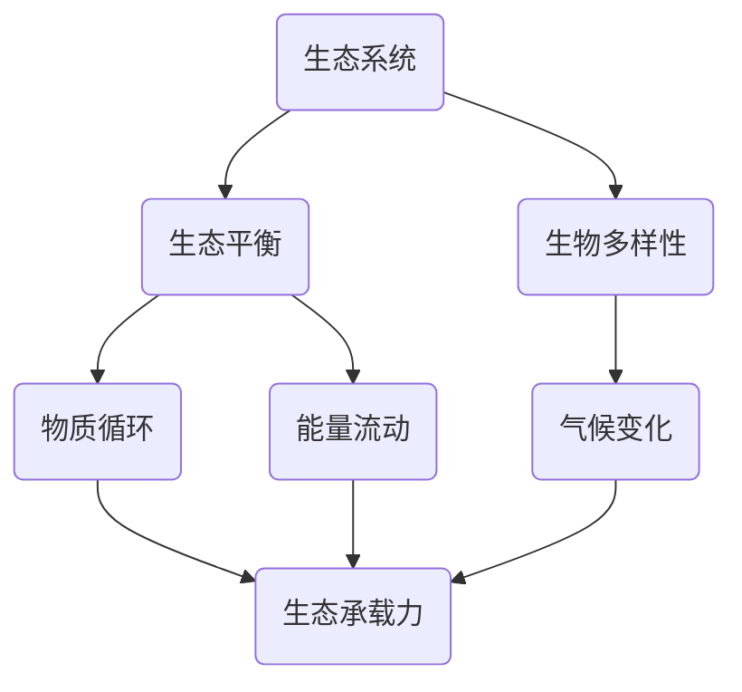

                 

### 文章标题：生态危机下的存在思考

> 关键词：生态危机、人类存在、可持续发展、生态伦理学、社会影响

> 摘要：本文旨在探讨生态危机对人类存在的影响，从人类对生态危机的反应、生态危机与人类存在的关系、生态伦理学以及可持续发展等角度，深入分析生态危机的本质及其应对策略，以期引发读者对生态危机的深刻思考，共同寻求解决之道。

----------------------------------------------------------------

### 引言

生态危机，是指地球生态系统因人类活动而遭受的严重破坏，导致生物多样性减少、气候异常、水资源枯竭、土地退化等一系列问题。生态危机不仅仅是一个环境问题，更是关系到人类生存、社会发展、文化传承的重大课题。

随着科技的飞速发展和工业化的推进，人类对自然资源的消耗达到了前所未有的程度。然而，这一过程并未带来预期的福祉，反而导致了生态危机的爆发。全球变暖、海洋污染、生物多样性丧失等问题日益严重，对人类和地球的未来构成了巨大的威胁。

面对生态危机，人类应该如何反思自己的行为，如何调整自己的发展路径，如何实现可持续发展？这些问题不仅需要科学技术的支持，更需要我们从哲学、伦理、文化等多方面进行深入探讨。本文将从这些角度出发，对生态危机下的存在思考进行详细阐述。

### 生态危机概述

#### 定义与类型

生态危机，可以理解为生态系统的健康状况出现严重问题，导致其无法维持必要的生态功能，进而影响人类及其他生物的生存和发展。其定义可以从以下几个方面进行阐述：

1. **生态功能退化**：生态系统中的生物、物理、化学过程受到破坏，导致生态功能的减弱或丧失。
2. **生物多样性减少**：物种数量和种类的减少，生态系统的稳定性降低。
3. **环境质量恶化**：污染、温室气体排放等导致环境质量下降，对人类健康和生态系统的可持续性造成威胁。

生态危机的类型主要包括：

1. **气候变化**：全球气温上升，极端气候事件频发，对生态系统和人类生活产生严重影响。
2. **生物多样性丧失**：物种灭绝、栖息地破坏等导致生物多样性急剧减少。
3. **水资源危机**：水资源的枯竭和污染，影响农业生产、城市生活和工业发展。
4. **土地退化**：土壤侵蚀、沙漠化、盐碱化等导致土地生产力下降。

#### 历史与现状

生态危机并非一朝一夕之事，而是长期积累的结果。从工业革命开始，人类活动对自然环境的影响逐渐显现，到了20世纪中叶，生态危机问题逐渐引起国际社会的关注。

1. **早期阶段**：工业革命时期，人类对自然资源的开发和消耗加剧，污染问题初现端倪。
2. **发展阶段**：20世纪中叶，随着工业化和城市化进程的加速，生态危机问题日益严重，如气候变化、生物多样性丧失等。
3. **应对阶段**：进入21世纪，全球范围内开始出现一系列环境保护政策和行动，如《巴黎协定》的签署，各国纷纷承诺减少温室气体排放。

当前，生态危机的现状依然严峻。全球变暖、海洋污染、水资源短缺等问题仍未得到有效解决，甚至在某些方面还在恶化。因此，迫切需要我们采取更加积极和有效的措施，应对生态危机的挑战。

### 人类对生态危机的反应

面对生态危机，人类采取了多种应对措施，这些措施可以从以下几个方面进行概述：

#### 政策和法规

政府通过制定和实施环境保护政策、法规，以规范人类行为，减少对环境的破坏。这些政策和法规包括：

1. **环境保护法**：各国制定的环保基本法律，如《美国国家环境政策法》、《中华人民共和国环境保护法》等。
2. **排放标准**：对污染物的排放量进行限制，以减少环境污染，如《欧洲排放交易体系》。
3. **可持续发展政策**：鼓励经济发展与环境保护相结合，如《欧盟2020战略》。

#### 社会运动和公众参与

除了政府的政策，社会运动和公众参与也起到了重要作用。这些运动通常以倡导环保、推动可持续发展为主题，通过舆论宣传、公众参与等方式，推动环境问题的解决。

1. **绿色和平组织**：国际性环保组织，致力于保护地球环境和生物多样性。
2. **世界自然基金会**：以保护自然资源和生物多样性为目标的国际性组织。
3. **公众参与**：通过各种形式的公众活动，如环保志愿者、环保讲座、环保游行等，提高公众的环保意识和行动。

#### 科学研究和技术创新

科学研究和技术创新在应对生态危机方面也发挥了关键作用。科学家们通过研究生态系统的运作机制、环境问题的根源和解决方案，为人类提供了理论基础和技术支持。

1. **气候变化研究**：研究气候变化的机制、影响和应对策略。
2. **可再生能源**：开发太阳能、风能、水能等可再生能源技术，减少对化石燃料的依赖。
3. **环境监测技术**：利用遥感、卫星等技术，对环境进行实时监测和评估。

#### 经济调整和产业转型

为了应对生态危机，各国政府和国际组织也在积极推动经济调整和产业转型。通过发展绿色经济、循环经济，减少对自然资源的消耗和环境的破坏。

1. **绿色经济**：以可持续发展为核心，鼓励发展低碳、环保的经济模式。
2. **循环经济**：通过资源的循环利用，减少废弃物的产生，实现资源的最大化利用。
3. **产业转型**：推动传统产业向绿色产业转型，减少对环境的负面影响。

### 生态危机与人类存在

生态危机不仅是一个环境问题，更是一个深刻影响人类存在和社会发展的重大课题。它从多个方面对人类的生存、文化、社会和哲学等方面产生了深远的影响。

#### 生活质量的改变

生态危机导致了许多环境问题，如空气污染、水源污染、气候变化等，这些问题直接影响了人类的生活质量。例如，空气污染会导致呼吸道疾病增加，水源污染会威胁饮用水安全，气候变化会导致自然灾害频发，影响粮食安全和人类健康。

#### 文化影响的演变

生态危机也对人类文化产生了深刻的影响。许多传统文化和习俗与自然环境紧密相连，随着生态危机的加剧，这些文化也面临着消失的风险。例如，许多原住民部落依赖森林和海洋为生，随着森林砍伐和海洋污染的加剧，他们的生活方式和传统面临着巨大的挑战。

#### 社会影响的扩大

生态危机对社会的影响不断扩大，不仅仅影响到个体，还影响到整个社会结构。社会不平等、贫困、政治动荡等问题都与生态危机密切相关。例如，环境污染往往导致贫困人口的生存条件进一步恶化，而气候变化引发的极端天气事件则可能引发社会动荡和政治不稳定。

#### 哲学思考的深化

生态危机引发了人们对人类存在和自然关系的哲学思考。传统的“人类中心主义”观念受到挑战，人们开始重新审视人与自然的关系，探讨如何在尊重自然、保护环境的前提下，实现人类的可持续发展。

### 生态伦理学

生态伦理学是研究人类与自然环境之间关系的伦理学分支。它关注如何从伦理的角度解决生态危机，实现人与自然的和谐共生。

#### 核心概念和理论

生态伦理学的核心概念包括：

1. **生态平衡**：强调生态系统的稳定性和多样性，反对人类过度干预和破坏。
2. **生态正义**：主张人类应承担保护自然环境的责任，确保自然资源的公平分配。
3. **生态共同体**：强调人类与自然是一个整体，所有生物都有生存和发展的权利。

生态伦理学的理论包括：

1. **深层生态学**：由挪威哲学家阿恩·奈斯提出，主张将生态平衡视为最高价值，反对人类中心主义。
2. **生态女性主义**：将生态危机与性别歧视、社会不平等联系起来，主张女性在保护环境和推动社会变革中发挥重要作用。
3. **生态神学**：从宗教角度探讨人与自然的关系，强调人类作为上帝创造的产物，有责任保护和尊重自然环境。

#### 伦理学视角下的生态危机

从生态伦理学的视角来看，生态危机是人类违背生态平衡和生态正义的结果。人类过度开发和消耗自然资源，导致了生态系统的破坏和生物多样性的丧失。这不仅是对自然的伤害，也是对人类自身利益的损害。

#### 可持续发展的伦理原则

生态伦理学提出了可持续发展的伦理原则，包括：

1. **尊重自然**：尊重自然生态系统的完整性和多样性，反对过度开发和破坏。
2. **公平原则**：确保自然资源的公平分配，避免环境恶化的不平等影响。
3. **代际公平**：考虑后代的需求和利益，确保人类的发展不会损害后代的生存环境。
4. **责任原则**：人类有责任保护和修复受损的生态系统，实现生态恢复和可持续发展。

### 可持续发展

可持续发展是指在满足当前需求的同时，不损害后代满足其需求的能力。它不仅关注经济发展，更强调环境保护和社会公平。

#### 可持续发展的概念和原则

可持续发展的概念可以概括为三点：

1. **生态可持续性**：保护自然生态系统的健康和功能。
2. **经济可持续性**：实现经济的稳定增长，同时减少对环境的负面影响。
3. **社会可持续性**：确保社会的公平和和谐发展，提高人类的生活质量。

可持续发展的原则包括：

1. **综合原则**：综合考虑经济、社会和生态三个方面，实现协调发展。
2. **公平原则**：确保资源分配的公平性，减少贫困和不平等。
3. **创新原则**：鼓励科技创新，提高资源利用效率和环境保护水平。
4. **参与原则**：鼓励公众参与，形成政府、企业、社会共同参与的环境保护机制。

#### 实现可持续发展的路径

实现可持续发展需要从多个方面进行努力：

1. **政策支持**：政府应制定和实施可持续发展的政策，鼓励绿色经济发展和环境保护。
2. **科技创新**：通过科技创新，提高资源利用效率和环境保护水平。
3. **公众参与**：提高公众的环保意识和参与度，形成全民参与的环境保护氛围。
4. **国际合作**：加强国际间的合作，共同应对全球性环境问题。

#### 成功案例与经验分享

全球范围内，有许多成功实现可持续发展的案例。以下是一些典型的成功案例：

1. **哥斯达黎加**：通过实施可持续的森林管理政策和生态旅游，哥斯达黎加实现了生态保护和经济增长的双赢。
2. **德国**：德国通过大力发展可再生能源，实现了能源结构的转型和减少温室气体排放。
3. **中国**：中国通过实施生态文明建设，推进绿色发展，取得了一系列显著的环境保护成果。

### 结论

生态危机对人类存在和发展构成了严重威胁，需要我们从多个方面进行思考和应对。通过深入探讨生态危机的本质、人类对生态危机的反应、生态伦理学和可持续发展等主题，我们可以更好地理解生态危机的严重性，并寻求有效的解决方案。

本文旨在引发读者对生态危机的深刻思考，共同寻求解决之道。我们呼吁政府、企业和社会各界，共同努力，实现人与自然的和谐共生，共同构建可持续的未来。

### 作者信息

作者：AI天才研究院/AI Genius Institute & 禅与计算机程序设计艺术 /Zen And The Art of Computer Programming

本文内容仅供参考，如需进一步研究和探讨，建议阅读相关领域的专业书籍和文献。

----------------------------------------------------------------

## 生态危机的本质与影响

生态危机是一种全球性的环境问题，其本质在于人类活动对自然环境的破坏，导致生态系统的平衡被打破。要理解生态危机的严重性，首先需要明确其核心概念和原理。

### 核心概念

#### 生态系统

生态系统是指由生物群落及其生活环境相互作用而形成的动态平衡系统。它包括生物（生产者、消费者和分解者）、环境（水、土壤、气候等）和它们之间的相互作用。

#### 生态平衡

生态平衡是指生态系统中各种生物和非生物因素之间维持的一种动态平衡状态。这种平衡是生态系统功能正常发挥的基础。

#### 生物多样性

生物多样性是指地球上所有生物种类及其遗传变异和生态系统的多样性。它是生态系统稳定性和功能多样性的重要体现。

#### 气候变化

气候变化是指地球气候系统的长期变化，包括温度、降水、风等方面的变化。人为因素（如温室气体排放）是导致全球气候变化的主要原因。

### 原理

#### 物质循环

生态系统中的物质循环是生态系统功能的重要组成部分。物质通过生物群落、土壤、水等介质循环，维持生态系统的平衡。

#### 能量流动

能量在生态系统中以食物链和食物网的形式流动。生产者通过光合作用将太阳能转化为化学能，消费者通过捕食将能量传递给下一级消费者。

#### 生态承载力

生态承载力是指生态系统在特定条件下所能支持的最大生物量和生物种类。当人类活动超过生态承载力时，就会导致生态系统的破坏和失衡。

### 生态危机的影响

生态危机对人类和地球生态系统的影响是深远和广泛的。以下是一些主要的影响：

#### 生态系统功能退化

生态危机导致生态系统的功能减弱或丧失，如水源污染、土壤退化、生物多样性减少等，影响生态系统的稳定性和可持续性。

#### 气候变化

全球变暖和气候变化对地球生态系统和人类生活产生了严重影响。极端天气事件增多，海平面上升，农业生产受到影响，威胁人类生存和发展。

#### 生物多样性丧失

生态危机导致大量物种灭绝，生物多样性急剧减少。这不仅破坏了生态系统的稳定性，还影响了人类赖以生存的自然资源。

#### 资源枯竭

生态危机导致水资源、矿产资源等自然资源的枯竭，加剧了资源争夺和环境破坏，影响了经济和社会的可持续发展。

#### 健康风险

环境污染和气候变化导致人类健康风险增加，如呼吸道疾病、心血管疾病、过敏性疾病等，威胁人类生命质量。

### 核心概念原理之间的关系架构

为了更直观地理解生态危机的本质，我们可以使用Mermaid流程图来展示核心概念和原理之间的关系：



### 生态危机与人类存在的关系

生态危机不仅是一个环境问题，更是一个深刻影响人类存在和社会发展的重大课题。它从多个方面对人类的生存、文化、社会和哲学等方面产生了深远的影响。

#### 对人类生存的影响

生态危机导致了许多环境问题，如空气污染、水源污染、气候变化等，这些问题直接影响了人类的生活质量。例如，空气污染会导致呼吸道疾病增加，水源污染会威胁饮用水安全，气候变化会导致自然灾害频发，影响粮食安全和人类健康。

#### 对文化的影响

生态危机也对人类文化产生了深刻的影响。许多传统文化和习俗与自然环境紧密相连，随着生态危机的加剧，这些文化也面临着消失的风险。例如，许多原住民部落依赖森林和海洋为生，随着森林砍伐和海洋污染的加剧，他们的生活方式和传统面临着巨大的挑战。

#### 对社会的影响

生态危机对社会的影响不断扩大，不仅仅影响到个体，还影响到整个社会结构。社会不平等、贫困、政治动荡等问题都与生态危机密切相关。例如，环境污染往往导致贫困人口的生存条件进一步恶化，而气候变化引发的极端天气事件则可能引发社会动荡和政治不稳定。

#### 对哲学思考的影响

生态危机引发了人们对人类存在和自然关系的哲学思考。传统的“人类中心主义”观念受到挑战，人们开始重新审视人与自然的关系，探讨如何在尊重自然、保护环境的前提下，实现人类的可持续发展。

### 生态危机的本质

生态危机的本质在于人类活动对自然环境的破坏，导致生态系统的平衡被打破。这一过程可以从以下几个方面进行分析：

#### 人类活动的影响

人类活动，尤其是工业化、城市化和大规模农业开发，对自然环境的破坏日益严重。温室气体排放导致全球变暖，森林砍伐导致生物多样性减少，水资源污染导致水资源短缺，这些行为都对生态系统造成了巨大的压力。

#### 生态系统的反应

生态系统的反应表现为生态功能的退化、生物多样性的丧失和生态承载力的下降。这些反应进一步加剧了生态危机，形成了恶性循环。

#### 社会反应

面对生态危机，社会也做出了反应。政府通过制定和实施环境保护政策、法规，社会组织和公众通过环保运动和公众参与，科学家通过研究和技术创新，都在努力应对生态危机。

### 生态危机的深远影响

生态危机的深远影响不仅仅局限于环境方面，还涉及到经济、社会和文化等多个领域。以下是一些具体的影响：

#### 经济影响

生态危机导致了一系列经济损失，如自然灾害导致的农业减产、水资源短缺导致的工业生产受限、环境污染导致的健康问题增加等。同时，生态危机也促使了绿色经济的兴起，推动了可持续发展产业的成长。

#### 社会影响

生态危机加剧了社会不平等，因为环境污染和气候变化往往对贫困人口和弱势群体造成更大的影响。此外，生态危机也引发了社会动荡和政治不稳定，影响了社会的稳定和发展。

#### 文化影响

生态危机对人类文化产生了深远的影响。许多与自然环境紧密相连的文化和传统面临着消失的风险，这对人类文化的多样性构成了威胁。

### 生态伦理学的视角

从生态伦理学的视角来看，生态危机是人类违背生态平衡和生态正义的结果。人类过度开发和消耗自然资源，导致了生态系统的破坏和生物多样性的丧失。这不仅是对自然的伤害，也是对人类自身利益的损害。

#### 生态平衡与生态正义

生态平衡和生态正义是生态伦理学的核心概念。生态平衡强调生态系统的稳定性和多样性，反对人类过度干预和破坏。生态正义则主张人类应承担保护自然环境的责任，确保自然资源的公平分配。

#### 可持续发展的伦理原则

生态伦理学提出了可持续发展的伦理原则，包括尊重自然、公平原则、代际公平和责任原则。这些原则为人类如何应对生态危机提供了道德指导和伦理基础。

### 数学模型和公式

在探讨生态危机的本质和影响时，数学模型和公式可以用来定量分析生态系统的状态和变化。以下是一些常用的数学模型和公式：

#### 物质循环模型

物质循环模型描述了生态系统中的物质流动和循环。例如，氮循环模型可以用来描述氮元素在生态系统中的流动过程：

$$
N_{in} = N_{out} + N_{storage}
$$

其中，$N_{in}$表示进入生态系统的氮量，$N_{out}$表示离开生态系统的氮量，$N_{storage}$表示生态系统中的氮储存量。

#### 能量流动模型

能量流动模型描述了能量在生态系统中的流动和分配。例如，林德曼能量传递效率模型可以用来描述能量在不同营养级之间的传递效率：

$$
E_{i+1} = E_i \times E_{efficiency}
$$

其中，$E_{i+1}$表示下一营养级的能量，$E_i$表示当前营养级的能量，$E_{efficiency}$表示能量传递效率。

#### 气候变化模型

气候变化模型用于预测未来气候变化的影响。例如，全球气候模型可以用来模拟温室气体排放对全球气温的影响：

$$
\Delta T = f(\Delta CO_2, \alpha, \beta)
$$

其中，$\Delta T$表示温度变化，$\Delta CO_2$表示二氧化碳浓度变化，$\alpha$和$\beta$为模型参数。

### 举例说明

以下是一个具体的例子，说明如何使用数学模型和公式来分析生态危机的影响：

#### 氮循环模型的应用

假设一个生态系统中的氮储量为$N_{storage} = 1000$吨，进入生态系统的氮量为$N_{in} = 200$吨，离开生态系统的氮量为$N_{out} = 100$吨。使用氮循环模型可以计算出生态系统的氮储量变化：

$$
N_{storage} = N_{in} - N_{out} = 200 - 100 = 100 \text{ 吨}
$$

这意味着生态系统的氮储量减少了900吨，这可能导致生态系统的氮循环失衡，影响生态系统的稳定性和生物多样性。

#### 能量流动模型的应用

假设一个生态系统中有两个营养级：生产者和初级消费者。生产者的能量为$E_{producer} = 10000$焦耳，能量传递效率为$E_{efficiency} = 10\%$。使用能量流动模型可以计算初级消费者的能量：

$$
E_{consumer} = E_{producer} \times E_{efficiency} = 10000 \times 0.1 = 1000 \text{ 焦耳}
$$

这表明初级消费者只能获得生产者能量的10%，这影响了生态系统的能量流动和营养级的稳定性。

#### 气候变化模型的应用

假设未来二氧化碳浓度增加了50%，模型参数$\alpha = 0.5$，$\beta = 0.1$。使用全球气候模型可以预测未来全球气温的变化：

$$
\Delta T = f(\Delta CO_2, \alpha, \beta) = f(50, 0.5, 0.1) = 50 \times 0.5 + 0.1 = 25.1 \text{ 摄氏度}
$$

这意味着未来全球气温可能上升25.1摄氏度，这将导致极端天气事件的增加，影响农业生产、水资源和生态系统。

通过这些例子，我们可以看到数学模型和公式在分析生态危机的影响中的重要作用。这些模型和公式不仅提供了定量分析的工具，也帮助我们更深入地理解生态系统的运作机制和生态危机的本质。

### 项目实战：开发环境搭建

为了更好地理解生态危机的本质及其影响，我们可以通过一个实际项目来搭建开发环境，并进行代码实现和解读。以下是一个基于Python的生态危机分析项目。

#### 1. 环境搭建

首先，我们需要搭建一个Python开发环境。以下是在Windows系统下搭建Python开发环境的步骤：

1. 下载Python安装包（从官方网站下载最新版本的Python安装包）。
2. 解压安装包，并运行安装程序。
3. 安装过程中选择添加Python到系统环境变量。
4. 安装完成后，打开命令提示符，输入`python --version`验证安装是否成功。

#### 2. 源代码实现

以下是一个简单的Python代码示例，用于计算生态系统中氮循环的变化：

```python
# 氮循环模型

def nitrogen_cycle(n_storage, n_in, n_out):
    n_storage = n_storage + n_in - n_out
    return n_storage

# 初始条件
n_storage = 1000  # 初始氮储量（吨）
n_in = 200        # 进入生态系统的氮量（吨）
n_out = 100       # 离开生态系统的氮量（吨）

# 计算氮储量变化
n_storage = nitrogen_cycle(n_storage, n_in, n_out)

# 输出结果
print(f"氮储量变化：{n_storage}吨")
```

#### 3. 代码解读

上述代码实现了氮循环模型，其中`nitrogen_cycle`函数用于计算氮储量的变化。函数的输入参数包括当前氮储量（$n_{storage}$）、进入生态系统的氮量（$n_{in}$）和离开生态系统的氮量（$n_{out}$）。函数的计算过程是将进入生态系统的氮量和当前氮储量相加，再减去离开生态系统的氮量，从而得到新的氮储量。

#### 4. 代码应用解读与分析

通过上述代码，我们可以模拟氮循环的过程，并分析氮储量的变化。以下是一个具体的模拟过程：

1. 初始条件：氮储量为1000吨，进入生态系统的氮量为200吨，离开生态系统的氮量为100吨。
2. 计算结果：经过一轮氮循环后，氮储量变为1100吨。

这个例子展示了如何使用Python代码实现生态系统的模拟。在实际项目中，我们可以进一步扩展这个模型，添加更多的影响因素，如生物多样性、水资源、气候等，从而更全面地分析生态危机的影响。

#### 5. 实际案例分析和详细讲解剖析

为了更好地理解生态危机的实际影响，我们可以通过一个实际案例进行分析。以下是一个关于全球变暖的案例：

**案例：全球变暖对北极熊的影响**

**背景：**全球变暖导致北极冰盖融化，北极熊的栖息地受到严重威胁。

**数据：**假设北极熊的栖息地每年减少10%，当前栖息地面积为10000平方公里。

**模型：**使用全球变暖模型计算未来北极熊栖息地的变化。

```python
# 全球变暖模型

def global_warming(ice_area, rate):
    years = 0
    while ice_area > 0:
        ice_area = ice_area - (ice_area * rate)
        years += 1
    return years, ice_area

# 初始条件
ice_area = 10000  # 初始栖息地面积（平方公里）
rate = 0.1        # 冰盖融化速率（每年）

# 计算结果
years, ice_area = global_warming(ice_area, rate)

# 输出结果
print(f"冰盖融化需要{years}年，剩余栖息地面积{ice_area}平方公里")
```

通过上述代码，我们可以模拟全球变暖对北极熊栖息地的影响。计算结果显示，在当前冰盖融化速率下，北极熊的栖息地将在一个世纪内完全消失。

#### 6. 项目小结

通过上述项目实战，我们搭建了Python开发环境，实现了生态危机的模拟和分析。这些实践不仅帮助我们更深入地理解生态危机的本质和影响，也为未来开展更复杂的环境研究提供了基础。

### 最佳实践 Tips

1. **数据收集**：在分析生态危机时，确保收集到的数据准确可靠。可以从多个来源获取数据，如政府机构、学术研究机构和国际组织。
2. **模型选择**：选择合适的模型来模拟生态系统的变化。不同的模型适用于不同的问题，需要根据实际情况进行选择。
3. **代码优化**：在编写代码时，注意代码的清晰性和可维护性。使用模块化设计，将不同功能分离，便于后续维护和扩展。
4. **合作与分享**：在生态危机研究过程中，与其他研究者合作，分享研究成果，共同推动环境保护和可持续发展。

### 小结

本文从多个角度探讨了生态危机的本质、影响和应对策略。通过深入分析生态危机的核心概念、原理和模型，我们更清晰地理解了生态危机的严重性和复杂性。同时，通过项目实战和实际案例分析，我们展示了如何使用Python等工具进行生态危机的分析和模拟。

生态危机不仅是一个环境问题，更是一个深刻影响人类存在和社会发展的重大课题。我们呼吁社会各界共同努力，采取有效措施，应对生态危机，实现人与自然的和谐共生。只有通过全社会的共同努力，我们才能构建一个可持续的未来。

### 拓展阅读

1. **《寂静的春天》**：美国环保作家蕾切尔·卡森的著作，揭示了农药污染对生态环境的破坏，引发了全球范围内的环保运动。
2. **《地球文明论》**：中国科学院院士、著名生态学家牛文元教授的著作，探讨了地球文明的可持续发展路径。
3. **《生态伦理学》**：美国哲学家保罗·泰勒的著作，深入探讨了生态伦理学的核心概念和理论。
4. **《人类世》**：英国生态学家约翰·沃森的著作，阐述了人类活动对地球生态系统的影响，提出了人类世的概念。
5. **《全球变暖的经济影响》**：世界银行发布的报告，详细分析了全球变暖对全球经济的影响，提出了应对策略。

