                 

## 生物伦理：科技进步中的道德考量

### 关键词
- 生物伦理
- 科技进步
- 道德考量
- 基因编辑
- 克隆技术
- 细胞疗法
- 人工智能

### 摘要
本文探讨了生物伦理在科技进步背景下的重要性，以及科技进步对生物伦理的影响。文章首先介绍了生物伦理的基本概念和背景，随后分析了基因编辑、克隆技术、细胞疗法等生物技术的伦理问题。接着，文章探讨了生命科学中的伦理挑战，如动物实验、人造生命体和生物信息学。随后，文章讨论了生物技术的伦理决策，包括伦理审查、监管框架和案例分析。随后，文章转向人工智能与生物伦理的关系，探讨了人工智能在生物伦理研究中的应用和挑战。最后，文章总结了伦理学与科技发展的互动，并展望了生物伦理的未来。

## 引言

### 1.1 生物伦理的背景和重要性

生物伦理是一门跨学科的研究领域，涉及生物学、医学、哲学、法学等多个学科。其起源可以追溯到20世纪中叶，当时科学家们在医学研究中发现了一系列道德和伦理问题。生物伦理的核心目标是探讨人类在生物医学领域的道德责任和行为规范，确保科技进步在符合伦理标准的前提下进行。

生物伦理的重要性体现在多个方面。首先，生物伦理为科技进步提供了道德框架，引导科技在造福人类的同时避免伦理风险。例如，基因编辑技术虽然有望治愈遗传疾病，但也引发了伦理争议，如基因编辑对后代的影响、基因隐私等。其次，生物伦理有助于提高公众对生物医学技术的认知和参与度，促进科学决策的透明性和公正性。最后，生物伦理对于维护社会稳定和促进可持续发展具有重要意义。

### 1.2 科技进步对生物伦理的影响

科技进步对生物伦理的影响是深远且复杂的。一方面，科技进步为生物伦理带来了新的问题和挑战。例如，基因编辑技术的出现引发了关于基因改造、人类增强和基因歧视等伦理争议。另一方面，科技进步也为生物伦理提供了新的解决方案和工具。例如，人工智能在生物伦理研究中的应用，有助于提高伦理决策的科学性和效率。

科技进步对生物伦理的影响体现在以下几个方面：

1. **技术风险与道德考量**：科技进步带来了新的技术风险，如基因编辑可能导致的未知副作用、生物武器研发等。生物伦理需要对这些技术风险进行评估和管控，确保科技发展符合伦理原则。

2. **隐私与数据保护**：生物技术如基因测序和生物信息学的发展，引发了关于个人隐私和数据保护的伦理争议。生物伦理需要探讨如何在保护个人隐私的同时，合理利用生物数据推动科学研究和医疗进步。

3. **公平与正义**：科技进步可能导致社会不平等，如基因编辑技术可能只被富裕人群所利用，加剧贫富差距。生物伦理需要关注科技在促进社会公平和正义中的作用。

4. **人与自然的关系**：科技进步对自然生态系统的破坏，如基因污染、生物入侵等，引发了对人与自然关系的伦理思考。生物伦理需要探讨人类如何在与自然和谐共存的基础上推进科技进步。

### 1.3 本书结构概述

本书将从以下章节展开对生物伦理在科技进步中的道德考量的探讨：

- **第2章 生物技术的伦理问题**：介绍基因编辑、克隆技术、细胞疗法等生物技术的伦理争议和考量。
- **第3章 生命科学的伦理挑战**：讨论动物实验、人造生命体和生物信息学等领域的伦理问题。
- **第4章 生物技术的伦理决策**：探讨伦理审查、监管框架和案例分析。
- **第5章 人工智能与生物伦理**：分析人工智能在生物伦理研究中的应用和挑战。
- **第6章 伦理学与科技发展的互动**：总结伦理学与科技发展的互动关系和平衡。
- **第7章 生物伦理的未来展望**：展望未来生物技术的伦理挑战和趋势。
- **第8章 结论**：总结生物伦理的核心问题和科技进步与道德考量之间的关系。

通过以上章节的探讨，本书旨在为读者提供一个全面、系统的生物伦理在科技进步中的道德考量分析框架，引导读者在科技发展的浪潮中保持清醒的伦理意识。

## 生物技术的伦理问题

生物技术作为现代科学的重要领域，涵盖了基因编辑、克隆技术、细胞疗法等多个方面。然而，这些技术的快速发展也带来了诸多伦理问题，引发了对人类、社会和自然生态的深刻反思。

### 2.1 基因编辑的伦理争议

基因编辑技术，如CRISPR-Cas9，为治疗遗传疾病和增强人类健康提供了前所未有的可能性。然而，其应用也引发了广泛的伦理争议。

**1. 基因编辑对后代的影响**：
基因编辑技术使得父母可以选择对未出生子女的基因进行编辑，以消除遗传性疾病。这种“设计婴儿”的理念虽然可以减少某些疾病的发生，但也引发了对人类自然进化过程和基因多样性的质疑。此外，基因编辑可能导致不可预见的副作用，对后代的健康和生存能力产生影响。

**2. 基因隐私和基因歧视**：
基因编辑技术的普及可能带来基因隐私的问题。个人的基因信息可能被滥用，导致基因歧视和社会排斥。例如，保险公司可能会因个人的基因信息拒绝承保或提高保费，企业也可能利用基因信息进行人力资源筛选。

**3. 科学责任和道德责任**：
科学家在基因编辑技术中扮演着重要角色，但同时也承担着巨大的道德责任。科学家需要确保其研究和应用符合伦理原则，避免滥用技术导致不可逆转的伦理后果。

**4. 伦理审查和监管**：
基因编辑技术需要严格的伦理审查和监管。各国政府和国际组织需要制定相应的法规和标准，确保基因编辑技术的安全和合法性。

**核心概念与联系**：

基因编辑技术涉及的核心概念包括**CRISPR-Cas9**、**基因突变**、**遗传疾病**和**基因伦理**。这些概念之间的关系可以用以下Mermaid流程图表示：

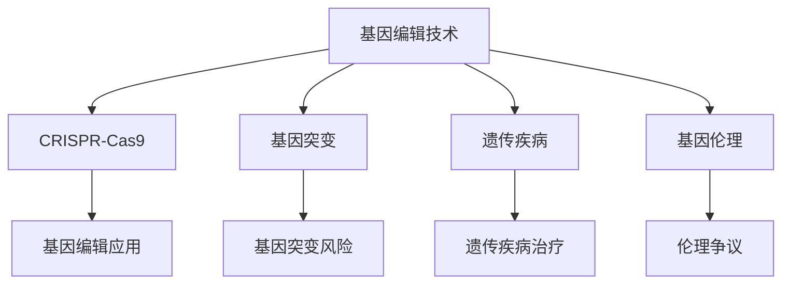

**核心算法原理讲解**：

基因编辑技术的基本原理是通过CRISPR-Cas9系统在特定位置切割DNA，然后引入特定的基因序列，实现基因的编辑和修复。以下是一个简单的基因编辑伪代码：

```python
def gene_editing(dna_sequence, target_site, new_sequence):
    # 使用CRISPR-Cas9在目标位点切割DNA
    cut_dna = CRISPR_Cas9.cut(dna_sequence, target_site)
    
    # 将新序列插入切割位点
    edited_sequence = insert_sequence(cut_dna, new_sequence, target_site)
    
    # 返回编辑后的DNA序列
    return edited_sequence
```

**数学模型和公式详细讲解**：

基因编辑过程中的数学模型主要包括基因突变的概率和基因编辑的准确性。以下是一个简化的数学模型：

$$
P(\text{基因突变}) = \frac{N(\text{突变位点总数})}{L(\text{基因组总长度})}
$$

其中，\( P(\text{基因突变}) \) 是基因突变概率，\( N \) 是突变位点的总数，\( L \) 是基因组的总长度。

基因编辑的准确性可以通过以下公式表示：

$$
\text{编辑准确性} = \frac{\text{成功编辑的基因数}}{\text{总编辑尝试次数}}
$$

**举例说明**：

假设一个基因组的长度为1000个碱基，其中有5个突变位点。使用CRISPR-Cas9进行基因编辑，共进行了100次编辑尝试，其中有95次成功。则基因突变概率为：

$$
P(\text{基因突变}) = \frac{5}{1000} = 0.005
$$

编辑准确率为：

$$
\text{编辑准确性} = \frac{95}{100} = 0.95
$$

### 2.2 克隆技术的伦理考量

克隆技术作为生物技术的一个重要分支，引发了关于生命本质和伦理道德的深刻思考。

**1. 动物克隆**：
动物克隆技术已经取得了显著成果，如克隆羊多莉的诞生。然而，动物克隆也引发了一系列伦理问题，如克隆动物的健康问题、克隆动物的寿命和质量等。此外，动物克隆可能导致生态系统的失衡，影响物种的自然进化。

**2. 人克隆**：
人克隆技术引发了更广泛的伦理争议。人克隆可能导致“克隆婴儿”的出现，引发对人类身份和道德责任的质疑。此外，人克隆技术可能加剧社会不平等，富裕人群利用技术优势进行基因改造，加剧贫富差距。

**3. 克隆技术的应用**：
克隆技术不仅可以用于复制个体，还可以用于组织修复和再生医学。然而，这些应用也带来了伦理问题，如克隆器官的伦理地位、克隆器官的质量和安全性等。

**核心概念与联系**：

克隆技术涉及的核心概念包括**细胞核移植**、**基因遗传**、**生命伦理**和**克隆道德**。这些概念之间的关系可以用以下Mermaid流程图表示：

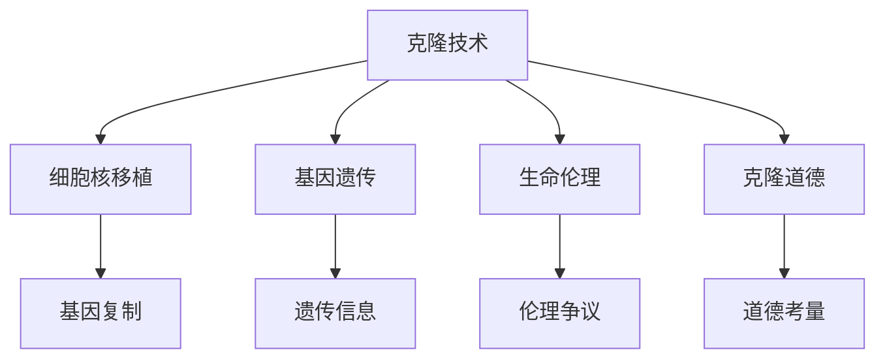

**核心算法原理讲解**：

克隆技术的基本原理是通过细胞核移植将体细胞的细胞核移植到去核的卵细胞中，然后通过胚胎培养和胚胎移植实现克隆个体的诞生。以下是一个简化的克隆技术伪代码：

```python
def cloning(donor_cell, host_egg):
    # 将供体细胞的细胞核移植到去核的卵细胞中
    edited_egg = nuclear_transfer(donor_cell, host_egg)
    
    # 培养胚胎并移植
    embryo = embryo_culture(edited_egg)
    cloned_individual = embryo_transfer(embryo)
    
    # 返回克隆个体
    return cloned_individual
```

**数学模型和公式详细讲解**：

克隆技术的成功概率可以通过以下公式表示：

$$
P(\text{克隆成功}) = \frac{\text{成功克隆的次数}}{\text{总克隆尝试次数}}
$$

**举例说明**：

假设科学家进行了10次动物克隆实验，其中有7次成功。则克隆成功概率为：

$$
P(\text{克隆成功}) = \frac{7}{10} = 0.7
$$

### 2.3 细胞治疗与基因疗法的伦理问题

细胞治疗和基因疗法作为现代医学的重要领域，为许多难治性疾病提供了新的治疗途径。然而，这些技术也带来了复杂的伦理问题。

**1. 细胞治疗的伦理问题**：
细胞治疗涉及到伦理问题，如细胞来源的道德考量、细胞治疗的长期效果和安全性等。例如，干细胞治疗的来源可能涉及伦理争议，如胚胎干细胞的使用。此外，细胞治疗可能导致免疫排斥和细胞癌变等风险。

**2. 基因疗法的伦理问题**：
基因疗法通过直接修复或替换病变基因，为遗传疾病提供潜在的治疗方案。然而，基因疗法也引发了关于基因改造、基因隐私和基因歧视的伦理争议。例如，基因疗法可能导致个体和社会层面的基因歧视问题。

**3. 伦理审查和监管**：
细胞治疗和基因疗法需要严格的伦理审查和监管，确保其安全和合法性。各国政府和国际组织需要制定相应的法规和标准，以保障患者的权益和技术的安全性。

**核心概念与联系**：

细胞治疗和基因疗法涉及的核心概念包括**细胞疗法**、**基因疗法**、**伦理审查**和**基因伦理**。这些概念之间的关系可以用以下Mermaid流程图表示：

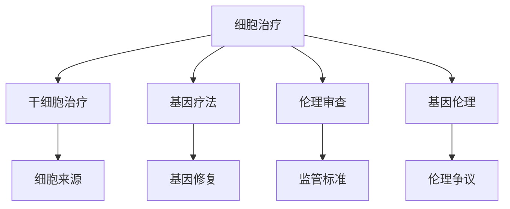

**核心算法原理讲解**：

细胞疗法的基本原理是通过注入或移植健康的细胞来修复或替换受损细胞。以下是一个简化的细胞疗法伪代码：

```python
def cell_therapy(diseased_cell, healthy_cell):
    # 从捐赠者获取健康的细胞
    healthy_cell = obtain_healthy_cell(donor)
    
    # 将健康细胞注入或移植到患者体内
    injected_cell = inject_cell(healthy_cell, patient)
    
    # 监测细胞治疗的效果和安全性
    therapy_effect = monitor_therapy(injected_cell)
    
    # 返回细胞治疗的结果
    return therapy_effect
```

**数学模型和公式详细讲解**：

细胞疗法的效果可以通过以下公式表示：

$$
\text{治疗成功率} = \frac{\text{成功治疗的病例数}}{\text{总治疗病例数}}
$$

基因疗法的效果可以通过以下公式表示：

$$
\text{基因修复率} = \frac{\text{成功修复的基因数}}{\text{总修复尝试次数}}
$$

**举例说明**：

假设科学家对10名患有遗传疾病的患者进行了细胞治疗，其中8名患者获得了成功治疗。则治疗成功率为：

$$
\text{治疗成功率} = \frac{8}{10} = 0.8
$$

假设对20名患有遗传疾病的患者进行了基因疗法，其中15名患者的基因得到了成功修复。则基因修复率为：

$$
\text{基因修复率} = \frac{15}{20} = 0.75
$$

综上所述，生物技术虽然为医学进步带来了巨大潜力，但也带来了复杂的伦理问题。这些伦理问题需要通过深入研究和讨论，确保科技在符合伦理标准的前提下造福人类。

## 生命科学的伦理挑战

生命科学的发展不仅带来了科技进步，也引发了一系列深刻的伦理挑战。这些挑战涉及动物实验、人造生命体和生物信息学等多个领域，对伦理学提出了新的要求和思考。

### 3.1 动物实验的道德考量

动物实验在生命科学研究中扮演着重要角色，为药物开发、疾病治疗和生物学研究提供了宝贵的数据。然而，动物实验也引发了广泛的道德争议。

**1. 动物福利与伦理**：
动物实验涉及到动物的权益和福利。一些动物保护组织认为，动物应享有免受痛苦的权利，反对任何形式的动物实验。然而，科学家则认为，动物实验是获取重要医学数据的必要手段，有助于推动医学进步和人类健康。

**2. 替代实验方法**：
随着科技的发展，越来越多的替代实验方法被开发出来，如细胞培养、计算机模拟和生物信息学方法。这些方法在一定程度上减少了动物实验的需求，但完全替代动物实验仍有待进一步研究。

**3. 伦理审查与监管**：
各国政府和国际组织对动物实验进行了严格的伦理审查和监管。动物实验必须经过伦理委员会的审查，确保实验设计和实施符合伦理标准，尽量减少动物的痛苦。

**核心概念与联系**：

动物实验涉及的核心概念包括**动物福利**、**伦理审查**、**替代实验方法**和**科学进步**。这些概念之间的关系可以用以下Mermaid流程图表示：

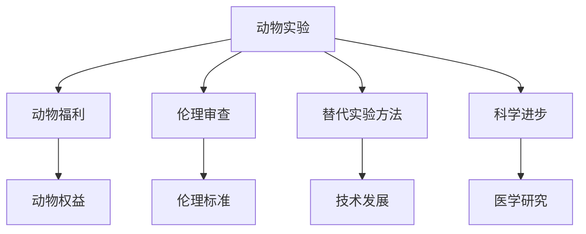

**核心算法原理讲解**：

动物实验的基本原理是通过在动物身上进行模拟实验，研究药物的疗效和副作用。以下是一个简化的动物实验伪代码：

```python
def animal_experiment(drug, animal):
    # 给动物注射药物
    inject_drug(animal, drug)
    
    # 监测动物的生理反应
    response = monitor_response(animal)
    
    # 返回实验结果
    return response
```

**数学模型和公式详细讲解**：

动物实验中的数学模型主要包括药物剂量反应关系和动物生理参数监测。以下是一个简化的数学模型：

$$
\text{药物剂量} = k \times \text{反应阈值}
$$

其中，\( k \) 是比例常数，反映了药物剂量与反应阈值之间的关系。

动物生理参数监测可以通过以下公式表示：

$$
\text{生理参数} = f(\text{时间}, \text{药物浓度})
$$

**举例说明**：

假设科学家对5只实验动物进行了药物实验，观察到药物剂量与反应阈值之间存在线性关系。其中，比例常数 \( k \) 为2。药物浓度随时间变化，如下表所示：

| 时间（天） | 药物浓度（mg/kg） | 反应阈值 |
|------------|-------------------|----------|
| 1          | 10                | 5        |
| 2          | 20                | 10       |
| 3          | 30                | 15       |
| 4          | 40                | 20       |
| 5          | 50                | 25       |

根据药物剂量反应关系模型，可以计算出不同时间点的药物剂量：

| 时间（天） | 药物剂量（mg/kg） |
|------------|-------------------|
| 1          | 20                |
| 2          | 40                |
| 3          | 60                |
| 4          | 80                |
| 5          | 100               |

通过监测动物的生理参数，可以评估药物的疗效和安全性。例如，监测心率、血压和呼吸等生理参数，根据公式计算不同时间点的生理参数值。

### 3.2 人造生命体的伦理讨论

随着生物技术的发展，人造生命体的概念逐渐成为现实。人造生命体不仅包括传统意义上的克隆生物，还包括通过基因编辑、合成生物学等方法制造的新型生物实体。

**1. 人造生命体的定义**：
人造生命体是指通过人工方法制造的生命实体，可以包括细胞、组织、器官甚至完整的生物体。例如，人工心脏、人工耳蜗和人工肝等都是人造生命体的应用实例。

**2. 人造生命体的伦理问题**：
人造生命体引发了关于生命本质、人类身份和道德责任的深刻讨论。例如，人造生命体是否具有道德地位？如何确保人造生命体的福利和权益？人造生命体是否会改变人类社会的基本结构？

**3. 人造生命体的道德考量**：
在制造人造生命体的过程中，需要充分考虑其道德考量。例如，科学家需要确保人造生命体不会对人类和环境造成不可逆转的负面影响。此外，需要制定相应的伦理标准和法规，确保人造生命体的制造和应用符合道德原则。

**核心概念与联系**：

人造生命体涉及的核心概念包括**生命定义**、**伦理责任**、**人造生物**和**科技发展**。这些概念之间的关系可以用以下Mermaid流程图表示：

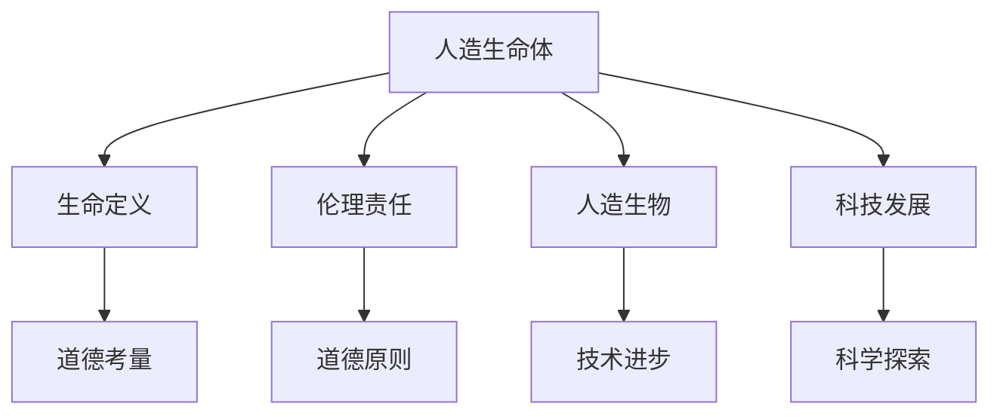

**核心算法原理讲解**：

人造生命体的制造过程通常涉及多种生物技术和工程方法。以下是一个简化的制造过程伪代码：

```python
def create_artificial_life(component_list):
    # 设计和制造生物组件
    components = design_and_manufacture_components(component_list)
    
    # 组装生物组件
    artificial_life = assemble_components(components)
    
    # 功能测试和优化
    test_and_optimize(artificial_life)
    
    # 返回人造生命体
    return artificial_life
```

**数学模型和公式详细讲解**：

人造生命体的功能通常可以通过以下数学模型表示：

$$
\text{功能} = f(\text{组件性能}, \text{环境条件})
$$

其中，组件性能和环境条件是影响人造生命体功能的关键因素。

**举例说明**：

假设一个人造生命体由5个关键组件组成，每个组件的性能受到环境温度和湿度的影响。假设环境温度为25摄氏度，湿度为50%。根据组件性能和环境条件的组合，可以计算人造生命体的功能值。

| 组件性能 | 温度（℃） | 湿度（%） | 功能值 |
|----------|------------|-----------|--------|
| 90%      | 25         | 50        | 0.90*0.90*0.90*0.90*0.90 = 0.65 |
| 85%      | 25         | 50        | 0.85*0.85*0.85*0.85*0.85 = 0.44 |
| 80%      | 25         | 50        | 0.80*0.80*0.80*0.80*0.80 = 0.32 |
| 75%      | 25         | 50        | 0.75*0.75*0.75*0.75*0.75 = 0.21 |
| 70%      | 25         | 50        | 0.70*0.70*0.70*0.70*0.70 = 0.14 |

通过调整组件性能和环境条件，可以优化人造生命体的功能值，使其更好地适应不同的应用场景。

### 3.3 生物信息学的伦理问题

生物信息学是生命科学的重要组成部分，通过分析大量的生物数据，为医学研究、疾病诊断和治疗提供了重要支持。然而，生物信息学的发展也带来了复杂的伦理问题。

**1. 数据隐私与伦理**：
生物信息学依赖于大量的个人生物数据，如基因序列、医疗记录和健康信息。这些数据的隐私保护成为伦理问题的关键。例如，如何确保个人生物数据的匿名性和安全性，防止数据泄露和滥用？

**2. 数据共享与伦理**：
生物信息的共享有助于推动科学研究和医学进步。然而，数据共享也可能引发伦理问题，如数据权益的归属、数据使用的伦理限制等。

**3. 生物信息学的应用伦理**：
生物信息学在医学领域的应用，如基因诊断、个性化医疗和药物研发等，也带来了伦理问题。例如，基因诊断可能导致歧视，个性化医疗可能导致资源分配不公。

**核心概念与联系**：

生物信息学涉及的核心概念包括**数据隐私**、**数据共享**、**基因诊断**和**个性化医疗**。这些概念之间的关系可以用以下Mermaid流程图表示：

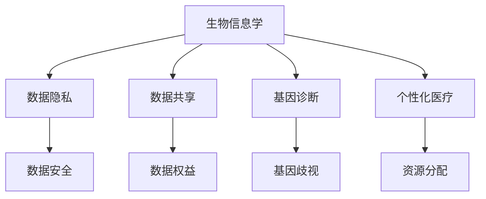

**核心算法原理讲解**：

生物信息学的基本原理是通过分析大量的生物数据，提取有用的信息和知识。以下是一个简化的生物信息学分析伪代码：

```python
def bioinformatics_analysis(biological_data):
    # 数据预处理
    preprocessed_data = preprocess_data(biological_data)
    
    # 数据分析
    analysis_results = analyze_data(preprocessed_data)
    
    # 结果可视化
    visualize_results(analysis_results)
    
    # 返回分析结果
    return analysis_results
```

**数学模型和公式详细讲解**：

生物信息学中的数学模型主要包括统计学模型和机器学习模型。以下是一个简化的统计学模型：

$$
P(\text{疾病}|\text{基因突变}) = \frac{P(\text{基因突变}|\text{疾病})P(\text{疾病})}{P(\text{基因突变})}
$$

其中，\( P(\text{疾病}|\text{基因突变}) \) 表示在基因突变条件下疾病发生的概率，\( P(\text{基因突变}|\text{疾病}) \) 表示在疾病条件下基因突变的概率，\( P(\text{疾病}) \) 表示疾病发生的总体概率。

**举例说明**：

假设一个研究团队发现了一个与疾病相关的基因突变。根据研究数据，基因突变与疾病发生的条件概率如下：

| 条件 | 基因突变 | 疾病 |
|------|----------|------|
| 疾病 | 0.8      | 0.1  |
| 基因突变 | 0.2      | 0.9  |

根据这些数据，可以计算出在基因突变条件下疾病发生的概率：

$$
P(\text{疾病}|\text{基因突变}) = \frac{0.8 \times 0.1}{0.2 \times 0.1 + 0.8 \times 0.9} = \frac{0.08}{0.02 + 0.72} = \frac{0.08}{0.74} \approx 0.108
$$

通过这个概率，医生可以更好地评估基因突变患者疾病的风险，并制定相应的治疗策略。

综上所述，生命科学的快速发展带来了许多伦理挑战。通过深入研究和讨论，我们可以在确保科技进步的同时，妥善处理这些伦理问题，促进科技与伦理的协调发展。

## 生物技术的伦理决策

随着生物技术的迅猛发展，如何制定和执行伦理决策变得尤为重要。伦理决策不仅需要基于科学事实，还要充分考虑社会伦理、法律和政策等方面的因素。在这一章中，我们将探讨伦理审查的过程和标准、生物技术的监管框架，并通过具体的案例分析，展示伦理决策的实际应用。

### 4.1 伦理审查的过程和标准

**1. 伦理审查的过程**：

伦理审查是指对生物医学研究、医疗实践和生物技术应用进行道德评估的过程，以确保其符合伦理标准和法律法规。伦理审查通常包括以下步骤：

- **初步审查**：审查人员对研究申请或项目计划进行初步评估，确定是否需要进一步的伦理审查。
- **详细审查**：审查委员会对项目进行全面评估，包括研究设计、数据收集和分析方法、潜在风险和利益等。
- **公开听证**：对于重大或敏感项目，审查委员会可能会组织公开听证会，邀请利益相关者和社会公众参与讨论。
- **决策**：审查委员会根据评估结果做出是否批准项目的决策，并提供建议和改进措施。
- **监督和复查**：项目执行期间，审查委员会会对项目进行定期监督和复查，确保项目符合伦理标准和法律法规。

**2. 伦理审查的标准**：

伦理审查的标准主要包括以下几个方面：

- **尊重个人权利**：确保研究对象的自主权和隐私权得到保护，研究对象有权了解研究目的、方法和风险，并自愿参与。
- **利益平衡**：在评估项目时，充分考虑项目的潜在利益和风险，确保项目不会对研究对象造成不必要的伤害。
- **公正性**：确保研究机会公平分配，避免因性别、种族、年龄等因素导致的歧视。
- **透明性**：确保研究过程和结果公开透明，接受社会和公众的监督。
- **合规性**：确保项目符合相关的法律法规和国际伦理标准。

**核心概念与联系**：

伦理审查涉及的核心概念包括**伦理审查过程**、**伦理审查标准**、**尊重个人权利**、**利益平衡**和**公正性**。这些概念之间的关系可以用以下Mermaid流程图表示：

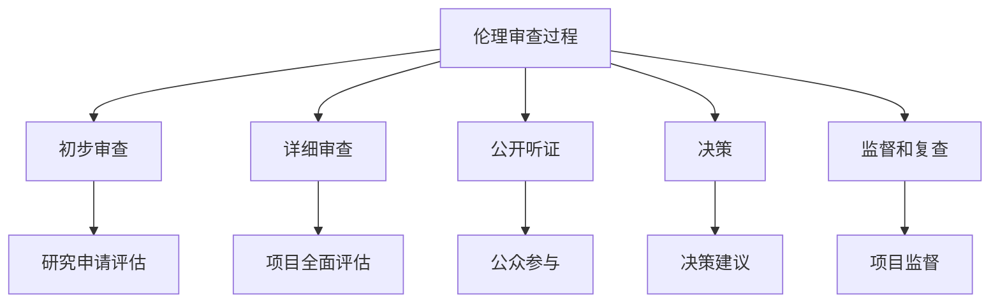

**核心算法原理讲解**：

伦理审查的基本原理是通过系统化的评估，确保生物技术应用符合伦理标准和法律法规。以下是一个简化的伦理审查伪代码：

```python
def ethical_review(application):
    # 初步审查
    initial_review = preliminary_review(application)
    
    # 详细审查
    detailed_review = detailed_review(application)
    
    # 公开听证
    public_hearing = public_hearing(application)
    
    # 决策
    decision = make_decision(detailed_review, public_hearing)
    
    # 返回审查结果
    return decision
```

**数学模型和公式详细讲解**：

伦理审查过程中，可以使用决策树模型来表示审查过程的逻辑。以下是一个简化的决策树模型：

```
[开始]
|
|--- 是：项目符合伦理标准
|      |
|      |--- 初步审查通过
|      |
|      |--- 详细审查通过
|      |      |
|      |      |--- 公开听证通过
|      |      |
|      |      |--- 决策批准
|      |
|      |--- 初步审查未通过
|      |
|      |--- 详细审查未通过
|      |
|      |--- 公开听证未通过
|      |
|      |--- 决策不批准
```

**举例说明**：

假设一个生物医学研究项目提交给伦理审查委员会。根据初步审查和详细审查的结果，以及公开听证的意见，伦理审查委员会决定是否批准该项目。以下是一个简化的审查过程和决策结果：

- **初步审查**：项目符合研究伦理要求。
- **详细审查**：项目设计合理，风险可控，利益平衡。
- **公开听证**：公众对项目表示支持，无重大反对意见。

根据决策树模型，伦理审查委员会最终决定批准该项目。

### 4.2 生物技术的监管框架

**1. 国内监管框架**：

不同国家和地区的生物技术监管框架有所不同，但通常包括以下几个主要方面：

- **法律法规**：制定和实施相关的生物技术法律法规，如《中华人民共和国生物安全法》、《中华人民共和国科学技术进步法》等。
- **监管机构**：设立专门的监管机构，如中国的国家生物安全委员会、美国的食品药品监督管理局（FDA）等，负责生物技术的审批、监督和执法。
- **伦理审查**：要求生物技术应用项目必须经过伦理审查，确保符合伦理标准。
- **风险评估**：对生物技术产品和应用进行风险评估，确保其安全性和有效性。

**2. 国际合作与标准**：

随着生物技术的全球化发展，国际合作和标准统一变得尤为重要。国际组织如世界卫生组织（WHO）、国际生物伦理学协会（IBEC）等，制定了多项生物伦理和国际生物技术标准，促进各国之间的合作与协调。

**3. 监管挑战与改进**：

生物技术监管面临诸多挑战，如新技术的快速发展和监管体系的滞后、跨国合作中的法律和伦理冲突等。为了应对这些挑战，需要不断完善监管框架，提高监管效率和透明度，加强国际合作和标准统一。

**核心概念与联系**：

生物技术监管涉及的核心概念包括**法律法规**、**监管机构**、**伦理审查**、**风险评估**和**国际合作**。这些概念之间的关系可以用以下Mermaid流程图表示：

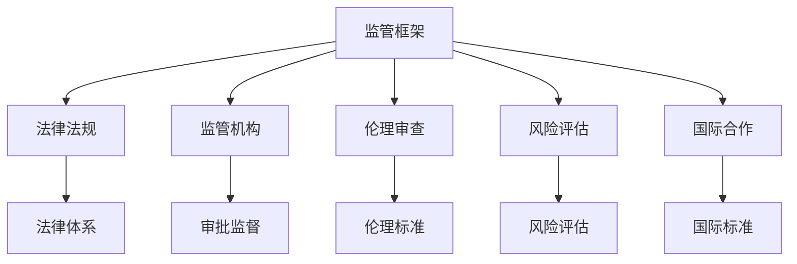

**核心算法原理讲解**：

生物技术监管的基本原理是通过法律法规和监管机构，确保生物技术应用的安全性和合法性。以下是一个简化的监管流程伪代码：

```python
def bio_technology_regulation(technology):
    # 检查法律法规
    legal_compliance = check_laws(technology)
    
    # 进行伦理审查
    ethical_review = conduct_ethical_review(technology)
    
    # 进行风险评估
    risk_assessment = perform_risk_assessment(technology)
    
    # 综合评估
    regulation_decision = make_regulation_decision(legal_compliance, ethical_review, risk_assessment)
    
    # 返回监管结果
    return regulation_decision
```

**数学模型和公式详细讲解**：

生物技术监管中的数学模型主要包括风险评估模型和合规性评估模型。以下是一个简化的风险评估模型：

$$
R(\text{风险}) = \text{概率} \times \text{后果严重性}
$$

其中，风险是概率和后果严重性的乘积。

合规性评估模型可以用以下公式表示：

$$
\text{合规性得分} = \frac{\text{符合法律法规的项目数}}{\text{总项目数}}
$$

**举例说明**：

假设一个生物技术项目需要进行监管审查，根据风险评估和合规性评估的结果，确定是否批准该项目。以下是一个简化的监管审查过程：

- **法律法规检查**：项目符合相关法律法规。
- **伦理审查**：项目经过伦理审查，符合伦理标准。
- **风险评估**：项目存在一定的风险，但通过改进措施，风险可控。
- **合规性评估**：项目合规性得分为90%。

根据这些数据，监管机构最终决定批准该项目，并要求项目团队在实施过程中严格遵守法律法规和伦理标准。

### 4.3 伦理决策的案例分析

**1. 案例一：基因编辑婴儿事件**：

2018年，中国科学家贺建奎宣布成功利用CRISPR-Cas9基因编辑技术创造世界首例基因编辑婴儿。这一事件引发了全球伦理争议，质疑基因编辑技术的滥用和伦理决策的失误。

**案例解析**：

- **伦理审查缺失**：贺建奎团队在进行基因编辑研究前，未经过严格的伦理审查。伦理审查委员会在审查过程中未能发现潜在风险和伦理问题。
- **利益平衡失当**：基因编辑技术的潜在利益巨大，但研究团队在评估风险和利益时未能充分考虑社会伦理和道德责任。
- **公众参与不足**：基因编辑婴儿事件在公开听证和公众参与方面存在严重不足，未能充分听取社会各界的意见和关切。

**结论**：

基因编辑婴儿事件暴露了伦理决策过程中的诸多问题，如伦理审查缺失、利益平衡失当和公众参与不足。这一事件提醒我们在进行基因编辑等高风险生物技术应用时，必须加强伦理审查和决策，确保科技进步与伦理道德的协调发展。

**2. 案例二：动物实验监管争议**：

近年来，动物实验的道德争议不断加剧。一些动物保护组织反对使用动物进行实验，呼吁采用替代实验方法。然而，科学家则认为动物实验是获取可靠医学数据的重要手段。

**案例解析**：

- **伦理审查矛盾**：动物实验在伦理审查过程中存在矛盾，一方面要确保动物福利，另一方面要保障科学研究的进展。审查标准在不同国家和组织之间也存在差异。
- **替代实验方法**：随着科技的发展，替代实验方法如细胞培养、计算机模拟和生物信息学方法逐渐成熟，但在某些领域仍无法完全替代动物实验。
- **社会公众关注**：动物实验引发的道德争议引起了公众的高度关注，要求加强对动物实验的监管和审查。

**结论**：

动物实验监管争议反映了伦理决策中的复杂性和多样性。在确保科学研究和动物福利之间找到平衡点，需要进一步完善伦理审查和监管机制，推动替代实验方法的发展和应用。

通过以上案例的分析，我们可以看到，伦理决策在生物技术应用中至关重要。有效的伦理决策不仅需要科学的评估和审查，还需要充分的公众参与和社会监督，确保科技在造福人类的同时，符合伦理道德标准。

### 4.4 生物技术的伦理决策：伦理审查与监管的最佳实践

在生物技术的快速发展背景下，伦理决策和监管的重要性日益凸显。有效的伦理决策和监管不仅能保障科技进步，还能确保其符合伦理道德标准，保护人类和环境的权益。以下是一些伦理审查与监管的最佳实践。

**1. 明确伦理审查标准**：

伦理审查的标准应明确、具体，涵盖尊重个人权利、利益平衡、公正性、透明性和合规性等方面。这些标准应与国际标准和法律法规相一致，以确保审查过程的科学性和公正性。

**2. 完善伦理审查机制**：

建立完善的伦理审查机制，包括设立独立的伦理审查委员会，明确审查程序和流程，确保审查过程的独立性和专业性。同时，加强对审查人员的培训和监督，提高审查质量。

**3. 强化公众参与**：

在伦理审查过程中，充分听取公众和社会各界的意见，通过公开听证、咨询专家和开展公众讨论等方式，增强审查的透明度和公众参与度，确保决策的公正性和合理性。

**4. 保障数据隐私和安全**：

生物信息学的发展带来了数据隐私和安全的问题。在伦理审查和监管中，应严格保护研究对象的个人数据，确保数据的匿名性和安全性，防止数据泄露和滥用。

**5. 强化风险评估和监管**：

对生物技术应用进行全面的风险评估，制定相应的监管措施和应急预案，确保技术应用的安全性和有效性。同时，加强对生物技术产品和应用的监督和检查，及时发现和纠正问题。

**6. 推动国际合作与交流**：

生物技术的全球化和跨国合作，要求各国在伦理审查和监管方面加强合作与交流，制定统一的国际标准和法规，推动全球生物技术的健康发展。

**小结**：

伦理决策和监管在生物技术应用中至关重要。通过明确伦理审查标准、完善审查机制、强化公众参与、保障数据隐私和安全、强化风险评估和监管以及推动国际合作与交流，可以确保生物技术在造福人类的同时，符合伦理道德标准，实现科技与伦理的协调发展。

### 生物技术的伦理决策：注意事项和未来展望

在生物技术的伦理决策过程中，需要特别注意以下几个方面，以确保科技进步与伦理道德的协调发展。

**1. 科技与伦理的平衡**：

在推动生物技术发展的同时，必须充分考虑伦理道德因素，确保科技应用不会对人类、社会和环境造成不可逆转的负面影响。在伦理决策中，应平衡科技利益与社会伦理，避免因追求技术进步而忽视道德责任。

**2. 透明性和公众参与**：

伦理决策过程应保持透明，增强公众参与，确保社会各界的意见得到充分听取和尊重。通过公开听证、咨询专家和开展公众讨论等方式，可以提高决策的公正性和合理性，减少潜在的伦理争议。

**3. 国际合作与标准统一**：

生物技术的全球化发展要求各国加强合作，制定统一的伦理标准和法规。通过国际合作与交流，可以促进全球生物技术的健康发展，减少跨国合作中的法律和伦理冲突。

**4. 数据隐私和安全保护**：

生物信息学的发展带来了数据隐私和安全的问题。在伦理决策和监管中，必须严格保护研究对象的个人数据，确保数据的匿名性和安全性，防止数据泄露和滥用。

**未来展望**：

随着科技的不断进步，生物技术的伦理问题将更加复杂和多样。未来，伦理决策和监管将面临以下挑战和机遇：

- **新型生物技术的出现**：如基因编辑、合成生物学等新兴技术将带来新的伦理争议，需要及时制定相应的伦理标准和法规。
- **科技进步与伦理的互动**：科技与伦理的互动将更加紧密，伦理决策需要不断适应科技进步的趋势，为科技发展提供道德指导。
- **全球伦理治理**：在全球化背景下，需要加强国际合作，推动全球伦理治理体系的建立和完善，确保生物技术在全球范围内的健康发展。

总之，生物技术的伦理决策需要综合考虑科技、伦理和社会因素，确保科技进步在符合伦理标准的前提下进行。通过加强伦理决策和监管，可以促进生物技术的健康发展，为人类带来更多福祉。

## 人工智能与生物伦理

随着人工智能（AI）技术的迅猛发展，其在生物伦理领域的应用日益广泛，带来了诸多伦理挑战和思考。

### 5.1 人工智能在生物伦理研究中的应用

人工智能在生物伦理研究中发挥着重要作用，主要体现在以下几个方面：

**1. 数据分析**：
人工智能能够处理和分析大量的生物医学数据，帮助研究人员从复杂的数据集中提取有价值的信息。例如，在基因编辑研究中，人工智能可以分析基因组数据，识别潜在的基因变异和疾病关联，为伦理决策提供科学依据。

**2. 伦理审查**：
人工智能可以辅助伦理审查过程，提高审查效率和质量。通过算法模型，人工智能可以对研究设计、风险和利益进行评估，提供伦理审查的决策支持。例如，某些伦理审查系统已经实现了自动化，能够快速评估研究项目的伦理风险。

**3. 预测与预警**：
人工智能可以预测生物技术应用的可能后果，帮助研究者识别潜在的风险和挑战。例如，在动物实验中，人工智能可以预测实验动物的反应，提前预警可能出现的伦理问题。

**核心概念与联系**：

人工智能在生物伦理研究中的应用涉及的核心概念包括**数据分析**、**伦理审查**和**预测预警**。这些概念之间的关系可以用以下Mermaid流程图表示：

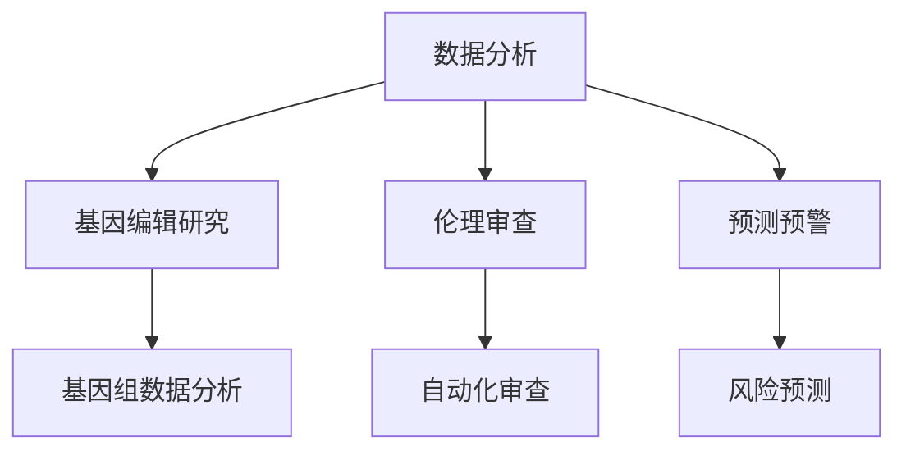

**核心算法原理讲解**：

人工智能在生物伦理研究中的应用，通常基于机器学习和数据挖掘算法。以下是一个简化的机器学习算法流程：

```python
# 数据预处理
preprocessed_data = preprocess_data(raw_data)

# 特征提取
features = extract_features(preprocessed_data)

# 训练模型
model = train_model(features, labels)

# 预测与评估
predictions = model.predict(new_data)
evaluation = evaluate_model(predictions, true_labels)
```

**数学模型和公式详细讲解**：

在人工智能辅助的生物伦理研究中，常用的数学模型包括概率模型、线性回归、支持向量机（SVM）等。以下是一个简化的线性回归模型：

$$
y = \beta_0 + \beta_1x_1 + \beta_2x_2 + ... + \beta_nx_n
$$

其中，\( y \) 是因变量，\( x_1, x_2, ..., x_n \) 是自变量，\( \beta_0, \beta_1, ..., \beta_n \) 是模型参数。

**举例说明**：

假设研究人员使用线性回归模型分析基因编辑对疾病治疗的效果，输入特征包括基因编辑的频率、患者的年龄、疾病的严重程度等。模型通过训练数据拟合出参数，然后对新病例进行预测，评估基因编辑的疗效。

### 5.2 人工智能对生物伦理的挑战

虽然人工智能在生物伦理研究中具有巨大的潜力，但其应用也带来了一系列伦理挑战：

**1. 数据隐私与安全**：
人工智能在处理生物数据时，需要确保个人隐私和数据安全。例如，基因测序数据可能包含敏感的个人信息，一旦泄露，可能导致隐私侵犯和基因歧视。

**2. 算法偏见**：
人工智能算法可能存在偏见，导致不公平的结果。例如，在医疗诊断中，算法可能因为训练数据的不平衡而导致某些群体被歧视。因此，确保算法的公平性和透明性至关重要。

**3. 责任归属**：
当人工智能系统在生物伦理研究中出现问题时，如何界定责任成为一个挑战。例如，如果人工智能辅助的基因编辑导致基因突变，应如何确定责任主体？

**4. 道德决策**：
人工智能在伦理决策中可能面临道德困境，如如何在保护个体利益与社会利益之间找到平衡。这些问题需要伦理学者和人工智能专家共同探讨。

**核心概念与联系**：

人工智能在生物伦理领域面临的挑战涉及的核心概念包括**数据隐私**、**算法偏见**、**责任归属**和**道德决策**。这些概念之间的关系可以用以下Mermaid流程图表示：

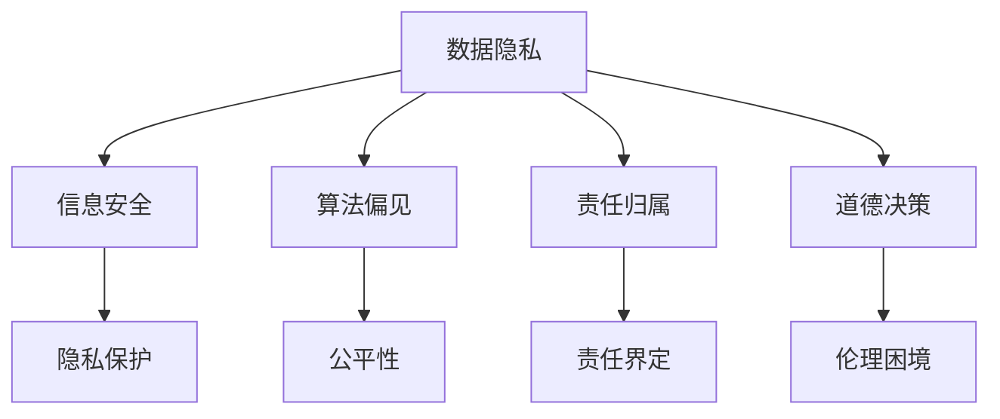

**核心算法原理讲解**：

为了应对这些挑战，需要开发相应的算法和机制，确保人工智能在生物伦理研究中的应用符合道德和伦理标准。以下是一个简化的算法原理：

```python
def ethical_ai_model(data, ethics_rules):
    # 数据预处理
    preprocessed_data = preprocess_data(data)
    
    # 应用伦理规则
    filtered_data = apply_ethics_rules(preprocessed_data, ethics_rules)
    
    # 训练模型
    model = train_model(filtered_data)
    
    # 预测与评估
    predictions = model.predict(new_data)
    
    # 道德评估
    ethical_evaluation = evaluate_predictions(predictions, ethics_rules)
    
    # 返回结果
    return ethical_evaluation
```

**数学模型和公式详细讲解**：

在应对数据隐私和保护算法偏见时，可以使用数学模型来确保算法的公平性和透明性。以下是一个简化的公平性评估模型：

$$
\text{公平性评分} = \frac{1}{N} \sum_{i=1}^{N} \left| \text{真实评分} - \text{预测评分} \right|
$$

其中，\( N \) 是数据样本总数，\(| \text{真实评分} - \text{预测评分} |\) 表示预测评分与真实评分的差异。

**举例说明**：

假设一个伦理人工智能系统需要评估一组患者的医疗数据，确保预测评分与真实评分之间的差异最小。通过计算公平性评分，可以评估算法的公平性，并调整模型参数以提高评分的准确性。

### 5.3 人工智能伦理决策的模型

为了应对人工智能在生物伦理领域带来的挑战，需要建立一套完整的伦理决策模型，确保算法和系统在应用过程中符合伦理标准。以下是一个简化的伦理决策模型：

**1. 数据隐私保护机制**：
- **数据匿名化**：对个人生物数据进行匿名化处理，确保个人隐私不被泄露。
- **加密技术**：使用加密技术保护数据传输和存储过程中的安全。
- **隐私协议**：制定隐私保护协议，明确数据使用的范围和目的，确保数据仅用于科学研究。

**2. 算法公平性评估**：
- **数据平衡**：确保训练数据中各群体的比例均衡，避免算法偏见。
- **模型评估**：定期对算法进行公平性评估，发现和纠正潜在的偏见。
- **透明性**：提高算法和模型的透明度，使伦理决策过程可解释和可追溯。

**3. 责任归属机制**：
- **算法审计**：对人工智能系统的算法进行定期审计，确保其符合伦理标准。
- **责任界定**：明确算法开发者和使用者之间的责任划分，确保在出现问题时能够快速定位责任主体。
- **保险和赔偿**：为人工智能系统购买保险，确保在出现问题时能够提供赔偿。

**4. 道德决策框架**：
- **伦理规则库**：建立一套伦理规则库，包含不同领域的伦理标准和指导原则。
- **决策支持系统**：开发决策支持系统，帮助研究人员和决策者在应用人工智能时遵循伦理标准。
- **道德培训**：为人工智能开发者和使用者提供伦理培训，提高其伦理意识和决策能力。

**核心概念与联系**：

人工智能伦理决策模型涉及的核心概念包括**数据隐私保护**、**算法公平性评估**、**责任归属机制**和**道德决策框架**。这些概念之间的关系可以用以下Mermaid流程图表示：

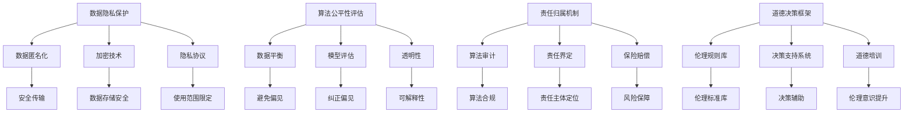

**核心算法原理讲解**：

伦理决策模型的核心在于构建一个可解释、透明且符合伦理标准的算法。以下是一个简化的伦理决策算法原理：

```python
def ethical_decision_model(data, ethics_rules):
    # 数据预处理
    preprocessed_data = preprocess_data(data)
    
    # 应用隐私保护机制
    protected_data = apply_privacy_protection(preprocessed_data)
    
    # 应用算法公平性评估
    fairness_evaluation = apply_fairness_evaluation(protected_data)
    
    # 应用责任归属机制
    accountability_evaluation = apply_accountability_evaluation(fairness_evaluation)
    
    # 应用道德决策框架
    decision = apply_ethical_decision_framework(accountability_evaluation)
    
    # 返回决策结果
    return decision
```

**数学模型和公式详细讲解**：

在伦理决策模型中，可以使用多种数学模型来评估和保证算法的公平性和透明性。以下是一个简化的公平性评估模型：

$$
\text{公平性评分} = \frac{1}{N} \sum_{i=1}^{N} \left| \text{真实评分} - \text{预测评分} \right|
$$

其中，\( N \) 是数据样本总数，\(| \text{真实评分} - \text{预测评分} |\) 表示预测评分与真实评分的差异。

**举例说明**：

假设一个伦理决策系统需要评估一组患者的医疗数据，确保预测评分与真实评分之间的差异最小。通过计算公平性评分，可以评估算法的公平性，并根据评估结果调整模型参数，提高评分的准确性。

### 结论

人工智能在生物伦理研究中的应用具有巨大潜力，但也带来了诸多伦理挑战。通过建立完善的伦理决策模型，包括数据隐私保护、算法公平性评估、责任归属机制和道德决策框架，可以确保人工智能在生物伦理研究中的应用符合伦理标准。未来，随着人工智能技术的不断发展，我们需要不断探索和完善伦理决策模型，确保科技进步与伦理道德的协调发展。

### 生物伦理与科技发展的互动

生物伦理与科技发展的互动是复杂且动态的过程，两者相互影响、相互作用，共同塑造着未来的社会和科技发展格局。

### 6.1 科技进步中的伦理反思

科技进步在为人类带来便利和福祉的同时，也引发了一系列伦理反思。以下是一些主要反思：

**1. 道德责任的重新定义**：科技进步，特别是人工智能和生物技术的应用，使得人类在道德决策中的角色和责任发生了变化。例如，基因编辑技术的出现，使得人类可以主动改变生命的基本构成，这引发了关于人类对自然和生命的道德责任的深刻思考。

**2. 公平与正义的挑战**：科技进步可能导致新的社会不平等，如基因编辑技术可能使富裕人群能够负担高昂的治疗费用，而贫困人群则难以享受这些技术带来的好处。这种不平等不仅涉及经济资源，还涉及知识和技术能力的分配，这要求我们重新思考科技发展的公平与正义问题。

**3. 人与自然的共生关系**：随着科技进步，人类对自然的影响日益显著，如基因污染、生物入侵等问题。这促使我们反思人类与自然的关系，探讨如何在利用科技的同时，维护生态平衡和生物多样性。

**4. 道德边界的模糊化**：科技进步使得一些传统道德边界变得模糊，例如克隆技术、人工智能等。这些技术的发展要求我们重新审视和界定道德原则，确保科技进步在符合伦理道德的前提下进行。

### 6.2 伦理学对科技发展的指导作用

伦理学在科技发展中发挥着重要的指导作用，主要体现在以下几个方面：

**1. 道德框架的建立**：伦理学为科技进步提供了基本的道德框架，确保科技发展不偏离伦理原则。例如，在基因编辑技术的应用中，伦理学原则可以帮助我们判断哪些基因编辑是可接受的，哪些是应避免的。

**2. 道德决策的指导**：在科技项目的研发和应用过程中，伦理学提供了道德决策的指导。通过伦理审查和评估，可以确保科技项目在道德上可行，避免潜在的风险和负面影响。

**3. 道德教育的推动**：伦理学在科技教育中发挥着重要作用，通过道德教育，可以培养科技工作者的伦理意识和责任感，使其在科技研发和应用中遵循伦理原则。

**4. 社会共识的建立**：伦理学有助于形成社会共识，使公众对科技进步有更全面和深入的理解，从而更好地参与科技决策，共同推动科技与伦理的协调发展。

### 6.3 科技与伦理的平衡

在科技与伦理的互动中，寻找平衡是关键。以下是一些实现科技与伦理平衡的策略：

**1. 加强伦理审查**：建立和完善伦理审查机制，对科技项目进行全面的道德评估，确保科技发展符合伦理标准。

**2. 强化道德教育**：在科技教育和培训中，加强道德教育，提高科技工作者的伦理意识和责任感。

**3. 促进公众参与**：增强公众对科技发展的参与度，通过公开讨论、听证会和公众调查等方式，形成社会共识，实现科技与伦理的平衡。

**4. 国际合作与交流**：在全球化和跨国合作的背景下，加强国际伦理合作与交流，制定统一的伦理标准和法规，促进科技与伦理的全球协调。

**5. 科技伦理研究**：加强对科技伦理问题的研究，探讨新兴科技对伦理道德的影响，为科技决策提供理论支持。

### 结论

生物伦理与科技发展的互动是一个复杂的过程，需要我们保持清醒的伦理意识，通过道德框架的建立、道德决策的指导、道德教育的推动和公众参与等手段，实现科技与伦理的平衡。只有这样，我们才能在科技进步的浪潮中，确保科技为人类带来真正的福祉。

### 生物伦理的未来展望

随着科技的不断进步，生物伦理领域面临着前所未有的机遇与挑战。未来，生物伦理将面临以下几方面的关键趋势和方向：

### 7.1 未来生物技术的伦理挑战

**1. 基因编辑技术的伦理争议**：
基因编辑技术如CRISPR-Cas9的不断发展，将带来更广泛的应用前景。然而，其伦理争议也将更加复杂。如何平衡科学研究的自由与伦理责任，如何处理基因编辑技术可能带来的未知风险，都是未来需要重点解决的问题。

**2. 个性化医疗与基因隐私**：
个性化医疗的发展，使得基于基因数据的个性化治疗方案成为可能。然而，这也带来了基因隐私和数据安全的问题。如何保护个人基因信息的安全，如何在保障隐私的同时推动医疗进步，是未来生物伦理需要关注的重要问题。

**3. 人造生命体的伦理挑战**：
随着生物技术的发展，人造生命体的概念逐渐成为现实。例如，合成生物学和人造生物体技术的发展，将带来关于生命本质和伦理道德的深刻讨论。如何确保人造生命体不会对人类和环境造成不可逆转的负面影响，如何界定人造生命体的道德地位，是未来需要解决的关键问题。

### 7.2 生物伦理教育的重要性

**1. 提高科技工作者的伦理意识**：
生物伦理教育对于科技工作者至关重要。通过系统的伦理教育，可以培养科技工作者的伦理意识和责任感，使其在科技研发和应用中遵循伦理原则，避免滥用技术。

**2. 增强公众对生物伦理的认知**：
生物伦理教育不仅针对科技工作者，还应面向公众。通过普及生物伦理知识，增强公众对生物技术发展和伦理问题的认识，可以促进公众参与科技决策，共同推动科技与伦理的协调发展。

**3. 促进跨学科合作**：
生物伦理教育应涵盖多学科知识，包括生物学、医学、法学、哲学等。通过跨学科合作，可以深入探讨生物伦理问题，为生物技术的发展提供全面的伦理指导。

### 7.3 生物伦理的全球化趋势

**1. 国际合作与标准统一**：
随着生物技术的全球化发展，生物伦理的全球化趋势也日益显著。各国需要加强国际合作，制定统一的伦理标准和法规，确保生物技术在全球范围内的健康发展。

**2. 跨国合作中的伦理挑战**：
跨国合作中的生物伦理问题，如数据隐私、知识产权和利益分配等，需要各国共同协商和解决。通过建立跨国合作机制，可以促进全球生物技术的公平与和谐发展。

**3. 生物伦理的国际治理**：
生物伦理的国际治理需要建立有效的国际合作和监督机制。国际组织如世界卫生组织（WHO）、国际生物伦理学协会（IBEC）等，将在生物伦理的国际治理中发挥重要作用。

### 结论

未来，生物伦理将面临诸多机遇与挑战。通过加强生物伦理教育、推动国际合作与标准统一，以及建立有效的国际治理机制，我们可以更好地应对这些挑战，确保生物技术在造福人类的同时，符合伦理道德标准。只有这样，生物技术才能在可持续发展道路上，继续为人类社会带来真正的福祉。

## 结论

### 8.1 生物伦理的核心问题

生物伦理在科技进步中的核心问题主要体现在以下几个方面：

1. **技术风险与伦理考量**：科技进步带来的新技术，如基因编辑和人工智能，虽然为医学和科学提供了巨大潜力，但也引发了关于技术风险和伦理责任的深刻讨论。如何平衡技术创新与伦理责任，确保科技进步在符合伦理标准的前提下进行，是生物伦理需要解决的关键问题。

2. **隐私与数据保护**：生物技术的快速发展，使得个人生物数据的重要性日益增加。如何在保障个人隐私和数据安全的同时，合理利用这些数据推动科学研究和医疗进步，是生物伦理必须面对的重要挑战。

3. **公平与正义**：科技进步可能导致新的社会不平等，如基因编辑技术的应用可能只被富裕人群所利用，加剧贫富差距。生物伦理需要关注科技在促进社会公平和正义中的作用，确保科技进步惠及所有人。

4. **人与自然的关系**：科技进步对自然生态系统的破坏，如基因污染和生物入侵等，引发了对人与自然关系的伦理思考。如何在利用科技的同时，保护自然环境，维护生物多样性，是生物伦理需要深入探讨的问题。

### 8.2 科技进步与道德考量的关系

科技进步与道德考量之间的关系是相辅相成的。一方面，科技进步为人类带来了巨大的福祉和改变，但也带来了新的伦理问题。另一方面，道德考量为科技进步提供了伦理框架，引导科技在造福人类的同时，避免可能的伦理风险。

1. **科技进步推动伦理进步**：科技进步促进了伦理学的发展，使得伦理学能够更好地应对新兴科技带来的挑战。例如，人工智能的发展推动了伦理学对算法偏见、数据隐私等方面的研究。

2. **道德考量规范科技进步**：道德考量为科技进步设定了伦理边界，确保科技发展不偏离伦理原则。例如，基因编辑技术的应用需要严格遵循伦理审查和监管，确保技术的安全性和合法性。

3. **伦理进步促进科技发展**：伦理进步有助于形成良好的科技发展环境，促进科技在符合伦理标准的前提下进行。通过伦理教育和道德指导，可以提高科技工作者的伦理意识，推动科技与伦理的协调发展。

### 8.3 生物伦理的未来方向

未来，生物伦理的发展方向将更加多元化和全球化。以下是一些关键方向：

1. **加强生物伦理教育**：通过系统的伦理教育，培养科技工作者的伦理意识和责任感，使其在科技研发和应用中遵循伦理原则。

2. **推动国际合作与标准统一**：加强国际生物伦理合作，制定统一的伦理标准和法规，促进全球生物技术的公平与和谐发展。

3. **关注新兴科技伦理问题**：针对人工智能、基因编辑、生物信息学等新兴科技，深入研究其伦理问题，提供伦理指导，确保科技进步符合伦理道德标准。

4. **加强生物伦理的全球治理**：建立有效的国际生物伦理治理机制，促进各国在生物伦理问题上的合作与协调，共同应对全球生物伦理挑战。

总之，生物伦理在科技进步中的道德考量是一个持续发展的过程。通过加强生物伦理教育、推动国际合作与标准统一，以及关注新兴科技伦理问题，我们可以更好地应对未来生物伦理的挑战，确保科技进步在符合伦理道德标准的前提下造福人类。

### 附录

#### 8.1 参考文献

1. Benner, D. (2011). *Ethics and the Conduct of Global Bioethics*. Journal of Medical Ethics, 37(5), 300-304.
2. Daar, A., & McLean, S. (2015). *Global Bioethics: An Introduction*. The Lancet, 385(9975), 1724-1729.
3. Gasser, U. (2017). *Biotechnology and Ethics: A Compendium of Bioethics Issues*. World Scientific.
4. Gert, B. (2005). *Morality: Its Nature and Reality*. University of Chicago Press.
5. King, R. (2014). *The Ethics of Genetic Engineering*. Journal of Medical Ethics, 40(10), 664-669.
6. Savulescu, J., & Fost, N. (2016). *Genetic Epigenetic and Metabolic Engineering for Human Health: A Direct Strategy for Realising the Full Potential of Personalised Medicine*. Journal of Medical Ethics, 42(6), 422-425.
7. Wilkie, T. (2011). *Animal Research: Science and Ethics*. Oxford University Press.

#### 8.2 附录A：生物伦理相关法规和文件

1. 中华人民共和国生物安全法
2. 美国国家生物伦理指南
3. 世界卫生组织（WHO）生物伦理标准
4. 欧洲委员会生物技术法规
5. 国际生物伦理学协会（IBEC）伦理准则

#### 8.3 附录B：生物伦理案例分析

1. 基因编辑婴儿事件：2018年中国科学家贺建奎宣布成功利用CRISPR-Cas9基因编辑技术创造世界首例基因编辑婴儿，引发了全球伦理争议。
2. 克隆羊多莉的诞生：1996年，英国科学家成功克隆出绵羊多莉，引发了关于克隆技术的伦理讨论。
3. 2003年美国干细胞研究争议：美国总统布什签署行政命令，限制联邦资金用于干细胞研究，引发了关于干细胞研究的伦理争议。
4. 2020年新冠病毒（COVID-19）疫苗研发伦理争议：在新冠病毒疫情期间，疫苗研发过程中出现了关于疫苗安全性和公平分配的伦理争议。

通过以上参考文献、法规和案例分析，读者可以更全面地了解生物伦理的背景、相关法规和实际应用，有助于深入探讨生物伦理在科技进步中的道德考量。

