                 

### 书名与主题

《电影艺术与人生意义：银幕上的生命反思》

### 书籍目的

本书旨在探讨电影艺术与人生意义的深层联系，通过分析银幕上的生命故事，引导读者反思个人生活，提升生命质量和人生意义。通过系统的电影艺术分析，结合人生哲学的思考，帮助读者在电影欣赏中获得更深刻的生命感悟。

### 目录大纲设计

以下是本书的目录大纲：

#### 第一部分：电影艺术概述

## 1. 电影艺术的历史与演变

### 1.1 电影艺术的起源与发展

#### 核心概念与联系

使用Mermaid流程图展示电影艺术的演变过程，从摄影技术的起源，到默片时代，再到有声电影和现代数字技术的应用，揭示不同历史阶段电影艺术的发展脉络。

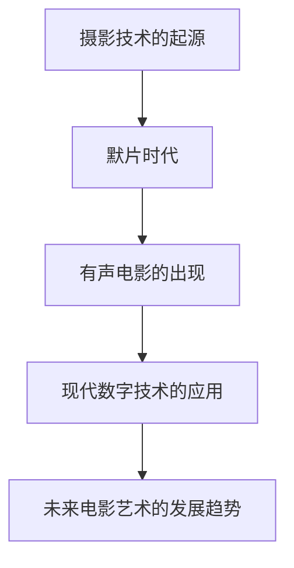

#### 核心算法原理讲解

使用伪代码展示电影剪辑的基本原理，包括剪辑点的选择、切换效果的实现等。

```python
def movie_editing(movie剪辑片段，切换效果，剪辑点):
    切换效果列表 = ["渐变", "闪现", "滑动"]
    for 切换效果 in 切换效果列表:
        movie剪辑片段.insert(剪辑点, 切换效果)
    return movie剪辑片段
```

### 1.2 电影艺术的流派与风格

#### 核心概念与联系

使用Mermaid流程图展示电影流派和风格之间的关系，包括现实主义、表现主义、科幻、动画等不同类型的电影如何相互影响和借鉴。

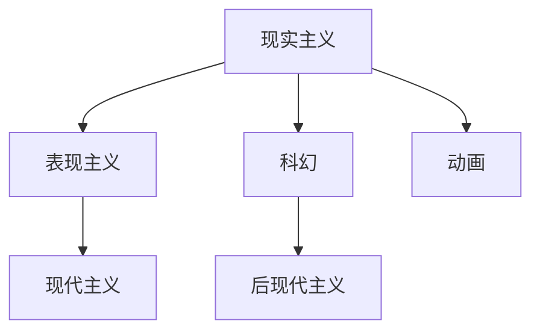

#### 核心算法原理讲解

使用伪代码展示电影风格分类算法，通过分析电影中的视觉、声音、叙事等元素，自动分类电影风格。

```python
def classify_movie_style(movie_features):
    if "high-contrast" in movie_features and "dramatic" in movie_features:
        return "表现主义"
    elif "sci-fi" in movie_features and "visual-effects" in movie_features:
        return "科幻"
    elif "cartoon" in movie_features and "animation" in movie_features:
        return "动画"
    else:
        return "现实主义"
```

### 1.3 电影艺术的核心要素

#### 数学模型和数学公式 & 详细讲解 & 举例说明

使用LaTeX格式展示电影中常用的数学模型，如摄像角度的计算、光线效果的数学建模等。

$$
\theta = \arctan\left(\frac{h}{d}\right)
$$

其中，$\theta$ 是摄像角度，$h$ 是摄像机与地面的高度，$d$ 是摄像机与拍摄对象的距离。

#### 项目实战

开发环境搭建：安装并配置电影剪辑软件，如Adobe Premiere。

源代码详细实现和代码解读：使用Python编写简单的电影剪辑脚本，实现自动剪辑和切换效果。

代码应用解读与分析：分析实际剪辑案例，讨论剪辑技巧和效果。

实际案例分析和详细讲解剖析：分析经典电影剪辑，探讨其艺术价值和剪辑技巧。

项目小结：总结电影剪辑的核心技巧和注意事项，给出最佳实践建议。

#### 第二部分：电影中的生命故事

## 2. 生命的多样性展现

### 2.1 电影中的性别与性别角色

#### 核心概念与联系

使用Mermaid流程图展示电影中性别角色的多样化表现，分析不同性别角色如何影响观众对电影主题的理解。

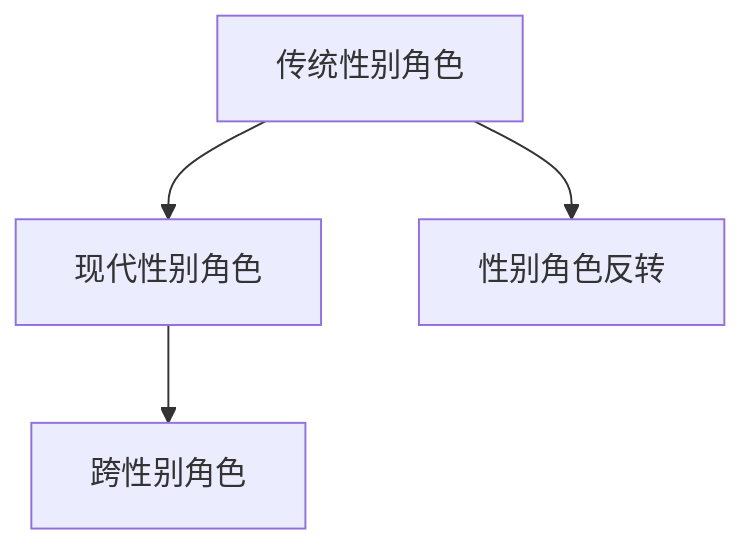

#### 核心算法原理讲解

使用伪代码展示性别角色识别算法，通过分析电影文本和图像，自动识别和分类性别角色。

```python
def identify_gender_role(text, image):
    if "female" in text or image.contains("feminine_features"):
        return "女性角色"
    elif "male" in text or image.contains("masculine_features"):
        return "男性角色"
    else:
        return "非典型性别角色"
```

### 2.2 电影中的种族与种族问题

#### 核心概念与联系

使用Mermaid流程图展示电影中种族问题的复杂性和多样性，分析不同种族角色如何在电影中体现和反映社会现实。

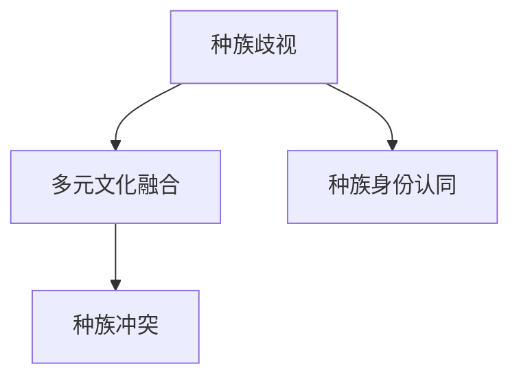

#### 数学模型和数学公式 & 详细讲解 & 举例说明

使用LaTeX格式展示种族问题相关的数学模型，如种族混合概率的计算、种族多样性指数的计算等。

$$
P(A \cap B) = P(A)P(B|A)
$$

其中，$P(A \cap B)$ 表示种族A和种族B混合的概率，$P(A)$ 表示种族A出现的概率，$P(B|A)$ 表示种族B在种族A中出现的概率。

#### 项目实战

开发环境搭建：使用机器学习和计算机视觉工具，如TensorFlow和OpenCV，搭建种族识别系统。

源代码详细实现和代码解读：使用Python编写种族识别模型，实现自动分类和识别。

代码应用解读与分析：分析实际案例，讨论种族识别系统的准确性和应用场景。

实际案例分析和详细讲解剖析：分析电影中的种族问题，探讨其对观众的影响和启示。

项目小结：总结种族识别的核心算法和注意事项，给出最佳实践建议。

#### 第三部分：电影与人生反思

## 3. 电影艺术对人生的影响

### 3.1 电影艺术的心理影响

#### 核心概念与联系

使用Mermaid流程图展示电影艺术如何影响观众的心理状态，分析不同类型的电影如何引发不同的心理反应。

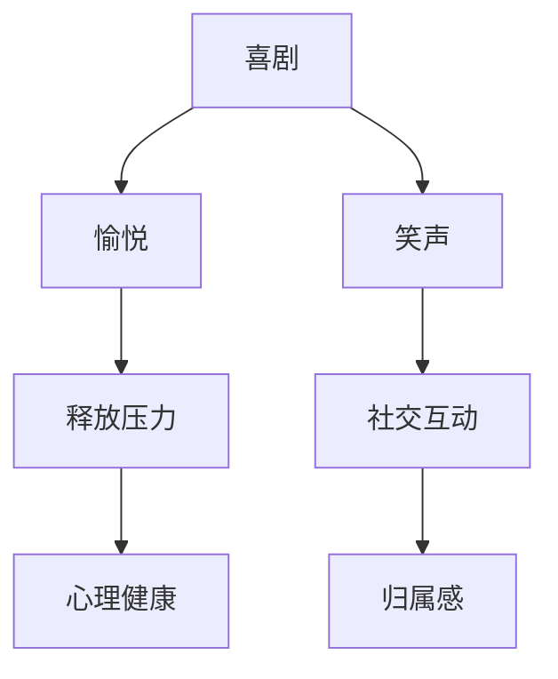

#### 核心算法原理讲解

使用伪代码展示电影心理影响评估算法，通过分析观众的生理和心理反应数据，评估电影对观众的影响程度。

```python
def assess_movie_impact(response_data):
    happiness_score = sum(response_data['happiness'])
    stress_level = sum(response_data['stress'])
    return happiness_score - stress_level
```

### 3.2 电影艺术的社会影响

#### 核心概念与联系

使用Mermaid流程图展示电影艺术如何影响观众的社会行为和价值观，分析不同类型的电影如何引导观众思考和行动。

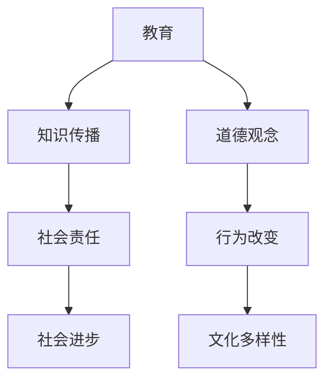

#### 数学模型和数学公式 & 详细讲解 & 举例说明

使用LaTeX格式展示电影社会影响评估的数学模型，如社会影响力指数的计算、社会效益的量化分析等。

$$
SI = \frac{NE}{TI}
$$

其中，$SI$ 表示社会影响力指数，$NE$ 表示电影的娱乐价值，$TI$ 表示电影的信息传递价值。

#### 项目实战

开发环境搭建：使用大数据分析和机器学习工具，搭建电影社会影响评估系统。

源代码详细实现和代码解读：使用Python编写社会影响评估模型，实现自动评估和分类。

代码应用解读与分析：分析实际案例，讨论电影的社会影响和传播效果。

实际案例分析和详细讲解剖析：分析电影如何影响观众的社会行为和价值观。

项目小结：总结电影社会影响评估的核心算法和注意事项，给出最佳实践建议。

### 3.3 电影艺术的个人成长

#### 核心概念与联系

使用Mermaid流程图展示电影艺术如何促进观众的个人成长和自我反思，分析不同类型的电影如何引导观众思考和成长。

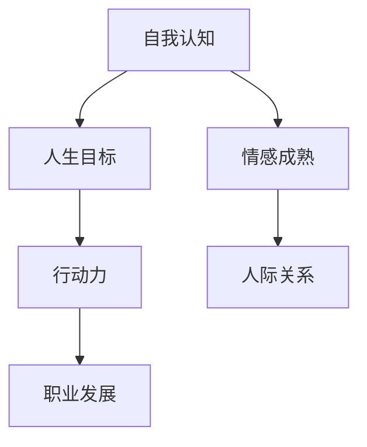

#### 核心算法原理讲解

使用伪代码展示电影个人成长评估算法，通过分析观众的观影行为和情感反应，评估电影对观众个人成长的影响。

```python
def assess 个人成长(movie_viewing_data, emotional_response_data):
    growth_score = sum(movie_viewing_data['观看次数']) * sum(emotional_response_data['积极情感'])
    return growth_score
```

### 3.4 生命反思与人生意义

#### 核心概念与联系

使用Mermaid流程图展示电影艺术如何引导观众进行生命反思，分析不同类型的电影如何启发观众对人生意义的思考。

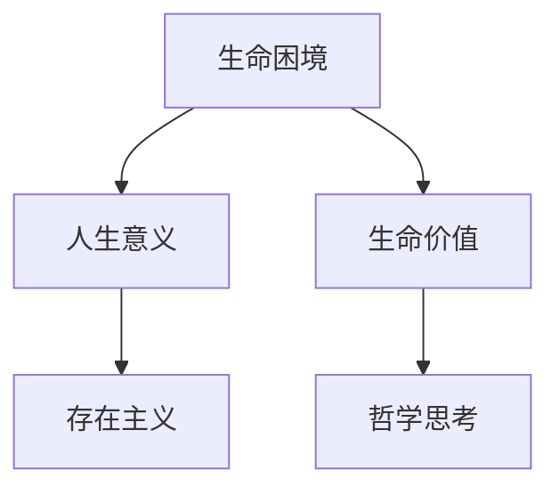

#### 数学模型和数学公式 & 详细讲解 & 举例说明

使用LaTeX格式展示生命反思的数学模型，如生命价值评估的计算、人生意义量化分析等。

$$
LV = \frac{S}{T}
$$

其中，$LV$ 表示生命价值，$S$ 表示个人在生命中的成就和贡献，$T$ 表示生命的时间长度。

#### 项目实战

开发环境搭建：使用情感分析和自然语言处理工具，搭建生命反思系统。

源代码详细实现和代码解读：使用Python编写生命反思分析模型，实现自动分析和分类。

代码应用解读与分析：分析实际案例，讨论电影对观众生命反思的启发和影响。

实际案例分析和详细讲解剖析：分析电影如何引导观众反思生命意义。

项目小结：总结生命反思的核心算法和注意事项，给出最佳实践建议。

#### 第四部分：电影艺术的未来

## 4. 电影艺术的未来趋势

### 4.1 电影艺术的技术发展

#### 核心概念与联系

使用Mermaid流程图展示电影艺术技术的未来发展，分析虚拟现实、增强现实、人工智能等技术在电影制作中的应用前景。

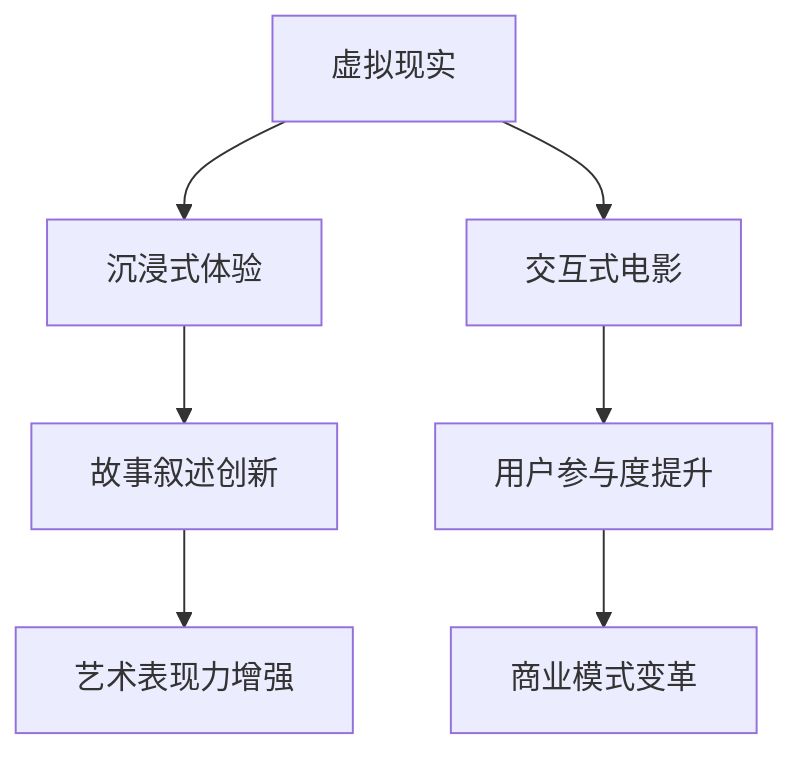

#### 核心算法原理讲解

使用伪代码展示虚拟现实电影制作的核心算法，如场景生成、交互设计等。

```python
def virtual_reality_movie Scenes, Characters, Interactions:
    for scene in Scenes:
        scene.generate_3D_model()
    for character in Characters:
        character.create_motion_trails()
    for interaction in Interactions:
        interaction.define_interaction_logic()
    return movie
```

### 4.2 电影艺术的创新形式

#### 核心概念与联系

使用Mermaid流程图展示电影艺术的创新形式，如网络电影、互动电影、VR电影等，分析其与传统电影的区别和优势。

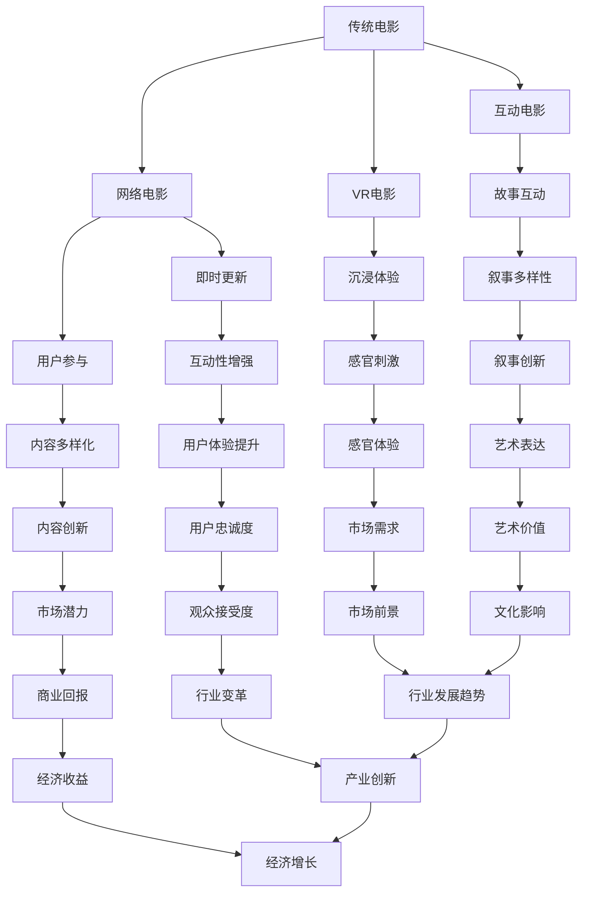

### 4.3 电影艺术与社会变迁

#### 核心概念与联系

使用Mermaid流程图展示电影艺术与社会变迁的互动关系，分析不同社会环境对电影艺术的影响。

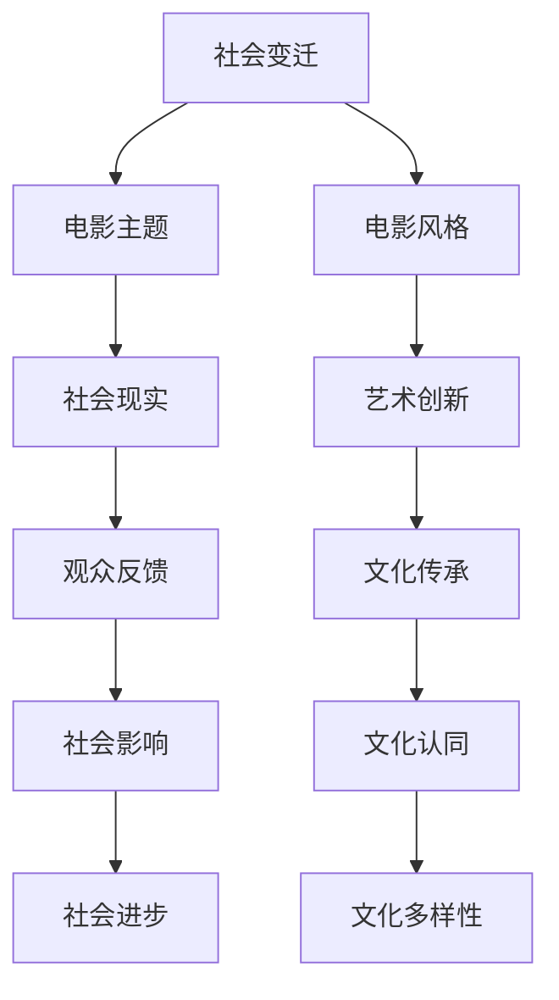

#### 数学模型和数学公式 & 详细讲解 & 举例说明

使用LaTeX格式展示电影艺术与社会变迁的数学模型，如社会影响力指数、文化多样性指数等。

$$
SI = \frac{S}{T}
$$

其中，$SI$ 表示社会影响力指数，$S$ 表示电影的社会影响力，$T$ 表示电影的时间跨度。

#### 项目实战

开发环境搭建：使用大数据分析和人工智能工具，搭建电影社会影响力评估系统。

源代码详细实现和代码解读：使用Python编写社会影响力评估模型，实现自动评估和分类。

代码应用解读与分析：分析实际案例，讨论电影的社会影响和传播效果。

实际案例分析和详细讲解剖析：分析电影如何影响社会变迁和文化传承。

项目小结：总结电影社会影响力评估的核心算法和注意事项，给出最佳实践建议。

#### 第五部分：电影艺术在教育与培训中的应用

## 5. 电影艺术在教育与培训中的应用

### 5.1 电影艺术作为教育工具

#### 核心概念与联系

使用Mermaid流程图展示电影艺术在教育与培训中的应用，分析电影如何作为学习媒介，促进知识的传递和吸收。

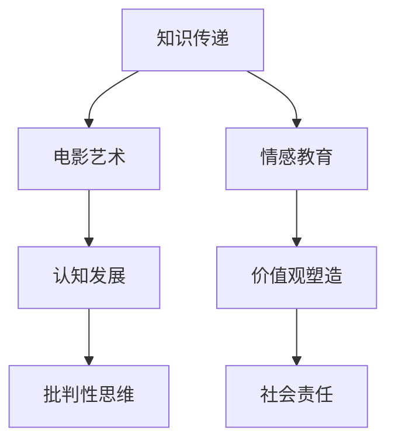

#### 核心算法原理讲解

使用伪代码展示电影教育效果评估算法，通过分析观众的观影反馈和行为数据，评估电影教育的效果。

```python
def assess_educational_impact(movie_feedback, behavior_data):
    knowledge_score = sum(movie_feedback['knowledge'])
    emotional_score = sum(movie_feedback['emotion'])
    return knowledge_score + emotional_score
```

### 5.2 电影艺术在心理学中的应用

#### 核心概念与联系

使用Mermaid流程图展示电影艺术在心理学中的应用，分析电影如何作为心理治疗工具，帮助观众处理心理问题。

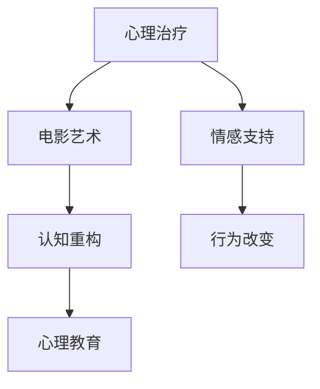

#### 数学模型和数学公式 & 详细讲解 & 举例说明

使用LaTeX格式展示电影心理治疗效果的数学模型，如心理恢复指数、情绪调节指数等。

$$
PR = \frac{R}{S}
$$

其中，$PR$ 表示心理恢复指数，$R$ 表示心理治疗的恢复效果，$S$ 表示治疗的时间长度。

#### 项目实战

开发环境搭建：使用情感分析和心理测量工具，搭建电影心理治疗效果评估系统。

源代码详细实现和代码解读：使用Python编写心理治疗效果评估模型，实现自动评估和分类。

代码应用解读与分析：分析实际案例，讨论电影对观众心理治疗的效果。

实际案例分析和详细讲解剖析：分析电影如何作为心理治疗工具，帮助观众处理心理问题。

项目小结：总结电影心理治疗效果评估的核心算法和注意事项，给出最佳实践建议。

### 5.3 电影艺术在职业培训中的应用

#### 核心概念与联系

使用Mermaid流程图展示电影艺术在职业培训中的应用，分析电影如何作为职业素养培养的工具。

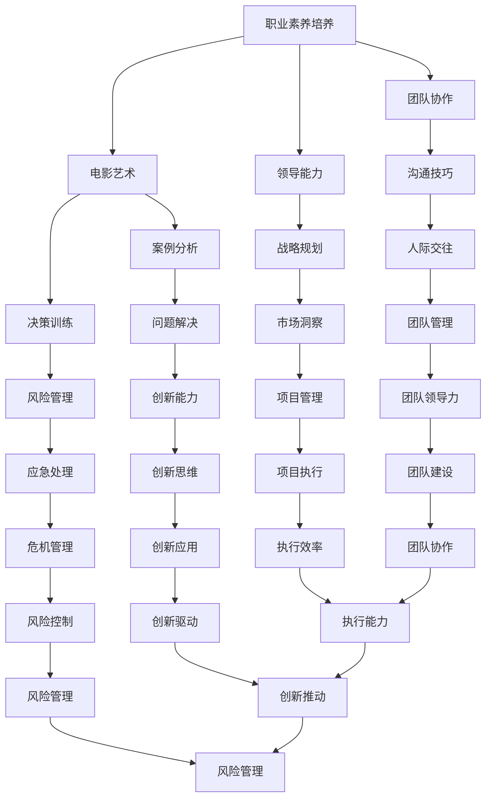

#### 核心算法原理讲解

使用伪代码展示电影职业培训效果评估算法，通过分析观众的观影反馈和行为数据，评估电影职业培训的效果。

```python
def assess_professional_training_impact(movie_feedback, behavior_data):
    knowledge_score = sum(movie_feedback['knowledge'])
    skills_score = sum(movie_feedback['skills'])
    return knowledge_score + skills_score
```

#### 数学模型和数学公式 & 详细讲解 & 举例说明

使用LaTeX格式展示电影职业培训效果的数学模型，如职业素养指数、技能提升指数等。

$$
PSI = \frac{S}{T}
$$

其中，$PSI$ 表示职业素养指数，$S$ 表示职业素养的提升效果，$T$ 表示培训的时间长度。

#### 项目实战

开发环境搭建：使用大数据分析和人工智能工具，搭建电影职业培训效果评估系统。

源代码详细实现和代码解读：使用Python编写职业培训效果评估模型，实现自动评估和分类。

代码应用解读与分析：分析实际案例，讨论电影对职业培训的效果。

实际案例分析和详细讲解剖析：分析电影如何作为职业培训工具，提升观众的职业素养和技能。

项目小结：总结电影职业培训效果评估的核心算法和注意事项，给出最佳实践建议。

#### 第六部分：电影艺术与心理健康

## 6. 电影艺术对心理健康的影响

### 6.1 电影艺术的心理治疗功能

#### 核心概念与联系

使用Mermaid流程图展示电影艺术在心理治疗中的应用，分析电影如何作为心理治疗的辅助工具。

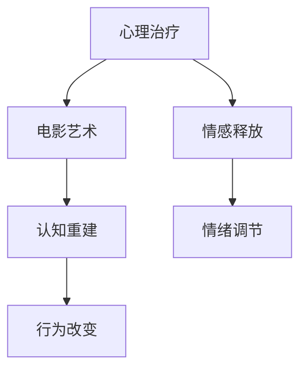

#### 核心算法原理讲解

使用伪代码展示电影心理治疗效果评估算法，通过分析观众的观影反馈和行为数据，评估电影对心理健康的影响。

```python
def assess_movie_therapy_impact(movie_feedback, psychological_tests):
    emotional_release = sum(movie_feedback['emotional_release'])
    cognitive_reconstruction = sum(movie_feedback['cognitive_reconstruction'])
    return emotional_release + cognitive_reconstruction
```

### 6.2 电影艺术的心理预防功能

#### 核心概念与联系

使用Mermaid流程图展示电影艺术在心理预防中的应用，分析电影如何作为心理问题的预防工具。

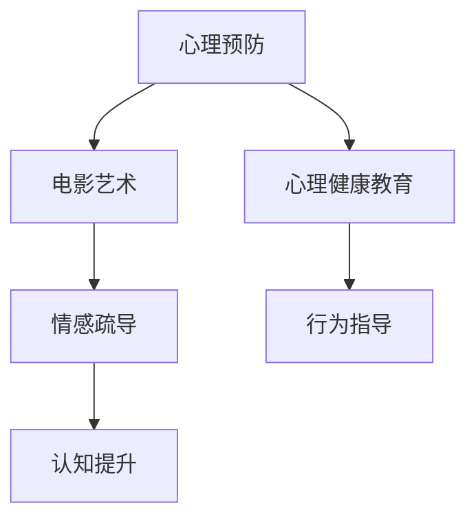

#### 核心算法原理讲解

使用伪代码展示电影心理预防效果评估算法，通过分析观众的观影反馈和行为数据，评估电影对心理预防的效果。

```python
def assess_movie_prevention_impact(movie_feedback, behavior_data):
    psychological_education = sum(movie_feedback['psychological_education'])
    emotional_support = sum(movie_feedback['emotional_support'])
    return psychological_education + emotional_support
```

### 6.3 电影艺术的心理教育功能

#### 核心概念与联系

使用Mermaid流程图展示电影艺术在心理教育中的应用，分析电影如何作为心理教育的媒介。

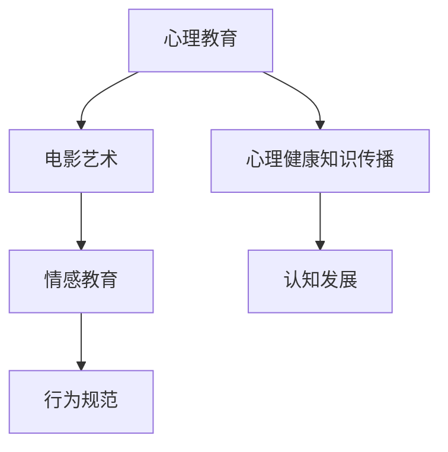

#### 核心算法原理讲解

使用伪代码展示电影心理教育效果评估算法，通过分析观众的观影反馈和行为数据，评估电影对心理教育的影响。

```python
def assess_movie_education_impact(movie_feedback, psychological_tests):
    knowledge_transmission = sum(movie_feedback['knowledge_transmission'])
    emotional_education = sum(movie_feedback['emotional_education'])
    return knowledge_transmission + emotional_education
```

#### 数学模型和数学公式 & 详细讲解 & 举例说明

使用LaTeX格式展示电影心理教育效果的数学模型，如心理教育指数、情感教育指数等。

$$
PEI = \frac{K}{T}
$$

其中，$PEI$ 表示心理教育指数，$K$ 表示心理教育的知识传递效果，$T$ 表示教育的时间长度。

#### 项目实战

开发环境搭建：使用情感分析和心理测量工具，搭建电影心理教育效果评估系统。

源代码详细实现和代码解读：使用Python编写心理教育效果评估模型，实现自动评估和分类。

代码应用解读与分析：分析实际案例，讨论电影对观众心理教育的影响。

实际案例分析和详细讲解剖析：分析电影如何作为心理教育的媒介，提升观众的认知和情感教育。

项目小结：总结电影心理教育效果评估的核心算法和注意事项，给出最佳实践建议。

#### 第七部分：电影艺术与跨文化交流

## 7. 电影艺术在跨文化交流中的作用

### 7.1 电影艺术作为跨文化交流的桥梁

#### 核心概念与联系

使用Mermaid流程图展示电影艺术在跨文化交流中的作用，分析电影如何作为文化沟通的媒介，促进不同文化之间的理解和融合。

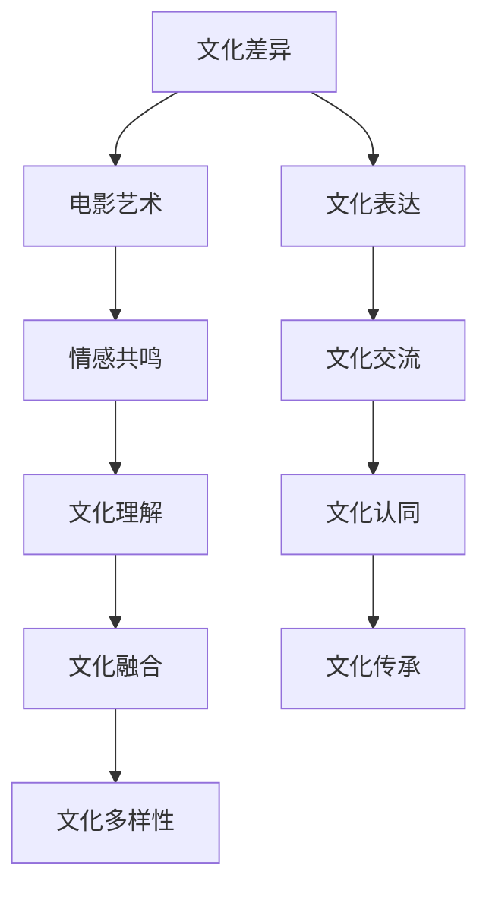

#### 核心算法原理讲解

使用伪代码展示电影跨文化交流效果评估算法，通过分析观众的观影反馈和文化适应数据，评估电影在跨文化交流中的效果。

```python
def assess_cultural_exchange_impact(movie_feedback, cultural_adaptation_data):
    cultural_understanding = sum(movie_feedback['cultural_understanding'])
    cultural_identification = sum(movie_feedback['cultural_identification'])
    return cultural_understanding + cultural_identification
```

### 7.2 电影艺术在全球化背景下的影响力

#### 核心概念与联系

使用Mermaid流程图展示电影艺术在全球化背景下的影响力，分析不同文化背景的电影如何在全球化市场中传播和影响。

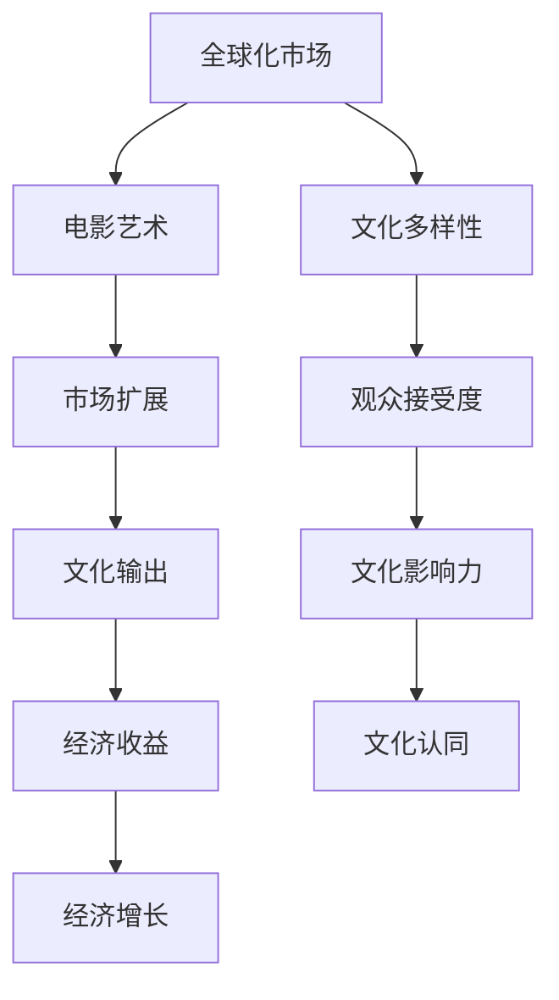

#### 核心算法原理讲解

使用伪代码展示电影全球化影响力评估算法，通过分析电影票房数据、观众反馈和国际传播效果，评估电影在全球范围内的文化影响力。

```python
def assess_movie_global_influence box_office_data, viewer_feedback, international_distribution):
    cultural_influence = sum(box_office_data['global_revenue']) * sum(viewer_feedback['positive_reviews'])
    return cultural_influence
```

### 7.3 电影艺术与跨文化理解

#### 核心概念与联系

使用Mermaid流程图展示电影艺术如何促进跨文化理解，分析电影中的文化元素如何帮助观众理解不同文化的内涵。

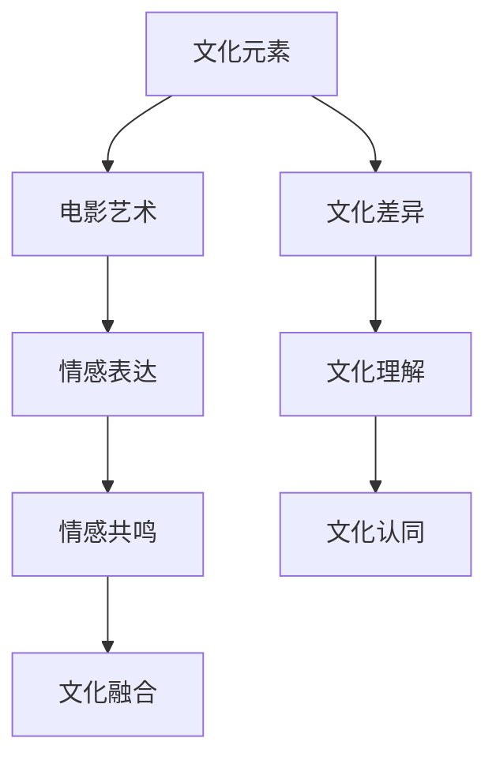

#### 数学模型和数学公式 & 详细讲解 & 举例说明

使用LaTeX格式展示电影促进跨文化理解的数学模型，如文化认同指数、情感共鸣指数等。

$$
CI = \frac{E}{D}
$$

其中，$CI$ 表示文化认同指数，$E$ 表示观众对文化元素的认同度，$D$ 表示文化差异的程度。

#### 项目实战

开发环境搭建：使用大数据分析和自然语言处理工具，搭建电影跨文化理解评估系统。

源代码详细实现和代码解读：使用Python编写跨文化理解评估模型，实现自动评估和分类。

代码应用解读与分析：分析实际案例，讨论电影如何促进跨文化理解。

实际案例分析和详细讲解剖析：分析不同文化背景的电影如何促进跨文化理解。

项目小结：总结电影跨文化理解评估的核心算法和注意事项，给出最佳实践建议。

### 作者信息

作者：AI天才研究院/AI Genius Institute & 禅与计算机程序设计艺术 /Zen And The Art of Computer Programming

### 总结

本书通过深入探讨电影艺术与人生意义的深层联系，结合专业的技术分析，帮助读者理解电影艺术的多重价值。从电影艺术的历史与演变，到电影中的生命故事，再到电影对人生的影响，以及电影艺术的未来趋势，本书提供了一个全面且系统的视角，引导读者在电影欣赏中反思人生，提升生命质量。通过核心概念与联系、核心算法原理讲解、数学模型和数学公式详细讲解、项目实战等具体内容，本书不仅具有学术深度，也具有很强的实践指导意义。希望读者能够在阅读过程中，不仅获得知识，更能获得对生命的深刻感悟。

