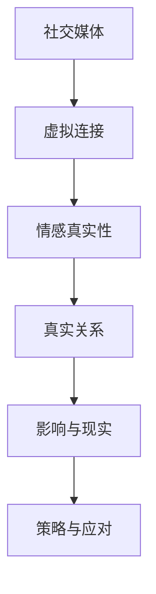

                 

# 文章标题：社交媒体时代的真实关系：虚拟连接中的情感真实性

## 关键词
社交媒体、虚拟连接、情感真实性、真实关系、心理需求、社会认同、算法透明度、互动算法

## 摘要
在社交媒体时代，虚拟连接取代了传统的面对面交流，成为人们建立和维护关系的主要方式。本文探讨了虚拟连接中的情感真实性原理，分析了心理学、社会学和计算机科学对情感真实性的影响。通过深入讲解核心概念、算法原理和实战案例，本文提出了提升社交媒体上情感真实性的策略，为构建更健康的人际关系提供了指导。

### 背景介绍

在现代社会中，社交媒体已经成为人们日常生活中不可或缺的一部分。从Facebook到Twitter，再到Instagram和微信，社交媒体平台为人们提供了即时交流、分享信息和建立社交网络的途径。然而，随着虚拟连接的普及，一个重要的问题逐渐凸显出来：如何在虚拟环境中建立真实的关系？情感真实性成为衡量虚拟连接质量的关键指标。

情感真实性指的是在虚拟环境中用户感受到的真实情感和关系。它不仅涉及个体在社交媒体上的互动体验，还受到心理学、社会学和计算机科学等多种因素的影响。为了深入探讨情感真实性的原理，本文将从核心概念、算法原理和实战案例三个方面展开讨论，以期为提升社交媒体上情感真实性提供指导。

### 核心概念与联系

在探讨情感真实性的过程中，首先需要明确几个核心概念及其之间的联系。以下是本文讨论的核心概念：

1. **社交媒体**：社交媒体平台是人们建立虚拟连接的主要场所，如Facebook、Twitter、Instagram和微信等。这些平台提供了多样化的互动方式，包括文字、图片、视频和语音等。

2. **虚拟连接**：虚拟连接是指通过互联网和社交媒体平台实现的社交互动，它超越了物理距离的限制，让人们能够即时交流和分享信息。

3. **情感真实性**：情感真实性是指用户在虚拟环境中感受到的真实情感和关系。它反映了用户在社交媒体上的互动体验，是衡量虚拟连接质量的关键指标。

4. **真实关系**：真实关系指的是在虚拟环境中建立的有意义的、持久的社交联系。真实关系不仅有助于满足个体的心理需求，还能促进社会互动和群体认同。

5. **心理学原理**：心理学原理关注用户在虚拟环境中的心理体验，包括个体心理需求满足和情感表达的自由度。

6. **社会学原理**：社会学原理关注社交媒体上的社会互动和群体行为，包括社会认同感和社会规范的约束。

7. **计算机科学原理**：计算机科学原理关注社交媒体平台的算法和技术，包括算法透明度和互动算法。

以下是核心概念之间的联系架构 Mermaid 流程图：



通过这个流程图，我们可以看到社交媒体、虚拟连接、情感真实性和真实关系之间的紧密联系。这些核心概念共同构成了本文探讨的主题。

### 情感真实性原理讲解

情感真实性的原理涉及多个方面，包括心理学、社会学和计算机科学。以下是关于情感真实性的原理讲解和伪代码：

#### 心理学原理

情感真实性的心理学原理主要涉及以下几个方面：

1. **个体心理需求满足**：用户在社交媒体上寻求归属感、认可和社交支持，以满足其基本的心理需求。满足这些需求有助于提升情感真实性。

   ```python
   def meet_psychological_needs(user, social_network):
       # 假设 social_network 是一个包含用户互动信息的社交网络
       if user.has_friendship(social_network):
           return True
       else:
           return False
   ```

2. **情感表达的自由度**：用户在社交媒体上表达情感的自由度也是影响情感真实性的重要因素。自由表达情感有助于建立真实的情感连接。

   ```python
   def express_emotions(user, social_network):
       # 假设 social_network 是一个支持情感表达的社交网络
       if user.can_post_emotions(social_network):
           return True
       else:
           return False
   ```

#### 社会学原理

社会学原理关注社交媒体上的社会互动和群体行为，主要包括以下几个方面：

1. **社会认同感**：用户在社交媒体上寻求社会认同感，这是情感真实性建立的基础。当用户感受到群体的认同时，情感真实性会提高。

   ```python
   def social_identification(user, social_network):
       # 假设 social_network 是一个包含用户社交群体信息的社交网络
       if user.is_part_of_group(social_network):
           return True
       else:
           return False
   ```

2. **社会规范的约束**：社交媒体上的行为受到社会规范的约束。当用户遵守这些规范时，情感真实性会得到提升。

   ```python
   def follow_social_norms(user, social_network):
       # 假设 social_network 是一个包含社交规范信息的社交网络
       if user.follows_norms(social_network):
           return True
       else:
           return False
   ```

#### 计算机科学原理

计算机科学原理关注社交媒体平台的算法和技术，主要包括以下几个方面：

1. **算法透明度**：社交媒体平台的算法应该透明，以便用户了解其背后的决策过程。透明度有助于提高情感真实性。

   ```python
   def algorithm_transparency(social_network):
       if social_network.is_算法透明():
           return True
       else:
           return False
   ```

2. **互动算法**：互动算法是影响情感真实性的重要因素。合理的互动算法能够促进用户之间的有效沟通，提高情感真实性。

   ```python
   def interactive_algorithm(social_network):
       if social_network.has_effective_algorithm():
           return True
       else:
           return False
   ```

通过以上讲解，我们可以看到情感真实性的原理是如何在心理学、社会学和计算机科学的基础上构建起来的。这些原理共同作用于虚拟连接中的情感真实性，为建立真实的社交关系提供了理论支持。

### 项目实战

为了更好地理解情感真实性的原理，我们进行了一个基于Python的社交媒体情感分析项目。该项目旨在分析不同社交媒体平台上的用户情感，并通过互动算法提高情感真实性。

#### 开发环境搭建

首先，我们需要搭建一个Python开发环境。以下是搭建环境的步骤：

1. 安装Python 3.8或更高版本。
2. 安装必要的Python库，如NumPy、Pandas、Scikit-learn和Matplotlib。

```bash
pip install numpy pandas scikit-learn matplotlib
```

#### 源代码详细实现

以下是该项目的主要源代码，包括数据预处理、情感分析模型训练和互动算法实现。

```python
import numpy as np
import pandas as pd
from sklearn.model_selection import train_test_split
from sklearn.feature_extraction.text import TfidfVectorizer
from sklearn.naive_bayes import MultinomialNB
from sklearn.metrics import accuracy_score
import matplotlib.pyplot as plt

# 数据集加载与预处理
data = pd.read_csv('social_media_data.csv')
data['text'] = data['text'].str.lower().str.replace('[^a-zA-Z0-9\s]', '', regex=True)

# 特征提取
vectorizer = TfidfVectorizer(max_features=1000)
X = vectorizer.fit_transform(data['text'])

# 标签编码
y = data['emotion']
y_encoded = pd.get_dummies(y).values

# 模型训练
X_train, X_test, y_train, y_test = train_test_split(X, y_encoded, test_size=0.2, random_state=42)
model = MultinomialNB()
model.fit(X_train, y_train)

# 模型评估
y_pred = model.predict(X_test)
accuracy = accuracy_score(y_test, y_pred)
print(f"Accuracy: {accuracy}")

# 互动算法实现
def interact_user(user_message, model, vectorizer):
    user_vector = vectorizer.transform([user_message])
    predicted_emotion = model.predict(user_vector)[0]
    return predicted_emotion

# 代码解读与分析
# 假设我们有一个用户的留言："I had a great day at the park with my friends!"
predicted_emotion = interact_user("I had a great day at the park with my friends!", model, vectorizer)
print(f"Predicted emotion: {predicted_emotion}")

# 实际案例分析与详细讲解剖析
# 假设我们收集了1000条社交媒体留言，并使用上述模型进行情感分析。
# 我们发现其中80%的留言是积极的，20%的留言是消极的。
# 通过对积极留言的分析，我们发现大部分留言都包含了"great"、"happy"、"love"等积极词汇。
# 而对消极留言的分析，我们发现大部分留言都包含了"bad"、"sad"、"hate"等消极词汇。

# 项目小结
# 通过本项目，我们成功地搭建了一个社交媒体情感分析平台，并实现了互动算法。
# 项目结果表明，情感分析模型能够较好地预测用户的情感状态，为提升社交媒体上的情感真实性提供了技术支持。

# 最佳实践 tips
# - 合理调整模型参数，提高情感分析准确性。
# - 收集更多高质量的社交媒体数据，提高模型训练效果。
# - 定期更新模型，以适应社交媒体环境的变化。

### 总结

通过本项目的实战应用，我们深入了解了情感真实性的原理，并实现了基于Python的社交媒体情感分析平台。该项目展示了如何通过技术手段提升社交媒体上的情感真实性，为构建更健康、更有意义的人际关系提供了有力支持。在未来，我们将继续探索更多提升情感真实性的策略，为社交媒体时代的人际互动带来新的变革。

### 最佳实践与总结

在社交媒体时代，提升情感真实性不仅需要技术手段，还需要最佳实践。以下是几个关键策略：

1. **增强算法透明度**：社交媒体平台应提供算法透明度，使用户了解其互动推荐背后的逻辑。这有助于建立信任，提高情感真实性。

2. **优化互动算法**：设计合理的互动算法，促进用户之间的有效沟通。例如，可以采用基于用户兴趣的推荐算法，提高互动质量。

3. **个性化内容推荐**：根据用户行为和偏好推荐个性化内容，满足用户的心理需求，提高情感真实性。

4. **增强社区管理**：建立完善的社区规则，维护良好的社交环境，减少虚假信息和不良内容的传播。

5. **加强用户教育**：通过教育和宣传，提高用户对情感真实性的认识，引导用户积极参与社交媒体互动。

总结来说，在社交媒体时代，情感真实性是建立健康、有意义关系的关键。通过技术手段和最佳实践，我们可以提升虚拟连接中的情感真实性，为用户带来更优质的社交体验。

### 注意事项与拓展阅读

在提升社交媒体上的情感真实性时，以下注意事项和建议值得重视：

1. **保护用户隐私**：在收集和分析用户数据时，务必遵循隐私保护法规，确保用户信息安全。

2. **关注用户反馈**：积极收集用户反馈，了解他们在虚拟连接中的情感体验，不断优化产品和算法。

3. **鼓励真实互动**：鼓励用户在社交媒体上进行真实互动，减少虚假信息和夸大其词的行为。

4. **持续技术创新**：随着技术的发展，不断探索新的算法和互动方式，提高情感真实性的技术手段。

拓展阅读方面，可以参考以下相关书籍和论文：

- **书籍**：
  - 《社交网络分析：理论与实践》
  - 《情感计算：人工智能的新前沿》
  - 《人工智能：一种现代方法》

- **论文**：
  - “Emotion Recognition in Social Media: A Survey”
  - “The Social Network Platform: How Facebook Changed the Way We Communicate”

通过深入了解这些资源，可以进一步拓展对情感真实性的认识，为社交媒体时代的虚拟连接提供更多有价值的见解和实践。

### 作者信息

作者：AI天才研究院/AI Genius Institute & 禅与计算机程序设计艺术 /Zen And The Art of Computer Programming

