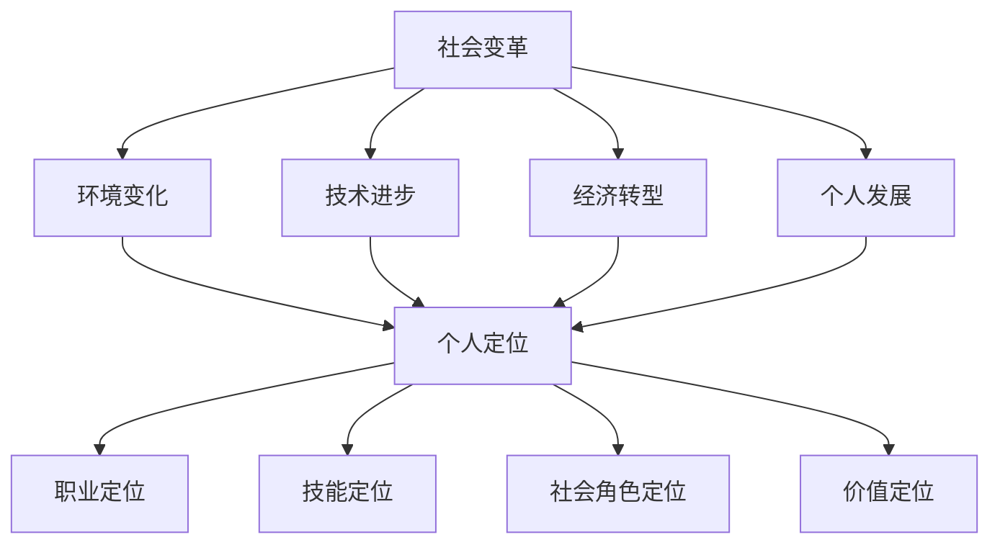
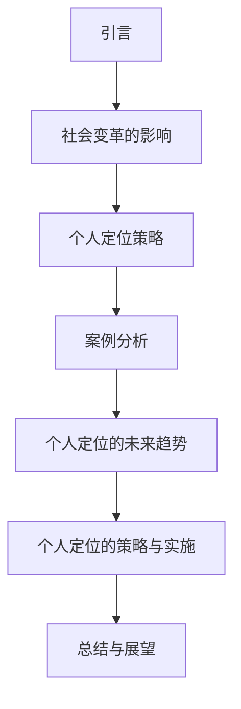

                 

### 文章标题

# 社会变革中的个人定位

### 关键词

- 社会变革
- 个人定位
- 技术进步
- 经济转型
- 职业规划

### 摘要

本文深入探讨了社会变革对个人定位的影响，分析了环境变化、技术进步、经济转型等多方面因素。文章首先介绍了社会变革的背景和意义，然后详细阐述了个人定位的概念及其重要性。通过分析自我认知、职业规划、技能提升、网络与社交以及社会责任等多个维度，文章为读者提供了具体的个人定位策略。最后，通过案例分析和个人定位的未来趋势展望，帮助读者更好地理解如何在复杂的社会环境中找准自己的位置，实现个人成长与价值创造。

---

## 引言

### 1.1 书籍背景与目的

在当今快速发展的社会中，个人定位显得尤为重要。社会变革带来的不确定性要求个人不仅要适应环境变化，更要主动把握机遇，找准自己的位置。本书旨在探讨社会变革中的个人定位问题，为读者提供系统、全面的指导。

#### 1.1.1 社会变革的背景

近年来，全球化和信息化进程加快，新技术不断涌现，经济结构持续调整，这些因素共同推动着社会的快速变革。全球气候变化、资源短缺、人口老龄化等问题日益凸显，给社会带来了新的挑战。同时，互联网、人工智能、区块链等新兴技术的广泛应用，极大地改变了人们的生活方式和工作模式。这些变革不仅影响了企业的经营战略，也深刻地改变了个人在社会中的角色和地位。

#### 1.1.2 个人定位的重要性

个人定位是指个人在社会中所扮演的角色和所处的位置。一个明确的个人定位有助于个人在复杂多变的社会环境中找到自己的发展方向，实现个人价值。具体来说，个人定位的重要性体现在以下几个方面：

1. **职业发展**：准确的个人定位有助于制定合理的职业规划，明确职业发展目标，提高职业竞争力。
2. **技能提升**：个人定位明确后，可以根据自身优势和发展方向，有针对性地提升技能，提高就业能力和职业发展潜力。
3. **社会互动**：在社会交往中，明确的个人定位有助于建立良好的人际关系，增强社会认同感和归属感。
4. **价值创造**：个人定位清晰，有助于在社会中发挥自身优势，创造更大的社会价值。

#### 1.1.3 书籍的目标与读者对象

本书的目标是帮助读者理解社会变革的背景和趋势，明确个人定位的重要性，并提供具体的策略和实践指导。本书适用于以下读者群体：

1. **职场新人**：刚进入职场，需要明确个人定位和职业规划。
2. **职业转换者**：面临职业转型，需要重新审视自己的定位。
3. **职业发展者**：希望提升职业竞争力，实现职业成长。
4. **教育者**：需要指导学生进行职业规划和发展。

### 1.2 核心概念与联系

在探讨个人定位之前，需要了解一些核心概念，包括社会变革、环境变化、技术进步、经济转型和个人发展等。这些概念之间相互联系，共同构成了影响个人定位的复杂背景。

#### 1.2.1 社会变革的驱动力

社会变革的驱动力主要包括以下几个方面：

1. **全球化**：全球市场的深度融合，推动了资源配置和产业结构的调整。
2. **信息化**：信息技术的快速进步，改变了人们的生产方式和生活习惯。
3. **技术创新**：新技术的不断涌现，促进了产业升级和经济转型。
4. **人口结构变化**：人口老龄化、劳动力结构变化等，对社会发展提出了新的挑战。

#### 1.2.2 个人定位的概念

个人定位是指个人在社会中所处的位置和角色。具体来说，包括以下几个方面：

1. **职业定位**：选择合适的职业方向，明确职业发展的目标。
2. **技能定位**：根据职业需求和个人兴趣，提升专业技能。
3. **社会角色定位**：在社会交往中，扮演适当的角色，建立良好的人际关系。
4. **价值定位**：明确个人在社会中的价值创造方向。

#### 1.2.3 社会变革与个人定位的关系

社会变革对个人定位产生了深远的影响。一方面，社会变革带来了新的机遇和挑战，个人需要不断调整自己的定位，适应环境变化。另一方面，个人定位的明确和优化，有助于更好地应对社会变革带来的不确定性，实现个人价值的最大化。

为了更好地理解社会变革与个人定位之间的关系，我们可以通过以下 Mermaid 流程图来展示这些核心概念之间的联系：



### 1.3 架构概述

本书的架构分为六个部分，每个部分都有明确的主题和目标。通过以下 Mermaid 流程图，可以直观地了解书籍的整体架构：



在接下来的章节中，我们将详细探讨每个部分的内容，帮助读者深入理解社会变革中的个人定位。

---

## 社会变革的影响

### 2.1 环境变化

环境变化是影响个人定位的重要因素之一。全球化、生态文明理念以及资源与能源短缺等问题，都在深刻地改变着我们的生活方式和社会结构。

#### 2.1.1 全球化进程

全球化是指世界范围内的经济、政治、文化等各个方面的相互联系和依赖程度不断加深。全球化进程的加速，一方面为个人提供了更广阔的发展空间，另一方面也带来了新的挑战。

**积极影响**：

1. **就业机会**：全球化使得跨国公司可以在全球范围内招聘人才，为个人提供了更多的就业机会。
2. **文化交流**：全球化促进了不同文化之间的交流和融合，丰富了人们的精神生活。
3. **经济发展**：全球化推动了全球贸易和投资的增长，为各国经济带来了新的发展机遇。

**负面影响**：

1. **竞争加剧**：全球化使得市场竞争更加激烈，个人需要不断提升自己的竞争力。
2. **文化冲突**：全球化也带来了文化冲突，个人需要适应多元化的文化环境。
3. **环境问题**：全球化加剧了资源消耗和环境污染，对个人和地球的可持续发展提出了挑战。

#### 2.1.2 生态文明理念

生态文明理念强调人与自然和谐共生，是现代社会发展的必然趋势。生态文明理念对个人定位的影响主要体现在以下几个方面：

**积极影响**：

1. **可持续发展**：生态文明理念鼓励个人在职业选择和生活方式上追求可持续发展，减少对环境的负面影响。
2. **社会责任**：生态文明理念提高了个人的社会责任感，促使个人积极参与环保活动，为社会做出贡献。
3. **健康生活**：生态文明理念倡导健康、绿色、环保的生活方式，对个人的身心健康有积极作用。

**负面影响**：

1. **职业选择**：生态文明理念可能对某些高污染、高能耗的行业造成冲击，对相关从业者的职业发展带来一定压力。
2. **生活方式**：生态文明理念要求个人改变传统的生活方式，可能需要付出更多的努力和代价。

#### 2.1.3 资源与能源短缺

资源与能源短缺是全球环境变化的一个重要表现，对个人定位产生了深远的影响。

**积极影响**：

1. **技术创新**：资源与能源短缺促使个人和企业在节约资源、提高能源利用效率方面进行技术创新。
2. **可持续发展**：资源与能源短缺促使个人和企业更加关注可持续发展，减少对自然资源的依赖。
3. **环保意识**：资源与能源短缺提高了个人的环保意识，促进了环保产业的发展。

**负面影响**：

1. **成本增加**：资源与能源短缺可能导致生产成本上升，影响个人的就业和收入。
2. **生活方式**：资源与能源短缺要求个人在日常生活中采取更为节约、环保的生活方式，可能带来一定的不便。

### 2.2 技术进步

技术进步是推动社会变革的重要力量。人工智能、数字经济和信息技术等新技术的快速发展，对个人定位产生了深刻的影响。

#### 2.2.1 人工智能的发展

人工智能（AI）是当前技术进步的一个重要方向，其发展对个人定位的影响主要体现在以下几个方面：

**积极影响**：

1. **效率提升**：人工智能可以帮助个人提高工作效率，减少重复性劳动，使个人有更多时间和精力进行创造性的工作。
2. **决策支持**：人工智能可以提供数据分析和预测，帮助个人做出更明智的决策。
3. **职业拓展**：人工智能的发展创造了新的职业机会，如数据科学家、AI工程师等。

**负面影响**：

1. **就业压力**：人工智能可能取代某些传统职业，对从业者的就业造成冲击。
2. **技能要求**：随着人工智能的发展，个人需要不断提升自己的技能，以适应新的工作环境。
3. **伦理问题**：人工智能的广泛应用也带来了伦理和社会问题，如隐私保护、算法歧视等。

#### 2.2.2 数字经济的崛起

数字经济是指基于数字技术进行生产、分配和消费的经济活动。数字经济的崛起对个人定位的影响主要体现在以下几个方面：

**积极影响**：

1. **创业机会**：数字经济为个人提供了更多的创业机会，降低了创业门槛。
2. **职业选择**：数字经济创造了新的职业，如数字营销、电子商务等，为个人提供了更多的职业选择。
3. **远程工作**：数字经济促进了远程工作的发展，使个人可以更加灵活地安排工作和生活。

**负面影响**：

1. **竞争加剧**：数字经济使得市场竞争更加激烈，个人需要不断提升自己的竞争力。
2. **网络安全**：数字经济带来了网络安全问题，个人需要保护自己的信息安全。
3. **数字鸿沟**：数字经济的发展可能导致数字鸿沟扩大，使得一些缺乏数字技能的个人处于劣势。

#### 2.2.3 信息技术革新

信息技术革新包括云计算、大数据、物联网等技术的快速发展，对个人定位的影响主要体现在以下几个方面：

**积极影响**：

1. **信息获取**：信息技术革新使得个人可以更加便捷地获取信息，提高知识水平。
2. **社交互动**：信息技术革新改变了人们的社交方式，使得个人可以更加方便地进行社交互动。
3. **创新环境**：信息技术革新为个人提供了更多的创新机会，降低了创新门槛。

**负面影响**：

1. **信息过载**：信息技术革新可能导致信息过载，使个人难以筛选和处理大量信息。
2. **隐私问题**：信息技术革新也带来了隐私问题，个人需要保护自己的隐私。
3. **依赖性**：信息技术革新使得个人对互联网和电子设备的依赖性增强，可能影响个人生活质量和身体健康。

### 2.3 经济转型

经济转型是指经济结构和产业结构的调整和优化。随着全球化和技术进步的加速，许多国家的经济正在经历深刻的转型。

#### 2.3.1 新型产业兴起

新型产业的兴起是经济转型的重要表现。新型产业主要包括高新技术产业、现代服务业等，对个人定位的影响主要体现在以下几个方面：

**积极影响**：

1. **职业机会**：新型产业的兴起为个人提供了更多的职业机会，尤其是高技能、高知识含量的职业。
2. **收入水平**：新型产业通常具有较高的收入水平，为个人提供了更好的就业和发展机会。
3. **创新能力**：新型产业强调创新和研发，为个人提供了发挥创造力的平台。

**负面影响**：

1. **技能要求**：新型产业对从业者的技能要求较高，个人需要不断学习和提升自己的技能。
2. **就业压力**：新型产业的兴起可能导致传统产业的萎缩，对相关从业者的就业造成压力。
3. **地区差异**：新型产业主要集中在经济发达地区，可能导致地区差异扩大。

#### 2.3.2 传统产业转型升级

传统产业的转型升级是经济转型的另一个重要方面。传统产业主要包括制造业、农业等，其转型升级对个人定位的影响主要体现在以下几个方面：

**积极影响**：

1. **就业机会**：传统产业的转型升级可能创造新的就业机会，尤其是技术含量较高的岗位。
2. **产业升级**：传统产业的转型升级有助于提升整个产业链的竞争力，提高国家的经济实力。
3. **环境保护**：传统产业的转型升级可能减少环境污染，提高资源利用效率。

**负面影响**：

1. **就业压力**：传统产业的转型升级可能导致部分从业者失业，增加就业压力。
2. **技术要求**：传统产业的转型升级需要从业人员具备更高的技术能力，对从业者的培训和教育提出了更高要求。
3. **适应难度**：从业人员需要适应新的生产方式和岗位要求，可能面临一定的挑战。

#### 2.3.3 创业与就业环境的变化

创业与就业环境的变化是经济转型的重要表现。随着全球化和技术进步的加速，创业与就业环境正在发生深刻的变化。

**积极影响**：

1. **创业机会**：创业与就业环境的变化为个人提供了更多的创业机会，降低了创业门槛。
2. **就业选择**：创业与就业环境的变化为个人提供了更多的就业选择，尤其是新兴行业和领域。
3. **灵活就业**：创业与就业环境的变化促进了灵活就业的发展，为个人提供了更加灵活的工作方式。

**负面影响**：

1. **竞争压力**：创业与就业环境的变化使得市场竞争更加激烈，个人需要不断提升自己的竞争力。
2. **就业风险**：创业与就业环境的变化可能带来一定的就业风险，如失业风险、职业风险等。
3. **就业歧视**：创业与就业环境的变化可能加剧就业歧视，如性别歧视、年龄歧视等。

### 2.4 个人发展

个人发展是指个人在知识、技能、人格等方面的全面发展。社会变革对个人发展产生了深远的影响，主要体现在以下几个方面：

#### 2.4.1 教育与职业规划

教育与职业规划是个人发展的重要环节。社会变革要求个人具备更高的知识水平和专业技能，因此教育与职业规划的重要性日益凸显。

**积极影响**：

1. **职业竞争力**：教育与职业规划有助于提升个人的职业竞争力，为个人的职业发展奠定基础。
2. **职业发展路径**：教育与职业规划可以帮助个人明确职业发展路径，制定合理的职业规划。
3. **终身学习**：教育与职业规划强调终身学习，促使个人不断提升自己的知识和技能。

**负面影响**：

1. **就业压力**：教育与职业规划的要求不断提高，可能增加个人的就业压力。
2. **学业负担**：教育与职业规划需要投入大量时间和精力，可能增加个人的学业负担。
3. **职业焦虑**：教育与职业规划的不确定性可能导致个人产生职业焦虑，影响心理健康。

#### 2.4.2 职业生涯管理

职业生涯管理是指个人对自己职业生涯的规划和管理。社会变革对职业生涯管理产生了深远的影响。

**积极影响**：

1. **职业发展**：职业生涯管理有助于个人实现职业发展，提高职业成就。
2. **职业规划**：职业生涯管理可以帮助个人制定明确的职业规划，减少职业发展的不确定性。
3. **个人价值**：职业生涯管理有助于提升个人的社会价值和自我价值。

**负面影响**：

1. **职业压力**：职业生涯管理可能增加个人的职业压力，影响身心健康。
2. **职业转换**：职业生涯管理需要面对职业转换的风险，可能面临适应困难和职业断裂。
3. **职业焦虑**：职业生涯管理的不确定性可能导致个人产生职业焦虑，影响心理健康。

#### 2.4.3 个人素质提升

个人素质提升是指个人在知识、能力、人格等方面的全面发展。社会变革对个人素质提升提出了更高的要求。

**积极影响**：

1. **竞争力**：个人素质提升有助于提升个人的竞争力，适应社会变革的需求。
2. **社会适应**：个人素质提升有助于个人更好地适应社会环境，提高社会适应能力。
3. **人际关系**：个人素质提升有助于建立良好的人际关系，提升社会交往能力。

**负面影响**：

1. **时间成本**：个人素质提升需要投入大量时间和精力，可能影响个人的生活和休闲时间。
2. **经济压力**：个人素质提升可能需要投入一定的经济成本，对个人的经济状况产生影响。
3. **心理压力**：个人素质提升可能带来一定的心理压力，如焦虑、自卑等。

### 2.5 社会互动

社会互动是指个人在社会中的交往和互动。社会变革对个人社会互动产生了深远的影响。

#### 2.5.1 社交媒体的影响

社交媒体的兴起改变了人们的社会互动方式，对个人定位产生了重要影响。

**积极影响**：

1. **信息传播**：社交媒体使得信息传播更加迅速和广泛，个人可以更快地获取信息。
2. **社交便利**：社交媒体为个人提供了便利的社交平台，可以方便地与朋友、同事和家人保持联系。
3. **社交网络**：社交媒体帮助个人建立更广泛的社交网络，为职业发展和人际关系提供了更多机会。

**负面影响**：

1. **信息泛滥**：社交媒体上的信息量巨大，个人需要花费大量时间筛选和处理信息。
2. **隐私风险**：社交媒体上的个人隐私容易被侵犯，个人需要加强隐私保护意识。
3. **社交依赖**：社交媒体可能导致个人过度依赖网络社交，影响现实生活中的社交能力。

#### 2.5.2 网络社交与人际关系

网络社交与人际关系是现代社会互动的重要组成部分。社会变革对网络社交和人际关系产生了深远的影响。

**积极影响**：

1. **交流便捷**：网络社交使得个人可以更加便捷地进行交流和互动，不受时间和空间的限制。
2. **信息共享**：网络社交促进了信息的共享和传播，为个人提供了更多的知识资源。
3. **社交平台**：网络社交为个人提供了更多的社交平台，可以结识更多的朋友和同事。

**负面影响**：

1. **社交孤立**：网络社交可能导致个人过度依赖网络社交，忽视现实生活中的社交关系。
2. **社交焦虑**：网络社交上的负面评论和压力可能导致个人产生社交焦虑，影响心理健康。
3. **网络成瘾**：网络社交的便捷性可能导致个人过度沉迷于网络，影响工作和生活。

#### 2.5.3 社区参与与社会责任

社区参与与社会责任是个人在社会互动中的重要方面。社会变革对社区参与和社会责任产生了深远的影响。

**积极影响**：

1. **社会认同**：社区参与和社会责任有助于提升个人在社会中的认同感和归属感。
2. **社会贡献**：社区参与和社会责任使个人能够为社会做出贡献，实现自我价值。
3. **人际网络**：社区参与和社会责任有助于建立良好的人际关系，拓展个人的人脉资源。

**负面影响**：

1. **时间压力**：社区参与和社会责任可能需要投入大量时间和精力，对个人的时间和生活产生影响。
2. **社会责任**：社区参与和社会责任可能带来一定的责任压力，影响个人的心理状态。
3. **社会压力**：社区参与和社会责任可能使个人面临社会压力，如期望值过高、社会评价等。

通过以上分析，我们可以看到，社会变革对个人定位的影响是全面而深刻的。个人需要不断适应环境变化，明确自己的定位，提升自身素质，积极参与社会互动，以实现个人价值和社会价值的最大化。

---

## 个人定位策略

### 3.1 自我认知

自我认知是个人定位的基础，它涉及对自身性格、兴趣、优势与不足的认知。一个明确的自我认知有助于个人更好地规划职业发展路径，提高职业竞争力。

#### 3.1.1 自我评估方法

自我评估是自我认知的重要环节。以下是一些常见的自我评估方法：

1. **SWOT分析**：SWOT分析是指对自身的优势（Strengths）、劣势（Weaknesses）、机会（Opportunities）和威胁（Threats）进行综合评估。通过SWOT分析，个人可以全面了解自己的优劣势，以及面临的外部环境。

    ```mermaid
    graph TD
    A[优势] --> B[劣势]
    A --> C[机会]
    A --> D[威胁]
    B --> E[改进]
    B --> F[规避]
    C --> G[利用]
    D --> H[应对]
    ```

2. **兴趣测评**：通过兴趣测评，个人可以了解自己的兴趣方向和职业倾向。常见的兴趣测评包括霍兰德职业兴趣测评、MBTI性格测评等。

3. **能力测评**：能力测评可以帮助个人了解自己的技能水平和潜力。例如，可以通过在线测试平台进行编程能力、数据分析能力等的评估。

4. **360度评估**：360度评估是指通过他人对自己的评价来了解自己的表现。这种方法可以提供更为客观的自我认知。

#### 3.1.2 自我优势与不足

在自我评估的基础上，个人需要明确自己的优势和不足。以下是一个简化的自我优势与不足分析过程：

**优势分析**：

1. **技能**：列出自己的专业技能和特长，如编程、数据分析、项目管理等。
2. **经验**：总结自己的工作经验和成就，包括实习、项目经历、获奖情况等。
3. **性格**：分析自己的性格特点，如内向、外向、细心、果断等。

**不足分析**：

1. **技能**：识别自己在技能方面的不足，如缺乏某些专业技能、需要提升的工作技能等。
2. **经验**：找出自己在工作经验和成就方面的不足，如缺乏某些特定领域的经验、需要提高的绩效等。
3. **性格**：分析自己在性格上的不足，如需要改进的沟通能力、团队协作能力等。

通过优势与不足的分析，个人可以更清晰地了解自己的现状，为后续的职业规划提供依据。

#### 3.1.3 自我期望与目标设定

在明确自己的优势和不足后，个人需要设定合理的自我期望和目标。以下是一个简单的目标设定过程：

1. **明确目标**：设定明确的职业和个人发展目标，如成为某一领域的专家、提升某项技能等。
2. **设定期限**：为每个目标设定一个合理的时间期限，如短期目标（1年以内）、中期目标（1-3年）和长期目标（3年以上）。
3. **制定计划**：为实现目标制定具体的行动计划，包括学习计划、职业规划、技能提升计划等。

以下是一个目标设定的示例：

**目标**：在2年内成为数据科学领域的高级专家。

**期限**：短期（1年）：掌握Python编程基础，完成数据科学项目；中期（2年）：深入学习机器学习、深度学习等核心技术，参与实际项目；长期（3年以上）：成为数据科学领域的技术顾问，发表相关学术论文。

**行动计划**：

1. **短期计划**：
    - 学习Python编程基础，通过在线课程或书籍学习；
    - 参与数据科学项目，积累实战经验；
2. **中期计划**：
    - 深入学习机器学习、深度学习等核心技术；
    - 参与实际项目，提升项目经验和技能；
3. **长期计划**：
    - 成为数据科学领域的技术顾问；
    - 发表相关学术论文，提升专业影响力。

通过以上步骤，个人可以明确自己的定位，制定合理的职业规划，为实现个人价值奠定基础。

### 3.2 职业规划

职业规划是指个人在职业生涯中对自己职业发展方向和目标的规划。一个明确的职业规划有助于个人在职业生涯中找到自己的定位，实现职业发展目标。

#### 3.2.1 职业定位选择

职业定位选择是职业规划的重要环节。以下是一个简化的职业定位选择过程：

1. **了解职业市场**：研究当前的就业市场，了解不同职业的需求和前景。
2. **分析个人兴趣和优势**：结合自己的兴趣和优势，选择适合的职业方向。
3. **进行职业测评**：通过职业测评工具，如霍兰德职业兴趣测评、MBTI性格测评等，进一步确认职业定位。

以下是一个职业定位选择的示例：

**职业市场分析**：当前，数据分析、人工智能、软件开发等领域需求较大，职业前景较好。

**个人兴趣和优势分析**：对数据分析有浓厚的兴趣，擅长编程和数学分析，具备较强的逻辑思维能力。

**职业测评结果**：通过职业测评，确认自己在数据科学领域具有较高的职业倾向。

**职业定位选择**：选择数据科学领域作为职业发展方向。

#### 3.2.2 职业发展路径

职业发展路径是指个人在职业生涯中实现职业目标的过程。以下是一个简化的职业发展路径规划过程：

1. **确定职业目标**：明确个人的职业目标，如成为数据科学家、数据分析经理等。
2. **设定职业阶段**：将职业生涯分为不同的阶段，如初级、中级、高级等。
3. **制定发展计划**：为每个阶段制定具体的发展计划，包括学习、工作、项目经验等。

以下是一个职业发展路径的示例：

**职业目标**：在5年内成为数据科学领域的高级专家。

**职业阶段**：

1. **初级阶段**（1-3年）：
    - 学习数据科学基础知识，通过在线课程或书籍进行学习；
    - 参与数据科学项目，积累实战经验；
    - 获得数据科学相关的证书，提升职业竞争力。

2. **中级阶段**（3-5年）：
    - 深入学习数据科学的核心技术，如机器学习、深度学习等；
    - 参与复杂的数据科学项目，担任关键角色；
    - 提升项目管理和团队协作能力。

3. **高级阶段**（5年以上）：
    - 成为数据科学领域的技术顾问；
    - 参与行业标准的制定和技术的推广；
    - 发表相关学术论文，提升专业影响力。

**发展计划**：

1. **初级阶段**：
    - 学习数据科学基础知识，通过在线课程或书籍进行学习；
    - 参与数据科学项目，积累实战经验；
    - 获得数据科学相关的证书，提升职业竞争力。

2. **中级阶段**：
    - 深入学习数据科学的核心技术，如机器学习、深度学习等；
    - 参与复杂的数据科学项目，担任关键角色；
    - 提升项目管理和团队协作能力。

3. **高级阶段**：
    - 成为数据科学领域的技术顾问；
    - 参与行业标准的制定和技术的推广；
    - 发表相关学术论文，提升专业影响力。

通过以上步骤，个人可以明确自己的职业发展路径，为实现职业目标奠定基础。

### 3.2.3 职业转换策略

职业转换是指个人在职业生涯中从一种职业转换到另一种职业。一个成功的职业转换策略可以帮助个人顺利实现职业转变。

#### 3.2.3.1 自我评估

在职业转换之前，个人需要进行全面的自我评估，包括以下方面：

1. **技能和知识**：评估自己现有的技能和知识，确定哪些技能和知识可以转移到新的职业领域。
2. **经验和成就**：总结自己在现有职业领域的工作经验和成就，分析这些经验和成就对新的职业领域的价值。
3. **兴趣和动机**：分析自己对新的职业领域的兴趣和动机，确定是否愿意投入时间和精力进行职业转换。

#### 3.2.3.2 职业市场研究

在自我评估的基础上，个人需要研究新的职业领域，包括以下方面：

1. **职业需求**：了解新的职业领域对人才的需求，确定自己的技能和知识是否符合市场需求。
2. **职业前景**：研究新的职业领域的职业前景和发展趋势，确定是否有长期发展的潜力。
3. **职业发展路径**：了解新的职业领域的职业发展路径，确定自己的职业发展方向和目标。

#### 3.2.3.3 制定转换计划

在研究新的职业领域后，个人需要制定详细的职业转换计划，包括以下方面：

1. **技能提升**：确定需要提升的技能和知识，制定学习和培训计划。
2. **实践经验**：寻找实习、项目经验或志愿工作的机会，积累实际经验。
3. **职业网络**：建立新的职业网络，通过人际关系获取更多的信息和机会。

#### 3.2.3.4 执行和调整

在职业转换计划执行过程中，个人需要不断调整和优化计划，确保职业转换的顺利进行。以下是一些执行和调整的建议：

1. **定期评估**：定期评估职业转换的进展，根据实际情况调整计划。
2. **保持积极**：面对挑战和困难，保持积极的心态，不断寻找解决问题的方法。
3. **持续学习**：职业转换过程中，持续学习新的知识和技能，保持竞争力。

通过以上策略，个人可以更顺利地实现职业转换，实现职业生涯的持续发展。

### 3.3 技能提升

技能提升是个人定位和职业发展的关键因素。在快速变化的社会环境中，个人需要不断提升自己的技能，以适应不断变化的需求。

#### 3.3.1 热门技能需求

当前，随着社会变革和技术进步，一些热门技能的需求日益增加。以下是一些热门技能的需求和特点：

1. **数据分析**：数据分析是当前最热门的技能之一。随着大数据和人工智能的兴起，数据分析在各个行业都具有重要应用。数据分析技能包括数据清洗、数据挖掘、统计分析等。

2. **人工智能**：人工智能是推动社会变革的重要力量。人工智能技能包括机器学习、深度学习、自然语言处理等。人工智能工程师在互联网、金融、医疗等领域具有广泛的应用前景。

3. **编程**：编程技能是现代社会的基本技能。随着互联网和数字化的发展，编程技能的需求持续增长。常见的编程语言包括Python、Java、C++等。

4. **项目管理**：项目管理技能在各个领域都具有重要应用。项目管理技能包括计划、执行、监控和收尾等过程。项目管理专业人员可以在IT、建筑、制造等领域找到广泛的工作机会。

5. **数字营销**：数字营销是当前营销领域的重要方向。数字营销技能包括搜索引擎优化（SEO）、社交媒体营销、内容营销等。数字营销专业人员可以在广告公司、互联网企业等领域发挥作用。

#### 3.3.2 技能学习与认证

提升技能的有效途径包括自学、参加培训课程和获取认证。

1. **自学**：自学是提升技能的常用方法。通过在线课程、书籍、博客等资源，个人可以系统地学习各种技能。自学的好处是灵活性强，可以根据个人时间和兴趣进行学习。常见的自学平台包括Coursera、Udemy、edX等。

2. **培训课程**：参加专业的培训课程是提升技能的另一种有效途径。培训课程通常由专业人士或培训机构提供，内容系统全面，可以快速提升技能。培训课程的形式包括在线课程、面授课程、工作坊等。

3. **认证**：获取相关领域的认证是提升技能和职业竞争力的重要手段。认证通常由专业机构或权威机构提供，对个人的技能和知识水平进行评估和认证。常见的认证包括PMP（项目管理专业认证）、CFA（特许金融分析师）、AWS（亚马逊云服务认证）等。

以下是一个技能提升和认证的示例：

**技能学习与认证过程**：

1. **确定学习目标**：根据职业规划和市场需求，确定需要学习的技能和认证。

2. **选择学习资源**：根据学习目标，选择合适的自学资源或培训课程。

3. **制定学习计划**：为学习过程制定详细的学习计划，包括学习时间、学习内容等。

4. **参加培训课程**：如果条件允许，选择参加专业的培训课程，确保学习效果。

5. **获取认证**：在完成学习和培训后，参加相关认证考试，获取认证证书。

6. **持续学习**：在获得认证后，持续关注技能的发展趋势，不断提升自己的技能水平。

通过以上步骤，个人可以系统地提升技能，提高职业竞争力。

#### 3.3.3 技能应用的案例

以下是一个技能应用的案例，展示了如何将数据分析技能应用于实际工作中：

**案例背景**：某电商公司在促销活动中需要分析用户数据，优化促销策略，提高销售额。

**技能应用**：

1. **数据收集**：收集用户在促销活动期间的行为数据，包括浏览记录、购买记录等。

2. **数据清洗**：对收集到的数据进行分析，处理缺失值、异常值等。

3. **数据分析**：使用数据分析工具（如Python、R等）进行数据分析，包括用户行为分析、商品分析、促销效果分析等。

4. **数据可视化**：将分析结果通过图表、报表等形式进行可视化展示。

5. **策略优化**：根据数据分析结果，提出促销策略优化建议，如调整促销时间、优化商品推荐等。

6. **效果评估**：在优化策略实施后，对促销效果进行评估，验证优化策略的有效性。

通过以上步骤，数据分析技能帮助电商公司优化了促销策略，提高了销售额，实现了商业价值的提升。

通过以上分析，我们可以看到，技能提升在个人定位和职业发展中具有重要意义。个人需要不断学习新的技能，提高自己的竞争力，以适应社会变革的需求。同时，通过技能的应用，个人可以更好地实现个人价值和社会价值的最大化。

### 3.4 网络与社交

在当今信息时代，网络和社交已经成为个人定位和职业发展的重要工具。有效的网络和社交策略可以帮助个人扩大人脉资源，提高职业竞争力，实现职业目标。

#### 3.4.1 网络社交的优势

网络社交具有以下几个优势：

1. **快速信息获取**：通过社交媒体和在线平台，个人可以快速获取各种信息，包括行业动态、职业机会、专业知识和技能等。

2. **资源整合**：网络社交使得个人能够整合各种资源，如专业培训、职业指导、项目合作等，从而提升自身能力。

3. **职业推广**：通过网络社交，个人可以展示自己的专业能力和成就，吸引潜在雇主或合作伙伴，提高职业竞争力。

4. **知识共享**：网络社交平台为个人提供了一个交流知识和经验的平台，可以与同行交流经验，学习新技术，拓宽视野。

5. **人脉拓展**：网络社交有助于个人建立广泛的人脉资源，这些资源在未来可能成为重要的职业发展支持。

#### 3.4.2 社交网络管理

有效的社交网络管理是确保网络社交效益最大化的重要步骤。以下是一些社交网络管理的建议：

1. **明确社交目标**：在建立社交网络之前，个人需要明确自己的社交目标，如寻找职业机会、扩大人脉资源、学习新技术等。

2. **选择合适的平台**：根据社交目标，选择合适的社交平台，如LinkedIn、Twitter、Facebook、GitHub等。不同平台有不同的特点和优势，个人需要根据自己的需求选择合适的平台。

3. **保持活跃度**：在社交平台上保持活跃度，定期发布有价值的内容，如行业动态、专业文章、项目进展等，以吸引关注。

4. **互动与回应**：积极参与社交平台上的讨论和互动，回应他人的评论和提问，建立良好的人际关系。

5. **隐私保护**：在社交平台上保护个人隐私，避免泄露敏感信息，如家庭地址、电话号码等。

6. **网络礼仪**：遵守网络礼仪，尊重他人，避免恶意攻击和不当言论。

#### 3.4.3 网络社交策略

以下是一些有效的网络社交策略：

1. **内容营销**：通过发布有价值的内容，如专业文章、项目成果、案例分析等，展示自己的专业能力和知识水平，吸引潜在雇主或合作伙伴。

2. **建立个人品牌**：在社交平台上建立个人品牌，塑造专业形象，提高知名度和影响力。可以通过撰写博客、发表学术论文、参与行业活动等方式提升个人品牌。

3. **参与行业社群**：加入相关的行业社群和论坛，积极参与讨论，与行业内的专家和同行交流，获取行业信息和机会。

4. **建立专业网络**：通过社交平台建立专业网络，与行业内的人士建立联系，拓展人脉资源。可以通过加入LinkedIn的群组、参与行业会议等方式实现。

5. **主动社交**：主动与潜在雇主或合作伙伴建立联系，发送专业的自我介绍和求职信，展示自己的能力和兴趣。

6. **持续学习**：通过社交平台上的学习和交流，不断提升自己的专业知识和技能，保持竞争力。

#### 3.4.4 社交案例分析

以下是一个社交案例的分析，展示了如何通过网络社交实现职业目标：

**案例背景**：一名年轻的软件工程师在LinkedIn上发现了一个与他的专业和兴趣相关的行业社群，社群成员包括业内专家和资深从业者。

**社交过程**：

1. **加入社群**：通过LinkedIn加入该社群，关注社群的活动和讨论。

2. **积极参与**：在社群内积极参与讨论，分享自己的见解和经验，回答其他成员的问题。

3. **建立联系**：通过私信与其他成员建立联系，交流职业经验和行业动态。

4. **推荐机会**：在社群中得到了一份与自己的专业和兴趣相符的工作推荐。

5. **职业发展**：通过这个社交机会，该工程师成功跳槽到一家知名互联网公司，实现了职业发展。

通过以上案例，我们可以看到，有效的网络社交策略可以帮助个人实现职业目标，提升职业竞争力。个人需要充分利用社交平台和网络资源，建立广泛的社交网络，不断提升自己的专业能力和影响力。

### 3.5 社会责任与价值创造

在当今社会，个人不仅要在职业和个人发展中追求成功，还要承担起社会责任，创造更大的社会价值。社会责任与价值创造是个人定位的重要组成部分，它不仅体现了个人的社会担当，也是实现个人长远发展的重要途径。

#### 3.5.1 社会责任意识

社会责任意识是指个人对社会和环境的责任感和使命感。社会责任意识的形成需要个人从以下几个方面进行思考和实践：

1. **环境责任**：环境保护是社会责任的重要组成部分。个人可以通过参与环保活动、支持环保组织、减少碳排放等方式，为环境保护贡献自己的力量。

2. **社会公正**：社会公正要求个人关注弱势群体，推动社会公平正义。可以通过参与公益活动、支持公益项目、参与社区服务等方式，促进社会公正。

3. **道德伦理**：道德伦理是社会责任意识的核心。个人应遵循道德规范，诚信待人，公平竞争，做到言行一致。

4. **可持续发展**：可持续发展要求个人在生活和工作中考虑长期影响，促进经济、社会和环境的协调发展。可以通过支持可持续发展的项目和产品，推广绿色生活方式等方式，推动可持续发展。

#### 3.5.2 价值创造的途径

个人在社会中的价值创造主要体现在以下几个方面：

1. **技术创新**：通过技术创新，提高生产效率，降低成本，推动产业发展。例如，通过研发新技术、新产品，推动产业升级和转型。

2. **社会服务**：通过提供优质的社会服务，满足社会需求，提升社会福祉。例如，医生、教师等职业通过自己的专业知识和技能，为社会提供重要的公共服务。

3. **创业与就业**：通过创业和就业，创造就业机会，促进经济增长。创业者可以通过创办企业，带动就业，促进社会发展。

4. **公益慈善**：通过公益慈善活动，帮助弱势群体，推动社会公平正义。个人可以通过捐款、志愿服务、公益项目等方式，为社会做出贡献。

#### 3.5.3 个人与社会的关系

个人与社会的关系是相互依存、相互促进的。个人在社会中实现自我价值，同时也在为社会做出贡献。以下从几个方面探讨个人与社会的关系：

1. **社会支持**：个人在社会中发展，需要社会的支持和资源。社会提供的良好教育、就业机会、健康保障等，为个人的成长和发展提供了基础。

2. **个人贡献**：个人通过工作、创新、慈善等方式，为社会做出贡献，促进社会进步和发展。

3. **共同成长**：个人和社会在相互依存、相互促进中实现共同成长。个人的发展带动社会的进步，社会的进步也为个人提供更多的发展机遇。

4. **社会责任**：个人在社会中不仅要追求个人利益，还要承担社会责任，实现个人价值与社会价值的统一。

### 3.5.4 个人定位与价值创造的案例分析

以下是一个个人定位与价值创造的案例分析，展示了如何通过明确个人定位，实现个人价值和社会价值的统一：

**案例背景**：一位年轻的数据科学家在毕业后进入一家互联网公司，专注于大数据分析和机器学习领域。

**个人定位**：通过自我评估和职业规划，他明确了个人定位，即成为一名数据科学领域的专家，通过技术创新为社会创造价值。

**价值创造**：

1. **技术创新**：在工作中，他积极参与公司项目，通过技术创新，优化了数据分析流程，提高了数据处理效率。

2. **社会服务**：他利用业余时间，参与了一个公益项目，通过大数据分析帮助非营利组织提高工作效率，提升服务质量。

3. **创业与就业**：他创办了一家专注于数据科学咨询和培训的公司，为中小企业提供数据科学支持，帮助他们提高竞争力，同时创造了就业机会。

4. **公益慈善**：他积极参与公益活动，通过捐赠和志愿服务，帮助贫困地区的孩子们接受教育，提升他们的生活品质。

通过以上案例，我们可以看到，个人通过明确个人定位，不断提升自身能力，实现个人价值的同时，也为社会创造了巨大的价值。个人定位与价值创造是相辅相成的，个人在实现自身发展的同时，也在为社会做出贡献，实现个人价值与社会价值的统一。

### 3.6 综合案例分析

为了更好地理解个人定位策略在实际中的应用，以下我们将通过几个具体案例，分析不同背景和个人在复杂社会环境中如何找准自己的定位，实现个人成长与价值创造。

#### 3.6.1 职业转换案例

**案例背景**：李先生，35岁，之前是一名汽车行业的项目经理，由于行业不景气，他决定转换职业。

**分析过程**：

1. **自我评估**：李先生通过SWOT分析，发现自己在项目管理方面有丰富的经验，但缺乏技术背景。他意识到，技术技能是转换职业的关键。

2. **职业市场研究**：李先生研究了IT行业的需求，特别是软件开发和数据分析领域。

3. **技能提升**：李先生参加了Python编程和数据分析的培训课程，获得了相关证书。

4. **职业转换**：在完成技能提升后，李先生成功转换到一家互联网公司担任数据分析师，实现了职业转换。

**结论**：李先生的案例表明，通过明确自我认知，结合市场需求，不断提升技能，可以有效实现职业转换，适应社会变革。

#### 3.6.2 社会责任案例

**案例背景**：张小姐，28岁，是一名数据科学家，她关注社会公益，决定将数据分析技能应用于公益事业。

**分析过程**：

1. **社会责任意识**：张小姐意识到，通过数据分析可以提升公益组织的效率。

2. **项目选择**：她选择了一个致力于帮助贫困地区儿童的教育公益项目。

3. **数据分析**：张小姐利用大数据分析技术，优化了教育资源的分配，提高了教育效果。

4. **价值创造**：通过项目实施，张小姐不仅提升了公益组织的效率，也实现了个人价值，获得了社会认可。

**结论**：张小姐的案例展示了如何通过社会责任实践，将个人技能应用于公益事业，实现个人价值与社会价值的统一。

#### 3.6.3 创业案例

**案例背景**：王先生，30岁，是一名软件工程师，他决定创业，开发一款有助于提升工作效率的软件。

**分析过程**：

1. **市场调研**：王先生研究了市场需求，发现中小企业在提高工作效率方面有巨大需求。

2. **产品开发**：他利用自己的编程技能，开发了一款办公自动化软件。

3. **市场推广**：通过社交媒体和在线平台，王先生积极推广产品，吸引了大量客户。

4. **价值创造**：王先生的创业不仅为市场提供了有价值的产品，也为自身创造了经济回报。

**结论**：王先生的案例证明了创业是实现个人价值的重要途径，通过市场调研、技能应用和持续创新，可以实现个人梦想和市场需求的统一。

#### 3.6.4 跨行业案例

**案例背景**：赵女士，40岁，之前是一名教师，由于对数字技术的兴趣，她决定跨行业进入互联网行业。

**分析过程**：

1. **自我评估**：赵女士发现自己在教育领域有丰富的经验，但在数字技术方面相对薄弱。

2. **职业规划**：她制定了详细的职业规划，包括学习编程和数据分析技能。

3. **技能提升**：赵女士参加了多个在线课程，获得了相关的证书。

4. **跨行业转换**：在完成技能提升后，赵女士成功进入一家互联网公司，担任数据分析师。

**结论**：赵女士的案例展示了跨行业转换的可能性，通过明确的职业规划、持续的学习和技能提升，可以实现个人定位的转换。

### 3.6.5 案例总结

以上案例分析表明，个人定位策略在实际应用中具有广泛性和多样性。无论是职业转换、社会责任实践、创业还是跨行业转换，关键在于自我认知、市场需求和持续学习。通过明确个人定位，不断提升自身能力，个人可以更好地适应社会变革，实现个人成长与价值创造。

---

## 个人定位的未来趋势

### 5.1 社会变革的未来方向

社会变革的未来方向将受到全球化、技术进步和经济发展等多重因素的驱动。以下是对未来社会变革方向的一些预测：

#### 5.1.1 全球趋势预测

1. **全球化深化**：全球化将继续深化，全球贸易、资本流动和文化交流将更加紧密。跨国企业和全球化人才将成为推动社会变革的重要力量。

2. **数字经济崛起**：数字经济将成为未来经济增长的重要引擎。人工智能、物联网、区块链等新兴技术将深入渗透到各行各业，改变生产方式、商业模式和消费模式。

3. **可持续发展**：可持续发展将成为全球共识，环保意识和社会责任感将进一步提升。绿色经济、低碳生活和循环经济将成为未来社会的重要发展方向。

4. **人口结构变化**：随着人口老龄化和生育率下降，社会结构将发生变化，劳动力市场、社会保障体系和教育体系等都将面临新的挑战。

#### 5.1.2 技术发展的影响

1. **人工智能**：人工智能技术将在更多领域得到应用，从智能家居、自动驾驶到医疗健康、金融服务，人工智能将极大地提高生产效率和生活质量。

2. **信息技术**：5G、云计算、大数据等信息技术将继续发展，为个人和社会提供更加便捷、高效的服务。虚拟现实（VR）和增强现实（AR）等技术也将逐步融入日常生活。

3. **生物技术**：生物技术的进步将带来医疗领域的革命，延长寿命、治疗疾病和改善生活质量将成为可能。基因编辑、克隆技术等前沿生物技术将引发伦理和社会问题。

4. **能源技术**：新能源技术的发展和普及将推动能源结构的转型，减少对化石燃料的依赖，降低环境污染，实现可持续发展。

#### 5.1.3 经济模式的转变

1. **分享经济**：分享经济模式将继续发展，共享汽车、共享住宿、共享办公等将改变人们的消费和生活方式。

2. **平台经济**：平台经济将成为主流经济模式，依托互联网的平台，企业可以更高效地连接供需双方，创造新的商业机会。

3. **产业升级**：传统产业将经历深度升级，智能制造、绿色制造和智能制造等新型产业将逐渐取代传统制造业。

4. **经济全球化**：经济全球化将继续推进，跨国投资和国际贸易将更加活跃，全球产业链、供应链和资本流动将更加紧密。

### 5.2 个人定位的挑战与机遇

社会变革的未来方向为个人定位带来了新的挑战和机遇。以下是对个人定位面临的主要挑战和机遇的探讨：

#### 5.2.1 挑战分析

1. **技术替代**：随着人工智能和自动化技术的发展，一些传统职业可能会被取代，对从业人员提出了新的技能要求。

2. **信息过载**：互联网和社交媒体的发展使得信息量急剧增加，个人需要学会筛选和处理大量信息，以避免信息过载。

3. **职业转换**：经济模式的转变和产业升级可能导致部分职业消失，个人需要具备快速适应和转换职业的能力。

4. **工作与生活的平衡**：随着远程工作和灵活就业的普及，个人需要更好地平衡工作与生活，保持身心健康。

5. **隐私和安全**：随着数字化和互联网技术的发展，个人隐私和安全问题日益突出，个人需要加强自我保护意识。

#### 5.2.2 机遇探讨

1. **技术创新**：技术进步带来了新的职业机会，如人工智能工程师、大数据分析师、物联网开发者等。

2. **终身学习**：社会变革要求个人具备持续学习和更新知识的能力，终身学习将成为个人发展的关键。

3. **全球视野**：全球化带来了更多的国际交流和合作机会，具备国际化视野的个人将在全球竞争中更具优势。

4. **跨界发展**：跨界发展将成为趋势，个人可以通过跨行业、跨领域的创新，实现个人价值的最大化。

5. **社会责任**：社会变革中的可持续发展和社会责任将成为个人发展的新方向，个人可以通过参与公益事业，实现社会价值。

### 5.2.3 个人定位策略调整

面对社会变革的未来方向，个人需要调整定位策略，以应对挑战和抓住机遇。以下是一些具体的策略调整建议：

1. **技能提升**：不断学习和更新技能，特别是新兴技术和跨界技能，以适应未来职业需求。

2. **终身学习**：树立终身学习的理念，通过在线课程、学术研究、行业交流等途径，不断提升自己的知识水平。

3. **职业规划**：制定长期的职业规划，明确职业目标和发展路径，以适应职业转换和跨界发展的需求。

4. **全球视野**：拓宽国际视野，关注全球趋势和行业动态，积极参与国际交流和合作。

5. **社会责任**：积极参与公益事业，树立社会责任意识，实现个人价值与社会价值的统一。

6. **灵活就业**：适应远程工作和灵活就业的发展趋势，提高工作与生活的平衡能力。

通过以上策略调整，个人可以更好地适应社会变革的未来方向，实现个人成长与价值创造。

### 5.3 未来个人发展的趋势

未来个人发展将受到技术进步、经济变革和社会趋势的共同影响，呈现出以下几大趋势：

#### 5.3.1 教育与培训

1. **在线教育普及**：随着互联网技术的发展，在线教育将更加普及，个性化学习、远程教育、虚拟课堂等新兴教育模式将逐渐取代传统的课堂教学模式。

2. **技能培训升级**：随着技术的快速更新，对新兴技能的需求不断增长，技能培训将从单一的专业技能扩展到跨界技能、软技能和创新能力等方面。

3. **终身学习理念**：终身学习将成为未来个人发展的核心理念，个人需要不断更新知识和技能，以适应不断变化的市场需求。

#### 5.3.2 职业生涯管理

1. **职业灵活性增强**：未来职业生涯将更加灵活，远程工作、兼职工作、自由职业等灵活就业方式将成为主流，个人需要具备良好的时间管理和自我管理能力。

2. **职业转换频率增加**：随着经济结构的调整和技术的进步，个人的职业生涯将更加多样化，职业转换将成为常态，个人需要具备快速适应和转换职业的能力。

3. **职业发展路径多样化**：未来职业发展路径将不再局限于传统的晋升模式，个人可以通过创业、跨界发展、自主职业等多种方式实现职业成长。

#### 5.3.3 社会责任与实践

1. **社会责任意识提升**：随着社会意识的提高，个人将更加关注社会责任，积极参与公益事业，通过志愿服务、公益项目等方式为社会做出贡献。

2. **可持续发展理念**：未来个人发展将更加注重可持续发展，个人将在生活和工作中践行环保、节能、低碳等理念，推动社会可持续发展。

3. **个人价值与社会价值的统一**：个人发展不仅关注个人成长和财富积累，还将更加注重个人价值与社会价值的统一，通过实现社会价值来实现个人价值的最大化。

通过以上趋势，我们可以看到，未来个人发展将面临更多的挑战和机遇。个人需要不断适应社会变革，提升自身素质，明确个人定位，以实现个人成长与社会发展的统一。

---

## 个人定位的策略与实施

### 6.1 个人定位策略概述

个人定位策略是指个人在职业和社会环境中找到自己的位置和角色的过程。一个有效的个人定位策略不仅有助于个人实现职业目标，还能提升个人在社交场合中的影响力。以下是构建个人定位策略的几个关键步骤：

#### 6.1.1 策略制定原则

1. **目标导向**：明确个人定位的目标，包括职业目标、生活目标和价值观。

2. **自我认知**：通过自我评估，了解自己的兴趣、技能、性格和优势与不足。

3. **市场分析**：研究市场需求和职业趋势，了解自己所在行业的发展方向和机会。

4. **持续调整**：根据实际情况和环境变化，不断调整和优化个人定位策略。

#### 6.1.2 策略实施步骤

1. **设定目标**：首先，明确个人定位的目标。这些目标可以是短期的，如提升某项技能或完成特定项目；也可以是长期的，如成为行业专家或实现职业晋升。

2. **评估自我**：通过自我评估，了解自己的兴趣和优势。可以使用SWOT分析（优势、劣势、机会、威胁）等方法，全面了解自己的情况。

3. **市场调研**：研究市场需求和职业趋势，了解哪些技能和知识在未来更受欢迎。可以通过阅读行业报告、参加行业会议和与行业专家交流等方式获取信息。

4. **制定计划**：根据评估结果和市场调研，制定具体的行动计划。这包括学习计划、职业规划、社交策略等。

5. **实施与调整**：执行行动计划，并定期评估和调整策略。根据实际情况，灵活调整目标、计划和行动，以确保策略的有效性。

#### 6.1.3 策略评估与调整

策略评估与调整是个人定位策略的重要组成部分。以下是一些关键步骤：

1. **定期评估**：定期回顾个人定位策略的执行情况，评估目标的实现程度和策略的有效性。

2. **收集反馈**：从同事、朋友、导师等获取反馈，了解他们在自己职业发展和定位方面的看法和建议。

3. **数据分析**：利用数据分析工具，如KPI（关键绩效指标）、绩效评估等，量化个人定位策略的效果。

4. **调整策略**：根据评估结果和反馈，调整目标和计划。这可能包括调整学习目标、职业规划或社交策略等。

5. **持续学习**：不断学习新的知识和技能，以适应环境和市场需求的变化。

通过以上步骤，个人可以构建并实施一个有效的个人定位策略，实现职业发展和个人价值的最大化。

### 6.2 个人定位与职业规划

职业规划是个人定位的重要组成部分，它涉及对个人职业生涯的全面规划和管理。一个明确的职业规划有助于个人在职业道路上取得成功。以下是职业规划的几个关键步骤：

#### 6.2.1 职业定位选择

职业定位选择是职业规划的第一步。以下是一个简化的职业定位选择过程：

1. **自我评估**：通过自我评估，了解自己的兴趣、技能、性格和价值观。可以使用SWOT分析等方法，全面了解自己的情况。

2. **市场分析**：研究市场需求和职业趋势，了解哪些职业在未来有较好的发展前景。可以通过阅读行业报告、参加行业会议和与行业专家交流等方式获取信息。

3. **职业测评**：通过职业测评工具，如霍兰德职业兴趣测评、MBTI性格测评等，进一步确认自己的职业倾向。

4. **决策**：结合自我评估和市场分析，选择适合自己的职业定位。这可以是某个具体的职业，也可以是一个职业领域。

以下是一个职业定位选择的示例：

**自我评估**：经过自我评估，发现自己在数据分析和编程方面有较强的能力，性格特点适合从事需要逻辑思维和创新的工作。

**市场分析**：研究市场需求，发现数据科学家和数据分析师是当前热门职业，发展前景良好。

**职业测评**：通过职业测评，确认自己在数据科学领域具有较高的职业倾向。

**职业定位选择**：选择数据科学家作为职业定位。

#### 6.2.2 职业发展路径

职业发展路径是指个人在职业生涯中实现职业目标的路线。以下是一个简化的职业发展路径规划过程：

1. **确定职业目标**：明确个人的职业目标，如成为数据科学家、数据分析经理等。

2. **设定职业阶段**：将职业生涯分为不同的阶段，如初级、中级、高级等。

3. **制定发展计划**：为每个阶段制定具体的发展计划，包括学习、工作、项目经验等。

以下是一个职业发展路径的示例：

**职业目标**：在5年内成为数据科学领域的高级专家。

**职业阶段**：

1. **初级阶段**（1-3年）：
    - 学习数据科学基础知识，通过在线课程或书籍学习；
    - 参与数据科学项目，积累实战经验；
    - 获得数据科学相关的证书，提升职业竞争力。

2. **中级阶段**（3-5年）：
    - 深入学习数据科学的核心技术，如机器学习、深度学习等；
    - 参与复杂的数据科学项目，担任关键角色；
    - 提升项目管理和团队协作能力。

3. **高级阶段**（5年以上）：
    - 成为数据科学领域的技术顾问；
    - 参与行业标准的制定和技术的推广；
    - 发表相关学术论文，提升专业影响力。

**发展计划**：

1. **初级阶段**：
    - 学习数据科学基础知识，通过在线课程或书籍进行学习；
    - 参与数据科学项目，积累实战经验；
    - 获得数据科学相关的证书，提升职业竞争力。

2. **中级阶段**：
    - 深入学习数据科学的核心技术，如机器学习、深度学习等；
    - 参与复杂的数据科学项目，担任关键角色；
    - 提升项目管理和团队协作能力。

3. **高级阶段**：
    - 成为数据科学领域的技术顾问；
    - 参与行业标准的制定和技术的推广；
    - 发表相关学术论文，提升专业影响力。

通过以上步骤，个人可以明确自己的职业发展路径，为实现职业目标奠定基础。

### 6.2.3 职业转换策略

职业转换是指个人在职业生涯中从一种职业转换到另一种职业。一个成功的职业转换策略可以帮助个人顺利实现职业转变。以下是职业转换策略的几个关键步骤：

#### 6.2.3.1 自我评估

在职业转换之前，个人需要进行全面的自我评估，包括以下方面：

1. **技能和知识**：评估自己现有的技能和知识，确定哪些技能和知识可以转移到新的职业领域。

2. **经验和成就**：总结自己在现有职业领域的工作经验和成就，分析这些经验和成就对新的职业领域的价值。

3. **兴趣和动机**：分析自己对新的职业领域的兴趣和动机，确定是否愿意投入时间和精力进行职业转换。

以下是一个自我评估的示例：

**技能和知识**：具有数据分析和编程技能，熟悉Python和R等编程语言。

**经验和成就**：曾在一家互联网公司担任数据分析专员，成功完成多个数据分析项目，获得领导好评。

**兴趣和动机**：对数据科学和人工智能领域有浓厚兴趣，希望在这个领域发展。

#### 6.2.3.2 职业市场研究

在自我评估的基础上，个人需要研究新的职业领域，包括以下方面：

1. **职业需求**：了解新的职业领域对人才的需求，确定自己的技能和知识是否符合市场需求。

2. **职业前景**：研究新的职业领域的职业前景和发展趋势，确定是否有长期发展的潜力。

3. **职业发展路径**：了解新的职业领域的职业发展路径，确定自己的职业发展方向和目标。

以下是一个职业市场研究的示例：

**职业需求**：数据科学家和数据分析师在市场上需求量大，尤其在金融、医疗和互联网行业。

**职业前景**：随着大数据和人工智能的发展，数据科学领域将继续增长，有很好的职业前景。

**职业发展路径**：数据科学家可以发展成为高级数据科学家、数据科学经理，甚至数据科学总监。

#### 6.2.3.3 制定转换计划

在研究新的职业领域后，个人需要制定详细的职业转换计划，包括以下方面：

1. **技能提升**：确定需要提升的技能和知识，制定学习和培训计划。

2. **实践经验**：寻找实习、项目经验或志愿工作的机会，积累实际经验。

3. **职业网络**：建立新的职业网络，通过人际关系获取更多的信息和机会。

以下是一个职业转换计划的示例：

**技能提升**：
- 学习Python编程和数据分析，通过在线课程和书籍进行学习；
- 学习机器学习和深度学习，通过参加相关课程和项目实践。

**实践经验**：
- 在一家数据分析公司实习，担任数据分析师助理，积累实际工作经验；
- 参与一个数据分析项目，提升项目管理和团队协作能力。

**职业网络**：
- 加入LinkedIn上的数据科学群组，关注行业动态和职业机会；
- 参加行业会议和研讨会，与行业内的人士建立联系。

#### 6.2.3.4 执行和调整

在职业转换计划执行过程中，个人需要不断调整和优化计划，确保职业转换的顺利进行。以下是一些执行和调整的建议：

1. **定期评估**：定期评估职业转换的进展，根据实际情况调整计划。

2. **保持积极**：面对挑战和困难，保持积极的心态，不断寻找解决问题的方法。

3. **持续学习**：职业转换过程中，持续学习新的知识和技能，保持竞争力。

通过以上策略，个人可以更顺利地实现职业转换，实现职业生涯的持续发展。

### 6.3 项目实战

为了更好地理解个人定位策略在实践中的应用，以下我们将通过一个具体项目，详细讲解项目的开发环境搭建、源代码实现和代码解读。

#### 6.3.1 项目背景

项目名称：智能推荐系统

项目简介：智能推荐系统是一个基于用户行为数据，利用数据分析和机器学习算法，为用户推荐个性化内容的系统。该项目旨在帮助网站或应用程序提高用户粘性，提升用户体验。

#### 6.3.2 开发环境搭建

1. **软件环境**：
    - Python 3.8及以上版本
    - Jupyter Notebook
    - Anaconda（用于环境管理）
    - Pandas（数据处理库）
    - Scikit-learn（机器学习库）
    - Matplotlib（数据可视化库）

2. **硬件环境**：
    - 64位操作系统
    - 8GB及以上内存
    - 100GB及以上硬盘空间

3. **环境配置**：
    - 安装Anaconda，创建一个新的环境，命名为“recommendsys”：
        ```bash
        conda create -n recommendsys python=3.8
        conda activate recommendsys
        ```
    - 安装所需库：
        ```bash
        conda install pandas scikit-learn matplotlib
        ```

#### 6.3.3 源代码实现

以下是一个简单的智能推荐系统的源代码实现，包含数据预处理、特征工程、模型训练和评估等步骤。

```python
# 导入所需库
import pandas as pd
from sklearn.model_selection import train_test_split
from sklearn.ensemble import RandomForestClassifier
from sklearn.metrics import accuracy_score

# 加载数据
data = pd.read_csv('user_behavior.csv')

# 数据预处理
# ...（如缺失值处理、数据转换等）

# 特征工程
# ...（如特征选择、特征转换等）

# 分割数据集
X = data.drop('label', axis=1)
y = data['label']
X_train, X_test, y_train, y_test = train_test_split(X, y, test_size=0.2, random_state=42)

# 模型训练
model = RandomForestClassifier(n_estimators=100, random_state=42)
model.fit(X_train, y_train)

# 预测
y_pred = model.predict(X_test)

# 评估
accuracy = accuracy_score(y_test, y_pred)
print(f"模型准确率：{accuracy:.2f}")

# 可视化
import matplotlib.pyplot as plt

plt.scatter(X_test['feature1'], y_test, color='red', label='实际值')
plt.scatter(X_test['feature1'], y_pred, color='blue', label='预测值')
plt.legend()
plt.show()
```

#### 6.3.4 代码解读

1. **数据预处理**：数据预处理是数据分析和机器学习项目的重要环节，包括缺失值处理、数据转换等。在此代码中，我们未展示具体的数据预处理步骤，但这是一个不可忽视的环节。

2. **特征工程**：特征工程是提升模型性能的关键步骤。在此代码中，我们假设数据已通过特征工程处理，可以直接用于模型训练。

3. **模型选择**：我们选择了随机森林（Random Forest）作为推荐系统的模型。随机森林是一个集成学习模型，它通过构建多棵决策树来提高模型的预测能力。

4. **模型训练**：使用训练数据集对随机森林模型进行训练。

5. **预测和评估**：使用测试数据集对模型进行预测，并计算模型准确率。此外，我们通过散点图展示了实际值和预测值，便于分析模型性能。

#### 6.3.5 项目小结

通过以上项目实战，我们了解了智能推荐系统的基本实现过程，包括开发环境搭建、源代码实现和代码解读。该项目展示了如何将个人定位策略应用于实际项目中，实现个人价值和商业价值的统一。

### 6.4 最佳实践 tips

在个人定位和职业规划过程中，以下是一些最佳实践 tips，帮助个人更好地实现定位和目标：

1. **持续学习**：技术日新月异，持续学习是保持竞争力的关键。定期阅读行业报告、参加培训课程，保持对新技术和新趋势的了解。

2. **明确目标**：制定明确的职业目标，将目标分解为具体的小目标，制定详细的行动计划，确保目标的实现。

3. **网络社交**：积极参与行业活动和社交网络，扩大人脉资源，获取行业信息和职业机会。

4. **适应变化**：社会变革迅速，个人需要具备快速适应变化的能力。灵活调整职业规划，积极面对职业转换和职业发展的不确定性。

5. **注重实践**：理论知识固然重要，但实践能力同样关键。通过实际项目、实习和工作经验，不断提升自己的实践能力。

6. **保持热情**：对工作和职业充满热情，能够激发个人的创造力和动力，助力职业发展。

7. **反思与调整**：定期反思职业规划的实施情况，根据实际情况和反馈，及时调整目标和计划。

通过以上最佳实践 tips，个人可以更加系统地规划职业发展，实现个人定位和职业目标。

### 6.5 小结与注意事项

本文详细探讨了社会变革中的个人定位问题，从多个维度分析了个人定位的策略与实施。通过自我认知、职业规划、技能提升、网络与社交以及社会责任等方面，我们提出了一系列有效的策略，帮助个人在社会变革中找准自己的定位。

**注意事项**：

1. **自我认知**：定期进行自我评估，了解自己的兴趣、技能和优势，为职业规划提供依据。

2. **目标明确**：制定明确的职业目标，分解为具体的小目标，确保目标的实现。

3. **持续学习**：保持对新技术和新趋势的了解，提升自己的知识水平和技能。

4. **适应变化**：灵活应对职业转换和职业发展的不确定性，积极适应社会变革。

5. **网络社交**：积极参与行业活动和社交网络，扩大人脉资源，获取职业机会。

6. **社会责任**：关注社会责任，积极参与公益事业，实现个人价值与社会价值的统一。

通过以上注意事项，个人可以更加系统地规划职业发展，实现个人定位和职业目标。

### 6.6 拓展阅读

为了帮助读者进一步深入了解个人定位和职业规划的相关内容，以下推荐一些拓展阅读材料：

1. **书籍**：
   - 《职业规划与职业转换指南》
   - 《智能时代的职业发展》
   - 《个人品牌打造与职业成功》

2. **在线课程**：
   - Coursera上的《职业发展与生涯规划》
   - edX上的《职业规划与技能提升》

3. **博客与文章**：
   - Medium上的关于职业规划的文章
   - LinkedIn上的职业发展相关博客

4. **社交媒体账号**：
   - 关注行业专家的Twitter账号
   - 加入LinkedIn上的职业发展群组

通过这些拓展阅读材料，读者可以更加全面地了解个人定位和职业规划的相关知识，为实际操作提供指导。

---

### 作者信息

作者：AI天才研究院/AI Genius Institute & 禅与计算机程序设计艺术 /Zen And The Art of Computer Programming

