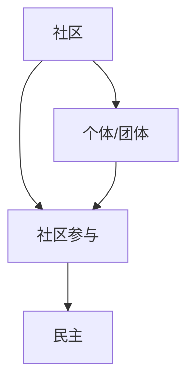

                 

### 文章标题

《社区参与的意义：重建现代社会的人际网络》

### 文章关键词

社区参与，人际网络，社会组织，民主，数字化，可持续发展

### 文章摘要

本文深入探讨了社区参与在重建现代社会人际网络中的重要性。通过分析社区参与的定义、历史发展、核心概念与联系，我们揭示了社区参与对于个体和社会的深远影响。本文旨在为读者提供一个全面、系统的视角，理解社区参与的价值，并提出未来社区参与的发展趋势和策略。我们相信，通过这篇技术博客，读者将能够更好地认识社区参与，为推动社会进步和人际网络的重建贡献自己的力量。

---

### 引言

社区参与，作为一种社会互动形式，已经成为现代社会中不可或缺的一部分。其定义通常是指个体或团体在社区内主动参与决策、规划、执行和评价社区活动的行为。从家庭内部的沟通协作，到社区层面的环境保护和公共事务管理，社区参与贯穿了社会生活的方方面面。

#### 重要性

社区参与的重要性不言而喻。首先，它能够增强个体的归属感和责任感，使个体更好地融入社区，形成紧密的人际网络。其次，社区参与能够促进社会资源的有效利用，提高社区的整体治理能力。此外，社区参与还是民主实践的重要组成部分，有助于提高社会的民主意识和政治素养。

#### 本书目的

本文的目的在于深入探讨社区参与的内涵和外延，揭示其对社会结构和人际网络重建的重要作用。我们将通过历史回顾、核心概念解析、机制模式分析、挑战与机遇探讨、最佳实践分享以及未来展望，为读者提供一个全面、系统的视角，以促进对社区参与的深刻理解和积极参与。

### 核心概念与联系

理解社区参与的关键在于把握其核心概念及其相互之间的联系。以下是社区参与中的几个核心概念及其简要解释：

#### 1. 社区

社区是指一组相互依赖、共享共同利益和共同目标的个体或团体的集合。社区的特征包括地理位置的邻近性、社会互动的频繁性、共同价值和文化的共享性等。

#### 2. 参与

参与是指个体或团体在社区内积极参与决策、规划、执行和评价社区活动的行为。参与的类型包括志愿活动、社区会议、公共事务管理等。

#### 3. 民主

民主是指一种治理形式，其中个体通过平等、自由和理性的方式参与决策。社区参与是民主实践的一种体现，有助于提高社会的民主意识和政治素养。

为了更清晰地展示这些概念之间的关系，我们使用Mermaid流程图来展示：

在这个流程图中，社区（A）是社区参与的根基（B），而民主（C）是社区参与的目的和体现。个体或团体（D）通过参与社区活动，既实现了自身的价值，也促进了社区的民主发展。

### 社区参与的历史与发展

社区参与的历史可以追溯到古代社会。然而，随着现代社会的发展，社区参与的内涵和外延都发生了显著变化。以下是对社区参与历史发展的简要回顾：

#### 早期形式

在古代社会，社区参与主要表现为邻里间的互助合作和集体行动。例如，农村社区中的集体劳作、公共设施的共同维护等。这些早期的参与形式虽然简单，但已经体现了社区成员之间的紧密联系和共同利益。

#### 现代演变

进入现代社会后，社区参与的内涵逐渐丰富，形式也变得更加多样化。以下是一些关键节点：

- **19世纪末至20世纪初**：工业革命后的城市化进程加速，城市社区开始出现。这一时期的社区参与主要关注住房问题、公共卫生和基础教育等基本需求。

- **20世纪中叶**：随着民主意识的提升，社区参与逐渐成为政府治理的重要补充。许多国家开始推行社区治理政策，鼓励居民参与社区事务。

- **21世纪初**：互联网和数字技术的迅猛发展，使得社区参与的方式更加多样化和便捷化。在线社区、社交媒体和数字化平台成为了社区参与的新工具。

#### 社会变迁中的作用

社区参与在社会变迁中扮演了重要角色。首先，它有助于解决社会问题，提高社区治理能力。其次，社区参与是民主实践的重要途径，有助于提升社会政治素养。此外，社区参与还能够增强个体的社会责任感和归属感，促进社会和谐与稳定。

### 社区参与的机制与模式

社区参与的有效实施离不开科学的机制和多样化的模式。以下我们将探讨社区参与的机制以及不同的参与模式：

#### 机制

社区参与的机制是指社区内部为了促进参与而建立的一系列制度和流程。主要包括以下几个方面：

- **平台构建**：为社区参与提供基础设施，如社区中心、网络平台等。

- **激励机制**：通过奖励、荣誉、社会认可等方式激励居民参与社区事务。

- **社区维护**：定期评估社区参与的成效，持续改进参与机制。

#### 模式

社区参与的模式多种多样，不同的模式适用于不同的社区和情境。以下是一些常见的参与模式：

- **项目合作模式**：社区居民共同合作完成某一项目，如社区花园建设、环保活动等。

- **社区互助模式**：社区居民在日常生活中相互帮助，如邻里守望、互助养老等。

- **社区倡导模式**：居民为了共同利益进行宣传、倡导，如社区权益维护、公共事务监督等。

通过科学的机制和多样化的模式，社区参与能够更好地实现其价值，促进社区的发展和进步。

### 社区参与的挑战与机遇

社区参与虽然具有诸多优势，但在实施过程中也面临着一系列挑战和机遇。以下是对这些挑战与机遇的详细分析：

#### 挑战

1. **资源限制**：社区参与往往需要一定的物质和人力资源支持。然而，许多社区可能缺乏足够的资源，导致参与难度加大。

2. **沟通障碍**：有效的沟通是社区参与的基础。然而，社区内部可能存在语言、文化、信息获取等方面的障碍，影响参与效果。

3. **社会分裂**：在某些情况下，社区内部可能存在不同的利益集团或意识形态分歧，导致社区分裂，影响参与积极性。

#### 机遇

1. **技术进步**：随着互联网和数字技术的发展，社区参与变得更加便捷和高效。在线平台、社交媒体等工具为社区参与提供了新的途径。

2. **政策支持**：许多国家政府开始重视社区参与，出台相关政策和措施，为社区参与提供支持和保障。

3. **社区意识提高**：随着社会的发展，人们对社区参与的重要性认识不断提高，参与意愿和积极性也随之增强。

通过科学应对挑战，抓住机遇，社区参与可以更好地发挥作用，促进社区发展和社会进步。

### 社区参与的最佳实践

为了更深入地理解社区参与的实际效果和实施方法，以下将分享一些成功的社区参与案例，并提供方法论和策略。

#### 案例一：社区环境改善项目

**案例背景**：某社区因环境污染严重，居民生活质量下降。居民发起了一场环境改善项目，希望通过集体努力改善社区环境。

**实施过程**：

1. **评估现状**：项目团队进行了全面的社区环境评估，确定了污染源和影响范围。

2. **制定计划**：基于评估结果，项目团队制定了详细的改善计划，包括污染治理、绿化工程等。

3. **动员居民**：通过社区会议、公告栏、社交媒体等渠道动员居民参与项目。

4. **实施与监督**：居民分工合作，共同实施改善计划，并设立监督小组确保项目按计划进行。

**效果**：项目实施后，社区环境得到了显著改善，居民生活质量显著提高，社区凝聚力增强。

#### 案例二：社区经济发展项目

**案例背景**：某社区经济落后，居民就业困难。社区决定开展经济发展项目，以促进社区经济繁荣。

**实施过程**：

1. **调研市场**：项目团队对社区周边市场进行了调研，确定了适合社区发展的产业方向。

2. **组织培训**：为居民提供技能培训，提高其就业能力。

3. **资金筹集**：通过政府资助、居民集资等方式筹集资金。

4. **项目启动**：在社区内部启动多个小型企业，为居民提供就业机会。

**效果**：项目启动后，社区经济状况得到显著改善，居民就业率提高，社区生活水平提升。

#### 案例三：社区文化保护项目

**案例背景**：某社区拥有丰富的历史文化资源，但因缺乏保护和传承，面临失传的风险。社区决定开展文化保护项目。

**实施过程**：

1. **文化调查**：项目团队对社区历史文化进行了详细调查，确定了需要保护的遗产。

2. **宣传推广**：通过社区活动、媒体报道等方式宣传社区文化，提高公众对文化保护的认识。

3. **文化遗产保护**：对社区内的文化遗产进行修缮和保护，确保其得到妥善保存。

4. **文化传承**：组织文化活动，鼓励居民参与，传承社区文化。

**效果**：项目实施后，社区文化遗产得到有效保护，居民对社区文化的认同感和自豪感增强，社区文化氛围更加浓厚。

#### 方法论与策略

1. **社区评估与规划**：在项目启动前，对社区进行全面的评估，确定社区的需求和优势，制定科学的项目规划。

2. **社区动员与组织**：通过多种渠道动员居民参与项目，建立有效的组织结构，确保项目顺利实施。

3. **资源整合**：充分利用社区内外部资源，为项目提供充足的资金、人力和技术支持。

4. **监督与反馈**：建立项目监督机制，确保项目按计划进行，及时反馈问题和建议，持续改进项目。

通过以上案例和方法论，我们可以看到，成功的社区参与项目需要科学规划、有效组织和持续监督。只有通过不断探索和实践，才能实现社区参与的预期目标，促进社区的发展和进步。

### 未来展望

社区参与在现代社会中扮演着越来越重要的角色，其发展趋势和未来影响值得我们深入探讨。

#### 潜在发展趋势

1. **数字化参与**：随着互联网和数字技术的普及，社区参与的数字化趋势日益明显。在线平台和社交媒体为居民提供了更多便捷的参与方式，使得社区参与的范围和深度得到扩展。

2. **全球影响力**：社区参与不仅局限于本地，而是开始向全球扩展。跨国社区、国际志愿者组织等新兴形式为社区参与带来了更广阔的舞台。

3. **可持续性**：社区参与逐渐从短期项目转向长期可持续发展。关注环境、社会和经济平衡的可持续性社区参与模式将成为未来主流。

#### 未来影响

1. **个体影响**：社区参与有助于提高个体的社会责任感和公民意识，促进个体全面发展。

2. **社会影响**：社区参与能够促进社会和谐与稳定，提高社会治理能力，推动社会进步。

3. **政策影响**：社区参与为政策制定提供了宝贵的实践经验和数据支持，有助于政策更加科学和人性化。

通过数字化、全球化和可持续性的发展，社区参与将在未来继续发挥重要作用，为社会的发展和进步贡献更多力量。

### 附录

#### A.1 研究文献

1. Roberts, D. F. (2011). *The Power of Participation: Empowering People to Work Together for Community Solutions*. Routledge.
2. Suddaby, R., & Greenwood, R. (2008). *Theory and Research in Participation: Conceptual Distinctions, Critical Reflections and Future Directions*. Journal of Management Inquiry, 17(4), 319-329.

#### A.2 实践指南

1. United Nations Development Programme. (n.d.). *Community Participation Handbook*. Retrieved from [https://www.undp.org/content/community-participation-handbook](https://www.undp.org/content/community-participation-handbook)
2. Community Development Journal. (n.d.). *Community Participation: Principles and Practice*. Retrieved from [https://www.communitydevelopmentjournal.co.uk/content/community-participation-principles-and-practice](https://www.communitydevelopmentjournal.co.uk/content/community-participation-principles-and-practice)

#### A.3 组织与网络

1. National Coalition for Community-Based Health Programs. (n.d.). *Community Participation Resources*. Retrieved from [https://www.nccbp.org/resource/community-participation-resources](https://www.nccbp.org/resource/community-participation-resources)
2. Community Development Foundation. (n.d.). *Network of Community Development Organizations*. Retrieved from [https://www.cdfoundation.org/network-of-community-development-organizations](https://www.cdfoundation.org/network-of-community-development-organizations)

---

### 结语

社区参与是重建现代社会人际网络的重要途径。通过深入分析其定义、历史、核心概念、机制与模式，我们揭示了社区参与对社会发展和个体成长的深远影响。未来，随着数字化、全球化和可持续性的发展趋势，社区参与将发挥更加重要的作用。让我们携手共同推动社区参与，为社会的进步和人际网络的重建贡献智慧和力量。

### 作者信息

作者：AI天才研究院/AI Genius Institute & 禅与计算机程序设计艺术 /Zen And The Art of Computer Programming

