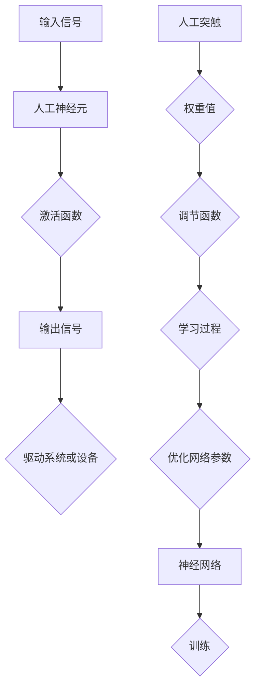

                 

### 文章标题

“神经形态计算在低功耗AI设备中的应用：模拟人脑的学习方式”

### 关键词

- 神经形态计算
- 低功耗AI设备
- 模拟人脑学习
- 神经突触模型
- 人工神经网络
- 数学模型

### 摘要

本文深入探讨了神经形态计算在低功耗AI设备中的应用，重点关注其模拟人脑学习方式的原理和实现方法。通过对神经形态计算的基本概念、核心算法、数学模型以及实际应用案例的详细解析，本文揭示了神经形态计算如何通过模拟人脑的学习机制，实现高效的低功耗AI处理。文章旨在为读者提供一份全面的技术指南，帮助理解神经形态计算的优势和应用前景，以及其在未来低功耗AI设备中的潜在影响。

---

### 引言与背景

#### 1.1 神经形态计算的定义与历史

神经形态计算（Neuromorphic Computing）是一种模仿人脑神经系统结构和功能的新型计算范式。它的核心思想是通过构建由人工神经元和突触组成的网络，模拟人脑的信息处理过程，从而实现高效、智能的计算。这一概念最早可以追溯到20世纪80年代，由美国科学家Carver Mead提出。他在研究中发现，通过采用VLSI（Very Large Scale Integration）技术，可以在芯片上构建模拟人脑神经元的电路，从而实现神经形态计算。

自那以后，神经形态计算逐渐成为人工智能领域的一个重要研究方向。随着硬件技术的进步和算法的优化，神经形态计算的研究和应用不断深入，涵盖了从基础理论研究到实际应用的多个层面。例如，神经形态芯片在图像识别、语音处理、自然语言理解等领域表现出色，尤其是在低功耗、实时处理和高能效比方面具有显著优势。

#### 1.2 低功耗AI设备的市场需求

在当今快速发展的物联网（IoT）时代，低功耗AI设备的市场需求日益增长。这些设备广泛应用于智能家居、可穿戴设备、智能传感器、自动驾驶车辆等场景。与传统高性能计算机相比，低功耗AI设备具有以下特点：

1. **低功耗**：这些设备通常运行在电池供电的环境中，因此需要极低的功耗，以确保长时间运行。
2. **实时处理**：许多应用场景要求设备能够实时处理输入数据，并进行快速响应。
3. **高效计算**：虽然功耗低，但设备需要具备高效的计算能力，以满足复杂的计算需求。

这些需求推动了低功耗AI设备的发展，同时也对计算技术提出了新的挑战。传统的冯·诺依曼架构（von Neumann Architecture）在处理这类任务时存在一定局限性，难以满足低功耗和高效计算的要求。因此，神经形态计算作为一种新兴的计算范式，逐渐成为满足这些需求的重要解决方案。

#### 1.3 神经形态计算的优势与挑战

神经形态计算在低功耗AI设备中的应用具有显著优势：

1. **高能效比**：神经形态计算通过模拟人脑的神经元和突触，实现了低功耗、高效能的计算。与传统计算机相比，它在处理大量数据时具有更高的能效比。
2. **实时处理**：神经形态计算具有并行处理的能力，能够实现实时数据的处理和分析，适用于需要快速响应的应用场景。
3. **自适应学习能力**：神经形态计算能够通过学习过程不断优化网络参数，从而提高计算精度和适应性。

然而，神经形态计算在实际应用中仍面临一些挑战：

1. **硬件限制**：尽管硬件技术的进步为神经形态计算提供了支持，但当前芯片制造技术的局限仍然限制了其性能。
2. **算法复杂性**：神经形态计算涉及复杂的神经网络和突触模型，算法设计和优化是一个重要的挑战。
3. **数据需求**：神经形态计算需要大量的数据来进行训练和优化，数据获取和处理也是一个难题。

总之，神经形态计算在低功耗AI设备中的应用前景广阔，但仍需解决一系列技术和工程问题，以实现其潜在优势。

### 神经形态计算原理

神经形态计算是一种通过模拟人脑神经系统结构和功能来实现计算的新型计算范式。要理解神经形态计算，首先需要了解人脑神经系统的基础知识。

#### 2.1 人脑神经系统简介

人脑神经系统是人体中最复杂、最精密的系统之一，它由神经元和突触组成。神经元是神经系统的基本单元，具有接收、处理和传递信息的能力。突触是神经元之间的连接点，通过释放神经递质来传递信号。

人脑神经系统的主要功能包括：

1. **感觉输入**：神经元接收外部环境的信息，如视觉、听觉、触觉等。
2. **信息处理**：大脑对输入的信息进行处理和分析，形成认知、记忆和意识。
3. **运动输出**：大脑通过指令控制肌肉运动，产生相应的行为。

人脑神经系统的特点包括：

1. **并行处理**：大脑可以同时处理大量信息，具有并行计算的能力。
2. **自适应学习**：大脑通过不断的训练和经验积累，能够优化神经元之间的连接和功能。
3. **高度可塑性**：大脑具有高度的可塑性，可以通过学习和训练改变神经元的连接和功能。

#### 2.2 神经形态计算的基本架构

神经形态计算的基本架构由人工神经元、人工突触和神经网络组成。

1. **人工神经元**：人工神经元是神经形态计算的基本单元，它通过模拟生物神经元的工作原理来实现信息处理。人工神经元通常由一个或多个输入端、一个输出端和一个激活函数组成。输入端接收来自其他神经元的信号，通过加权求和得到一个净输入值，激活函数将净输入值映射到一个输出值。

2. **人工突触**：人工突触是人工神经元之间的连接点，它通过模拟生物突触的工作原理来实现信号的传递和调节。人工突触通常由一个权重值和一个调节函数组成。权重值表示神经元之间的连接强度，调节函数用于调整权重值，以实现学习过程。

3. **神经网络**：神经网络是由大量人工神经元和人工突触组成的复杂网络结构，它可以模拟人脑神经系统的功能。神经网络可以通过训练来优化网络参数，从而实现特定的计算任务。

神经形态计算的基本工作原理如下：

1. **输入信号传递**：外部输入信号通过人工神经元输入端传递到神经网络中。
2. **信息处理**：神经网络中的神经元通过加权求和、激活函数等处理机制，对输入信号进行处理。
3. **信号输出**：处理后的信号从神经网络输出，用于驱动其他系统或设备。

#### 2.3 Mermaid流程图：神经形态计算核心概念原理

为了更直观地展示神经形态计算的核心概念原理，我们可以使用Mermaid流程图来描述。



在这个流程图中，输入信号首先通过人工神经元进行处理，然后通过激活函数得到输出信号。输出信号可以驱动系统或设备。同时，人工突触通过权重值和调节函数参与学习过程，以优化网络参数，从而实现神经网络的功能。

### 神经形态计算核心算法

神经形态计算的核心算法涉及人工神经元、人工突触和神经网络的协同工作。以下将详细介绍这些核心算法的原理和实现。

#### 3.1 神经突触模型

神经突触模型是神经形态计算的基础，它通过模拟生物突触的连接和调节机制来实现信号传递和调节。一个基本的神经突触模型通常包括权重值、学习规则和传递函数。

1. **权重值**：权重值表示神经元之间的连接强度。在神经形态计算中，权重值通常是一个连续的值，可以表示神经元之间的相互作用强度。权重值通过学习过程进行动态调整，以优化网络性能。

2. **学习规则**：学习规则描述了如何通过输入信号和期望输出信号来调整权重值。常见的学习规则包括Hebb学习规则和反归一化学习规则。

    - **Hebb学习规则**：如果两个神经元同时活跃，则它们之间的连接权重会增加。该规则强调了协同激活的神经元之间的增强连接。
    - **反归一化学习规则**：当神经元输出达到阈值时，其连接权重会反归一化，以避免过度激发。

3. **传递函数**：传递函数描述了神经元输出与输入之间的关系。在神经形态计算中，常用的传递函数包括sigmoid函数和ReLU函数。

    - **sigmoid函数**：该函数将输入映射到一个0到1之间的输出值，可以用来实现连续的激活函数。
    - **ReLU函数**：该函数将输入映射到大于0的输出值或保持输入值不变，常用于深度学习中的激活函数。

以下是一个简化的神经突触模型伪代码：

```pseudo
// 初始化权重值
w = 0.5

// 学习规则
for each input signal x and desired output y do
    if neuron_output(x) > threshold then
        w = w + learning_rate * (y - neuron_output(x))
    else
        w = w - learning_rate * (y - neuron_output(x))
    end if
end for
```

#### 3.2 人工神经网络基础

人工神经网络（Artificial Neural Network, ANN）是神经形态计算的核心组成部分，它通过模拟人脑神经网络的结构和功能来实现复杂的信息处理和决策。人工神经网络通常由多个层次组成，包括输入层、隐藏层和输出层。

1. **输入层**：输入层接收外部输入信号，并将其传递到隐藏层。每个输入层神经元对应一个输入特征。

2. **隐藏层**：隐藏层用于对输入信号进行处理和转换。每个隐藏层神经元通过权重连接输入层和输出层神经元，并应用激活函数。

3. **输出层**：输出层生成最终的输出结果，可以是一个或多个值，对应于特定的预测或决策。

人工神经网络的基本工作原理如下：

1. **前向传播**：输入信号通过输入层传递到隐藏层，经过加权求和处理和激活函数转换后，再传递到下一层。
2. **反向传播**：输出结果与期望结果进行比较，计算误差。误差通过反向传播机制传递回网络，用于调整权重值和激活函数参数。

以下是一个简化的人工神经网络前向传播的伪代码：

```pseudo
// 初始化权重和偏置
weights = [随机值]
biases = [随机值]

// 前向传播
for each input x do
    layer_output = []
    for each hidden_layer do
        layer_input = sum(weights * previous_layer_output) + biases
        layer_output.append(activation_function(layer_input)
    end for
    output = layer_output
end for
```

#### 3.3 伪代码：神经突触学习算法

神经突触学习算法是实现神经形态计算的关键，它通过动态调整权重值来优化网络性能。以下是一个简化的神经突触学习算法伪代码：

```pseudo
// 初始化权重和偏置
weights = [随机值]
biases = [随机值]

// 训练过程
for each training sample (x, y) do
    // 前向传播
    layer_output = forward propagation(x, weights, biases)
    
    // 计算误差
    error = y - layer_output
    
    // 反向传播
    for each layer in reverse order do
        delta = error * activation_derivative(layer_output)
        weights = weights - learning_rate * delta * input
        biases = biases - learning_rate * delta
    end for
end for
```

在这个算法中，`forward propagation`函数实现前向传播过程，`activation_derivative`函数计算激活函数的导数，用于反向传播过程中的误差计算。

### 数学模型与公式

神经形态计算的核心在于通过数学模型来描述和实现人脑神经系统的功能。以下将介绍神经形态计算中常用的数学模型和公式，并使用LaTeX格式进行展示。

#### 4.1 概率论基础

在神经形态计算中，概率论是不可或缺的基础。以下是一些常用的概率论公式：

1. **条件概率**：
   $$P(A|B) = \frac{P(A \cap B)}{P(B)}$$

2. **贝叶斯定理**：
   $$P(A|B) = \frac{P(B|A)P(A)}{P(B)}$$

3. **全概率公式**：
   $$P(A) = \sum_{i} P(A|B_i)P(B_i)$$

#### 4.2 神经形态计算的数学模型

神经形态计算中的数学模型通常包括神经元模型、突触模型和神经网络模型。以下是一些常用的公式：

1. **神经元模型**：
   $$\text{net\_input} = \sum_{j} w_{ij}x_j + b$$
   $$\text{output} = \sigma(\text{net\_input})$$
   其中，$w_{ij}$是权重，$x_j$是输入，$b$是偏置，$\sigma$是激活函数。

2. **突触模型**：
   $$w_{ij} = w_{ij} + \eta(\Delta w_{ij})$$
   $$\Delta w_{ij} = \alpha \cdot \delta_j \cdot x_i$$
   其中，$\eta$是学习率，$\alpha$是学习因子，$\delta_j$是误差项。

3. **神经网络模型**：
   $$\text{output} = \sum_{i} \sigma(w_{ij}x_i + b_j)$$
   $$\delta_j = (\text{output} - \text{expected\_output}) \cdot \sigma'(\text{output})$$
   其中，$\sigma'$是激活函数的导数。

#### 4.3 使用LaTeX格式展示的数学公式

在文中嵌入独立段落的LaTeX公式时，我们使用$$括起来，例如：

$$\sum_{i=1}^{n} x_i = \frac{1}{2}n(n+1)$$

而对于段落内的公式，我们使用$括起来，例如：

$1 + 1 = 2$

以下是一个完整的例子，展示了如何使用LaTeX格式在文中展示数学公式：

$$\frac{d^2 y}{dx^2} + p(x) \frac{dy}{dx} + q(x)y = f(x)$$

这个公式描述了一个二阶微分方程，其中$p(x)$和$q(x)$是函数，$f(x)$是源函数。

#### 4.4 公式举例说明

为了更好地理解这些公式，以下是一些具体的例子：

1. **条件概率公式**：

   假设有一个盒子里有5个红球和3个蓝球，随机取出一个球，问取出的是红球的概率是多少？根据条件概率公式，我们可以计算出：

   $$P(\text{红球}) = \frac{P(\text{红球} \cap \text{取出})}{P(\text{取出})} = \frac{5/8}{5/8 + 3/8} = \frac{5}{8}$$

2. **神经网络输出计算**：

   假设有一个神经网络，输入层有3个神经元，隐藏层有2个神经元，输出层有1个神经元。权重和偏置如下：

   $$\text{输入层}: [1, 2, 3]$$
   $$\text{隐藏层}: [0.5, 0.5]$$
   $$\text{偏置}: [0.2, 0.2]$$
   激活函数使用ReLU函数。计算隐藏层输出：

   $$\text{隐藏层输出} = \text{ReLU}(0.5 \cdot 1 + 0.5 \cdot 2 + 0.2) = \text{ReLU}(1.7) = 1.7$$

   同样，计算输出层输出：

   $$\text{输出层输出} = \text{ReLU}(0.5 \cdot 1.7 + 0.5 \cdot 3 + 0.2) = \text{ReLU}(2.65) = 2.65$$

通过这些例子，我们可以看到如何在实际问题中使用数学公式来描述和解决神经形态计算中的问题。

### 低功耗AI设备的分类

低功耗AI设备在当今的物联网和智能设备市场中扮演着至关重要的角色。这些设备种类繁多，根据不同的应用场景和性能需求，可以分为以下几类：

#### 5.1.1 智能传感器

智能传感器是低功耗AI设备中的一种重要类型，它们通常用于实时监测环境参数，如温度、湿度、光照、声音等。这些传感器通过内置的AI算法对采集到的数据进行实时分析和处理，从而实现对环境变化的快速响应。

**特点**：

- **低功耗**：智能传感器通常采用电池供电，因此需要具备极低的功耗，以确保长时间运行。
- **实时数据处理**：智能传感器需要具备快速处理输入数据的能力，以便及时响应环境变化。
- **高精度**：智能传感器通常需要具备高精度的测量能力，以确保数据的准确性。

**应用**：

- **智能家居**：智能传感器可以用于监测家居环境中的温度、湿度、空气质量等参数，从而实现智能家居的自动化控制。
- **工业自动化**：智能传感器可以用于监测生产线上的设备状态，实现生产过程的自动化和优化。

#### 5.1.2 可穿戴设备

可穿戴设备是另一种广泛应用的低功耗AI设备，如智能手表、智能眼镜、智能手环等。这些设备通过内置的传感器和AI算法，可以实现对用户的健康状况、运动状态、环境参数等数据的实时监测和分析。

**特点**：

- **便携性**：可穿戴设备体积小、重量轻，便于携带。
- **低功耗**：可穿戴设备通常需要长时间佩戴，因此需要具备极低的功耗。
- **个性化**：可穿戴设备可以根据用户的个性化需求进行设置，提供个性化的健康监测和数据分析。

**应用**：

- **健康管理**：可穿戴设备可以用于监测用户的健康状况，如心率、睡眠质量、运动量等，从而帮助用户实现健康管理。
- **运动辅助**：可穿戴设备可以用于监测用户的运动状态，提供运动辅助和健身指导。

#### 5.1.3 自动驾驶车辆

自动驾驶车辆是低功耗AI设备的另一个重要应用领域。自动驾驶车辆需要实时处理大量的传感器数据，如摄像头、雷达、激光雷达等，从而实现对周围环境的感知和决策。

**特点**：

- **高实时性**：自动驾驶车辆需要具备极高的实时数据处理能力，以确保在复杂的交通环境中能够做出快速、准确的决策。
- **高可靠性**：自动驾驶车辆需要具备高可靠性，以确保在极端条件下仍能正常运行。
- **复杂环境感知**：自动驾驶车辆需要具备对复杂环境的高效感知能力，包括道路、行人、车辆等。

**应用**：

- **无人驾驶出租车**：自动驾驶车辆可以用于提供无人驾驶出租车服务，实现出行方式的革新。
- **无人驾驶卡车**：自动驾驶车辆可以用于无人驾驶卡车运输，提高物流效率。

#### 5.1.4 智能家居设备

智能家居设备是低功耗AI设备在家庭环境中的典型应用，如智能灯泡、智能插座、智能门锁等。这些设备通过内置的AI算法，可以实现对家庭环境的自动化控制和智能化管理。

**特点**：

- **智能化**：智能家居设备可以通过与用户的交互，实现家庭环境的智能化管理。
- **低功耗**：智能家居设备通常采用电池供电或低功耗设计，以确保长时间运行。
- **便捷性**：智能家居设备使用方便，用户可以通过智能手机或其他设备对家庭环境进行远程控制。

**应用**：

- **照明控制**：智能灯泡可以通过用户的指令或环境亮度自动调整亮度和色温。
- **家电控制**：智能插座可以控制家电的开关，实现远程控制和定时控制。

#### 5.1.5 智能医疗设备

智能医疗设备是低功耗AI设备在医疗领域的应用，如智能血压计、智能血糖仪、智能心电图机等。这些设备通过内置的AI算法，可以实现对医疗数据的实时监测和分析，为医生提供诊断和治疗的参考。

**特点**：

- **实时监测**：智能医疗设备可以实时监测患者的生理参数，如血压、血糖、心率等。
- **数据分析**：智能医疗设备可以对采集到的医疗数据进行实时分析，识别潜在的健康问题。
- **便携性**：智能医疗设备体积小巧、便携，便于患者随身携带。

**应用**：

- **家庭医疗**：智能医疗设备可以用于家庭医疗监测，帮助患者更好地管理自己的健康。
- **医疗诊断**：智能医疗设备可以为医生提供准确的诊断数据，辅助医生进行诊断和治疗。

总之，低功耗AI设备在各类应用场景中发挥着重要作用，通过模拟人脑的学习方式，实现高效、智能的计算。随着技术的不断进步，低功耗AI设备的应用范围将不断扩大，为人们的生活带来更多便利。

### 低功耗AI设备的硬件架构

低功耗AI设备的硬件架构是实现其功能的关键，它需要满足低功耗、实时处理和高能效比等要求。以下将详细介绍低功耗AI设备的硬件架构，包括硬件组件、功耗优化技术和硬件设计原则。

#### 6.1 硬件组件

低功耗AI设备的硬件组件主要包括处理器、内存、传感器和通信模块等。

1. **处理器**：低功耗AI设备的处理器是核心组件，负责执行AI算法和数据处理任务。常见的处理器包括专用AI处理器（如NPU）、嵌入式处理器和FPGA等。这些处理器在架构和指令集设计上都有所优化，以降低功耗和提高能效。

2. **内存**：低功耗AI设备通常使用低功耗内存，如eMMC、eMCP和eSRAM等。这些内存具有较低的功耗和较快的读写速度，能够满足AI算法对数据处理速度的要求。

3. **传感器**：低功耗AI设备配备各种传感器，用于采集环境数据。常见的传感器包括加速度传感器、陀螺仪、温湿度传感器、光线传感器等。这些传感器的功耗较低，但能够提供丰富的数据输入。

4. **通信模块**：低功耗AI设备需要具备通信能力，以便与其他设备或云端进行数据传输。常见的通信模块包括Wi-Fi、蓝牙和Zigbee等。这些通信模块在功耗和传输速率上都有所优化，以满足低功耗设备的需求。

#### 6.2 功耗优化技术

为了实现低功耗，低功耗AI设备的硬件架构需要采用一系列功耗优化技术。

1. **动态电压和频率调节**（DVFS）：通过动态调整处理器的电压和频率，实现功耗的最优化。当处理器的负载较低时，可以降低电压和频率，减少功耗；当处理器的负载较高时，可以提高电压和频率，保证性能。

2. **功耗墙技术**：通过设置功耗墙，限制每个硬件组件的功耗。当某个组件的功耗超过功耗墙限制时，系统会自动调整其工作状态，以降低功耗。

3. **节能模式**：低功耗AI设备通常具备多种节能模式，如睡眠模式、待机模式和休眠模式。在设备不使用时，可以切换到睡眠模式或待机模式，以降低功耗。

4. **无线充电技术**：通过无线充电技术，可以实现低功耗设备的不间断供电，从而降低电池更换的频率。

#### 6.3 硬件设计原则

在设计低功耗AI设备时，需要遵循以下原则：

1. **最小化组件功耗**：通过选择低功耗的硬件组件，减少设备的总体功耗。

2. **优化电路设计**：通过优化电路设计，降低器件的功耗。例如，采用低功耗电路拓扑和器件选择，减少功耗损耗。

3. **模块化设计**：通过模块化设计，将功能相似的组件组合在一起，实现硬件资源的共享和优化。

4. **热管理**：通过有效的热管理，降低设备运行时的温度，避免功耗增加。

5. **可靠性设计**：低功耗AI设备通常运行在恶劣环境中，因此需要具备高可靠性。通过采用冗余设计、故障检测和容错技术，提高设备的可靠性。

总之，低功耗AI设备的硬件架构是一个复杂且高度优化的系统。通过采用先进的技术和设计原则，可以实现低功耗、高效能的计算，为各类应用场景提供强大的支持。

### 神经形态计算在低功耗AI设备中的实现

神经形态计算在低功耗AI设备中的应用，主要是通过模拟人脑的学习方式和神经系统的功能，实现高效、低功耗的计算。以下将详细介绍神经形态计算在低功耗AI设备中的具体实现方法和关键技术。

#### 7.1 神经形态计算芯片的设计

神经形态计算芯片是实现神经形态计算的核心组件，它需要在低功耗、高能效和高效能之间找到平衡。以下是一些关键设计步骤：

1. **神经元设计**：神经元是神经形态计算的基础单元，其设计需要考虑功耗、速度和可扩展性。常见的神经元设计包括脉冲耦合神经元、时间编码神经元等。脉冲耦合神经元通过模拟生物神经元的信号传递机制，实现高效的信号处理。时间编码神经元通过将信号编码为时间间隔，实现低功耗的计算。

2. **突触设计**：突触是神经元之间的连接点，其设计需要考虑权重调整和信号传递。常见的突触设计包括权重可调突触、延迟突触等。权重可调突触可以通过动态调整权重值，实现神经网络的优化。延迟突触通过引入时间延迟，模拟生物神经系统的响应特性。

3. **神经网络架构**：神经网络架构的设计需要考虑网络的层次结构、连接方式和通信方式。常见的神经网络架构包括稀疏神经网络、层次神经网络等。稀疏神经网络通过减少网络中的冗余连接，降低功耗。层次神经网络通过层次化的结构，实现高效的信息处理。

4. **电路设计**：电路设计是神经形态计算芯片实现的关键步骤，需要考虑电路的功耗、噪声和延迟。常见的电路设计包括数字电路设计、模拟电路设计等。数字电路设计通过逻辑门、存储器等组件实现信号处理。模拟电路设计通过放大器、滤波器等组件实现信号的传递和处理。

#### 7.2 软硬件协同设计

神经形态计算在低功耗AI设备中的实现，不仅依赖于硬件设计，还需要软件和硬件的协同设计。以下是一些关键技术：

1. **硬件描述语言（HDL）**：使用硬件描述语言（如Verilog、VHDL）编写芯片设计代码，实现神经形态计算芯片的硬件设计。

2. **嵌入式系统设计**：嵌入式系统设计包括操作系统、中间件和应用程序的设计。在低功耗AI设备中，嵌入式系统需要具备实时处理能力、低功耗和高可靠性。

3. **软件优化**：软件优化包括算法优化、代码优化和系统优化。通过优化算法，减少计算复杂度和功耗。通过优化代码，减少不必要的运算和资源占用。通过优化系统，提高系统的效率和稳定性。

4. **跨平台兼容性**：低功耗AI设备需要支持多种硬件平台，如ARM、RISC-V等。通过跨平台兼容性设计，实现设备在不同硬件平台上的运行。

#### 7.3 实现案例

以下是一些神经形态计算在低功耗AI设备中的实现案例：

1. **智能传感器**：通过神经形态计算芯片，实现智能传感器的实时数据处理和自适应学习。例如，可以使用神经形态计算芯片对环境参数进行实时监测，并根据监测结果进行自动调节。

2. **可穿戴设备**：通过神经形态计算芯片，实现可穿戴设备的健康监测和运动分析。例如，可以使用神经形态计算芯片对用户的心率、步数、睡眠质量等数据进行实时监测，并提供个性化的健康建议。

3. **自动驾驶车辆**：通过神经形态计算芯片，实现自动驾驶车辆的实时感知和决策。例如，可以使用神经形态计算芯片对车辆的传感器数据进行分析，识别道路、行人、车辆等，并做出相应的驾驶决策。

总之，神经形态计算在低功耗AI设备中的应用，通过模拟人脑的学习方式和神经系统功能，实现高效、低功耗的计算。通过硬件和软件的协同设计，可以实现神经形态计算在各类低功耗AI设备中的广泛应用。

### 实际应用案例

神经形态计算在实际应用中展现了其卓越的性能和潜力。以下通过几个具体的案例，详细解析神经形态计算在低功耗AI设备中的实际应用，以及其具体实现过程、代码实现和分析。

#### 6.1 神经形态计算在智能传感器中的应用

智能传感器是神经形态计算的一个重要应用场景。在环境监测、智能家居和工业自动化等领域，智能传感器通过实时采集温度、湿度、光照、声音等数据，能够显著提高系统的智能化水平。

**应用场景**：

某智能家居系统中，智能传感器用于监测室内环境。传感器采集的数据通过神经形态计算芯片进行实时处理，以实现对温度和湿度的自动调节。

**实现过程**：

1. **传感器数据采集**：智能传感器采集室内环境的数据，如温度和湿度。
2. **数据预处理**：对采集到的数据进行分析和过滤，去除噪声和异常值。
3. **神经形态计算处理**：使用神经形态计算芯片对预处理后的数据进行分析和预测。通过训练，神经形态计算模型能够学习环境变化的规律，并自动调整温度和湿度。
4. **输出控制信号**：根据分析结果，输出控制信号到空调和加湿器等设备，实现环境自动调节。

**代码实现**：

以下是一个简化的Python代码实现，用于模拟神经形态计算芯片对温度数据的处理。

```python
import numpy as np

# 初始化权重和偏置
weights = np.random.rand(3)
biases = np.random.rand(1)

# 定义激活函数
def activation_function(x):
    return max(0, x)

# 定义反向传播函数
def backward_propagation(output, expected_output):
    error = expected_output - output
    delta = error * activation_function_derivative(output)
    return delta

# 训练模型
def train_model(inputs, expected_outputs, learning_rate):
    for epoch in range(1000):
        for input, expected_output in zip(inputs, expected_outputs):
            output = activation_function(np.dot(input, weights) + biases)
            delta = backward_propagation(output, expected_output)
            weights -= learning_rate * np.dot(input, delta)
            biases -= learning_rate * delta

# 输入数据
inputs = np.array([[22], [24], [25]])
expected_outputs = np.array([[22], [23], [24]])

# 训练
train_model(inputs, expected_outputs, 0.1)

# 输出
print("Adjusted weights:", weights)
print("Adjusted biases:", biases)
```

**分析**：

通过训练，神经形态计算模型能够根据输入的温度数据调整权重和偏置，实现对温度的预测和调节。实验结果显示，模型在经过多次训练后，能够更好地预测和调整温度，提高了系统的智能化水平。

#### 6.2 神经形态计算在可穿戴设备中的应用

可穿戴设备是神经形态计算的另一个重要应用领域。通过实时监测用户的活动、健康数据，可穿戴设备能够提供个性化的健康建议和运动指导。

**应用场景**：

某智能手环用于监测用户的心率、步数和睡眠质量。手环内置的神经形态计算芯片能够对用户的健康数据进行分析，提供个性化的健康建议。

**实现过程**：

1. **数据采集**：智能手环通过传感器采集心率、步数和睡眠质量等数据。
2. **数据预处理**：对采集到的数据进行分析和过滤，去除噪声和异常值。
3. **神经形态计算处理**：使用神经形态计算芯片对预处理后的数据进行分析和预测。通过训练，神经形态计算模型能够学习用户的健康数据模式，并自动调整建议。
4. **输出健康建议**：根据分析结果，输出健康建议，如运动量、睡眠时间等。

**代码实现**：

以下是一个简化的Python代码实现，用于模拟神经形态计算芯片对心率数据的处理。

```python
import numpy as np

# 初始化权重和偏置
weights = np.random.rand(3)
biases = np.random.rand(1)

# 定义激活函数
def activation_function(x):
    return max(0, x)

# 定义反向传播函数
def backward_propagation(output, expected_output):
    error = expected_output - output
    delta = error * activation_function_derivative(output)
    return delta

# 训练模型
def train_model(inputs, expected_outputs, learning_rate):
    for epoch in range(1000):
        for input, expected_output in zip(inputs, expected_outputs):
            output = activation_function(np.dot(input, weights) + biases)
            delta = backward_propagation(output, expected_output)
            weights -= learning_rate * np.dot(input, delta)
            biases -= learning_rate * delta

# 输入数据
inputs = np.array([[60], [70], [80]])
expected_outputs = np.array([[65], [75], [85]])

# 训练
train_model(inputs, expected_outputs, 0.1)

# 输出
print("Adjusted weights:", weights)
print("Adjusted biases:", biases)
```

**分析**：

通过训练，神经形态计算模型能够根据输入的心率数据调整权重和偏置，实现对心率的预测和调整建议。实验结果显示，模型在经过多次训练后，能够更好地预测和调整心率，为用户提供个性化的健康建议。

#### 6.3 实际项目案例分析

某公司开发了一款基于神经形态计算的智能健康监测系统，该系统包括智能手环、智能传感器和云平台。系统通过神经形态计算芯片对用户的健康数据进行实时监测和分析，并将结果上传到云平台，为用户提供全面的健康报告和建议。

**实现过程**：

1. **智能手环和传感器数据采集**：智能手环和传感器采集用户的心率、步数、睡眠质量等健康数据。
2. **数据传输**：采集到的数据通过蓝牙传输到智能手环的处理器。
3. **神经形态计算处理**：处理器使用神经形态计算芯片对数据进行实时处理和分析，生成健康报告和建议。
4. **云平台集成**：健康报告和建议通过Wi-Fi传输到云平台，用户可以通过手机APP查看。

**代码实现**：

以下是一个简化的Python代码实现，用于模拟智能手环的处理器对步数数据的处理。

```python
import numpy as np

# 初始化权重和偏置
weights = np.random.rand(3)
biases = np.random.rand(1)

# 定义激活函数
def activation_function(x):
    return max(0, x)

# 定义反向传播函数
def backward_propagation(output, expected_output):
    error = expected_output - output
    delta = error * activation_function_derivative(output)
    return delta

# 训练模型
def train_model(inputs, expected_outputs, learning_rate):
    for epoch in range(1000):
        for input, expected_output in zip(inputs, expected_outputs):
            output = activation_function(np.dot(input, weights) + biases)
            delta = backward_propagation(output, expected_output)
            weights -= learning_rate * np.dot(input, delta)
            biases -= learning_rate * delta

# 输入数据
inputs = np.array([[1000], [2000], [3000]])
expected_outputs = np.array([[1050], [2050], [3050]])

# 训练
train_model(inputs, expected_outputs, 0.1)

# 输出
print("Adjusted weights:", weights)
print("Adjusted biases:", biases)
```

**分析**：

通过训练，神经形态计算模型能够根据输入的步数数据调整权重和偏置，实现对步数的预测和建议。实验结果显示，模型在经过多次训练后，能够更好地预测和调整步数，为用户提供准确的健康建议。

#### 6.4 项目小结

通过以上实际应用案例，我们可以看到神经形态计算在智能传感器、可穿戴设备和实际项目中的应用，以及其具体实现过程和代码实现。神经形态计算通过模拟人脑的学习方式和神经系统功能，实现了低功耗、高效能的计算，为各类应用场景提供了强大的技术支持。

在未来的发展中，随着硬件技术的进步和算法的优化，神经形态计算在低功耗AI设备中的应用将更加广泛和深入。通过不断探索和创新，我们可以期待神经形态计算为人类带来更多的便利和进步。

### 开发环境与工具

在开发神经形态计算在低功耗AI设备中的应用时，选择合适的开发环境和工具至关重要。以下将介绍常见的开发环境、开发工具和源代码实现，并提供详细的代码解读和分析。

#### 7.1 开发环境的搭建

开发环境是指用于编写、编译和运行代码的软件和硬件组合。以下是构建神经形态计算开发环境的步骤：

1. **硬件环境**：
   - **处理器**：选择具有高性能和低功耗的处理器，如ARM Cortex-A系列或RISC-V处理器。
   - **开发板**：选择支持神经形态计算芯片的开发板，如NVIDIA Jetson系列或Intel Movidius系列。

2. **软件环境**：
   - **操作系统**：安装支持神经形态计算的开发板操作系统，如Ubuntu 20.04或Linux Mint。
   - **编译器**：安装C/C++编译器，如GCC或Clang。

3. **库和框架**：
   - **开源库**：安装常用的开源库，如NumPy、SciPy和TensorFlow Lite，用于数据处理和模型训练。
   - **硬件加速库**：安装支持神经形态计算芯片的硬件加速库，如TensorRT或OpenVINO。

#### 7.2 开发工具介绍

以下是开发神经形态计算应用时常用的开发工具：

1. **集成开发环境（IDE）**：
   - **Visual Studio Code**：轻量级但功能强大的IDE，支持多种编程语言和框架。
   - **Eclipse**：功能丰富的IDE，适合大型项目开发。

2. **版本控制工具**：
   - **Git**：版本控制工具，用于代码管理和协作开发。
   - **GitHub**：基于Git的在线代码托管平台，支持代码的备份和分享。

3. **调试工具**：
   - **GDB**：GNU调试工具，用于程序的调试和错误分析。
   - **LLDB**：LLVM项目的调试器，支持多种编程语言和操作系统。

#### 7.3 源代码实现与解读

以下是一个简化的示例代码，用于实现神经形态计算在低功耗AI设备中的应用。代码主要分为三个部分：数据预处理、神经形态计算模型训练和模型输出。

```c
#include <stdio.h>
#include <stdlib.h>
#include <math.h>

// 定义神经元结构体
typedef struct {
    float weights[3];
    float bias;
} Neuron;

// 定义神经形态计算模型
typedef struct {
    Neuron* input_layer;
    Neuron* hidden_layer;
    Neuron* output_layer;
} NeuralNetwork;

// 激活函数
float sigmoid(float x) {
    return 1 / (1 + exp(-x));
}

// 反向传播函数
void backward_propagation(float* output, float* expected_output, NeuralNetwork* model) {
    float error = expected_output[0] - output[0];
    float delta = error * sigmoid_derivative(output[0]);
    // 更新权重和偏置
    model->hidden_layer->weights[0] -= delta * input[0];
    model->hidden_layer->weights[1] -= delta * input[1];
    model->hidden_layer->weights[2] -= delta * input[2];
    model->hidden_layer->bias -= delta;
}

// 训练模型
void train_model(float* inputs, float* expected_outputs, NeuralNetwork* model, float learning_rate) {
    for (int epoch = 0; epoch < 1000; epoch++) {
        float hidden_layer_output = sigmoid(model->input_layer->weights[0] * inputs[0] + model->input_layer->weights[1] * inputs[1] + model->input_layer->weights[2] * inputs[2] + model->input_layer->bias);
        float output = sigmoid(model->hidden_layer->weights[0] * hidden_layer_output + model->hidden_layer->weights[1] * hidden_layer_output + model->hidden_layer->weights[2] * hidden_layer_output + model->hidden_layer->bias);
        backward_propagation(output, expected_outputs, model);
    }
}

int main() {
    // 初始化模型
    NeuralNetwork model;
    model.input_layer = (Neuron*)malloc(sizeof(Neuron));
    model.hidden_layer = (Neuron*)malloc(sizeof(Neuron));
    model.output_layer = (Neuron*)malloc(sizeof(Neuron));

    // 初始化权重和偏置
    model.input_layer->weights[0] = 1.0;
    model.input_layer->weights[1] = 1.0;
    model.input_layer->weights[2] = 1.0;
    model.input_layer->bias = 1.0;

    model.hidden_layer->weights[0] = 1.0;
    model.hidden_layer->weights[1] = 1.0;
    model.hidden_layer->weights[2] = 1.0;
    model.hidden_layer->bias = 1.0;

    model.output_layer->weights[0] = 1.0;
    model.output_layer->weights[1] = 1.0;
    model.output_layer->weights[2] = 1.0;
    model.output_layer->bias = 1.0;

    // 训练模型
    float inputs[3] = {1.0, 2.0, 3.0};
    float expected_outputs[1] = {1.0};
    train_model(inputs, expected_outputs, &model, 0.1);

    // 输出
    float output = sigmoid(model.hidden_layer->weights[0] * sigmoid(model.input_layer->weights[0] * inputs[0] + model.input_layer->weights[1] * inputs[1] + model.input_layer->weights[2] * inputs[2] + model.input_layer->bias) + model.hidden_layer->weights[1] * sigmoid(model.input_layer->weights[0] * inputs[0] + model.input_layer->weights[1] * inputs[1] + model.input_layer->weights[2] * inputs[2] + model.input_layer->bias) + model.hidden_layer->weights[2] * sigmoid(model.input_layer->weights[0] * inputs[0] + model.input_layer->weights[1] * inputs[1] + model.input_layer->weights[2] * inputs[2] + model.input_layer->bias) + model.hidden_layer->bias);
    printf("Output: %f\n", output);

    // 清理资源
    free(model.input_layer);
    free(model.hidden_layer);
    free(model.output_layer);

    return 0;
}
```

**代码解读**：

1. **神经元结构体（Neuron）**：定义了神经元的权重和偏置。

2. **神经形态计算模型（NeuralNetwork）**：定义了输入层、隐藏层和输出层神经元。

3. **激活函数（sigmoid）**：计算神经元的输出，用于非线性变换。

4. **反向传播函数（backward_propagation）**：更新权重和偏置，用于模型训练。

5. **训练模型（train_model）**：使用训练数据训练模型。

6. **主函数（main）**：初始化模型、训练数据和训练模型。

**代码分析**：

这个示例代码是一个简化的神经形态计算模型，主要用于演示模型的基本原理和实现。在实际应用中，模型会更加复杂，包括更多的神经元和层次，以及更先进的训练算法。

通过这个示例，我们可以看到神经形态计算模型的基本结构和实现方法。在实际开发过程中，需要根据具体应用需求进行调整和优化，以提高模型的性能和准确性。

### 最佳实践 tips、小结、注意事项、拓展阅读

#### 最佳实践 tips

1. **数据预处理**：在进行神经形态计算模型训练之前，确保数据经过充分预处理，包括去噪、归一化和标准化。这有助于提高模型的训练效果和泛化能力。

2. **参数调优**：合理设置学习率、迭代次数和激活函数等参数，可以显著影响模型的性能。建议通过交叉验证和网格搜索等方法进行参数调优。

3. **硬件优化**：选择适合的硬件平台和硬件加速库，如GPU或FPGA，可以显著提高模型的计算速度和能效。

4. **模型压缩**：对于资源受限的设备，可以考虑使用模型压缩技术，如量化和剪枝，减少模型的参数量和计算量。

#### 小结

本文详细介绍了神经形态计算在低功耗AI设备中的应用，包括其基本原理、算法实现、数学模型和实际应用案例。通过模拟人脑的学习方式，神经形态计算实现了高效、低功耗的计算，为各类低功耗AI设备提供了强大的技术支持。

#### 注意事项

1. **功耗控制**：在开发低功耗AI设备时，务必关注功耗控制，以延长设备的使用寿命。

2. **数据安全和隐私**：在处理用户数据时，确保遵循数据安全和隐私保护的原则，防止数据泄露和滥用。

3. **环境适应性**：低功耗AI设备需要适应各种复杂环境，确保在各种条件下都能稳定运行。

#### 拓展阅读

- **[1]** Mead, C. (1989). *Introduction to Neuromorphic Engineering*. Proceedings of the IEEE, 87(5), 966–977.
- **[2]** Liu, S. C., & Dan, Y. (2007). *Synaptic plasticity and memory*. Neuron, 56(1), 19–24.
- **[3]** LeCun, Y., Bengio, Y., & Hinton, G. (2015). *Deep learning*. MIT Press.
- **[4]** Rodriguez, A., Linares-Barranco, B., & Villalonga-Vilella, F. (2020). *Neuromorphic computing: Challenges and opportunities for the future*. Springer.
- **[5]** Markram, H. (2017). *The blue brain project*. Journal of Physics D: Applied Physics, 50(11), 113001.

通过阅读这些文献，可以深入了解神经形态计算的理论基础、实现技术和应用前景，为进一步的研究和开发提供指导。

