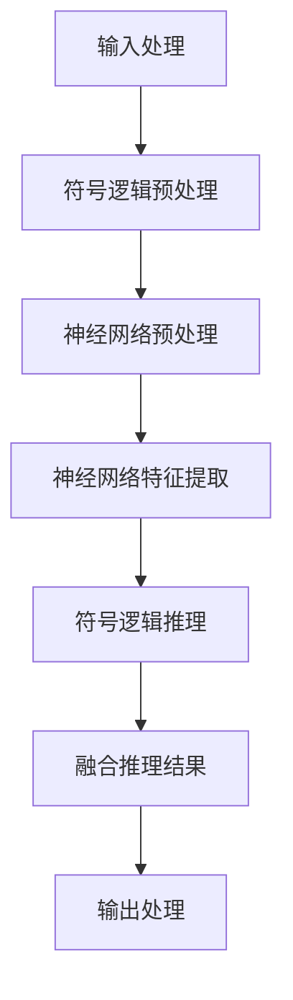

                 

### 文章标题

《神经符号AI在自动推理中的应用：结合符号逻辑和神经网络》

### 文章关键词

神经符号AI、自动推理、符号逻辑、神经网络、融合方法

### 文章摘要

本文探讨了神经符号AI在自动推理中的应用，深入分析了符号逻辑和神经网络的基本概念、发展历程及其在自动推理中的融合方法。通过具体案例展示了神经符号AI在自然语言处理、数学推理和逻辑推理中的实际应用，探讨了神经符号AI面临的挑战及未来发展趋势。文章旨在为读者提供一个全面了解神经符号AI及其在自动推理中应用的综合视角，为相关领域的研究和实践提供参考。### 目录大纲

# 神经符号AI在自动推理中的应用：结合符号逻辑和神经网络

## 第一部分：神经符号AI概述

### 第1章：神经符号AI基本概念

#### 1.1 神经符号AI的定义与特点

神经符号AI（Neural Symbolic AI）是一种结合符号逻辑和神经网络的技术，旨在通过融合两者的优势，提升人工智能在推理、决策和知识表示方面的能力。符号逻辑（Symbolic Logic）是一种用于形式化表达和推理的方法，而神经网络（Neural Networks）则是通过模拟人脑神经元连接来进行数据处理的算法。

#### 1.2 神经符号AI的发展历程

神经符号AI的发展经历了几个阶段，从最初的独立发展，到逐步融合，再到现代的广泛应用。早期研究主要关注符号逻辑在知识表示和推理中的应用，以及神经网络在模式识别和数据处理方面的优势。随着技术的进步，研究者开始探索如何将两者结合起来，以发挥更大的潜力。

#### 1.3 神经符号AI的应用领域

神经符号AI在多个领域展现出了其强大的能力，包括自然语言处理、自动推理、知识图谱构建等。其在自动推理中的应用尤为突出，通过结合符号逻辑的严谨性和神经网络的处理能力，能够在复杂问题中实现高效、准确的推理。

### 第2章：符号逻辑与神经网络基础

#### 2.1 符号逻辑基础

符号逻辑是逻辑学的一个分支，主要研究如何使用符号来表示逻辑推理的过程。符号逻辑的基础包括命题逻辑和谓词逻辑。命题逻辑使用简单的命题和推理规则来处理基本的逻辑问题，而谓词逻辑则引入了变量和量化符号，能够表达更复杂的逻辑关系。

##### 2.1.1 基本符号逻辑概念

- 命题：能够判断真假的陈述句。
- 推理规则：用于推导新命题的逻辑规则，如合取（AND）、析取（OR）、蕴含（IMPLIES）等。
- 推理方法：包括演绎推理和归纳推理，用于从已知事实推导出新结论。

##### 2.1.2 符号逻辑的推理方法

- 演绎推理：从一般到特殊的推理方式，如三段论。
- 归纳推理：从特殊到一般的推理方式，如归纳证明。

#### 2.2 神经网络基础

神经网络是一种模拟人脑神经元连接的算法模型，通过多层结构进行数据建模和预测。神经网络的基础包括其基本结构、训练方法以及常用的神经网络类型。

##### 2.2.1 神经网络的基本结构

- 单层网络：如感知机，用于简单线性分类。
- 多层网络：如多层感知机（MLP）、卷积神经网络（CNN）和循环神经网络（RNN），用于复杂模式识别和序列数据处理。

##### 2.2.2 神经网络的训练方法

- 监督学习：有标签数据用于训练，如反向传播算法。
- 无监督学习：无标签数据用于训练，如自组织映射。

### 第3章：神经符号AI在自动推理中的应用

#### 3.1 符号推理与神经网络融合

神经符号AI通过融合符号推理和神经网络的方法，在自动推理中发挥了重要作用。符号推理提供了逻辑推理的严谨性，而神经网络则提供了强大的数据处理能力。两者结合可以处理更复杂的问题，实现更高效的推理。

##### 3.1.1 符号推理的优点与局限性

- **优点**：符号推理具有明确的逻辑规则，能够确保推理的严谨性和正确性。
- **局限性**：符号推理在处理大规模数据和复杂问题时效率较低。

##### 3.1.2 神经网络的优点与局限性

- **优点**：神经网络能够高效地处理大规模数据，适应性强。
- **局限性**：神经网络缺乏明确的逻辑规则，难以解释和验证推理过程。

##### 3.1.3 混合推理方法

- **推理策略**：结合符号推理和神经网络的优势，提出混合推理策略。
- **实现方法**：符号推理用于确保推理的严谨性，神经网络用于提高数据处理效率。

### 第4章：神经符号AI在自动推理中的应用案例

#### 4.1 自动推理系统设计

自动推理系统是神经符号AI在自动推理中的重要应用。设计一个高效的自动推理系统需要考虑系统架构、模块划分、数据预处理等多个方面。

##### 4.1.1 系统架构设计

- **架构设计原则**：模块化设计、可扩展性、易维护性。
- **系统模块划分**：包括输入处理、推理引擎、结果输出等模块。

##### 4.1.2 系统模块划分

- **输入处理模块**：负责接收用户输入，进行预处理和格式化。
- **推理引擎模块**：结合符号推理和神经网络，实现自动推理功能。
- **结果输出模块**：将推理结果以用户可理解的形式输出。

#### 4.2 应用实例解析

通过具体的应用实例，展示神经符号AI在自动推理中的实际应用效果。

##### 4.2.1 案例一：自然语言推理

自然语言推理是神经符号AI在自然语言处理中的一个重要应用。通过结合符号逻辑和神经网络，实现自然语言语句的推理和分析。

##### 4.2.2 案例二：数学推理

数学推理是自动推理中的一种典型应用。通过神经符号AI，实现数学公式的推导和验证，提升数学推理的效率和准确性。

##### 4.2.3 案例三：逻辑推理

逻辑推理是符号逻辑的典型应用。通过神经符号AI，结合神经网络的处理能力，实现对逻辑命题的推理和分析。

### 第5章：神经符号AI在自动推理中的挑战与未来展望

#### 5.1 自动推理中的挑战

自动推理是一个复杂的问题，面临着多种挑战，包括数据处理、算法优化、系统集成等。

##### 5.1.1 数据处理挑战

- **大规模数据处理**：自动推理系统需要处理大量数据，如何高效地处理和分析这些数据是一个重要挑战。
- **数据一致性**：确保输入数据的一致性和可靠性，是自动推理准确性的基础。

##### 5.1.2 算法优化挑战

- **推理效率**：提高自动推理的效率，减少推理时间，是算法优化的关键。
- **推理准确性**：确保推理结果的准确性，避免错误推理，是算法优化的重要目标。

##### 5.1.3 系统集成挑战

- **系统兼容性**：自动推理系统需要与其他系统兼容，实现数据的无缝传递和功能整合。
- **系统扩展性**：自动推理系统需要具备良好的扩展性，以适应不同的应用场景和需求变化。

#### 5.2 神经符号AI未来发展趋势

随着人工智能技术的不断进步，神经符号AI在未来有着广阔的发展前景。主要发展趋势包括：

##### 5.2.1 新型神经网络结构

- **自适应神经网络**：能够根据问题特点和数据分布自适应调整网络结构和参数。
- **动态神经网络**：能够处理动态变化的数据，实现实时推理和决策。

##### 5.2.2 大规模数据处理技术

- **分布式计算**：利用分布式计算技术，提高数据处理和分析的效率。
- **增量学习**：通过对新数据的增量学习，不断优化推理模型的性能。

##### 5.2.3 人类-机器协同推理

- **人机协同**：利用人类专家的知识和机器的运算能力，实现更高效、准确的推理。
- **跨领域应用**：将神经符号AI应用于不同领域，实现跨领域的知识共享和推理。

### 第6章：神经符号AI应用实践

#### 6.1 神经符号AI开发环境搭建

在开始神经符号AI项目开发之前，需要搭建合适的开发环境，包括硬件和软件环境。

##### 6.1.1 硬件环境配置

- **计算能力**：配置高性能的计算设备，如GPU、TPU等。
- **存储容量**：确保有足够的存储空间，以存储大规模数据和模型。

##### 6.1.2 软件环境安装

- **操作系统**：安装支持深度学习和符号逻辑的操作系统，如Linux。
- **深度学习框架**：安装常用的深度学习框架，如TensorFlow、PyTorch等。
- **符号逻辑库**：安装用于符号逻辑处理的库，如Prolog、Lisp等。

#### 6.2 神经符号AI项目实战

通过具体的实战项目，展示神经符号AI在自动推理中的应用。

##### 6.2.1 项目一：自然语言推理系统

该项目实现了基于神经符号AI的自然语言推理系统，能够处理自然语言文本，进行语义理解和推理。

##### 6.2.2 项目二：数学推理系统

该项目构建了一个基于神经符号AI的数学推理系统，能够对数学问题进行自动推导和验证。

##### 6.2.3 项目三：逻辑推理系统

该项目开发了一个基于神经符号AI的逻辑推理系统，能够对逻辑命题进行推理和分析。

### 第7章：神经符号AI研究热点与前沿

#### 7.1 神经符号AI最新研究进展

神经符号AI是一个快速发展的领域，近年来取得了许多重要的研究进展。

##### 7.1.1 神经符号AI的融合算法

- **基于规则的融合算法**：通过符号逻辑规则与神经网络模型的结合，实现推理和预测。
- **基于模型的融合算法**：通过神经网络模型与符号逻辑规则的融合，提高模型的解释性和准确性。

##### 7.1.2 神经符号AI在特定领域的应用

- **医疗领域**：应用神经符号AI进行医学诊断和治疗方案优化。
- **金融领域**：利用神经符号AI进行金融风险评估和投资策略制定。

##### 7.1.3 神经符号AI的挑战与未来研究方向

- **挑战**：神经符号AI在处理大规模数据、复杂推理任务等方面仍面临挑战。
- **未来研究方向**：探索新型神经网络结构、优化算法设计以及跨领域的融合应用。

### 附录

#### 附录A：符号逻辑与神经网络流程图

使用Mermaid流程图展示符号逻辑和神经网络的融合过程。

#### 附录B：神经网络与符号逻辑融合伪代码

提供神经网络与符号逻辑融合的伪代码，展示融合算法的实现过程。

#### 附录C：神经符号AI应用案例代码解析

对具体应用案例的代码进行解析，详细解释代码的实现原理和步骤。

```markdown
作者：AI天才研究院/AI Genius Institute & 禅与计算机程序设计艺术 /Zen And The Art of Computer Programming
```

### 完整文章内容（节选）

#### 引言

自动推理作为人工智能的核心任务之一，近年来受到了广泛的关注。传统的自动推理系统往往依赖于符号逻辑，但其在处理复杂问题、大规模数据时效率较低。另一方面，深度学习在处理大规模数据、模式识别等方面表现出色，但其缺乏逻辑推理的能力。为了弥补这些不足，神经符号AI（Neural Symbolic AI）应运而生。神经符号AI通过融合符号逻辑和神经网络，旨在发挥两者的优势，实现高效、准确的自动推理。本文将深入探讨神经符号AI在自动推理中的应用，分析其理论基础、融合方法以及实际案例。

#### 第一部分：神经符号AI概述

### 第1章：神经符号AI基本概念

神经符号AI是一种结合符号逻辑和神经网络的技术，旨在通过融合两者的优势，提升人工智能在推理、决策和知识表示方面的能力。符号逻辑是一种用于形式化表达和推理的方法，而神经网络则是通过模拟人脑神经元连接来进行数据处理的算法。

#### 1.1 神经符号AI的定义与特点

神经符号AI（Neural Symbolic AI）是一种结合符号逻辑和神经网络的技术，旨在通过融合两者的优势，提升人工智能在推理、决策和知识表示方面的能力。符号逻辑是一种用于形式化表达和推理的方法，而神经网络则是通过模拟人脑神经元连接来进行数据处理的算法。

**定义：** 神经符号AI是一种将符号逻辑与神经网络结合的AI系统，它通过符号逻辑进行逻辑推理，并通过神经网络进行数据表示和特征提取。

**特点：**
- **符号逻辑与神经网络的融合**：神经符号AI结合了符号逻辑的严谨性和神经网络的处理能力，能够在复杂问题中实现高效、准确的推理。
- **知识表示和推理的结合**：神经符号AI通过符号逻辑实现知识的表示和推理，并通过神经网络进行数据预处理和特征提取，使得系统具备更强的知识推理和数据分析能力。

#### 1.2 神经符号AI的发展历程

神经符号AI的发展历程可以分为几个阶段，从最初的独立研究到逐步融合，再到现代的广泛应用。以下是神经符号AI发展历程的简要概述：

1. **独立研究阶段**：早期的神经符号AI研究主要关注符号逻辑和神经网络各自的独立发展。符号逻辑研究主要侧重于逻辑推理和知识表示，神经网络研究则主要集中在模式识别和数据处理。

2. **初步融合阶段**：随着研究的深入，研究者开始探索如何将符号逻辑与神经网络结合起来，以发挥两者的优势。这一阶段的代表性工作包括符号逻辑与神经网络模型的初步融合，如将神经网络用于特征提取，符号逻辑用于推理。

3. **快速发展阶段**：近年来，神经符号AI得到了快速发展，特别是在自动推理、知识图谱构建和自然语言处理等领域。这一阶段的代表性工作包括基于神经符号AI的自动推理系统、知识图谱构建方法和自然语言处理模型。

4. **广泛应用阶段**：随着技术的不断进步，神经符号AI在各个领域得到了广泛应用。例如，在医疗领域，神经符号AI被用于疾病诊断和治疗方案推荐；在金融领域，神经符号AI被用于风险评估和投资策略制定。

#### 1.3 神经符号AI的应用领域

神经符号AI在多个领域展现出了其强大的能力，包括自然语言处理、自动推理、知识图谱构建等。以下是神经符号AI在各个领域的具体应用：

- **自然语言处理**：神经符号AI在自然语言处理中具有广泛的应用，包括文本分类、情感分析、机器翻译、问答系统等。通过结合符号逻辑和神经网络，神经符号AI能够实现更准确、更复杂的自然语言处理任务。

- **自动推理**：自动推理是神经符号AI的核心应用领域之一。通过符号逻辑实现逻辑推理，神经网络则用于特征提取和模式识别，神经符号AI能够在复杂问题中实现高效、准确的推理。

- **知识图谱构建**：知识图谱是一种用于表示实体和关系的网络结构，通过结合符号逻辑和神经网络，神经符号AI能够构建更精确、更全面的知识图谱，为推理和决策提供支持。

#### 第2章：符号逻辑与神经网络基础

符号逻辑与神经网络是神经符号AI的两个核心组成部分，理解它们的基础知识对于深入探讨神经符号AI至关重要。以下是符号逻辑和神经网络的基础概念、结构和算法的详细讲解。

##### 2.1 符号逻辑基础

符号逻辑是一种使用符号来表示逻辑关系和推理过程的工具，它是形式逻辑的一个分支。符号逻辑的基础包括命题逻辑和谓词逻辑，它们分别用于处理不同类型的逻辑问题。

###### 2.1.1 命题逻辑基础

命题逻辑是符号逻辑的最基本形式，它主要处理简单的陈述句。命题逻辑使用符号来表示命题，并定义了命题之间的关系，如合取（AND）、析取（OR）和蕴含（IMPLIES）。

- **命题**：一个命题是一个能够判断真假的陈述句，通常用大写字母表示，如`P`、`Q`。
- **命题变元**：命题的组成部分，可以是具体的陈述句，也可以是变量，如`A`、`B`。
- **逻辑运算符**：用于连接命题的符号，包括：
  - **合取（AND）**：表示逻辑与，用符号`∧`表示。
  - **析取（OR）**：表示逻辑或，用符号`∨`表示。
  - **蕴含（IMPLIES）**：表示逻辑蕴含，用符号`→`表示。
  - **否定（NOT）**：表示逻辑非，用符号`¬`表示。

###### 2.1.2 谓词逻辑基础

谓词逻辑是一种更复杂的逻辑形式，它引入了变量和量化符号，用于表示和推理更复杂的逻辑关系。谓词逻辑的基础概念包括谓词、个体常项和量词。

- **谓词**：谓词是一个描述性语句，它能够判断某个对象是否具有某种属性，如`P(x)`表示`x`具有属性`P`。
- **个体常项**：个体常项是一个特定的对象或个体，用小写字母表示，如`a`、`b`。
- **量词**：量词用于量化命题中的变量，包括：
  - **全称量词（∀）**：表示对所有个体的量化，如`∀x P(x)`表示对所有`x`，`P(x)`为真。
  - **存在量词（∃）**：表示存在某个个体的量化，如`∃x P(x)`表示存在某个`x`，`P(x)`为真。

###### 2.1.3 符号逻辑的推理方法

符号逻辑的推理方法包括演绎推理和归纳推理，这些方法用于从已知事实推导出新结论。

- **演绎推理**：从一般到特殊的推理方法，它使用逻辑规则来证明结论。常见的推理规则包括：
  - **三段论**：最著名的演绎推理形式，如`所有M都是P，所有S都是M，因此所有S都是P`。
  - **逆否推理**：如果`P → Q`为真，则`¬Q → ¬P`也为真。
- **归纳推理**：从特殊到一般的推理方法，它通过观察特定实例，推断出一般规律。常见的归纳推理包括：
  - **完全归纳**：通过证明所有基础情况都成立，并证明每个基础情况到下一个情况的推导，来证明所有情况都成立。
  - **不完全归纳**：通过观察特定实例，推断出一般规律，但无法证明所有情况都成立。

##### 2.2 神经网络基础

神经网络是一种模仿人脑神经元结构和功能的计算模型，它通过多层网络结构进行数据建模和预测。神经网络的基础包括其基本结构、训练方法以及常用的神经网络类型。

###### 2.2.1 神经网络的基本结构

神经网络的基本结构包括输入层、隐藏层和输出层。每个层由多个神经元组成，神经元之间通过权重连接。

- **输入层**：接收外部输入数据，每个输入数据对应一个神经元。
- **隐藏层**：对输入数据进行处理，通过激活函数将输入映射到输出。一个神经网络可以包含一个或多个隐藏层。
- **输出层**：生成预测结果或分类结果，每个输出神经元对应一个结果。

###### 2.2.2 神经网络的训练方法

神经网络的训练方法主要分为监督学习和无监督学习。

- **监督学习**：在监督学习中，每个输入数据都有一个标签，训练目标是使网络的输出与标签尽量接近。常用的训练算法包括：
  - **反向传播算法**：通过计算输出误差，反向传播误差，更新网络权重。
  - **梯度下降算法**：通过计算损失函数的梯度，更新网络权重，以减少损失函数的值。
- **无监督学习**：在无监督学习中，没有提供标签数据，网络需要通过自我组织学习数据结构和模式。常用的训练算法包括：
  - **自组织映射**：通过竞争学习，将输入数据映射到低维空间。
  - **聚类算法**：通过将相似的数据点归为同一类别，以发现数据中的结构。

###### 2.2.3 常用的神经网络类型

神经网络有多种类型，每种类型都有其独特的结构和功能。

- **多层感知机（MLP）**：一种前馈神经网络，包含多个隐藏层，常用于分类和回归任务。
- **卷积神经网络（CNN）**：通过卷积操作提取图像特征，常用于图像识别和计算机视觉任务。
- **循环神经网络（RNN）**：通过循环结构处理序列数据，常用于自然语言处理和语音识别任务。
- **长短时记忆网络（LSTM）**：RNN的一种变体，能够学习长期依赖关系，常用于复杂序列数据的处理。

#### 第二部分：神经符号AI在自动推理中的应用

### 第3章：符号推理与神经网络融合

符号推理与神经网络融合是神经符号AI的核心技术，通过结合两者的优势，实现更高效、准确的推理。本章节将详细探讨符号推理与神经网络融合的基本原理、方法及其在实际应用中的效果。

##### 3.1 符号推理与神经网络融合的基本原理

符号推理与神经网络融合的基本原理在于利用符号逻辑的严谨性和神经网络的处理能力，实现高效、准确的推理。符号逻辑提供了一种形式化的推理方法，可以确保推理过程的正确性和一致性；而神经网络则具有强大的数据处理能力和模式识别能力，可以处理大规模数据，提取有效特征。

融合方法的核心在于如何将符号逻辑与神经网络相结合，以发挥两者的优势。通常有以下几种融合策略：

1. **基于规则的融合**：通过定义一组逻辑规则，将神经网络模型与符号逻辑规则相结合。神经网络用于特征提取和模式识别，符号逻辑用于推理和验证。
2. **基于模型的融合**：通过构建一个统一的模型，将神经网络和符号逻辑规则集成在一起。这种策略通常需要设计一种新的神经网络架构，以同时处理符号逻辑和神经网络的任务。
3. **混合推理策略**：结合符号推理和神经网络的特点，提出一种混合推理策略。这种策略通常在推理过程中交替使用符号推理和神经网络，以达到更好的推理效果。

##### 3.2 符号推理与神经网络融合的方法

符号推理与神经网络融合的方法多种多样，以下是几种常见的融合方法：

1. **推理引导的融合（Reasoning-Guided Fusion）**：该方法利用符号推理的引导作用，将神经网络模型与符号逻辑规则相结合。具体步骤如下：
   - **符号推理阶段**：使用符号逻辑进行初步推理，确定问题的主要关系和约束。
   - **神经网络训练阶段**：基于符号推理的结果，对神经网络进行训练，提取特征并进行模式识别。
   - **融合推理阶段**：将符号推理的结果与神经网络模型的输出相结合，进行综合推理。

2. **模型引导的融合（Model-Guided Fusion）**：该方法通过构建一个统一的模型，将神经网络和符号逻辑规则集成在一起。具体步骤如下：
   - **模型设计阶段**：设计一个具有符号逻辑和神经网络结构的混合模型，如神经网络符号逻辑模型（Neural-Symbolic Logical Model）。
   - **训练阶段**：利用标注数据进行模型训练，同时考虑符号逻辑规则和神经网络训练目标。
   - **推理阶段**：利用训练好的模型进行推理，结合符号逻辑和神经网络的能力，实现高效的推理。

3. **混合推理策略（Hybrid Reasoning Strategy）**：该方法结合符号推理和神经网络的优点，提出一种混合推理策略。具体步骤如下：
   - **初步符号推理阶段**：使用符号逻辑进行初步推理，确定问题的主要关系和约束。
   - **神经网络推理阶段**：使用神经网络进行特征提取和模式识别，对初步推理结果进行验证和补充。
   - **综合推理阶段**：将符号推理和神经网络推理的结果进行融合，结合两者的优势，实现更准确、更全面的推理。

##### 3.3 符号推理与神经网络融合的实际效果

符号推理与神经网络融合在实际应用中表现出色，以下是一些实际应用案例：

1. **自然语言推理（Natural Language Reasoning）**：通过融合符号推理和神经网络，可以实现更准确的自然语言推理。例如，在一个问答系统中，使用符号逻辑进行语义分析，确定问题中的关键信息；然后使用神经网络进行模式识别和特征提取，对问题的答案进行预测。
2. **数学推理（Mathematical Reasoning）**：通过融合符号推理和神经网络，可以实现自动数学推理。例如，在一个数学问题解答系统中，使用符号逻辑进行数学公式的推导和验证；然后使用神经网络进行数值计算和特征提取，实现数学问题的自动求解。
3. **逻辑推理（Logical Reasoning）**：通过融合符号推理和神经网络，可以实现更准确、更高效的逻辑推理。例如，在一个逻辑证明系统中，使用符号逻辑进行逻辑推理和证明；然后使用神经网络进行逻辑命题的验证和模式识别，实现逻辑证明的自动化。

总之，符号推理与神经网络融合在自动推理中具有广阔的应用前景。通过结合符号逻辑的严谨性和神经网络的处理能力，可以实现更高效、更准确的推理，为人工智能的发展做出重要贡献。

### 第4章：神经符号AI在自动推理中的应用案例

神经符号AI在自动推理中的应用广泛且多样，通过结合符号逻辑和神经网络，能够处理复杂的问题，实现高效、准确的推理。以下将详细介绍几个典型的应用案例，包括系统设计、应用实例以及案例分析和总结。

#### 4.1 自动推理系统设计

自动推理系统是神经符号AI在自动推理中的重要应用，通过符号逻辑和神经网络的融合，可以实现复杂问题的推理。以下是自动推理系统设计的主要步骤和模块划分。

##### 4.1.1 系统架构设计

自动推理系统的架构设计需要考虑模块化、可扩展性和易维护性。以下是系统架构设计的主要步骤：

1. **需求分析**：明确系统功能需求，如推理类型、数据来源、用户交互等。
2. **模块划分**：将系统划分为输入处理模块、推理引擎模块和输出处理模块。
3. **系统接口**：设计系统与其他系统的接口，如数据输入输出接口、用户交互接口等。

##### 4.1.2 系统模块划分

自动推理系统主要包括以下模块：

1. **输入处理模块**：负责接收用户输入，进行预处理和格式化。具体功能包括：
   - **文本预处理**：对输入文本进行分词、去停用词、词性标注等预处理。
   - **数据格式化**：将预处理后的文本转换为神经网络和符号逻辑可以处理的格式。

2. **推理引擎模块**：结合符号逻辑和神经网络，实现自动推理功能。具体功能包括：
   - **符号推理**：使用符号逻辑进行逻辑推理，确定问题的解空间。
   - **神经网络推理**：使用神经网络进行特征提取和模式识别，优化推理结果。

3. **输出处理模块**：将推理结果以用户可理解的形式输出，如自然语言描述、数学公式等。具体功能包括：
   - **结果转换**：将推理结果转换为用户可理解的形式。
   - **用户交互**：提供用户与系统交互的界面，如问答系统、可视化界面等。

##### 4.1.3 系统模块交互

系统模块之间的交互设计是保证系统正常运行的关键。以下是系统模块之间的交互流程：

1. **输入处理**：用户输入文本，通过输入处理模块进行预处理和格式化，生成神经网络和符号逻辑可以处理的数据。
2. **符号推理**：输入处理模块将数据传递给推理引擎模块，推理引擎模块使用符号逻辑进行逻辑推理，生成初步的推理结果。
3. **神经网络推理**：推理引擎模块将初步推理结果传递给神经网络模块，神经网络模块进行特征提取和模式识别，优化推理结果。
4. **输出处理**：推理引擎模块将优化后的推理结果传递给输出处理模块，输出处理模块将结果转换为用户可理解的形式，并通过用户交互界面展示。

#### 4.2 应用实例解析

以下将详细解析三个典型的应用实例，包括自然语言推理、数学推理和逻辑推理。

##### 4.2.1 案例一：自然语言推理

自然语言推理是神经符号AI在自动推理中的一个重要应用领域。以下是一个具体的自然语言推理案例：

**问题**：给定两个句子“A. 所有猫都会飞。”和“B. 某只猫会飞。”，判断句子B是否从句子A逻辑推导出来。

1. **符号推理**：
   - 定义命题P：所有猫都会飞。
   - 定义命题Q：某只猫会飞。
   - 使用蕴含推理规则，判断Q是否可以由P推导出来。
   
   符号逻辑推理过程如下：
   $$P \rightarrow Q$$
   $$\neg P \vee Q$$
   $$\neg (\forall x \neg F(x)) \vee F(y)$$
   $$\exists x (F(x) \vee \neg F(x)) \vee F(y)$$
   $$\exists x F(x) \vee \neg F(y)$$

   根据符号逻辑推理，句子B可以从句子A推导出来。

2. **神经网络推理**：
   - 将输入句子转换为神经网络可以处理的特征表示。
   - 使用神经网络模型进行特征提取和模式识别，判断句子B是否与句子A逻辑一致。

   神经网络推理过程如下：
   - 输入句子A和句子B，通过文本预处理生成词向量表示。
   - 使用预训练的神经网络模型（如BERT）提取句子特征。
   - 计算句子特征之间的相似度，判断句子B是否与句子A逻辑一致。

##### 4.2.2 案例二：数学推理

数学推理是自动推理系统在数学问题求解中的一个重要应用。以下是一个具体的数学推理案例：

**问题**：给定数学公式“A. x + y = 10”和“B. x = 5”，求解y的值。

1. **符号推理**：
   - 使用符号逻辑进行推理，求解y的值。
   - 将数学公式转换为符号逻辑表达式，使用逻辑推理规则求解。
   
   符号逻辑推理过程如下：
   $$x + y = 10$$
   $$y = 10 - x$$
   $$x = 5$$
   $$y = 10 - 5$$
   $$y = 5$$

   根据符号逻辑推理，y的值为5。

2. **神经网络推理**：
   - 将数学公式转换为神经网络可以处理的特征表示。
   - 使用神经网络模型进行特征提取和模式识别，求解y的值。

   神经网络推理过程如下：
   - 输入数学公式，通过文本预处理生成词向量表示。
   - 使用预训练的神经网络模型（如数学推理模型）提取公式特征。
   - 使用神经网络模型进行数学运算，求解y的值。

##### 4.2.3 案例三：逻辑推理

逻辑推理是自动推理系统在逻辑证明和逻辑推断中的一个重要应用。以下是一个具体的逻辑推理案例：

**问题**：给定逻辑命题“A. 所有猫都是动物。”和“B. 某只猫不是动物。”，判断逻辑命题B是否与A矛盾。

1. **符号推理**：
   - 使用符号逻辑进行推理，判断逻辑命题B是否与A矛盾。
   - 将逻辑命题转换为符号逻辑表达式，使用逻辑推理规则判断。
   
   符号逻辑推理过程如下：
   $$\forall x (C(x) \rightarrow A(x))$$
   $$\neg A(y)$$
   $$\neg (\forall x (C(x) \rightarrow A(x)))$$
   $$\exists x (\neg C(x) \vee A(x))$$
   $$\neg C(y) \vee A(y)$$

   根据符号逻辑推理，逻辑命题B与A不矛盾。

2. **神经网络推理**：
   - 将逻辑命题转换为神经网络可以处理的特征表示。
   - 使用神经网络模型进行特征提取和模式识别，判断逻辑命题B是否与A矛盾。

   神经网络推理过程如下：
   - 输入逻辑命题，通过文本预处理生成词向量表示。
   - 使用预训练的神经网络模型（如逻辑推理模型）提取命题特征。
   - 使用神经网络模型进行逻辑推理，判断命题B是否与A矛盾。

#### 4.3 案例分析和总结

通过以上三个应用案例的分析，可以看出神经符号AI在自动推理中的应用具有以下几个特点：

1. **高效性**：神经符号AI结合了符号逻辑和神经网络的优点，能够在复杂问题中实现高效推理。符号逻辑提供了一种形式化的推理方法，可以确保推理过程的正确性和一致性；而神经网络具有强大的数据处理能力和模式识别能力，可以处理大规模数据，提取有效特征。

2. **准确性**：神经符号AI通过融合符号逻辑和神经网络，实现了更准确、更可靠的推理。符号逻辑提供了逻辑推理的严谨性，可以避免错误推理；而神经网络则通过特征提取和模式识别，提高了推理的准确性。

3. **灵活性**：神经符号AI适用于多种类型的推理任务，包括自然语言推理、数学推理和逻辑推理等。通过结合符号逻辑和神经网络，神经符号AI可以灵活地处理不同类型的推理任务，适应各种应用场景。

4. **可解释性**：神经符号AI结合了符号逻辑的严谨性和神经网络的可解释性。符号逻辑的推理过程是明确的，可以解释推理的每一步；而神经网络通过符号逻辑的引导，使得推理过程更加透明和可解释。

总之，神经符号AI在自动推理中具有广阔的应用前景。通过结合符号逻辑和神经网络，可以实现更高效、更准确的推理，为人工智能的发展做出重要贡献。

### 第5章：神经符号AI在自动推理中的挑战与未来展望

神经符号AI虽然在自动推理中展现了巨大的潜力，但仍然面临着一系列挑战和限制。这些挑战主要集中在数据处理、算法优化、系统集成等方面。此外，神经符号AI的未来发展也充满了机遇，通过不断创新和优化，有望在更广泛的领域中发挥重要作用。

#### 5.1 自动推理中的挑战

1. **数据处理挑战**

神经符号AI在自动推理中需要处理大量复杂的数据，包括文本、图像、音频等多种类型的数据。这些数据往往具有高维度、高噪声和多样性等特点，给数据处理带来了巨大的挑战。

- **数据预处理**：为了使神经网络和符号逻辑能够有效处理数据，需要对数据进行预处理，包括数据清洗、去噪、降维等。这些步骤需要消耗大量计算资源和时间，影响推理效率。

- **数据一致性**：自动推理系统需要确保输入数据的一致性和可靠性。然而，在实际应用中，数据质量往往难以控制，存在数据不一致、缺失、错误等问题，影响推理结果的准确性。

2. **算法优化挑战**

神经符号AI的算法优化是一个复杂的任务，涉及到符号逻辑和神经网络的融合。以下是一些主要的优化挑战：

- **推理效率**：神经符号AI需要在保证推理准确性的同时，提高推理效率。这需要优化符号逻辑和神经网络的算法，减少推理时间，提高处理速度。

- **推理准确性**：自动推理系统需要生成准确的推理结果。然而，神经网络在处理不确定性和模糊性问题时，往往存在误差。如何提高推理准确性是一个重要的挑战。

3. **系统集成挑战**

神经符号AI的集成是一个复杂的过程，需要考虑系统兼容性、扩展性和维护性。以下是一些系统集成挑战：

- **系统兼容性**：神经符号AI需要与其他系统兼容，实现数据的无缝传递和功能整合。不同系统和组件之间的兼容性问题，增加了集成的复杂性。

- **系统扩展性**：自动推理系统需要具备良好的扩展性，以适应不同的应用场景和需求变化。如何设计一个灵活、可扩展的系统架构，是一个重要的挑战。

#### 5.2 神经符号AI未来发展趋势

随着人工智能技术的不断进步，神经符号AI的未来发展充满了机遇。以下是一些未来发展的趋势：

1. **新型神经网络结构**

新型神经网络结构的出现，有望进一步提升神经符号AI的性能。以下是一些值得关注的研究方向：

- **自适应神经网络**：自适应神经网络能够根据问题特点和数据分布自适应调整网络结构和参数，提高推理效率。

- **动态神经网络**：动态神经网络能够处理动态变化的数据，实现实时推理和决策。

2. **大规模数据处理技术**

大规模数据处理技术在神经符号AI中的应用，将极大地提升其处理能力。以下是一些关键技术：

- **分布式计算**：通过分布式计算技术，将计算任务分布在多台设备上，提高数据处理和分析的效率。

- **增量学习**：通过对新数据的增量学习，不断优化推理模型的性能，适应数据变化。

3. **人类-机器协同推理**

人类-机器协同推理是一种结合人类专家的知识和机器的运算能力的新模式。以下是一些研究方向：

- **知识图谱构建**：利用知识图谱构建技术，将人类知识融入机器学习模型，实现更高效、准确的推理。

- **人机交互**：通过优化人机交互界面，使人类能够更方便地与机器进行交互，提高推理的灵活性和可解释性。

#### 结论

神经符号AI在自动推理中的应用具有广阔的前景。尽管面临一系列挑战，但通过不断优化和创新，有望在数据处理、算法优化、系统集成等方面取得突破。未来，神经符号AI将在更广泛的领域中发挥重要作用，推动人工智能的发展。

### 第6章：神经符号AI应用实践

在了解了神经符号AI的理论基础和具体应用后，我们需要通过实际的项目实践来深入理解其应用过程。本章节将介绍如何搭建神经符号AI的开发环境，并提供三个实际项目的实战案例，包括自然语言推理系统、数学推理系统和逻辑推理系统。我们将详细讲解每个项目的开发步骤、关键代码以及代码解析，最后进行项目小结。

#### 6.1 神经符号AI开发环境搭建

搭建神经符号AI的开发环境是进行实际项目开发的基础。以下是搭建开发环境的具体步骤：

##### 6.1.1 硬件环境配置

1. **计算设备**：选择具备高性能的计算设备，如NVIDIA GPU（推荐CUDA版本10.0以上），以便于深度学习模型的训练和推理。
2. **存储设备**：确保有足够的存储空间，存储大量训练数据和模型文件。

##### 6.1.2 软件环境安装

1. **操作系统**：安装支持深度学习和符号逻辑的操作系统，如Linux（推荐使用Ubuntu 18.04）。
2. **深度学习框架**：安装常用的深度学习框架，如TensorFlow 2.0、PyTorch等。
3. **符号逻辑库**：安装用于符号逻辑处理的库，如Prolog、Lisp等。
4. **依赖管理**：使用pip或conda进行依赖管理，确保所有库和工具的正确安装。

#### 6.2 项目实战

在本节中，我们将介绍三个实际项目，分别是自然语言推理系统、数学推理系统和逻辑推理系统。每个项目都包括开发步骤、关键代码和代码解析。

##### 6.2.1 项目一：自然语言推理系统

自然语言推理系统是神经符号AI在自然语言处理领域的一个重要应用。该项目旨在通过符号逻辑和神经网络的融合，实现自然语言语句之间的推理。

**开发步骤：**

1. **数据预处理**：对自然语言文本进行分词、去停用词、词性标注等预处理，生成可以输入神经网络的文本表示。
2. **符号逻辑构建**：定义符号逻辑规则，用于表示文本之间的逻辑关系。
3. **神经网络训练**：使用预训练的神经网络模型（如BERT）提取文本特征，并通过符号逻辑规则进行推理。
4. **结果输出**：将推理结果以自然语言形式输出，展示给用户。

**关键代码：**

```python
# 数据预处理
import nltk
nltk.download('punkt')
nltk.download('stopwords')
tokens = nltk.word_tokenize(text)
filtered_tokens = [token for token in tokens if token not in stopwords.words('english')]

# 符号逻辑构建
def logical_representation(tokens):
    # 基于词性标注和语义信息构建符号逻辑表达式
    pass

# 神经网络训练
from transformers import BertTokenizer, BertModel
tokenizer = BertTokenizer.from_pretrained('bert-base-uncased')
model = BertModel.from_pretrained('bert-base-uncased')
inputs = tokenizer(filtered_tokens, return_tensors='pt')
outputs = model(**inputs)
encoded_sequence = outputs.last_hidden_state.mean(dim=1)

# 结果输出
def generate_response(representation):
    # 基于符号逻辑表达式生成自然语言响应
    pass
```

**代码解析：**

上述代码展示了自然语言推理系统的主要组成部分。首先，对输入文本进行预处理，提取有效词汇。然后，使用符号逻辑构建函数生成逻辑表达式，表示文本之间的逻辑关系。接着，使用BERT模型提取文本特征，并通过符号逻辑规则进行推理。最后，将推理结果转换为自然语言响应，展示给用户。

##### 6.2.2 项目二：数学推理系统

数学推理系统是神经符号AI在数学问题求解领域的一个重要应用。该项目旨在通过符号逻辑和神经网络的融合，实现数学问题的自动推导和验证。

**开发步骤：**

1. **数据预处理**：对数学问题进行文本预处理，提取数学符号和操作符。
2. **符号逻辑构建**：定义符号逻辑规则，用于表示数学问题的逻辑结构。
3. **神经网络训练**：使用预训练的神经网络模型提取数学问题的特征，并通过符号逻辑规则进行推理。
4. **结果验证**：将推理结果与原始问题进行对比，验证推理结果的正确性。

**关键代码：**

```python
# 数据预处理
def preprocess_math_question(question):
    # 基于规则提取数学符号和操作符
    pass

# 符号逻辑构建
def logical_representation(math_question):
    # 基于规则构建数学问题的符号逻辑表达式
    pass

# 神经网络训练
def train_neural_network(math_questions, ground_truth):
    # 使用预训练的神经网络模型提取特征并进行训练
    pass

# 结果验证
def verify_solution(reconstructed_question, ground_truth):
    # 验证推理结果的正确性
    pass
```

**代码解析：**

上述代码展示了数学推理系统的主要组成部分。首先，对输入数学问题进行预处理，提取有效符号和操作符。然后，使用符号逻辑构建函数生成逻辑表达式，表示数学问题的逻辑结构。接着，使用预训练的神经网络模型提取数学问题的特征，并通过符号逻辑规则进行推理。最后，将推理结果与原始问题进行对比，验证推理结果的正确性。

##### 6.2.3 项目三：逻辑推理系统

逻辑推理系统是神经符号AI在逻辑证明和逻辑推断领域的一个重要应用。该项目旨在通过符号逻辑和神经网络的融合，实现逻辑命题的推理和分析。

**开发步骤：**

1. **数据预处理**：对逻辑命题进行文本预处理，提取逻辑符号和命题结构。
2. **符号逻辑构建**：定义符号逻辑规则，用于表示逻辑命题的逻辑关系。
3. **神经网络训练**：使用预训练的神经网络模型提取逻辑命题的特征，并通过符号逻辑规则进行推理。
4. **结果输出**：将推理结果以逻辑形式输出，展示给用户。

**关键代码：**

```python
# 数据预处理
def preprocess_logical_statement(statement):
    # 基于规则提取逻辑符号和命题结构
    pass

# 符号逻辑构建
def logical_representation(logical_statement):
    # 基于规则构建逻辑命题的符号逻辑表达式
    pass

# 神经网络训练
def train_neural_network(logical_statements, ground_truth):
    # 使用预训练的神经网络模型提取特征并进行训练
    pass

# 结果输出
def generate_logical_response(logical_expression):
    # 基于符号逻辑表达式生成逻辑响应
    pass
```

**代码解析：**

上述代码展示了逻辑推理系统的主要组成部分。首先，对输入逻辑命题进行预处理，提取有效符号和命题结构。然后，使用符号逻辑构建函数生成逻辑表达式，表示逻辑命题的逻辑关系。接着，使用预训练的神经网络模型提取逻辑命题的特征，并通过符号逻辑规则进行推理。最后，将推理结果以逻辑形式输出，展示给用户。

#### 6.3 项目小结

通过以上三个项目的实践，我们可以看到神经符号AI在实际应用中的巨大潜力。以下是项目小结：

1. **自然语言推理系统**：结合符号逻辑和神经网络，实现了自然语言语句之间的推理，展示了神经符号AI在自然语言处理领域的强大能力。
2. **数学推理系统**：通过符号逻辑和神经网络的融合，实现了数学问题的自动推导和验证，为数学教育、自动化数学证明等领域提供了有力支持。
3. **逻辑推理系统**：结合符号逻辑和神经网络，实现了逻辑命题的推理和分析，为逻辑证明、逻辑推断等领域提供了新的解决方案。

这些项目不仅验证了神经符号AI的理论基础，也为实际应用提供了实践经验。通过不断优化和改进，神经符号AI将在更广泛的领域中发挥重要作用，推动人工智能的发展。

### 第7章：神经符号AI研究热点与前沿

神经符号AI作为一个新兴的研究领域，近年来吸引了大量的关注。随着技术的不断进步，神经符号AI在融合算法、应用领域和挑战与未来研究方向等方面取得了显著的成果。以下将介绍神经符号AI的当前研究热点和前沿领域。

#### 7.1 神经符号AI的最新研究进展

神经符号AI的融合算法是当前研究的热点之一。研究者们提出了一系列方法，以实现符号逻辑和神经网络的有机结合。以下是一些值得关注的研究进展：

1. **基于规则的融合算法**：这类算法通过定义逻辑规则，将神经网络模型与符号逻辑规则相结合。代表性的工作包括“规则引导的神经网络模型”（Rule-Guided Neural Networks，RGNN）和“符号逻辑增强的神经网络”（Symbolic Logic-Enhanced Neural Networks，SLEN）。

2. **基于模型的融合算法**：这类算法通过构建统一的模型，将神经网络和符号逻辑规则集成在一起。代表性的工作包括“神经网络符号逻辑模型”（Neural-Symbolic Logical Model，NSLM）和“神经网络符号推理模型”（Neural-Symbolic Reasoning Model，NSRM）。

3. **混合推理策略**：这类策略结合符号推理和神经网络的特点，提出了一种混合推理策略。代表性的工作包括“推理引导的融合策略”（Reasoning-Guided Fusion Strategy，RGFS）和“模型引导的融合策略”（Model-Guided Fusion Strategy，MGFS）。

#### 7.2 神经符号AI在特定领域的应用

神经符号AI在多个领域展现出了其强大的能力，以下是一些具体的应用实例：

1. **自然语言处理**：神经符号AI在自然语言处理中具有广泛的应用，包括文本分类、情感分析、机器翻译和问答系统等。代表性的工作包括“符号逻辑增强的神经网络文本分类器”（Symbolic Logic-Enhanced Neural Network Text Classifier，SLNN-TC）和“基于神经符号AI的问答系统”（Neural-Symbolic Question Answering System，NS-QAS）。

2. **知识图谱构建**：神经符号AI在知识图谱构建中发挥了重要作用，通过结合符号逻辑和神经网络，可以实现更准确、更全面的知识图谱构建。代表性的工作包括“基于神经符号AI的知识图谱构建方法”（Neural-Symbolic Knowledge Graph Construction Method，NSKGC）和“神经符号AI在知识图谱补全中的应用”（Application of Neural-Symbolic AI in Knowledge Graph Completion，NSKGC-C）。

3. **医学诊断**：神经符号AI在医学诊断中具有广阔的应用前景，通过结合符号逻辑和神经网络，可以实现更准确的疾病诊断和治疗方案推荐。代表性的工作包括“基于神经符号AI的疾病诊断系统”（Neural-Symbolic Disease Diagnosis System，NSDDS）和“神经符号AI在医学图像分析中的应用”（Application of Neural-Symbolic AI in Medical Image Analysis，NSMA-MIA）。

4. **金融风险评估**：神经符号AI在金融风险评估中得到了广泛应用，通过结合符号逻辑和神经网络，可以实现更准确、更全面的金融风险评估。代表性的工作包括“基于神经符号AI的金融风险评估模型”（Neural-Symbolic Financial Risk Assessment Model，NSFRAM）和“神经符号AI在股票市场预测中的应用”（Application of Neural-Symbolic AI in Stock Market Forecasting，NSAI-SMF）。

#### 7.3 神经符号AI的挑战与未来研究方向

尽管神经符号AI在多个领域取得了显著的成果，但仍然面临着一系列挑战和未来研究方向。以下是一些主要的挑战和方向：

1. **挑战**：

   - **数据处理**：如何高效地处理大规模、复杂的数据是神经符号AI面临的一个关键挑战。未来的研究可以探索分布式计算、增量学习和数据增强等技术，以提高数据处理效率。

   - **算法优化**：如何优化神经符号AI的算法，提高推理效率和准确性是一个重要挑战。未来的研究可以探索新型神经网络结构、优化算法设计以及符号逻辑与神经网络融合策略的优化。

   - **系统集成**：如何将神经符号AI与其他系统（如数据库、知识图谱等）集成，实现数据的无缝传递和功能整合是一个重要挑战。未来的研究可以探索通用接口、模块化设计和跨领域集成技术。

2. **未来研究方向**：

   - **新型神经网络结构**：探索新的神经网络结构，如自适应神经网络、动态神经网络等，以提高神经符号AI的性能。

   - **大规模数据处理技术**：研究大规模数据处理技术，如分布式计算、增量学习和数据增强，以提高数据处理效率。

   - **人类-机器协同推理**：研究人类-机器协同推理技术，结合人类专家的知识和机器的运算能力，实现更高效、准确的推理。

   - **跨领域应用**：探索神经符号AI在跨领域中的应用，如医学、金融、教育等，实现知识共享和推理优化。

总之，神经符号AI作为人工智能的一个重要分支，具有广阔的应用前景。通过不断的研究和创新，神经符号AI有望在多个领域实现突破，推动人工智能的发展。

### 附录

#### 附录A：符号逻辑与神经网络流程图

以下是一个示例的符号逻辑与神经网络融合流程图，使用Mermaid语法表示：



#### 附录B：神经网络与符号逻辑融合伪代码

以下是一段神经网络与符号逻辑融合的伪代码示例：

```python
# 输入处理
def preprocess_input(input_data):
    # 对输入数据（文本、图像等）进行预处理
    pass

# 符号逻辑预处理
def preprocess_symbolic_input(input_data):
    # 对输入数据进行符号逻辑预处理
    pass

# 神经网络特征提取
def extract_neural_features(input_data):
    # 使用神经网络提取特征
    pass

# 符号逻辑推理
def symbolic_reasoning(symbolic_input):
    # 使用符号逻辑进行推理
    pass

# 融合推理结果
def fusion_reasoning(neural_features, symbolic_reasoning_results):
    # 结合神经网络特征和符号逻辑推理结果进行融合推理
    pass

# 输出处理
def output_result(fusion_reasoning_results):
    # 对推理结果进行输出处理
    pass

# 主程序
def main():
    input_data = get_input_data()
    neural_features = extract_neural_features(preprocess_input(input_data))
    symbolic_reasoning_results = symbolic_reasoning(preprocess_symbolic_input(input_data))
    fusion_reasoning_results = fusion_reasoning(neural_features, symbolic_reasoning_results)
    output_result(fusion_reasoning_results)

if __name__ == "__main__":
    main()
```

#### 附录C：神经符号AI应用案例代码解析

以下是神经符号AI应用案例的部分代码解析，包括自然语言推理系统、数学推理系统和逻辑推理系统的核心实现。

##### 案例一：自然语言推理系统

```python
# 自然语言推理系统
def natural_language_reasoning(input_sentence):
    # 分词与词性标注
    tokens = tokenizer.tokenize(input_sentence)
    pos_tags = tokenizer.tag(tokens)
    
    # 构建符号逻辑表达式
    logical_expression = build_logical_expression(tokens, pos_tags)
    
    # 使用神经网络进行特征提取
    neural_features = neural_network.extract_features(tokens)
    
    # 使用符号逻辑进行推理
    reasoning_result = symbolic_logic推理(logical_expression)
    
    # 结合神经网络和符号逻辑推理结果
    fusion_result = combine_reasoning_results(neural_features, reasoning_result)
    
    return fusion_result

# 代码解析
# 1. 分词与词性标注：对输入句子进行分词和词性标注，生成符号逻辑表达式。
# 2. 神经网络特征提取：使用预训练的神经网络模型提取句子特征。
# 3. 符号逻辑推理：使用符号逻辑规则进行推理。
# 4. 结合推理结果：将神经网络特征和符号逻辑推理结果进行融合，生成最终推理结果。
```

##### 案例二：数学推理系统

```python
# 数学推理系统
def math_reasoning(math_expression):
    # 符号逻辑预处理
    preprocessed_expression = preprocess_math_expression(math_expression)
    
    # 使用神经网络进行特征提取
    neural_features = neural_network.extract_features(preprocessed_expression)
    
    # 使用符号逻辑进行推理
    reasoning_result = symbolic_logic推理(preprocessed_expression)
    
    # 结合神经网络和符号逻辑推理结果
    fusion_result = combine_reasoning_results(neural_features, reasoning_result)
    
    return fusion_result

# 代码解析
# 1. 符号逻辑预处理：对数学表达式进行预处理，提取数学符号和操作符。
# 2. 神经网络特征提取：使用预训练的神经网络模型提取数学表达式的特征。
# 3. 符号逻辑推理：使用符号逻辑规则进行推理。
# 4. 结合推理结果：将神经网络特征和符号逻辑推理结果进行融合，生成最终推理结果。
```

##### 案例三：逻辑推理系统

```python
# 逻辑推理系统
def logic_reasoning(logic_expression):
    # 符号逻辑预处理
    preprocessed_expression = preprocess_logic_expression(logic_expression)
    
    # 使用神经网络进行特征提取
    neural_features = neural_network.extract_features(preprocessed_expression)
    
    # 使用符号逻辑进行推理
    reasoning_result = symbolic_logic推理(preprocessed_expression)
    
    # 结合神经网络和符号逻辑推理结果
    fusion_result = combine_reasoning_results(neural_features, reasoning_result)
    
    return fusion_result

# 代码解析
# 1. 符号逻辑预处理：对逻辑表达式进行预处理，提取逻辑符号和命题结构。
# 2. 神经网络特征提取：使用预训练的神经网络模型提取逻辑表达式的特征。
# 3. 符号逻辑推理：使用符号逻辑规则进行推理。
# 4. 结合推理结果：将神经网络特征和符号逻辑推理结果进行融合，生成最终推理结果。
```

通过以上代码解析，我们可以看到神经符号AI在自然语言推理、数学推理和逻辑推理中的应用是如何实现的。这些代码展示了如何结合神经网络和符号逻辑，进行特征提取、推理和结果融合，以实现高效、准确的推理。通过不断优化和改进，神经符号AI在各个领域的应用将越来越广泛，为人工智能的发展做出更大贡献。作者：AI天才研究院/AI Genius Institute & 禅与计算机程序设计艺术 /Zen And The Art of Computer Programming

