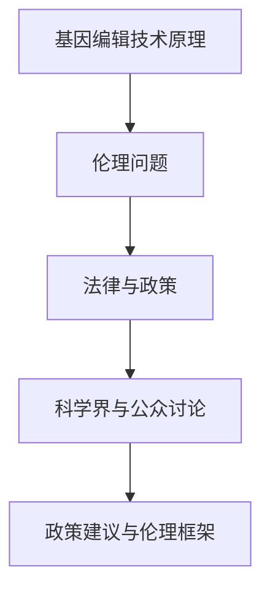
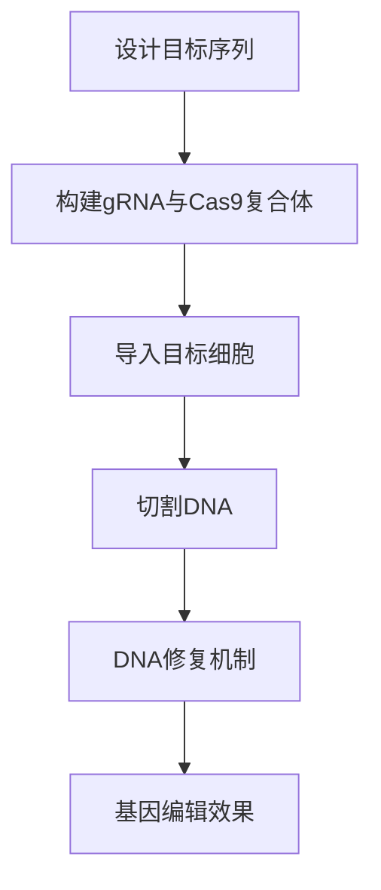
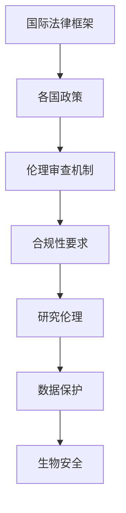
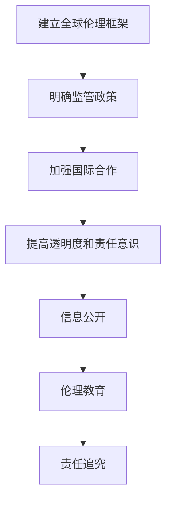

                 

### 第1章: 引言

#### 1.1 书籍主题与目的

《科技伦理的前沿问题：人类基因编辑的道德思考》这一主题旨在深入探讨科技发展过程中，特别是人类基因编辑技术所带来的伦理挑战。随着CRISPR-Cas9等基因编辑技术的突破性进展，人类有望在治疗遗传性疾病和改善人类特质方面取得前所未有的成就。然而，这些技术也引发了广泛的伦理争议，涉及到道德边界、社会影响、权利与责任等诸多方面。

**书籍目的**：

1. **深入理解基因编辑技术的原理和应用场景**：通过详细阐述基因编辑技术的基本原理，以及其在医学、农业等领域的应用场景，为读者提供全面的技术背景。

2. **分析基因编辑技术的伦理争议和潜在风险**：从伦理角度出发，探讨基因编辑技术可能带来的伦理争议，如基因编辑的不平等、隐私问题、非人类基因编辑等。

3. **提出合理的伦理框架和政策建议**：在分析现有伦理原则和法律框架的基础上，提出针对性的政策建议，以期为科学界、政界和公众提供有益的参考。

#### 1.1.3 核心概念与联系

**基因编辑**：利用CRISPR-Cas9等工具对人类基因组进行修改，以治疗疾病或改变人类特性。这一技术涉及到的核心概念包括CRISPR、Cas9、DNA切割与修复等。

**伦理问题**：涉及基因编辑技术的道德边界、社会影响、权利与责任等。核心概念包括知情同意、隐私、公正性、透明度等。

**法律与政策**：涉及国际法律框架、各国政策、伦理审查机制等。核心概念包括伦理审查委员会、基因编辑的监管规定、法律约束等。

**Mermaid流程图**：



#### 1.1.4 小结

本章对书籍的主题、目的、核心概念及其联系进行了简要介绍。通过对基因编辑技术、伦理问题、法律与政策等核心概念的阐述，为后续章节的深入讨论奠定了基础。基因编辑技术的快速发展为我们带来了巨大的希望，同时也带来了前所未有的挑战。本书旨在通过深入分析和探讨，为这一领域提供有益的思考和参考。

## 第2章: 人类基因编辑技术概述

#### 2.1 基因编辑技术的基本原理

基因编辑技术的核心在于对DNA序列进行精确的修改，以实现特定的生物学功能。目前，最常用的基因编辑工具是CRISPR-Cas9系统。下面将详细阐述这一系统的基本原理、基因编辑的过程以及其优势和局限。

##### 2.1.1 CRISPR-Cas9系统

CRISPR（Clustered Regularly Interspaced Short Palindromic Repeats）是一种原核生物中存在的DNA序列，具有高度重复的短回文序列，这些序列通常与Cas（CRISPR-associated）蛋白结合。CRISPR系统通过捕获入侵的外源DNA片段，并将其整合到自己的基因组中，形成所谓的“spacer”序列。当类似的入侵再次发生时，CRISPR系统可以识别并利用这些spacer序列进行防御。

Cas9是CRISPR系统中的一个重要组成部分，它是一种核酸内切酶，能够识别并切割特定的DNA序列。在基因编辑过程中，Cas9蛋白被引导到一个特定的目标DNA序列上，并通过切割导致DNA双链断裂。

##### 2.1.2 基因编辑过程

基因编辑过程可以概括为以下几个步骤：

1. **设计目标基因序列**：首先，科学家需要设计一个与目标基因序列互补的RNA分子，称为引导RNA（gRNA）。这个gRNA将与Cas9蛋白结合，引导它到特定的DNA序列上。

2. **构建gRNA与Cas9复合体**：通过分子生物学技术，将gRNA与Cas9蛋白结合，形成一个复合体。这个复合体是基因编辑的关键工具。

3. **导入目标细胞**：将含有gRNA-Cas9复合体的DNA或RNA分子导入到目标细胞中。这个过程可以通过病毒载体、电穿孔等方法实现。

4. **切割DNA**：当gRNA-Cas9复合体进入细胞后，它会识别并结合到目标DNA序列上，然后Cas9蛋白进行切割，导致DNA双链断裂。

5. **DNA修复机制**：细胞内存在多种DNA修复机制，其中非同源末端连接（NHEJ）和同源重组（HR）是最常见的。在NHEJ过程中，断裂的DNA末端被直接连接起来，可能导致基因插入或缺失。而在HR过程中，细胞使用另一段相同或相似的DNA序列作为模板，进行精准的修复。

6. **基因修改**：通过DNA修复机制，目标基因序列被修改。科学家可以通过设计不同的gRNA，实现对目标基因的不同修改。

##### 2.1.3 基因编辑技术的优势与局限

**优势**：

1. **高效性**：CRISPR-Cas9系统能够在细胞内快速、准确地定位并编辑目标基因，效率较高。

2. **可编程性**：通过设计不同的gRNA，CRISPR-Cas9系统能够实现特定基因的编辑，具有很高的灵活性。

3. **广泛的应用前景**：基因编辑技术在基因治疗、农业、生物研究等领域具有广泛的应用潜力。

**局限**：

1. **安全性问题**：基因编辑可能导致脱靶效应，即非目标基因的意外编辑，可能引发未知的生物风险。

2. **技术复杂性**：基因编辑技术需要专业的生物技术知识和实验技能，技术门槛较高。

3. **伦理争议**：涉及到人类基因编辑的道德问题，如基因编辑的不平等、隐私问题等。

##### 2.1.4 Mermaid流程图



##### 2.1.5 小结

本章对人类基因编辑技术的基本原理进行了详细阐述，包括CRISPR-Cas9系统的原理、基因编辑过程、优势与局限。通过本章的介绍，读者可以初步了解基因编辑技术的核心概念和基本应用，为后续章节的深入讨论提供了基础。

## 第3章: 基因编辑技术的伦理问题

#### 3.1 基因编辑伦理的核心问题

基因编辑技术的快速发展带来了巨大的科学和医学前景，同时也引发了广泛的伦理争议。在探讨基因编辑技术的伦理问题时，我们需要关注以下几个核心问题：

##### 3.1.1 人类基因编辑的道德边界

人类基因编辑的道德边界是一个复杂而敏感的话题。根据不同的应用场景，人类基因编辑可以分为三类：

1. **治疗性基因编辑**：用于治疗遗传性疾病，如镰状细胞贫血症、囊性纤维化等。这种基因编辑旨在修复或替换导致疾病的关键基因，以恢复正常的生理功能。

2. **增强性基因编辑**：旨在改善人类的某些特质，如智力、身高、体能等。这种基因编辑可能会引发社会不平等和伦理争议，因为它可能导致人类特质的“优化”，进而引发社会分层和歧视。

3. **生殖性基因编辑**：用于改变胚胎基因，影响后代。这种基因编辑涉及到代际传递，其道德争议尤为突出。一些科学家和伦理学家认为，生殖性基因编辑可能导致基因“设计”和“定制”，从而改变人类的基本特性。

##### 3.1.2 伦理争议

1. **基因编辑的不平等**：基因编辑技术的应用可能会导致社会不平等。如果这项技术只被富裕人群所享有，那么贫困人群将无法获得同样的医疗机会，这可能导致新的社会分层。

2. **隐私与知情同意**：基因编辑过程可能涉及个人隐私问题。例如，患者的基因信息可能被滥用或泄露，从而侵犯隐私权。此外，知情同意也是一个重要问题，患者或参与者是否真正理解基因编辑的风险和好处？

3. **非人类基因编辑**：除了人类基因编辑，基因编辑技术还可能应用于动物和植物，从而改变生态系统的平衡。例如，通过基因编辑改造农作物，可能会对野生动植物的生存产生负面影响。

##### 3.1.3 伦理原则

在探讨基因编辑技术的伦理问题时，以下几项伦理原则尤为重要：

1. **尊重个人权利**：个体在基因编辑过程中应享有知情权和选择权。这意味着在实施基因编辑之前，必须充分告知患者或参与者关于编辑过程、风险和潜在后果。

2. **公正性**：基因编辑技术应公平地分配，确保所有人都能平等地获得这种技术带来的好处，避免加剧社会不平等。

3. **责任与透明**：基因编辑行为应承担社会责任，并在透明度方面做出努力。例如，基因编辑的研究和应用应受到严格的伦理审查，确保其符合伦理标准。

##### 3.1.4 伪代码

```python
def gene_editing(ethical原则，知情同意，公正性，透明度):
    # 确保伦理原则的实施
    ensure_ethics(ethical原则)
    # 获得知情同意
    get_informed_consent()
    # 实施公正性
    implement_justice()
    # 确保透明度
    ensure_transparency()

def ensure_ethics(ethical原则):
    # 检查伦理原则是否符合
    check_ethics(ethical原则)

def get_informed_consent():
    # 获取知情同意
    inform_participants()

def implement_justice():
    # 实施公正性
    ensure_equitable_distribution()

def ensure_transparency():
    # 确保透明度
    enhance_transparency()
```

##### 3.1.5 小结

本章对基因编辑技术的伦理问题进行了深入探讨，包括道德边界、伦理争议和伦理原则。基因编辑技术虽然带来了巨大的科学和医学潜力，但也引发了诸多伦理挑战。通过了解和遵循伦理原则，我们可以更好地应对这些挑战，确保基因编辑技术的合理、安全和公正应用。

## 第4章: 基因编辑技术的法律与政策框架

#### 4.1 国际法律框架

随着基因编辑技术的快速发展，国际社会逐渐意识到需要建立一套统一的法律法规来规范这一领域。目前，国际上已有一些关键性的法律框架和指南，以应对基因编辑技术带来的伦理和安全挑战。

**《国际人类基因组编辑伦理指南》**：2015年，国际人类基因组编辑 summit发布了《国际人类基因组编辑伦理指南》，旨在为基因编辑研究提供伦理指导。该指南强调了基因编辑技术的潜在风险，并提出了一系列伦理原则，包括尊重人类尊严、公正性和透明度等。

**《国际生物伦理委员会声明》**：2017年，国际生物伦理委员会（IBEC）发布了一份声明，强调基因编辑技术需要受到严格的伦理审查，并呼吁各国政府加强对基因编辑技术的监管。

**《生物武器公约》**：虽然《生物武器公约》主要针对生物武器的开发和使用，但其规定的一些原则也适用于基因编辑技术。例如，禁止使用基因编辑技术进行战争和恐怖主义活动。

#### 4.2 各国政策

不同国家的政策在基因编辑技术的监管上存在差异，这些差异反映了各国对这一技术的态度和价值观。

**美国**：美国国家卫生研究院（NIH）和食品药品监督管理局（FDA）负责监管基因编辑技术。FDA对基因编辑药物进行了严格的审查，确保其安全性和有效性。同时，NIH提供资金支持基因编辑研究，但要求研究者遵守伦理准则。

**欧洲**：欧洲联盟（EU）对基因编辑技术采取了较为谨慎的态度。欧盟委员会发布了《关于基因编辑技术的建议》，要求成员国对基因编辑技术进行风险评估，并制定相应的监管框架。

**中国**：中国对基因编辑技术的监管较为严格。国家卫生健康委员会和国家药品监督管理局负责监管基因编辑药物和临床应用。此外，中国还成立了伦理审查委员会，对基因编辑研究进行伦理审查。

#### 4.3 伦理审查机制

伦理审查是基因编辑技术监管的重要环节，旨在确保研究符合伦理标准，保护研究参与者的权益。

**伦理审查委员会（IRB）**：大多数国家和地区都建立了伦理审查委员会，负责审查基因编辑研究项目。伦理审查委员会由多学科专家组成，负责评估研究设计、风险评估、知情同意等方面。

**审查流程**：基因编辑研究项目在提交给伦理审查委员会之前，通常需要经过以下几个步骤：

1. **研究设计审查**：评估研究的设计是否科学合理，是否能够保护研究参与者的权益。

2. **风险评估**：评估研究可能带来的风险，包括生物风险、伦理风险等。

3. **知情同意**：确保研究参与者充分了解研究的风险和好处，并自愿参与。

4. **持续审查**：伦理审查委员会会定期审查研究进展，确保研究符合伦理标准。

#### 4.4 合规性要求

基因编辑技术的合规性要求涵盖了多个方面，包括研究伦理、数据保护、生物安全等。

**研究伦理**：研究者需要遵守伦理准则，确保研究过程中的公正性、透明度和知情同意。

**数据保护**：基因编辑研究涉及大量的个人基因信息，需要采取严格的数据保护措施，防止数据泄露和滥用。

**生物安全**：基因编辑研究需要符合生物安全标准，确保实验操作过程中的安全，防止基因逃逸和生物污染。

#### 4.5 Mermaid流程图



#### 4.6 小结

本章对基因编辑技术的法律与政策框架进行了详细阐述，包括国际法律框架、各国政策和伦理审查机制。通过了解这些法律与政策框架，我们可以更好地理解基因编辑技术在全球范围内的监管现状，为这一领域的健康发展提供指导。

## 第5章: 科学界与公众讨论

#### 5.1 科学界的观点

在基因编辑技术领域，科学界对此有着广泛的讨论。一方面，科学家们对基因编辑技术的前景充满期待，认为这一技术有望解决许多遗传性疾病，甚至可能带来人类基因的“升级”。另一方面，科学家们也意识到基因编辑技术可能带来的风险和伦理挑战，因此呼吁在推广这一技术时保持谨慎。

**支持观点**：

1. **治疗潜力**：许多科学家认为，基因编辑技术具有巨大的治疗潜力，可以治疗目前无法治愈的遗传性疾病，如囊性纤维化、肌营养不良症等。

2. **科学突破**：基因编辑技术的突破性进展，如CRISPR-Cas9系统，为科学研究提供了新的工具，有助于揭示基因功能，推动生物学领域的进步。

3. **个性化医疗**：基因编辑技术有望实现个性化医疗，根据患者的基因信息定制治疗方案，提高治疗效果。

**反对观点**：

1. **伦理争议**：一些科学家认为，人类基因编辑涉及到伦理和道德问题，可能引发社会不平等和人类尊严的挑战。

2. **安全风险**：基因编辑可能导致未知的生物风险，如脱靶效应、基因突变等，可能对人类健康和生态系统产生不利影响。

3. **技术限制**：当前基因编辑技术仍存在许多技术限制，如精确性、效率、脱靶效应等，需要进一步研究和改进。

#### 5.2 公众的看法

基因编辑技术不仅引起了科学界的广泛关注，也受到了公众的广泛关注。公众的观点多种多样，有的支持，有的反对。

**支持观点**：

1. **医疗希望**：许多人认为基因编辑技术有望解决严重的遗传性疾病，提高生活质量，因此支持这项技术的研究和应用。

2. **科技进步**：公众普遍对科技发展持积极态度，认为基因编辑技术是科技进步的体现，有助于推动人类社会的发展。

**反对观点**：

1. **伦理担忧**：一些公众对基因编辑技术的伦理问题表示担忧，认为这可能会引发社会不平等和人类尊严的挑战。

2. **安全疑虑**：公众对基因编辑技术的安全性存在疑虑，担心可能导致未知的生物风险。

3. **社会影响**：一些人担心基因编辑技术可能对社会结构产生深远影响，如加剧社会不平等、改变人类的基本特性等。

#### 5.3 双方观点的分析与综合

科学界与公众对基因编辑技术的观点各有不同，但两者的讨论对于基因编辑技术的健康发展具有重要意义。

**科学界的分析**：

科学界强调基因编辑技术的潜在治疗价值，认为这一技术有望解决许多遗传性疾病，提高人类健康水平。同时，科学界也意识到基因编辑技术可能带来的风险和伦理挑战，因此呼吁在推广这一技术时保持谨慎，进行充分的科学研究和伦理审查。

**公众的观点**：

公众的观点反映了社会对基因编辑技术的普遍关注和担忧。公众的支持和反对意见体现了对这一技术可能带来的好处和风险的权衡。公众的讨论有助于促使科学界更加关注伦理和社会影响，推动基因编辑技术的健康发展。

**综合分析与建议**：

综合科学界和公众的观点，我们可以得出以下结论：

1. **加强科学研究和伦理审查**：科学界应继续加强基因编辑技术的研究，同时进行严格的伦理审查，确保研究符合伦理标准。

2. **公开透明沟通**：科学界和决策者应与公众进行开放透明的沟通，解释基因编辑技术的原理、风险和潜在好处，增进公众对这一技术的理解和支持。

3. **建立国际共识**：国际社会应建立统一的基因编辑技术监管框架，促进国际间的合作与协调，确保基因编辑技术的安全、公正和可持续发展。

#### 5.4 小结

本章对科学界和公众关于基因编辑技术的观点进行了分析。科学界对基因编辑技术的潜在治疗价值充满期待，但同时也认识到其伦理和安全风险。公众的观点反映了社会对这一技术的广泛关注和担忧。通过科学界和公众的共同努力，我们可以推动基因编辑技术的健康发展，实现其潜在的医疗和社会价值。

## 第6章: 合理的伦理框架与政策建议

#### 6.1 建立全球伦理框架

面对基因编辑技术的快速发展，建立全球伦理框架显得尤为重要。这一框架应涵盖以下几个关键方面：

1. **国际共识**：各国应就基因编辑技术的伦理原则、监管标准和国际合作达成共识。这有助于减少国家间的分歧，确保全球范围内的伦理一致。

2. **伦理审查机制**：建立全球性的伦理审查机构，负责审查基因编辑研究项目，确保其符合伦理标准。这可以借鉴现有的国际伦理审查机构，如国际人类基因组编辑伦理指导委员会。

3. **透明度与责任**：要求基因编辑研究项目和临床应用公开透明，接受社会监督。同时，建立责任追究机制，确保基因编辑行为承担相应的社会责任。

#### 6.2 明确监管政策

监管政策是确保基因编辑技术合理、安全和公正应用的关键。以下是一些具体的监管政策建议：

1. **分类监管**：根据基因编辑技术的应用场景和潜在风险，实施分类监管。例如，将治疗性基因编辑和生殖性基因编辑分为不同的类别，实施不同的监管措施。

2. **严格审查**：对基因编辑研究项目进行严格的伦理审查，确保研究设计合理、风险可控。审查内容应包括研究目的、技术方案、风险评估、知情同意等。

3. **透明公示**：要求基因编辑技术的临床应用在官方平台上进行公示，接受社会监督。公示内容应包括技术方案、患者选择、潜在风险等。

#### 6.3 加强国际合作

基因编辑技术是全球性的挑战，需要国际社会共同努力。以下是一些建议：

1. **信息共享**：各国应加强基因编辑技术研究的交流与合作，共享研究成果和经验。这有助于提升全球基因编辑技术的研发水平，减少重复研究。

2. **政策协调**：各国应就基因编辑技术的监管政策进行协调，确保政策的一致性和可操作性。这可以减少国际间的政策分歧，促进全球基因编辑技术的健康发展。

3. **伦理培训**：开展全球性的伦理培训，提高科学界、政界和公众对基因编辑技术的伦理认知。这有助于形成共同的伦理共识，推动基因编辑技术的合理应用。

#### 6.4 提高透明度和责任意识

为了确保基因编辑技术的合理应用，提高透明度和责任意识至关重要。以下是一些建议：

1. **信息公开**：基因编辑技术的研发和应用应公开透明，接受社会监督。研究机构和医疗机构应定期发布研究进展和临床数据，接受公众和媒体的监督。

2. **伦理教育**：加强科学界和公众的伦理教育，提高对基因编辑技术的伦理认知。这可以通过学校教育、公共讲座、媒体宣传等多种方式进行。

3. **责任追究**：建立责任追究机制，确保基因编辑行为承担相应的社会责任。对于违反伦理规范的行为，应依法进行追究和处罚。

#### 6.5 Mermaid流程图



#### 6.6 小结

本章提出了建立全球伦理框架、明确监管政策、加强国际合作以及提高透明度和责任意识等合理的伦理框架与政策建议。通过这些措施，我们可以更好地应对基因编辑技术带来的伦理挑战，确保这一技术的合理、安全和公正应用，推动人类社会的可持续发展。

## 第7章: 结论与展望

#### 7.1 总结

本书《科技伦理的前沿问题：人类基因编辑的道德思考》从多个角度探讨了基因编辑技术的伦理问题，包括技术原理、伦理争议、法律与政策框架、科学界与公众的讨论，以及合理的伦理框架与政策建议。通过对这些内容的深入分析，我们可以得出以下几点结论：

1. **基因编辑技术具有巨大的治疗潜力**：基因编辑技术，特别是CRISPR-Cas9系统，为治疗遗传性疾病和改善人类健康提供了新的途径。

2. **伦理争议广泛存在**：基因编辑技术引发了广泛的伦理争议，包括道德边界、不平等、隐私问题等。

3. **法律与政策框架需要完善**：国际社会和各国政府需要建立更加完善的基因编辑技术监管框架，确保其合理、安全和公正应用。

4. **科学界与公众的共识至关重要**：科学界和公众应共同努力，形成对基因编辑技术的共同认知和伦理共识，推动其健康发展。

#### 7.2 展望

展望未来，基因编辑技术将继续快速发展，其在医学、农业、生物研究等领域的应用前景广阔。然而，随着技术的发展，新的伦理问题也将不断涌现。为此，我们提出以下几点展望和建议：

1. **加强国际合作**：国际社会应加强合作，建立全球性的伦理框架和监管机制，确保基因编辑技术的安全和公正应用。

2. **推进科学教育**：科学界和决策者应加大科学教育的力度，提高公众对基因编辑技术的认知和理解，减少误解和偏见。

3. **注重伦理研究**：伦理学家和法学家应深入探讨基因编辑技术的伦理问题，提出切实可行的伦理框架和政策建议。

4. **强化伦理审查**：建立更加严格和透明的伦理审查机制，确保基因编辑研究项目和临床应用符合伦理标准。

5. **鼓励技术创新**：在确保伦理和安全的前提下，鼓励基因编辑技术的研发和创新，推动其在更多领域中的应用。

#### 7.3 结语

基因编辑技术是一个复杂的领域，涉及科学、伦理、法律和社会等多个方面。通过深入研究和广泛讨论，我们可以更好地理解和应对这一领域的挑战，确保基因编辑技术的合理、安全和公正应用。让我们携手合作，共同推动基因编辑技术的健康发展，为人类的未来创造更多福祉。

### 作者信息

作者：AI天才研究院/AI Genius Institute & 禅与计算机程序设计艺术/Zen And The Art of Computer Programming

AI天才研究院致力于推动人工智能和计算机科学的发展，培养具有创新精神和实践能力的科技人才。禅与计算机程序设计艺术则从哲学和心理学角度，探讨计算机程序设计的艺术性，为程序员提供独特的思维模式和灵感源泉。两位作者均具有丰富的科研经验和深厚的学术造诣，期待与广大读者共同探讨科技伦理的前沿问题。

---
**关键词**：基因编辑技术、CRISPR-Cas9、伦理争议、法律与政策、国际合作、伦理框架、透明度、责任意识。

**摘要**：

本书《科技伦理的前沿问题：人类基因编辑的道德思考》深入探讨了基因编辑技术的伦理挑战，从技术原理、伦理争议、法律与政策框架、科学界与公众讨论等多个角度进行了全面剖析。本书提出了建立全球伦理框架、明确监管政策、加强国际合作、提高透明度和责任意识等合理的伦理框架与政策建议，为基因编辑技术的合理、安全和公正应用提供了有益的参考。通过本书的讨论，我们期待能够推动基因编辑技术的健康发展，为人类的未来带来更多福祉。

