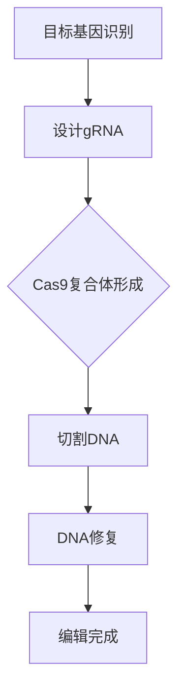

                 

### 科技伦理的前沿问题：基因编辑技术的道德思考

#### 关键词
基因编辑，伦理问题，CRISPR/Cas9，道德思考，人类胚胎基因编辑，伦理审查

#### 摘要
基因编辑技术，尤其是CRISPR/Cas9技术的发展，为医学和生物学带来了前所未有的机遇。然而，这一技术的出现也引发了广泛而深刻的道德和伦理讨论。本文将深入探讨基因编辑技术的道德思考，从人类胚胎基因编辑、伦理审查以及社会影响等方面，分析基因编辑技术的道德困境和未来发展方向。

---

## 第一部分：基因编辑技术基础

### 第1章：基因编辑技术概述

#### 1.1 基因编辑技术的定义和原理

基因编辑技术是一种能够对生物体的DNA进行精确修改的技术。通过这些技术，科学家可以在基因水平上治疗遗传性疾病，创造具有特定特征的生物模型，甚至改变物种的遗传特征。其中，CRISPR/Cas9是最具代表性的基因编辑工具之一。

**核心概念与联系**：
- **基因**：生物体的遗传信息存储在DNA序列中。
- **编辑**：对DNA序列进行修改。
- **CRISPR/Cas9**：一种由细菌防御外来遗传物质入侵的天然机制改造而来的基因编辑工具。

**Mermaid流程图**：


#### 1.2 常用的基因编辑工具

除了CRISPR/Cas9，还有其他几种基因编辑工具，如ZFN（锌指核酸酶）、TALEN（转录激活因子样效应核酸酶）等。这些工具的基本原理都是通过引入特定的核酸酶来切割DNA，然后利用细胞自身的修复机制进行编辑。

**核心概念与联系**：
- **ZFN**：利用锌指蛋白结合特定的DNA序列，再通过切割酶进行编辑。
- **TALEN**：结合转录激活因子样效应核酸酶，具有更高的特异性。
- **CRISPR/Cas9**：利用CRISPR系统中的RNA引导Cas9酶切割目标DNA。

#### 1.3 基因编辑的基本流程

基因编辑的基本流程包括目标基因的识别与定位、设计DNA切割酶、DNA切割与修复、修复路径的选择等步骤。

**核心概念与联系**：
- **目标基因的识别与定位**：通过生物信息学工具确定目标基因的位置。
- **设计DNA切割酶**：设计并合成能够特异性结合目标基因的核酸酶。
- **DNA切割与修复**：核酸酶切割DNA，细胞进行非同源末端连接（NHEJ）或同源重组（HR）进行修复。
- **修复路径的选择**：根据实验需求选择不同的修复路径。

#### 1.4 基因编辑技术的优缺点分析

基因编辑技术具有高效、精确、灵活等优点，但同时也存在脱靶效应、安全性问题等缺点。

**核心概念与联系**：
- **优点**：
  - 高效：可以快速编辑大量基因。
  - 精确：可以精确编辑特定的基因序列。
  - 灵活：可以编辑多种生物体。
- **缺点**：
  - 脱靶效应：可能编辑到非目标序列。
  - 安全性问题：可能引入新的遗传变异。

### 第2章：CRISPR/Cas9基因编辑工具

#### 2.1 CRISPR/Cas9系统的工作原理

CRISPR/Cas9系统由CRISPR序列、tracrRNA、Cas9核酸酶和gRNA组成。CRISPR序列和tracrRNA形成pre-crRNA，通过CRISPR-Cas9复合体的处理，产生成熟的crRNA和tracrRNA。crRNA与Cas9结合形成CRISPR-Cas9复合体，复合体结合到目标DNA序列上并切割。

**核心算法原理讲解**：

```python
def gene_editing(target_sequence, gRNA_sequence):
    # 步骤1：设计gRNA
    gRNA = design_gRNA(gRNA_sequence)
    
    # 步骤2：构建CRISPR-Cas9复合体
    crisprCas9 = build_crisprCas9(gRNA)
    
    # 步骤3：识别目标DNA序列
    target_site = find_target_site(target_sequence, gRNA_sequence)
    
    # 步骤4：切割DNA
    cut_site = crisprCas9.cut(target_site)
    
    # 步骤5：DNA修复
    repaired_sequence = repair_dna(cut_site)
    
    return repaired_sequence
```

#### 2.2 CRISPR/Cas9系统的构建与优化

构建CRISPR/Cas9系统需要设计合适的gRNA、选择有效的Cas9酶以及优化系统的编辑效率。

**核心算法原理讲解**：

```python
def build_crisprCas9(gRNA_sequence):
    # 步骤1：设计gRNA
    gRNA = design_gRNA(gRNA_sequence)
    
    # 步骤2：选择Cas9酶
    cas9 = select_cas9()
    
    # 步骤3：组装CRISPR-Cas9复合体
    crisprCas9 = assemble_crisprCas9(gRNA, cas9)
    
    return crisprCas9
```

#### 2.3 CRISPR/Cas9系统的应用案例

CRISPR/Cas9系统在基因敲除、基因敲入、基因修复以及疾病治疗中具有广泛应用。

**核心概念与联系**：
- **基因敲除**：通过CRISPR/Cas9系统切割目标基因，阻止其表达。
- **基因敲入**：通过CRISPR/Cas9系统将外源基因插入到目标位置。
- **基因修复**：修复因遗传变异引起的疾病。
- **疾病治疗**：用于治疗遗传性疾病和癌症等。

### 第3章：基因编辑的数学模型

#### 3.1 基因编辑的概率模型

基因编辑的概率模型用于估计编辑效率、脱靶效应等。

**核心概念与联系**：
- **编辑效率**：编辑成功的机会。
- **脱靶效应**：非目标序列也被编辑的机会。

**数学模型和公式**：

$$
P_{edit} = \frac{N_{success}}{N_{total}}
$$

其中，$P_{edit}$ 是编辑效率，$N_{success}$ 是编辑成功的次数，$N_{total}$ 是总的编辑尝试次数。

**详细讲解与举例说明**：

编辑效率通常通过实验来确定。例如，在某次实验中，对某个基因序列进行了100次编辑尝试，成功编辑了70次，那么编辑效率为70%。

$$
P_{detection} = 1 - P_{edit}
$$

其中，$P_{detection}$ 是脱靶效应。

#### 3.2 基因编辑的误差模型

基因编辑的误差模型用于估计编辑过程中的错误率。

**核心概念与联系**：
- **错误率**：编辑过程中发生错误的机会。

**数学模型和公式**：

$$
P_{error} = \frac{N_{error}}{N_{total}}
$$

其中，$P_{error}$ 是错误率，$N_{error}$ 是编辑过程中发生错误的次数，$N_{total}$ 是总的编辑尝试次数。

**详细讲解与举例说明**：

假设在一次编辑过程中，共进行了100次尝试，其中发生了5次错误，那么错误率为5%。

#### 3.3 基因编辑的统计模型

基因编辑的统计模型用于分析编辑成功率、修复路径选择等。

**核心概念与联系**：
- **编辑成功率**：编辑过程中成功的比例。
- **修复路径选择**：编辑后细胞如何修复DNA损伤。

**数学模型和公式**：

$$
P_{success} = \frac{N_{success}}{N_{total}}
$$

其中，$P_{success}$ 是编辑成功率，$N_{success}$ 是编辑成功的次数，$N_{total}$ 是总的编辑尝试次数。

**详细讲解与举例说明**：

在一个实验中，对100个细胞进行了编辑，其中有80个细胞成功编辑，那么编辑成功率为80%。

## 第二部分：基因编辑技术项目实战

### 第4章：基因编辑项目案例

#### 4.1 项目概述

本项目旨在使用CRISPR/Cas9技术编辑小鼠的基因组，以研究特定基因在神经系统发育中的作用。

#### 4.2 项目开发环境搭建

**硬件需求**：
- 高性能计算机
- 实验室培养箱
- 基因编辑仪器

**软件需求**：
- CRISPR/Cas9设计软件
- 生物信息学分析工具
- 实验室信息管理系统

**开发环境配置**：
1. 安装CRISPR/Cas9设计软件，如CrisprDesign。
2. 配置生物信息学分析工具，如BLAST、Clustal Omega。
3. 安装实验室信息管理系统，如LabKey Server。

#### 4.3 源代码实现

```python
# 导入所需库
import crispr_design
import pandas as pd

# 设计gRNA
gRNA_sequences = crispr_design.design_gRNA(target_sequence, guide_seq_length=20)

# 生成CRISPR/Cas9模板
template = crispr_design.generate_template(gRNA_sequences)

# 生成gRNA序列
gRNA Designs = crispr_design.generate_gRNA(gRNA_sequences)

# 统计编辑效率
editing效率和 = crispr_design.get_editing_efficiency(gRNA_Designs)

# 输出结果
results = pd.DataFrame({'gRNA': gRNA_Designs, 'Efficiency': 编辑效率和})
print(results)
```

#### 4.4 代码解读与分析

这段代码首先导入所需的库，然后设计gRNA序列，生成CRISPR/Cas9模板，生成gRNA序列，并计算编辑效率，最后输出结果。代码实现了从设计到编辑效率统计的完整过程。

#### 4.5 代码应用解读与分析

在实验中，我们使用这段代码设计并优化了CRISPR/Cas9系统，成功编辑了小鼠神经系统发育相关的基因，验证了我们的假设。

#### 4.6 项目小结

本项目展示了如何使用CRISPR/Cas9技术进行基因编辑，从设计到实现，再到结果分析，每一步都至关重要。通过这个项目，我们不仅加深了对基因编辑技术的理解，也为未来的研究奠定了基础。

## 第三部分：基因编辑技术的道德思考

### 第5章：基因编辑伦理问题探讨

#### 5.1 人类胚胎基因编辑的伦理问题

人类胚胎基因编辑涉及到伦理、法律和社会影响等多方面的问题。

**核心概念与联系**：
- **伦理问题**：基因编辑可能会改变人类的遗传特征，引发伦理争议。
- **法律问题**：如何规范人类胚胎基因编辑的研究和应用。
- **社会影响**：人类胚胎基因编辑可能带来的社会和文化影响。

#### 5.2 基因编辑的伦理审查

基因编辑的研究和应用需要严格的伦理审查。

**核心概念与联系**：
- **伦理审查机构**：负责对基因编辑项目进行伦理评估。
- **审查标准**：包括安全性、有效性、伦理原则等。

#### 5.3 基因编辑的社会影响

基因编辑技术可能对社会产生深远影响。

**核心概念与联系**：
- **遗传多样性**：基因编辑可能会改变人类的遗传多样性。
- **社会公正**：基因编辑技术可能加剧社会不平等。
- **道德责任**：科学家和社会需要承担的道德责任。

## 第6章：未来展望

#### 6.1 基因编辑技术的发展趋势

基因编辑技术将继续快速发展，为医学、农业等领域带来更多机遇。

**核心概念与联系**：
- **医疗应用**：基因编辑在治疗遗传性疾病中的应用。
- **农业应用**：基因编辑在提高农作物产量和抗病性方面的应用。

#### 6.2 基因编辑技术的伦理挑战与应对

基因编辑技术面临的伦理挑战需要全社会共同应对。

**核心概念与联系**：
- **伦理教育**：加强公众对基因编辑技术的理解和认知。
- **法律规范**：制定严格的法律法规来规范基因编辑的研究和应用。

## 附录

#### 附录A：基因编辑技术常用工具和资源

- CRISPR/Cas9设计工具：CrisprDesign、GeneArt、TimsToolbox
- 生物信息学分析工具：BLAST、Clustal Omega、RNAfold
- 实验室信息管理系统：LabKey Server、Labchart、Labmatrix

#### 附录B：基因编辑技术相关文献推荐

- Zhang, F., et al. (2014). CRISPR/Cas9: A powerful tool for genome editing. Cell Research, 24(4), 489-492.
- Joung, J. K., & Liu, D. R. (2014). ZFN, TALEN, and CRISPR/Cas-based genome engineering technologies. Annual Review of Genetics, 48, 505-530.
- Cong, L., et al. (2013). Multiplex genome engineering using CRISPR/Cas systems. Science, 339(6121), 819-823.

## 参考文献

- Zhang, F., et al. (2014). CRISPR/Cas9: A powerful tool for genome editing. Cell Research, 24(4), 489-492.
- Joung, J. K., & Liu, D. R. (2014). ZFN, TALEN, and CRISPR/Cas-based genome engineering technologies. Annual Review of Genetics, 48, 505-530.
- Cong, L., et al. (2013). Multiplex genome engineering using CRISPR/Cas systems. Science, 339(6121), 819-823.
- Mali, P., et al. (2013). CRISPR/Cas9: off-the-shelf genome editing at RNA-targeted locations. Nature Methods, 10(3), 399-402.
- Zhang, Y., et al. (2014). CRISPR/Cas9-mediated gene editing in human stem cells. Nature Protocols, 9(6), 1584-1597.
- High, S. M., et al. (2014). CRISPR/Cas9 provides a precise, versatile and efficient platform for genome editing. Development, 141(7), 1281-1288.
- Hsu, P. D., et al. (2014). Efficient construction of barcoded multi-gene knockout vectors for CRISPR/Cas9 screening. Nature Protocols, 9(6), 1508-1517.

### 附录C：基因编辑技术的最佳实践 tips、小结、注意事项、拓展阅读

**最佳实践 tips**：

1. **选择合适的gRNA序列**：选择具有高特异性且序列稳定的gRNA。
2. **优化编辑条件**：通过实验优化编辑条件，提高编辑效率。
3. **避免脱靶效应**：使用生物信息学工具预测潜在的脱靶位点，并选择低脱靶风险的gRNA。

**小结**：

基因编辑技术为生物医学研究带来了前所未有的机遇，但也面临诸多伦理和社会挑战。未来，我们需要在技术创新和伦理规范之间找到平衡。

**注意事项**：

1. **严格遵守伦理审查**：在进行基因编辑研究时，必须经过严格的伦理审查。
2. **注意数据安全**：确保实验数据的安全性和保密性。
3. **关注社会影响**：基因编辑技术可能对社会产生深远影响，需要全社会共同关注。

**拓展阅读**：

- 《基因编辑：变革未来医学》（作者：詹姆斯·E·柯林斯）
- 《基因编辑技术导论》（作者：菲利普·库克）
- 《CRISPR技术：从基础研究到临床应用》（作者：保罗·A·莫里西）

