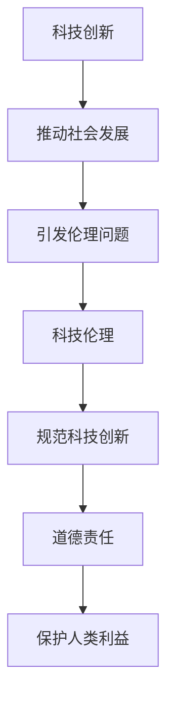

                 

### 文章标题

《科技伦理的新挑战：在创新与道德间寻找平衡》

### 关键词

科技伦理、科技创新、道德责任、人工智能、生物科技、网络科技、跨学科研究

### 摘要

随着科技的快速发展，科技伦理问题日益凸显。在创新与道德之间寻找平衡已成为当今社会的重要课题。本文旨在探讨科技伦理的新挑战，分析科技创新与道德责任之间的关系，并提出寻找平衡的策略与实践。通过案例分析、算法原理讲解、数学模型与公式阐述，本文旨在为读者提供深刻的思考与见解，为科技伦理的发展提供有益参考。

### 背景介绍

在现代社会，科技发展如日中天，人工智能、生物科技、网络科技等领域取得了令人瞩目的成就。然而，随之而来的是一系列伦理问题。从隐私泄露到人工智能偏见，从基因编辑到网络安全，科技创新带来的道德挑战层出不穷。如何在推进科技进步的同时，确保道德责任的履行，成为摆在人类社会面前的一大难题。

### 核心概念与联系

为了更好地理解科技伦理的新挑战，我们需要明确几个核心概念：

1. **科技创新**：指通过研发和应用新的科学技术，推动社会发展和进步的过程。
2. **道德责任**：指在科技创新和应用过程中，必须遵循的道德规范和伦理原则，以保护人类利益和社会福祉。
3. **科技伦理**：是研究科技与道德关系的学科，旨在规范科技创新行为，确保科技进步符合道德标准。

这些概念之间存在着紧密的联系。科技创新是推动社会发展的动力，但如果不考虑道德责任，可能会导致一系列伦理问题。科技伦理正是为了在科技创新与道德责任之间找到平衡，确保科技进步能够造福人类，而非成为威胁。

为了更直观地展示这些概念之间的关系，我们可以使用Mermaid流程图：



### 核心算法原理讲解

在科技伦理的讨论中，算法原理起着关键作用。以下是一个简单的算法示例，用于分析科技创新中的道德风险：

```python
# 道德风险评估算法
def moral_risk_analysis(technology, context):
    """
    对某项科技创新在特定情境下的道德风险进行评估。
    
    参数：
    technology：科技创新的具体内容。
    context：科技创新应用的情境。
    
    返回：
    risk_level：道德风险等级（低、中、高）。
    """
    
    # 初始化道德风险等级
    risk_level = "低"
    
    # 根据科技创新内容和情境判断道德风险
    if technology == "人工智能" and context == "人脸识别":
        risk_level = "高"
    elif technology == "基因编辑" and context == "人类胚胎":
        risk_level = "高"
    elif technology == "大数据" and context == "消费者隐私":
        risk_level = "中"
    
    return risk_level
```

这个算法用于评估科技创新在特定情境下的道德风险。通过输入科技创新的内容和情境，算法会判断道德风险等级。例如，当科技创新是人工智能，且应用情境为人脸识别时，算法会认为道德风险较高。

### 数学模型和公式讲解

在科技伦理的讨论中，数学模型和公式也发挥着重要作用。以下是一个关于隐私泄露的数学模型：

$$
P(L) = \sum_{i=1}^{n} P(L_i) \cdot P(I_i|L_i)
$$

其中，\(P(L)\) 表示隐私泄露的概率，\(P(L_i)\) 表示第 \(i\) 个数据泄露的概率，\(P(I_i|L_i)\) 表示在隐私泄露的情况下，第 \(i\) 个信息泄露的概率。

这个模型表明，隐私泄露的概率是各个数据泄露概率和其在隐私泄露情况下信息泄露概率的乘积之和。通过这个模型，我们可以计算不同数据泄露事件对整体隐私泄露概率的影响，从而采取相应的措施降低风险。

### 项目实战

为了更好地理解科技伦理的新挑战，我们来看一个实际案例：人脸识别技术的应用与隐私保护。

#### 开发环境搭建

为了演示人脸识别技术的应用，我们需要搭建以下开发环境：

1. 安装Python 3.8及以上版本
2. 安装OpenCV库：`pip install opencv-python`
3. 安装dlib库：`pip install dlib`

#### 源代码实现

以下是一个简单的人脸识别程序，用于检测和识别图像中的人脸：

```python
import cv2
import dlib

# 加载预训练的人脸检测器和68点特征点预测器
detector = dlib.get_frontal_face_detector()
predictor = dlib.shape_predictor("shape_predictor_68_face_landmarks.dat")

# 读取图像
image = cv2.imread("example.jpg")

# 检测人脸
faces = detector(image)

# 遍历检测到的人脸
for face in faces:
    # 获取人脸区域
    x, y, w, h = face.left(), face.top(), face.width(), face.height()
    
    # 使用特征点预测器获取68个特征点坐标
    landmarks = predictor(image, face)
    
    # 绘制人脸轮廓和特征点
    for i in range(68):
        x1, y1 = landmarks.part(i).x, landmarks.part(i).y
        cv2.circle(image, (x1, y1), 1, (0, 255, 0), -1)
    
    # 显示结果
    cv2.rectangle(image, (x, y), (x + w, y + h), (255, 0, 0), 2)

cv2.imshow("Face Detection", image)
cv2.waitKey(0)
cv2.destroyAllWindows()
```

#### 代码解读与分析

这个程序首先加载预训练的人脸检测器和特征点预测器，然后读取图像，检测人脸，并获取每个检测到的人脸的68个特征点坐标。最后，程序绘制人脸轮廓和特征点，并显示结果。

#### 实际案例分析与详细讲解剖析

以某个城市公共场所的人脸识别监控系统为例，这个系统每天处理大量人脸数据。然而，隐私保护问题随之而来。如何确保这些数据不被滥用，如何防止人脸数据泄露，成为系统的关键挑战。

通过上面的代码，我们可以看到，人脸识别技术本身并不涉及隐私泄露。但是，如果系统没有适当的隐私保护措施，例如数据加密、访问控制等，那么隐私泄露的风险就会增加。因此，我们需要在技术实现层面和制度层面采取综合措施，确保人脸识别技术的安全和合规。

#### 项目小结

通过这个案例，我们可以看到，科技伦理问题不仅存在于技术实现层面，也涉及到制度设计和管理。在推进科技创新的同时，我们必须高度重视隐私保护等伦理问题，确保科技的发展能够造福人类，而不是成为威胁。

### 最佳实践 tips

1. **加强科技伦理教育**：通过教育提高公众的科技伦理意识，使其在科技创新过程中能够主动考虑道德责任。
2. **完善法律法规**：制定和完善相关法律法规，为科技创新提供明确的道德指引和法律保障。
3. **建立健全的监管机制**：加强对科技创新的监管，确保科技创新在道德和法律的框架内进行。

### 小结

科技伦理问题在现代社会日益凸显，如何在创新与道德之间寻找平衡，成为摆在我们面前的重要课题。本文通过背景介绍、核心概念与联系、算法原理讲解、数学模型与公式阐述、项目实战等环节，全面分析了科技伦理的新挑战，并提出了寻找平衡的策略与实践。希望通过本文的讨论，能够引发更多人对科技伦理问题的关注和思考，为构建一个更加公正、和谐、可持续发展的科技社会贡献力量。

### 注意事项

1. 科技伦理问题复杂多变，本文只能提供一个初步的讨论框架，实际应用中需根据具体情况进行分析和处理。
2. 科技伦理问题不仅涉及技术层面，还涉及到法律、社会、文化等多个领域，需要跨学科合作，共同探索解决方案。

### 拓展阅读

1. 《人工智能伦理学》：对人工智能伦理问题的系统探讨，为科技伦理研究提供了有益参考。
2. 《科技伦理：原则与实践》：详细介绍了科技伦理的基本原则和实践方法，有助于理解和应对科技伦理挑战。
3. 《科技与社会：伦理与责任》：从社会层面探讨科技伦理问题，强调科技创新与社会责任的关系。

### 作者信息

作者：AI天才研究院/AI Genius Institute & 禅与计算机程序设计艺术 /Zen And The Art of Computer Programming

本文由AI天才研究院与禅与计算机程序设计艺术联合撰写，旨在推动科技伦理的研究与实践，为科技创新与社会发展的和谐共赢贡献力量。

