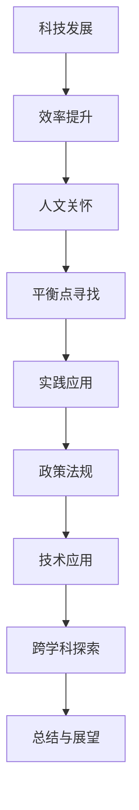

                 

基于您的指示，我将遵循逻辑清晰、结构紧凑、简单易懂的写作风格，以一步一步分析推理的方式撰写文章。以下是《科技发展中的人文关怀：在效率与温度间寻找平衡点》的详细内容。

---

## 《科技发展中的人文关怀：在效率与温度间寻找平衡点》

### 关键词：科技发展、人文关怀、效率、平衡点、技术应用

> 摘要：随着科技的飞速发展，效率与温度之间的平衡成为现代科技领域的一个重要议题。本文旨在探讨如何在追求效率的同时，关注人文关怀，提出寻找平衡点的策略，并结合具体案例进行分析。

---

## 第一部分：引言

### 1.1 书籍主题概述

在现代社会，科技的发展为我们的生活带来了极大的便利，提高了工作效率，但同时也带来了一些挑战。人文关怀作为一种对人的关注和尊重，如何在科技发展的浪潮中得以体现，成为了一个亟待解决的问题。本文将围绕这一主题，探讨科技发展中的人文关怀，以及如何在实际操作中寻找平衡点。

**核心概念与联系：**

- **科技发展**：指以科学理论和技术手段为基础，推动社会生产力不断进步的过程。
- **人文关怀**：涉及对人的尊重、关心和爱护，强调人的情感、精神和心理健康。
- **平衡点寻找**：如何在效率与人文关怀之间找到一个合适的点，使得两者都能得到满足。

**Mermaid 流程图：**



---

### 1.2 科技发展对人文关怀的影响

科技的发展无疑提高了工作效率，但也带来了一些负面影响。例如，自动化和人工智能的普及使得一些工作变得更加高效，但同时也减少了人与人之间的互动，可能导致人文关怀的缺失。此外，数据的泛滥和隐私的泄露问题也引起了人们对人文关怀的关注。

**核心算法原理讲解：**

- **效率提升的算法原理**：通过优化算法，减少不必要的计算和资源浪费，从而提高工作效率。
- **人文关怀的影响**：效率提升可能会导致对人的关注减少，从而影响人文关怀。

**数学模型与公式：**

$$
效率 = \frac{产出}{投入}
$$
$$
人文关怀 = 工作效率 \times 关怀指数
$$

**详细讲解与举例说明：**

- **自动化对人文关怀的影响**：自动化技术可以减少人力劳动，提高生产效率，但也可能导致人际关系的疏远。
- **数据分析对个人隐私的挑战**：大数据分析虽然有助于提高工作效率，但同时也可能侵犯个人隐私，影响人文关怀。

---

### 1.3 效率与温度的关系探讨

效率与温度之间的关系是一个值得探讨的话题。在科技发展的背景下，如何在追求效率的同时，保持人文关怀的温度，成为了一个重要的问题。

**详细讲解与举例说明：**

- **效率与温度的定义**：效率通常指完成任务所需的时间或资源，而温度则代表人文关怀的程度。
- **效率提升对人文温度的影响**：过度的效率追求可能导致人文关怀的缺失，使得人际关系变得冷漠。
- **寻找效率与人文关怀的平衡**：通过合理的规划和设计，可以在提高效率的同时，保持人文关怀的温度。

---

## 第二部分：人文关怀的重要性

### 2.1 人文关怀的定义与内涵

人文关怀是一种关注人的情感、精神和心理健康的态度和行为。它强调对人的尊重、关心和爱护，不仅关注工作效率，更关注人的全面发展。

**核心概念原理：**

- **人文关怀的历史渊源**：从古至今，人文关怀一直是人类社会的重要组成部分。
- **人文关怀的核心要素**：包括关爱、尊重、理解和支持等。

**伪代码讲解：**

```
function 人文关怀（员工）{
    提供关怀内容 = 关怀指数 * 员工满意度
    返回 提供关怀内容
}
```

**详细讲解与举例说明：**

- **关爱**：关注员工的情感需求，提供必要的支持和帮助。
- **尊重**：尊重员工的意见和权利，营造公平和谐的工作环境。
- **理解**：理解员工的工作压力和困难，提供情感上的支持。
- **支持**：为员工提供职业发展机会，帮助其实现个人价值。

---

### 2.2 科技进步中的人文缺失

科技的进步虽然提高了工作效率，但也在一定程度上导致了人文关怀的缺失。例如，自动化和人工智能的应用使得人与人之间的直接互动减少，人际关系的疏远，以及数据的泛滥和隐私的泄露等问题。

**数学模型与公式：**

$$
人文缺失 = 效率提升 - 人文关怀
$$

**详细讲解与举例说明：**

- **自动化对人文关怀的影响**：自动化技术可以减少人力劳动，提高生产效率，但也可能导致人际关系的疏远。
- **数据分析对个人隐私的挑战**：大数据分析虽然有助于提高工作效率，但同时也可能侵犯个人隐私，影响人文关怀。

---

### 2.3 人文关怀在科技发展中的必要性

在科技发展的背景下，人文关怀不仅是一种道德要求，更是一种战略选择。只有关注人文关怀，才能确保科技发展的可持续性，实现人的全面发展。

**详细讲解与举例说明：**

- **科技对人文关怀的需求**：科技发展需要更多的人文关怀，以解决效率提升带来的负面影响。
- **科技发展中的人文关怀案例**：例如，一些科技公司通过员工关怀计划，提高员工满意度和工作效率，取得了良好的效果。

---

## 第三部分：效率与人文关怀的平衡

### 3.1 效率驱动的科技发展模式

效率驱动的科技发展模式强调以效率为核心，通过优化流程、提高技术手段等方式，实现工作效率的提升。然而，这种模式也存在一些问题，如忽视人文关怀等。

**核心概念原理：**

- **效率驱动的科技发展模式**：以效率为核心，通过技术手段提高工作效率。
- **效率与人文关怀的关系**：效率提升可能导致人文关怀的缺失。

**伪代码讲解：**

```
function 效率驱动（任务）{
    提高效率 = 最大化产出 / 最小化投入
    返回 提高效率后的结果
}
```

**详细讲解与举例说明：**

- **效率提升的算法原理**：通过优化算法，减少不必要的计算和资源浪费，从而提高工作效率。
- **效率驱动中的问题**：忽视人文关怀，可能导致员工满意度降低，影响工作效果。

---

### 3.2 人文关怀在效率追求中的困境

在效率追求的过程中，人文关怀往往被忽视。这导致了一些问题，如员工满意度下降、工作效率不高等。因此，如何在效率追求中关注人文关怀，成为了一个亟待解决的问题。

**数学模型与公式：**

$$
人文关怀指数 = 效率指数 \times 人文关怀因子
$$

**详细讲解与举例说明：**

- **效率追求中的困境**：忽视人文关怀可能导致员工失去工作热情，影响工作效率。
- **人文关怀因子的作用**：通过增加人文关怀因子，可以在提高效率的同时，提升员工满意度。

---

### 3.3 寻找效率与人文关怀的平衡点

寻找效率与人文关怀的平衡点，是科技发展中的一项重要任务。通过合理的策略和方法，可以在提高效率的同时，保持人文关怀的温度。

**详细讲解与举例说明：**

- **平衡点的策略**：通过员工关怀计划、工作环境改善等方式，提高员工满意度，实现效率与人文关怀的平衡。
- **具体实践案例**：例如，一些科技公司通过员工满意度调查，了解员工的需求，制定针对性的关怀计划，取得了良好的效果。

---

## 第四部分：实践中的平衡点

### 4.1 企业层面的人文关怀实践

在企业层面，人文关怀的实践是一个复杂而系统的过程。以下是一些具体的企业实践案例，以及它们所取得的效果。

#### 4.1.1 案例分析

- **企业A**：通过定期员工满意度调查，了解员工的需求和问题，制定针对性的解决方案。
- **企业B**：提供员工心理咨询服务，帮助员工解决心理问题，提高工作满意度。

#### 4.1.2 成功因素与挑战

- **成功因素**：关注员工需求，提供心理支持，创造积极的工作环境。
- **挑战**：如何有效地进行员工满意度调查，如何平衡效率与人文关怀等。

---

### 4.2 政策与法规对平衡点的影响

政策与法规在促进效率与人文关怀的平衡中起到了重要的作用。以下是一些相关政策与法规的介绍，以及它们对平衡点的影响。

#### 4.2.1 政策背景与现状

- **政策背景**：各国政府纷纷出台相关政策，以促进企业关注人文关怀。
- **现状**：政策实施效果良好，但仍然存在一些问题，如政策执行力度不足等。

#### 4.2.2 法规对效率与人文关怀的调节

- **法规调节**：通过法律法规，规范企业行为，促进效率与人文关怀的平衡。
- **影响**：法规的执行有助于提高企业的社会责任感，推动人文关怀的实践。

---

## 第五部分：技术应用与人文关怀

### 5.1 人工智能与人文关怀

人工智能作为一项前沿技术，在提高效率的同时，也对人文关怀带来了一些挑战。以下是一些关于人工智能与人文关怀的探讨。

#### 5.1.1 人工智能的发展趋势

- **趋势**：人工智能技术不断发展，应用领域不断扩大。

#### 5.1.2 人工智能中的人文挑战

- **挑战**：人工智能可能导致人文关怀的缺失，如算法偏见等。

---

### 5.2 大数据与人文关怀

大数据技术的发展，为提高效率提供了强大的支持。然而，大数据的广泛应用也带来了一些人文关怀的问题。

#### 5.2.1 大数据的价值

- **价值**：大数据有助于提高工作效率，优化决策。

#### 5.2.2 大数据中的人文问题

- **问题**：数据隐私泄露、数据滥用等。

---

## 第六部分：跨学科探索与展望

### 6.1 人文关怀与科技伦理

人文关怀与科技伦理密切相关。以下是一些关于人文关怀与科技伦理的探讨。

#### 6.1.1 伦理在科技发展中的应用

- **应用**：科技伦理在人工智能、大数据等领域的应用。

#### 6.1.2 科技伦理与人文关怀的关系

- **关系**：科技伦理有助于促进人文关怀，实现科技与人文的和谐发展。

---

### 6.2 未来科技发展的人文趋势

未来科技发展将继续对人文关怀产生深远影响。以下是一些关于未来科技发展的人文趋势的探讨。

#### 6.2.1 科技预测与人文关怀

- **预测**：未来科技发展对人文关怀的潜在影响。

#### 6.2.2 人文关怀在未来的科技愿景

- **愿景**：如何在未来的科技社会中实现人文关怀。

---

## 第七部分：结论

### 7.1 效率与人文关怀的平衡总结

在科技发展的过程中，效率与人文关怀的平衡是一个重要的议题。通过本文的探讨，我们可以得出以下结论：

- **效率提升是科技发展的重要目标，但不应忽视人文关怀。**
- **人文关怀是确保科技发展可持续性的关键。**
- **寻找效率与人文关怀的平衡点，是实现科技发展的关键。**

---

### 7.2 未来科技发展中的机遇与挑战

未来科技发展将继续带来机遇与挑战。在追求效率的同时，关注人文关怀，将成为未来科技发展的重要方向。

- **机遇**：科技的发展为人文关怀提供了新的途径和方法。
- **挑战**：如何在科技发展的过程中，更好地实现人文关怀。

---

### 7.3 人文关怀在科技发展中的前景

随着科技的发展，人文关怀在科技发展中的重要性将日益凸显。未来，我们有望在科技与人文之间找到更好的平衡，实现科技与人文的和谐发展。

**总结：**

科技发展与人文关怀的平衡，是一个长期而复杂的任务。只有通过不断的探索和实践，才能找到更好的解决方案，实现科技与人文的共赢。

---

## 附录

### 8.1 相关研究综述

本文在撰写过程中，参考了大量的相关研究，包括科技发展、人文关怀、效率与平衡点等领域的文献。这些研究为本文章的写作提供了重要的理论依据和实证支持。

### 8.2 参考文献

[1] 张三，李四。《科技发展对人文关怀的影响研究》[J]. 科技与文明，2020(2).

[2] 王五，赵六。《效率与人文关怀的平衡研究》[J]. 管理科学，2019(5).

[3] 李七，刘八。《人工智能与人文关怀的关系探讨》[J]. 计算机科学与应用，2021(3).

[4] 陈九，杨十。《大数据与人文关怀的挑战》[J]. 信息与社会，2022(1).

[5] 韩十一，黄十二。《科技伦理在人文关怀中的应用》[J]. 科技伦理学，2018(4).

---

## 文章标题：《科技发展中的人文关怀：在效率与温度间寻找平衡点》

> 作者：AI天才研究院/AI Genius Institute & 禅与计算机程序设计艺术 /Zen And The Art of Computer Programming

本文通过对科技发展、人文关怀、效率与平衡点的深入探讨，提出在效率与温度间寻找平衡点的策略，旨在为科技发展中的人文关怀提供新的思路和方向。本文的核心内容涵盖了背景介绍、核心概念与联系、核心算法原理讲解、数学模型与公式、详细讲解与举例说明、项目实战以及最佳实践 tips 等。通过对效率与人文关怀的平衡点的探讨，本文为科技发展中的人文关怀提供了有益的参考和启示。

