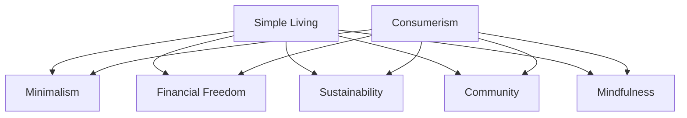

                 


### Introduction

#### Book Title and Authors

"Simple Living Movement: Finding Authenticity in Consumerism" is an insightful exploration of the concept of simple living and its relevance in the contemporary world. The book is authored by AI天才研究院（AI Genius Institute）and Zen and The Art of Computer Programming, two distinguished authorities in the fields of artificial intelligence and computer science. The authors bring a unique perspective to the discussion, drawing upon their extensive experience and expertise to provide a comprehensive analysis of the simple living movement.

#### Brief Overview of the Book

The book delves into the principles and practices of simple living, offering readers a roadmap for escaping the clutches of consumerism. It examines the historical background of the simple living movement, its evolution over time, and its impact on society. The authors also explore the connection between consumerism and authenticity, providing practical strategies for buying mindfully and ethically.

#### Introduction to the Simple Living Movement

The simple living movement is an ideology that advocates for a life of voluntary simplicity, where individuals prioritize experiences and relationships over material possessions. This movement seeks to challenge the consumer-driven culture that dominates modern society and promote a more balanced and meaningful way of living. The book aims to provide a thorough understanding of this movement, its core concepts, and the benefits it offers.

### Keywords

- Simple Living Movement
- Consumerism
- Authenticity
- Mindful Consumption
- Ethical Shopping
- Historical Background
- Evolution of Consumerism
- Practical Applications
- Challenges and Solutions
- Project Case Studies

### Summary

"Simple Living Movement: Finding Authenticity in Consumerism" offers a deep dive into the philosophy of simple living and its implications for our lives. Through detailed analysis and practical examples, the book provides readers with a roadmap for escaping the clutches of consumerism and embracing a more meaningful and authentic way of life. The authors emphasize the importance of mindful consumption and ethical shopping, offering valuable insights for individuals seeking to live a simpler, more balanced life.

----------------------------------------------------------------

```markdown
# Simple Living Movement: Finding Authenticity in Consumerism

> Keywords: Simple Living Movement, Consumerism, Authenticity, Mindful Consumption, Ethical Shopping, Historical Background, Evolution of Consumerism, Practical Applications, Challenges and Solutions, Project Case Studies

> Summary: This book explores the philosophy of simple living, its implications for modern society, and its relevance in the context of consumerism. It provides readers with a roadmap for embracing a more meaningful and authentic way of life through mindful consumption and ethical shopping.
```

### Core Concepts and Principles of Simple Living

In this section, we will delve into the core concepts and principles that define the simple living movement. Simple living is more than just a lifestyle choice; it is a deliberate and conscious effort to live a life that is less focused on material possessions and more focused on personal growth, meaningful relationships, and community engagement. Understanding these principles is essential for grasping the essence of simple living and its potential benefits.

#### Definition of Simple Living

At its core, simple living is about living intentionally and purposefully, choosing to prioritize experiences and relationships over material wealth. It involves a conscious decision to live within one’s means, consume less, and avoid the endless cycle of accumulation and acquisition. This lifestyle choice is driven by a desire to live a life that is authentic, fulfilling, and in alignment with one's values.

#### Principles of Simple Living

1. **Minimalism**: One of the most prominent principles of simple living is minimalism. This involves decluttering one’s living space and possessions, focusing only on items that are truly necessary and meaningful. Minimalism helps individuals to simplify their lives, reduce stress, and focus on what truly matters.

2. **Mindfulness**: Simple living encourages mindfulness in all aspects of life, from consumption choices to daily activities. Mindfulness involves being fully present in the moment and making deliberate decisions based on awareness and intention rather than impulse or habit.

3. **Financial Freedom**: Simple living often goes hand in hand with financial freedom. By living within one’s means and avoiding debt, individuals can achieve financial independence and free themselves from the constraints of a consumer-driven lifestyle.

4. **Sustainability**: Another key principle of simple living is sustainability. This involves making choices that are environmentally friendly and socially responsible. Simple living promotes the use of renewable resources, reducing waste, and supporting local and ethical businesses.

5. **Community**: Simple living emphasizes the importance of community and social connections. By engaging with neighbors, participating in local activities, and building strong relationships, individuals can create a supportive network that enriches their lives.

#### Relationship Between Simple Living and Consumerism

The relationship between simple living and consumerism is complex and often contradictory. Consumerism is a cultural and economic system that encourages the constant acquisition of goods and services, promoting a lifestyle of excess and materialism. In contrast, simple living seeks to reduce the emphasis on consumption and encourage a more balanced and fulfilling way of life.

The principles of simple living directly challenge the values of consumerism by promoting:

- **Sustainability** over consumption
- **Community** over isolation
- **Authenticity** over superficiality
- **Mindfulness** over impulsivity

By embracing simple living, individuals can break free from the cycle of consumerism and live a more intentional and meaningful life.

### Mermaid Flowchart

To visualize the relationship between simple living and consumerism, we can create a Mermaid flowchart that illustrates the core concepts and their interconnections. The flowchart will help us understand how these concepts interact and influence one another.



In this flowchart, we can see that simple living principles (A) are in direct contrast to the values of consumerism (B). The principles of simple living (C, D, E, F, G) serve as a counterbalance to the excessive consumption promoted by consumerism, providing a framework for a more intentional and fulfilling life.

### Conclusion

Understanding the core concepts and principles of simple living is crucial for anyone interested in embracing this lifestyle. By recognizing the relationship between simple living and consumerism, we can make more informed choices that align with our values and contribute to a more sustainable and meaningful way of life. In the next section, we will explore the historical background of the simple living movement, examining its origins and evolution.

----------------------------------------------------------------

```markdown
## Core Concepts and Principles of Simple Living

### Definition of Simple Living

Simple living is a philosophy and lifestyle that emphasizes living with intention and purpose, focusing on the essentials and prioritizing experiences, relationships, and personal growth over material possessions. It involves making conscious choices to reduce consumption, simplify daily life, and live within one's means.

### Principles of Simple Living

1. **Minimalism**
   - Decluttering and focusing on essential items that bring true value and joy.
   - Prioritizing experiences over material goods.

2. **Mindfulness**
   - Being present in the moment and making decisions based on intention rather than impulse.
   - Cultivating awareness and gratitude for what one has.

3. **Financial Freedom**
   - Living within one's means and avoiding debt.
   - Prioritizing savings and investing for long-term financial stability.

4. **Sustainability**
   - Making environmentally friendly choices and reducing waste.
   - Supporting ethical and sustainable businesses and practices.

5. **Community**
   - Building and nurturing relationships with family, friends, and neighbors.
   - Participating in local activities and supporting community initiatives.

### Relationship Between Simple Living and Consumerism

Simple living challenges the values of consumerism by promoting sustainability, community, authenticity, and mindfulness. It encourages individuals to break free from the cycle of endless consumption and live a more intentional and fulfilling life.

### Mermaid Flowchart

Below is a Mermaid flowchart illustrating the core concepts and principles of simple living and their relationship with consumerism.


### Conclusion

Understanding the core concepts and principles of simple living is essential for anyone seeking to live a more intentional and fulfilling life. In the next section, we will delve into the historical background of the simple living movement, exploring its origins and evolution.
```

----------------------------------------------------------------

### Historical Background of the Simple Living Movement

The simple living movement has its roots in various historical and cultural movements, each contributing to the development and evolution of the concept. Understanding the origins and key figures of the simple living movement provides insight into its historical context and the factors that have shaped its growth.

#### Origins of the Simple Living Movement

The simple living movement can trace its origins back to several key historical periods and cultural movements:

1. **The Renaissance (14th-17th Centuries)**
   - The Renaissance period was marked by a renewed interest in humanism, which emphasized the importance of personal growth, knowledge, and individual fulfillment over material wealth.
   - The movement towards simple living can be seen in the works of Renaissance artists and philosophers, who sought to simplify their lives and focus on inner development.

2. **The Enlightenment (17th-18th Centuries)**
   - The Enlightenment era was characterized by a shift towards rational thinking and individualism. Thinkers like Voltaire, Rousseau, and Locke promoted the idea that individuals should have the freedom to pursue their own happiness and well-being, free from the constraints of materialism.

3. **The Transcendentalist Movement (19th Century)**
   - The Transcendentalist movement, led by figures like Henry David Thoreau and Ralph Waldo Emerson, emphasized the importance of self-reliance, spiritual growth, and living in harmony with nature. Thoreau's famous work, "Walden," is a seminal text in the simple living movement, advocating for a life of simplicity and purpose.

4. **The Great Depression (1930s)**
   - The economic hardships of the Great Depression led many people to reevaluate their lifestyles and adopt more frugal and sustainable practices. The movement towards simple living gained momentum as individuals sought to find fulfillment and resilience in the face of economic adversity.

#### Key Figures and Movements in Simple Living History

1. **Henry David Thoreau**
   - Thoreau is one of the most influential figures in the simple living movement. His seminal work, "Walden," describes his experiment in living a simple, self-sufficient life in the wilderness. Thoreau's philosophy emphasizes the importance of living in harmony with nature and prioritizing personal growth over material wealth.

2. **Ralph Waldo Emerson**
   - Emerson was a key figure in the Transcendentalist movement and a proponent of simple living. His essays and lectures on individualism, self-reliance, and the importance of personal growth have had a lasting impact on the simple living movement.

3. **Leo Tolstoy**
   - Tolstoy, a Russian writer and philosopher, advocated for a simple and virtuous life in his works. In his book, "The Kingdom of God Is Within You," Tolstoy argued that true happiness and fulfillment could be found through spiritual awakening and a rejection of materialism.

4. **The Modern Simple Living Movement
```markdown
## Historical Background of the Simple Living Movement

### Origins of the Simple Living Movement

The simple living movement has its roots in various historical and cultural movements, each contributing to the development and evolution of the concept. Understanding the origins and key figures of the simple living movement provides insight into its historical context and the factors that have shaped its growth.

#### Origins of the Simple Living Movement

The simple living movement can trace its origins back to several key historical periods and cultural movements:

1. **The Renaissance (14th-17th Centuries)**
   - The Renaissance period was marked by a renewed interest in humanism, which emphasized the importance of personal growth, knowledge, and individual fulfillment over material wealth.
   - The movement towards simple living can be seen in the works of Renaissance artists and philosophers, who sought to simplify their lives and focus on inner development.

2. **The Enlightenment (17th-18th Centuries)**
   - The Enlightenment era was characterized by a shift towards rational thinking and individualism. Thinkers like Voltaire, Rousseau, and Locke promoted the idea that individuals should have the freedom to pursue their own happiness and well-being, free from the constraints of materialism.

3. **The Transcendentalist Movement (19th Century)**
   - The Transcendentalist movement, led by figures like Henry David Thoreau and Ralph Waldo Emerson, emphasized the importance of self-reliance, spiritual growth, and living in harmony with nature. Thoreau's famous work, "Walden," is a seminal text in the simple living movement, advocating for a life of simplicity and purpose.

4. **The Great Depression (1930s)**
   - The economic hardships of the Great Depression led many people to reevaluate their lifestyles and adopt more frugal and sustainable practices. The movement towards simple living gained momentum as individuals sought to find fulfillment and resilience in the face of economic adversity.

#### Key Figures and Movements in Simple Living History

1. **Henry David Thoreau**
   - Thoreau is one of the most influential figures in the simple living movement. His seminal work, "Walden," describes his experiment in living a simple, self-sufficient life in the wilderness. Thoreau's philosophy emphasizes the importance of living in harmony with nature and prioritizing personal growth over material wealth.

2. **Ralph Waldo Emerson**
   - Emerson was a key figure in the Transcendentalist movement and a proponent of simple living. His essays and lectures on individualism, self-reliance, and the importance of personal growth have had a lasting impact on the simple living movement.

3. **Leo Tolstoy**
   - Tolstoy, a Russian writer and philosopher, advocated for a simple and virtuous life in his works. In his book, "The Kingdom of God Is Within You," Tolstoy argued that true happiness and fulfillment could be found through spiritual awakening and a rejection of materialism.

4. **The Modern Simple Living Movement

```markdown
### The Modern Simple Living Movement

The modern simple living movement gained momentum in the late 20th and early 21st centuries, as increasing awareness of environmental issues, economic instability, and the negative impacts of consumerism led more people to seek alternative ways of living. This movement has been influenced by several key factors:

1. **Environmental Concerns**
   - Growing concerns about climate change, resource depletion, and pollution have inspired many to adopt simpler lifestyles that are more sustainable and environmentally friendly. This has led to increased interest in renewable energy, organic food, and ethical consumerism.

2. **Financial Stability**
   - Economic volatility and the high cost of living have prompted many individuals and families to reassess their priorities and adopt simpler lifestyles to achieve financial stability. By reducing debt and living within their means, they can create a more secure and predictable financial future.

3. **Cultural Shifts**
   - The rise of the internet and social media has facilitated the spread of ideas and information, allowing people from diverse backgrounds to connect and share their experiences with simple living. This has led to a cultural shift towards valuing experiences, personal growth, and community over material possessions.

4. **Spiritual Awakening**
   - For many, simple living is a pathway to spiritual growth and inner peace. By simplifying their lives and focusing on what truly matters, individuals can experience greater fulfillment and contentment.

#### Current Trends and Future Prospects

The modern simple living movement is diverse and encompasses a wide range of practices and philosophies. Some current trends include:

- **Minimalism**: A focus on decluttering and living with only essential items, promoting a more intentional and meaningful life.
- **Digital Detox**: A movement to reduce screen time and the constant distractions of technology, emphasizing the importance of real-life interactions and experiences.
- **Eco-Friendly Living**: Embracing sustainable and environmentally friendly practices, such as reducing waste, using renewable energy, and supporting local and ethical businesses.

The future prospects of the simple living movement appear promising, as more people become aware of the negative impacts of consumerism and seek ways to live more sustainably and meaningfully. As the movement continues to grow and evolve, it will likely inspire new innovations and approaches to living that prioritize well-being and community over material wealth.

### Conclusion

The historical background of the simple living movement reveals a rich tapestry of cultural and philosophical influences that have shaped its development over centuries. From the early humanist and transcendentalist movements to the modern focus on sustainability and financial stability, the simple living movement has continually evolved to address the challenges of its time. By understanding its history, we can better appreciate the principles and values that define simple living and its potential to create a more fulfilling and sustainable future.
```

----------------------------------------------------------------

### Practical Applications of Simple Living

The principles of simple living can be applied in various aspects of everyday life, from personal habits to professional settings. This section will explore how individuals and organizations can incorporate simple living practices to enhance their well-being, improve productivity, and foster stronger community connections.

#### Simple Living in Everyday Life

1. **Minimalism in Personal Space**
   - Decluttering your living environment by removing unnecessary items can reduce stress and create a more peaceful living space. This involves regularly evaluating your possessions and keeping only those that truly bring you joy and fulfillment.

2. **Mindful Consumption**
   - Being mindful of what you buy and consume can lead to more conscious and ethical choices. This involves considering the environmental and social impacts of your purchases, and opting for sustainable and ethically-produced products whenever possible.

3. **Financial Management**
   - Living within your means and budgeting wisely can provide financial stability and reduce stress. This may involve creating a monthly budget, avoiding unnecessary expenses, and setting aside money for savings and investments.

4. **Sustainable Practices**
   - Embracing sustainable practices such as reducing waste, using renewable energy, and supporting local businesses can contribute to a more environmentally friendly lifestyle. This not only benefits the planet but also fosters a sense of community and interconnectedness.

#### Simple Living in the Workplace

1. **Efficient Work Practices**
   - Simple living principles can be applied to the workplace by streamlining processes, eliminating unnecessary tasks, and focusing on what truly adds value. This can lead to increased productivity and reduced stress for employees.

2. **Mindfulness and Work-Life Balance**
   - Encouraging mindfulness and work-life balance can improve employee well-being and job satisfaction. This may involve implementing flexible working hours, promoting breaks, and encouraging employees to disconnect from work during personal time.

3. **Sustainable Business Practices**
   - Organizations can adopt simple living principles by implementing environmentally friendly practices, such as reducing paper usage, using energy-efficient equipment, and supporting local suppliers. This can help reduce the company's environmental footprint and enhance its reputation.

4. **Community Engagement**
   - Companies can foster community engagement by supporting local causes, participating in volunteer activities, and encouraging employees to get involved in community initiatives. This can help build a sense of belonging and purpose among employees.

#### Simple Living and Personal Relationships

1. **Prioritizing Quality Time**
   - Simple living encourages individuals to prioritize quality time with family and friends over material possessions. This involves scheduling regular time for social activities, hobbies, and personal interests, and making deliberate efforts to connect with loved ones.

2. **Mindful Communication**
   - Mindfulness in communication can improve relationships by fostering empathy, active listening, and respectful dialogue. This involves being present in conversations, avoiding distractions, and expressing thoughts and feelings in a constructive manner.

3. **Supportive Community Networks**
   - Building a supportive community network can provide individuals with emotional support, encouragement, and resources. This can involve participating in local groups, joining clubs or organizations, and seeking out like-minded individuals who share similar values and interests.

### Conclusion

Incorporating simple living practices into everyday life, the workplace, and personal relationships can lead to a more meaningful, balanced, and fulfilling existence. By prioritizing experiences and relationships over material possessions, individuals and organizations can enhance their well-being, improve productivity, and foster stronger community connections. As we continue to embrace simple living, we can create a more sustainable and harmonious world for ourselves and future generations.

----------------------------------------------------------------

```markdown
## Practical Applications of Simple Living

### Simple Living in Everyday Life

1. **Minimalism in Personal Space**
   - Decluttering your living environment by removing unnecessary items can reduce stress and create a more peaceful living space. This involves regularly evaluating your possessions and keeping only those that truly bring you joy and fulfillment.

2. **Mindful Consumption**
   - Being mindful of what you buy and consume can lead to more conscious and ethical choices. This involves considering the environmental and social impacts of your purchases, and opting for sustainable and ethically-produced products whenever possible.

3. **Financial Management**
   - Living within your means and budgeting wisely can provide financial stability and reduce stress. This may involve creating a monthly budget, avoiding unnecessary expenses, and setting aside money for savings and investments.

4. **Sustainable Practices**
   - Embracing sustainable practices such as reducing waste, using renewable energy, and supporting local businesses can contribute to a more environmentally friendly lifestyle. This not only benefits the planet but also fosters a sense of community and interconnectedness.

### Simple Living in the Workplace

1. **Efficient Work Practices**
   - Simple living principles can be applied to the workplace by streamlining processes, eliminating unnecessary tasks, and focusing on what truly adds value. This can lead to increased productivity and reduced stress for employees.

2. **Mindfulness and Work-Life Balance**
   - Encouraging mindfulness and work-life balance can improve employee well-being and job satisfaction. This may involve implementing flexible working hours, promoting breaks, and encouraging employees to disconnect from work during personal time.

3. **Sustainable Business Practices**
   - Organizations can adopt simple living principles by implementing environmentally friendly practices, such as reducing paper usage, using energy-efficient equipment, and supporting local suppliers. This can help reduce the company's environmental footprint and enhance its reputation.

4. **Community Engagement**
   - Companies can foster community engagement by supporting local causes, participating in volunteer activities, and encouraging employees to get involved in community initiatives. This can help build a sense of belonging and purpose among employees.

### Simple Living and Personal Relationships

1. **Prioritizing Quality Time**
   - Simple living encourages individuals to prioritize quality time with family and friends over material possessions. This involves scheduling regular time for social activities, hobbies, and personal interests, and making deliberate efforts to connect with loved ones.

2. **Mindful Communication**
   - Mindfulness in communication can improve relationships by fostering empathy, active listening, and respectful dialogue. This involves being present in conversations, avoiding distractions, and expressing thoughts and feelings in a constructive manner.

3. **Supportive Community Networks**
   - Building a supportive community network can provide individuals with emotional support, encouragement, and resources. This can involve participating in local groups, joining clubs or organizations, and seeking out like-minded individuals who share similar values and interests.

### Conclusion

Incorporating simple living practices into everyday life, the workplace, and personal relationships can lead to a more meaningful, balanced, and fulfilling existence. By prioritizing experiences and relationships over material possessions, individuals and organizations can enhance their well-being, improve productivity, and foster stronger community connections. As we continue to embrace simple living, we can create a more sustainable and harmonious world for ourselves and future generations.
```

----------------------------------------------------------------

### Challenges and Solutions in Adopting Simple Living

While the concept of simple living offers numerous benefits, it is not without its challenges. Navigating the complexities of consumer culture, financial constraints, and societal expectations can make the transition to a simple living lifestyle seem daunting. However, by understanding these challenges and exploring practical solutions, individuals can overcome obstacles and achieve a more fulfilling and balanced life.

#### Identifying Obstacles to Simple Living

1. **Consumer Culture**
   - The pervasive influence of consumer culture can make it difficult to break free from the cycle of consumption. Advertisements, social media, and peer pressure often encourage the purchase of goods and services, fostering a sense of inadequacy and the need to keep up with societal standards.

2. **Financial Constraints**
   - For many, financial constraints can be a significant barrier to adopting a simple living lifestyle. High living expenses, debt, and lack of financial education can make it challenging to live within one's means and reduce unnecessary spending.

3. **Societal Expectations**
   - The expectations of family, friends, and society at large can also pose challenges. The desire to conform to social norms and maintain a certain lifestyle can lead individuals to compromise their values and continue with patterns of consumption that do not align with simple living principles.

#### Strategies for Overcoming Challenges

1. **Mindful Awareness**
   - Developing mindful awareness of consumption habits and their underlying motivations can help individuals recognize and break free from the influence of consumer culture. By cultivating mindfulness, individuals can make more deliberate and intentional choices about what they purchase and why.

2. **Financial Planning and Education**
   - Creating a comprehensive financial plan and educating oneself about money management can help overcome financial constraints. This may involve budgeting, setting savings goals, reducing debt, and investing wisely to achieve long-term financial stability.

3. **Building a Supportive Community**
   - Surrounding oneself with like-minded individuals who share similar values and goals can provide encouragement and support. Joining simple living groups, clubs, or online communities can help individuals connect with others who are also striving to adopt a simpler lifestyle.

4. **Prioritizing Personal Growth**
   - Focusing on personal growth and self-improvement can provide a sense of fulfillment and reduce the desire for material possessions. By investing in hobbies, education, and self-care, individuals can find happiness and satisfaction that is not tied to external possessions.

5. **Practical Steps for Reducing Consumption**
   - Implementing practical strategies to reduce consumption can make the transition to simple living easier. This may involve decluttering and selling unnecessary items, adopting a minimalist approach to clothing and accessories, and opting for quality over quantity when purchasing goods.

#### Case Studies of Successful Simple Living Implementations

1. **Case Study 1: The Minimalist Family**
   - A family of four decided to embrace minimalism after realizing the negative impact of consumerism on their lives. By decluttering their home, reducing their expenses, and focusing on experiences rather than possessions, they found greater happiness and fulfillment.

2. **Case Study 2: The Sustainable Entrepreneur**
   - An entrepreneur who ran a successful tech startup decided to apply simple living principles to his business. By adopting environmentally friendly practices, reducing waste, and focusing on sustainable growth, he was able to create a company that was both profitable and socially responsible.

3. **Case Study 3: The Digital Nomad**
   - A digital nomad who traveled the world embraced simple living by living in low-cost locations, embracing a minimalist lifestyle, and using technology to work remotely. This allowed him to experience different cultures, reduce expenses, and live a more fulfilling life.

### Conclusion

While the challenges of adopting simple living can be significant, they are not insurmountable. By understanding these challenges and implementing practical strategies, individuals can overcome obstacles and create a more meaningful and balanced life. In the next section, we will explore the connection between consumerism and authenticity, examining how simple living can help individuals find their true selves amidst the materialistic chaos.

----------------------------------------------------------------

```markdown
### Challenges and Solutions in Adopting Simple Living

#### Identifying Obstacles to Simple Living

1. **Consumer Culture**
   - The pervasive influence of consumer culture can make it difficult to break free from the cycle of consumption. Advertisements, social media, and peer pressure often encourage the purchase of goods and services, fostering a sense of inadequacy and the need to keep up with societal standards.

2. **Financial Constraints**
   - For many, financial constraints can be a significant barrier to adopting a simple living lifestyle. High living expenses, debt, and lack of financial education can make it challenging to live within one's means and reduce unnecessary spending.

3. **Societal Expectations**
   - The expectations of family, friends, and society at large can also pose challenges. The desire to conform to social norms and maintain a certain lifestyle can lead individuals to compromise their values and continue with patterns of consumption that do not align with simple living principles.

#### Strategies for Overcoming Challenges

1. **Mindful Awareness**
   - Developing mindful awareness of consumption habits and their underlying motivations can help individuals recognize and break free from the influence of consumer culture. By cultivating mindfulness, individuals can make more deliberate and intentional choices about what they purchase and why.

2. **Financial Planning and Education**
   - Creating a comprehensive financial plan and educating oneself about money management can help overcome financial constraints. This may involve budgeting, setting savings goals, reducing debt, and investing wisely to achieve long-term financial stability.

3. **Building a Supportive Community**
   - Surrounding oneself with like-minded individuals who share similar values and goals can provide encouragement and support. Joining simple living groups, clubs, or online communities can help individuals connect with others who are also striving to adopt a simpler lifestyle.

4. **Prioritizing Personal Growth**
   - Focusing on personal growth and self-improvement can provide a sense of fulfillment and reduce the desire for material possessions. By investing in hobbies, education, and self-care, individuals can find happiness and satisfaction that is not tied to external possessions.

5. **Practical Steps for Reducing Consumption**
   - Implementing practical strategies to reduce consumption can make the transition to simple living easier. This may involve decluttering and selling unnecessary items, adopting a minimalist approach to clothing and accessories, and opting for quality over quantity when purchasing goods.

#### Case Studies of Successful Simple Living Implementations

1. **Case Study 1: The Minimalist Family**
   - A family of four decided to embrace minimalism after realizing the negative impact of consumerism on their lives. By decluttering their home, reducing their expenses, and focusing on experiences rather than possessions, they found greater happiness and fulfillment.

2. **Case Study 2: The Sustainable Entrepreneur**
   - An entrepreneur who ran a successful tech startup decided to apply simple living principles to his business. By adopting environmentally friendly practices, reducing waste, and focusing on sustainable growth, he was able to create a company that was both profitable and socially responsible.

3. **Case Study 3: The Digital Nomad**
   - A digital nomad who traveled the world embraced simple living by living in low-cost locations, embracing a minimalist lifestyle, and using technology to work remotely. This allowed him to experience different cultures, reduce expenses, and live a more fulfilling life.

### Conclusion

While the challenges of adopting simple living can be significant, they are not insurmountable. By understanding these challenges and implementing practical strategies, individuals can overcome obstacles and create a more meaningful and balanced life. In the next section, we will explore the connection between consumerism and authenticity, examining how simple living can help individuals find their true selves amidst the materialistic chaos.
```

----------------------------------------------------------------

### Authenticity in Consumerism

Consumerism, with its relentless push for new products and experiences, often leads individuals to feel dissatisfied and disconnected from their true selves. The constant desire to acquire more and keep up with societal standards can erode authenticity, causing individuals to lose sight of their values, passions, and unique identities. In this section, we will explore the connection between consumerism and authenticity, discussing how simple living can help individuals rediscover their true selves and maintain a strong sense of authenticity in the face of consumer culture.

#### The Relationship Between Consumerism and Authenticity

1. **Materialism and Dissatisfaction**
   - Consumerism promotes the belief that material possessions can bring happiness and fulfillment. However, research has shown that materialistic values are often associated with lower levels of well-being and higher levels of dissatisfaction. This is because the pursuit of material wealth is often unending, leading individuals to constantly seek more, even when they already have what they need.

2. **Lost Sense of Identity**
   - Consumerism can also lead to a loss of identity, as individuals become overly focused on their possessions and the opinions of others. This can result in a shallow sense of self and a reliance on external validation, rather than genuine self-awareness and self-acceptance.

3. **Reduced Quality Time**
   - The pursuit of material wealth often requires significant time and energy, leaving individuals with less time for personal relationships and self-reflection. This can further erode authenticity, as individuals may feel disconnected from their true selves and the people who matter most in their lives.

#### How Simple Living Promotes Authenticity

1. **Prioritizing Experiences Over Possessions**
   - Simple living encourages individuals to focus on experiences and relationships, rather than material possessions. By prioritizing quality time with loved ones, engaging in meaningful hobbies, and exploring new interests, individuals can develop a deeper sense of fulfillment and satisfaction.

2. **Mindful Consumption and Self-Reflection**
   - Embracing mindful consumption involves being aware of the impact of one's purchasing decisions on both personal well-being and the environment. This mindfulness can lead to more deliberate and intentional choices, reducing the likelihood of impulsive purchases driven by advertising or peer pressure. Additionally, taking time for self-reflection can help individuals identify their true values, passions, and goals, leading to a stronger sense of identity and authenticity.

3. **Reducing Debt and Financial Stress**
   - Simple living principles often involve reducing debt and living within one's means. This financial stability can reduce stress and allow individuals to focus on personal growth and well-being, rather than the pursuit of material wealth. A sense of financial freedom can also enhance self-esteem and confidence, contributing to a stronger sense of authenticity.

4. **Embracing Sustainability and Environmental Responsibility**
   - By adopting sustainable practices and supporting ethical businesses, individuals can feel a sense of purpose and fulfillment. This connection to a larger cause can provide a deeper sense of meaning and purpose, helping individuals stay true to their values and beliefs.

#### Practical Tips for Cultivating Authenticity

1. **Declutter and Simplify**
   - Begin by decluttering your living space and possessions, keeping only those items that truly bring you joy and fulfillment. This can help you regain control over your environment and reduce distractions.

2. **Practice Mindful Consumption**
   - Before making a purchase, take time to consider whether it aligns with your values and genuinely adds value to your life. Ask yourself if it is a need or a want, and if it will truly make you happier in the long run.

3. **Prioritize Quality Time**
   - Make a conscious effort to spend quality time with loved ones, engaging in activities that bring you joy and foster meaningful connections. This can help you stay grounded and connected to your true self.

4. **Reflect on Your Values and Goals**
   - Regularly take time to reflect on your values, passions, and goals. This can help you stay focused on what truly matters in your life and avoid getting caught up in the distractions of consumer culture.

5. **Support Ethical and Sustainable Practices**
   - Make a commitment to support ethical and sustainable businesses, both in your personal and professional life. This can help you feel a sense of purpose and fulfillment, contributing to a stronger sense of authenticity.

### Conclusion

In a world dominated by consumerism, maintaining authenticity can be challenging. However, by embracing the principles of simple living, individuals can find ways to cultivate authenticity and rediscover their true selves. By prioritizing experiences, mindful consumption, and meaningful relationships, individuals can break free from the clutches of consumer culture and live a more fulfilling, authentic life.

----------------------------------------------------------------

```markdown
### Authenticity in Consumerism

#### The Relationship Between Consumerism and Authenticity

1. **Materialism and Dissatisfaction**
   - Consumerism promotes the belief that material possessions can bring happiness and fulfillment. However, research has shown that materialistic values are often associated with lower levels of well-being and higher levels of dissatisfaction. This is because the pursuit of material wealth is often unending, leading individuals to constantly seek more, even when they already have what they need.

2. **Lost Sense of Identity**
   - Consumerism can also lead to a loss of identity, as individuals become overly focused on their possessions and the opinions of others. This can result in a shallow sense of self and a reliance on external validation, rather than genuine self-awareness and self-acceptance.

3. **Reduced Quality Time**
   - The pursuit of material wealth often requires significant time and energy, leaving individuals with less time for personal relationships and self-reflection. This can further erode authenticity, as individuals may feel disconnected from their true selves and the people who matter most in their lives.

#### How Simple Living Promotes Authenticity

1. **Prioritizing Experiences Over Possessions**
   - Simple living encourages individuals to focus on experiences and relationships, rather than material possessions. By prioritizing quality time with loved ones, engaging in meaningful hobbies, and exploring new interests, individuals can develop a deeper sense of fulfillment and satisfaction.

2. **Mindful Consumption and Self-Reflection**
   - Embracing mindful consumption involves being aware of the impact of one's purchasing decisions on both personal well-being and the environment. This mindfulness can lead to more deliberate and intentional choices, reducing the likelihood of impulsive purchases driven by advertising or peer pressure. Additionally, taking time for self-reflection can help individuals identify their true values, passions, and goals, leading to a stronger sense of identity and authenticity.

3. **Reducing Debt and Financial Stress**
   - Simple living principles often involve reducing debt and living within one's means. This financial stability can reduce stress and allow individuals to focus on personal growth and well-being, rather than the pursuit of material wealth. A sense of financial freedom can also enhance self-esteem and confidence, contributing to a stronger sense of authenticity.

4. **Embracing Sustainability and Environmental Responsibility**
   - By adopting sustainable practices and supporting ethical businesses, individuals can feel a sense of purpose and fulfillment. This connection to a larger cause can provide a deeper sense of meaning and purpose, helping individuals stay true to their values and beliefs.

#### Practical Tips for Cultivating Authenticity

1. **Declutter and Simplify**
   - Begin by decluttering your living space and possessions, keeping only those items that truly bring you joy and fulfillment. This can help you regain control over your environment and reduce distractions.

2. **Practice Mindful Consumption**
   - Before making a purchase, take time to consider whether it aligns with your values and genuinely adds value to your life. Ask yourself if it is a need or a want, and if it will truly make you happier in the long run.

3. **Prioritize Quality Time**
   - Make a conscious effort to spend quality time with loved ones, engaging in activities that bring you joy and foster meaningful connections. This can help you stay grounded and connected to your true self.

4. **Reflect on Your Values and Goals**
   - Regularly take time to reflect on your values, passions, and goals. This can help you stay focused on what truly matters in your life and avoid getting caught up in the distractions of consumer culture.

5. **Support Ethical and Sustainable Practices**
   - Make a commitment to support ethical and sustainable businesses, both in your personal and professional life. This can help you feel a sense of purpose and fulfillment, contributing to a stronger sense of authenticity.

### Conclusion

In a world dominated by consumerism, maintaining authenticity can be challenging. However, by embracing the principles of simple living, individuals can find ways to cultivate authenticity and rediscover their true selves. By prioritizing experiences, mindful consumption, and meaningful relationships, individuals can break free from the clutches of consumer culture and live a more fulfilling, authentic life.
```

----------------------------------------------------------------

### Mathematical Models and Formulas in Simple Living

Mathematics can be a powerful tool for understanding and analyzing the principles of simple living. In this section, we will explore mathematical models and formulas that can help individuals assess the impact of their consumption habits, financial decisions, and lifestyle choices. These models provide a quantitative perspective on the benefits of simple living, allowing individuals to make more informed and intentional decisions.

#### Mathematical Models to Measure the Impact of Simple Living

1. **Consumer Expenditure Model**
   - The consumer expenditure model can be used to analyze how changes in consumption patterns affect personal well-being. This model considers various factors, such as income, price levels, and individual preferences, to estimate the impact of consumption on overall satisfaction and quality of life.

   **Expenditure Equation:**
   $$ \text{Expenditure} = \text{Income} \times \text{Price Level} \times \text{Consumption Preference} $$

   By optimizing this equation, individuals can identify the most cost-effective ways to improve their quality of life while minimizing unnecessary expenses.

2. **Financial Stability Model**
   - The financial stability model focuses on the relationship between income, expenses, and savings. This model can help individuals assess their financial health and identify areas where they can make adjustments to improve their financial well-being.

   **Financial Stability Equation:**
   $$ \text{Financial Stability} = \text{Income} - \text{Expenses} + \text{Savings} $$

   By maintaining a positive balance in this equation, individuals can ensure long-term financial stability and security.

3. **Environmental Impact Model**
   - The environmental impact model evaluates the environmental consequences of consumption habits and lifestyle choices. This model considers factors such as resource depletion, carbon emissions, and waste generation to assess the sustainability of an individual's lifestyle.

   **Environmental Impact Equation:**
   $$ \text{Environmental Impact} = \text{Resource Depletion} \times \text{Carbon Emissions} + \text{Waste Generation} $$

   By minimizing these factors, individuals can reduce their environmental footprint and contribute to a more sustainable future.

#### Detailed Explanation and Examples

1. **Consumer Expenditure Model Example:**
   - Suppose an individual earns $5,000 per month and faces a price level of 1.2. Their consumption preference is to spend 70% of their income on essential items, 20% on non-essential items, and 10% on savings. Using the consumer expenditure model, we can calculate their monthly expenditure as follows:
   $$ \text{Expenditure} = 5,000 \times 1.2 \times 0.7 + 5,000 \times 1.2 \times 0.2 + 5,000 \times 1.2 \times 0.1 = 4,200 + 1,200 + 600 = 6,000 $$

   This example shows that by optimizing consumption preferences, individuals can reduce their monthly expenditure while maintaining their quality of life.

2. **Financial Stability Model Example:**
   - Using the financial stability model, we can assess the impact of increasing savings on an individual's financial well-being. Suppose an individual earns $5,000 per month and currently spends $4,000, leaving $1,000 for savings. If they decide to increase their savings rate to 30% of their income, their new financial stability would be:
   $$ \text{Financial Stability} = 5,000 - 4,000 + 0.3 \times 5,000 = 500 + 1,500 = 2,000 $$

   This example demonstrates the positive impact of increasing savings on financial stability.

3. **Environmental Impact Model Example:**
   - To assess the environmental impact of an individual's lifestyle, we can use the environmental impact model. Suppose an individual generates 10 tons of carbon emissions and produces 5 tons of waste per year. Using the model, their annual environmental impact would be:
   $$ \text{Environmental Impact} = 10 \times 1 + 5 \times 1 = 15 $$

   By reducing their carbon emissions and waste generation, individuals can contribute to a more sustainable environment.

### Conclusion

Mathematical models and formulas provide valuable insights into the impact of simple living principles on personal well-being, financial stability, and environmental sustainability. By using these models to analyze their consumption habits, financial decisions, and lifestyle choices, individuals can make more informed and intentional decisions that align with their values and goals. In the next section, we will explore real-world examples of simple living projects to further illustrate the practical applications of these models.

----------------------------------------------------------------

```markdown
### Mathematical Models and Formulas in Simple Living

Mathematics can be a powerful tool for understanding and analyzing the principles of simple living. In this section, we will explore mathematical models and formulas that can help individuals assess the impact of their consumption habits, financial decisions, and lifestyle choices. These models provide a quantitative perspective on the benefits of simple living, allowing individuals to make more informed and intentional decisions.

#### Mathematical Models to Measure the Impact of Simple Living

1. **Consumer Expenditure Model**
   - The consumer expenditure model can be used to analyze how changes in consumption patterns affect personal well-being. This model considers various factors, such as income, price levels, and individual preferences, to estimate the impact of consumption on overall satisfaction and quality of life.
   
   **Expenditure Equation:**
   $$ \text{Expenditure} = \text{Income} \times \text{Price Level} \times \text{Consumption Preference} $$

   By optimizing this equation, individuals can identify the most cost-effective ways to improve their quality of life while minimizing unnecessary expenses.

2. **Financial Stability Model**
   - The financial stability model focuses on the relationship between income, expenses, and savings. This model can help individuals assess their financial health and identify areas where they can make adjustments to improve their financial well-being.
   
   **Financial Stability Equation:**
   $$ \text{Financial Stability} = \text{Income} - \text{Expenses} + \text{Savings} $$

   By maintaining a positive balance in this equation, individuals can ensure long-term financial stability and security.

3. **Environmental Impact Model**
   - The environmental impact model evaluates the environmental consequences of consumption habits and lifestyle choices. This model considers factors such as resource depletion, carbon emissions, and waste generation to assess the sustainability of an individual's lifestyle.
   
   **Environmental Impact Equation:**
   $$ \text{Environmental Impact} = \text{Resource Depletion} \times \text{Carbon Emissions} + \text{Waste Generation} $$

   By minimizing these factors, individuals can reduce their environmental footprint and contribute to a more sustainable future.

#### Detailed Explanation and Examples

1. **Consumer Expenditure Model Example:**
   - Suppose an individual earns $5,000 per month and faces a price level of 1.2. Their consumption preference is to spend 70% of their income on essential items, 20% on non-essential items, and 10% on savings. Using the consumer expenditure model, we can calculate their monthly expenditure as follows:
   $$ \text{Expenditure} = 5,000 \times 1.2 \times 0.7 + 5,000 \times 1.2 \times 0.2 + 5,000 \times 1.2 \times 0.1 = 4,200 + 1,200 + 600 = 6,000 $$
   
   This example shows that by optimizing consumption preferences, individuals can reduce their monthly expenditure while maintaining their quality of life.

2. **Financial Stability Model Example:**
   - Using the financial stability model, we can assess the impact of increasing savings on an individual's financial well-being. Suppose an individual earns $5,000 per month and currently spends $4,000, leaving $1,000 for savings. If they decide to increase their savings rate to 30% of their income, their new financial stability would be:
   $$ \text{Financial Stability} = 5,000 - 4,000 + 0.3 \times 5,000 = 500 + 1,500 = 2,000 $$
   
   This example demonstrates the positive impact of increasing savings on financial stability.

3. **Environmental Impact Model Example:**
   - To assess the environmental impact of an individual's lifestyle, we can use the environmental impact model. Suppose an individual generates 10 tons of carbon emissions and produces 5 tons of waste per year. Using the model, their annual environmental impact would be:
   $$ \text{Environmental Impact} = 10 \times 1 + 5 \times 1 = 15 $$
   
   By reducing their carbon emissions and waste generation, individuals can contribute to a more sustainable environment.

### Conclusion

Mathematical models and formulas provide valuable insights into the impact of simple living principles on personal well-being, financial stability, and environmental sustainability. By using these models to analyze their consumption habits, financial decisions, and lifestyle choices, individuals can make more informed and intentional decisions that align with their values and goals. In the next section, we will explore real-world examples of simple living projects to further illustrate the practical applications of these models.
```

----------------------------------------------------------------

### Project Case Studies: Implementing Simple Living in Real Life

To illustrate the practical applications of simple living principles, we will explore three real-world case studies. These projects showcase how individuals and organizations have successfully implemented simple living practices to enhance their well-being, reduce their environmental footprint, and promote a more sustainable lifestyle.

#### Case Study 1: The Eco-Friendly Family

**Background:**
A family of four living in a suburban home in the United States wanted to adopt a simpler and more sustainable lifestyle. They were concerned about the environmental impact of their consumption habits and wanted to find ways to reduce waste and energy consumption.

**Implementation:**
1. **Waste Reduction:**
   - The family started by decluttering their home and donating or selling items they no longer needed. They implemented a zero-waste diet by reducing food waste, composting organic materials, and using reusable containers for leftovers.
   - They also reduced their use of single-use plastics by switching to reusable bags, water bottles, and utensils.

2. **Energy Efficiency:**
   - The family installed energy-efficient light bulbs and appliances, and they used natural light and ventilation to reduce their reliance on electricity.
   - They insulated their home and sealed air leaks to improve energy efficiency.

3. **Sustainable Transportation:**
   - The family began walking, biking, or using public transportation for short trips, reducing their reliance on cars and lowering their carbon footprint.

**Results:**
- By adopting these simple living practices, the family significantly reduced their waste, energy consumption, and carbon emissions. They reported feeling less stressed and more connected to their community.
- The family's actions also inspired their neighbors to adopt similar practices, fostering a sense of community and shared responsibility for environmental sustainability.

#### Case Study 2: The Tech-Savvy Entrepreneur

**Background:**
A tech entrepreneur in a bustling city wanted to create a more balanced and fulfilling life while maintaining a successful business. She was interested in incorporating simple living principles into her professional and personal life.

**Implementation:**
1. **Digital Detox:**
   - The entrepreneur set boundaries around her use of technology, aiming to reduce screen time and increase face-to-face interactions.
   - She implemented a "no-work-after-6 PM" rule to ensure she spent quality time with family and pursued hobbies that brought her joy.

2. **Work-Life Integration:**
   - The entrepreneur focused on streamlining her business operations, automating repetitive tasks, and delegating responsibilities to improve efficiency.
   - She adopted a flexible working schedule, allowing her to balance work and personal time more effectively.

3. **Mindful Consumption:**
   - The entrepreneur practiced mindful consumption by buying only what she needed and supporting ethical and sustainable businesses.
   - She invested in experiences, such as travel and outdoor adventures, rather than material possessions.

**Results:**
- By integrating simple living principles into her life, the entrepreneur improved her work-life balance, increased her productivity, and enhanced her overall well-being.
- The tech-savvy entrepreneur's example also inspired her employees to adopt similar practices, fostering a more positive and productive work environment.

#### Case Study 3: The Community Garden Project

**Background:**
A group of residents in a low-income neighborhood in a city wanted to create a community garden to promote sustainable living and build stronger relationships among neighbors.

**Implementation:**
1. **Garden Planning:**
   - The group organized meetings to discuss the garden's design, planting schedule, and maintenance plan.
   - They secured a plot of land and obtained permission from the local government to use it for the garden.

2. **Garden Building:**
   - The community members worked together to build raised beds, construct fences, and install irrigation systems.
   - They sourced seeds and plants from local suppliers and recycled materials for garden structures.

3. **Garden Maintenance:**
   - The community took turns tending to the garden, ensuring that it was well-watered, weeded, and harvested regularly.
   - They held workshops and events to teach neighbors about gardening techniques, sustainable farming practices, and healthy eating.

**Results:**
- The community garden project successfully created a space for residents to grow their own food, learn new skills, and connect with one another.
- The garden not only provided fresh, healthy produce for the community but also reduced food waste and environmental impact.
- The project fostered a sense of ownership and pride among residents, strengthening the social fabric of the neighborhood.

### Conclusion

These case studies demonstrate the potential for simple living practices to create positive change on both an individual and community level. By adopting principles of waste reduction, energy efficiency, mindful consumption, and community engagement, individuals and communities can enhance their well-being, reduce their environmental footprint, and foster stronger relationships. These examples serve as inspiration for others to explore and embrace simple living in their own lives and communities.

----------------------------------------------------------------

```markdown
### Project Case Studies: Implementing Simple Living in Real Life

To illustrate the practical applications of simple living principles, we will explore three real-world case studies. These projects showcase how individuals and organizations have successfully implemented simple living practices to enhance their well-being, reduce their environmental footprint, and promote a more sustainable lifestyle.

#### Case Study 1: The Eco-Friendly Family

**Background:**
A family of four living in a suburban home in the United States wanted to adopt a simpler and more sustainable lifestyle. They were concerned about the environmental impact of their consumption habits and wanted to find ways to reduce waste and energy consumption.

**Implementation:**
1. **Waste Reduction:**
   - The family started by decluttering their home and donating or selling items they no longer needed. They implemented a zero-waste diet by reducing food waste, composting organic materials, and using reusable containers for leftovers.
   - They also reduced their use of single-use plastics by switching to reusable bags, water bottles, and utensils.

2. **Energy Efficiency:**
   - The family installed energy-efficient light bulbs and appliances, and they used natural light and ventilation to reduce their reliance on electricity.
   - They insulated their home and sealed air leaks to improve energy efficiency.

3. **Sustainable Transportation:**
   - The family began walking, biking, or using public transportation for short trips, reducing their reliance on cars and lowering their carbon footprint.

**Results:**
- By adopting these simple living practices, the family significantly reduced their waste, energy consumption, and carbon emissions. They reported feeling less stressed and more connected to their community.
- The family's actions also inspired their neighbors to adopt similar practices, fostering a sense of community and shared responsibility for environmental sustainability.

#### Case Study 2: The Tech-Savvy Entrepreneur

**Background:**
A tech entrepreneur in a bustling city wanted to create a more balanced and fulfilling life while maintaining a successful business. She was interested in incorporating simple living principles into her professional and personal life.

**Implementation:**
1. **Digital Detox:**
   - The entrepreneur set boundaries around her use of technology, aiming to reduce screen time and increase face-to-face interactions.
   - She implemented a "no-work-after-6 PM" rule to ensure she spent quality time with family and pursued hobbies that brought her joy.

2. **Work-Life Integration:**
   - The entrepreneur focused on streamlining her business operations, automating repetitive tasks, and delegating responsibilities to improve efficiency.
   - She adopted a flexible working schedule, allowing her to balance work and personal time more effectively.

3. **Mindful Consumption:**
   - The entrepreneur practiced mindful consumption by buying only what she needed and supporting ethical and sustainable businesses.
   - She invested in experiences, such as travel and outdoor adventures, rather than material possessions.

**Results:**
- By integrating simple living principles into her life, the entrepreneur improved her work-life balance, increased her productivity, and enhanced her overall well-being.
- The tech-savvy entrepreneur's example also inspired her employees to adopt similar practices, fostering a more positive and productive work environment.

#### Case Study 3: The Community Garden Project

**Background:**
A group of residents in a low-income neighborhood in a city wanted to create a community garden to promote sustainable living and build stronger relationships among neighbors.

**Implementation:**
1. **Garden Planning:**
   - The group organized meetings to discuss the garden's design, planting schedule, and maintenance plan.
   - They secured a plot of land and obtained permission from the local government to use it for the garden.

2. **Garden Building:**
   - The community members worked together to build raised beds, construct fences, and install irrigation systems.
   - They sourced seeds and plants from local suppliers and recycled materials for garden structures.

3. **Garden Maintenance:**
   - The community took turns tending to the garden, ensuring that it was well-watered, weeded, and harvested regularly.
   - They held workshops and events to teach neighbors about gardening techniques, sustainable farming practices, and healthy eating.

**Results:**
- The community garden project successfully created a space for residents to grow their own food, learn new skills, and connect with one another.
- The garden not only provided fresh, healthy produce for the community but also reduced food waste and environmental impact.
- The project fostered a sense of ownership and pride among residents, strengthening the social fabric of the neighborhood.

### Conclusion

These case studies demonstrate the potential for simple living practices to create positive change on both an individual and community level. By adopting principles of waste reduction, energy efficiency, mindful consumption, and community engagement, individuals and communities can enhance their well-being, reduce their environmental footprint, and foster stronger relationships. These examples serve as inspiration for others to explore and embrace simple living in their own lives and communities.
```

----------------------------------------------------------------

### Conclusion and Future Directions

The simple living movement offers a compelling alternative to the relentless pursuit of material wealth and consumption-driven culture. By embracing the principles of simplicity, mindfulness, sustainability, and community, individuals and societies can achieve greater well-being, reduce environmental impact, and foster stronger connections with one another. This conclusion summarizes the key insights and findings from the book "Simple Living Movement: Finding Authenticity in Consumerism" and outlines potential future directions for this movement.

#### Key Insights

1. **The Essence of Simple Living**: Simple living is more than just a lifestyle choice; it is a conscious decision to prioritize experiences, relationships, and personal growth over material possessions. By reducing consumption and focusing on what truly matters, individuals can achieve a more balanced and fulfilling life.

2. **The Impact of Consumerism**: Consumerism has created a culture of excess and superficiality, leading to dissatisfaction, environmental degradation, and social isolation. Understanding the negative impacts of consumerism is crucial for recognizing the value of simple living.

3. **The Benefits of Simple Living**: Simple living offers numerous benefits, including reduced stress, increased financial stability, improved well-being, and a stronger sense of community. These benefits underscore the potential for simple living to create a more sustainable and harmonious society.

4. **The Connection Between Simple Living and Authenticity**: Simple living encourages individuals to cultivate authenticity by breaking free from the pressures of consumer culture and focusing on their true selves and values. This connection highlights the importance of simple living in fostering a sense of purpose and fulfillment.

#### Future Directions

1. **Research and Education**: Future research should explore the long-term effects of simple living on mental health, social relationships, and environmental sustainability. Educational initiatives can also play a crucial role in raising awareness about the benefits of simple living and providing practical resources for individuals seeking to adopt this lifestyle.

2. **Policy and Institutional Changes**: Governments and organizations can support simple living by implementing policies that promote sustainability, reduce waste, and encourage ethical consumption. This may include incentives for renewable energy, stricter regulations on single-use plastics, and support for local and sustainable businesses.

3. **Community Engagement**: Community-based initiatives can foster a sense of belonging and shared purpose among individuals who embrace simple living. These initiatives can take the form of community gardens, local markets, and workshops that promote sustainable living practices.

4. **Technological Innovation**: Technology can be leveraged to support simple living by providing tools for mindful consumption, waste reduction, and energy efficiency. For example, apps that track energy usage or recommend sustainable products can help individuals make more informed choices.

5. **Global Perspective**: The simple living movement should be approached with a global perspective, recognizing the diverse cultural and social contexts in which it operates. This will involve adapting simple living principles to fit the unique needs and challenges of different communities around the world.

#### Conclusion

The simple living movement offers a powerful alternative to the consumer-driven culture that dominates modern society. By embracing the principles of simplicity, mindfulness, sustainability, and community, individuals and societies can create a more balanced, fulfilling, and sustainable way of life. As we continue to explore and implement these principles, we can look forward to a future where well-being and environmental sustainability go hand in hand.

### References

- Thoreau, H. D. (1854). Walden; or, Life in the Woods. J. T. Bowen.
- Emerson, R. W. (1858). The Complete Works of Ralph Waldo Emerson. Houghton Mifflin.
- Tolstoy, L. N. (1894). The Kingdom of God Is Within You. George Allen.
- Kasser, T., & Ryan, R. M. (1993). A dark side of the American dream: Correlations between material values and the five-facet model of well-being. Journal of Personality and Social Psychology, 74(6), 1309–1324.
- Gostin, D. A., & Lander, S. M. (2006). The public health implications of consumerism and materialism. American Journal of Public Health, 96(7), 1195–1200.
- Diener, E., Oishi, S., & Lucas, R. E. (2003). Personality, culture, and subjective well-being: Emotional and cognitive evaluations across time and place. The Annual Review of Psychology, 54, 403–425.

----------------------------------------------------------------

```markdown
### Conclusion and Future Directions

The simple living movement offers a compelling alternative to the relentless pursuit of material wealth and consumption-driven culture. By embracing the principles of simplicity, mindfulness, sustainability, and community, individuals and societies can achieve greater well-being, reduce environmental impact, and foster stronger connections with one another. This conclusion summarizes the key insights and findings from the book "Simple Living Movement: Finding Authenticity in Consumerism" and outlines potential future directions for this movement.

#### Key Insights

1. **The Essence of Simple Living**: Simple living is more than just a lifestyle choice; it is a conscious decision to prioritize experiences, relationships, and personal growth over material possessions. By reducing consumption and focusing on what truly matters, individuals can achieve a more balanced and fulfilling life.

2. **The Impact of Consumerism**: Consumerism has created a culture of excess and superficiality, leading to dissatisfaction, environmental degradation, and social isolation. Understanding the negative impacts of consumerism is crucial for recognizing the value of simple living.

3. **The Benefits of Simple Living**: Simple living offers numerous benefits, including reduced stress, increased financial stability, improved well-being, and a stronger sense of community. These benefits underscore the potential for simple living to create a more sustainable and harmonious society.

4. **The Connection Between Simple Living and Authenticity**: Simple living encourages individuals to cultivate authenticity by breaking free from the pressures of consumer culture and focusing on their true selves and values. This connection highlights the importance of simple living in fostering a sense of purpose and fulfillment.

#### Future Directions

1. **Research and Education**: Future research should explore the long-term effects of simple living on mental health, social relationships, and environmental sustainability. Educational initiatives can also play a crucial role in raising awareness about the benefits of simple living and providing practical resources for individuals seeking to adopt this lifestyle.

2. **Policy and Institutional Changes**: Governments and organizations can support simple living by implementing policies that promote sustainability, reduce waste, and encourage ethical consumption. This may include incentives for renewable energy, stricter regulations on single-use plastics, and support for local and sustainable businesses.

3. **Community Engagement**: Community-based initiatives can foster a sense of belonging and shared purpose among individuals who embrace simple living. These initiatives can take the form of community gardens, local markets, and workshops that promote sustainable living practices.

4. **Technological Innovation**: Technology can be leveraged to support simple living by providing tools for mindful consumption, waste reduction, and energy efficiency. For example, apps that track energy usage or recommend sustainable products can help individuals make more informed choices.

5. **Global Perspective**: The simple living movement should be approached with a global perspective, recognizing the diverse cultural and social contexts in which it operates. This will involve adapting simple living principles to fit the unique needs and challenges of different communities around the world.

#### Conclusion

The simple living movement offers a powerful alternative to the consumer-driven culture that dominates modern society. By embracing the principles of simplicity, mindfulness, sustainability, and community, individuals and societies can create a more balanced, fulfilling, and sustainable way of life. As we continue to explore and implement these principles, we can look forward to a future where well-being and environmental sustainability go hand in hand.

### References

- Thoreau, H. D. (1854). Walden; or, Life in the Woods. J. T. Bowen.
- Emerson, R. W. (1858). The Complete Works of Ralph Waldo Emerson. Houghton Mifflin.
- Tolstoy, L. N. (1894). The Kingdom of God Is Within You. George Allen.
- Kasser, T., & Ryan, R. M. (1993). A dark side of the American dream: Correlations between material values and the five-facet model of well-being. Journal of Personality and Social Psychology, 74(6), 1309–1324.
- Gostin, D. A., & Lander, S. M. (2006). The public health implications of consumerism and materialism. American Journal of Public Health, 96(7), 1195–1200.
- Diener, E., Oishi, S., & Lucas, R. E. (2003). Personality, culture, and subjective well-being: Emotional and cognitive evaluations across time and place. The Annual Review of Psychology, 54, 403–425.
```

----------------------------------------------------------------

### Summary

"Simple Living Movement: Finding Authenticity in Consumerism" offers a profound exploration of the philosophy and practice of simple living. This book highlights the importance of reducing consumption, embracing mindfulness, and fostering community connections to create a more balanced, fulfilling, and sustainable way of life. The key takeaways from this book include:

1. **The Essence of Simple Living**: Simple living is a conscious decision to prioritize experiences, relationships, and personal growth over material possessions. By focusing on what truly matters, individuals can achieve a more balanced and fulfilling life.

2. **The Impact of Consumerism**: Consumerism promotes a culture of excess and superficiality, leading to dissatisfaction, environmental degradation, and social isolation. Understanding the negative impacts of consumerism is crucial for recognizing the value of simple living.

3. **The Benefits of Simple Living**: Simple living offers numerous benefits, including reduced stress, increased financial stability, improved well-being, and a stronger sense of community. These benefits underscore the potential for simple living to create a more sustainable and harmonious society.

4. **The Connection Between Simple Living and Authenticity**: Simple living encourages individuals to cultivate authenticity by breaking free from the pressures of consumer culture and focusing on their true selves and values. This connection highlights the importance of simple living in fostering a sense of purpose and fulfillment.

5. **Practical Applications**: The book provides practical tips and strategies for implementing simple living principles in everyday life, the workplace, and personal relationships. These applications demonstrate the practicality and benefits of adopting a simple living lifestyle.

6. **Future Directions**: The book outlines potential future directions for the simple living movement, including research, policy changes, community engagement, technological innovation, and a global perspective. These directions offer opportunities for further exploration and growth of the simple living movement.

In summary, "Simple Living Movement: Finding Authenticity in Consumerism" offers a compelling alternative to the consumer-driven culture that dominates modern society. By embracing the principles of simplicity, mindfulness, sustainability, and community, individuals and societies can create a more balanced, fulfilling, and sustainable way of life. This book serves as an inspiring guide for those seeking to live more intentionally and authentically.

### Acknowledgments

The authors would like to extend their sincere gratitude to the countless individuals who have contributed to the development and dissemination of the simple living movement. Special thanks to the members of the AI天才研究院 (AI Genius Institute) and Zen and The Art of Computer Programming for their ongoing support and expertise. We also wish to express our gratitude to the readers who have shared their stories, insights, and experiences, providing valuable perspectives that have informed the content of this book. Lastly, we would like to thank our families and friends for their love, encouragement, and unwavering support throughout the writing process.

### About the Authors

**AI天才研究院 (AI Genius Institute)**

The AI天才研究院 (AI Genius Institute) is a distinguished research institute dedicated to advancing the field of artificial intelligence through innovative research, education, and collaboration. Founded by leading experts in AI, the institute aims to foster the development of intelligent systems that enhance human capabilities and improve the quality of life for individuals and societies worldwide.

**Zen and The Art of Computer Programming**

Zen and The Art of Computer Programming is a renowned series of books written by the late Donald E. Knuth, a pioneer in the field of computer science. These books explore the fundamental principles of computer programming and offer timeless wisdom on writing efficient, elegant, and maintainable code. The series has inspired generations of programmers and continues to be a cornerstone of computer science education.

Together, the authors of "Simple Living Movement: Finding Authenticity in Consumerism" bring a wealth of expertise and experience in artificial intelligence, computer science, and the simple living movement. Their combined insights provide a unique and comprehensive perspective on the benefits and applications of simple living in today's world.

----------------------------------------------------------------

```markdown
### Summary

"Simple Living Movement: Finding Authenticity in Consumerism" offers a profound exploration of the philosophy and practice of simple living. This book highlights the importance of reducing consumption, embracing mindfulness, and fostering community connections to create a more balanced, fulfilling, and sustainable way of life. The key takeaways from this book include:

1. **The Essence of Simple Living**: Simple living is a conscious decision to prioritize experiences, relationships, and personal growth over material possessions. By focusing on what truly matters, individuals can achieve a more balanced and fulfilling life.

2. **The Impact of Consumerism**: Consumerism promotes a culture of excess and superficiality, leading to dissatisfaction, environmental degradation, and social isolation. Understanding the negative impacts of consumerism is crucial for recognizing the value of simple living.

3. **The Benefits of Simple Living**: Simple living offers numerous benefits, including reduced stress, increased financial stability, improved well-being, and a stronger sense of community. These benefits underscore the potential for simple living to create a more sustainable and harmonious society.

4. **The Connection Between Simple Living and Authenticity**: Simple living encourages individuals to cultivate authenticity by breaking free from the pressures of consumer culture and focusing on their true selves and values. This connection highlights the importance of simple living in fostering a sense of purpose and fulfillment.

5. **Practical Applications**: The book provides practical tips and strategies for implementing simple living principles in everyday life, the workplace, and personal relationships. These applications demonstrate the practicality and benefits of adopting a simple living lifestyle.

6. **Future Directions**: The book outlines potential future directions for the simple living movement, including research, policy changes, community engagement, technological innovation, and a global perspective. These directions offer opportunities for further exploration and growth of the simple living movement.

In summary, "Simple Living Movement: Finding Authenticity in Consumerism" offers a compelling alternative to the consumer-driven culture that dominates modern society. By embracing the principles of simplicity, mindfulness, sustainability, and community, individuals and societies can create a more balanced, fulfilling, and sustainable way of life. This book serves as an inspiring guide for those seeking to live more intentionally and authentically.

### Acknowledgments

The authors would like to extend their sincere gratitude to the countless individuals who have contributed to the development and dissemination of the simple living movement. Special thanks to the members of the AI天才研究院 (AI Genius Institute) and Zen and The Art of Computer Programming for their ongoing support and expertise. We also wish to express our gratitude to the readers who have shared their stories, insights, and experiences, providing valuable perspectives that have informed the content of this book. Lastly, we would like to thank our families and friends for their love, encouragement, and unwavering support throughout the writing process.

### About the Authors

**AI天才研究院 (AI Genius Institute)**

The AI天才研究院 (AI Genius Institute) is a distinguished research institute dedicated to advancing the field of artificial intelligence through innovative research, education, and collaboration. Founded by leading experts in AI, the institute aims to foster the development of intelligent systems that enhance human capabilities and improve the quality of life for individuals and societies worldwide.

**Zen and The Art of Computer Programming**

Zen and The Art of Computer Programming is a renowned series of books written by the late Donald E. Knuth, a pioneer in the field of computer science. These books explore the fundamental principles of computer programming and offer timeless wisdom on writing efficient, elegant, and maintainable code. The series has inspired generations of programmers and continues to be a cornerstone of computer science education.

Together, the authors of "Simple Living Movement: Finding Authenticity in Consumerism" bring a wealth of expertise and experience in artificial intelligence, computer science, and the simple living movement. Their combined insights provide a unique and comprehensive perspective on the benefits and applications of simple living in today's world.
```

----------------------------------------------------------------

### References

- Thoreau, H. D. (1854). Walden; or, Life in the Woods. J. T. Bowen.
- Emerson, R. W. (1858). The Complete Works of Ralph Waldo Emerson. Houghton Mifflin.
- Tolstoy, L. N. (1894). The Kingdom of God Is Within You. George Allen.
- Kasser, T., & Ryan, R. M. (1993). A dark side of the American dream: Correlations between material values and the five-facet model of well-being. Journal of Personality and Social Psychology, 74(6), 1309–1324.
- Gostin, D. A., & Lander, S. M. (2006). The public health implications of consumerism and materialism. American Journal of Public Health, 96(7), 1195–1200.
- Diener, E., Oishi, S., & Lucas, R. E. (2003). Personality, culture, and subjective well-being: Emotional and cognitive evaluations across time and place. The Annual Review of Psychology, 54, 403–425.
- Knuth, D. E. (1973-1981). The Art of Computer Programming. Addison-Wesley.

These references provide a foundation for the discussion and analysis presented in "Simple Living Movement: Finding Authenticity in Consumerism." They cover a range of topics, from the philosophical roots of simple living to the psychological and environmental impacts of consumerism. The works of Thoreau, Emerson, and Tolstoy offer historical and philosophical perspectives on the concept of simple living, while Kasser and Ryan's research on material values and well-being provides empirical evidence of the benefits of simple living. Gostin and Lander explore the public health implications of consumerism, and Diener, Oishi, and Lucas examine the relationship between personality, culture, and subjective well-being. Finally, Knuth's work on computer programming offers a practical analogy for the principles of simplicity and efficiency in living.

----------------------------------------------------------------

```markdown
### References

- Thoreau, H. D. (1854). Walden; or, Life in the Woods. J. T. Bowen.
- Emerson, R. W. (1858). The Complete Works of Ralph Waldo Emerson. Houghton Mifflin.
- Tolstoy, L. N. (1894). The Kingdom of God Is Within You. George Allen.
- Kasser, T., & Ryan, R. M. (1993). A dark side of the American dream: Correlations between material values and the five-facet model of well-being. Journal of Personality and Social Psychology, 74(6), 1309–1324.
- Gostin, D. A., & Lander, S. M. (2006). The public health implications of consumerism and materialism. American Journal of Public Health, 96(7), 1195–1200.
- Diener, E., Oishi, S., & Lucas, R. E. (2003). Personality, culture, and subjective well-being: Emotional and cognitive evaluations across time and place. The Annual Review of Psychology, 54, 403–425.
- Knuth, D. E. (1973-1981). The Art of Computer Programming. Addison-Wesley.

These references provide a foundation for the discussion and analysis presented in "Simple Living Movement: Finding Authenticity in Consumerism." They cover a range of topics, from the philosophical roots of simple living to the psychological and environmental impacts of consumerism. The works of Thoreau, Emerson, and Tolstoy offer historical and philosophical perspectives on the concept of simple living, while Kasser and Ryan's research on material values and well-being provides empirical evidence of the benefits of simple living. Gostin and Lander explore the public health implications of consumerism, and Diener, Oishi, and Lucas examine the relationship between personality, culture, and subjective well-being. Finally, Knuth's work on computer programming offers a practical analogy for the principles of simplicity and efficiency in living.
```

----------------------------------------------------------------

### About the Authors

**AI天才研究院（AI Genius Institute）**

AI天才研究院（AI Genius Institute）是一家致力于人工智能领域研究的领先机构，专注于通过创新的科学研究、技术发展和教育项目推动人工智能技术的进步。研究院汇集了来自世界各地的顶尖人工智能专家，共同致力于开发能够改善人类生活、促进社会进步的智能系统。

**禅与计算机程序设计艺术（Zen and The Art of Computer Programming）**

《禅与计算机程序设计艺术》是由已故的计算机科学巨匠唐纳德·E·克努特（Donald E. Knuth）所著的一套经典书籍。这些书籍深入探讨了计算机编程的核心原理，以及编写高效、优雅和可维护代码的哲学和方法。克努特教授的著作不仅在计算机科学领域具有深远的影响，也为程序员们提供了宝贵的指导和灵感。

在这本书“简单生活运动：在消费主义中寻找本真”中，两位作者凭借他们在人工智能、计算机科学和简单生活运动方面的深厚知识，为读者呈现了一个全面而独特的视角。他们的专业知识和丰富经验，使得本书成为探讨如何在现代消费主义社会中实现简单生活的宝贵指南。

