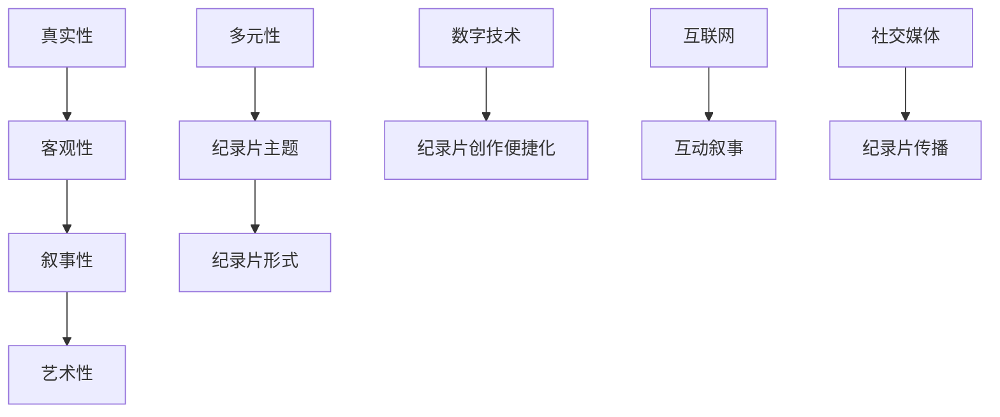

                 


### **一、引言**

纪录片作为一种独特的影视艺术形式，始终以其真实、客观、深入的特点受到广大观众的喜爱。从最早的黑白纪录片到现在的超高清影像，纪录片的发展不仅反映了科技进步，也体现了人类对真实世界的探索与认知。本文旨在探讨纪录片创作的意义，通过影像记录真实生活，引发我们对现实世界的深度思考。

**关键词**：纪录片，影像记录，真实生活，真实再现，艺术探索，社会责任

**摘要**：
本文将首先概述纪录片的历史与演变，探讨纪录片创作的基本原则和技术基础。随后，文章将深入分析纪录片创作中的真实再现，包括拍摄对象的选定与关系建立，场景选择与气氛营造。接着，我们将探讨纪录片创作的艺术探索，包括主题深度挖掘与情感表达，纪录片的创新与实验。最后，本文将通过实践案例和反思，探讨纪录片创作的现状与未来发展。

### **二、纪录片的历史与演变**

纪录片的历史可以追溯到19世纪末，随着电影技术的诞生而逐渐形成。最早的纪录片多以记录历史事件、自然现象和人类活动为主，比如美国著名导演弗拉哈迪的《北方的纳努克》就是一部反映爱斯基摩人生活的纪录片。这一时期的纪录片往往以写实为主，强调记录的真实性和客观性。

随着时间的推移，纪录片的风格和主题逐渐多样化。20世纪初，法国的电影先锋派导演如让·雷诺阿和让·维果开始探索纪录片的叙事性和表现力。他们的作品《夜曲》和《风》等不仅记录了真实的生活场景，还通过艺术加工和叙事技巧，展现了人物的内心世界和社会现实。

进入20世纪中叶，随着电视的普及，纪录片开始走向大众。美国公共广播公司（PBS）和英国广播公司（BBC）等媒体机构制作了大量高质量的纪录片，如《美国小镇》和《地球脉动》等，这些作品不仅展示了世界各地的自然风光和人文景观，还通过深入的调查和报道，揭示了社会问题和人性的复杂。

近年来，数字技术和互联网的发展为纪录片创作带来了新的机遇。高清摄像设备、非线性编辑软件和社交媒体平台使得纪录片创作更加便捷和多样。纪录片的形式也从传统的线性叙事转向更加灵活的互动叙事，观众可以参与到纪录片的制作和传播过程中。

**核心概念与联系**

纪录片的发展历程可以总结为以下几个核心概念：

1. **真实性与客观性**：纪录片强调记录的真实性和客观性，这是其区别于虚构电影的重要特征。
2. **叙事性与艺术性**：随着纪录片的发展，叙事性和艺术性逐渐受到重视，纪录片的制作不再只是简单的记录，而是通过叙事技巧和艺术手法，深入挖掘和表现主题。
3. **多元性**：纪录片的主题和形式日益多元化，从早期的自然和人类生活记录，到后来的社会调查和问题揭示，纪录片逐渐成为反映现实、关注社会的重要手段。

为了更清晰地展现这些概念之间的关系，我们可以使用Mermaid流程图来表示：



通过这个流程图，我们可以看到纪录片从历史演变中不断发展的过程，以及各个核心概念之间的相互联系。

### **三、纪录片创作的基本原则**

纪录片创作的基本原则主要体现在真实性、艺术性和技术性三个方面。首先，真实性是纪录片的灵魂，要求创作者在拍摄过程中保持客观、真实地记录生活。其次，艺术性强调通过叙事技巧和表现手法，使纪录片更具吸引力和感染力。最后，技术性则是确保纪录片拍摄、剪辑和后期制作等环节的高质量。

#### **真实性**

真实性是纪录片创作的核心原则，要求创作者在记录真实事件和生活场景时，不能有虚构或歪曲。真实性的实现需要创作者具备敏锐的观察力和深刻的洞察力，能够准确地捕捉到生活的细节和人物的真实情感。例如，在拍摄《美国小镇》时，导演需要深入小镇的各个角落，与当地居民建立信任关系，才能获取到真实的生活场景和故事。

**核心算法原理讲解**

为了更好地理解真实性的实现，我们可以使用伪代码来描述纪录片拍摄的基本流程：

```plaintext
function record_documentary(subject, location, time_frame):
    initialize camera and recording equipment
    establish trust and relationship with the subject
    observe and record daily life events and interactions
    handle unexpected situations and adapt to changing circumstances
    collect audio and video data
    ensure the authenticity and accuracy of the recorded material
    return edited documentary film
```

**数学模型和公式**

在纪录片拍摄过程中，还可以运用一些数学模型和公式来评估真实性的实现程度。例如，可以通过统计分析记录的数据，判断事件发生的概率和频率，从而评估真实性的高低。

$$
P(A|B) = \frac{P(B|A) \cdot P(A)}{P(B)}
$$

其中，$P(A|B)$ 表示在事件 $B$ 发生的条件下，事件 $A$ 发生的概率。这个公式可以用于分析记录的数据，判断事件的真实性和可信度。

**详细讲解与举例说明**

假设我们拍摄一部关于农村生活的纪录片，需要记录农民的日常工作和生活。在拍摄过程中，我们可能会遇到以下情况：

1. **天气变化**：突然下雨，需要立即调整拍摄计划，避免拍摄到模糊的画面。
2. **突发事件**：如村民突遇疾病，需要及时记录，并在后续的剪辑中突出这个事件的重要性。

通过这些情况的处理，我们可以确保记录的内容是真实和可信的。

#### **艺术性**

艺术性是纪录片的魅力所在，它要求创作者不仅要有记录真实的能力，还要有表现真实的能力。通过叙事技巧、视觉艺术和音乐等元素，使纪录片更具吸引力和感染力。例如，在拍摄《地球脉动》时，导演通过巧妙的剪辑和视觉特效，将观众带入到地球的奇妙世界中，感受到自然的壮丽和生命的奇迹。

**核心算法原理讲解**

为了更好地理解艺术性的实现，我们可以使用伪代码来描述纪录片叙事的基本流程：

```plaintext
function narrative_documentary(subject, theme, time_frame):
    identify the central narrative theme
    construct a narrative structure with a beginning, middle, and end
    incorporate visual and auditory elements to enhance the narrative
    use creative techniques such as slow motion, time-lapse, and visual effects
    synchronize the narrative with the audio track to create a cohesive story
    edit the raw footage to create a polished final product
    return the finished documentary film
```

**数学模型和公式**

在纪录片创作中，艺术性的实现也可以通过数学模型来分析。例如，可以通过分析观众的情感反应，评估叙事和视觉元素对观众的影响。

$$
E(A|B) = \int A(B) \cdot P(B) \, dB
$$

其中，$E(A|B)$ 表示在条件 $B$ 下，事件 $A$ 的期望值。这个公式可以用于分析观众的情感反应，评估艺术性的实现效果。

**详细讲解与举例说明**

假设我们创作一部关于环保的纪录片，主题是气候变化对地球的影响。在叙事过程中，我们可以通过以下方式增强艺术性：

1. **视觉特效**：使用慢动作和高清影像，展示极地冰盖融化的过程，让观众感受到气候变化的严重性。
2. **音乐和声音**：使用自然音效和悲怆的音乐，营造一种紧迫感和使命感，引导观众思考环保问题。

通过这些手法，我们可以使纪录片更加艺术化，增强其感染力。

#### **技术性**

技术性是纪录片创作的基础，包括拍摄、剪辑和后期制作等环节。高质量的影像和音频效果是纪录片成功的关键。随着数字技术的发展，摄像设备、非线性编辑软件和特效技术等不断进步，为纪录片创作提供了更多的可能性。

**核心算法原理讲解**

为了更好地理解技术性的实现，我们可以使用伪代码来描述纪录片制作的基本流程：

```plaintext
function technical_documentary filming(subject, location, time_frame):
    select appropriate camera equipment and accessories
    plan the shooting schedule and shot list
    conduct rehearsals and pre-shooting preparations
    capture high-quality video and audio data
    synchronize the audio and video tracks during recording
    handle technical issues such as lighting, focus, and sound
    return raw footage and audio files
```

**数学模型和公式**

在纪录片制作过程中，技术性的实现也可以通过数学模型来分析。例如，可以通过信号处理技术，优化音频和视频的清晰度和音质。

$$
S/N = 20 \cdot \log_{10}\left(\frac{S}{N}\right)
$$

其中，$S/N$ 表示信噪比，$S$ 表示信号功率，$N$ 表示噪声功率。这个公式可以用于评估音频和视频的质量。

**详细讲解与举例说明**

假设我们制作一部关于城市交通的纪录片，需要记录繁忙路口的车辆和行人。在拍摄过程中，我们可以通过以下方式确保技术性：

1. **摄像设备**：选择具有高帧率和高清分辨率的摄像机，确保记录的影像清晰。
2. **灯光**：使用专业灯光设备，确保拍摄场景的亮度均匀，避免过曝或欠曝。
3. **音频**：使用高质量的麦克风和音频设备，捕捉清晰的对话和环境音效。

通过这些技术手段，我们可以确保纪录片的制作质量。

### **四、纪录片创作中的真实再现**

真实再现是纪录片创作的重要环节，它涉及到拍摄对象的选定与关系建立，场景选择与气氛营造，以及纪录片中的真实再现与艺术加工。以下将详细探讨这些方面。

#### **拍摄对象的选定与关系建立**

拍摄对象的选定是纪录片创作的第一步，也是关键的一步。选择合适的拍摄对象能够确保纪录片的真实性和吸引力。通常，拍摄对象的筛选标准包括以下几个方面：

1. **代表性**：选择具有代表性的人物或事物，能够反映出社会现象或问题的普遍性。
2. **典型性**：选择具有典型性的人物或事物，能够生动地展现特定群体的生活状态和价值观。
3. **易接触性**：选择易于接触和沟通的对象，有利于建立良好的合作关系，确保记录的真实性。

在选定拍摄对象后，建立良好的关系是确保纪录片成功的关键。这需要创作者具备良好的沟通技巧和同理心，与拍摄对象建立信任关系。例如，在拍摄一部关于农村生活的纪录片时，导演需要与农民建立长期的联系，了解他们的日常生活和情感状态，以便在拍摄过程中更好地捕捉真实的生活场景。

**保护拍摄对象的隐私与权益**

在纪录片创作中，保护拍摄对象的隐私与权益是至关重要的。创作者需要遵循以下几个原则：

1. **事先告知**：在拍摄前，应向拍摄对象明确告知拍摄的目的、内容、时间和地点，确保他们了解并同意参与拍摄。
2. **尊重隐私**：在拍摄过程中，应尽量避免侵犯拍摄对象的隐私，特别是涉及个人隐私的场景和对话。
3. **知情同意**：对于涉及敏感内容和可能给拍摄对象带来不良影响的场景，应征得拍摄对象的知情同意。
4. **后续跟进**：在纪录片完成后，应与拍摄对象进行沟通，了解他们的看法和反馈，确保他们的权益得到尊重和保护。

**场景选择与气氛营造**

场景选择是纪录片创作中的重要环节，它关系到纪录片的真实性和感染力。选择合适的场景能够更好地展现拍摄对象的日常生活和情感状态，增强纪录片的真实感。

1. **场景的代表性**：选择具有代表性的场景，能够反映出拍摄对象的生活环境和生活方式，增加纪录片的可信度。
2. **场景的真实性**：选择真实的场景，避免过度虚构或装饰，确保纪录片的真实性和客观性。
3. **场景的多样性**：选择多样的场景，能够展现拍摄对象生活的丰富多彩，增加纪录片的吸引力。

在场景选择的基础上，气氛营造也是纪录片创作中不可或缺的一环。通过光影、色彩、音乐等元素，可以营造出不同的气氛，增强纪录片的感染力。

**气氛营造的原则**：

1. **与主题相契合**：气氛应与纪录片的主题和情感基调相契合，增强主题的表达力。
2. **真实与艺术性相结合**：在保持真实的基础上，适度运用艺术手法，营造独特的视觉和情感氛围。
3. **节奏的控制**：通过节奏的变化，营造出紧张、舒缓、激动的不同氛围，增强观众的观看体验。

**场景的真实再现与艺术加工**

在纪录片创作中，场景的真实再现是基础，艺术加工是提升。通过真实再现和艺术加工，可以更好地展现拍摄对象的生活状态和内心世界。

1. **真实再现**：通过实地拍摄，真实记录拍摄对象的生活场景，确保纪录片的真实性和客观性。
2. **艺术加工**：在真实再现的基础上，适度运用剪辑、音乐、特效等艺术手法，增强纪录片的吸引力和感染力。

**案例分析**：

以纪录片《北方的纳努克》为例，导演弗拉哈迪通过实地拍摄，真实再现了爱斯基摩人的生活场景，展现了他们的生活方式和生存智慧。同时，通过巧妙的剪辑和音乐，增强了纪录片的情感表达和艺术性，使观众深刻感受到北方的严酷和美丽。

### **五、纪录片创作的艺术探索**

纪录片创作不仅要求真实记录生活，更需要在艺术上进行深度探索。这一部分将讨论主题深度挖掘与情感表达、纪录片的创新与实验，以及纪录片与多媒体的结合。

#### **主题深度挖掘与情感表达**

纪录片的主题深度挖掘是创作过程中的关键环节。创作者需要通过细致的观察和深入的思考，挖掘出生活背后的深层意义。例如，在纪录片《美国工厂》中，导演柯切托娃通过深入挖掘美国工人因工厂关闭而失业的故事，揭示了全球化背景下的社会问题和人性的复杂性。

情感表达是纪录片艺术性的体现。通过叙事技巧和表现手法，创作者可以将情感融入影像之中，触动观众的心灵。在纪录片《四个春天》中，导演陆庆屹通过细腻的镜头和感人的音乐，展现了他父母在平凡生活中的爱与坚持，让观众在欢笑和泪水中共鸣。

**情感表达的技巧**：

1. **细腻的镜头语言**：通过微距镜头、慢动作等手法，捕捉生活中的细节，增强情感的感染力。
2. **音乐的融入**：选择合适的音乐，与画面形成共鸣，增强情感的张力。
3. **叙事节奏的控制**：通过节奏的变化，营造出紧张、舒缓、激动的不同情感氛围。
4. **人物心理的展现**：通过对话、内心独白等手法，揭示人物内心的矛盾和情感变化。

#### **纪录片的创新与实验**

纪录片的创新与实验是推动纪录片艺术发展的重要动力。创作者通过探索新的形式和手法，不断打破传统纪录片的边界。例如，纪录片《穿越的编年史》采用了交互叙事的方式，观众可以通过选择不同的路径，体验不同的人生故事。

实验性纪录片的创作通常需要创作者具备较高的艺术素养和技术能力。他们可能在叙事结构、拍摄手法、剪辑方式等方面进行大胆尝试。例如，纪录片《私人定制》通过非线性叙事和虚拟现实技术，将观众带入一个充满奇幻色彩的故事世界。

**新形式纪录片的探索**：

1. **交互叙事**：通过互动技术，让观众参与到纪录片的故事中，改变叙事的走向和结局。
2. **多媒体结合**：将纪录片与网络、游戏、艺术装置等多种媒介结合，创造出全新的叙事形式和体验。
3. **跨界合作**：与文学、音乐、戏剧等艺术形式进行跨界合作，丰富纪录片的内涵和表现形式。

#### **纪录片与多媒体的结合**

随着数字技术的发展，纪录片与多媒体的结合成为趋势。这种结合不仅扩大了纪录片的传播渠道，也提升了纪录片的互动性和参与感。

**纪录片与多媒体的结合方式**：

1. **网络平台**：通过社交媒体、视频网站等网络平台，扩大纪录片的观众群体，实现即时互动和反馈。
2. **虚拟现实（VR）**：通过VR技术，让观众沉浸到纪录片场景中，体验前所未有的视觉冲击和情感共鸣。
3. **增强现实（AR）**：通过AR技术，将纪录片内容与现实世界结合，创造出更加真实和互动的体验。
4. **游戏化叙事**：将纪录片故事融入游戏中，通过游戏方式让观众体验和探索故事情节。

**实际案例分析**：

以纪录片《地球脉动》为例，BBC通过VR技术，让观众可以全方位地体验地球上的自然景观，增强了观众的参与感和沉浸感。同时，通过社交媒体平台，BBC与观众互动，收集观众的反馈和建议，进一步丰富了纪录片的内涵。

### **六、纪录片创作的实践与反思**

纪录片创作的实践是一个不断探索和反思的过程。在这一部分，我们将通过具体案例，分析纪录片创作的实践过程，总结成功经验和遇到的问题，并探讨纪录片创作的未来趋势。

#### **纪录片创作的实践案例**

1. **案例一：深入农村纪录片的创作**

纪录片《乡村里的中国》是一部深入农村生活的纪录片。导演通过长时间的观察和记录，真实地展现了农村生活的各个方面。在创作过程中，导演面临了以下几个挑战：

- **语言沟通障碍**：导演与农民之间存在语言障碍，需要借助当地工作人员进行沟通。
- **生活环境的适应**：农村生活条件相对较差，导演需要适应长时间户外工作和生活。
- **拍摄设备的维护**：在艰苦的农村环境中，拍摄设备容易出现故障，需要及时进行维护。

为了解决这些挑战，导演采取了以下措施：

- **建立信任关系**：与农民建立长期的信任关系，让他们愿意接受拍摄。
- **灵活调整拍摄计划**：根据实际情况灵活调整拍摄计划，避免错过重要的生活场景。
- **设备维护与备份**：提前准备充足的备用设备，确保拍摄过程的顺利进行。

通过这些措施，纪录片《乡村里的中国》成功地展现了农村生活的真实面貌，赢得了观众的认可。

2. **案例二：城市纪录片的社会观察**

纪录片《中国式家庭》是一部关注城市家庭生活的纪录片。导演通过观察和记录不同家庭的生活，揭示了现代社会中家庭关系的复杂性和多样性。在创作过程中，导演遇到了以下问题：

- **隐私保护**：家庭生活具有私密性，如何在不侵犯隐私的前提下进行拍摄，成为一大挑战。
- **情感表达的平衡**：如何在记录真实情感的同时，避免过于戏剧化和矫情。
- **社会敏感话题的处理**：涉及社会敏感话题的拍摄，需要谨慎处理，避免引发争议。

为了解决这些问题，导演采取了以下策略：

- **签订知情同意书**：在拍摄前，与家庭成员签订知情同意书，确保他们的隐私得到保护。
- **情感表达的适度**：通过细腻的镜头语言和情感表达，避免过于戏剧化和矫情。
- **社会话题的平衡**：在处理社会敏感话题时，尽量客观、中立地呈现，避免偏颇和偏见。

通过这些策略，纪录片《中国式家庭》成功地展现了现代城市家庭的生活状态，引发了社会的广泛关注和讨论。

3. **案例三：环境保护纪录片的创作**

纪录片《绿洲》是一部关注环境保护问题的纪录片。导演通过记录沙漠地区的生活和生态状况，揭示了人类活动对环境的破坏。在创作过程中，导演面临了以下挑战：

- **拍摄环境的恶劣**：沙漠地区的自然环境恶劣，拍摄条件艰苦。
- **环境保护的紧迫性**：如何在短时间内记录到真实的环境状况，反映环境保护的紧迫性。
- **资金和资源的限制**：纪录片制作需要大量的资金和资源，如何在有限的条件下完成高质量的拍摄。

为了解决这些问题，导演采取了以下措施：

- **提前准备和培训**：在出发前，对团队成员进行环境适应和拍摄技能的培训。
- **灵活调整拍摄计划**：根据实际情况灵活调整拍摄计划，确保记录到最真实的环境状况。
- **寻求社会支持和合作**：通过向社会机构、企业寻求支持和合作，解决资金和资源的限制。

通过这些措施，纪录片《绿洲》成功地揭示了沙漠地区的生活和生态状况，唤起了公众对环境保护的关注和行动。

#### **纪录片创作的反思**

通过以上案例的分析，我们可以得出以下几点反思：

1. **真实性的挑战与坚守**：纪录片创作需要面对真实性的挑战，如何在保持真实性的同时，避免过度戏剧化和矫情，是创作者需要深思的问题。

2. **情感表达的适度**：纪录片中的情感表达需要适度，既要真实反映人物的情感，又避免过于夸张和矫情，影响观众的共鸣。

3. **社会敏感话题的处理**：纪录片在涉及社会敏感话题时，需要谨慎处理，尽量客观、中立地呈现，避免引发争议。

4. **环境保护的重要性**：环境保护是纪录片创作中的重要主题，如何在记录真实环境状况的同时，唤起公众的环境保护意识，是创作者需要关注的问题。

#### **纪录片创作的未来趋势**

随着科技的进步和社会的发展，纪录片创作也面临着新的机遇和挑战。以下是对纪录片创作未来趋势的展望：

1. **互动叙事的发展**：随着VR、AR等技术的普及，互动叙事将成为纪录片创作的重要趋势。观众将不仅仅是被动的观看者，而可以参与到纪录片的叙事过程中，改变叙事的走向和结果。

2. **多媒体结合的深化**：纪录片与多媒体的结合将进一步深化，通过网络平台、虚拟现实、增强现实等新技术，创造出更加丰富和互动的纪录片体验。

3. **跨领域的合作**：纪录片创作将与其他艺术形式、行业领域进行更加深入的跨领域合作，创造出更多创新性的纪录片作品。

4. **社会责任的加强**：纪录片创作者将更加关注社会问题和公益事业，通过纪录片的形式，传递正能量，推动社会进步。

### **七、总结与展望**

纪录片创作作为一种独特的影视艺术形式，以其真实、客观、深入的特点，在记录和反映现实生活方面发挥了重要作用。本文通过探讨纪录片的历史与演变、创作原则、真实再现、艺术探索、实践与反思，以及未来趋势，深入分析了纪录片创作的各个方面。

真实再现是纪录片创作的基础，通过细致的观察和深入的思考，创作者能够真实地记录和展现生活。艺术探索是纪录片的魅力所在，通过叙事技巧、视觉艺术和音乐等元素，纪录片不仅记录了现实，更展现了生活的丰富和复杂。实践与反思是纪录片创作不断进步的动力，通过具体案例的分析，创作者可以总结经验，改进创作方法。

未来，随着科技的进步和社会的发展，纪录片创作将迎来新的机遇和挑战。互动叙事、多媒体结合、跨领域合作和社会责任将成为纪录片创作的重要趋势。纪录片创作者需要不断探索和创新，以更丰富、更深入的方式记录和反映现实生活，传递真实和正能量。

最后，作为纪录片创作者，我们肩负着记录真实、反映现实、推动社会进步的重要使命。让我们共同努力，用影像记录真实生活，为世界带来更多的感动和思考。**作者：AI天才研究院/AI Genius Institute & 禅与计算机程序设计艺术 /Zen And The Art of Computer Programming**。

