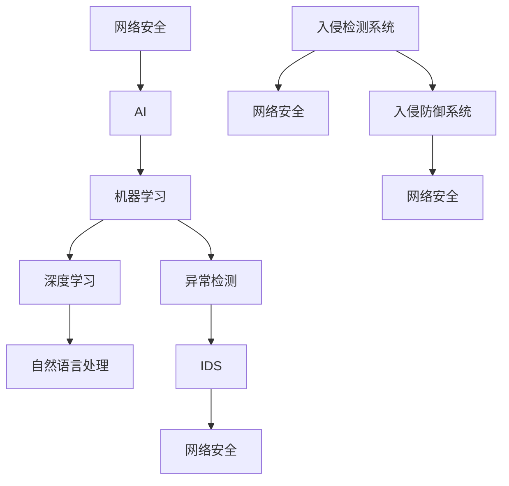

                 

### 文章标题

# 网络安全AI：应对高级持续性威胁

### 关键词

- 网络安全
- 人工智能
- 高级持续性威胁
- APT
- 检测
- 响应
- 防御机制

### 摘要

在当今信息化社会中，网络安全问题日益突出，尤其是高级持续性威胁（APT）对组织的威胁不断升级。本文章旨在探讨如何利用人工智能（AI）技术有效应对APT。首先，我们将回顾网络安全AI的演变历程，介绍其基本概念和技术。接着，深入探讨机器学习、深度学习和强化学习等AI技术如何在网络安全中发挥作用。随后，我们将分析AI在APT检测与响应中的具体应用，并探讨实现AI驱动的APT防御系统的最佳实践。通过本文，读者将全面了解网络安全AI的原理、技术和实际应用，为应对复杂的安全挑战提供有力支持。

## 引言

### 1.1 网络安全AI的演变

网络安全AI的发展历程可以追溯到20世纪90年代末和21世纪初。最初，网络安全主要依赖于防火墙、入侵检测系统（IDS）和入侵防御系统（IPS）等传统工具。这些工具在预防常见攻击和阻止恶意流量方面发挥了重要作用，但随着网络攻击的复杂性和多样性增加，传统方法逐渐显得力不从心。

随着计算机技术的发展，特别是人工智能的兴起，网络安全领域迎来了新的机遇。机器学习、深度学习和强化学习等技术被引入到网络安全中，使得系统不仅能够识别已知的攻击模式，还能自动检测和应对未知威胁。这一转变标志着网络安全AI的开始，为应对高级持续性威胁（APT）等复杂攻击提供了新的解决方案。

### 1.2 AI在现代网络安全中的角色

在现代网络安全中，AI技术扮演着多重关键角色。首先，AI能够通过分析大量的网络安全数据，快速识别异常行为和潜在威胁。这种能力使得AI成为网络入侵检测系统（NIDS）和入侵防御系统（NIPS）的理想选择。其次，AI技术可以帮助组织实现自动化响应，减少安全事件响应时间，提高应对效率。此外，AI还能够对攻击者行为进行预测和模拟，从而设计出更为有效的防御策略。

总之，网络安全AI不仅提升了检测和响应的效率，还为网络安全防御体系带来了深刻的变革。通过结合AI技术，组织能够更加主动地应对日益复杂的网络威胁，确保其信息系统的安全稳定。

### 1.3 高级持续性威胁（APT）

高级持续性威胁（Advanced Persistent Threat，APT）是一种具有高度隐蔽性和长期潜伏性的网络攻击形式。APT攻击者通常具备高超的技术能力，通过精心策划和持续不断的方式进行攻击。APT攻击的主要目标是获取机密信息、破坏关键系统或控制重要资源。

APT攻击的典型特征包括：

1. **长期潜伏**：APT攻击者通常会长时间潜伏在目标网络中，以逃避检测和追踪。
2. **隐蔽性**：攻击者使用高级的隐蔽技术，如混淆代码、网络加密和隐蔽通道，以隐藏其活动。
3. **针对性**：APT攻击通常针对特定组织或个人，攻击者会深入研究目标网络的结构和弱点。
4. **多阶段攻击**：APT攻击通常分为多个阶段，每个阶段都有不同的目标和策略，以逐步实现最终目标。
5. **多层次利用**：APT攻击者会利用多个漏洞和漏洞利用工具，逐步扩大其在目标网络中的权限和影响力。

APT攻击对组织的威胁非常严重，可能导致以下后果：

1. **信息泄露**：APT攻击可能导致机密信息、知识产权和客户数据的泄露。
2. **业务中断**：APT攻击可能导致关键系统的破坏和业务中断，给组织带来巨大的经济损失。
3. **声誉受损**：APT攻击可能导致组织声誉受损，影响其业务运营和市场地位。
4. **法律风险**：APT攻击可能导致组织面临法律风险，如数据保护法规的违规。

因此，理解和应对APT攻击对于组织的网络安全至关重要。利用AI技术可以大大提升APT检测和响应的效率，降低APT攻击带来的风险。

### 基本概念与联系

在深入探讨网络安全AI之前，有必要明确一些核心概念，并分析它们之间的关系架构。以下是一些关键术语及其相互关系：

1. **网络安全**：网络安全是保护计算机网络和系统免受未经授权的访问、使用、披露、破坏、修改或破坏的过程。它包括硬件、软件、网络设备和数据。
2. **人工智能**：人工智能（AI）是指使计算机系统能够执行通常需要人类智能的任务的技术。这包括机器学习、深度学习、自然语言处理和计算机视觉等子领域。
3. **机器学习**：机器学习是AI的一个分支，涉及开发算法使计算机系统能够从数据中学习并做出预测或决策。
4. **深度学习**：深度学习是机器学习的一种形式，通过构建多层神经网络模拟人类大脑的学习过程，用于处理复杂数据。
5. **异常检测**：异常检测是一种用于识别数据中的异常或非预期模式的监控技术。在网络安全中，异常检测用于识别潜在的安全威胁。
6. **入侵检测系统（IDS）**：入侵检测系统是一种监控网络流量和系统活动的工具，用于识别和响应潜在的安全威胁。
7. **入侵防御系统（IPS）**：入侵防御系统是一种主动防御工具，用于在检测到潜在威胁时自动采取行动，如阻断恶意流量或隔离受感染的系统。

这些概念之间的关系可以通过以下Mermaid流程图展示：



通过这个流程图，我们可以看出网络安全AI如何结合不同的AI技术（如机器学习和深度学习）来增强入侵检测和防御能力。机器学习和深度学习通过分析大量数据，可以识别出正常行为与异常行为之间的差异，从而提升异常检测的准确性。入侵检测系统和入侵防御系统则利用这些检测技术来监控和响应潜在的网络威胁。

这种结合不仅提高了网络安全系统的自动化和智能水平，还使其能够更迅速地响应复杂和持续性的攻击，如高级持续性威胁（APT）。总的来说，网络安全AI通过这些核心概念和技术的协同作用，为现代网络安全提供了强大的防护能力。

### 核心算法原理讲解

#### 2.1 机器学习在网络安全中的应用

机器学习（Machine Learning, ML）是网络安全AI的核心技术之一。它通过从数据中学习模式，使计算机系统能够识别和预测潜在威胁。以下是机器学习在网络安全中的主要应用和算法原理。

**1. 监督学习（Supervised Learning）**

监督学习是机器学习的一种形式，它通过训练数据集来建立模型，然后使用该模型对新数据进行预测。在网络安全中，监督学习主要用于分类和回归任务。

**算法原理：**
- **分类任务**：分类算法将数据点分配给不同的类别。在网络安全中，分类算法可以用于检测恶意流量、恶意软件等。
- **回归任务**：回归算法预测数据点的数值。在网络安全中，回归算法可以用于预测网络带宽、流量模式等。

**常用算法：**
- **支持向量机（SVM）**：SVM是一种强大的分类算法，它通过找到一个最佳的超平面来分隔不同类别的数据点。
- **决策树（Decision Tree）**：决策树通过一系列条件分支来对数据点进行分类。
- **随机森林（Random Forest）**：随机森林是由多个决策树组成的集成模型，通过投票决定最终分类。

**伪代码示例：**
```python
# SVM分类算法伪代码
def SVMClassifier(X_train, y_train):
    # 训练SVM模型
    model = train_svm(X_train, y_train)
    # 预测新数据
    predictions = model.predict(X_test)
    return predictions
```

**2. 无监督学习（Unsupervised Learning）**

无监督学习不依赖于已标记的训练数据，而是通过发现数据中的结构或模式来进行数据挖掘。在网络安全中，无监督学习主要用于异常检测和聚类分析。

**算法原理：**
- **聚类分析**：聚类算法将数据点划分为多个群组，使得同一群组内的数据点彼此相似，而不同群组内的数据点差异较大。
- **异常检测**：异常检测算法用于识别数据中的异常值或异常模式，这些模式可能表示潜在的安全威胁。

**常用算法：**
- **K-均值聚类（K-Means Clustering）**：K-均值聚类是一种基于距离的聚类算法，它将数据点分配到K个簇中心。
- **孤立森林（Isolation Forest）**：孤立森林是一种基于随机森林的异常检测算法，它通过随机选择特征和分割数据点来构建孤立树。

**伪代码示例：**
```python
# K-均值聚类算法伪代码
def KMeansClustering(X, k):
    # 初始化簇中心
    centroids = initialize_centroids(X, k)
    while not_converged(centroids):
        # 计算新簇中心
        centroids = update_centroids(X, centroids)
        # 分配数据点到簇
        clusters = assign_clusters(X, centroids)
    return clusters
```

**3. 强化学习（Reinforcement Learning）**

强化学习是一种通过奖励机制来训练模型的方法，它使模型能够从交互中学习。在网络安全中，强化学习可以用于自动化响应和自适应防御策略。

**算法原理：**
- **Q-学习**：Q-学习是一种基于值函数的强化学习算法，它通过更新Q值来学习最佳动作策略。
- **深度Q网络（DQN）**：DQN是一种结合深度学习和Q学习的算法，它使用神经网络来表示Q值函数。

**伪代码示例：**
```python
# Q-学习算法伪代码
def QLearning(state, action, reward, next_state, alpha, gamma):
    # 更新Q值
    Q[state, action] = Q[state, action] + alpha * (reward + gamma * max(Q[next_state, :]) - Q[state, action])
    return Q
```

通过这些算法，机器学习在网络安全中提供了强大的工具，使得系统能够自动识别和响应威胁，提高检测和响应的效率。在实际应用中，结合多种机器学习算法和模型，可以构建更为智能和高效的网络安全系统。

### 深度学习在网络安全中的应用

深度学习（Deep Learning, DL）是机器学习的一个分支，通过构建多层神经网络（Neural Networks）来模拟人类大脑的学习过程。近年来，深度学习在网络安全领域取得了显著的进展，为检测和防御高级持续性威胁（APT）提供了强大的工具。

#### 1. 神经网络的基础

神经网络由多个层组成，包括输入层、隐藏层和输出层。每个层由多个节点（或称为神经元）组成，这些节点通过权重（weights）和偏置（bias）进行连接。

**算法原理：**
- **输入层**：接收输入数据，并将其传递到下一层。
- **隐藏层**：对输入数据进行处理，并通过激活函数（activation function）增加非线性。
- **输出层**：生成最终的输出结果。

**常用的激活函数：**
- **Sigmoid函数**：将输入映射到（0, 1）范围内，用于二分类问题。
- **ReLU函数**：常用于隐藏层，可以加速训练并减少梯度消失问题。
- **Tanh函数**：将输入映射到（-1, 1）范围内。

**伪代码示例：**
```python
# 神经网络前向传播伪代码
def forward_pass(input_data, model):
    current_input = input_data
    for layer in model.layers:
        # 前向传播通过每一层
        current_input = layer.forward(current_input)
    return current_input
```

#### 2. 卷积神经网络（CNNs）在网络安全中的应用

卷积神经网络（Convolutional Neural Networks, CNNs）是一种特别适用于处理图像数据的深度学习模型，其基本单元是卷积层（Convolutional Layers）。CNNs通过卷积操作和池化操作来提取图像特征，并在隐藏层之间传递。

**算法原理：**
- **卷积层**：通过卷积操作提取图像的局部特征。卷积核（Convolutional Kernel）在图像上滑动，提取特定特征。
- **池化层**：通过最大池化（Max Pooling）或平均池化（Average Pooling）减小数据维度，同时保留重要特征。

**伪代码示例：**
```python
# 卷积神经网络前向传播伪代码
def forward_pass_cnn(input_image, model):
    current_input = input_image
    for layer in model.layers:
        if isinstance(layer, ConvLayer):
            current_input = layer.convolve(current_input)
        elif isinstance(layer, PoolLayer):
            current_input = layer.pool(current_input)
    return current_input
```

#### 3. CNNs在网络安全中的应用

CNNs在网络安全中广泛应用于图像和日志数据的分析和分类，如入侵检测、恶意软件识别和异常行为检测。

**应用实例：**
- **入侵检测**：通过分析网络流量图像或日志文件，CNNs可以识别异常流量模式，从而检测潜在的入侵行为。
- **恶意软件识别**：CNNs可以学习恶意软件的图像特征，从而在感染发生前识别并阻止恶意软件。
- **异常行为检测**：通过分析用户行为数据，CNNs可以识别异常行为，从而预防内部威胁和外部攻击。

**实现步骤：**
1. **数据预处理**：收集并预处理网络流量图像或日志数据，包括图像归一化和文本向量化。
2. **模型设计**：设计CNN模型，包括卷积层、池化层和全连接层。
3. **模型训练**：使用标记数据集训练模型，调整模型参数。
4. **模型评估**：使用未标记的数据集评估模型性能，调整模型结构或参数。
5. **部署应用**：将训练好的模型部署到实际网络安全系统中，进行实时监控和威胁检测。

通过深度学习和CNNs的应用，网络安全系统能够更加智能和高效地识别和应对复杂的安全威胁，提高网络防护能力。

### 强化学习在网络安全中的应用

强化学习（Reinforcement Learning, RL）是一种通过奖励机制使代理（agent）在与环境的交互过程中学习最优策略的机器学习方法。在网络安全领域，强化学习因其自主性和适应性而备受关注，能够为自动化响应和安全策略优化提供有效手段。

#### 1. 理解强化学习

**算法原理：**
强化学习主要包括四个关键元素：代理（Agent）、环境（Environment）、状态（State）和动作（Action）。

- **代理**：执行操作并接收环境反馈的智能体。
- **环境**：代理操作的上下文，对代理的动作做出响应。
- **状态**：代理当前所处的环境条件。
- **动作**：代理对当前状态采取的操作。

代理的目标是通过学习，选择最优动作以最大化累积奖励。这一过程通常通过以下步骤进行：

1. **初始状态**：代理在环境中开始，处于某一状态。
2. **执行动作**：代理根据当前状态选择一个动作。
3. **状态转移**：执行动作后，代理的状态发生变化，进入新状态。
4. **获取奖励**：根据新状态和动作，代理获得奖励。
5. **更新策略**：代理利用奖励和历史数据更新其行为策略。

**算法框架：**
- **Q-学习（Q-Learning）**：Q-学习是一种基于值函数的强化学习算法。代理通过更新Q值来学习最优动作策略。
- **深度Q网络（DQN）**：DQN是结合深度学习和Q-学习的算法，使用神经网络表示Q值函数。

**伪代码示例：**
```python
# Q-学习算法伪代码
def QLearning(state, action, reward, next_state, alpha, gamma):
    Q[state, action] = Q[state, action] + alpha * (reward + gamma * max(Q[next_state, :]) - Q[state, action])
    return Q
```

#### 2. 强化学习在网络安全中的应用

强化学习在网络安全中的应用主要包括以下方面：

**自动化响应**：通过强化学习，网络安全系统能够自动生成和优化响应策略，以应对动态威胁。具体应用包括：

- **入侵防御**：代理可以学习如何根据入侵行为的特征和当前网络状态，选择最优防御动作，如流量过滤、隔离受感染的主机等。
- **恶意软件防御**：代理可以学习如何检测和阻止恶意软件，通过识别恶意软件的行为模式，选择最优的防御措施。

**自适应防御策略**：强化学习能够帮助网络安全系统根据不断变化的安全威胁和环境动态调整防御策略，具体包括：

- **动态威胁响应**：代理可以根据最新的威胁情报和攻击模式，实时更新其响应策略，提高防御的时效性和准确性。
- **策略优化**：通过持续学习和优化，代理可以不断改进其防御策略，提高系统整体的防御能力。

**应用实例：**
1. **自动恶意代码检测与响应**：使用Q-学习算法，代理可以学习如何识别恶意代码，并在检测到恶意代码时选择最佳的响应措施。
2. **动态网络流量控制**：代理可以基于强化学习，自动调整网络流量规则，优化网络资源分配，提高网络性能和安全性。

**实现步骤：**
1. **环境建模**：定义代理操作的上下文和状态空间，包括网络流量特征、入侵检测信号等。
2. **策略初始化**：初始化代理的策略参数，如Q值或策略网络。
3. **交互学习**：代理在环境中进行交互，接收奖励并更新策略。
4. **策略评估**：定期评估代理的策略效果，并进行参数调整。
5. **部署应用**：将训练好的策略部署到实际网络安全系统中，进行实时监控和威胁响应。

通过强化学习，网络安全系统能够更加自主和高效地应对复杂多变的网络威胁，提高整体防御能力。强化学习不仅提供了自动化和自适应的威胁响应机制，还为网络安全策略优化提供了新的思路和方法。

### AI在APT检测中的应用

高级持续性威胁（APT）是一种复杂且隐蔽的网络攻击，其目标是长期潜伏在目标系统中，窃取敏感信息或破坏关键系统。为了有效地检测APT，AI技术被广泛应用于异常检测和行为分析，这些技术通过分析大量的网络流量、系统日志和用户行为数据，能够发现潜在的威胁。

#### 1. 异常检测

异常检测（Anomaly Detection）是一种利用统计分析和机器学习技术识别数据中的异常模式或异常行为的方法。在APT检测中，异常检测用于识别与正常行为相比明显偏离的数据。

**算法原理：**
- **统计方法**：基于统计学原理，如均值和方差，识别数据中的异常点。例如，标准偏差方法可以用于检测网络流量中的异常。
- **机器学习方法**：利用机器学习算法，如孤立森林（Isolation Forest）和K-均值聚类（K-Means Clustering），建立正常行为的模型，并识别偏离模型的数据点。

**实现步骤：**
1. **数据收集**：收集网络流量、系统日志和用户行为数据。
2. **特征提取**：从原始数据中提取关键特征，如流量速率、数据包大小、用户操作等。
3. **模型训练**：使用正常行为数据训练异常检测模型。
4. **异常检测**：使用训练好的模型对新的数据进行检测，识别异常行为。

**伪代码示例：**
```python
# 异常检测伪代码
def AnomalyDetection(data, model):
    # 预测新数据是否异常
    predictions = model.predict(data)
    # 返回异常数据
    anomalies = data[predictions == 'anomaly']
    return anomalies
```

#### 2. 行为分析

行为分析（Behavior Analysis）是一种通过监控和分析用户或系统的行为模式来识别潜在威胁的方法。与异常检测不同，行为分析关注的是行为的异常模式，而不是数据本身的异常值。

**算法原理：**
- **统计方法**：通过统计分析用户行为数据，如登录时间、访问频率等，识别与正常行为显著不同的模式。
- **机器学习方法**：使用机器学习算法，如关联规则学习（Association Rule Learning）和图论（Graph Theory），构建用户行为模型，并识别异常模式。

**实现步骤：**
1. **数据收集**：收集用户行为数据，如登录记录、文件访问记录等。
2. **特征提取**：提取关键行为特征，如用户登录时间、访问频率、文件类型等。
3. **模型训练**：使用正常行为数据训练行为分析模型。
4. **行为分析**：使用训练好的模型对新的行为数据进行分析，识别异常行为模式。

**伪代码示例：**
```python
# 行为分析伪代码
def BehaviorAnalysis(data, model):
    # 分析新数据是否存在异常行为模式
    behavior_patterns = model.analyze(data)
    # 返回异常行为模式
    anomalies = behavior_patterns['anomalies']
    return anomalies
```

#### 3. 利用威胁情报

威胁情报（Threat Intelligence）是一种通过收集、分析和共享有关网络威胁的信息，以增强组织防御能力的手段。在APT检测中，利用威胁情报可以提供丰富的上下文信息，帮助识别潜在的APT攻击。

**算法原理：**
- **威胁情报源**：收集来自公开威胁情报源、政府机构、安全公司等的威胁情报数据。
- **数据融合**：将网络流量、系统日志和威胁情报数据进行融合，构建全面的威胁画像。
- **关联分析**：通过关联分析，识别与威胁情报数据相关的异常行为或活动。

**实现步骤：**
1. **威胁情报收集**：从各种渠道收集威胁情报数据，如恶意域名、IP地址、恶意软件签名等。
2. **数据预处理**：对威胁情报数据进行预处理，包括去重、分类和标准化。
3. **数据融合**：将威胁情报数据与网络流量、系统日志数据进行融合，构建威胁画像。
4. **关联分析**：使用机器学习算法进行关联分析，识别与威胁情报相关的异常行为。

**伪代码示例：**
```python
# 利用威胁情报检测APT
def ThreatIntelligenceAPTDetection(traffic_data, threat_data, model):
    # 融合威胁情报和网络流量数据
    fused_data = model.fuse_data(traffic_data, threat_data)
    # 进行关联分析
    threat_anomalies = model.analyze(fused_data)
    return threat_anomalies
```

通过异常检测、行为分析和威胁情报的利用，AI技术能够有效提升APT检测的准确性和效率，为组织提供更加全面的网络安全防护。

### AI驱动的网络安全事件响应

网络安全事件响应（Cybersecurity Incident Response）是指组织在遭受网络攻击或安全事件时，采取的一系列检测、分析和应对措施，以恢复正常运行并减少潜在损害。AI技术在这一过程中发挥了重要作用，能够自动化和优化响应流程，提高应对效率。

#### 1. 自动化响应

自动化响应（Automated Response）是指利用AI技术，使网络安全系统能够自动识别和应对威胁。这一技术通过以下几个方面实现自动化：

**算法原理：**
- **威胁识别**：AI系统通过分析网络流量、系统日志和用户行为数据，自动识别潜在威胁。
- **威胁响应**：系统根据预先设定的策略，自动执行响应措施，如隔离受感染的系统、阻断恶意流量等。

**实现步骤：**
1. **数据收集**：收集网络流量、系统日志和用户行为数据。
2. **特征提取**：提取关键特征，如流量模式、登录行为、文件访问等。
3. **模型训练**：使用历史数据训练自动化响应模型。
4. **自动化执行**：系统自动检测到威胁时，执行预定义的响应措施。

**伪代码示例：**
```python
# 自动化响应伪代码
def AutomatedResponse(model, threat_data):
    # 检测威胁
    threat_detected = model.detect(threat_data)
    if threat_detected:
        # 执行响应措施
        model.execute_response(threat_data)
```

#### 2. 策略优化

策略优化（Policy Optimization）是指利用AI技术动态调整网络安全策略，以应对不断变化的安全威胁。AI系统通过持续学习和分析威胁数据，优化响应策略。

**算法原理：**
- **奖励机制**：系统根据威胁检测和响应的结果，给予模型奖励，促使模型不断优化策略。
- **策略迭代**：系统通过迭代过程，不断调整和优化策略参数。

**实现步骤：**
1. **数据收集**：收集威胁检测和响应数据。
2. **奖励定义**：定义奖励函数，如检测准确率、响应速度等。
3. **策略迭代**：利用强化学习算法，优化策略参数。
4. **策略评估**：评估优化后的策略效果，并进行调整。

**伪代码示例：**
```python
# 策略优化伪代码
def PolicyOptimization(model, data, reward_function):
    while not_converged(model):
        # 训练模型
        model.train(data)
        # 根据奖励函数更新策略
        model.update_policy(reward_function)
    return model
```

#### 3. 应用实例

AI驱动的网络安全事件响应已在多个领域得到应用：

**实例1：自动恶意代码检测与响应**：系统通过机器学习模型自动检测恶意代码，并在检测到恶意行为时，自动隔离受感染的系统并清除恶意软件。

**实例2：动态网络流量控制**：系统通过分析网络流量数据和威胁情报，自动调整防火墙规则和流量过滤策略，以应对网络攻击和威胁。

**实例3：用户行为监控**：系统通过监控用户行为，自动识别异常登录和访问行为，并自动触发警报和响应措施。

通过AI驱动的自动化响应和策略优化，网络安全事件响应能够更加高效和精准，从而有效降低安全事件的负面影响。

### 建立AI驱动的APT防御系统

建立AI驱动的APT防御系统是网络安全领域的一项重要任务，它能够通过自动检测和响应来增强组织对高级持续性威胁（APT）的防御能力。以下是实现这一系统的关键步骤和最佳实践。

#### 1. 设计AI驱动的安全架构

设计一个AI驱动的安全架构是实施AI防护系统的第一步。这一架构应包括以下几个核心组件：

- **数据收集与预处理**：构建一个能够高效收集、存储和处理网络流量的系统，确保所有相关数据都能被AI系统充分利用。
- **机器学习平台**：建立一个强大的机器学习平台，支持数据预处理、模型训练和模型部署。
- **自动化响应系统**：设计一个自动化响应系统，能够根据AI模型的检测结果，自动采取相应的防护措施。

**架构设计步骤：**
1. **数据收集**：确定需要收集的数据类型，包括网络流量、系统日志、用户行为等，并设计数据采集方案。
2. **数据处理**：设计数据预处理流程，包括数据清洗、特征提取和数据标准化，确保数据质量。
3. **机器学习模型**：选择适合的机器学习算法，如深度学习、强化学习等，构建AI模型并进行训练。
4. **模型评估**：使用验证集评估模型的性能，根据评估结果调整模型参数和结构。

#### 2. 集成AI模型与现有安全系统

为了使AI驱动的APT防御系统能够充分发挥作用，需要将其与现有的安全系统（如防火墙、入侵检测系统等）进行集成。以下是集成AI模型的关键步骤：

- **API接口**：设计API接口，使AI模型能够与现有安全系统进行数据交互。
- **数据流**：构建数据流框架，确保数据从采集到处理再到模型预测和响应的全过程高效顺畅。
- **事件处理**：将AI模型检测到的威胁事件与现有安全系统的处理机制进行整合，实现自动化响应。

**集成步骤：**
1. **接口设计**：开发API接口，实现AI模型与现有安全系统的数据交互。
2. **数据流集成**：构建数据流框架，将AI模型集成到现有安全系统中，确保数据流的一致性和连贯性。
3. **事件响应**：定义事件响应流程，将AI模型检测到的威胁事件与现有安全系统的处理机制相结合。

#### 3. 数据隐私与安全

在建立AI驱动的APT防御系统时，数据隐私和安全是一个不可忽视的重要方面。以下是一些最佳实践：

- **数据加密**：对所有敏感数据进行加密存储和传输，确保数据在传输过程中不被窃取。
- **访问控制**：实施严格的访问控制策略，确保只有授权人员才能访问敏感数据。
- **日志记录**：记录所有数据访问和操作日志，以便在发生安全事件时进行溯源和审计。

**数据隐私与安全步骤：**
1. **加密存储**：使用加密算法对敏感数据进行存储，确保数据在存储过程中安全。
2. **访问控制**：实施访问控制机制，确保只有授权人员能够访问敏感数据。
3. **日志审计**：记录所有数据访问和操作日志，定期进行审计和监控。

#### 4. 持续优化与更新

AI驱动的APT防御系统需要持续优化和更新，以应对不断变化的安全威胁。以下是一些持续优化和更新的策略：

- **定期评估**：定期评估AI模型的性能，根据评估结果调整模型参数和结构。
- **数据扩充**：不断扩充训练数据集，增加不同类型和模式的攻击样本，提高模型的泛化能力。
- **模型更新**：定期更新AI模型，引入新的算法和技术，以应对新的威胁和攻击手段。

**持续优化与更新策略：**
1. **性能评估**：定期对AI模型进行性能评估，识别和解决存在的问题。
2. **数据扩充**：定期收集新的攻击样本，扩充训练数据集，提高模型训练效果。
3. **模型更新**：根据新的威胁情报和攻击趋势，定期更新AI模型，保持其对抗新威胁的能力。

通过上述步骤和最佳实践，组织可以建立高效、可靠的AI驱动的APT防御系统，提高网络安全防护能力，有效应对高级持续性威胁。

### 总结与未来展望

#### 总结

本文深入探讨了网络安全AI在应对高级持续性威胁（APT）中的应用，从基本概念、核心算法到实际应用，全面解析了AI技术如何提升APT检测和响应的效率。通过机器学习、深度学习和强化学习等算法，AI技术能够实现自动化威胁检测和响应，提高网络安全系统的智能化和自适应能力。此外，本文还介绍了如何设计AI驱动的APT防御系统，包括架构设计、系统集成、数据隐私与安全等方面的最佳实践。

#### 未来展望

未来，网络安全AI领域将继续快速发展，以下是一些可能的研究方向和趋势：

1. **增强实时性**：提高AI模型对实时数据的处理能力，实现毫秒级的威胁检测和响应。
2. **跨领域融合**：将AI与其他技术（如区块链、物联网等）相结合，构建更加综合的网络安全体系。
3. **对抗性攻击防御**：研究对抗性攻击防御技术，提高AI模型对恶意干扰的鲁棒性。
4. **隐私保护**：进一步研究如何在保护用户隐私的同时，充分利用大数据进行威胁检测和响应。
5. **全球化协作**：通过全球化协作，共享威胁情报和最佳实践，提升全球网络安全水平。

总之，随着技术的不断进步，网络安全AI将在未来发挥越来越重要的作用，为组织提供更强大的安全防护能力。

### 最佳实践 Tips

在构建AI驱动的APT防御系统时，以下是一些最佳实践和注意事项，有助于提升系统的效能和可靠性：

1. **数据质量至关重要**：确保收集到的数据是准确、完整和有代表性的。高质量的数据是训练强大AI模型的基础。
2. **模型持续更新**：定期更新AI模型，以适应新的威胁环境和攻击手段。保持模型与实际威胁的同步是关键。
3. **监控和审计**：实施严格的监控和审计机制，确保AI系统的运行安全和数据隐私。实时监控系统的行为和性能，及时识别和解决潜在问题。
4. **多方合作**：与其他组织、安全社区和政府机构共享威胁情报和最佳实践。全球化协作有助于提升整体网络安全水平。
5. **风险评估**：定期进行风险评估，识别系统中的潜在漏洞和弱点，并采取相应的防护措施。
6. **人员培训**：对相关人员进行AI和网络安全技术的培训，确保他们能够理解和有效利用AI驱动的防御系统。
7. **持续学习和改进**：不断从实际操作和反馈中学习，持续改进系统的性能和效果。通过不断的迭代和优化，提升系统的防御能力。

通过遵循这些最佳实践，组织可以更好地利用AI技术，构建高效、可靠的APT防御系统，确保其网络安全。

### 文章小结

本文系统地介绍了网络安全AI在应对高级持续性威胁（APT）中的应用。首先，回顾了网络安全AI的演变历程及其在现代社会网络安全中的角色。接着，详细探讨了机器学习、深度学习和强化学习等核心算法在网络安全中的应用原理。随后，分析了AI在APT检测和响应中的具体应用，并通过实际案例展示了AI驱动的APT防御系统的构建方法和最佳实践。最后，文章总结了网络安全AI的核心内容和未来展望，强调了持续学习和改进的重要性。通过本文，读者可以全面了解网络安全AI的原理、技术和应用，为组织提供有力的安全防护方案。

### 拓展阅读

为了深入了解网络安全AI和高级持续性威胁（APT）的防御策略，以下是一些推荐的高级书籍、论文和技术报告：

1. **书籍**：
   - 《网络安全：高级威胁与防御策略》（"Cybersecurity: Advanced Threats and Defense Strategies"） by Mark Bowden
   - 《人工智能：一种现代方法》（"Artificial Intelligence: A Modern Approach"） by Stuart J. Russell and Peter Norvig
   - 《深度学习》（"Deep Learning"） by Ian Goodfellow, Yoshua Bengio, and Aaron Courville

2. **论文**：
   - " adversarial examples for machine learning" by Ian Goodfellow et al.
   - "Detecting Advanced Persistent Threats using Deep Learning" by Shiry Ginosar et al.
   - "A Survey on Anomaly Detection in Network Security" by Kostas Petropoulos et al.

3. **技术报告**：
   - 国家网络安全信息中心发布的《高级持续性威胁研究报告》
   - 美国国家安全局（NSA）发布的《人工智能在网络安全中的应用》
   - 国际电信联盟（ITU）发布的《网络安全和人工智能趋势报告》

通过阅读这些资料，读者可以进一步深化对网络安全AI和APT防御的理解，获取前沿的研究成果和实践经验。

