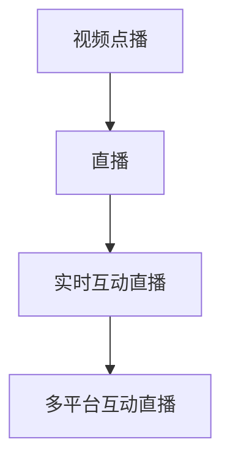
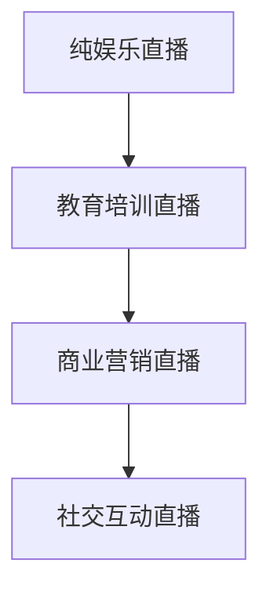
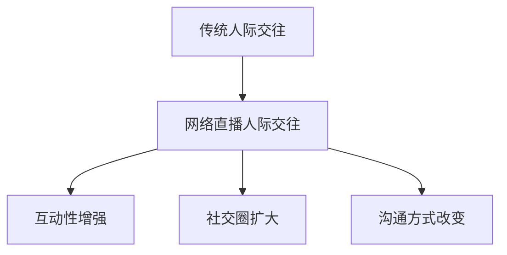
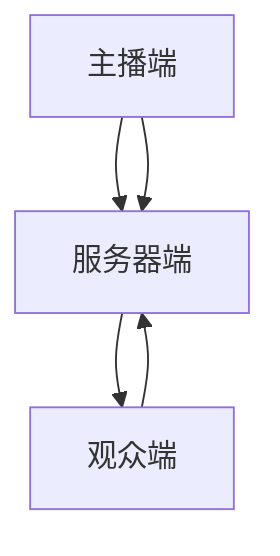
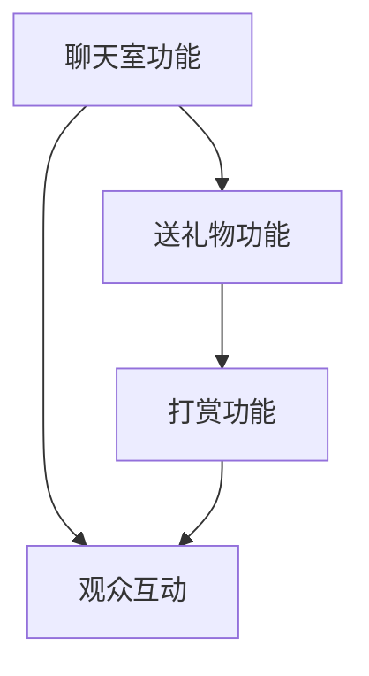
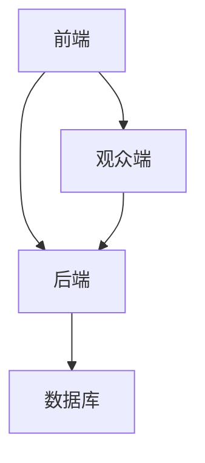

                 

### 文章标题

《网络直播的兴起：人际交往的新形式》

### 文章关键词

网络直播，人际交往，技术原理，数学模型，项目实战

### 文章摘要

随着互联网技术的迅猛发展，网络直播已经成为现代社会中一种重要的交流方式。本文从技术、数学模型和项目实战等多个角度，深入剖析了网络直播的兴起及其对人际交往的新形式带来的影响。通过详细讲解音视频编码技术、实时传输协议和互动功能实现，本文揭示了网络直播的技术原理。同时，借助数学模型，本文探讨了用户行为分析和直播效果评估的方法。最后，通过一个简单的网络直播平台搭建案例，本文展示了从零开始实现网络直播的全过程，并分析了直播互动效果。本文旨在为读者提供一个全面而深入的网络直播技术分析框架，帮助读者更好地理解和应用这一新兴技术。

## 第一部分：网络直播基础

### 第1章 网络直播概述

#### 1.1 网络直播的定义与演变

网络直播，指的是通过互联网实时传输视频和音频内容，使观众能够实时观看和互动的一种网络服务形式。其起源可以追溯到上世纪90年代，随着宽带网络和视频技术的普及，网络直播逐渐从实验室走向了大众。

**核心概念与联系：**

- **定义：** 网络直播是实时传输视频和音频内容的网络服务。
- **演变：** 从视频点播到直播，从简单的视频播放到复杂的互动直播。

**Mermaid 流程图：**



#### 1.2 网络直播的主要形式

网络直播的形式多种多样，主要包括以下几种：

- **纯娱乐直播：** 如游戏直播、才艺表演等。
- **教育培训直播：** 如在线课堂、讲座分享等。
- **商业营销直播：** 如新品发布、促销活动等。
- **社交互动直播：** 如直播聊天、朋友聚会等。

**Mermaid 流程图：**



#### 1.3 网络直播在人际交往中的作用

网络直播改变了传统的人际交往方式，提高了互动性，扩大了社交圈，使人们能够跨越时空限制进行交流。

**核心概念与联系：**

- **互动性：** 网络直播使观众能够实时与主播互动，增强了交流体验。
- **社交圈：** 网络直播扩大了人们的社交圈，使人们能够认识更多志同道合的朋友。
- **人际沟通方式：** 网络直播改变了传统的人际沟通方式，使交流更加直观、实时。

**Mermaid 流程图：**



### 第2章 网络直播技术原理

#### 2.1 音视频编码技术

音视频编码技术是网络直播的核心技术之一，它涉及对视频和音频信号进行压缩和编码，以便在网络中传输。

**核心概念与联系：**

- **音视频信号：** 包括视频信号和音频信号。
- **压缩：** 减少数据量，提高传输效率。
- **编码：** 将模拟信号转换为数字信号。

**伪代码：**

```pseudo
function audioVideoEncoding(videoSignal, audioSignal):
    compressedVideo = videoCompression(videoSignal)
    compressedAudio = audioCompression(audioSignal)
    encodedVideo = videoEncoding(compressedVideo)
    encodedAudio = audioEncoding(compressedAudio)
    return encodedVideo, encodedAudio
```

#### 2.2 实时传输协议

实时传输协议（Real-Time Messaging Protocol，RTMP）是网络直播中常用的传输协议，它提供了一种实时、双向的通信方式，确保直播内容的实时传输。

**核心概念与联系：**

- **实时传输：** 确保直播内容的实时性。
- **双向通信：** 支持观众与主播的实时互动。

**Mermaid 流程图：**



#### 2.3 互动功能实现

网络直播中的互动功能包括聊天室、送礼物、打赏等，这些功能使得观众能够与主播进行实时互动。

**核心概念与联系：**

- **聊天室：** 实现观众与主播之间的实时文字交流。
- **送礼物、打赏：** 提高观众的参与度和互动性。

**Mermaid 流程图：**



### 第3章 数学模型与公式

#### 3.1 用户行为分析模型

用户行为分析是网络直播平台的重要功能，通过分析用户行为，可以了解用户的需求和行为模式。

**核心概念与联系：**

- **用户行为：** 观看时间、点赞、评论等行为。
- **行为模式：** 分析用户行为，发现规律。

**数学模型：**

$$
User\ Activity\ Model = f(User\ Behavior, Viewing\ Time, Like, Comment)
$$

#### 3.2 直播效果评估模型

直播效果评估是衡量直播成功与否的重要指标，通过评估直播的观看量、互动量等指标，可以评估直播的效果。

**核心概念与联系：**

- **直播效果：** 观看量、互动量、用户满意度等。
- **评估指标：** 分析直播的各项指标，评估直播效果。

**数学模型：**

$$
Live\ Effect\ Evaluation = f(观看量, 互动量, 用户满意度)
$$

#### 3.3 数学公式与应用

数学公式在网络直播中的应用非常广泛，从用户行为分析到直播效果评估，都需要使用到数学公式。

**示例：**

$$
User\ Engagement\ Rate = \frac{互动量}{观看量}
$$

### 第4章 网络直播平台搭建

#### 4.1 网络直播平台架构设计

网络直播平台的架构设计是搭建直播平台的第一步，包括前端、后端、数据库等各个环节的设计。

**核心概念与联系：**

- **前端：** 观众端的界面和交互设计。
- **后端：** 直播内容的处理和传输。
- **数据库：** 存储用户数据和直播数据。

**Mermaid 流程图：**



#### 4.2 实现音视频编码与传输

在搭建直播平台时，音视频编码与传输是关键技术之一，需要使用音视频编码技术和实时传输协议。

**核心概念与联系：**

- **音视频编码：** 对视频和音频信号进行压缩和编码。
- **传输协议：** 确保直播内容的实时传输。

**伪代码：**

```pseudo
function liveStreaming(videoSignal, audioSignal, serverAddress):
    encodedVideo, encodedAudio = audioVideoEncoding(videoSignal, audioSignal)
    streamProtocol = selectStreamProtocol(serverAddress)
    send(encodedVideo, encodedAudio, streamProtocol)
```

#### 4.3 互动功能设计与实现

互动功能是网络直播的核心，包括聊天室、送礼物、打赏等功能，需要设计并实现相应的功能模块。

**核心概念与联系：**

- **聊天室：** 实现观众与主播之间的实时文字交流。
- **送礼物、打赏：** 提高观众的参与度和互动性。

**伪代码：**

```pseudo
function chatRoom(user, message):
    sendMessage(user, message)

function giftSend(user, gift):
    updateGiftBalance(user, gift)
    notifyGiftReceived(user, gift)

function rewardSend(user, reward):
    updateRewardBalance(user, reward)
    notifyRewardReceived(user, reward)
```

### 第5章 直播互动效果分析

#### 5.1 用户参与度分析

用户参与度分析是评估直播效果的重要指标，通过分析用户的行为数据，可以了解用户的参与度。

**核心概念与联系：**

- **用户行为：** 观看时间、点赞、评论等行为。
- **参与度：** 分析用户行为，评估用户参与度。

**数学模型：**

$$
User\ Participation\ Rate = \frac{活跃用户数}{总用户数}
$$

#### 5.2 直播效果评估

直播效果评估是衡量直播成功与否的重要标准，通过评估直播的各项指标，可以了解直播的效果。

**核心概念与联系：**

- **直播效果：** 观看量、互动量、用户满意度等。
- **评估指标：** 分析直播的各项指标，评估直播效果。

**数学模型：**

$$
Live\ Effect\ Score = \frac{观看量 + 互动量 + 用户满意度}{3}
$$

#### 5.3 直播互动优化策略

通过分析用户行为数据和直播效果，可以制定相应的优化策略，提高直播互动效果。

**核心概念与联系：**

- **用户行为：** 分析用户行为，发现优化点。
- **优化策略：** 制定优化方案，提高互动效果。

**示例策略：**

- **优化互动环节：** 提供更多互动方式，如投票、弹幕等。
- **提高主播互动性：** 主播需要积极回应观众，提高互动质量。
- **优化直播内容：** 提供高质量、有趣的直播内容，吸引更多观众。

### 第6章 网络直播案例分析

#### 6.1 成功直播案例分析

成功直播案例分析可以帮助我们了解成功直播的秘诀，从而提高我们的直播效果。

**核心概念与联系：**

- **成功直播：** 分析成功直播的要素。
- **案例分析：** 了解成功直播的具体实践。

**案例要素：**

- **直播内容：** 有趣、高质量、富有吸引力。
- **主播魅力：** 主播具备良好的个人魅力和互动能力。
- **互动设计：** 提供丰富的互动方式，增强用户参与度。

#### 6.2 失败直播案例分析

失败直播案例分析可以帮助我们了解失败直播的原因，从而避免在未来的直播中重蹈覆辙。

**核心概念与联系：**

- **失败直播：** 分析失败直播的原因。
- **案例分析：** 了解失败直播的具体原因。

**案例原因：**

- **内容质量低：** 直播内容缺乏吸引力，观众流失。
- **互动不足：** 主播互动不足，观众参与度低。
- **技术问题：** 直播过程中出现技术问题，影响观看体验。

#### 6.3 案例总结与启示

通过对成功和失败直播案例的分析，我们可以得出以下结论和启示：

- **提高直播质量：** 提供高质量、有趣的直播内容，吸引更多观众。
- **优化互动设计：** 提供丰富的互动方式，增强用户参与度。
- **关注用户体验：** 优化直播技术，确保直播过程的顺畅。

### 第7章 网络直播的未来发展趋势

#### 7.1 网络直播的发展趋势

随着技术的不断进步，网络直播将呈现出以下发展趋势：

- **5G时代的来临：** 5G网络的普及将大大提高直播的传输速度和稳定性。
- **VR/AR直播：** 虚拟现实和增强现实技术的应用将使直播更加沉浸式。
- **人工智能应用：** 人工智能技术将在直播中发挥更大的作用，如智能推荐、自动剪辑等。

#### 7.2 网络直播面临的挑战

尽管网络直播有着广阔的发展前景，但同时也面临着一些挑战：

- **内容质量：** 如何保证直播内容的质量是一个重要问题。
- **版权保护：** 如何保护直播内容的版权是一个关键挑战。
- **隐私保护：** 如何保护用户的隐私也是一个重要的课题。

#### 7.3 未来网络直播的发展方向

未来网络直播的发展方向将更加注重用户体验和技术创新：

- **个性化推荐：** 根据用户喜好推荐直播内容，提高用户满意度。
- **互动增强：** 提供更多互动方式，增强用户参与度。
- **技术创新：** 探索新的直播技术，提高直播的体验。

### 附录

#### 附录A 网络直播平台搭建教程

**A.1 开发环境搭建**

- **环境配置：** 配置开发所需的环境，如操作系统、编程语言等。
- **工具安装：** 安装必要的开发工具，如数据库、前端框架等。

**A.2 音视频编码工具使用**

- **编码工具选择：** 选择适合的音视频编码工具，如FFmpeg等。
- **编码流程：** 配置编码参数，执行编码操作。

**A.3 实时传输协议配置**

- **协议选择：** 选择适合的实时传输协议，如RTMP等。
- **配置流程：** 配置传输参数，确保直播内容的实时传输。

#### 附录B 数学模型与算法参考

**B.1 用户行为分析模型参考**

- **用户行为数据收集：** 收集用户观看、点赞、评论等行为数据。
- **行为模式分析：** 分析用户行为模式，发现用户偏好。

**B.2 直播效果评估模型参考**

- **评估指标：** 选择适合的评估指标，如观看量、互动量等。
- **评估方法：** 采用适当的评估方法，计算评估结果。

**B.3 数学公式汇总**

- **用户参与度计算公式：** 用户参与度 = (互动量 / 观看量) * 100%
- **直播效果评估计算公式：** 直播效果评估 = (观看量 + 互动量 + 用户满意度) / 3

### 作者信息

作者：AI天才研究院/AI Genius Institute & 禅与计算机程序设计艺术 /Zen And The Art of Computer Programming

### 结论

网络直播作为一种新兴的交流方式，正在改变着人际交往的形式。通过本文的详细分析，我们了解了网络直播的核心概念、技术原理、数学模型和项目实战，并对网络直播的未来发展趋势进行了展望。希望本文能够为读者提供一个全面而深入的网络直播技术分析框架，帮助读者更好地理解和应用这一新兴技术。让我们共同期待网络直播的精彩未来！
``` 

### 文章结构

为了确保文章的结构清晰、内容丰富且逻辑严密，我们可以按照以下结构组织文章：

#### 文章开头

- **引言**：以引人入胜的方式引入主题，概述网络直播的重要性和本文目的。
- **背景介绍**：简述网络直播的起源和发展历程，以及其在现代社会中的作用。

#### 第一部分：网络直播基础

- **第1章 网络直播概述**：
  - **1.1 网络直播的定义与演变**：介绍网络直播的基本概念，讨论其发展历程和演变趋势。
  - **1.2 网络直播的主要形式**：分类讨论网络直播的多种形式，如娱乐直播、教育直播、商业直播等。
  - **1.3 网络直播在人际交往中的作用**：分析网络直播如何改变人际交往模式，增强互动性和扩大社交圈。

- **第2章 网络直播技术原理**：
  - **2.1 音视频编码技术**：讲解音视频编码的基本原理和常用编码标准。
  - **2.2 实时传输协议**：详细阐述实时传输协议的工作原理和常用协议。
  - **2.3 互动功能实现**：探讨直播平台中的互动功能设计，如聊天室、送礼物等。

- **第3章 数学模型与公式**：
  - **3.1 用户行为分析模型**：介绍用于分析用户行为的数学模型。
  - **3.2 直播效果评估模型**：讨论评估直播效果的方法和指标。
  - **3.3 数学公式与应用**：展示数学公式在直播数据分析中的应用。

#### 第二部分：网络直播应用

- **第4章 网络直播平台搭建**：
  - **4.1 网络直播平台架构设计**：描述直播平台的系统架构和设计原则。
  - **4.2 实现音视频编码与传输**：讲解实现音视频编码和实时传输的技术细节。
  - **4.3 互动功能设计与实现**：详细描述互动功能的实现过程。

- **第5章 直播互动效果分析**：
  - **5.1 用户参与度分析**：分析用户参与度，提供评估用户行为的指标和方法。
  - **5.2 直播效果评估**：评估直播整体效果，讨论关键指标和评估方法。
  - **5.3 直播互动优化策略**：提出优化直播互动效果的策略和建议。

#### 第三部分：网络直播案例分析

- **第6章 网络直播案例分析**：
  - **6.1 成功直播案例分析**：分析成功直播的案例，总结成功因素。
  - **6.2 失败直播案例分析**：分析失败直播的案例，探讨失败原因。
  - **6.3 案例总结与启示**：总结案例中的经验教训，为未来直播提供启示。

#### 第四部分：网络直播的未来发展趋势

- **第7章 网络直播的未来发展趋势**：
  - **7.1 网络直播的发展趋势**：预测网络直播未来的发展方向。
  - **7.2 网络直播面临的挑战**：讨论网络直播面临的技术和社会挑战。
  - **7.3 未来网络直播的发展方向**：展望未来网络直播的创新和应用场景。

#### 附录

- **附录A 网络直播平台搭建教程**：提供搭建网络直播平台的技术教程和步骤。
- **附录B 数学模型与算法参考**：汇总文章中提到的数学模型和算法，提供详细解释和示例。

### 文章结尾

- **结论**：总结文章的主要观点和发现，强调网络直播的重要性和未来发展前景。
- **作者信息**：注明作者单位和作者姓名，提供作者的联系信息。

通过以上结构，文章将能够系统地介绍网络直播的技术原理、应用实践和发展趋势，为读者提供全面而深入的阅读体验。同时，文章的结构也将有助于读者更好地理解网络直播的各个方面，从而为他们在相关领域的研究和应用提供参考。

