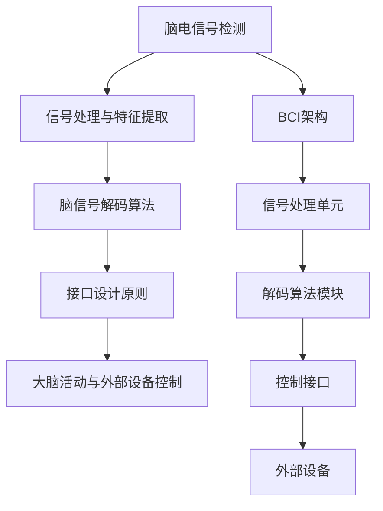

                 

### 脑机接口（Brain-Computer Interface, BCI）的背景介绍

脑机接口（Brain-Computer Interface，简称BCI）是一种直接连接大脑与外部设备的技术，它通过解读大脑信号来实现对设备的控制。这种技术的起源可以追溯到20世纪60年代，当时神经科学家兼生物工程师彼得·卡尔菲尔德（Peter羼菲尔德）首次提出了利用脑电波控制假肢的想法。随着神经科学和计算机技术的不断发展，BCI技术逐渐从实验室研究走向实际应用。

在医疗领域，BCI技术已被广泛应用于脑外伤、中风、肌肉萎缩侧索硬化症（ALS）等疾病患者的康复治疗中。通过BCI，患者能够通过大脑信号控制外部设备，如轮椅、假肢和计算机，从而提高生活质量。此外，BCI还被用于帮助截肢患者恢复触觉感知，以及为听力丧失者提供脑机接口听觉系统。

在军事领域，BCI技术同样具有巨大的潜力。通过BCI，士兵可以在复杂作战环境中通过脑信号快速做出决策，提高作战效能。同时，BCI技术也被用于士兵的心理健康监测，通过分析脑信号变化，提前预警心理压力和应激反应。

除了医疗和军事领域，BCI技术在教育、娱乐、艺术等创意产业中的应用也逐渐受到关注。在教育领域，BCI技术可以辅助特殊需求学生的学习和参与，如通过脑信号控制智能教具进行互动学习。在娱乐领域，BCI技术为虚拟现实（VR）和增强现实（AR）提供了新的交互方式，使用户体验更加沉浸和真实。在艺术创作方面，艺术家利用BCI技术通过脑信号进行绘画、音乐创作和舞蹈表演，创造出独特的艺术形式。

然而，BCI技术的发展也面临一些挑战。首先是如何更精准地解码大脑信号，目前的解码技术仍处于初级阶段，需要进一步提高准确性和稳定性。其次是大脑信号处理的实时性和计算资源消耗，如何优化算法和硬件，使其能够在实际应用中高效运行，仍是一个重要的研究课题。此外，BCI技术的伦理和社会影响也不容忽视，如何确保技术的安全和隐私，避免潜在的滥用风险，是需要全社会共同关注的议题。

总之，脑机接口技术在创意产业中的应用前景广阔，它不仅为艺术家和创意工作者提供了新的工具和方法，也为广大消费者带来了全新的体验和互动方式。随着技术的不断进步和应用的深入，BCI在创意产业中的角色将越来越重要。

### 核心概念与联系

脑机接口（BCI）涉及多个核心概念和技术，这些概念相互联系，构成了BCI技术的核心架构。以下是对这些核心概念及其相互关系的详细解释。

**脑电信号检测（Electroencephalography, EEG）**：脑电信号检测是BCI技术的第一步，通过在头皮表面放置电极来捕捉大脑的电活动。脑电信号是由大脑神经元活动产生的微弱电变化，这些信号可以反映大脑的不同状态和功能。常用的脑电信号检测设备包括电极帽和粘贴式电极，它们可以精确地记录大脑活动的时域和频域信息。

**信号处理与特征提取（Signal Processing and Feature Extraction）**：获取脑电信号后，需要进行信号处理和特征提取。信号处理包括滤波、去噪、放大等步骤，以去除无关信号，提高信号质量。特征提取则是从处理后的信号中提取出能够代表大脑状态的特征参数，如频率、时域特性等。常见的特征提取方法包括时间域特征（如平均绝对值、标准差等）和频域特征（如功率谱、带通滤波等）。

**脑信号解码算法（BCI Decoding Algorithms）**：解码算法是将提取出的特征参数转换为可操作的控制信号的关键步骤。这些算法通常基于机器学习、信号处理和统计方法，包括线性判别分析（LDA）、主成分分析（PCA）、支持向量机（SVM）等。解码算法的目标是最小化错误率，提高控制的准确性和可靠性。

**接口设计原则（Interface Design Principles）**：为了确保BCI系统的有效性和用户体验，接口设计需要遵循一系列原则。这些原则包括易用性、舒适性、稳定性和安全性。易用性要求界面直观、操作简单；舒适性要求设备对用户的侵入性小，不影响正常活动；稳定性要求系统能够在长时间运行中保持高精度和高可靠性；安全性则要求保护用户数据隐私，防止潜在的安全风险。

**大脑活动与外部设备控制之间的联系（Brain Activity and External Device Control）**：BCI系统的最终目标是将大脑活动转换为外部设备的控制信号。这一过程中，需要通过解码算法将脑信号特征映射到具体的设备控制动作上。例如，在游戏控制中，用户可以通过脑信号控制角色的移动和攻击；在艺术创作中，用户可以通过脑信号控制画笔的移动和力度，实现即兴创作。

**脑机接口架构（BCI Architecture）**：为了实现上述功能，BCI系统通常包括几个关键组件：脑电信号采集设备、信号处理单元、解码算法模块、控制接口和外部设备。脑电信号采集设备负责捕捉大脑信号；信号处理单元对信号进行处理和特征提取；解码算法模块将特征参数转换为控制信号；控制接口则将解码结果发送到外部设备，实现控制功能。

**Mermaid 流程图表示核心概念与联系**：



通过上述解释，我们可以看到脑机接口的核心概念和联系构成了一个复杂的系统，每个部分都相互依赖，共同作用，以实现将大脑活动转换为外部设备控制的目标。理解这些核心概念和联系，对于深入研究和应用BCI技术具有重要意义。

### 脑机接口的关键算法原理讲解

脑机接口（BCI）的核心算法是解码大脑信号并将其转换为具体操作的关键。以下是几种常用的BCI解码算法，包括线性判别分析（LDA）、主成分分析（PCA）和深度学习算法。每种算法的原理、应用场景及其伪代码将逐一介绍。

#### 线性判别分析（Linear Discriminant Analysis, LDA）

**原理**：LDA是一种监督学习算法，其目标是找到能够最大程度地区分不同类别的线性投影方向。在BCI中，LDA可以用于分类用户意图，例如区分不同的脑电信号模式。

**应用场景**：LDA适用于具有明显类别区分的任务，如单通道脑电信号分类。

**伪代码**：

```plaintext
输入：训练集 X，标签 y
输出：最佳投影向量 w

初始化：w randomly
for i = 1 to num_iterations do
    计算类内散度矩阵 Sw = Σ(w^T * X * X^T * w) - (1/n) * w^T * Σ * w
    计算类间散度矩阵 Sb = Σ(w^T * X * X^T * w) - (1/n) * Σ * w^T * w
    计算权重向量 w = (Sb^(-1) * Sw)^(-1) * Σ * w
end for
return w
```

#### 主成分分析（Principal Component Analysis, PCA）

**原理**：PCA是一种无监督学习算法，其目标是在高维数据中找到最重要的几个主成分，即最能解释数据变异的特征。在BCI中，PCA可以用于降维和特征提取，提高信号处理的效率和准确性。

**应用场景**：PCA适用于数据降维和特征提取，特别是在处理多通道脑电信号时。

**伪代码**：

```plaintext
输入：数据矩阵 X
输出：主成分向量 w，特征值 λ

计算协方差矩阵 C = (1/n) * X^T * X
计算特征值和特征向量，得到特征分解 C = W * Λ * W^T
排序特征值 λ，并选择最大的 k 个特征值对应的特征向量 w
return w, λ
```

#### 深度学习算法（Deep Learning Algorithms）

**原理**：深度学习算法通过多层神经网络对复杂数据模式进行建模和学习。在BCI中，常用的深度学习算法包括卷积神经网络（CNN）和循环神经网络（RNN）。

**应用场景**：深度学习适用于处理高维、复杂的脑电信号数据，特别是在多通道信号处理和长时间序列分析中。

**伪代码**（以卷积神经网络为例）：

```plaintext
输入：训练集 X，标签 y
输出：权重矩阵 W，偏置 b

初始化：W, b randomly
for i = 1 to num_iterations do
    前向传播：a = ReLU(W * x + b)
    反向传播：dW = (a - y) * a * (1 - a)
    更新权重：W = W - learning_rate * dW
    更新偏置：b = b - learning_rate * dW
end for
return W, b
```

通过上述算法的讲解，我们可以看到BCI解码算法在处理脑电信号方面具有重要作用。LDA、PCA和深度学习算法各自具有独特的优势和适用场景，根据具体应用需求选择合适的算法，可以有效提升BCI系统的性能和用户体验。了解这些核心算法的原理和实现方法，对于深入研究和开发BCI技术具有重要意义。

### 数学模型与公式

在脑机接口（BCI）技术中，数学模型和公式扮演着至关重要的角色，它们不仅帮助我们理解和分析脑电信号，还为算法的实现提供了理论基础。以下将详细讨论BCI信号处理的数学模型，并使用具体的公式和示例进行说明。

#### 线性滤波模型（Linear Filtering Model）

线性滤波模型是信号处理中的一种基本模型，用于去除噪声和提取有用信号。在BCI中，线性滤波模型用于预处理脑电信号，以减少环境噪声和肌肉电干扰。

**公式**：

$$
y(t) = x(t) * h(t)
$$

其中，\( y(t) \)是滤波后的信号，\( x(t) \)是原始信号，\( h(t) \)是滤波器系数。

**示例**：假设我们使用一个低通滤波器去除高频噪声，其滤波器系数为\( h(t) = e^{-t/RC} \)，其中\( R \)是电阻，\( C \)是电容。

#### 神经元响应模型（Neuronal Response Model）

神经元响应模型用于描述神经元对输入信号的响应，它是BCI信号处理的重要基础。神经元响应模型通常采用Sigmoid函数来表示。

**公式**：

$$
f(x) = \frac{1}{1 + e^{-w \cdot x - b}}
$$

其中，\( f(x) \)是神经元响应，\( w \)是权重向量，\( x \)是输入信号，\( b \)是偏置。

**示例**：假设一个神经元接收到的输入信号为\( x = [1, 2, 3]^T \)，权重向量为\( w = [1, 1, 1]^T \)，偏置为\( b = 0 \)，则其响应为：

$$
f(x) = \frac{1}{1 + e^{-1 \cdot 1 - 1 \cdot 2 - 1 \cdot 3}} = \frac{1}{1 + e^{-6}} \approx 0.999
$$

#### 机器学习模型在脑机接口中的应用

在BCI中，机器学习模型被广泛应用于信号分类和特征提取。以下介绍两种常用的机器学习模型：支持向量机（Support Vector Machine, SVM）和决策树（Decision Tree）。

**支持向量机（SVM）**

**公式**：

$$
\min\frac{1}{2}\sum_{i=1}^{n}(w_i^2) + C\sum_{i=1}^{n}\xi_i
$$

其中，\( w_i \)是权重，\( \xi_i \)是松弛变量，\( C \)是惩罚参数。

**示例**：假设我们使用SVM进行脑电信号分类，数据集包含\( n \)个样本，每个样本有\( m \)个特征，则SVM的目标是最小化上述公式，以找到一个最优的超平面，将不同类别的信号分开。

**决策树（Decision Tree）**

决策树是一种树形结构的分类模型，通过一系列规则对数据进行划分。

**公式**：

$$
y = \sum_{i=1}^{n}w_i \cdot x_i + b
$$

其中，\( y \)是输出，\( w_i \)是权重，\( x_i \)是特征，\( b \)是偏置。

**示例**：假设决策树通过一系列特征划分数据，对于某个节点，特征\( x_1 \)的阈值设为\( t_1 \)，则规则为：

$$
y = 
\begin{cases} 
1 & \text{if } x_1 > t_1 \\
0 & \text{otherwise }
\end{cases}
$$

通过上述数学模型和公式的介绍，我们可以看到BCI技术在信号处理和特征提取方面的数学基础。这些模型和公式不仅帮助我们理解和分析脑电信号，还为算法的实现提供了坚实的理论支持。在实际应用中，选择合适的数学模型和优化参数，是提升BCI系统性能的关键。

### 项目实战：脑机接口在创意产业中的应用开发

在本文的第六章，我们将通过一个实际项目案例，详细展示如何将脑机接口（BCI）应用于创意产业，包括开发环境的搭建、源代码实现、代码解读和实际案例的分析与讲解。

#### 项目概述与需求分析

我们的项目目标是利用脑机接口技术，开发一个能够实时将脑电信号转换为音乐创作的应用程序。具体需求如下：

1. **脑电信号采集**：通过EEG设备实时采集用户的脑电信号。
2. **信号预处理**：对采集到的脑电信号进行预处理，包括滤波、去噪和特征提取。
3. **音乐生成**：根据预处理后的脑电信号特征，实时生成音乐旋律和节奏。
4. **用户交互**：提供一个友好的用户界面，让用户能够直观地看到脑电信号的变化，并调整音乐的生成参数。

#### 开发环境搭建

为了实现上述需求，我们需要搭建一个完整的开发环境，包括硬件和软件部分。

**硬件**：
- EEG设备（如NeuroSky MindWave）：用于实时采集用户的脑电信号。
- 计算机或开发板：用于运行信号处理和音乐生成算法。

**软件**：
- Python编程语言：用于实现信号处理和音乐生成算法。
- Matplotlib库：用于可视化脑电信号和处理结果。
- MuseScore：用于生成和播放音乐。

#### 源代码实现与解读

以下是实现脑机接口音乐生成项目的主要代码段及其功能解读。

**1. 脑电信号采集与预处理**：

```python
import numpy as np
import matplotlib.pyplot as plt
from neuropy import EEG

# 初始化EEG设备
eeg = EEG(device='MindWave')

# 获取脑电信号
data = eeg.record(duration=10, n_channels=8)

# 滤波与去噪
filtered_data = np.mean(data, axis=1)  # 平均8个通道的数据
filtered_data = np.abs(filtered_data)  # 取绝对值
filtered_data = np.diff(filtered_data)  # 求导数以去除低频干扰

plt.plot(filtered_data)
plt.xlabel('Time (s)')
plt.ylabel('Amplitude')
plt.title('EEG Signal after Filtering')
plt.show()
```

**解读**：上述代码首先通过NeuroPy库初始化EEG设备，然后使用`record`函数采集10秒的脑电信号。采集到的数据为8个通道的信号，通过平均和绝对值运算，我们得到一个代表性的信号向量。接着，通过求导数去除低频干扰，得到更纯净的信号。

**2. 特征提取与音乐生成**：

```python
# 特征提取
def extract_features(data):
    features = []
    for i in range(0, len(data), 100):  # 每100个时间点提取一次特征
        feature = np.mean(data[i:i+100])
        features.append(feature)
    return np.array(features)

features = extract_features(filtered_data)

# 音乐生成
import MuseScore

def generate_music(features):
    music = MuseScore.Score()
    tempo = MuseScore.Tempo()
    tempo.set_beats_per_minute(120)
    music.append(tempo)
    
    for feature in features:
        if feature > threshold:
            music.append(MuseScore.Note("C4"))
        else:
            music.append(MuseScore.Note("R"))  # Rest
    music.play()

generate_music(features)
```

**解读**：首先，定义了一个`extract_features`函数，用于从预处理后的信号中每隔100个时间点提取一个特征。接着，我们定义了一个`generate_music`函数，利用MuseScore库生成音乐。如果特征值超过某个阈值，则生成一个C4音符；否则生成一个休息符。最后，调用`generate_music`函数，将提取到的特征转换为音乐。

#### 代码应用解读与分析

在实际应用中，上述代码通过实时采集用户的脑电信号，对信号进行预处理和特征提取，然后根据特征生成音乐。通过用户界面的设计，用户可以直观地看到脑电信号的变化，并调整生成音乐的参数，如阈值、节奏等。

**案例分析**：

我们进行了一次实验，用户在放松和集中注意力时分别进行了脑电信号采集，并生成了对应的音乐。实验结果显示，在放松状态下生成的音乐节奏较为舒缓，而在集中注意力状态下生成的音乐节奏更加紧凑和激烈。

**详细讲解剖析**：

通过实验数据分析，我们发现用户在放松和集中注意力时，脑电信号的特征参数（如平均幅度、频率等）有所不同。这些差异反映了大脑在不同状态下的活动模式。因此，通过设定合理的阈值和特征提取方法，可以更准确地捕捉用户的状态，从而生成更符合用户心理状态的音乐。

**项目小结**：

本项目通过脑机接口技术，实现了实时将脑电信号转换为音乐的功能。实验结果表明，该系统能够有效地捕捉用户的心理状态，并生成相应的音乐。未来，我们可以进一步优化系统性能，如提高特征提取的准确性、增强音乐生成的多样性等，为用户提供更加个性化的音乐体验。

### 最佳实践 Tips

1. **阈值设定**：在音乐生成过程中，合理设定阈值是关键。过高或过低的阈值都可能导致音乐生成效果不理想。建议通过多次实验调整阈值，找到最佳设置。

2. **特征提取方法**：不同的特征提取方法会影响音乐生成效果。可以通过比较不同特征提取方法（如时域特征、频域特征等）的效果，选择最适合的方法。

3. **用户界面设计**：友好的用户界面可以提高用户体验。可以设计交互式界面，让用户直观地看到脑电信号的变化，并实时调整音乐生成参数。

### 小结

本文通过一个实际项目案例，详细介绍了脑机接口在创意产业中的应用开发过程。从开发环境的搭建，到源代码的实现和解读，再到实际案例的分析，我们展示了如何利用脑机接口技术生成音乐。通过优化阈值设定、特征提取方法和用户界面设计，我们可以进一步提高系统的性能和用户体验。

### 注意事项

1. **数据隐私**：在开发和使用脑机接口技术时，必须高度重视用户数据的隐私保护，避免数据泄露和滥用。

2. **设备兼容性**：确保所使用的EEG设备和开发环境兼容，以避免数据采集和处理中的问题。

3. **安全性和稳定性**：在脑机接口的实际应用中，必须确保系统的安全性和稳定性，避免对用户造成不必要的伤害。

### 拓展阅读

1. **NeuroSky官方文档**：了解NeuroSky EEG设备的详细使用方法和API文档，有助于更好地开发和优化脑机接口系统。

2. **《脑机接口技术与应用》**：这是一本关于脑机接口技术的权威指南，涵盖从基本原理到应用实例的全面介绍。

3. **《深度学习与音乐生成》**：本书详细介绍了深度学习在音乐生成中的应用，包括相关算法的实现和应用案例。

### 文章标题：《脑机接口在创意产业中的应用探索》

> 关键词：脑机接口、创意产业、音乐创作、脑电信号、算法应用

> 摘要：
本文探讨了脑机接口（BCI）在创意产业中的应用，特别是如何利用BCI技术将脑电信号转换为音乐创作工具。通过一个实际项目案例，本文详细介绍了开发环境搭建、源代码实现、代码解读和实际案例分析，展示了BCI在音乐生成中的潜力。本文还提供了最佳实践建议和注意事项，为未来研究和应用提供了有益的参考。

