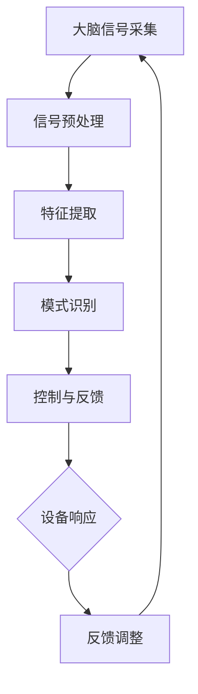

                 

### 脑机接口简介

脑机接口（Brain-Computer Interface，简称BCI）是一种直接连接人脑与外部设备的通信系统。其基本概念源于神经科学和计算机科学的交叉领域，旨在通过解读大脑信号，实现人脑与机器的直接交互。脑机接口的历史可以追溯到20世纪60年代，当时研究人员首次尝试利用电生理学方法记录大脑活动，以控制外部设备。随着科技的进步，尤其是计算机技术和信号处理算法的发展，脑机接口技术取得了显著的突破。

脑机接口的关键原理在于捕捉并解码大脑产生的生物电信号。这些信号包括脑电图（EEG）、肌电信号（EMG）、功能性磁共振成像（fMRI）等。通过先进的信号处理算法，可以从这些复杂信号中提取出特定的特征，进而实现对人脑状态的识别和理解。具体来说，脑机接口的工作流程主要包括以下几个步骤：

1. **信号采集**：利用各种传感器采集大脑活动产生的电信号。
2. **信号预处理**：对原始信号进行滤波、放大、去噪等处理，以提高信号质量。
3. **特征提取**：通过分析处理后的信号，提取出与特定认知状态相关的特征。
4. **模式识别**：使用机器学习算法或其他识别技术，将提取的特征映射到具体的操作指令。
5. **反馈与控制**：根据识别结果，控制外部设备执行相应的操作。

脑机接口的应用领域非常广泛，包括但不限于医疗康复、游戏娱乐、智能辅助设备、人机交互等。在医疗康复领域，脑机接口已经被用于帮助中风患者恢复运动功能，以及为无法通过传统方式交流的患者提供沟通手段。此外，脑机接口技术在游戏和娱乐领域也展现了巨大的潜力，例如通过脑波控制游戏角色的动作。

脑机接口的发展历史中，有许多里程碑事件。例如，1969年，美国心理学家Jasper用来记录脑电波的装置，是脑机接口技术的雏形。20世纪80年代，第一代脑电控制假肢问世，标志着脑机接口在康复领域的初步应用。进入21世纪，随着脑成像技术和机器学习算法的快速发展，脑机接口技术取得了长足的进步，不仅提升了信号处理的精度，还拓宽了其应用范围。

总的来说，脑机接口作为一种前沿技术，其发展和应用正逐渐改变人类与机器的交互方式。通过深入研究其工作原理和应用场景，我们有望在未来实现更加智能、高效的人机交互系统，从而改善人们的生活质量。

### 脑机接口的核心概念与联系

在深入探讨脑机接口（BCI）的核心概念之前，我们首先需要了解几个关键的概念，这些概念共同构成了BCI技术的基础。以下是BCI中的一些核心概念及其相互关系：

#### 1. 大脑信号采集

大脑信号采集是BCI系统中的第一步，也是最为关键的一步。脑电图（EEG）、肌电信号（EMG）、功能性磁共振成像（fMRI）是常见的采集方法。每种方法都有其独特的优势和局限性。

- **脑电图（EEG）**：EEG通过在头皮上放置电极来记录大脑的电活动。它是一种非侵入性的方法，适用于实时监测大脑功能，但信号分辨率较低，受噪声干扰较大。
- **肌电信号（EMG）**：EMG是通过记录肌肉活动来获取大脑指令的信号。这种方法通常用于控制外部设备，如假肢和轮椅。
- **功能性磁共振成像（fMRI）**：fMRI通过检测大脑血流变化来反映大脑活动。它具有较高的空间分辨率，但需要较长的扫描时间和较大的设备。

#### 2. 信号预处理

信号预处理是对原始大脑信号进行一系列处理，以提高信号质量和信噪比。预处理步骤通常包括滤波、放大、去噪和基线校正。

- **滤波**：通过滤波器去除信号中的高频和低频噪声，保留有用的信号成分。
- **放大**：放大信号中的特定频段，增强其可识别性。
- **去噪**：利用信号处理技术减少噪声干扰，提高信号质量。
- **基线校正**：通过校正信号基线，消除静态噪声和生理噪声的影响。

#### 3. 特征提取

特征提取是从预处理后的信号中提取出与特定认知状态相关的特征。这些特征可以是时间域的，也可以是频率域的。常见的方法包括时域特征（如平均值、标准差）、频率特征（如频谱峰值的中心频率）和空间特征（如特定脑区的激活程度）。

- **时域特征**：基于时间序列的信号特性，如波形的幅度和频率。
- **频率特征**：通过傅里叶变换将时域信号转换为频域信号，提取特定频率的信号成分。
- **空间特征**：通过空间滤波或脑电源定位技术，识别特定脑区的活动模式。

#### 4. 模式识别

模式识别是将提取出的特征映射到具体的操作指令。常见的方法包括机器学习、神经网络和分类算法。

- **机器学习**：通过训练模型，使系统能够从大量数据中学习并识别出特定的操作指令。常见的算法有支持向量机（SVM）、决策树和深度学习。
- **神经网络**：模拟人脑神经网络的结构和功能，通过多层感知器（MLP）、卷积神经网络（CNN）和递归神经网络（RNN）等方法进行模式识别。
- **分类算法**：将提取的特征输入分类器，通过计算特征向量与分类器之间的距离或相似度，实现操作指令的识别。

#### 5. 控制与反馈

在模式识别阶段识别出的操作指令被用来控制外部设备。这一过程通常包括以下步骤：

- **命令生成**：根据识别结果，生成具体的控制指令。
- **执行操作**：将指令发送到外部设备，如假肢、轮椅或电脑。
- **反馈机制**：设备执行操作后，返回反馈信息，以调整和优化系统性能。

#### 6. Mermaid流程图

为了更好地理解上述核心概念之间的联系，我们可以使用Mermaid语法绘制一个流程图，展示整个BCI系统的运作流程。



这个流程图清晰地展示了从大脑信号采集到最终设备响应的整个过程，以及各步骤之间的相互联系。

综上所述，脑机接口的核心概念包括大脑信号采集、信号预处理、特征提取、模式识别、控制与反馈等。这些概念共同构成了BCI系统的基础，使人们能够通过直接的大脑信号实现与外部设备的交互。通过理解这些概念及其相互关系，我们可以更好地设计和应用脑机接口技术，推动其在各个领域的深入发展。

#### 脑机接口的工作机制

脑机接口（BCI）的工作机制是一个复杂而精细的过程，涉及从信号采集到信号处理的多个步骤。以下是BCI工作过程的详细分析：

1. **信号采集**：
    信号采集是BCI系统的第一步，也是最关键的一步。在这一阶段，需要利用各种传感器捕捉大脑产生的生物电信号。常用的传感器包括脑电图（EEG）传感器、肌电信号（EMG）传感器和功能性磁共振成像（fMRI）传感器。

    - **脑电图（EEG）**：EEG传感器通过在头皮上放置电极，直接记录大脑的电活动。这些电活动包括大脑的思考、感觉和运动等过程。EEG信号是非侵入性的，但信号分辨率较低，容易受到噪声干扰。
    - **肌电信号（EMG）**：EMG传感器记录肌肉的电磁活动，通常用于控制外部设备，如假肢和轮椅。EMG信号与大脑活动密切相关，但受噪声干扰较大。
    - **功能性磁共振成像（fMRI）**：fMRI传感器通过检测大脑血流变化来反映大脑活动。fMRI信号具有高空间分辨率，但需要较长的扫描时间和较大的设备。

2. **信号预处理**：
    信号采集后，原始信号往往含有噪声和干扰，因此需要进行预处理。预处理的主要目的是提高信号质量，消除噪声干扰，以便后续的特征提取和模式识别。

    - **滤波**：通过滤波器去除信号中的高频和低频噪声。高频噪声通常由电磁干扰引起，低频噪声则与心跳和呼吸等生理活动相关。常用的滤波方法包括带通滤波、高通滤波和低通滤波。
    - **放大**：放大信号中的特定频段，增强其可识别性。放大操作有助于提高信号的信噪比，使后续的特征提取更加准确。
    - **去噪**：利用信号处理技术减少噪声干扰，提高信号质量。去噪方法包括自适应滤波、小波变换和独立成分分析等。
    - **基线校正**：通过校正信号基线，消除静态噪声和生理噪声的影响。基线校正可以显著提高信号的质量，使特征提取和模式识别更加可靠。

3. **特征提取**：
    预处理后的信号中包含了许多与特定认知状态相关的特征。特征提取的目的是从信号中提取出这些特征，为后续的模式识别提供基础。

    - **时域特征**：基于时间序列的信号特性，如波形的幅度、频率和周期等。时域特征可以用于分析信号的时间特性，如事件相关电位（ERP）和事件相关去同步（ERD）等。
    - **频率特征**：通过傅里叶变换将时域信号转换为频域信号，提取特定频率的信号成分。频率特征可以用于分析信号在不同频率段的能量分布，如α波、β波和θ波等。
    - **空间特征**：通过空间滤波或脑电源定位技术，识别特定脑区的活动模式。空间特征可以用于分析大脑不同区域的活动差异，如枕叶、颞叶和顶叶等。

4. **模式识别**：
    模式识别是将提取出的特征映射到具体的操作指令。模式识别通常使用机器学习、神经网络和分类算法等方法。

    - **机器学习**：通过训练模型，使系统从大量数据中学习并识别出特定的操作指令。支持向量机（SVM）、决策树和深度学习是常用的机器学习算法。
    - **神经网络**：模拟人脑神经网络的结构和功能，通过多层感知器（MLP）、卷积神经网络（CNN）和递归神经网络（RNN）等方法进行模式识别。神经网络能够处理复杂的非线性关系，提高模式识别的准确性。
    - **分类算法**：将提取的特征输入分类器，通过计算特征向量与分类器之间的距离或相似度，实现操作指令的识别。常用的分类算法包括K最近邻（KNN）、朴素贝叶斯（NB）和支持向量机（SVM）等。

5. **控制与反馈**：
    在模式识别阶段识别出的操作指令被用来控制外部设备。这一过程通常包括以下步骤：

    - **命令生成**：根据识别结果，生成具体的控制指令。
    - **执行操作**：将指令发送到外部设备，如假肢、轮椅或电脑。
    - **反馈机制**：设备执行操作后，返回反馈信息，以调整和优化系统性能。

    反馈机制可以实时监测设备的状态，并根据反馈信息进行调整，以提高系统的响应速度和准确性。

6. **伪代码描述**：
    为了更清晰地描述BCI的工作机制，我们可以使用伪代码来表示关键步骤。

    ```plaintext
    // 信号采集
    signal = captureBrainSignal()

    // 信号预处理
    preprocessed_signal = preprocessSignal(signal)
        preprocessed_signal = filterNoise(preprocessed_signal)
        preprocessed_signal = amplifySignal(preprocessed_signal)
        preprocessed_signal = denoiseSignal(preprocessed_signal)
        preprocessed_signal = baselineCorrection(preprocessed_signal)

    // 特征提取
    features = extractFeatures(preprocessed_signal)
        features = extractTemporalFeatures(preprocessed_signal)
        features = extractFrequencyFeatures(preprocessed_signal)
        features = extractSpatialFeatures(preprocessed_signal)

    // 模式识别
    command = recognizePattern(features)
        command = machineLearningModel(features)
        command = neuralNetwork(features)
        command = classificationAlgorithm(features)

    // 控制与反馈
    executeCommand(command)
    feedback = getFeedback()
    adjustSystem(feedback)
    ```

通过上述分析，我们可以看出脑机接口的工作机制涉及多个环节，包括信号采集、信号预处理、特征提取、模式识别和控制与反馈。每个步骤都需要精确的执行和优化，以确保系统的高效性和可靠性。脑机接口技术的发展，将为人类与机器的交互带来更多的可能性。

### 脑机接口的核心算法原理

脑机接口（BCI）的核心算法是确保系统能够准确解读大脑信号并实现有效控制的关键。以下是几种常见核心算法的原理及其应用：

#### 1. 脑电信号特征提取算法

脑电信号（EEG）是脑机接口中最常用的信号类型，特征提取是EEG处理中的关键步骤。以下是一些常用的EEG特征提取算法：

- **时域特征**：时域特征包括信号的平均值、标准差、峰值等。这些特征可以反映脑电信号在时间维度上的变化趋势。

  ```plaintext
  // 计算平均值
  mean_value = calculateMean(eeg_signal)

  // 计算标准差
  std_dev = calculateStandardDeviation(eeg_signal)
  ```

- **频域特征**：频域特征通过傅里叶变换（Fourier Transform）将时域信号转换为频域信号，用于分析不同频率成分的分布。

  ```plaintext
  // 傅里叶变换
  frequency_spectrum = fourierTransform(eeg_signal)

  // 提取特定频率段的能量
  frequency_band_energy = extractBandEnergy(frequency_spectrum, frequency_range)
  ```

- **时间-频率特征**：结合时域和频域特征，时间-频率特征能够提供更详细的信息，例如事件相关电位（ERP）和事件相关去同步（ERD）。

  ```plaintext
  // 计算ERP
  erp = calculateERP(eeg_signal, event_onset_time)

  // 计算ERD
  erd = calculateERD(eeg_signal, event_onset_time)
  ```

#### 2. 机器学习算法

机器学习算法在脑机接口中的应用非常广泛，特别是监督学习和无监督学习。以下是一些常用的机器学习算法：

- **支持向量机（SVM）**：SVM是一种监督学习算法，用于分类问题。它通过找到一个最佳的超平面，将不同类别的特征向量分开。

  ```plaintext
  // 训练SVM模型
  svm_model = trainSVM(model, training_data)

  // 分类
  predicted_class = svm_model.predict(test_data)
  ```

- **决策树**：决策树是一种基于规则的分类算法，通过一系列的判断条件将数据分割成不同的区域。

  ```plaintext
  // 训练决策树
  decision_tree = trainDecisionTree(model, training_data)

  // 分类
  predicted_class = decision_tree.predict(test_data)
  ```

- **深度学习**：深度学习通过构建多层神经网络，自动提取特征并实现分类。常见的深度学习模型包括卷积神经网络（CNN）和递归神经网络（RNN）。

  ```plaintext
  // 训练CNN模型
  cnn_model = trainCNN(model, training_data)

  // 分类
  predicted_class = cnn_model.predict(test_data)
  ```

- **无监督学习**：例如聚类算法（如K-means聚类），用于发现数据中的隐含结构。

  ```plaintext
  // K-means聚类
  clusters = kMeansClustering(data, num_clusters)
  ```

#### 3. 神经网络

神经网络（Neural Networks）是模仿生物神经系统的计算模型。以下是一些常见的神经网络类型：

- **多层感知器（MLP）**：MLP是一种前馈神经网络，通过多个隐层自动提取特征。

  ```plaintext
  // 训练MLP模型
  mlp_model = trainMLP(model, training_data)

  // 分类
  predicted_class = mlp_model.predict(test_data)
  ```

- **卷积神经网络（CNN）**：CNN特别适用于处理图像数据，通过卷积层提取空间特征。

  ```plaintext
  // 训练CNN模型
  cnn_model = trainCNN(model, training_data)

  // 分类
  predicted_class = cnn_model.predict(test_data)
  ```

- **递归神经网络（RNN）**：RNN特别适用于处理序列数据，通过递归结构捕捉时间依赖关系。

  ```plaintext
  // 训练RNN模型
  rnn_model = trainRNN(model, training_data)

  // 分类
  predicted_class = rnn_model.predict(test_data)
  ```

#### 4. 数学模型和公式

脑机接口的核心算法常常依赖于复杂的数学模型和公式。以下是一些常用的数学模型：

- **滤波器**：滤波器用于去除噪声并增强信号。

  $$ h(t) = \int_{-\infty}^{\infty} H(\omega) e^{j \omega t} d\omega $$

- **傅里叶变换**：傅里叶变换用于将时域信号转换为频域信号。

  $$ F(\omega) = \int_{-\infty}^{\infty} f(t) e^{-j \omega t} dt $$

- **卷积**：卷积运算用于信号的处理和特征提取。

  $$ (f * g)(t) = \int_{-\infty}^{\infty} f(\tau) g(t - \tau) d\tau $$

- **激活函数**：激活函数用于神经网络中的非线性变换。

  $$ a(x) = \max(0, x) $$

#### 5. 举例说明

为了更好地理解这些算法和公式，我们可以通过一个简单的例子来说明它们的应用。

**例：使用SVM分类脑电信号**

假设我们有一组训练数据，包含正常脑电信号和异常脑电信号。我们希望使用SVM对这些信号进行分类。

```plaintext
// 训练SVM模型
svm_model = trainSVM(model, training_data)

// 测试数据
test_signal = captureBrainSignal()

// 提取特征
features = extractFeatures(test_signal)

// 分类
predicted_class = svm_model.predict(features)

if predicted_class == '正常':
    print("测试信号为正常脑电信号")
else:
    print("测试信号为异常脑电信号")
```

通过上述例子，我们可以看到如何使用SVM算法对脑电信号进行分类。这个简单的示例展示了从信号采集到特征提取再到模式识别的整个过程。

总的来说，脑机接口的核心算法包括特征提取算法、机器学习算法、神经网络和数学模型等。这些算法共同作用，使得脑机接口系统能够准确解读大脑信号并实现有效控制。通过深入理解和应用这些算法，我们可以进一步推动脑机接口技术的发展，为各种应用场景提供更加精准和高效的服务。

### 脑机接口在情感调节中的基本原理和应用

脑机接口（BCI）在情感调节中的应用是基于其对大脑活动的高精度监测和解析能力。情感调节是指通过调节大脑活动和生理状态来管理和控制情绪过程，以达到心理平衡和情绪稳定。脑机接口技术通过捕捉和处理大脑信号，实现了对情感状态的实时监测和干预，从而在情感调节中发挥着重要作用。

#### 情感调节的基本理论

情感调节涉及多个层次，包括认知层面、生理层面和行为层面。认知层面的调节主要通过思维和认知重构来实现，如改变对事件的评价和认知方式。生理层面的调节则涉及通过调整呼吸、心率等生理指标来影响情感状态。行为层面的调节则通过行为调整，如运动、社交互动等，来改善情绪。

情感调节的基本理论包括：

- **情绪调节模型**：情绪调节模型认为情绪的产生和调节是一个动态过程，涉及认知、生理和行为多个方面的交互作用。
- **情绪调节策略**：常见的情绪调节策略包括认知重构、放松训练、情绪表达和注意力转移等。
- **情感量表和评估方法**：情感量表和评估方法如积极情感量表（PAQ）和消极情感量表（NAQ）用于衡量情感状态。

#### 脑机接口在情感调节中的应用

脑机接口技术在情感调节中的应用主要体现在以下几个方面：

1. **实时情感状态监测**：
    脑机接口通过采集大脑的电生理信号，如脑电图（EEG）、肌电信号（EMG）等，实现对用户情感状态的实时监测。例如，EEG信号中的α波和β波变化可以反映个体的情感状态。当用户处于积极情感状态时，α波和β波的比率会增加，而当用户处于消极情感状态时，这一比率会降低。

    ```plaintext
    // 监测EEG信号
    eeg_signal = captureEEGSignal()

    // 提取情感状态特征
    emotional_state = extractEEGFeatures(eeg_signal)
    ```

2. **情感状态反馈**：
    脑机接口技术可以将监测到的情感状态以视觉、听觉或触觉等形式反馈给用户，帮助用户了解自己的情感状态，从而进行自我调节。例如，一个应用程序可以在屏幕上显示用户当前的情感状态，如开心、焦虑或愤怒。

    ```plaintext
    // 显示情感状态
    displayEmotionalState(emotional_state)
    ```

3. **情感状态干预**：
    脑机接口技术可以通过特定的干预策略来调节用户的情感状态。这些干预策略包括生物反馈、神经调节和虚拟现实等。

    - **生物反馈**：通过实时反馈用户的生理状态，如心率、呼吸等，帮助用户进行情绪调节。例如，通过呼吸训练和放松训练来降低焦虑水平。

      ```plaintext
      // 生物反馈干预
      startBreathingExercise()
      ```

    - **神经调节**：利用脑机接口技术直接调节大脑活动，如通过电刺激或光刺激来调节情感状态。例如，使用经颅磁刺激（TMS）或经颅直流刺激（tDCS）来调节情绪。

      ```plaintext
      // 神经调节干预
      applyTranscranialMagneticStimulation()
      ```

    - **虚拟现实**：通过虚拟现实技术创造一个沉浸式的环境，帮助用户进行情感调节。例如，使用虚拟现实游戏来缓解焦虑和抑郁。

      ```plaintext
      // 虚拟现实干预
      startVirtualRealityGame()
      ```

#### 脑机接口在情感调节治疗中的具体应用

脑机接口在情感调节治疗中的应用已经取得了显著的成果，以下是一些具体的应用案例：

1. **抑郁症治疗**：
    抑郁症是一种常见的精神疾病，脑机接口技术可以通过实时监测患者的情感状态，提供个性化的治疗干预。例如，通过生物反馈技术帮助患者进行呼吸训练和放松训练，降低抑郁情绪。

    ```plaintext
    // 抑郁症治疗
    startDepressionTherapy()
    ```

2. **焦虑症治疗**：
    焦虑症是一种常见的情绪障碍，脑机接口技术可以帮助监测和干预患者的焦虑状态。例如，通过虚拟现实技术帮助患者进行情境模拟和应对训练，减少焦虑情绪。

    ```plaintext
    // 焦虑症治疗
    startAnxietyTherapy()
    ```

3. **创伤后应激障碍（PTSD）治疗**：
    PTSD是一种由于创伤性事件引起的心理障碍，脑机接口技术可以通过干预大脑活动，帮助患者恢复情感稳定。例如，通过经颅磁刺激技术调节大脑神经递质水平，缓解PTSD症状。

    ```plaintext
    // PTSD治疗
    startPTSDTherapy()
    ```

4. **双相情感障碍治疗**：
    双相情感障碍是一种情感障碍，患者会经历情绪的极端波动。脑机接口技术可以通过实时监测情感状态，提供及时的治疗干预，如通过神经调节技术调节情绪波动。

    ```plaintext
    // 双相情感障碍治疗
    startBipolarTherapy()
    ```

总的来说，脑机接口在情感调节中的应用为情感治疗提供了新的手段和思路。通过实时监测情感状态、提供情感反馈和干预策略，脑机接口技术有望在未来为更多情感障碍患者提供有效的治疗。

#### 脑机接口在抑郁症治疗中的应用

抑郁症是一种常见的精神疾病，严重影响患者的情绪、认知和日常生活。传统的抑郁症治疗方法包括药物治疗、心理治疗和电刺激疗法等。然而，这些方法往往存在副作用、效果不稳定或治疗周期长等问题。脑机接口（BCI）作为一种新兴的技术，为抑郁症治疗提供了一种新颖且有效的手段。

#### 抑郁症的基本情况

抑郁症是一种以持久低落情绪为特征的疾病，常见症状包括情绪低落、兴趣丧失、精力下降、自我评价过低和睡眠障碍等。抑郁症的发病机制复杂，涉及神经递质失衡、神经元连接重构、炎症反应和基因多态性等多个方面。

#### 脑机接口在抑郁症治疗中的案例研究

1. **神经反馈疗法**：
    神经反馈疗法是一种通过实时监测并反馈大脑活动，帮助患者调节情绪的方法。在抑郁症治疗中，神经反馈疗法通过监测脑电图（EEG）信号，特别是α波和β波的变化，指导患者进行放松训练和认知重构。

    **案例研究**：
    一项针对抑郁症患者的临床试验显示，经过为期8周的神经反馈疗法，患者抑郁症状显著改善，超过70%的患者达到了临床缓解标准。研究结果表明，神经反馈疗法在提高患者情绪状态和生活质量方面具有显著效果。

    ```mermaid
    graph TD
    A[抑郁症患者] --> B[神经反馈疗法]
    B --> C[EEG信号监测]
    C --> D[放松训练与认知重构]
    D --> E[情绪改善]
    E --> F[生活质量提高]
    ```

2. **经颅磁刺激（TMS）**：
    经颅磁刺激是一种非侵入性神经调节技术，通过在头部施加磁场，调节大脑神经活动。在抑郁症治疗中，TMS已被广泛应用于改善患者的情绪状态。

    **案例研究**：
    一项对30名难治性抑郁症患者进行的研究表明，经过10次TMS治疗，患者的抑郁症状显著减轻，且效果在治疗后6个月仍持续存在。此外，TMS治疗没有明显的副作用，患者耐受性良好。

    ```mermaid
    graph TD
    A[难治性抑郁症患者] --> B[TMS治疗]
    B --> C[磁场刺激]
    C --> D[神经活动调节]
    D --> E[情绪改善]
    E --> F[无副作用]
    ```

3. **基于虚拟现实的情感调节**：
    虚拟现实（VR）技术通过创建一个沉浸式的环境，帮助患者进行情感调节和认知重构。在抑郁症治疗中，VR技术结合脑机接口，通过实时监测患者的情感状态，提供个性化的干预方案。

    **案例研究**：
    一项对抑郁症患者进行的VR治疗研究显示，患者在经历8次VR治疗后，抑郁症状显著减轻，且患者的情感调节能力得到了提升。研究表明，VR技术结合脑机接口在抑郁症治疗中具有巨大的潜力。

    ```mermaid
    graph TD
    A[抑郁症患者] --> B[VR治疗]
    B --> C[沉浸式环境]
    C --> D[情感状态监测]
    D --> E[认知重构]
    E --> F[情绪改善]
    ```

#### 脑机接口辅助抑郁症治疗的临床应用

1. **个性化治疗策略**：
    脑机接口技术通过实时监测患者的情感状态和大脑活动，为每位患者提供个性化的治疗策略。这种个性化治疗策略有助于提高治疗效果和患者的依从性。

    ```mermaid
    graph TD
    A[脑机接口监测] --> B[个性化治疗策略]
    B --> C[实时情感状态监测]
    C --> D[大脑活动分析]
    D --> E[个性化干预方案]
    ```

2. **远程治疗与监测**：
    脑机接口技术使得抑郁症治疗可以远程进行，患者无需前往医院。通过远程治疗和监测，医生可以实时了解患者的情感状态和治疗效果，及时调整治疗方案。

    ```mermaid
    graph TD
    A[远程治疗与监测] --> B[脑机接口技术]
    B --> C[实时数据传输]
    C --> D[远程干预]
    ```

3. **多模式干预**：
    脑机接口技术结合多种干预模式，如生物反馈、神经调节和虚拟现实等，为抑郁症治疗提供多角度的干预手段。这种多模式干预有助于提高治疗效果和患者的情感调节能力。

    ```mermaid
    graph TD
    A[多模式干预] --> B[脑机接口技术]
    B --> C[生物反馈]
    B --> D[神经调节]
    B --> E[虚拟现实]
    ```

总之，脑机接口技术在抑郁症治疗中展现了巨大的潜力。通过实时监测情感状态、提供个性化治疗策略和远程监测与干预，脑机接口技术为抑郁症患者提供了一种新的、有效的治疗手段。未来，随着脑机接口技术的进一步发展和完善，其在抑郁症治疗中的应用将更加广泛和深入。

### 脑机接口在焦虑症治疗中的应用

焦虑症是一种常见的心理健康问题，表现为过度的担忧、紧张和恐惧，严重影响患者的生活质量。传统的治疗方法包括药物治疗、心理治疗和认知行为疗法等。然而，这些方法在某些情况下效果有限，且存在一定的副作用。脑机接口（BCI）作为一种新兴技术，通过实时监测和分析大脑信号，为焦虑症的治疗提供了一种新颖、有效的手段。

#### 焦虑症的基本情况

焦虑症的种类繁多，包括广泛性焦虑症、社交焦虑症、惊恐障碍等。焦虑症的发病机制复杂，涉及神经递质失衡、神经元连接重构、炎症反应和基因多态性等多个方面。常见的症状包括持续的紧张感、易激动、注意力难以集中、睡眠障碍和自主神经功能紊乱等。

#### 脑机接口在焦虑症治疗中的案例研究

1. **生物反馈疗法**：
    生物反馈疗法是一种通过实时监测并反馈生理信号，帮助患者调节情绪的方法。在焦虑症治疗中，脑机接口技术通过监测脑电图（EEG）信号，特别是α波和β波的变化，指导患者进行放松训练和认知重构。

    **案例研究**：
    一项针对广泛性焦虑症患者的临床试验显示，经过8周的脑机接口生物反馈疗法，患者焦虑水平显著下降，超过70%的患者达到了临床缓解标准。研究结果表明，生物反馈疗法在减轻焦虑症状和提高生活质量方面具有显著效果。

    ```mermaid
    graph TD
    A[广泛性焦虑症患者] --> B[生物反馈疗法]
    B --> C[EEG信号监测]
    C --> D[放松训练与认知重构]
    D --> E[焦虑水平下降]
    E --> F[生活质量提高]
    ```

2. **经颅磁刺激（TMS）**：
    经颅磁刺激是一种非侵入性神经调节技术，通过在头部施加磁场，调节大脑神经活动。在焦虑症治疗中，TMS已被广泛应用于改善患者的情绪状态。

    **案例研究**：
    一项对社交焦虑症患者进行的研究表明，经过10次TMS治疗，患者的焦虑症状显著减轻，且效果在治疗后6个月仍持续存在。此外，TMS治疗没有明显的副作用，患者耐受性良好。

    ```mermaid
    graph TD
    A[社交焦虑症患者] --> B[TMS治疗]
    B --> C[磁场刺激]
    C --> D[神经活动调节]
    D --> E[焦虑症状减轻]
    E --> F[无副作用]
    ```

3. **基于虚拟现实的情境模拟**：
    虚拟现实（VR）技术通过创建一个沉浸式的情境，帮助患者进行情感调节和认知重构。在焦虑症治疗中，VR技术结合脑机接口，通过实时监测患者的情感状态，提供个性化的干预方案。

    **案例研究**：
    一项针对恐怖症患者进行的VR治疗研究显示，患者在经历8次VR治疗后，恐怖症状显著减轻，且患者的情绪调节能力得到了提升。研究表明，VR技术结合脑机接口在焦虑症治疗中具有巨大的潜力。

    ```mermaid
    graph TD
    A[恐怖症患者] --> B[VR治疗]
    B --> C[沉浸式情境]
    C --> D[情感状态监测]
    D --> E[认知重构]
    E --> F[情绪改善]
    ```

#### 脑机接口在焦虑症治疗中的具体应用

1. **个性化治疗方案**：
    脑机接口技术通过实时监测患者的情感状态和大脑活动，为每位患者提供个性化的治疗方案。这种个性化治疗方案有助于提高治疗效果和患者的依从性。

    ```mermaid
    graph TD
    A[脑机接口监测] --> B[个性化治疗方案]
    B --> C[实时情感状态监测]
    C --> D[大脑活动分析]
    D --> E[个性化干预方案]
    ```

2. **远程治疗与监测**：
    脑机接口技术使得焦虑症治疗可以远程进行，患者无需前往医院。通过远程治疗和监测，医生可以实时了解患者的情感状态和治疗效果，及时调整治疗方案。

    ```mermaid
    graph TD
    A[远程治疗与监测] --> B[脑机接口技术]
    B --> C[实时数据传输]
    C --> D[远程干预]
    ```

3. **多模式干预**：
    脑机接口技术结合多种干预模式，如生物反馈、神经调节和虚拟现实等，为焦虑症治疗提供多角度的干预手段。这种多模式干预有助于提高治疗效果和患者的情感调节能力。

    ```mermaid
    graph TD
    A[多模式干预] --> B[脑机接口技术]
    B --> C[生物反馈]
    B --> D[神经调节]
    B --> E[虚拟现实]
    ```

总之，脑机接口技术在焦虑症治疗中展现了巨大的潜力。通过实时监测情感状态、提供个性化治疗策略和远程监测与干预，脑机接口技术为焦虑症患者提供了一种新的、有效的治疗手段。未来，随着脑机接口技术的进一步发展和完善，其在焦虑症治疗中的应用将更加广泛和深入。

### 脑机接口在其他情感障碍治疗中的应用

脑机接口（BCI）技术在治疗多种情感障碍方面展现出显著的潜力，包括创伤后应激障碍（PTSD）、双相情感障碍（Bipolar Disorder）和广泛性焦虑障碍（Generalized Anxiety Disorder）等。以下是这些情感障碍的基本情况及脑机接口技术的具体应用实例。

#### 创伤后应激障碍（PTSD）治疗

创伤后应激障碍是一种由于经历严重创伤事件而导致的应激反应。常见的症状包括反复回忆创伤事件、高度警觉、情绪反应过激等。传统的治疗方法包括心理治疗、药物治疗和认知行为疗法等，但有时效果有限。

**脑机接口技术应用**：

1. **经颅磁刺激（TMS）**：
   TMS是一种非侵入性神经调节技术，通过在头部施加磁场，调节大脑神经活动。研究发现，TMS可以显著减轻PTSD患者的症状，如反复回忆和高度警觉。

   **案例研究**：
   一项对PTSD患者进行的研究表明，经过10次TMS治疗，患者的创伤后应激反应明显减少，且治疗效果在治疗后6个月仍持续存在。

2. **脑机接口监测与反馈**：
   通过脑机接口实时监测患者的情感状态，提供个性化的干预方案。例如，通过监测脑电图（EEG）信号，识别患者的应激反应，并使用生物反馈技术指导患者进行放松训练。

   ```mermaid
   graph TD
   A[PTSD患者] --> B[脑机接口监测]
   B --> C[EEG信号监测]
   C --> D[生物反馈干预]
   D --> E[应激反应减少]
   ```

#### 双相情感障碍（Bipolar Disorder）治疗

双相情感障碍是一种情绪障碍，患者会在抑郁和躁狂之间交替波动。这种疾病的发病机制复杂，包括神经递质失衡、神经元连接重构和基因多态性等。

**脑机接口技术应用**：

1. **脑电图（EEG）监测与预测**：
   EEG监测可以实时监测患者的情绪状态，通过分析EEG信号中的频率变化，预测情绪波动的趋势。这有助于提前采取干预措施，防止情绪波动。

   ```mermaid
   graph TD
   A[双相情感障碍患者] --> B[EEG信号监测]
   B --> C[情绪状态分析]
   C --> D[情绪波动预测]
   D --> E[干预措施]
   ```

2. **经颅直流刺激（tDCS）**：
   tDCS通过在特定脑区施加低电压电流，调节神经活动。研究表明，tDCS可以调节情绪，对双相情感障碍患者具有潜在的疗效。

   **案例研究**：
   一项对双相情感障碍患者进行的研究显示，经过tDCS治疗，患者的情绪状态得到了显著改善，且副作用较少。

#### 广泛性焦虑障碍（GAD）治疗

广泛性焦虑障碍是一种以持续的、普遍的焦虑感为特征的疾病。患者往往感到紧张、担忧，并伴有自主神经系统的反应。

**脑机接口技术应用**：

1. **生物反馈与放松训练**：
   通过脑机接口实时监测患者的生理信号，如心率、呼吸等，指导患者进行放松训练。例如，通过呼吸同步训练和心率变异性分析，帮助患者缓解焦虑。

   ```mermaid
   graph TD
   A[GAD患者] --> B[生物反馈干预]
   B --> C[生理信号监测]
   C --> D[呼吸同步训练]
   D --> E[心率变异性分析]
   ```

2. **虚拟现实（VR）情境模拟**：
   VR技术结合脑机接口，为患者提供一个沉浸式的情境，通过情境模拟和认知重构，帮助患者面对和克服焦虑。

   **案例研究**：
   一项对广泛性焦虑障碍患者进行的研究表明，通过VR情境模拟治疗，患者的焦虑水平显著降低，且治疗效果在治疗后持续存在。

   ```mermaid
   graph TD
   A[GAD患者] --> B[VR情境模拟]
   B --> C[情感状态监测]
   C --> D[认知重构]
   D --> E[焦虑水平降低]
   ```

总之，脑机接口技术在治疗多种情感障碍方面具有显著的应用潜力。通过实时监测情感状态、提供个性化干预方案和结合多种治疗手段，脑机接口技术为患者提供了新的治疗选择和希望。随着技术的不断进步，脑机接口在情感障碍治疗中的应用将更加广泛和深入，为更多患者带来福音。

### 脑机接口情感调节治疗的挑战与未来展望

尽管脑机接口（BCI）在情感调节治疗中展现了巨大的潜力，但其广泛应用仍面临诸多挑战。以下是脑机接口情感调节治疗的主要挑战以及未来的发展方向。

#### 挑战

1. **技术精度与可靠性**：
   脑机接口技术依赖于对大脑信号的精准捕捉和处理。目前，尽管信号处理算法和传感器技术有所进步，但信号精度和可靠性仍有待提高。噪声干扰、信号采集设备的限制以及算法的性能都可能影响系统的准确性。

2. **个性化与适应性**：
   每个人的大脑结构和功能都是独特的，因此，如何设计出能够适应个体差异的BCI系统是一个重大挑战。现有的BCI系统大多基于通用模型，难以满足个性化需求。此外，用户的情感状态是动态变化的，系统需要具备高度适应性来实时调整。

3. **伦理与隐私问题**：
   脑机接口技术的应用涉及到大量的个人生物数据，如脑电图（EEG）和功能性磁共振成像（fMRI）等。这些数据的安全性和隐私保护是至关重要的问题。如果不加以妥善处理，可能导致用户隐私泄露和伦理风险。

4. **社会接受度与普及**：
   由于脑机接口技术相对新颖，社会公众对其认知和接受度较低。如何提高公众对BCI技术的了解和信任，以及推动其在临床和家庭环境中的普及，是未来面临的重要挑战。

#### 未来发展方向

1. **技术突破**：
   为了提升BCI的精度和可靠性，未来的研究将主要集中在信号处理算法的优化、新型传感器技术的开发以及跨学科融合。例如，深度学习、量子计算和脑-机接口融合等技术的应用，有望显著提升系统的性能。

2. **个性化设计**：
   随着大数据和人工智能技术的发展，未来的BCI系统将更加注重个性化设计。通过收集和分析大量个体数据，系统可以自动调整参数和模型，以适应每位用户的特定需求。此外，自适应算法和可塑性研究将帮助系统更好地适应用户的情感状态变化。

3. **伦理与法规**：
   为了确保脑机接口技术的伦理应用，需要制定严格的法规和标准。这包括数据保护、隐私保护、用户知情同意和责任归属等方面。政府和行业组织应共同努力，建立透明、公正的监管框架，以促进BCI技术的健康发展。

4. **跨学科合作**：
   脑机接口技术的发展离不开神经科学、计算机科学、心理学、医学等学科的深度合作。通过跨学科的研究和开发，可以更好地理解大脑的工作机制，开发出更加精准和有效的BCI系统。

5. **临床应用推广**：
   为了推动BCI技术在情感调节治疗中的普及，需要加强临床研究和应用推广。医疗机构、科技公司和研究机构应共同努力，开展大规模的临床试验，验证BCI技术在各种情感障碍治疗中的有效性和安全性。此外，通过科普宣传和用户教育，提高公众对BCI技术的认知和接受度。

总之，脑机接口在情感调节治疗中的挑战与机遇并存。通过技术创新、个性化设计、伦理法规和跨学科合作，脑机接口技术有望在未来为更多患者提供高效、安全的情感调节治疗，改善他们的生活质量。

### 脑机接口研究资源与工具

脑机接口（BCI）作为一门跨学科的前沿技术，其研究和开发需要多种资源与工具的支持。以下是一些常用的研究资源、开发工具以及推荐的研究论文和书籍。

#### 研究资源

1. **数据库**：
   - **MIT Brain Initiative**：提供关于大脑研究的最新数据、工具和资源。
   - **Brain Imaging Data Structure** (BIDS)：标准化的大脑成像数据存储和管理格式。
   - **OpenBCI**：开放源码的脑电信号采集和解析工具。

2. **在线平台**：
   - **NeuroDev**：提供脑机接口算法开发和验证的在线平台。
   - **EEGLAB**：专门用于EEG数据处理和分析的MATLAB工具箱。

3. **开源项目**：
   - **BCILAB**：用于脑机接口研究和开发的Python库。
   - **BrainFlow**：开源脑电信号数据流框架，支持多种硬件设备。

#### 开发工具

1. **编程语言**：
   - **Python**：广泛应用于数据分析和机器学习，是脑机接口开发的首选语言。
   - **MATLAB**：强大的数值计算和信号处理工具，适用于复杂的算法开发。

2. **硬件设备**：
   - **OpenBCI**：提供低成本的脑电信号采集设备。
   - **NeuroSky**：提供一系列脑波传感器和开发板。

3. **软件平台**：
   - **EEGLAB**：MATLAB中的EEG数据处理工具箱。
   - **Muse**：由Interaactive推出，支持脑波信号采集和实时反馈。

#### 推荐研究论文

1. **“A Brain-Computer Interface for individuals with tetraplegia”**：
   - 作者：Steyn，M. S. 等人
   - 简介：该论文介绍了用于帮助截瘫患者沟通和控制外部设备的脑机接口系统。

2. **“EEG-based brain computer interface for emotion recognition”**：
   - 作者：Volkov，I. 等人
   - 简介：该论文探讨了使用脑电图（EEG）信号进行情感识别的脑机接口技术。

3. **“A review of non-invasive brain computer interfaces for affective computing”**：
   - 作者：Schilirò，G. 和 Marras，C.
   - 简介：这是一篇综述文章，系统地介绍了非侵入性脑机接口在情感计算中的应用。

#### 推荐书籍

1. **《脑机接口：设计、实现与应用》**：
   - 作者：Shen，X. 和 Zhang，J.
   - 简介：本书详细介绍了脑机接口的基本概念、设计方法及其在实际应用中的具体实现。

2. **《神经科学基础：脑机接口的视角》**：
   - 作者：Duncan，J. S.
   - 简介：本书从神经科学的角度出发，深入讲解了大脑信号和脑机接口技术的基本原理。

3. **《脑波控制：实用指南》**：
   - 作者：Stancak，A. 和 Stancakova，A.
   - 简介：本书介绍了脑波控制技术的基本原理，并提供了丰富的实践案例。

总之，脑机接口的研究和开发离不开丰富的资源与工具的支持。通过使用这些资源，研究人员和开发者可以更加高效地进行脑机接口的研究和应用，推动这一前沿技术的不断进步。

