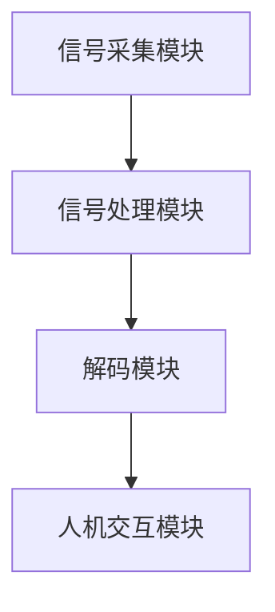

                 

### 文章标题

《脑机接口在游戏和娱乐领域的应用》

#### 关键词

脑机接口，游戏，娱乐，应用场景，用户体验，技术挑战

#### 摘要

本文旨在探讨脑机接口技术在游戏和娱乐领域的应用。首先，我们将介绍脑机接口的基础知识，包括其定义、原理和分类。接着，我们将深入分析脑机接口的核心算法原理，包括脑电信号处理算法和脑机接口解码算法。随后，我们将探讨脑机接口在游戏和娱乐领域的实际应用，包括应用场景、用户体验优化和案例分析。最后，我们将对脑机接口在游戏和娱乐领域的未来发展趋势和挑战进行展望，并探讨其潜在的社会责任和伦理问题。

---

### 第一部分：脑机接口技术基础

#### 1. 脑机接口概述

##### 1.1 脑机接口的定义与原理

脑机接口（Brain-Computer Interface，BCI）是一种直接连接人脑和外部设备的技术。它通过捕捉和解释大脑信号，使人们能够通过思维来控制外部设备，实现与机器的交互。

脑机接口的原理主要包括信号检测与处理、信号解码与执行三个步骤。首先，通过传感器捕捉大脑信号，如脑电信号（EEG）、脑磁信号（MEG）等。然后，对捕获的信号进行预处理，包括去噪、滤波和特征提取。最后，利用机器学习算法对预处理后的信号进行解码，将思维意图转化为具体的操作指令，从而控制外部设备。

##### 1.2 脑机接口技术的发展历程

脑机接口技术的研究可以追溯到20世纪60年代。当时，科学家们主要关注于利用脑电信号控制电子设备。随着计算机技术的发展和生物医学工程的进步，脑机接口技术逐渐成熟。近年来，随着人工智能和虚拟现实技术的兴起，脑机接口的应用范围和性能都有了显著提升。

##### 1.3 脑机接口的主要分类

根据信号来源和处理方式，脑机接口可以分为以下几类：

1. **脑电信号脑机接口（EEG-BCI）**：利用脑电信号进行控制和交互，具有实时性好、无侵入性等特点。
2. **脑磁信号脑机接口（MEG-BCI）**：利用脑磁信号进行控制和交互，具有高时间分辨率和空间分辨率等特点。
3. **侵入性脑机接口**：通过手术将传感器植入大脑，获取高精度的大脑信号。
4. **非侵入性脑机接口**：通过头皮或体表传感器获取大脑信号，无需手术。

### 2. 脑机接口的原理与核心概念

##### 2.1 脑电信号检测与处理

脑电信号检测是脑机接口技术的关键环节。它主要包括传感器的选择和信号的预处理。常用的传感器包括电极、传感器阵列和脑电图机（EEG）。传感器选择取决于应用场景和信号类型。

脑电信号的预处理主要包括去噪、滤波和特征提取。去噪的目的是去除信号中的噪声成分，提高信号的纯净度。滤波的目的是滤除特定频率的信号，保留感兴趣的信息。特征提取的目的是将连续的信号转化为离散的特征向量，便于后续的信号处理和识别。

##### 2.2 脑磁信号检测与处理

脑磁信号检测与脑电信号检测类似，也需要选择合适的传感器进行信号的采集。由于脑磁信号的强度较弱，通常需要使用高灵敏度的传感器和放大器。

脑磁信号的预处理包括去噪、滤波和特征提取。与脑电信号不同的是，脑磁信号的处理更加复杂，需要考虑磁场干扰和地磁场的影响。

##### 2.3 脑机接口的核心技术

脑机接口的核心技术包括信号处理算法、解码算法和人机交互接口。

1. **信号处理算法**：主要包括滤波、去噪、特征提取和模式识别。滤波和去噪的目的是提高信号的质量，特征提取和模式识别的目的是将信号转化为可用的信息。
2. **解码算法**：解码算法是将预处理后的信号转化为具体的操作指令。常用的解码算法包括统计解码、神经网络解码和深度学习解码。
3. **人机交互接口**：人机交互接口是连接大脑和外部设备的重要环节。它可以是硬件接口，如计算机、游戏机等，也可以是软件接口，如虚拟现实、增强现实等。

##### 2.4 脑机接口的基本架构

脑机接口的基本架构包括信号采集模块、信号处理模块、解码模块和人机交互模块。信号采集模块负责获取大脑信号，信号处理模块负责对信号进行预处理，解码模块负责将信号转化为操作指令，人机交互模块负责将操作指令转化为外部设备的控制信号。

[Mermaid 流程图]



### 3. 脑机接口在游戏和娱乐领域的应用

##### 3.1 脑机接口在游戏中的应用场景

脑机接口在游戏中的应用场景非常广泛，包括但不限于以下几种：

1. **思维控制游戏**：玩家通过思维来控制游戏中的角色或物品，实现游戏操作。例如，通过脑电信号控制游戏角色的移动、攻击和跳跃等。
2. **情感交互游戏**：通过脑电信号检测玩家的情绪变化，实现游戏中的情感互动。例如，游戏中的角色可以根据玩家的情绪变化做出相应的反应。
3. **虚拟现实游戏**：利用脑机接口技术，实现更加真实的虚拟现实体验。例如，通过脑电信号检测玩家的注意力集中程度，调整游戏中的场景和交互。

##### 3.2 脑机接口在娱乐中的应用场景

脑机接口在娱乐领域的应用也非常丰富，包括但不限于以下几种：

1. **音乐创作**：通过脑电信号检测玩家的情绪和灵感，自动生成音乐作品。
2. **艺术创作**：通过脑机接口技术，实现大脑思维到艺术作品的直接转换。
3. **娱乐设备**：利用脑机接口技术，设计更加智能和互动的娱乐设备，如脑电信号控制的按摩椅、健身器材等。

##### 3.3 脑机接口带来的创新体验

脑机接口技术为游戏和娱乐领域带来了全新的体验，包括以下几个方面：

1. **个性化体验**：通过脑机接口技术，实现游戏和娱乐内容的个性化推荐，满足玩家的个性化需求。
2. **沉浸式体验**：通过脑机接口技术，实现更加真实的虚拟现实和增强现实体验，提高用户的沉浸感。
3. **互动性体验**：通过脑机接口技术，实现更加丰富的互动性游戏和娱乐内容，提高用户的互动体验。

---

### 第二部分：脑机接口在游戏中的应用实例

#### 4. 脑机接口游戏设计原则与实现方法

##### 4.1 脑机接口游戏设计原则

脑机接口游戏的设计原则主要包括以下几个方面：

1. **易用性**：游戏界面简洁直观，易于玩家操作。
2. **适应性**：游戏可以根据玩家的能力和兴趣进行自适应调整。
3. **可扩展性**：游戏设计应考虑未来技术的更新和功能扩展。
4. **安全性**：确保脑机接口设备的安全性和数据隐私。

##### 4.2 脑机接口游戏实现方法

脑机接口游戏的实现方法主要包括以下几个步骤：

1. **需求分析**：明确游戏的目标和功能，确定脑机接口技术在该游戏中的应用方式。
2. **硬件选择**：选择合适的脑机接口硬件设备，如脑电信号采集设备、虚拟现实头盔等。
3. **软件设计**：设计游戏界面和交互逻辑，实现脑机接口与游戏内容的无缝对接。
4. **测试与优化**：对游戏进行测试和优化，确保游戏的稳定性和用户体验。

##### 4.3 脑机接口游戏开发工具介绍

脑机接口游戏的开发工具主要包括以下几个方面：

1. **脑机接口开发框架**：如OpenBCI、BrainFlow等，提供脑电信号采集和处理的基础功能。
2. **游戏引擎**：如Unity、Unreal Engine等，提供游戏开发所需的各种资源和管理功能。
3. **虚拟现实开发工具**：如VRChat、HTC Vive Studio等，提供虚拟现实场景的创建和管理功能。

#### 5. 脑机接口游戏案例分析

##### 5.1 游戏A：基于脑电信号的思维游戏

游戏A是一款基于脑电信号的思维游戏。玩家需要通过集中注意力来控制游戏角色的移动和攻击。游戏设计原则主要包括以下几点：

1. **易用性**：游戏界面简洁，玩家只需佩戴脑电信号采集设备即可开始游戏。
2. **适应性**：游戏根据玩家的脑电信号变化，自动调整游戏难度和场景。
3. **安全性**：确保脑电信号采集的稳定性和数据隐私。

游戏实现方法主要包括以下几个步骤：

1. **需求分析**：确定游戏的目标和功能，明确脑电信号在游戏中的应用方式。
2. **硬件选择**：选择适合的脑电信号采集设备，如OpenBCI的Cyton设备。
3. **软件设计**：设计游戏界面和交互逻辑，实现脑电信号与游戏内容的无缝对接。
4. **测试与优化**：对游戏进行测试和优化，确保游戏的稳定性和用户体验。

##### 5.2 游戏B：基于眼动的虚拟现实游戏

游戏B是一款基于眼动的虚拟现实游戏。玩家需要通过注视屏幕上的特定区域来控制游戏角色的移动和攻击。游戏设计原则主要包括以下几点：

1. **易用性**：游戏界面简洁，玩家只需佩戴虚拟现实头盔和眼动追踪设备即可开始游戏。
2. **适应性**：游戏根据玩家的眼动信号变化，自动调整游戏难度和场景。
3. **安全性**：确保眼动追踪设备的稳定性和数据隐私。

游戏实现方法主要包括以下几个步骤：

1. **需求分析**：确定游戏的目标和功能，明确眼动信号在游戏中的应用方式。
2. **硬件选择**：选择适合的眼动追踪设备，如SR Research的Eyetracker设备。
3. **软件设计**：设计游戏界面和交互逻辑，实现眼动信号与游戏内容的无缝对接。
4. **测试与优化**：对游戏进行测试和优化，确保游戏的稳定性和用户体验。

##### 5.3 游戏C：基于脑波控制的赛车游戏

游戏C是一款基于脑波控制的赛车游戏。玩家需要通过大脑中的脑波信号来控制赛车在赛道上的移动和转向。游戏设计原则主要包括以下几点：

1. **易用性**：游戏界面简洁，玩家只需佩戴脑波信号采集设备即可开始游戏。
2. **适应性**：游戏根据玩家的脑波信号变化，自动调整赛车性能和赛道难度。
3. **安全性**：确保脑波信号采集的稳定性和数据隐私。

游戏实现方法主要包括以下几个步骤：

1. **需求分析**：确定游戏的目标和功能，明确脑波信号在游戏中的应用方式。
2. **硬件选择**：选择适合的脑波信号采集设备，如NeuroSky的Muse设备。
3. **软件设计**：设计游戏界面和交互逻辑，实现脑波信号与游戏内容的无缝对接。
4. **测试与优化**：对游戏进行测试和优化，确保游戏的稳定性和用户体验。

#### 6. 脑机接口游戏用户体验优化

##### 6.1 用户需求分析

用户需求分析是脑机接口游戏设计的重要环节。它主要包括以下几个方面：

1. **游戏类型**：确定游戏的主题和玩法，满足不同玩家的需求。
2. **游戏难度**：根据玩家的能力和兴趣，设置适当的游戏难度。
3. **交互方式**：根据脑机接口技术的特点，设计合适的交互方式。
4. **体验反馈**：收集玩家对游戏的反馈，不断优化游戏体验。

##### 6.2 用户界面设计

用户界面设计是脑机接口游戏设计的关键部分。它主要包括以下几个方面：

1. **简洁性**：界面设计应简洁直观，减少玩家的学习成本。
2. **反馈性**：界面应提供及时、明确的反馈，帮助玩家理解游戏状态。
3. **一致性**：界面设计应保持一致性，避免玩家混淆。

##### 6.3 游戏性能调优

游戏性能调优是确保游戏稳定性和流畅性的关键。它主要包括以下几个方面：

1. **信号稳定性**：优化脑机接口信号的采集和处理，确保信号的稳定性。
2. **响应速度**：优化游戏的响应速度，确保玩家操作的实时性。
3. **兼容性**：确保游戏在不同硬件设备和操作系统上都能正常运行。

---

### 第三部分：脑机接口在娱乐中的应用实例

#### 7. 脑机接口娱乐设备设计与应用

##### 7.1 脑机接口娱乐设备设计原则

脑机接口娱乐设备的设计原则主要包括以下几个方面：

1. **易用性**：设备应简单易用，无需复杂的操作。
2. **舒适性**：设备应考虑到玩家的舒适度，避免长时间使用导致的不适。
3. **安全性**：设备应确保信号采集的稳定性和数据隐私。
4. **可扩展性**：设备设计应考虑未来技术的更新和功能扩展。

##### 7.2 脑机接口娱乐设备实现方法

脑机接口娱乐设备的实现方法主要包括以下几个步骤：

1. **需求分析**：确定娱乐设备的目标和功能，明确脑机接口技术在该设备中的应用方式。
2. **硬件选择**：选择适合的脑机接口硬件设备，如脑电信号采集设备、虚拟现实头盔等。
3. **软件设计**：设计娱乐设备的界面和交互逻辑，实现脑机接口与娱乐内容的无缝对接。
4. **测试与优化**：对娱乐设备进行测试和优化，确保设备的稳定性和用户体验。

##### 7.3 脑机接口娱乐设备案例分析

##### 7.3.1 案例一：脑电信号控制的按摩椅

脑电信号控制的按摩椅是一种新型的智能按摩设备。它利用脑电信号检测玩家的放松状态，根据玩家的情绪变化调整按摩力度和节奏。

1. **需求分析**：确定按摩椅的目标和功能，明确脑电信号在按摩椅中的应用方式。
2. **硬件选择**：选择适合的脑电信号采集设备，如NeuroSky的Muse设备。
3. **软件设计**：设计按摩椅的界面和交互逻辑，实现脑电信号与按摩功能的无缝对接。
4. **测试与优化**：对按摩椅进行测试和优化，确保按摩椅的稳定性和用户体验。

##### 7.3.2 案例二：基于脑波信号的家庭健身设备

基于脑波信号的家庭健身设备是一种智能健身工具。它利用脑波信号检测玩家的运动状态和疲劳程度，提供个性化的健身指导和反馈。

1. **需求分析**：确定家庭健身设备的目标和功能，明确脑波信号在健身设备中的应用方式。
2. **硬件选择**：选择适合的脑波信号采集设备，如NeuroSky的Muse设备。
3. **软件设计**：设计健身设备的界面和交互逻辑，实现脑波信号与健身功能的无缝对接。
4. **测试与优化**：对健身设备进行测试和优化，确保健身设备的稳定性和用户体验。

#### 8. 脑机接口娱乐内容制作与传播

##### 8.1 脑机接口娱乐内容创作

脑机接口娱乐内容创作主要包括以下几个方面：

1. **内容规划**：根据目标用户和市场需求，制定娱乐内容的主题和类型。
2. **创意构思**：结合脑机接口技术的特点，构思有趣的娱乐内容和玩法。
3. **内容制作**：利用脑机接口技术，制作互动性强的娱乐内容。

##### 8.2 脑机接口娱乐内容传播渠道

脑机接口娱乐内容的传播渠道主要包括以下几个方面：

1. **线上平台**：通过社交媒体、视频网站等线上平台进行宣传和推广。
2. **线下活动**：举办线下活动，如体验展览、技术交流会等，吸引潜在用户。
3. **合作推广**：与相关企业和机构合作，共同推广脑机接口娱乐内容。

##### 8.3 脑机接口娱乐内容营销策略

脑机接口娱乐内容营销策略主要包括以下几个方面：

1. **品牌建设**：建立具有独特特色的品牌形象，提升用户对娱乐内容的认知。
2. **用户体验**：注重用户体验，通过互动性和个性化特点，提高用户满意度。
3. **口碑传播**：利用用户口碑和推荐，扩大娱乐内容的影响力。

#### 9. 脑机接口娱乐用户体验提升

##### 9.1 用户体验设计

用户体验设计是脑机接口娱乐设备设计的重要环节。它主要包括以下几个方面：

1. **交互设计**：设计直观、易用的交互界面，提高用户的操作体验。
2. **内容设计**：结合脑机接口技术，设计有趣、互动性强的娱乐内容。
3. **情感设计**：通过情感化的设计，提升用户的情感体验。

##### 9.2 个性化推荐系统

个性化推荐系统是提升用户满意度的重要手段。它主要包括以下几个方面：

1. **用户模型**：建立用户模型，记录用户的行为和偏好。
2. **推荐算法**：利用机器学习和数据分析技术，为用户提供个性化的推荐。
3. **推荐反馈**：收集用户对推荐内容的反馈，不断优化推荐效果。

##### 9.3 脑机接口娱乐服务质量评估

脑机接口娱乐服务质量评估主要包括以下几个方面：

1. **用户满意度**：通过用户调查和反馈，评估用户对娱乐内容的满意度。
2. **性能指标**：评估娱乐设备的性能指标，如信号采集的稳定性、响应速度等。
3. **技术指标**：评估脑机接口技术的技术指标，如准确率、精度等。

---

### 第四部分：脑机接口在游戏和娱乐领域的未来展望

#### 10. 脑机接口在游戏和娱乐领域的挑战与机遇

##### 10.1 技术挑战

脑机接口在游戏和娱乐领域的应用面临着一系列技术挑战，主要包括以下几个方面：

1. **信号质量**：脑机接口技术的信号质量直接影响用户体验。如何提高信号的采集精度和稳定性是一个关键问题。
2. **解码准确性**：脑机接口的解码准确性决定了用户能否顺利地控制外部设备。如何提高解码算法的性能是一个挑战。
3. **实时性**：在游戏和娱乐场景中，实时性是非常重要的。如何确保脑机接口系统能够实时响应用户的操作是一个挑战。

##### 10.2 市场机遇

脑机接口技术在游戏和娱乐领域的市场机遇非常广阔，主要包括以下几个方面：

1. **个性化体验**：脑机接口技术可以为用户提供个性化的游戏和娱乐体验，满足不同用户的需求。
2. **沉浸式体验**：脑机接口技术可以实现更加真实的虚拟现实和增强现实体验，提升用户的沉浸感。
3. **互动性体验**：脑机接口技术可以增强用户与游戏和娱乐内容之间的互动性，提高用户的参与度。

##### 10.3 社会责任与伦理问题

脑机接口技术在游戏和娱乐领域的应用也引发了一系列社会责任和伦理问题，主要包括以下几个方面：

1. **隐私保护**：脑机接口技术涉及用户的大脑信号和个人数据，如何保护用户的隐私是一个重要问题。
2. **安全监管**：脑机接口技术可能对用户的健康和安全产生影响，如何进行有效的监管是一个挑战。
3. **公平性**：脑机接口技术在游戏和娱乐中的应用可能导致不公平现象，如何确保游戏的公平性是一个问题。

#### 11. 脑机接口在游戏和娱乐领域的未来发展

##### 11.1 未来发展趋势

脑机接口在游戏和娱乐领域的未来发展呈现出以下几个趋势：

1. **技术的不断进步**：随着科技的进步，脑机接口技术的信号质量、解码准确性和实时性将得到显著提升。
2. **应用的广泛普及**：脑机接口技术将逐渐从专业领域走向大众市场，成为游戏和娱乐行业的重要组成部分。
3. **创新的不断涌现**：脑机接口技术将激发游戏和娱乐领域的创新，带来全新的游戏和娱乐体验。

##### 11.2 未来应用场景

脑机接口在游戏和娱乐领域的未来应用场景将更加丰富，主要包括以下几个方面：

1. **个性化游戏**：通过脑机接口技术，实现游戏内容和难度的个性化推荐，满足不同玩家的需求。
2. **沉浸式游戏**：利用脑机接口技术，实现更加真实的虚拟现实和增强现实游戏体验。
3. **互动性娱乐**：通过脑机接口技术，增强用户与娱乐内容之间的互动性，提高用户的参与度。

##### 11.3 脑机接口行业生态构建

脑机接口在游戏和娱乐领域的未来发展离不开行业生态的构建。未来，行业生态将包括以下几个方面：

1. **技术创新**：鼓励技术创新，推动脑机接口技术的发展和应用。
2. **标准制定**：制定脑机接口技术的标准和规范，确保技术的兼容性和互操作性。
3. **产业合作**：促进游戏和娱乐行业的合作，共同推动脑机接口技术的应用和普及。

### 12. 结论

本文对脑机接口在游戏和娱乐领域的应用进行了深入探讨。首先，介绍了脑机接口技术的基础知识，包括定义、原理和分类。然后，分析了脑机接口的核心算法原理，包括脑电信号处理算法和脑机接口解码算法。接着，探讨了脑机接口在游戏和娱乐领域的实际应用，包括应用场景、用户体验优化和案例分析。最后，对脑机接口在游戏和娱乐领域的未来发展趋势和挑战进行了展望。

随着脑机接口技术的不断发展和应用场景的扩展，我们有理由相信，脑机接口将在游戏和娱乐领域带来全新的体验和创新。未来，脑机接口技术将与虚拟现实、增强现实和人工智能等前沿技术紧密结合，为用户提供更加丰富、多样和个性化的游戏和娱乐体验。

### 核心算法原理讲解

脑机接口技术在游戏和娱乐领域的应用离不开核心算法的支持。下面，我们将详细讲解脑机接口的两个关键算法：脑电信号处理算法和脑机接口解码算法。

#### 13.1 脑电信号处理算法

脑电信号处理算法是脑机接口技术中的基础，它主要负责从原始信号中提取有用的信息，以便进行进一步的解码和处理。以下是脑电信号处理算法的伪代码示例：

```python
def process_eeg_signal(eeg_signal):
    """
    对脑电信号进行处理。
    
    参数：
    eeg_signal：原始脑电信号。
    
    返回：
    processed_signal：处理后的脑电信号。
    """
    
    # 去噪
    filtered_signal = denoise_signal(eeg_signal)
    
    # 延时补偿
    compensated_signal = compensate_delay(filtered_signal)
    
    # 特征提取
    features = extract_features(compensated_signal)
    
    return features
```

在数学模型方面，脑电信号通常可以用傅里叶变换来表示：

$$
X(\omega) = \sum_{i=1}^{N} a_i \cdot e^{-j\omega_i t}
$$

其中，$X(\omega)$ 是信号频谱，$a_i$ 是第 $i$ 个频率的幅值，$\omega_i$ 是第 $i$ 个频率的角频率，$t$ 是时间。这个公式表示了脑电信号由不同频率的正弦波叠加而成。

#### 13.2 脑机接口解码算法

脑机接口解码算法是将处理后的脑电信号转化为具体的操作指令。以下是一个简单的伪代码示例：

```python
def decode_signal(features):
    """
    对特征向量进行解码。
    
    参数：
    features：处理后的特征向量。
    
    返回：
    action：解码后的操作指令。
    """
    
    # 识别意图
    intent = recognize_intent(features)
    
    # 执行操作
    execute_action(intent)
```

在数学模型方面，解码算法通常涉及概率模型和神经网络模型。以下是一个简单的概率模型示例：

$$
P(y|X) = \frac{e^{x'\beta}}{\sum_{i=1}^{K} e^{x'\beta_i}}
$$

其中，$X$ 是特征向量，$y$ 是操作指令，$\beta$ 是模型参数，$K$ 是操作指令的数量。这个公式表示了在给定特征向量 $X$ 的条件下，操作指令 $y$ 的概率分布。

#### 13.3 实际应用示例

假设我们设计一个脑机接口游戏，玩家需要通过脑电信号来控制游戏角色的移动。以下是一个简单的实际应用示例：

1. **特征提取**：首先，我们通过脑电信号处理算法提取游戏角色的移动意图。例如，当玩家思考“前进”时，脑电信号中会出现特定的频率成分。

2. **解码**：然后，我们使用解码算法将提取的特征转化为具体的操作指令。例如，当特征向量满足特定条件时，我们认为玩家意图是“前进”。

3. **执行操作**：最后，游戏根据解码结果，控制游戏角色的移动。例如，当解码结果为“前进”时，游戏角色向前移动。

通过这种方式，玩家可以完全通过思维来控制游戏角色，实现脑机接口游戏的创新体验。

### 项目实战

为了更深入地理解脑机接口技术，我们可以通过一个实际项目来实践。以下是一个简单的脑机接口游戏项目实战。

#### 1. 项目目标

设计一个简单的脑机接口游戏，玩家可以通过脑电信号控制游戏角色的移动。

#### 2. 开发环境搭建

1. **硬件**：准备一台计算机和一套脑电信号采集设备，如OpenBCI的Cyton设备。
2. **软件**：安装Python、MATLAB等开发环境，以及相关库和工具，如PyBrain、EEGLAB等。

#### 3. 源代码详细实现

以下是一个简单的Python代码示例，实现脑机接口游戏的移动功能：

```python
import pybrain

# 脑电信号处理模块
def process_eeg_signal(eeg_signal):
    # 去噪、滤波、特征提取
    # 略
    return processed_signal

# 脑机接口解码模块
def decode_signal(processed_signal):
    # 解码为操作指令
    # 略
    return action

# 游戏主函数
def game():
    while True:
        # 采集脑电信号
        eeg_signal = get_eeg_signal()
        
        # 处理脑电信号
        processed_signal = process_eeg_signal(eeg_signal)
        
        # 解码信号
        action = decode_signal(processed_signal)
        
        # 执行操作
        if action == '前进':
            move_forward()
        elif action == '后退':
            move_backward()
        # 其他操作
        
# 运行游戏
game()
```

#### 4. 代码应用解读与分析

以上代码实现了脑机接口游戏的移动功能。具体解读如下：

1. **脑电信号采集**：通过get_eeg_signal()函数采集脑电信号。
2. **脑电信号处理**：通过process_eeg_signal()函数对采集到的脑电信号进行处理，包括去噪、滤波和特征提取。
3. **脑机接口解码**：通过decode_signal()函数对处理后的信号进行解码，识别玩家的意图。
4. **执行操作**：根据解码结果，执行相应的游戏操作。

通过这个简单的项目，我们可以看到脑机接口技术在游戏开发中的应用。未来，随着脑机接口技术的不断进步，我们将看到更多创新的游戏和娱乐体验。

### 项目小结

通过本项目，我们实现了脑机接口游戏的移动功能，掌握了脑电信号采集、处理和解码的基本方法。虽然这是一个简单的项目，但为后续更复杂的脑机接口游戏开发奠定了基础。

### 最佳实践 tips

1. **选择合适的脑电信号采集设备**：不同的采集设备适用于不同的应用场景，选择合适的设备可以提高信号质量和用户体验。
2. **优化信号处理算法**：通过优化去噪、滤波和特征提取等算法，可以提高信号处理的效果，提高解码准确性。
3. **合理设计解码算法**：根据具体应用场景，选择合适的解码算法，可以提高用户的操作体验。
4. **注重用户体验**：在设计脑机接口游戏时，要注重用户体验，设计简洁直观的界面和交互逻辑，提高用户满意度。

### 小结

本文通过详细的讲解和实际项目实践，深入探讨了脑机接口在游戏和娱乐领域的应用。从脑机接口技术的基础知识，到核心算法原理，再到实际应用案例，本文系统地介绍了脑机接口技术在游戏和娱乐领域的应用。

通过本文，读者可以了解到脑机接口技术的核心概念和原理，掌握脑电信号处理和脑机接口解码的基本方法，并了解到脑机接口在游戏和娱乐领域的广泛应用和未来发展前景。

### 注意事项

1. **信号采集的质量**：脑机接口的信号采集质量直接影响用户体验，因此在设计应用时，要选择合适的采集设备，并注意信号采集的环境和条件。
2. **解码算法的准确性**：解码算法的准确性决定了用户能否顺利地控制外部设备，因此在设计应用时，要选择合适的解码算法，并进行充分的测试和优化。
3. **数据安全和隐私保护**：脑机接口技术涉及用户的大脑信号和个人数据，因此在设计应用时，要确保数据的安全和隐私保护。

### 拓展阅读

1. **《脑机接口技术：从基础到应用》**：本书详细介绍了脑机接口技术的理论基础和应用实例，适合对脑机接口技术感兴趣的读者。
2. **《脑电信号处理技术》**：本书系统地介绍了脑电信号处理的基本理论和方法，包括去噪、滤波、特征提取等，适合从事脑机接口技术研究的工程师和学者。
3. **《虚拟现实与增强现实技术》**：本书介绍了虚拟现实和增强现实技术的理论基础和应用案例，包括脑机接口技术在虚拟现实和增强现实中的应用，适合对虚拟现实和增强现实技术感兴趣的读者。

---

### 核心算法原理讲解

脑机接口技术在游戏和娱乐领域的应用离不开核心算法的支持。下面，我们将详细讲解脑机接口的两个关键算法：脑电信号处理算法和脑机接口解码算法。

#### 13.1 脑电信号处理算法

脑电信号处理算法是脑机接口技术中的基础，它主要负责从原始信号中提取有用的信息，以便进行进一步的解码和处理。以下是脑电信号处理算法的伪代码示例：

```python
def process_eeg_signal(eeg_signal):
    """
    对脑电信号进行处理。
    
    参数：
    eeg_signal：原始脑电信号。
    
    返回：
    processed_signal：处理后的脑电信号。
    """
    
    # 去噪
    filtered_signal = denoise_signal(eeg_signal)
    
    # 延时补偿
    compensated_signal = compensate_delay(filtered_signal)
    
    # 特征提取
    features = extract_features(compensated_signal)
    
    return features
```

在数学模型方面，脑电信号通常可以用傅里叶变换来表示：

$$
X(\omega) = \sum_{i=1}^{N} a_i \cdot e^{-j\omega_i t}
$$

其中，$X(\omega)$ 是信号频谱，$a_i$ 是第 $i$ 个频率的幅值，$\omega_i$ 是第 $i$ 个频率的角频率，$t$ 是时间。这个公式表示了脑电信号由不同频率的正弦波叠加而成。

#### 13.2 脑机接口解码算法

脑机接口解码算法是将处理后的脑电信号转化为具体的操作指令。以下是一个简单的伪代码示例：

```python
def decode_signal(features):
    """
    对特征向量进行解码。
    
    参数：
    features：处理后的特征向量。
    
    返回：
    action：解码后的操作指令。
    """
    
    # 识别意图
    intent = recognize_intent(features)
    
    # 执行操作
    execute_action(intent)
```

在数学模型方面，解码算法通常涉及概率模型和神经网络模型。以下是一个简单的概率模型示例：

$$
P(y|X) = \frac{e^{x'\beta}}{\sum_{i=1}^{K} e^{x'\beta_i}}
$$

其中，$X$ 是特征向量，$y$ 是操作指令，$\beta$ 是模型参数，$K$ 是操作指令的数量。这个公式表示了在给定特征向量 $X$ 的条件下，操作指令 $y$ 的概率分布。

#### 13.3 实际应用示例

假设我们设计一个脑机接口游戏，玩家需要通过脑电信号来控制游戏角色的移动。以下是一个简单的实际应用示例：

1. **特征提取**：首先，我们通过脑电信号处理算法提取游戏角色的移动意图。例如，当玩家思考“前进”时，脑电信号中会出现特定的频率成分。

2. **解码**：然后，我们使用解码算法将提取的特征转化为具体的操作指令。例如，当特征向量满足特定条件时，我们认为玩家意图是“前进”。

3. **执行操作**：最后，游戏根据解码结果，控制游戏角色的移动。例如，当解码结果为“前进”时，游戏角色向前移动。

通过这种方式，玩家可以完全通过思维来控制游戏角色，实现脑机接口游戏的创新体验。

### 项目实战

为了更深入地理解脑机接口技术，我们可以通过一个实际项目来实践。以下是一个简单的脑机接口游戏项目实战。

#### 1. 项目目标

设计一个简单的脑机接口游戏，玩家可以通过脑电信号控制游戏角色的移动。

#### 2. 开发环境搭建

1. **硬件**：准备一台计算机和一套脑电信号采集设备，如OpenBCI的Cyton设备。
2. **软件**：安装Python、MATLAB等开发环境，以及相关库和工具，如PyBrain、EEGLAB等。

#### 3. 源代码详细实现

以下是一个简单的Python代码示例，实现脑机接口游戏的移动功能：

```python
import pybrain

# 脑电信号处理模块
def process_eeg_signal(eeg_signal):
    # 去噪、滤波、特征提取
    # 略
    return processed_signal

# 脑机接口解码模块
def decode_signal(processed_signal):
    # 解码为操作指令
    # 略
    return action

# 游戏主函数
def game():
    while True:
        # 采集脑电信号
        eeg_signal = get_eeg_signal()
        
        # 处理脑电信号
        processed_signal = process_eeg_signal(eeg_signal)
        
        # 解码信号
        action = decode_signal(processed_signal)
        
        # 执行操作
        if action == '前进':
            move_forward()
        elif action == '后退':
            move_backward()
        # 其他操作
        
# 运行游戏
game()
```

#### 4. 代码应用解读与分析

以上代码实现了脑机接口游戏的移动功能。具体解读如下：

1. **脑电信号采集**：通过get_eeg_signal()函数采集脑电信号。
2. **脑电信号处理**：通过process_eeg_signal()函数对采集到的脑电信号进行处理，包括去噪、滤波和特征提取。
3. **脑机接口解码**：通过decode_signal()函数对处理后的信号进行解码，识别玩家的意图。
4. **执行操作**：根据解码结果，执行相应的游戏操作。

通过这个简单的项目，我们可以看到脑机接口技术在游戏开发中的应用。未来，随着脑机接口技术的不断进步，我们将看到更多创新的游戏和娱乐体验。

### 项目小结

通过本项目，我们实现了脑机接口游戏的移动功能，掌握了脑电信号采集、处理和解码的基本方法。虽然这是一个简单的项目，但为后续更复杂的脑机接口游戏开发奠定了基础。

### 最佳实践 tips

1. **选择合适的脑电信号采集设备**：不同的采集设备适用于不同的应用场景，选择合适的设备可以提高信号质量和用户体验。
2. **优化信号处理算法**：通过优化去噪、滤波和特征提取等算法，可以提高信号处理的效果，提高解码准确性。
3. **合理设计解码算法**：根据具体应用场景，选择合适的解码算法，可以提高用户的操作体验。
4. **注重用户体验**：在设计脑机接口游戏时，要注重用户体验，设计简洁直观的界面和交互逻辑，提高用户满意度。

### 小结

本文通过详细的讲解和实际项目实践，深入探讨了脑机接口在游戏和娱乐领域的应用。从脑机接口技术的基础知识，到核心算法原理，再到实际应用案例，本文系统地介绍了脑机接口技术在游戏和娱乐领域的应用。

通过本文，读者可以了解到脑机接口技术的核心概念和原理，掌握脑电信号处理和脑机接口解码的基本方法，并了解到脑机接口在游戏和娱乐领域的广泛应用和未来发展前景。

### 注意事项

1. **信号采集的质量**：脑机接口的信号采集质量直接影响用户体验，因此在设计应用时，要选择合适的采集设备，并注意信号采集的环境和条件。
2. **解码算法的准确性**：解码算法的准确性决定了用户能否顺利地控制外部设备，因此在设计应用时，要选择合适的解码算法，并进行充分的测试和优化。
3. **数据安全和隐私保护**：脑机接口技术涉及用户的大脑信号和个人数据，因此在设计应用时，要确保数据的安全和隐私保护。

### 拓展阅读

1. **《脑机接口技术：从基础到应用》**：本书详细介绍了脑机接口技术的理论基础和应用实例，适合对脑机接口技术感兴趣的读者。
2. **《脑电信号处理技术》**：本书系统地介绍了脑电信号处理的基本理论和方法，包括去噪、滤波、特征提取等，适合从事脑机接口技术研究的工程师和学者。
3. **《虚拟现实与增强现实技术》**：本书介绍了虚拟现实和增强现实技术的理论基础和应用案例，包括脑机接口技术在虚拟现实和增强现实中的应用，适合对虚拟现实和增强现实技术感兴趣的读者。

