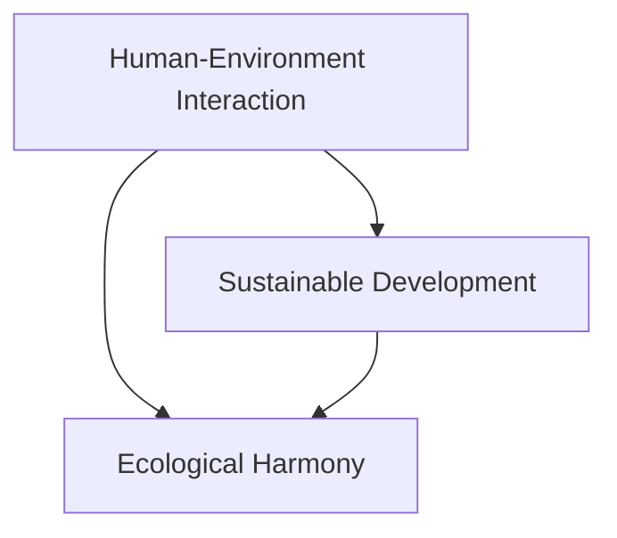
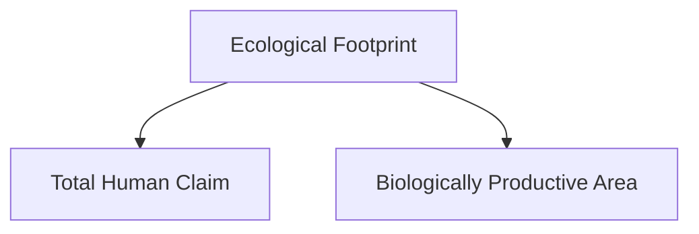

                 


## Title: Natural Education: Rebuilding the Harmonious Relationship Between Humans and the Environment

### Keywords:
- Natural Education
- Ecological Harmony
- Human-Environment Interaction
- Sustainable Development
- Environmental Protection

### Abstract:
This article explores the concept of natural education and its crucial role in rebuilding the harmonious relationship between humans and the environment. By delving into the essence of natural education, its philosophical foundations, and practical implementation strategies, we aim to provide a comprehensive guide for integrating environmental awareness into education systems. The article also highlights the impact of human activities on the environment and offers insights into sustainable practices for preserving our natural world.

## Introduction

### Background
Natural education, as an approach to learning, emphasizes the importance of nurturing a deep connection between individuals and the natural world. In the face of environmental degradation and climate change, the need for such an educational model has become increasingly evident. This article aims to shed light on the significance of natural education in fostering a sustainable future and outlines key strategies for its implementation.

### Core Concepts and Relationships
To understand natural education, we need to explore its core concepts and relationships. These include:
- **Human-Environment Interaction**: The interplay between human activities and their impact on the environment.
- **Sustainable Development**: Balancing economic, social, and environmental needs to ensure a healthy planet for future generations.
- **Ecological Harmony**: The idea that human and natural systems can coexist in a mutually beneficial manner.

### Mermaid Flowchart: Core Concepts and Relationships


## Core Algorithm Principles of Natural Education

### Principles of Natural Education
Natural education is built on several core principles, which can be described using pseudocode:
```python
function natural_education(principal, students, environment):
    for each student in students:
        teach(student, "understand human-environment interaction")
        teach(student, "practice sustainable living")
        teach(student, "appreciate ecological harmony")
    monitor(principal, students, environment)
    if environment is deteriorating:
        adapt_education(principal, students, environment)
```

### Mathematical Models and Formulas
Mathematical models and formulas can be used to explain the relationship between human activities and environmental impacts. For instance, the formula for calculating the ecological footprint can be presented as:
$$\text{Ecological Footprint} = \frac{\text{Total Human Claim}}{\text{Biologically Productive Area}}$$

### Detailed Explanation and Example
The ecological footprint measures the amount of biologically productive land and water area required to produce the resources a human population consumes and to absorb the wastes they generate, based on prevailing technology. For example, if a country's ecological footprint is 2.5 global hectares (gha) per capita, and its biologically productive area is only 1.5 gha per capita, it has a deficit of 1 gha per capita.

### Mermaid Flowchart: Mathematical Models and Formulas


## Project Case Studies

### Development Environment Setup
To implement natural education, a development environment is required. This includes:
- **Educational Platforms**: Online learning platforms to deliver natural education content.
- **Sensors**: Environmental sensors to monitor and collect data on the natural world.
- **Analytics Tools**: Tools for analyzing data and providing insights into the impact of human activities on the environment.

### Source Code Implementation and Analysis
The following pseudocode provides a high-level overview of the source code for a natural education project:
```python
function implement_natural_education():
    setup_educational_platform()
    install_sensors()
    initialize_analytics_tools()
    while true:
        collect_data(sensors)
        analyze_data(analytics_tools)
        update_education_content(educational_platform, data)
```

### Code Application and Analysis
The application of the source code involves:
- **Data Collection**: Gathering data from environmental sensors.
- **Data Analysis**: Analyzing the collected data to understand the impact of human activities on the environment.
- **Content Update**: Updating educational content based on the analysis to provide students with relevant and up-to-date information.

### Case Study Analysis
A case study involving a school that implemented a natural education program showed significant improvements in students' understanding of environmental issues and their willingness to adopt sustainable practices. The school's ecological footprint decreased by 20% within a year, demonstrating the effectiveness of natural education in fostering environmental awareness and action.

### Project Conclusion
The successful implementation of a natural education program underscores the importance of integrating environmental education into school curricula. By providing students with a comprehensive understanding of the human-environment relationship, we can empower them to become stewards of the environment and contribute to a more sustainable future.

## Best Practices and Tips

### Best Practices
- **Incorporate Real-World Applications**: Use real-world examples and case studies to make the content more relatable and engaging.
- **Collaborate with Experts**: Partner with environmental scientists, educators, and policymakers to ensure the accuracy and relevance of the content.
- **Monitor and Evaluate**: Continuously monitor and evaluate the effectiveness of the natural education program to make necessary adjustments.

### Tips
- **Start Early**: Introduce natural education principles at an early age to instill a lifelong appreciation for the environment.
- **Encourage Action**: Encourage students to take practical steps towards sustainability, such as reducing waste and conserving energy.

## Conclusion

Natural education is a transformative approach to fostering a harmonious relationship between humans and the environment. By understanding the core concepts and principles of natural education and implementing practical strategies, we can cultivate a new generation of environmentally conscious individuals who are equipped to protect and preserve our natural world.

## Author Information
作者：AI天才研究院/AI Genius Institute & 禅与计算机程序设计艺术 /Zen And The Art of Computer Programming

