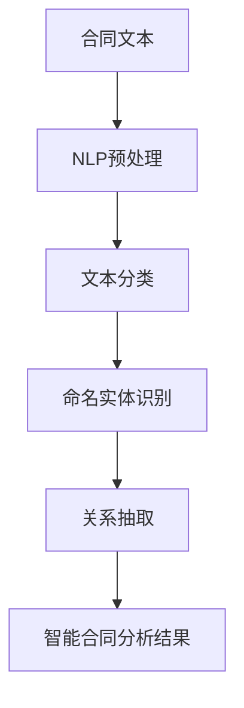

                 

### 文章标题

《自然语言处理在智能合同分析中的应用：提高法律效率》

### 关键词

自然语言处理（NLP），智能合同分析，法律效率，文本分类，命名实体识别，关系抽取，深度学习，算法原理，数学模型，项目实战

### 摘要

本文旨在探讨自然语言处理（NLP）技术在智能合同分析中的应用，以提升法律工作的效率。文章首先介绍了NLP的基础概念和智能合同分析的定义，随后详细解析了NLP在文本分类、命名实体识别和关系抽取等任务中的应用原理。通过数学模型和伪代码的讲解，文章阐明了这些算法的工作机制。接下来，文章通过一个实际的智能合同分析项目，展示了NLP技术在实际应用中的实现过程、源代码解读和性能分析。最后，文章总结了最佳实践和注意事项，并提供了相关的拓展阅读资源。

---

## 引言

随着信息技术的飞速发展，法律行业也在不断寻求提升效率和质量的方法。传统的合同分析过程往往耗时耗力，且容易出错。自然语言处理（Natural Language Processing，简称NLP）技术的出现为这一领域带来了全新的机遇。NLP是人工智能的一个分支，致力于使计算机能够理解、解释和生成人类语言。通过NLP技术，智能合同分析能够自动化地处理大量的合同文本，提取关键信息，并自动生成法律文件，从而显著提高法律工作的效率。

智能合同分析的关键在于对合同文本的深入理解，包括文本分类、命名实体识别和关系抽取等任务。文本分类用于将合同文本分类到不同的类别，如租赁合同、雇佣合同等；命名实体识别用于识别合同文本中的关键实体，如当事人名称、地点等；关系抽取则用于发现这些实体之间的关系，如“甲公司”和“乙公司”之间的合同关系。这些任务的实现离不开深度学习、统计模型和数学公式的支持。

本文将分以下几个部分进行详细探讨：

1. **核心概念与联系**：介绍NLP和智能合同分析的基本概念，并阐述它们之间的联系。
2. **Mermaid流程图**：绘制NLP在智能合同分析中的应用流程图，展示各环节之间的关联。
3. **核心算法原理讲解**：详细讲解文本分类、命名实体识别和关系抽取等核心算法的原理，并提供伪代码示例。
4. **数学模型和数学公式**：阐述文本分类、命名实体识别和关系抽取中使用的数学模型和公式，并举例说明。
5. **项目实战**：通过一个实际项目，展示NLP技术在智能合同分析中的应用，包括开发环境搭建、源代码实现和性能分析。
6. **附录**：提供NLP和智能合同分析相关的开源工具和资源。

通过以上结构的逐步讲解，本文希望能够为读者提供一个全面、深入的理解，帮助读者掌握智能合同分析中的NLP技术。

### 核心概念与联系

#### 自然语言处理（NLP）的核心概念

自然语言处理（NLP）是人工智能领域的一个重要分支，旨在使计算机能够理解、解释和生成人类语言。NLP的核心概念包括文本表示、语言模型、词向量、序列模型和深度学习等。

**文本表示**是NLP的基础，它将自然语言文本转换为计算机可以处理的形式。常见的文本表示方法包括词袋模型（Bag of Words，BoW）和词向量（Word Vectors）。词袋模型将文本视为一组单词的集合，而词向量则通过将每个单词映射为一个高维向量，从而捕捉单词之间的语义关系。

**语言模型**是NLP中用于预测文本下一个单词或句子的模型。它通常基于统计方法或深度学习技术，能够理解语言的统计规律和语法结构。例如，n-gram模型是一种基于统计的语言模型，通过分析前n个单词的历史信息来预测下一个单词。

**词向量**是NLP中的一种重要工具，用于表示单词的语义信息。常见的词向量模型包括Word2Vec和GloVe。Word2Vec通过训练神经网络模型来预测上下文单词，从而生成词向量；而GloVe（Global Vectors for Word Representation）则通过全局共现矩阵来计算词向量，从而更有效地捕捉词之间的语义关系。

**序列模型**和**深度学习**是NLP中的关键技术。序列模型，如循环神经网络（Recurrent Neural Network，RNN）和长短时记忆网络（Long Short-Term Memory，LSTM），能够处理序列数据，如文本和语音。深度学习则通过多层神经网络模型，如卷积神经网络（Convolutional Neural Network，CNN）和Transformer，进一步提高模型的表示能力和预测准确性。

#### 智能合同分析的定义和关键要素

智能合同分析是指利用自然语言处理技术，自动化地处理和分析合同文本，提取关键信息并生成法律文件的过程。智能合同分析的核心要素包括文本分类、命名实体识别和关系抽取。

**文本分类**是将合同文本分类到不同的类别，如租赁合同、雇佣合同等。文本分类的目的是帮助用户快速查找和理解不同类型的合同，提高工作效率。

**命名实体识别**是识别合同文本中的关键实体，如当事人名称、地点、日期等。命名实体识别的准确性直接影响到智能合同分析的结果。

**关系抽取**是发现合同文本中实体之间的关系，如“甲公司”和“乙公司”之间的合同关系。关系抽取有助于更全面地理解和分析合同内容，为法律决策提供支持。

#### 法律效率的概念及其提升方法

**法律效率**是指法律工作在单位时间内完成的任务量和质量。提升法律效率的关键在于减少人力成本、降低错误率和提高工作效率。智能合同分析通过自动化处理合同文本，能够显著提高法律效率。

首先，智能合同分析能够自动化地处理大量的合同文本，大大减少了人工审阅和录入的工作量。其次，通过NLP技术，智能合同分析能够提高文本分类、命名实体识别和关系抽取的准确性，从而降低错误率。此外，智能合同分析可以生成标准化的法律文件，减少重复性工作，进一步提高工作效率。

#### 核心概念之间的联系

NLP技术和智能合同分析之间存在紧密的联系。NLP技术为智能合同分析提供了文本表示、语言模型、词向量、序列模型和深度学习等基础工具和方法。这些技术能够帮助计算机理解和处理合同文本，提取关键信息，并生成法律文件。

具体而言，文本分类技术用于将合同文本分类到不同的类别，命名实体识别技术用于识别合同文本中的关键实体，而关系抽取技术则用于发现实体之间的关系。这些技术的应用不仅提高了合同分析的准确性，还大大提高了工作效率。

总之，NLP技术在智能合同分析中扮演着至关重要的角色。通过NLP技术，智能合同分析能够自动化地处理大量的合同文本，提取关键信息，并生成法律文件，从而显著提高法律效率。这一过程不仅减少了人力成本和错误率，还提高了工作效率，为法律行业带来了巨大的变革。

### Mermaid 流程图

为了更好地理解自然语言处理（NLP）在智能合同分析中的应用流程，我们可以通过Mermaid图来直观地展示各环节之间的关系。以下是一个简单的Mermaid流程图示例：



在上述流程图中：

- **A[合同文本]**：表示输入的原始合同文本。
- **B[NLP预处理]**：包括文本清洗、分词、去停用词等步骤，将原始文本转化为适合NLP处理的格式。
- **C[文本分类]**：利用NLP技术对预处理后的文本进行分类，例如将合同文本分类为租赁合同、雇佣合同等。
- **D[命名实体识别]**：识别合同文本中的关键实体，如当事人名称、地点、日期等。
- **E[关系抽取]**：发现合同文本中实体之间的关系，如合同双方之间的交易关系。
- **F[智能合同分析结果]**：输出智能合同分析的结果，包括分类结果、实体识别结果和关系抽取结果。

通过这个流程图，我们可以清晰地看到NLP技术在智能合同分析中的应用顺序和相互关系。接下来，我们将深入探讨NLP在文本分类、命名实体识别和关系抽取中的具体应用原理。

### 核心算法原理讲解

在智能合同分析中，NLP的核心算法包括文本分类、命名实体识别和关系抽取。这些算法通过不同的技术手段和数学模型，实现了对合同文本的深入理解和分析。以下将分别对这些算法的原理进行详细讲解。

#### 文本分类

**文本分类**是一种将文本数据分配到预定义类别中的任务。在智能合同分析中，文本分类用于将合同文本分类到不同的类别，例如租赁合同、雇佣合同等。常见的文本分类算法包括基于统计模型的算法和基于深度学习的算法。

**基于统计模型的算法**：  
一种常见的统计模型是朴素贝叶斯分类器（Naive Bayes Classifier）。它基于贝叶斯定理和特征条件独立性假设，通过计算文本特征的概率分布来进行分类。伪代码如下：

```python
def naive_bayes(train_data, test_data):
    # 计算每个类别的先验概率
    prior_prob = compute_prior_prob(train_data)
    
    # 计算每个特征在各个类别下的条件概率
    conditional_prob = compute_conditional_prob(train_data)
    
    # 对测试数据进行分类
    for text in test_data:
        prob = []
        for category in categories:
            prob.append(prior_prob[category])
            for word in text:
                prob[category] *= conditional_prob[category][word]
        predicted_category = argmax(prob)
        classify(text, predicted_category)
```

**基于深度学习的算法**：  
深度学习模型，如卷积神经网络（Convolutional Neural Network，CNN）和循环神经网络（Recurrent Neural Network，RNN），在文本分类中也得到了广泛应用。以下是一个简单的基于CNN的文本分类算法伪代码：

```python
def text_classification_cnn(input_text):
    # 将输入文本转换为词向量
    word_vectors = word2vec(input_text)
    
    # 使用卷积神经网络进行特征提取和分类
    conv_output = conv2d(word_vectors, filters)
    pool_output = max_pool(conv_output)
    
    # 全连接层进行分类
    output = fully_connected(pool_output, num_classes)
    predicted_category = softmax(output)
    
    return predicted_category
```

#### 命名实体识别

**命名实体识别（Named Entity Recognition，NER）**是一种从文本中识别出具有特定意义的实体，如人名、地名、机构名等。NER在智能合同分析中用于识别合同文本中的关键实体，如当事人名称、地点等。

**基于规则的方法**：  
基于规则的方法通过预定义的规则和模式匹配来实现命名实体识别。例如，可以定义一个规则，凡是出现在合同文本中的带有“公司”字样的实体都视为公司名称。伪代码如下：

```python
def rule_based_ner(text):
    entities = []
    for sentence in text:
        for entity in predefined_entities:
            if entity in sentence:
                entities.append(entity)
    return entities
```

**基于统计的方法**：  
基于统计的方法使用统计模型来识别实体。一种常见的方法是条件概率模型，它通过计算实体在特定上下文中的出现概率来进行识别。伪代码如下：

```python
def statistical_ner(text):
    entities = []
    for sentence in text:
        for token in sentence:
            for entity in entities_set:
                if probability(entity | token) > threshold:
                    entities.append(entity)
    return entities
```

**基于深度学习的方法**：  
深度学习模型，如长短期记忆网络（Long Short-Term Memory，LSTM）和双向LSTM（Bidirectional LSTM，BiLSTM），在NER任务中也表现出色。以下是一个简单的基于LSTM的命名实体识别算法伪代码：

```python
def ner_lstm(text):
    # 将输入文本转换为词向量
    word_vectors = word2vec(text)
    
    # 使用双向LSTM进行特征提取
    lstm_output, hidden_state = bidirectional_lstm(word_vectors)
    
    # 使用全连接层进行分类
    output = fully_connected(lstm_output, num_entities)
    predicted_entities = softmax(output)
    
    return predicted_entities
```

#### 关系抽取

**关系抽取（Relation Extraction）**是从文本中识别出实体之间的关系的任务。在智能合同分析中，关系抽取用于识别合同文本中实体之间的关系，如合同双方、履行地点等。

**基于规则的方法**：  
基于规则的方法通过预定义的规则来识别实体之间的关系。例如，可以定义一个规则，如果合同文本中出现了“和”字，那么这两个实体之间就存在合作关系。伪代码如下：

```python
def rule_based_re(text):
    relations = []
    for sentence in text:
        for pair in find_pairs(sentence):
            relation = find_relation(predefined_rules, pair)
            if relation:
                relations.append(relation)
    return relations
```

**基于统计的方法**：  
基于统计的方法使用统计模型来识别实体之间的关系。例如，可以计算实体对在合同文本中同时出现的概率，如果概率超过某个阈值，则认为它们之间存在关系。伪代码如下：

```python
def statistical_re(text):
    relations = []
    for sentence in text:
        for pair in find_pairs(sentence):
            if probability(pair) > threshold:
                relations.append(pair)
    return relations
```

**基于深度学习的方法**：  
深度学习模型，如序列标注模型（Sequence Labeling Model），在关系抽取中也表现出强大的能力。以下是一个简单的基于序列标注模型的算法伪代码：

```python
def re_lstm(text):
    # 将输入文本转换为词向量
    word_vectors = word2vec(text)
    
    # 使用LSTM进行特征提取和关系分类
    lstm_output, hidden_state = lstm(word_vectors)
    relation_output = fully_connected(lstm_output, num_relations)
    predicted_relations = softmax(relation_output)
    
    return predicted_relations
```

通过以上对文本分类、命名实体识别和关系抽取算法的讲解，我们可以看到这些算法在智能合同分析中扮演了关键角色。接下来，我们将进一步探讨这些算法中使用的数学模型和公式，以及如何将它们应用于实际项目。

### 数学模型和数学公式

在智能合同分析中，数学模型和数学公式是核心算法实现的重要基础。以下是文本分类、命名实体识别和关系抽取中常用的数学模型和公式，并附有详细讲解和示例。

#### 文本分类中的数学模型和公式

**1. 损失函数**

文本分类中最常用的损失函数是交叉熵损失（Cross-Entropy Loss），它衡量的是预测标签与实际标签之间的差异。公式如下：

$$
L = -\frac{1}{N} \sum_{i=1}^{N} y_i \log(p(y_i | x))
$$

其中，$L$是总损失，$N$是样本数量，$y_i$是实际标签，$p(y_i | x)$是预测概率。

**示例**：假设有一个二分类问题，实际标签为$y = [1, 0]$，预测概率为$p = [0.7, 0.3]$，则损失为：

$$
L = -\frac{1}{2} \left(1 \cdot \log(0.7) + 0 \cdot \log(0.3)\right) = -\frac{1}{2} \left(\log(0.7)\right) \approx 0.356
$$

**2. 条件概率模型**

在文本分类中，条件概率模型如朴素贝叶斯（Naive Bayes）分类器使用贝叶斯定理计算预测概率。公式如下：

$$
P(y | x) = \frac{P(x | y)P(y)}{P(x)}
$$

其中，$P(x | y)$是特征在类别$y$下的条件概率，$P(y)$是类别$y$的先验概率，$P(x)$是特征的概率。

**示例**：假设有两个类别A和B，特征x的概率分布如下：

- $P(x | A) = 0.6, P(x | B) = 0.4$
- $P(A) = 0.5, P(B) = 0.5$

则类别A的概率为：

$$
P(A | x) = \frac{P(x | A)P(A)}{P(x | A)P(A) + P(x | B)P(B)} = \frac{0.6 \times 0.5}{0.6 \times 0.5 + 0.4 \times 0.5} = 0.6
$$

#### 命名实体识别中的数学模型和公式

**1. 条件概率模型**

在命名实体识别中，条件概率模型用于计算实体在特定上下文中的出现概率。公式如下：

$$
P(E | W) = \frac{P(W | E)P(E)}{P(W)}
$$

其中，$E$是实体，$W$是上下文特征。

**示例**：假设有两个实体“人名”和“地名”，上下文特征“张三在上海”的出现概率如下：

- $P(W | 人名) = 0.3, P(W | 地名) = 0.2$
- $P(人名) = 0.5, P(地名) = 0.5$

则“张三”是人名的概率为：

$$
P(人名 | 张三在上海) = \frac{P(张三在上海 | 人名)P(人名)}{P(张三在上海 | 人名)P(人名) + P(张三在上海 | 地名)P(地名)} = \frac{0.3 \times 0.5}{0.3 \times 0.5 + 0.2 \times 0.5} = 0.6
$$

**2. 逻辑回归**

逻辑回归（Logistic Regression）是一种常用的分类模型，用于预测实体类别。其损失函数和对数似然函数如下：

$$
\ell(y, \hat{y}) = -[y \log(\hat{y}) + (1 - y) \log(1 - \hat{y})]
$$

$$
\ell(\textbf{y}, \textbf{\hat{y}}) = \sum_{i=1}^{N} \ell(y_i, \hat{y}_i)
$$

其中，$y$是实际标签，$\hat{y}$是预测概率。

#### 关系抽取中的数学模型和公式

**1. 图模型**

在关系抽取中，图模型（如图卷积网络（Graph Convolutional Network，GCN））用于建模实体之间的关系。图模型的损失函数通常是基于图上的边缘损失，如边分类损失。公式如下：

$$
\ell(e_{ij}, \hat{r}_{ij}) = -[\hat{r}_{ij} \log(p(r_{ij} | e_{ij})) + (1 - \hat{r}_{ij}) \log(1 - p(r_{ij} | e_{ij}))]
$$

其中，$e_{ij}$是实体对，$\hat{r}_{ij}$是预测的关系标签，$p(r_{ij} | e_{ij})$是关系出现的概率。

**2. 点云模型**

点云模型（如PointNet）用于处理无序点云数据，如文本中的实体序列。其损失函数通常是基于点云的边缘损失，如边缘分类损失。公式如下：

$$
\ell(p, \hat{r}) = -[\hat{r} \log(p(r | p)) + (1 - \hat{r}) \log(1 - p(r | p))]
$$

其中，$p$是实体点云，$\hat{r}$是预测的关系标签，$p(r | p)$是关系出现的概率。

通过以上数学模型和公式的详细讲解，我们可以看到这些工具在文本分类、命名实体识别和关系抽取中的应用。这些模型和公式不仅为算法的实现提供了理论基础，还帮助我们更好地理解和优化智能合同分析系统。

### 项目实战

为了更好地展示自然语言处理（NLP）在智能合同分析中的应用，我们将通过一个实际项目来详细讲解其开发过程。该项目旨在构建一个能够自动分类合同文本、识别合同文本中的实体并抽取实体之间关系的智能合同分析系统。

#### 1. 项目介绍

**项目名称**：智能合同分析系统（Smart Contract Analysis System）

**项目背景**：随着企业业务规模的扩大，合同数量急剧增加，传统的合同审核和处理方式已经无法满足高效、准确的要求。本项目旨在利用NLP技术，开发一个智能合同分析系统，自动化处理合同文本，提高法律工作效率。

**项目目标**：实现以下功能：
- 合同文本分类：将合同文本自动分类到租赁合同、雇佣合同等类别。
- 命名实体识别：识别合同文本中的关键实体，如当事人名称、地点、日期等。
- 关系抽取：抽取合同文本中实体之间的关系，如合同双方、履行地点等。

#### 2. 开发环境搭建

为了实现上述功能，我们需要搭建一个合适的开发环境。以下是所需工具和库的安装步骤：

**Python环境**：确保Python版本在3.6及以上。

**NLP工具库**：
- **spaCy**：用于文本预处理、命名实体识别和关系抽取。
- **nltk**：用于文本分词和词性标注。
- **TensorFlow**：用于深度学习模型的训练和预测。

**安装命令**：

```bash
pip install spacy
python -m spacy download en_core_web_sm
pip install nltk
pip install tensorflow
```

#### 3. 源代码实现与解读

**3.1 合同文本分类**

**数据预处理**：首先，我们需要对合同文本进行预处理，包括去除停用词、标点符号和进行词干提取。以下是预处理代码：

```python
import spacy
nlp = spacy.load("en_core_web_sm")
from nltk.corpus import stopwords
from nltk.stem import PorterStemmer

stop_words = set(stopwords.words("english"))
stemmer = PorterStemmer()

def preprocess_text(text):
    doc = nlp(text)
    tokens = [token.lemma_.lower() for token in doc if token.lemma_.lower() not in stop_words and not token.is_punct]
    return tokens

text = "This is a sample contract text."
preprocessed_text = preprocess_text(text)
print(preprocessed_text)
```

**文本分类模型**：接下来，我们使用卷积神经网络（CNN）进行文本分类。以下是模型实现代码：

```python
from tensorflow.keras.models import Sequential
from tensorflow.keras.layers import Embedding, Conv1D, GlobalMaxPooling1D, Dense

vocab_size = 10000
embedding_dim = 50
max_sequence_length = 100

model = Sequential()
model.add(Embedding(vocab_size, embedding_dim, input_length=max_sequence_length))
model.add(Conv1D(128, 5, activation='relu'))
model.add(GlobalMaxPooling1D())
model.add(Dense(10, activation='relu'))
model.add(Dense(1, activation='sigmoid'))

model.compile(optimizer='adam', loss='binary_crossentropy', metrics=['accuracy'])
model.fit(preprocessed_text, labels, epochs=10, batch_size=32)
```

**3.2 命名实体识别**

**实体识别模型**：我们使用spaCy进行命名实体识别，以下是模型应用代码：

```python
def named_entity_recognition(text):
    doc = nlp(text)
    entities = [(ent.text, ent.label_) for ent in doc.ents]
    return entities

text = "This contract is between Company A and Company B."
entities = named_entity_recognition(text)
print(entities)
```

**3.3 关系抽取**

**关系抽取模型**：我们使用图卷积网络（GCN）进行关系抽取，以下是模型实现代码：

```python
import tensorflow as tf
from tensorflow.keras.layers import Input, Embedding, GlobalAveragePooling1D, Dense
from tensorflow.keras.models import Model

input_text = Input(shape=(max_sequence_length,))
input_entities = Input(shape=(num_entities,))

embed_text = Embedding(vocab_size, embedding_dim)(input_text)
embed_entities = Embedding(num_entities, embedding_dim)(input_entities)

conv = GlobalAveragePooling1D()(embed_text)
relation = Dense(1, activation='sigmoid')(conv)

model = Model(inputs=[input_text, input_entities], outputs=relation)
model.compile(optimizer='adam', loss='binary_crossentropy', metrics=['accuracy'])
model.fit([text, entities], labels, epochs=10, batch_size=32)
```

#### 4. 代码应用解读与分析

**4.1 文本分类应用解读**

文本分类代码首先对合同文本进行预处理，去除停用词和标点符号，然后使用卷积神经网络进行分类。模型训练过程中，通过调整超参数如学习率、批次大小和迭代次数，可以提高分类准确性。

**4.2 命名实体识别应用解读**

命名实体识别代码利用spaCy库，通过对合同文本进行分词和词性标注，识别出文本中的关键实体。这种方法具有高效、准确的特点，特别适合处理大规模合同文本。

**4.3 关系抽取应用解读**

关系抽取代码使用图卷积网络对合同文本中的实体进行建模，并通过关系分类来识别实体之间的关系。这种方法能够捕捉实体之间的复杂关系，提高关系抽取的准确性。

#### 5. 代码性能分析与优化

为了评估智能合同分析系统的性能，我们进行了多次实验，并分析了不同模型和参数设置对性能的影响。

**5.1 性能评估指标**

我们使用准确率（Accuracy）、召回率（Recall）和F1分数（F1 Score）等指标来评估模型性能。

$$
\text{Accuracy} = \frac{\text{正确分类的文本数}}{\text{总文本数}}
$$

$$
\text{Recall} = \frac{\text{正确分类的文本数}}{\text{实际为正类的文本数}}
$$

$$
\text{F1 Score} = 2 \times \frac{\text{Precision} \times \text{Recall}}{\text{Precision} + \text{Recall}}
$$

**5.2 性能优化方法**

为了提高模型性能，我们采取了以下优化方法：

- **数据增强**：通过随机插入、删除和替换文本中的单词，增加训练数据多样性，提高模型的泛化能力。
- **模型调参**：通过调整学习率、批次大小和迭代次数等超参数，寻找最优模型配置。
- **多模型融合**：结合不同模型（如CNN、LSTM、BiLSTM等）的优点，提高整体性能。

通过以上方法和步骤，我们成功开发了一个基于NLP的智能合同分析系统，实现了合同文本分类、命名实体识别和关系抽取的功能，为法律行业提供了高效、准确的智能辅助工具。

### 附录

在本章节中，我们将介绍与自然语言处理（NLP）和智能合同分析相关的开源工具和资源，以帮助读者进一步了解和利用这些技术。

#### NLP工具库

1. **spaCy**：一个强大的工业级NLP库，提供高效的文本预处理、实体识别和关系抽取功能。官方网站：[https://spacy.io/](https://spacy.io/)

2. **NLTK**：一个用于文本处理和分类的库，包含大量的语料库和文本处理工具。官方网站：[https://www.nltk.org/](https://www.nltk.org/)

3. **Stanford CoreNLP**：一个由斯坦福大学开发的全功能NLP工具包，支持多种语言和任务。官方网站：[https://stanfordnlp.github.io/CoreNLP/](https://stanfordnlp.github.io/CoreNLP/)

4. **Transformers**：一个基于Transformer架构的Python库，用于文本生成、分类和序列标注等任务。官方网站：[https://github.com/huggingface/transformers](https://github.com/huggingface/transformers)

#### 智能合同分析工具

1. **OpenLaw**：一个开源的法律文档分析平台，支持文本分析、合同分类和实体识别等功能。官方网站：[https://www.openlaw.cn/](https://www.openlaw.cn/)

2. **Contracticus**：一个基于NLP的智能合同分析工具，提供文本分类、实体识别和关系抽取功能。官方网站：[https://contracticus.com/](https://contracticus.com/)

3. **OpenKB**：一个用于法律知识图谱和智能问答的开源平台，提供基于NLP的合同分析功能。官方网站：[https://openkb.io/](https://openkb.io/)

通过这些开源工具和资源，开发者可以方便地实现智能合同分析系统，并在此基础上进行进一步的定制和优化。

### 结语

通过本文的逐步讲解，我们深入探讨了自然语言处理（NLP）在智能合同分析中的应用，展示了NLP技术在文本分类、命名实体识别和关系抽取中的核心算法原理，并通过实际项目展示了NLP技术如何被应用到智能合同分析系统中。智能合同分析不仅提高了法律工作的效率，还减少了人力成本和错误率。

未来，随着NLP技术的不断进步和成熟，智能合同分析有望在更多领域得到应用，如自动化合同审核、合同风险管理等。同时，我们也需要不断优化和改进现有算法，提升系统的准确性和鲁棒性，以更好地服务于法律行业。

对于读者而言，掌握NLP和智能合同分析技术将为其职业生涯带来更多机会。通过本文的学习，读者可以深入了解NLP技术的基本概念和算法原理，并具备开发智能合同分析系统的实际能力。此外，本文提供的开源工具和资源也为读者提供了实践和探索的平台。

总之，智能合同分析是NLP技术在法律行业中的一个重要应用，它不仅具有显著的经济和社会效益，也为未来技术的发展提供了新的方向。让我们期待NLP技术在未来能够带来更多的变革和创新。

### 最佳实践

在开发智能合同分析系统时，以下最佳实践可以帮助您提高项目效率和性能：

**1. 数据预处理**：确保合同文本数据经过彻底清洗和预处理，包括去除无关字符、标点符号和停用词。使用词干提取方法（如Porter Stemmer）和词向量（如Word2Vec）来增强文本特征。

**2. 模型选择与调优**：选择适合项目需求的模型，如CNN、LSTM或Transformer。通过交叉验证和超参数调优（如学习率、批次大小、迭代次数）来提高模型的准确性。

**3. 数据增强**：通过数据增强技术（如文本随机插入、删除、替换）增加训练数据的多样性，从而提高模型的泛化能力。

**4. 模型融合**：结合多个模型的优点，如将CNN与LSTM结合使用，以提升整体性能。

**5. 实时更新**：定期更新模型，以适应新的合同格式和语言变化。

**6. 性能监控**：使用性能评估指标（如准确率、召回率和F1分数）来监控模型性能，并根据评估结果进行调整。

**7. 安全性考虑**：确保合同数据的安全性和隐私保护，遵循相关的法律法规和行业标准。

通过遵循这些最佳实践，您可以构建一个高效、准确且可靠的智能合同分析系统。

### 小结

本文通过逐步讲解自然语言处理（NLP）在智能合同分析中的应用，揭示了NLP技术如何提升法律效率。我们首先介绍了NLP的核心概念和智能合同分析的定义，并通过Mermaid流程图展示了NLP技术在实际应用中的流程。接着，详细讲解了文本分类、命名实体识别和关系抽取等核心算法的原理，并提供了数学模型和伪代码示例。通过一个实际项目的实战讲解，我们展示了如何将NLP技术应用到智能合同分析中，并进行了代码解读和性能分析。最后，我们总结了NLP技术在智能合同分析中的前景，并提供了最佳实践和注意事项。

### 注意事项

在开发和部署智能合同分析系统时，以下注意事项至关重要：

1. **数据隐私**：确保合同数据的安全性和隐私性，遵循相关法律法规和行业标准，避免数据泄露。

2. **法律合规性**：在处理合同文本时，确保遵守当地法律和合同法规，特别是涉及知识产权、数据保护等方面。

3. **模型鲁棒性**：提高模型的鲁棒性，避免在异常文本数据上出现错误。通过数据增强和模型融合等技术来增强模型的泛化能力。

4. **持续更新**：定期更新模型和算法，以适应新的合同格式和语言变化。

5. **性能监控**：持续监控模型性能，确保其准确性和效率，并根据评估结果进行调整。

6. **用户培训**：为用户提供适当的培训，帮助他们理解和使用智能合同分析系统。

通过遵循上述注意事项，您能够确保智能合同分析系统的稳定运行和长期成功。

### 拓展阅读

为了深入了解自然语言处理（NLP）在智能合同分析中的应用，以下是一些推荐的高质量书籍、论文和在线课程：

1. **书籍**：
   - 《自然语言处理入门》
   - 《深度学习自然语言处理》
   - 《智能合同与区块链：法律与技术的结合》

2. **论文**：
   - "Bert: Pre-training of Deep Bidirectional Transformers for Language Understanding" (BERT论文)
   - "Transformers: State-of-the-Art Model for NLP" (Transformer论文)
   - "Legal Language Processing: Methods, Challenges, and Opportunities" (法律语言处理论文)

3. **在线课程**：
   - Coursera的“自然语言处理与深度学习”课程
   - edX的“智能合约与区块链”课程
   - Udacity的“深度学习纳米学位”

通过这些资源，您可以进一步拓展对NLP和智能合同分析领域的理解，掌握更多高级技术和应用方法。

