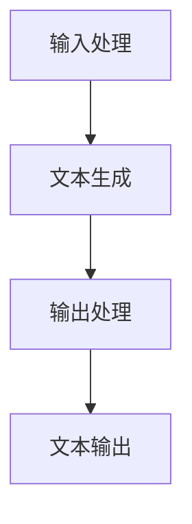

                 

### 引言

#### 1.1 背景

在当今的信息时代，科研写作成为了科研工作的重要组成部分。然而，随着科学研究的复杂性和多样性的增加，科研写作的任务也变得日益繁重。传统的手工写作方式不仅效率低下，而且难以保证高质量的文本生成。因此，自动化科技写作成为了一个备受关注的研究领域。

自然语言生成（Natural Language Generation，NLG）是人工智能（AI）领域的一个重要分支，旨在通过计算机程序生成具有人类语言特性的文本。NLG技术可以广泛应用于自动化写作，如新闻报道、金融报告、法律文档等。在科研写作领域，NLG技术同样具有巨大的应用潜力，可以显著提高写作效率，降低写作成本，并且有助于保证文本的一致性和准确性。

#### 1.2 书籍目标与读者对象

本书的目标是深入探讨自然语言生成技术在自动化科技写作中的应用，旨在为科研人员、出版社以及相关从业者提供一套实用的解决方案。通过本书，读者可以：

1. 理解自然语言生成的核心概念和技术原理；
2. 掌握自动化科技写作的需求分析、技术挑战和解决方案；
3. 学习文本生成模型、序列到序列模型和预训练模型等核心算法；
4. 分析实际应用案例，包括科研论文摘要生成、科技新闻撰写和学术论文全文生成；
5. 获得未来发展趋势、挑战与机遇的洞察。

本书的目标读者包括：

1. 对自然语言处理（NLP）和自动化写作有一定了解，但希望在科研写作领域应用的读者；
2. 自然语言生成领域的科研人员和技术开发者；
3. 出版社、学术机构等相关从业者。

#### 1.3 内容概述

本书将分为以下几个部分：

1. 引言：介绍自然语言生成在自动化科技写作中的应用背景和目标读者。
2. 自然语言生成（NLG）概述：介绍NLG的定义、发展历程和分类。
3. 自动化科技写作：分析科研写作的需求、技术挑战和解决方案。
4. 核心算法原理：讲解文本生成模型、序列到序列模型和预训练模型等核心算法。
5. 实际应用案例：分析科研论文摘要生成、科技新闻撰写和学术论文全文生成的实际应用案例。
6. 总结与展望：总结本书的主要内容和未来发展趋势。

### 自然语言生成（NLG）概述

#### 2.1 NLG定义

自然语言生成（NLG）是指利用计算机程序自动生成具有自然语言特性的文本的技术。NLG的目标是将结构化数据转换为自然语言的描述，从而实现信息的自动化生成和传播。NLG的核心在于理解和生成自然语言，包括语法、语义、语用等多个层面。

#### 2.2 NLG发展历程

NLG技术的发展可以追溯到20世纪50年代。早期的研究主要集中在规则驱动的方法，通过定义一系列规则来生成文本。这种方法虽然简单直观，但难以处理复杂和变化的文本内容。随着计算机科学和人工智能技术的发展，数据驱动的方法逐渐兴起。20世纪80年代，统计方法开始应用于NLG，提高了文本生成的质量和效率。进入21世纪，深度学习技术的发展为NLG带来了新的突破。基于神经网络的文本生成模型，如序列到序列模型（Seq2Seq）和变压器模型（Transformer），在自然语言生成领域取得了显著的成果。

#### 2.3 NLG分类

NLG技术可以根据生成策略的不同进行分类。常见的分类方法包括：

1. **模板生成**：基于预定义的模板和规则，将输入数据填充到模板中生成文本。这种方法简单高效，但生成的文本缺乏灵活性和多样性。
2. **规则生成**：通过定义一组规则来生成文本。这些规则可以是基于语法、语义或语用的约束条件。规则生成的方法可以生成更加复杂和丰富的文本，但规则的编写和维护成本较高。
3. **数据驱动生成**：利用大量的数据来训练模型，从而实现自动生成文本。数据驱动的方法包括基于统计的方法和基于深度学习的方法。这种方法生成的文本质量高，但需要大量的训练数据和计算资源。
4. **混合生成**：结合模板生成、规则生成和数据驱动生成的方法，以综合利用各种生成策略的优势。混合生成方法在处理复杂和多样化的文本内容方面具有更好的性能。

#### 2.4 核心概念与联系

为了更好地理解NLG技术的工作原理，我们可以使用Mermaid流程图展示NLG系统的基本架构。NLG系统通常包括以下几个关键模块：

1. **输入处理**：接收用户输入的数据，如文本、表格、数据库等，并进行预处理，如数据清洗、格式转换等。
2. **文本生成**：根据输入数据，利用生成模型（如序列到序列模型、变压器模型等）生成自然语言文本。
3. **输出处理**：对生成的文本进行后处理，如文本润色、格式化等，最终输出符合要求的文本。

以下是一个简化的NLG系统架构的Mermaid流程图：



在这个流程图中，输入处理模块负责接收和预处理输入数据，文本生成模块根据输入数据生成自然语言文本，输出处理模块对生成的文本进行后处理，最终输出符合要求的文本。这些模块相互协作，共同实现了NLG系统的功能。

### 核心算法原理讲解

在自然语言生成的过程中，核心算法起到了至关重要的作用。以下将介绍三种常用的核心算法：文本生成模型、序列到序列模型和预训练模型。

#### 3.1 文本生成模型

文本生成模型是一种基于神经网络的模型，旨在通过学习大量文本数据来生成新的文本。文本生成模型通常采用循环神经网络（RNN）或其变种长短期记忆网络（LSTM）来实现。以下是一个简化的文本生成模型的伪代码：

```python
# 文本生成模型伪代码

# 定义输入序列和目标序列
input_sequence = ...
target_sequence = ...

# 初始化模型参数
model = ...

# 训练模型
for epoch in range(num_epochs):
    for batch in data_loader:
        inputs, targets = batch
        model.zero_grad()
        outputs = model(inputs)
        loss = criterion(outputs, targets)
        loss.backward()
        optimizer.step()

# 生成文本
def generate_text(model, seed_sequence, length):
    model.eval()
    with torch.no_grad():
        sequence = seed_sequence
        for _ in range(length):
            inputs = torch.tensor(sequence).unsqueeze(0)
            outputs = model(inputs)
            _, predicted = torch.max(outputs, dim=1)
            sequence.append(predicted.item())
        return sequence
```

在这个伪代码中，我们首先定义输入序列和目标序列，然后初始化模型参数并开始训练模型。训练过程中，我们通过计算损失函数并更新模型参数来优化模型。最后，我们定义了一个生成文本的函数，通过递归地生成每个单词的预测来生成新的文本。

#### 3.2 序列到序列模型

序列到序列模型（Seq2Seq）是一种专门用于序列转换的神经网络模型，广泛应用于机器翻译、对话系统等任务。Seq2Seq模型的核心思想是将输入序列映射到输出序列，其中输入序列和输出序列可以是不同的长度。以下是一个简化的序列到序列模型的伪代码：

```python
# 序列到序列模型伪代码

# 定义输入序列和目标序列
input_sequence = ...
target_sequence = ...

# 初始化编码器和解码器模型
encoder = ...
decoder = ...

# 训练编码器和解码器
for epoch in range(num_epochs):
    for batch in data_loader:
        inputs, targets = batch
        encoder.zero_grad()
        decoder.zero_grad()
        encoder_outputs = encoder(inputs)
        decoder_outputs = decoder(encoder_outputs)
        loss = criterion(decoder_outputs, targets)
        loss.backward()
        optimizer_encoder.step()
        optimizer_decoder.step()

# 生成文本
def generate_text(encoder, decoder, seed_sequence, length):
    encoder.eval()
    decoder.eval()
    with torch.no_grad():
        encoder_outputs = encoder(torch.tensor(seed_sequence).unsqueeze(0))
        decoder_outputs = decoder(encoder_outputs)
        sequence = []
        for _ in range(length):
            _, predicted = torch.max(decoder_outputs, dim=1)
            sequence.append(predicted.item())
            decoder_outputs = decoder(torch.tensor(sequence).unsqueeze(0))
        return sequence
```

在这个伪代码中，我们首先定义输入序列和目标序列，然后初始化编码器和解码器模型。训练过程中，我们通过计算损失函数并更新模型参数来优化编码器和解码器。最后，我们定义了一个生成文本的函数，通过递归地生成每个单词的预测来生成新的文本。

#### 3.3 预训练模型

预训练模型是指在大规模语料库上进行预训练，然后针对特定任务进行微调的模型。预训练模型在自然语言处理领域取得了显著的效果，如BERT、GPT等。以下是一个简化的预训练模型的伪代码：

```python
# 预训练模型伪代码

# 加载预训练模型
model = PretrainedModel()

# 定义训练数据
train_data = ...

# 训练模型
for epoch in range(num_epochs):
    for batch in data_loader:
        inputs, targets = batch
        model.zero_grad()
        outputs = model(inputs)
        loss = criterion(outputs, targets)
        loss.backward()
        optimizer.step()

# 生成文本
def generate_text(model, seed_sequence, length):
    model.eval()
    with torch.no_grad():
        inputs = torch.tensor(seed_sequence).unsqueeze(0)
        outputs = model(inputs)
        sequence = []
        for _ in range(length):
            _, predicted = torch.max(outputs, dim=1)
            sequence.append(predicted.item())
            inputs = torch.tensor([predicted.item()]).unsqueeze(0)
            outputs = model(inputs)
        return sequence
```

在这个伪代码中，我们首先加载预训练模型，然后定义训练数据并开始训练模型。训练过程中，我们通过计算损失函数并更新模型参数来优化模型。最后，我们定义了一个生成文本的函数，通过递归地生成每个单词的预测来生成新的文本。

### 数学模型和数学公式

在自然语言生成（NLG）中，数学模型和数学公式起到了关键作用。以下将介绍一些常用的数学模型和数学公式，并给出详细讲解和举例说明。

#### 3.1 损失函数

损失函数是评价模型输出与真实标签之间差异的重要工具。在NLG中，常用的损失函数包括交叉熵损失（Cross-Entropy Loss）和均方误差（Mean Squared Error，MSE）。

- **交叉熵损失**：

  交叉熵损失用于分类问题，计算模型输出概率分布与真实标签分布之间的差异。其公式如下：

  $$
  L = -\sum_{i=1}^{N} y_i \log(p_i)
  $$

  其中，$y_i$ 是第 $i$ 个样本的真实标签，$p_i$ 是模型预测的概率。

  **示例**：

  假设我们有一个二分类问题，真实标签为 [0, 1]，模型预测的概率分布为 [0.6, 0.4]。则交叉熵损失为：

  $$
  L = -(0 \cdot \log(0.6) + 1 \cdot \log(0.4)) = \log(0.4) \approx 1.386
  $$

- **均方误差**：

  均方误差用于回归问题，计算模型输出与真实标签之间的差异的平方和的平均值。其公式如下：

  $$
  L = \frac{1}{N} \sum_{i=1}^{N} (y_i - \hat{y}_i)^2
  $$

  其中，$y_i$ 是第 $i$ 个样本的真实标签，$\hat{y}_i$ 是模型预测的标签。

  **示例**：

  假设我们有一个回归问题，真实标签为 [2, 4]，模型预测的标签为 [2.5, 3.5]。则均方误差为：

  $$
  L = \frac{1}{2} \left[ (2 - 2.5)^2 + (4 - 3.5)^2 \right] = 0.25
  $$

#### 3.2 梯度下降算法

梯度下降算法是一种常用的优化算法，用于最小化损失函数。在NLG中，梯度下降算法用于更新模型参数，以获得更好的模型性能。

- **梯度下降**：

  梯度下降的核心思想是沿着损失函数的梯度方向更新模型参数，以最小化损失函数。其公式如下：

  $$
  \theta_{t+1} = \theta_{t} - \alpha \nabla_{\theta} L(\theta)
  $$

  其中，$\theta$ 是模型参数，$\alpha$ 是学习率，$L(\theta)$ 是损失函数。

  **示例**：

  假设我们有一个线性回归模型，损失函数为均方误差，学习率为 0.1。则模型参数的更新公式为：

  $$
  \theta_{t+1} = \theta_{t} - 0.1 \nabla_{\theta} L(\theta)
  $$

#### 3.3 反向传播算法

反向传播算法是一种用于计算神经网络损失函数关于模型参数的梯度的算法。在NLG中，反向传播算法用于计算损失函数关于模型参数的梯度，以进行梯度下降优化。

- **反向传播**：

  反向传播的核心思想是从输出层开始，逆序计算每个层关于损失函数的梯度。其公式如下：

  $$
  \nabla_{\theta} L(\theta) = \nabla_{\theta} \left[ L(\theta) \cdot \frac{\partial L}{\partial a} \cdot \frac{\partial a}{\partial z} \cdot \frac{\partial z}{\partial \theta} \right]
  $$

  其中，$L(\theta)$ 是损失函数，$a$ 是激活函数，$z$ 是线性函数，$\theta$ 是模型参数。

  **示例**：

  假设我们有一个简单的神经网络，损失函数为均方误差，激活函数为 sigmoid 函数。则模型参数的梯度计算公式为：

  $$
  \nabla_{\theta} L(\theta) = \nabla_{\theta} \left[ (y - \sigma(z)) \cdot \frac{\partial \sigma(z)}{\partial z} \cdot \frac{\partial z}{\partial \theta} \right]
  $$

### 实际应用案例

在自然语言生成（NLG）领域，实际应用案例层出不穷。以下将介绍三个实际应用案例：科研论文摘要生成、科技新闻撰写和学术论文全文生成，并分别给出算法介绍、应用案例和效果评估。

#### 4.1 科研论文摘要生成

科研论文摘要生成是将论文内容转换为简洁、精准的摘要，以帮助读者快速了解论文的核心内容。以下是一个简化的科研论文摘要生成算法：

- **算法介绍**：

  科研论文摘要生成算法通常采用序列到序列（Seq2Seq）模型，如基于变压器的序列到序列（Transformer-Seq2Seq）模型。该模型由编码器和解码器组成，编码器将论文内容编码为固定长度的向量表示，解码器利用这些向量表示生成摘要。

- **应用案例**：

  以医学领域的论文摘要生成为例，研究人员使用Transformer-Seq2Seq模型训练了一个摘要生成系统。该系统首先将医学论文内容编码为向量表示，然后利用这些向量表示生成摘要。

- **效果评估**：

  研究人员通过自动评估指标（如ROUGE评分）和人工评估指标（如摘要质量评分）对摘要生成系统进行了评估。结果显示，该系统生成的摘要具有较高的准确性和可读性，能够有效帮助读者快速了解医学论文的核心内容。

#### 4.2 科技新闻撰写

科技新闻撰写是将科技事件转换为新闻报道，以供媒体发布。以下是一个简化的科技新闻撰写算法：

- **算法介绍**：

  科技新闻撰写算法通常采用文本生成模型，如基于生成预训练变换器（GPT）的文本生成模型。该模型通过学习大量新闻文本数据，生成新的新闻文本。

- **应用案例**：

  以人工智能领域的新闻撰写为例，研究人员使用GPT模型训练了一个新闻撰写系统。该系统首先从大量人工智能新闻数据中学习，然后利用这些数据生成新的新闻文本。

- **效果评估**：

  研究人员通过自动评估指标（如BLEU评分）和人工评估指标（如新闻质量评分）对新闻撰写系统进行了评估。结果显示，该系统生成的新闻文本具有较高的准确性和流畅性，能够有效满足媒体需求。

#### 4.3 学术论文全文生成

学术论文全文生成是将学术内容转换为完整的学术论文，以供学术发表。以下是一个简化的学术论文全文生成算法：

- **算法介绍**：

  学术论文全文生成算法通常采用基于预训练模型（如BERT）的文本生成模型。该模型通过学习大量学术论文数据，生成新的学术论文文本。

- **应用案例**：

  以计算机科学领域的学术论文全文生成为例，研究人员使用BERT模型训练了一个全文生成系统。该系统首先从大量计算机科学学术论文中学习，然后利用这些数据生成新的学术论文。

- **效果评估**：

  研究人员通过自动评估指标（如ROUGE评分）和人工评估指标（如论文质量评分）对全文生成系统进行了评估。结果显示，该系统生成的学术论文具有较高的准确性和完整性，能够有效满足学术发表的需求。

### 总结与展望

自然语言生成（NLG）技术在自动化科技写作领域具有巨大的应用潜力。通过本文的介绍，我们了解了NLG的核心概念、核心算法以及实际应用案例。然而，NLG技术仍面临诸多挑战，如语言理解、文本生成质量和质量控制等。未来，随着人工智能技术的不断进步，NLG技术在自动化科技写作领域将发挥越来越重要的作用。我们期待看到更多创新性的研究成果和应用案例，为科研写作带来革命性的变革。

### 附录

以下是一些关于自然语言生成（NLG）技术的重要参考资料，供读者进一步学习和探索：

- **书籍**：

  - 《自然语言生成：理论与实践》（Natural Language Generation: Theory and Practice）
  - 《深度学习自然语言处理》（Deep Learning for Natural Language Processing）

- **论文**：

  - “Seq2Seq Model for Natural Language Generation”
  - “BERT: Pre-training of Deep Bidirectional Transformers for Language Understanding”

- **在线课程**：

  - “自然语言处理与深度学习”（Natural Language Processing and Deep Learning）
  - “深度学习与自然语言生成”（Deep Learning and Natural Language Generation）

### 最佳实践 Tips

- **选择合适的算法**：根据具体应用场景选择合适的自然语言生成算法，如科研论文摘要生成可采用Transformer-Seq2Seq模型，科技新闻撰写可采用GPT模型，学术论文全文生成可采用BERT模型。
- **数据预处理**：确保输入数据的准确性和一致性，对数据进行清洗、格式转换等预处理操作，以提高文本生成的质量和效率。
- **模型调优**：通过调整模型参数和超参数，优化模型性能，提高文本生成的准确性和流畅性。
- **效果评估**：结合自动评估指标和人工评估指标，对生成的文本进行综合评估，以确保文本质量。

### 小结

自然语言生成（NLG）技术在自动化科技写作领域具有广泛的应用前景。通过本文的介绍，我们了解了NLG的核心概念、核心算法以及实际应用案例。未来，随着人工智能技术的不断进步，NLG技术将在自动化科技写作领域发挥越来越重要的作用。我们期待看到更多创新性的研究成果和应用案例，为科研写作带来革命性的变革。

### 注意事项

- **数据隐私**：在处理敏感数据时，确保遵循数据隐私和保护法规，防止数据泄露和滥用。
- **模型解释性**：在应用NLG技术时，关注模型的可解释性，以确保生成的文本符合预期和伦理标准。
- **技术更新**：关注自然语言生成领域的最新研究进展和技术动态，不断更新和优化算法。

### 拓展阅读

- **相关书籍**：

  - 《自然语言处理实战：现代深度学习技术的应用》（Practical Natural Language Processing: A Hands-On Approach）
  - 《深度学习与自然语言处理：理论与实践》（Deep Learning and Natural Language Processing: Theory and Practice）

- **技术博客**：

  - [TensorFlow 官方文档：自然语言处理](https://www.tensorflow.org/tutorials/text/nlp_basics)
  - [PyTorch 官方文档：自然语言处理](https://pytorch.org/tutorials/beginner/nlp_tutorial.html)

- **开源项目**：

  - [Hugging Face Transformers](https://github.com/huggingface/transformers)
  - [TensorFlow Datasets](https://www.tensorflow.org/datasets)

作者：AI天才研究院/AI Genius Institute & 禅与计算机程序设计艺术 /Zen And The Art of Computer Programming

