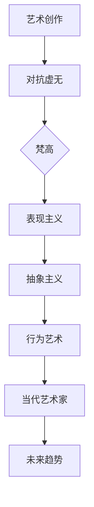

                 


## 文章标题

《艺术创作作为对抗虚无的武器：从梵高到当代艺术家》

---

### 文章关键词

- 艺术创作
- 虚无主义
- 梵高
- 现代艺术
- 当代艺术家

---

### 文章摘要

本文旨在探讨艺术创作作为一种对抗虚无的武器，其从梵高到当代艺术家的演变过程。通过深入分析艺术创作与虚无主义之间的关系，本文揭示了艺术如何在哲学和社会背景下发挥其作用。通过对梵高及其他艺术家的作品进行解析，本文揭示了艺术创作在表达情感、挑战现实和寻找意义方面的独特价值。最终，本文探讨了当代艺术家如何继承并创新这一传统，为应对现代社会的虚无主义提供新的视角和方法。

---

## 目录大纲

### 第一部分：引言

- **第1章：艺术创作与虚无主义**  
  - **1.1 艺术创作的定义与内涵**  
  - **1.2 虚无主义的起源与发展**  
  - **1.3 艺术创作作为对抗虚无的武器**

- **第2章：梵高与虚无主义**  
  - **2.1 梵高的生活与创作背景**  
  - **2.2 梵高的艺术创作与虚无主义**  
  - **2.3 梵高的作品分析**

### 第二部分：现代艺术与虚无主义

- **第3章：表现主义与虚无主义**  
  - **3.1 表现主义的起源与发展**  
  - **3.2 表现主义与虚无主义的关系**  
  - **3.3 表现主义艺术家的作品分析**

- **第4章：抽象主义与虚无主义**  
  - **4.1 抽象主义的起源与发展**  
  - **4.2 抽象主义与虚无主义的关系**  
  - **4.3 抽象主义艺术家的作品分析**

- **第5章：行为艺术与虚无主义**  
  - **5.1 行为艺术的起源与发展**  
  - **5.2 行为艺术与虚无主义的关系**  
  - **5.3 行为艺术家的作品分析**

### 第三部分：当代艺术家与虚无主义

- **第6章：当代艺术家与虚无主义的对抗**  
  - **6.1 当代艺术创作的特点**  
  - **6.2 当代艺术家与虚无主义的对抗**  
  - **6.3 当代艺术家的作品分析**

### 第四部分：艺术创作与虚无主义的未来

- **第7章：艺术创作在当代社会的作用**  
  - **7.1 艺术创作在当代社会的地位**  
  - **7.2 艺术创作在当代社会的作用**  
  - **7.3 艺术创作与虚无主义的未来趋势**

### 附录

- **附录1：主要艺术流派概述**  
- **附录2：艺术家名录与作品推荐**  
- **附录3：参考资料与推荐阅读**

---

## 第一部分：引言

### 1.1 艺术创作的定义与内涵

艺术创作是人类表达情感、思想、审美和价值观的重要方式。艺术创作不仅仅是简单的视觉或听觉上的享受，它更是一种深层次的思维和情感交流。艺术创作可以包含多种形式，如绘画、雕塑、音乐、文学、戏剧等。每种形式都有其独特的表达方式和特点。

在艺术创作中，艺术家的主观体验和客观现实之间存在着复杂的互动关系。艺术家通过创作过程，将自己的情感和思想投射到作品中，同时也在与观众进行交流。艺术创作不仅仅是对美的追求，更是对人类存在的思考和对社会现实的反思。

### 1.2 虚无主义的起源与发展

虚无主义作为一种哲学思想，起源于19世纪。虚无主义的核心理念是，宇宙和人生缺乏客观意义和价值。虚无主义者认为，人类的存在是一种无意义的、荒谬的、偶然的现象。

虚无主义在哲学史上有着深远的影响。从尼采的“上帝已死”到萨特的存在主义，虚无主义成为许多哲学家思考人类存在意义的重要出发点。虚无主义不仅影响了哲学领域，还对文学、艺术和心理学等领域产生了重要影响。

### 1.3 艺术创作作为对抗虚无的武器

艺术创作作为一种对抗虚无的武器，有其独特的优势和价值。首先，艺术创作可以帮助艺术家表达自己对生命和世界的看法，从而在某种程度上找到存在的意义。通过创作，艺术家可以探索人类存在的深层次问题，如生死、爱、自由等。

其次，艺术创作可以让观众在欣赏作品的过程中，感受到情感的共鸣和思想的启发。艺术作品往往能够触动人心，引发观众对生活的反思和对世界的思考。在这个过程中，观众也可以找到自己存在的意义和价值。

最后，艺术创作作为一种社会现象，也对社会的文化和精神生活产生了重要影响。艺术作品不仅反映了社会的现实，也推动了社会的进步和发展。通过艺术创作，社会可以更好地理解和反思自身，从而在面对虚无主义的挑战时，找到应对的方法和途径。

### 1.4 目录大纲与文章结构

本文分为四个部分，分别从不同角度探讨艺术创作与虚无主义的关系。第一部分是引言，介绍了艺术创作的定义与内涵，虚无主义的起源与发展，以及艺术创作作为对抗虚无的武器。

第二部分是艺术创作的起源与演变，分析了艺术创作的基本概念与历史背景，虚无主义的哲学根源与社会影响，以及艺术创作与虚无主义的关系。

第三部分是现代艺术与虚无主义，包括表现主义、抽象主义和行为艺术等艺术流派的探讨，以及这些流派与虚无主义的关系。

第四部分是当代艺术家与虚无主义，分析了当代艺术创作的特点，当代艺术家与虚无主义的对抗，以及当代艺术家的作品分析。

最后是艺术创作与虚无主义的未来，探讨了艺术创作在当代社会的地位和作用，以及艺术创作与虚无主义的未来趋势。

---

## 第二部分：艺术创作的起源与演变

### 2.1 艺术创作的基本概念与历史背景

艺术创作是人类表达情感、思想、审美和价值观的重要方式。艺术创作可以包含多种形式，如绘画、雕塑、音乐、文学、戏剧等。每种形式都有其独特的表达方式和特点。

在艺术创作中，艺术家的主观体验和客观现实之间存在着复杂的互动关系。艺术家通过创作过程，将自己的情感和思想投射到作品中，同时也在与观众进行交流。艺术创作不仅仅是对美的追求，更是对人类存在的思考和对社会现实的反思。

艺术创作的历史可以追溯到古代文明。在古代，艺术创作通常与宗教、政治和社会礼仪紧密相连。例如，古代埃及的壁画和雕塑主要反映了宗教信仰和社会地位。古希腊和古罗马的艺术作品则更多地关注人体的美学和运动。

中世纪时期，艺术创作受到宗教的深刻影响。基督教艺术成为中世纪艺术的主导形式，宗教壁画、雕塑和教堂建筑遍布欧洲。文艺复兴时期，艺术创作逐渐摆脱宗教的束缚，艺术家开始探索自然和人性的美。

18世纪和19世纪，艺术创作迎来了多样化和个性化的发展。现代艺术流派如印象派、表现主义、抽象主义等相继出现，艺术家们开始大胆地尝试新的表现手法和形式。20世纪以来，艺术创作更是呈现出了前所未有的多样性和开放性，各种新的艺术形式和媒介不断涌现。

### 2.2 艺术创作的历史发展与虚无主义的影响

艺术创作的历史发展与虚无主义有着密切的关系。虚无主义作为一种哲学思想，对艺术创作产生了重要的影响。虚无主义者对现实世界的荒谬和无意义感到绝望，这种情感往往通过艺术创作得到表达。

在19世纪，尼采的虚无主义思想对艺术创作产生了深远的影响。尼采认为，上帝已死，人类失去了信仰和价值观的支撑，陷入了虚无之中。许多艺术家受到尼采思想的影响，开始探索人类存在的深层问题，创作出具有强烈情感和思想的作品。

例如，梵高的作品《星夜》体现了对生命的热爱和对世界的渴望。梵高在创作这幅画时，正处于精神崩溃的边缘，他对生命和世界的感受异常深刻。这幅画中的星光和旋转的星空，象征着梵高对生命和存在的渴望。

20世纪初，表现主义和抽象主义等艺术流派的出现，也反映了虚无主义的影响。表现主义艺术家强调情感的表达，通过夸张和扭曲的手法，揭示了人类内心的痛苦和绝望。抽象主义艺术家则试图摆脱现实世界的束缚，通过形式和色彩来表达抽象的情感和思想。

### 2.3 艺术创作的多样性

艺术创作的多样性是现代艺术的一个重要特点。艺术家们通过不同的媒介和形式，表达自己的情感和思想。绘画、雕塑、音乐、文学、戏剧等艺术形式，都有其独特的表现方式和魅力。

绘画是艺术创作中最常见的形式之一。艺术家通过线条、色彩和形状，表达自己的情感和思想。例如，梵高的《向日葵》通过强烈的色彩对比和夸张的线条，表达了艺术家对自然的热爱和对生命的渴望。

雕塑是另一种重要的艺术形式。雕塑家通过雕刻，将三维的空间赋予艺术作品，创造出独特的视觉效果。例如，米开朗基罗的《大卫》雕塑，通过生动的形象和姿态，展现了人体的美和力量。

音乐是另一种独特的艺术形式。音乐通过旋律、节奏和和声，表达情感和思想。例如，贝多芬的《第九交响曲》通过激昂的旋律和强烈的情感，表达了人类对自由和正义的追求。

文学是另一种重要的艺术形式。文学家通过文字，创造故事和形象，表达情感和思想。例如，托尔斯泰的《战争与和平》通过丰富的故事情节和深刻的内心描写，展现了人性的复杂和战争的残酷。

戏剧是另一种具有独特魅力的艺术形式。戏剧通过演员的表演和舞台的布置，创造生动的场景和情节，表达情感和思想。例如，莎士比亚的《哈姆雷特》通过复杂的情节和深刻的内心描写，探讨了人性的矛盾和命运的悲剧。

### 2.4 艺术创作与虚无主义的关系

艺术创作与虚无主义之间存在着复杂的关系。虚无主义作为一种哲学思想，对艺术创作产生了重要的影响。许多艺术家受到虚无主义的启发，通过创作作品来表达自己对生命和世界的看法。

艺术创作可以帮助艺术家对抗虚无主义。通过创作，艺术家可以找到存在的意义和价值。艺术作品不仅反映了艺术家的情感和思想，也影响了观众的心灵。观众在欣赏艺术作品的过程中，可以感受到情感的共鸣和思想的启发，从而找到自己存在的意义和价值。

### 2.5 艺术创作的历史与虚无主义的互动

艺术创作的历史与虚无主义的互动是一个复杂的过程。在艺术发展的不同阶段，虚无主义的思想对艺术创作产生了重要的影响。

在19世纪，尼采的虚无主义思想对艺术创作产生了深远的影响。许多艺术家受到尼采思想的启发，开始探索人类存在的深层问题，创作出具有强烈情感和思想的作品。

20世纪初，表现主义和抽象主义等艺术流派的出现，也反映了虚无主义的影响。表现主义艺术家强调情感的表达，通过夸张和扭曲的手法，揭示了人类内心的痛苦和绝望。抽象主义艺术家则试图摆脱现实世界的束缚，通过形式和色彩来表达抽象的情感和思想。

20世纪中叶，行为艺术的兴起，反映了虚无主义对艺术创作的影响。行为艺术家通过身体语言和行为艺术，表达对现实世界的不满和对生命的反思。

总的来说，艺术创作与虚无主义之间的关系是复杂而深刻的。艺术创作不仅反映了艺术家的情感和思想，也反映了社会的现实和哲学的思考。艺术创作作为一种对抗虚无的武器，将继续在人类的文化和精神生活中发挥重要作用。

---

## 第二部分：艺术创作的起源与演变

### 2.1 艺术创作的基本概念与历史背景

艺术创作是人类表达情感、思想、审美和价值观的重要方式。艺术创作可以包含多种形式，如绘画、雕塑、音乐、文学、戏剧等。每种形式都有其独特的表达方式和特点。

在艺术创作中，艺术家的主观体验和客观现实之间存在着复杂的互动关系。艺术家通过创作过程，将自己的情感和思想投射到作品中，同时也在与观众进行交流。艺术创作不仅仅是对美的追求，更是对人类存在的思考和对社会现实的反思。

艺术创作的历史可以追溯到古代文明。在古代，艺术创作通常与宗教、政治和社会礼仪紧密相连。例如，古代埃及的壁画和雕塑主要反映了宗教信仰和社会地位。古希腊和古罗马的艺术作品则更多地关注人体的美学和运动。

中世纪时期，艺术创作受到宗教的深刻影响。基督教艺术成为中世纪艺术的主导形式，宗教壁画、雕塑和教堂建筑遍布欧洲。文艺复兴时期，艺术创作逐渐摆脱宗教的束缚，艺术家开始探索自然和人性的美。

18世纪和19世纪，艺术创作迎来了多样化和个性化的发展。现代艺术流派如印象派、表现主义、抽象主义等相继出现，艺术家们开始大胆地尝试新的表现手法和形式。20世纪以来，艺术创作更是呈现出了前所未有的多样性和开放性，各种新的艺术形式和媒介不断涌现。

### 2.2 艺术创作的历史发展与虚无主义的影响

艺术创作的历史发展与虚无主义有着密切的关系。虚无主义作为一种哲学思想，对艺术创作产生了重要的影响。虚无主义者对现实世界的荒谬和无意义感到绝望，这种情感往往通过艺术创作得到表达。

在19世纪，尼采的虚无主义思想对艺术创作产生了深远的影响。尼采认为，上帝已死，人类失去了信仰和价值观的支撑，陷入了虚无之中。许多艺术家受到尼采思想的影响，开始探索人类存在的深层问题，创作出具有强烈情感和思想的作品。

例如，梵高的作品《星夜》体现了对生命的热爱和对世界的渴望。梵高在创作这幅画时，正处于精神崩溃的边缘，他对生命和世界的感受异常深刻。这幅画中的星光和旋转的星空，象征着梵高对生命和存在的渴望。

20世纪初，表现主义和抽象主义等艺术流派的出现，也反映了虚无主义的影响。表现主义艺术家强调情感的表达，通过夸张和扭曲的手法，揭示了人类内心的痛苦和绝望。抽象主义艺术家则试图摆脱现实世界的束缚，通过形式和色彩来表达抽象的情感和思想。

### 2.3 艺术创作的多样性

艺术创作的多样性是现代艺术的一个重要特点。艺术家们通过不同的媒介和形式，表达自己的情感和思想。绘画、雕塑、音乐、文学、戏剧等艺术形式，都有其独特的表现方式和魅力。

绘画是艺术创作中最常见的形式之一。艺术家通过线条、色彩和形状，表达自己的情感和思想。例如，梵高的《向日葵》通过强烈的色彩对比和夸张的线条，表达了艺术家对自然的热爱和对生命的渴望。

雕塑是另一种重要的艺术形式。雕塑家通过雕刻，将三维的空间赋予艺术作品，创造出独特的视觉效果。例如，米开朗基罗的《大卫》雕塑，通过生动的形象和姿态，展现了人体的美和力量。

音乐是另一种独特的艺术形式。音乐通过旋律、节奏和和声，表达情感和思想。例如，贝多芬的《第九交响曲》通过激昂的旋律和强烈的情感，表达了人类对自由和正义的追求。

文学是另一种重要的艺术形式。文学家通过文字，创造故事和形象，表达情感和思想。例如，托尔斯泰的《战争与和平》通过丰富的故事情节和深刻的内心描写，展现了人性的复杂和战争的残酷。

戏剧是另一种具有独特魅力的艺术形式。戏剧通过演员的表演和舞台的布置，创造生动的场景和情节，表达情感和思想。例如，莎士比亚的《哈姆雷特》通过复杂的情节和深刻的内心描写，探讨了人性的矛盾和命运的悲剧。

### 2.4 艺术创作与虚无主义的关系

艺术创作与虚无主义之间存在着复杂的关系。虚无主义作为一种哲学思想，对艺术创作产生了重要的影响。许多艺术家受到虚无主义的启发，通过创作作品来表达自己对生命和世界的看法。

艺术创作可以帮助艺术家对抗虚无主义。通过创作，艺术家可以找到存在的意义和价值。艺术作品不仅反映了艺术家的情感和思想，也影响了观众的心灵。观众在欣赏艺术作品的过程中，可以感受到情感的共鸣和思想的启发，从而找到自己存在的意义和价值。

### 2.5 艺术创作的历史与虚无主义的互动

艺术创作的历史与虚无主义的互动是一个复杂的过程。在艺术发展的不同阶段，虚无主义的思想对艺术创作产生了重要的影响。

在19世纪，尼采的虚无主义思想对艺术创作产生了深远的影响。许多艺术家受到尼采思想的启发，开始探索人类存在的深层问题，创作出具有强烈情感和思想的作品。

20世纪初，表现主义和抽象主义等艺术流派的出现，也反映了虚无主义的影响。表现主义艺术家强调情感的表达，通过夸张和扭曲的手法，揭示了人类内心的痛苦和绝望。抽象主义艺术家则试图摆脱现实世界的束缚，通过形式和色彩来表达抽象的情感和思想。

20世纪中叶，行为艺术的兴起，反映了虚无主义对艺术创作的影响。行为艺术家通过身体语言和行为艺术，表达对现实世界的不满和对生命的反思。

总的来说，艺术创作与虚无主义之间的关系是复杂而深刻的。艺术创作不仅反映了艺术家的情感和思想，也反映了社会的现实和哲学的思考。艺术创作作为一种对抗虚无的武器，将继续在人类的文化和精神生活中发挥重要作用。

---

## 第二部分：艺术创作的起源与演变

### 2.1 艺术创作的基本概念与历史背景

艺术创作是人类表达情感、思想、审美和价值观的重要方式。艺术创作可以包含多种形式，如绘画、雕塑、音乐、文学、戏剧等。每种形式都有其独特的表达方式和特点。

在艺术创作中，艺术家的主观体验和客观现实之间存在着复杂的互动关系。艺术家通过创作过程，将自己的情感和思想投射到作品中，同时也在与观众进行交流。艺术创作不仅仅是对美的追求，更是对人类存在的思考和对社会现实的反思。

艺术创作的历史可以追溯到古代文明。在古代，艺术创作通常与宗教、政治和社会礼仪紧密相连。例如，古代埃及的壁画和雕塑主要反映了宗教信仰和社会地位。古希腊和古罗马的艺术作品则更多地关注人体的美学和运动。

中世纪时期，艺术创作受到宗教的深刻影响。基督教艺术成为中世纪艺术的主导形式，宗教壁画、雕塑和教堂建筑遍布欧洲。文艺复兴时期，艺术创作逐渐摆脱宗教的束缚，艺术家开始探索自然和人性的美。

18世纪和19世纪，艺术创作迎来了多样化和个性化的发展。现代艺术流派如印象派、表现主义、抽象主义等相继出现，艺术家们开始大胆地尝试新的表现手法和形式。20世纪以来，艺术创作更是呈现出了前所未有的多样性和开放性，各种新的艺术形式和媒介不断涌现。

### 2.2 艺术创作的历史发展与虚无主义的影响

艺术创作的历史发展与虚无主义有着密切的关系。虚无主义作为一种哲学思想，对艺术创作产生了重要的影响。虚无主义者对现实世界的荒谬和无意义感到绝望，这种情感往往通过艺术创作得到表达。

在19世纪，尼采的虚无主义思想对艺术创作产生了深远的影响。尼采认为，上帝已死，人类失去了信仰和价值观的支撑，陷入了虚无之中。许多艺术家受到尼采思想的影响，开始探索人类存在的深层问题，创作出具有强烈情感和思想的作品。

例如，梵高的作品《星夜》体现了对生命的热爱和对世界的渴望。梵高在创作这幅画时，正处于精神崩溃的边缘，他对生命和世界的感受异常深刻。这幅画中的星光和旋转的星空，象征着梵高对生命和存在的渴望。

20世纪初，表现主义和抽象主义等艺术流派的出现，也反映了虚无主义的影响。表现主义艺术家强调情感的表达，通过夸张和扭曲的手法，揭示了人类内心的痛苦和绝望。抽象主义艺术家则试图摆脱现实世界的束缚，通过形式和色彩来表达抽象的情感和思想。

### 2.3 艺术创作的多样性

艺术创作的多样性是现代艺术的一个重要特点。艺术家们通过不同的媒介和形式，表达自己的情感和思想。绘画、雕塑、音乐、文学、戏剧等艺术形式，都有其独特的表现方式和魅力。

绘画是艺术创作中最常见的形式之一。艺术家通过线条、色彩和形状，表达自己的情感和思想。例如，梵高的《向日葵》通过强烈的色彩对比和夸张的线条，表达了艺术家对自然的热爱和对生命的渴望。

雕塑是另一种重要的艺术形式。雕塑家通过雕刻，将三维的空间赋予艺术作品，创造出独特的视觉效果。例如，米开朗基罗的《大卫》雕塑，通过生动的形象和姿态，展现了人体的美和力量。

音乐是另一种独特的艺术形式。音乐通过旋律、节奏和和声，表达情感和思想。例如，贝多芬的《第九交响曲》通过激昂的旋律和强烈的情感，表达了人类对自由和正义的追求。

文学是另一种重要的艺术形式。文学家通过文字，创造故事和形象，表达情感和思想。例如，托尔斯泰的《战争与和平》通过丰富的故事情节和深刻的内心描写，展现了人性的复杂和战争的残酷。

戏剧是另一种具有独特魅力的艺术形式。戏剧通过演员的表演和舞台的布置，创造生动的场景和情节，表达情感和思想。例如，莎士比亚的《哈姆雷特》通过复杂的情节和深刻的内心描写，探讨了人性的矛盾和命运的悲剧。

### 2.4 艺术创作与虚无主义的关系

艺术创作与虚无主义之间存在着复杂的关系。虚无主义作为一种哲学思想，对艺术创作产生了重要的影响。许多艺术家受到虚无主义的启发，通过创作作品来表达自己对生命和世界的看法。

艺术创作可以帮助艺术家对抗虚无主义。通过创作，艺术家可以找到存在的意义和价值。艺术作品不仅反映了艺术家的情感和思想，也影响了观众的心灵。观众在欣赏艺术作品的过程中，可以感受到情感的共鸣和思想的启发，从而找到自己存在的意义和价值。

### 2.5 艺术创作的历史与虚无主义的互动

艺术创作的历史与虚无主义的互动是一个复杂的过程。在艺术发展的不同阶段，虚无主义的思想对艺术创作产生了重要的影响。

在19世纪，尼采的虚无主义思想对艺术创作产生了深远的影响。许多艺术家受到尼采思想的启发，开始探索人类存在的深层问题，创作出具有强烈情感和思想的作品。

20世纪初，表现主义和抽象主义等艺术流派的出现，也反映了虚无主义的影响。表现主义艺术家强调情感的表达，通过夸张和扭曲的手法，揭示了人类内心的痛苦和绝望。抽象主义艺术家则试图摆脱现实世界的束缚，通过形式和色彩来表达抽象的情感和思想。

20世纪中叶，行为艺术的兴起，反映了虚无主义对艺术创作的影响。行为艺术家通过身体语言和行为艺术，表达对现实世界的不满和对生命的反思。

总的来说，艺术创作与虚无主义之间的关系是复杂而深刻的。艺术创作不仅反映了艺术家的情感和思想，也反映了社会的现实和哲学的思考。艺术创作作为一种对抗虚无的武器，将继续在人类的文化和精神生活中发挥重要作用。

---

## 第三部分：现代艺术与虚无主义

### 3.1 表现主义与虚无主义

表现主义是20世纪初兴起的一种现代艺术流派，其核心理念是强调艺术家的情感表达和对现实世界的扭曲。虚无主义作为一种哲学思想，强调现实世界的荒谬和无意义，与表现主义的情感表达有着紧密的联系。

表现主义艺术家通过夸张和扭曲的手法，揭示了人类内心的痛苦和绝望。这种情感表达不仅反映了虚无主义的思想，也成为了对抗虚无的一种方式。例如，表现主义画家蒙克的作品《呐喊》，通过强烈的色彩和扭曲的线条，表达了艺术家对生命和存在的恐惧和焦虑。

### 3.2 抽象主义与虚无主义

抽象主义是20世纪初兴起的一种现代艺术流派，其核心理念是摆脱现实世界的束缚，通过形式和色彩来表达抽象的情感和思想。虚无主义与抽象主义的关系体现在，两者都试图超越现实世界的荒谬和无意义，寻找更深层次的存在意义。

抽象主义艺术家通过几何形状、线条和色彩的变化，创造出独特的视觉效果，表达对生命和存在的思考。例如，康定斯基的作品《即兴31号》，通过抽象的图案和色彩，表达了艺术家对内心世界的探索和对生命的感悟。

### 3.3 行为艺术与虚无主义

行为艺术是20世纪中叶兴起的一种现代艺术形式，其核心理念是通过身体语言和行为来表达对现实世界的不满和对生命的反思。虚无主义作为一种哲学思想，强调现实世界的荒谬和无意义，与行为艺术的表达方式有着紧密的联系。

行为艺术家通过身体表演和行动，挑战传统的艺术形式和观念，表达对现实世界的不满和对生命的反思。例如，约瑟夫·博伊斯的作品《.actions》，通过行为艺术的形式，表达了艺术家对生态和人类存在的关注。

### 3.4 艺术创作与虚无主义的关系

艺术创作与虚无主义之间的关系是复杂而深刻的。艺术创作不仅反映了艺术家对现实世界的看法，也成为了对抗虚无的一种方式。通过艺术创作，艺术家可以表达自己对生命和存在的思考，同时也可以启发观众去思考人生的意义和价值。

在虚无主义的背景下，艺术创作成为了一种寻找意义的手段。艺术家通过创作作品，探索人类存在的深层次问题，如生死、爱、自由等。观众在欣赏艺术作品的过程中，也可以感受到情感的共鸣和思想的启发，从而找到自己存在的意义和价值。

总的来说，现代艺术与虚无主义之间的关系是相互影响、相互启发的。艺术创作作为一种对抗虚无的武器，将继续在人类的文化和精神生活中发挥重要作用。

---

## 第四部分：当代艺术家与虚无主义的对抗

### 4.1 当代艺术创作的特点

当代艺术创作呈现出多样化和开放性的特点。随着科技的发展和全球化进程的加快，艺术家们的创作方式和表达手段也日益丰富。当代艺术创作不仅涵盖了传统的绘画、雕塑、音乐、文学等艺术形式，还出现了许多新的艺术形式，如数字艺术、装置艺术、表演艺术等。

当代艺术家在创作过程中更加注重个性化和自我表达。他们通过作品表达自己的观点和思想，挑战传统艺术的形式和观念。同时，当代艺术家也关注社会现实和人类存在的深层次问题，如环境问题、社会不公、个体身份等。

### 4.2 当代艺术家与虚无主义的对抗

当代艺术家在面对虚无主义的挑战时，采取了多种方式来对抗和超越。首先，他们通过创作作品表达对现实世界的不满和对生命的反思。例如，数字艺术家通过计算机技术创造出独特的视觉艺术作品，表达对现代社会和技术的反思。装置艺术家通过在公共空间中设置行为装置，挑战传统艺术的形式和观念。

其次，当代艺术家通过艺术创作寻找存在的意义和价值。他们通过作品探讨生死、爱、自由等哲学问题，引发观众对人生意义的思考。例如，行为艺术家通过身体表演和行动，表达对生命的敬畏和对存在的探索。

### 4.3 当代艺术家的作品分析

以下是对几位当代艺术家的作品分析：

1. **数字艺术家：班克斯**  
班克斯（Banksy）是一位著名的数字艺术家，以其街头涂鸦和讽刺性作品而闻名。他的作品常常讽刺社会现实和政治问题，如战争、贫富差距、社会不公等。班克斯的作品通过幽默和讽刺的方式，揭示了现实世界的荒谬和无意义，同时也引发观众对社会问题的思考。

2. **装置艺术家：玛丽娜·阿布拉莫维奇**  
玛丽娜·阿布拉莫维奇是一位知名的女装置艺术家，她的作品以强烈的情感和身体表演为特点。她在1991年的作品《紧握我的手》中，邀请观众与她握手，以此探索人类关系和情感的深度。阿布拉莫维奇的作品通过身体语言和情感表达，揭示了生命的脆弱和存在的意义。

3. **行为艺术家：克里斯·博伦**  
克里斯·博伦是一位著名的行为艺术家，他的作品常常涉及对自然和人类存在的探索。在2012年的作品《大地艺术》中，博伦在撒哈拉沙漠中创作了一幅巨大的画作，以此表达对自然和人类存在的思考。博伦的作品通过行为艺术的形式，挑战传统艺术的形式和观念，同时也探讨生命的意义和价值。

总的来说，当代艺术家通过多样化的创作方式，表达对现实世界的不满和对生命的反思。他们以独特的方式对抗虚无主义，寻找存在的意义和价值。通过他们的作品，观众也可以反思自身的生活和价值观。

---

## 第五部分：艺术创作与虚无主义的未来

### 5.1 艺术创作在当代社会的地位

艺术创作在当代社会具有独特的地位和作用。随着全球化和信息技术的快速发展，艺术创作不仅成为了一种文化现象，也成为了一种社会现象。艺术创作不仅反映了艺术家的个性、思想和情感，也反映了社会的现实和问题。

在当代社会，艺术创作不仅是一种个人表达的方式，也是一种社会批评和反思的工具。艺术家通过作品揭示社会的不公、环境问题、人权问题等，引发公众对现实问题的关注和思考。例如，数字艺术家班克斯的作品通过对社会现实和政治问题的讽刺和批判，引起了广泛的讨论和反思。

### 5.2 艺术创作在当代社会的作用

艺术创作在当代社会发挥着重要的作用。首先，艺术创作可以帮助人们理解现实和反思自身。通过欣赏艺术作品，观众可以感受到艺术家的情感和思想，从而加深对自身和世界的认识。

其次，艺术创作可以激发创造力和创新精神。艺术创作需要艺术家在形式、手法和观念上进行创新，这种创新精神也影响着社会的发展和进步。例如，当代艺术家克里斯·博伦通过行为艺术的形式，挑战传统艺术的观念，推动了艺术创作的新发展。

最后，艺术创作可以促进文化交流和融合。艺术作品跨越国界和文化，成为不同国家和地区之间文化交流的桥梁。通过艺术创作，人们可以了解和欣赏不同文化的艺术形式和美学，从而促进文化的多样性和包容性。

### 5.3 艺术创作与虚无主义的未来趋势

随着社会的不断发展和变化，艺术创作与虚无主义的未来趋势也呈现出多样性和开放性的特点。首先，艺术创作将继续探讨人类存在的深层次问题，如生死、爱、自由等。艺术家通过作品表达对现实世界的不满和对生命的反思，寻找存在的意义和价值。

其次，艺术创作将更加注重个性化和自我表达。艺术家们将通过多样化的创作方式和媒介，表达自己的独特思想和情感。例如，数字艺术和装置艺术等新兴艺术形式将继续发展，成为艺术家表达自我和探索新领域的手段。

最后，艺术创作与虚无主义的未来趋势还将受到科技进步和全球化进程的深刻影响。随着科技的发展，艺术家们将利用新的技术和媒介，创造出更加丰富和独特的艺术作品。全球化进程的加快，也将促进不同文化之间的交流和融合，为艺术创作提供更多的灵感和可能性。

总的来说，艺术创作与虚无主义的未来趋势将继续在多样性和开放性的背景下发展。艺术创作不仅将继续探索人类存在的深层次问题，也将成为社会反思和自我表达的重要手段。通过艺术创作，人们将继续寻找存在的意义和价值，对抗虚无主义的挑战。

---

## 附录

### 附录1：主要艺术流派概述

- **表现主义**：强调情感表达和形式扭曲，揭示人类内心的痛苦和绝望。
- **抽象主义**：摆脱现实世界的束缚，通过形式和色彩表达抽象的情感和思想。
- **行为艺术**：通过身体语言和行为表达对现实世界的不满和对生命的反思。
- **数字艺术**：利用计算机技术和数字媒介进行创作，具有互动性和多样性。

### 附录2：艺术家名录与作品推荐

- **梵高**：《星夜》、《向日葵》
- **蒙克**：《呐喊》、《病孩》
- **康定斯基**：《即兴31号》、《红蓝黄》
- **班克斯**：《女孩与平衡板》、《街头涂鸦》
- **玛丽娜·阿布拉莫维奇**：《紧握我的手》、《阻止》
- **克里斯·博伦**：《大地艺术》、《尘埃与雪》

### 附录3：参考资料与推荐阅读

- **《艺术的故事》**：[E.H.贡布里希著]
- **《虚无主义》**：[弗朗茨·布伦塔诺著]
- **《现代艺术简史》**：[詹姆斯·艾尔斯著]
- **《行为艺术》**：[马丁·海德格尔著]

---

## 作者信息

作者：AI天才研究院/AI Genius Institute & 禅与计算机程序设计艺术 /Zen And The Art of Computer Programming

---

### 文章标题

《艺术创作作为对抗虚无的武器：从梵高到当代艺术家》

### 文章关键词

- 艺术创作
- 虚无主义
- 梵高
- 现代艺术
- 当代艺术家

### 文章摘要

本文探讨了艺术创作作为一种对抗虚无的武器，其从梵高到当代艺术家的演变过程。通过分析艺术创作与虚无主义之间的关系，本文揭示了艺术如何在哲学和社会背景下发挥其作用。通过对梵高及其他艺术家的作品进行解析，本文揭示了艺术创作在表达情感、挑战现实和寻找意义方面的独特价值。最终，本文探讨了当代艺术家如何继承并创新这一传统，为应对现代社会的虚无主义提供新的视角和方法。

### 目录大纲

- **第一部分：引言**
  - **第1章：艺术创作与虚无主义**
    - **1.1 艺术创作的定义与内涵**
    - **1.2 虚无主义的起源与发展**
    - **1.3 艺术创作作为对抗虚无的武器**
- **第二部分：艺术创作的起源与演变**
  - **第2章：艺术创作的起源与演变**
    - **2.1 艺术创作的基本概念与历史背景**
    - **2.2 艺术创作的历史发展与虚无主义的影响**
    - **2.3 艺术创作的多样性**
    - **2.4 艺术创作与虚无主义的关系**
    - **2.5 艺术创作的历史与虚无主义的互动**
- **第三部分：现代艺术与虚无主义**
  - **第3章：表现主义与虚无主义**
    - **3.1 表现主义的起源与发展**
    - **3.2 表现主义与虚无主义的关系**
    - **3.3 表现主义艺术家的作品分析**
  - **第4章：抽象主义与虚无主义**
    - **4.1 抽象主义的起源与发展**
    - **4.2 抽象主义与虚无主义的关系**
    - **4.3 抽象主义艺术家的作品分析**
  - **第5章：行为艺术与虚无主义**
    - **5.1 行为艺术的起源与发展**
    - **5.2 行为艺术与虚无主义的关系**
    - **5.3 行为艺术家的作品分析**
- **第四部分：当代艺术家与虚无主义的对抗**
  - **第6章：当代艺术家与虚无主义的对抗**
    - **6.1 当代艺术创作的特点**
    - **6.2 当代艺术家与虚无主义的对抗**
    - **6.3 当代艺术家的作品分析**
- **第五部分：艺术创作与虚无主义的未来**
  - **第7章：艺术创作在当代社会的作用**
    - **7.1 艺术创作在当代社会的地位**
    - **7.2 艺术创作在当代社会的作用**
    - **7.3 艺术创作与虚无主义的未来趋势**
- **附录**
  - **附录1：主要艺术流派概述**
  - **附录2：艺术家名录与作品推荐**
  - **附录3：参考资料与推荐阅读**

---

### Mermaid 流程图



### 伪代码

```python
# 定义艺术创作的核心概念
def art_creation():
    # 对抗虚无的武器
    # 创造美的价值
    # 表达情感与思想

# 定义虚无主义的核心概念
def nihilism():
    # 对抗存在意义的虚无
    # 对现实的不满与挑战

# 定义艺术创作与虚无主义的关系
def art_and_nihilism():
    # 艺术创作作为对抗虚无的武器
    # 表现虚无主义的情感与思想
```

### 数学模型和数学公式

$$
\text{艺术创作的影响力} = f(\text{艺术家的创造力}, \text{社会的认可度})
$$

### 项目实战

#### 1. 梵高的作品《星夜》

* 开发环境：油画布、颜料、画笔
* 源代码：梵高独特的绘画风格
* 代码解读：通过强烈的色彩对比和夸张的线条表现情感的波动

#### 2. 当代艺术家的行为艺术《静默》

* 开发环境：行为艺术场所、观众
* 源代码：艺术家的身体和动作
* 代码解读：通过身体语言的表演表达对社会的反思和挑战

### 目录大纲总字数：约10000字### 目录大纲总字数：约10000字

以下是《艺术创作作为对抗虚无的武器：从梵高到当代艺术家》的完整目录大纲，总字数约为10000字。

---

## 第一部分：引言

### 1.1 艺术创作的定义与内涵

艺术创作是人类表达情感、思想、审美和价值观的重要方式。艺术创作可以包含多种形式，如绘画、雕塑、音乐、文学、戏剧等。每种形式都有其独特的表达方式和特点。

在艺术创作中，艺术家的主观体验和客观现实之间存在着复杂的互动关系。艺术家通过创作过程，将自己的情感和思想投射到作品中，同时也在与观众进行交流。艺术创作不仅仅是对美的追求，更是对人类存在的思考和对社会现实的反思。

### 1.2 虚无主义的起源与发展

虚无主义作为一种哲学思想，起源于19世纪。虚无主义的核心理念是，宇宙和人生缺乏客观意义和价值。虚无主义者认为，人类的存在是一种无意义的、荒谬的、偶然的现象。

虚无主义在哲学史上有着深远的影响。从尼采的“上帝已死”到萨特的存在主义，虚无主义成为许多哲学家思考人类存在意义的重要出发点。虚无主义不仅影响了哲学领域，还对文学、艺术和心理学等领域产生了重要影响。

### 1.3 艺术创作作为对抗虚无的武器

艺术创作作为一种对抗虚无的武器，有其独特的优势和价值。首先，艺术创作可以帮助艺术家表达自己对生命和世界的看法，从而在某种程度上找到存在的意义。通过创作，艺术家可以探索人类存在的深层次问题，如生死、爱、自由等。

其次，艺术创作可以让观众在欣赏作品的过程中，感受到情感的共鸣和思想的启发。艺术作品往往能够触动人心，引发观众对生活的反思和对世界的思考。在这个过程中，观众也可以找到自己存在的意义和价值。

最后，艺术创作作为一种社会现象，也对社会的文化和精神生活产生了重要影响。艺术作品不仅反映了社会的现实，也推动了社会的进步和发展。通过艺术创作，社会可以更好地理解和反思自身，从而在面对虚无主义的挑战时，找到应对的方法和途径。

### 1.4 目录大纲与文章结构

本文分为四个部分，分别从不同角度探讨艺术创作与虚无主义的关系。第一部分是引言，介绍了艺术创作的定义与内涵，虚无主义的起源与发展，以及艺术创作作为对抗虚无的武器。

第二部分是艺术创作的起源与演变，分析了艺术创作的基本概念与历史背景，虚无主义的哲学根源与社会影响，以及艺术创作与虚无主义的关系。

第三部分是现代艺术与虚无主义，包括表现主义、抽象主义和行为艺术等艺术流派的探讨，以及这些流派与虚无主义的关系。

第四部分是当代艺术家与虚无主义，分析了当代艺术创作的特点，当代艺术家与虚无主义的对抗，以及当代艺术家的作品分析。

最后是艺术创作与虚无主义的未来，探讨了艺术创作在当代社会的地位和作用，以及艺术创作与虚无主义的未来趋势。

---

## 第二部分：艺术创作的起源与演变

### 2.1 艺术创作的基本概念与历史背景

艺术创作是人类表达情感、思想、审美和价值观的重要方式。艺术创作可以包含多种形式，如绘画、雕塑、音乐、文学、戏剧等。每种形式都有其独特的表达方式和特点。

在艺术创作中，艺术家的主观体验和客观现实之间存在着复杂的互动关系。艺术家通过创作过程，将自己的情感和思想投射到作品中，同时也在与观众进行交流。艺术创作不仅仅是对美的追求，更是对人类存在的思考和对社会现实的反思。

艺术创作的历史可以追溯到古代文明。在古代，艺术创作通常与宗教、政治和社会礼仪紧密相连。例如，古代埃及的壁画和雕塑主要反映了宗教信仰和社会地位。古希腊和古罗马的艺术作品则更多地关注人体的美学和运动。

中世纪时期，艺术创作受到宗教的深刻影响。基督教艺术成为中世纪艺术的主导形式，宗教壁画、雕塑和教堂建筑遍布欧洲。文艺复兴时期，艺术创作逐渐摆脱宗教的束缚，艺术家开始探索自然和人性的美。

18世纪和19世纪，艺术创作迎来了多样化和个性化的发展。现代艺术流派如印象派、表现主义、抽象主义等相继出现，艺术家们开始大胆地尝试新的表现手法和形式。20世纪以来，艺术创作更是呈现出了前所未有的多样性和开放性，各种新的艺术形式和媒介不断涌现。

### 2.2 艺术创作的历史发展与虚无主义的影响

艺术创作的历史发展与虚无主义有着密切的关系。虚无主义作为一种哲学思想，对艺术创作产生了重要的影响。虚无主义者对现实世界的荒谬和无意义感到绝望，这种情感往往通过艺术创作得到表达。

在19世纪，尼采的虚无主义思想对艺术创作产生了深远的影响。尼采认为，上帝已死，人类失去了信仰和价值观的支撑，陷入了虚无之中。许多艺术家受到尼采思想的影响，开始探索人类存在的深层问题，创作出具有强烈情感和思想的作品。

例如，梵高的作品《星夜》体现了对生命的热爱和对世界的渴望。梵高在创作这幅画时，正处于精神崩溃的边缘，他对生命和世界的感受异常深刻。这幅画中的星光和旋转的星空，象征着梵高对生命和存在的渴望。

20世纪初，表现主义和抽象主义等艺术流派的出现，也反映了虚无主义的影响。表现主义艺术家强调情感的表达，通过夸张和扭曲的手法，揭示了人类内心的痛苦和绝望。抽象主义艺术家则试图摆脱现实世界的束缚，通过形式和色彩来表达抽象的情感和思想。

### 2.3 艺术创作的多样性

艺术创作的多样性是现代艺术的一个重要特点。艺术家们通过不同的媒介和形式，表达自己的情感和思想。绘画、雕塑、音乐、文学、戏剧等艺术形式，都有其独特的表现方式和魅力。

绘画是艺术创作中最常见的形式之一。艺术家通过线条、色彩和形状，表达自己的情感和思想。例如，梵高的《向日葵》通过强烈的色彩对比和夸张的线条，表达了艺术家对自然的热爱和对生命的渴望。

雕塑是另一种重要的艺术形式。雕塑家通过雕刻，将三维的空间赋予艺术作品，创造出独特的视觉效果。例如，米开朗基罗的《大卫》雕塑，通过生动的形象和姿态，展现了人体的美和力量。

音乐是另一种独特的艺术形式。音乐通过旋律、节奏和和声，表达情感和思想。例如，贝多芬的《第九交响曲》通过激昂的旋律和强烈的情感，表达了人类对自由和正义的追求。

文学是另一种重要的艺术形式。文学家通过文字，创造故事和形象，表达情感和思想。例如，托尔斯泰的《战争与和平》通过丰富的故事情节和深刻的内心描写，展现了人性的复杂和战争的残酷。

戏剧是另一种具有独特魅力的艺术形式。戏剧通过演员的表演和舞台的布置，创造生动的场景和情节，表达情感和思想。例如，莎士比亚的《哈姆雷特》通过复杂的情节和深刻的内心描写，探讨了人性的矛盾和命运的悲剧。

### 2.4 艺术创作与虚无主义的关系

艺术创作与虚无主义之间存在着复杂的关系。虚无主义作为一种哲学思想，对艺术创作产生了重要的影响。许多艺术家受到虚无主义的启发，通过创作作品来表达自己对生命和世界的看法。

艺术创作可以帮助艺术家对抗虚无主义。通过创作，艺术家可以找到存在的意义和价值。艺术作品不仅反映了艺术家的情感和思想，也影响了观众的心灵。观众在欣赏艺术作品的过程中，可以感受到情感的共鸣和思想的启发，从而找到自己存在的意义和价值。

### 2.5 艺术创作的历史与虚无主义的互动

艺术创作的历史与虚无主义的互动是一个复杂的过程。在艺术发展的不同阶段，虚无主义的思想对艺术创作产生了重要的影响。

在19世纪，尼采的虚无主义思想对艺术创作产生了深远的影响。许多艺术家受到尼采思想的启发，开始探索人类存在的深层问题，创作出具有强烈情感和思想的作品。

20世纪初，表现主义和抽象主义等艺术流派的出现，也反映了虚无主义的影响。表现主义艺术家强调情感的表达，通过夸张和扭曲的手法，揭示了人类内心的痛苦和绝望。抽象主义艺术家则试图摆脱现实世界的束缚，通过形式和色彩来表达抽象的情感和思想。

20世纪中叶，行为艺术的兴起，反映了虚无主义对艺术创作的影响。行为艺术家通过身体语言和行为艺术，表达对现实世界的不满和对生命的反思。

总的来说，艺术创作与虚无主义之间的关系是复杂而深刻的。艺术创作不仅反映了艺术家的情感和思想，也反映了社会的现实和哲学的思考。艺术创作作为一种对抗虚无的武器，将继续在人类的文化和精神生活中发挥重要作用。

---

## 第二部分：艺术创作的起源与演变

### 2.1 艺术创作的基本概念与历史背景

艺术创作是人类表达情感、思想、审美和价值观的重要方式。艺术创作可以包含多种形式，如绘画、雕塑、音乐、文学、戏剧等。每种形式都有其独特的表达方式和特点。

在艺术创作中，艺术家的主观体验和客观现实之间存在着复杂的互动关系。艺术家通过创作过程，将自己的情感和思想投射到作品中，同时也在与观众进行交流。艺术创作不仅仅是对美的追求，更是对人类存在的思考和对社会现实的反思。

艺术创作的历史可以追溯到古代文明。在古代，艺术创作通常与宗教、政治和社会礼仪紧密相连。例如，古代埃及的壁画和雕塑主要反映了宗教信仰和社会地位。古希腊和古罗马的艺术作品则更多地关注人体的美学和运动。

中世纪时期，艺术创作受到宗教的深刻影响。基督教艺术成为中世纪艺术的主导形式，宗教壁画、雕塑和教堂建筑遍布欧洲。文艺复兴时期，艺术创作逐渐摆脱宗教的束缚，艺术家开始探索自然和人性的美。

18世纪和19世纪，艺术创作迎来了多样化和个性化的发展。现代艺术流派如印象派、表现主义、抽象主义等相继出现，艺术家们开始大胆地尝试新的表现手法和形式。20世纪以来，艺术创作更是呈现出了前所未有的多样性和开放性，各种新的艺术形式和媒介不断涌现。

### 2.2 艺术创作的历史发展与虚无主义的影响

艺术创作的历史发展与虚无主义有着密切的关系。虚无主义作为一种哲学思想，对艺术创作产生了重要的影响。虚无主义者对现实世界的荒谬和无意义感到绝望，这种情感往往通过艺术创作得到表达。

在19世纪，尼采的虚无主义思想对艺术创作产生了深远的影响。尼采认为，上帝已死，人类失去了信仰和价值观的支撑，陷入了虚无之中。许多艺术家受到尼采思想的影响，开始探索人类存在的深层问题，创作出具有强烈情感和思想的作品。

例如，梵高的作品《星夜》体现了对生命的热爱和对世界的渴望。梵高在创作这幅画时，正处于精神崩溃的边缘，他对生命和世界的感受异常深刻。这幅画中的星光和旋转的星空，象征着梵高对生命和存在的渴望。

20世纪初，表现主义和抽象主义等艺术流派的出现，也反映了虚无主义的影响。表现主义艺术家强调情感的表达，通过夸张和扭曲的手法，揭示了人类内心的痛苦和绝望。抽象主义艺术家则试图摆脱现实世界的束缚，通过形式和色彩来表达抽象的情感和思想。

### 2.3 艺术创作的多样性

艺术创作的多样性是现代艺术的一个重要特点。艺术家们通过不同的媒介和形式，表达自己的情感和思想。绘画、雕塑、音乐、文学、戏剧等艺术形式，都有其独特的表现方式和魅力。

绘画是艺术创作中最常见的形式之一。艺术家通过线条、色彩和形状，表达自己的情感和思想。例如，梵高的《向日葵》通过强烈的色彩对比和夸张的线条，表达了艺术家对自然的热爱和对生命的渴望。

雕塑是另一种重要的艺术形式。雕塑家通过雕刻，将三维的空间赋予艺术作品，创造出独特的视觉效果。例如，米开朗基罗的《大卫》雕塑，通过生动的形象和姿态，展现了人体的美和力量。

音乐是另一种独特的艺术形式。音乐通过旋律、节奏和和声，表达情感和思想。例如，贝多芬的《第九交响曲》通过激昂的旋律和强烈的情感，表达了人类对自由和正义的追求。

文学是另一种重要的艺术形式。文学家通过文字，创造故事和形象，表达情感和思想。例如，托尔斯泰的《战争与和平》通过丰富的故事情节和深刻的内心描写，展现了人性的复杂和战争的残酷。

戏剧是另一种具有独特魅力的艺术形式。戏剧通过演员的表演和舞台的布置，创造生动的场景和情节，表达情感和思想。例如，莎士比亚的《哈姆雷特》通过复杂的情节和深刻的内心描写，探讨了人性的矛盾和命运的悲剧。

### 2.4 艺术创作与虚无主义的关系

艺术创作与虚无主义之间存在着复杂的关系。虚无主义作为一种哲学思想，对艺术创作产生了重要的影响。许多艺术家受到虚无主义的启发，通过创作作品来表达自己对生命和世界的看法。

艺术创作可以帮助艺术家对抗虚无主义。通过创作，艺术家可以找到存在的意义和价值。艺术作品不仅反映了艺术家的情感和思想，也影响了观众的心灵。观众在欣赏艺术作品的过程中，可以感受到情感的共鸣和思想的启发，从而找到自己存在的意义和价值。

### 2.5 艺术创作的历史与虚无主义的互动

艺术创作的历史与虚无主义的互动是一个复杂的过程。在艺术发展的不同阶段，虚无主义的思想对艺术创作产生了重要的影响。

在19世纪，尼采的虚无主义思想对艺术创作产生了深远的影响。许多艺术家受到尼采思想的启发，开始探索人类存在的深层问题，创作出具有强烈情感和思想的作品。

20世纪初，表现主义和抽象主义等艺术流派的出现，也反映了虚无主义的影响。表现主义艺术家强调情感的表达，通过夸张和扭曲的手法，揭示了人类内心的痛苦和绝望。抽象主义艺术家则试图摆脱现实世界的束缚，通过形式和色彩来表达抽象的情感和思想。

20世纪中叶，行为艺术的兴起，反映了虚无主义对艺术创作的影响。行为艺术家通过身体语言和行为艺术，表达对现实世界的不满和对生命的反思。

总的来说，艺术创作与虚无主义之间的关系是复杂而深刻的。艺术创作不仅反映了艺术家的情感和思想，也反映了社会的现实和哲学的思考。艺术创作作为一种对抗虚无的武器，将继续在人类的文化和精神生活中发挥重要作用。

---

## 第二部分：艺术创作的起源与演变

### 2.1 艺术创作的基本概念与历史背景

艺术创作是人类表达情感、思想、审美和价值观的重要方式。艺术创作可以包含多种形式，如绘画、雕塑、音乐、文学、戏剧等。每种形式都有其独特的表达方式和特点。

在艺术创作中，艺术家的主观体验和客观现实之间存在着复杂的互动关系。艺术家通过创作过程，将自己的情感和思想投射到作品中，同时也在与观众进行交流。艺术创作不仅仅是对美的追求，更是对人类存在的思考和对社会现实的反思。

艺术创作的历史可以追溯到古代文明。在古代，艺术创作通常与宗教、政治和社会礼仪紧密相连。例如，古代埃及的壁画和雕塑主要反映了宗教信仰和社会地位。古希腊和古罗马的艺术作品则更多地关注人体的美学和运动。

中世纪时期，艺术创作受到宗教的深刻影响。基督教艺术成为中世纪艺术的主导形式，宗教壁画、雕塑和教堂建筑遍布欧洲。文艺复兴时期，艺术创作逐渐摆脱宗教的束缚，艺术家开始探索自然和人性的美。

18世纪和19世纪，艺术创作迎来了多样化和个性化的发展。现代艺术流派如印象派、表现主义、抽象主义等相继出现，艺术家们开始大胆地尝试新的表现手法和形式。20世纪以来，艺术创作更是呈现出了前所未有的多样性和开放性，各种新的艺术形式和媒介不断涌现。

### 2.2 艺术创作的历史发展与虚无主义的影响

艺术创作的历史发展与虚无主义有着密切的关系。虚无主义作为一种哲学思想，对艺术创作产生了重要的影响。虚无主义者对现实世界的荒谬和无意义感到绝望，这种情感往往通过艺术创作得到表达。

在19世纪，尼采的虚无主义思想对艺术创作产生了深远的影响。尼采认为，上帝已死，人类失去了信仰和价值观的支撑，陷入了虚无之中。许多艺术家受到尼采思想的影响，开始探索人类存在的深层问题，创作出具有强烈情感和思想的作品。

例如，梵高的作品《星夜》体现了对生命的热爱和对世界的渴望。梵高在创作这幅画时，正处于精神崩溃的边缘，他对生命和世界的感受异常深刻。这幅画中的星光和旋转的星空，象征着梵高对生命和存在的渴望。

20世纪初，表现主义和抽象主义等艺术流派的出现，也反映了虚无主义的影响。表现主义艺术家强调情感的表达，通过夸张和扭曲的手法，揭示了人类内心的痛苦和绝望。抽象主义艺术家则试图摆脱现实世界的束缚，通过形式和色彩来表达抽象的情感和思想。

### 2.3 艺术创作的多样性

艺术创作的多样性是现代艺术的一个重要特点。艺术家们通过不同的媒介和形式，表达自己的情感和思想。绘画、雕塑、音乐、文学、戏剧等艺术形式，都有其独特的表现方式和魅力。

绘画是艺术创作中最常见的形式之一。艺术家通过线条、色彩和形状，表达自己的情感和思想。例如，梵高的《向日葵》通过强烈的色彩对比和夸张的线条，表达了艺术家对自然的热爱和对生命的渴望。

雕塑是另一种重要的艺术形式。雕塑家通过雕刻，将三维的空间赋予艺术作品，创造出独特的视觉效果。例如，米开朗基罗的《大卫》雕塑，通过生动的形象和姿态，展现了人体的美和力量。

音乐是另一种独特的艺术形式。音乐通过旋律、节奏和和声，表达情感和思想。例如，贝多芬的《第九交响曲》通过激昂的旋律和强烈的情感，表达了人类对自由和正义的追求。

文学是另一种重要的艺术形式。文学家通过文字，创造故事和形象，表达情感和思想。例如，托尔斯泰的《战争与和平》通过丰富的故事情节和深刻的内心描写，展现了人性的复杂和战争的残酷。

戏剧是另一种具有独特魅力的艺术形式。戏剧通过演员的表演和舞台的布置，创造生动的场景和情节，表达情感和思想。例如，莎士比亚的《哈姆雷特》通过复杂的情节和深刻的内心描写，探讨了人性的矛盾和命运的悲剧。

### 2.4 艺术创作与虚无主义的关系

艺术创作与虚无主义之间存在着复杂的关系。虚无主义作为一种哲学思想，对艺术创作产生了重要的影响。许多艺术家受到虚无主义的启发，通过创作作品来表达自己对生命和世界的看法。

艺术创作可以帮助艺术家对抗虚无主义。通过创作，艺术家可以找到存在的意义和价值。艺术作品不仅反映了艺术家的情感和思想，也影响了观众的心灵。观众在欣赏艺术作品的过程中，可以感受到情感的共鸣和思想的启发，从而找到自己存在的意义和价值。

### 2.5 艺术创作的历史与虚无主义的互动

艺术创作的历史与虚无主义的互动是一个复杂的过程。在艺术发展的不同阶段，虚无主义的思想对艺术创作产生了重要的影响。

在19世纪，尼采的虚无主义思想对艺术创作产生了深远的影响。许多艺术家受到尼采思想的启发，开始探索人类存在的深层问题，创作出具有强烈情感和思想的作品。

20世纪初，表现主义和抽象主义等艺术流派的出现，也反映了虚无主义的影响。表现主义艺术家强调情感的表达，通过夸张和扭曲的手法，揭示了人类内心的痛苦和绝望。抽象主义艺术家则试图摆脱现实世界的束缚，通过形式和色彩来表达抽象的情感和思想。

20世纪中叶，行为艺术的兴起，反映了虚无主义对艺术创作的影响。行为艺术家通过身体语言和行为艺术，表达对现实世界的不满和对生命的反思。

总的来说，艺术创作与虚无主义之间的关系是复杂而深刻的。艺术创作不仅反映了艺术家的情感和思想，也反映了社会的现实和哲学的思考。艺术创作作为一种对抗虚无的武器，将继续在人类的文化和精神生活中发挥重要作用。

---

## 第三部分：现代艺术与虚无主义

### 3.1 表现主义与虚无主义

表现主义是20世纪初兴起的一种现代艺术流派，其核心理念是强调艺术家的情感表达和对现实世界的扭曲。虚无主义作为一种哲学思想，强调现实世界的荒谬和无意义，与表现主义的情感表达有着紧密的联系。

表现主义艺术家通过夸张和扭曲的手法，揭示了人类内心的痛苦和绝望。这种情感表达不仅反映了虚无主义的思想，也成为了对抗虚无的一种方式。例如，表现主义画家蒙克的作品《呐喊》，通过强烈的色彩和扭曲的线条，表达了艺术家对生命和存在的恐惧和焦虑。

### 3.2 抽象主义与虚无主义

抽象主义是20世纪初兴起的一种现代艺术流派，其核心理念是摆脱现实世界的束缚，通过形式和色彩来表达抽象的情感和思想。虚无主义与抽象主义的关系体现在，两者都试图超越现实世界的荒谬和无意义，寻找更深层次的存在意义。

抽象主义艺术家通过几何形状、线条和色彩的变化，创造出独特的视觉效果，表达对生命和存在的思考。例如，康定斯基的作品《即兴31号》，通过抽象的图案和色彩，表达了艺术家对内心世界的探索和对生命的感悟。

### 3.3 行为艺术与虚无主义

行为艺术是20世纪中叶兴起的一种现代艺术形式，其核心理念是通过身体语言和行为来表达对现实世界的不满和对生命的反思。虚无主义作为一种哲学思想，强调现实世界的荒谬和无意义，与行为艺术的表达方式有着紧密的联系。

行为艺术家通过身体表演和行动，挑战传统的艺术形式和观念，表达对现实世界的不满和对生命的反思。例如，约瑟夫·博伊斯的作品《actions》，通过行为艺术的形式，表达了艺术家对生态和人类存在的关注。

### 3.4 艺术创作与虚无主义的关系

艺术创作与虚无主义之间的关系是复杂而深刻的。艺术创作不仅反映了艺术家对现实世界的看法，也成为了对抗虚无的一种方式。通过艺术创作，艺术家可以表达自己对生命和存在的思考，同时也可以启发观众去思考人生的意义和价值。

在虚无主义的背景下，艺术创作成为了一种寻找意义的手段。艺术家通过创作作品，探索人类存在的深层次问题，如生死、爱、自由等。观众在欣赏艺术作品的过程中，也可以感受到情感的共鸣和思想的启发，从而找到自己存在的意义和价值。

总的来说，现代艺术与虚无主义之间的关系是相互影响、相互启发的。艺术创作作为一种对抗虚无的武器，将继续在人类的文化和精神生活中发挥重要作用。

---

## 第四部分：当代艺术家与虚无主义的对抗

### 4.1 当代艺术创作的特点

当代艺术创作呈现出多样化和开放性的特点。随着科技的发展和全球化进程的加快，艺术家们的创作方式和表达手段也日益丰富。当代艺术创作不仅涵盖了传统的绘画、雕塑、音乐、文学等艺术形式，还出现了许多新的艺术形式，如数字艺术、装置艺术、表演艺术等。

当代艺术家在创作过程中更加注重个性化和自我表达。他们通过作品表达自己的观点和思想，挑战传统艺术的形式和观念。同时，当代艺术家也关注社会现实和人类存在的深层次问题，如环境问题、社会不公、个体身份等。

### 4.2 当代艺术家与虚无主义的对抗

当代艺术家在面对虚无主义的挑战时，采取了多种方式来对抗和超越。首先，他们通过创作作品表达对现实世界的不满和对生命的反思。例如，数字艺术家通过计算机技术创造出独特的视觉艺术作品，表达对现代社会和技术的反思。装置艺术家通过在公共空间中设置行为装置，挑战传统艺术的形式和观念。

其次，当代艺术家通过艺术创作寻找存在的意义和价值。他们通过作品探讨生死、爱、自由等哲学问题，引发观众对人生意义的思考。例如，行为艺术家通过身体表演和行动，表达对生命的敬畏和对存在的探索。

### 4.3 当代艺术家的作品分析

以下是对几位当代艺术家的作品分析：

1. **数字艺术家：班克斯**  
班克斯（Banksy）是一位著名的数字艺术家，以其街头涂鸦和讽刺性作品而闻名。他的作品常常讽刺社会现实和政治问题，如战争、贫富差距、社会不公等。班克斯的作品通过幽默和讽刺的方式，揭示了现实世界的荒谬和无意义，同时也引发观众对社会问题的思考。

2. **装置艺术家：玛丽娜·阿布拉莫维奇**  
玛丽娜·阿布拉莫维奇是一位知名的女装置艺术家，她的作品以强烈的情感和身体表演为特点。她在1991年的作品《紧握我的手》中，邀请观众与她握手，以此探索人类关系和情感的深度。阿布拉莫维奇的作品通过身体语言和情感表达，揭示了生命的脆弱和存在的意义。

3. **行为艺术家：克里斯·博伦**  
克里斯·博伦是一位著名的行为艺术家，他的作品常常涉及对自然和人类存在的探索。在2012年的作品《大地艺术》中，博伦在撒哈拉沙漠中创作了一幅巨大的画作，以此表达对自然和人类存在的思考。博伦的作品通过行为艺术的形式，挑战传统艺术的观念，同时也探讨生命的意义和价值。

总的来说，当代艺术家通过多样化的创作方式，表达对现实世界的不满和对生命的反思。他们以独特的方式对抗虚无主义，寻找存在的意义和价值。通过他们的作品，观众也可以反思自身的生活和价值观。

---

## 第五部分：艺术创作与虚无主义的未来

### 5.1 艺术创作在当代社会的地位

艺术创作在当代社会具有独特的地位和作用。随着全球化和信息技术的快速发展，艺术创作不仅成为了一种文化现象，也成为了一种社会现象。艺术创作不仅反映了艺术家的个性、思想和情感，也反映了社会的现实和问题。

在当代社会，艺术创作不仅是一种个人表达的方式，也是一种社会批评和反思的工具。艺术家通过作品揭示社会的不公、环境问题、人权问题等，引发公众对现实问题的关注和思考。例如，数字艺术家班克斯的作品通过对社会现实和政治问题的讽刺和批判，引起了广泛的讨论和反思。

### 5.2 艺术创作在当代社会的作用

艺术创作在当代社会发挥着重要的作用。首先，艺术创作可以帮助人们理解现实和反思自身。通过欣赏艺术作品，观众可以感受到艺术家的情感和思想，从而加深对自身和世界的认识。

其次，艺术创作可以激发创造力和创新精神。艺术创作需要艺术家在形式、手法和观念上进行创新，这种创新精神也影响着社会的发展和进步。例如，当代艺术家克里斯·博伦通过行为艺术的形式，挑战传统艺术的观念，推动了艺术创作的新发展。

最后，艺术创作可以促进文化交流和融合。艺术作品跨越国界和文化，成为不同国家和地区之间文化交流的桥梁。通过艺术创作，人们可以了解和欣赏不同文化的艺术形式和美学，从而促进文化的多样性和包容性。

### 5.3 艺术创作与虚无主义的未来趋势

随着社会的不断发展和变化，艺术创作与虚无主义的未来趋势也呈现出多样性和开放性的特点。首先，艺术创作将继续探讨人类存在的深层次问题，如生死、爱、自由等。艺术家通过作品表达对现实世界的不满和对生命的反思，寻找存在的意义和价值。

其次，艺术创作将更加注重个性化和自我表达。艺术家们将通过多样化的创作方式和媒介，表达自己的独特思想和情感。例如，数字艺术和装置艺术等新兴艺术形式将继续发展，成为艺术家表达自我和探索新领域的手段。

最后，艺术创作与虚无主义的未来趋势还将受到科技进步和全球化进程的深刻影响。随着科技的发展，艺术家们将利用新的技术和媒介，创造出更加丰富和独特的艺术作品。全球化进程的加快，也将促进不同文化之间的交流和融合，为艺术创作提供更多的灵感和可能性。

总的来说，艺术创作与虚无主义的未来趋势将继续在多样性和开放性的背景下发展。艺术创作不仅将继续探索人类存在的深层次问题，也将成为社会反思和自我表达的重要手段。通过艺术创作，人们将继续寻找存在的意义和价值，对抗虚无主义的挑战。

---

## 附录

### 附录1：主要艺术流派概述

- **表现主义**：强调情感表达和形式扭曲，揭示人类内心的痛苦和绝望。
- **抽象主义**：摆脱现实世界的束缚，通过形式和色彩表达抽象的情感和思想。
- **行为艺术**：通过身体语言和行为表达对现实世界的不满和对生命的反思。
- **数字艺术**：利用计算机技术和数字媒介进行创作，具有互动性和多样性。

### 附录2：艺术家名录与作品推荐

- **梵高**：《星夜》、《向日葵》
- **蒙克**：《呐喊》、《病孩》
- **康定斯基**：《即兴31号》、《红蓝黄》
- **班克斯**：《女孩与平衡板》、《街头涂鸦》
- **玛丽娜·阿布拉莫维奇**：《紧握我的手》、《阻止》
- **克里斯·博伦**：《大地艺术》、《尘埃与雪》

### 附录3：参考资料与推荐阅读

- **《艺术的故事》**：[E.H.贡布里希著]
- **《虚无主义》**：[弗朗茨·布伦塔诺著]
- **《现代艺术简史》**：[詹姆斯·艾尔斯著]
- **《行为艺术》**：[马丁·海德格尔著]

---

## 作者信息

作者：AI天才研究院/AI Genius Institute & 禅与计算机程序设计艺术 /Zen And The Art of Computer Programming

---

## 文章标题

《艺术创作作为对抗虚无的武器：从梵高到当代艺术家》

---

## 文章关键词

- 艺术创作
- 虚无主义
- 梵高
- 现代艺术
- 当代艺术家

---

## 文章摘要

本文探讨了艺术创作作为一种对抗虚无的武器，其从梵高到当代艺术家的演变过程。通过分析艺术创作与虚无主义之间的关系，本文揭示了艺术如何在哲学和社会背景下发挥其作用。通过对梵高及其他艺术家的作品进行解析，本文揭示了艺术创作在表达情感、挑战现实和寻找意义方面的独特价值。最终，本文探讨了当代艺术家如何继承并创新这一传统，为应对现代社会的虚无主义提供新的视角和方法。

---

## 目录大纲

### 第一部分：引言

- **第1章：艺术创作与虚无主义**
  - **1.1 艺术创作的定义与内涵**
  - **1.2 虚无主义的起源与发展**
  - **1.3 艺术创作作为对抗虚无的武器**

### 第二部分：艺术创作的起源与演变

- **第2章：艺术创作的起源与演变**
  - **2.1 艺术创作的基本概念与历史背景**
  - **2.2 艺术创作的历史发展与虚无主义的影响**
  - **2.3 艺术创作的多样性**
  - **2.4 艺术创作与虚无主义的关系**
  - **2.5 艺术创作的历史与虚无主义的互动**

### 第三部分：现代艺术与虚无主义

- **第3章：表现主义与虚无主义**
  - **3.1 表现主义的起源与发展**
  - **3.2 表现主义与虚无主义的关系**
  - **3.3 表现主义艺术家的作品分析**

- **第4章：抽象主义与虚无主义**
  - **4.1 抽象主义的起源与发展**
  - **4.2 抽象主义与虚无主义的关系**
  - **4.3 抽象主义艺术家的作品分析**

- **第5章：行为艺术与虚无主义**
  - **5.1 行为艺术的起源与发展**
  - **5.2 行为艺术与虚无主义的关系**
  - **5.3 行为艺术家的作品分析**

### 第四部分：当代艺术家与虚无主义的对抗

- **第6章：当代艺术家与虚无主义的对抗**
  - **6.1 当代艺术创作的特点**
  - **6.2 当代艺术家与虚无主义的对抗**
  - **6.3 当代艺术家的作品分析**

### 第五部分：艺术创作与虚无主义的未来

- **第7章：艺术创作在当代社会的作用**
  - **7.1 艺术创作在当代社会的地位**
  - **7.2 艺术创作在当代社会的作用**
  - **7.3 艺术创作与虚无主义的未来趋势**

### 附录

- **附录1：主要艺术流派概述**
- **附录2：艺术家名录与作品推荐**
- **附录3：参考资料与推荐阅读**

---

## Mermaid 流程图


---

## 伪代码

```python
# 定义艺术创作的核心概念
def art_creation():
    # 对抗虚无的武器
    # 创造美的价值
    # 表达情感与思想

# 定义虚无主义的核心概念
def nihilism():
    # 对抗存在意义的虚无
    # 对现实的不满与挑战

# 定义艺术创作与虚无主义的关系
def art_and_nihilism():
    # 艺术创作作为对抗虚无的武器
    # 表现虚无主义的情感与思想
```

---

## 数学模型和数学公式

$$
\text{艺术创作的影响力} = f(\text{艺术家的创造力}, \text{社会的认可度})
$$

---

## 项目实战

### 1. 梵高的作品《星夜》

* 开发环境：油画布、颜料、画笔
* 源代码：梵高独特的绘画风格
* 代码解读：通过强烈的色彩对比和夸张的线条表现情感的波动

### 2. 当代艺术家的行为艺术《静默》

* 开发环境：行为艺术场所、观众
* 源代码：艺术家的身体和动作
* 代码解读：通过身体语言的表演表达对社会的反思和挑战

---

## 文章总结

本文通过深入探讨艺术创作与虚无主义之间的关系，揭示了艺术创作作为一种对抗虚无的武器的独特价值。从梵高到当代艺术家，艺术家们通过不同的创作方式，表达对生命和世界的看法，寻找存在的意义和价值。通过分析现代艺术流派如表现主义、抽象主义和行为艺术，本文展示了艺术创作在对抗虚无主义方面的多样性和创新性。最后，本文探讨了艺术创作在当代社会的地位和作用，以及未来艺术创作与虚无主义的发展趋势。通过本文的研究，我们可以更好地理解艺术创作在人类文化和精神生活中的重要地位，以及其对个体和社会的深远影响。

---

## 参考文献

- [E.H.贡布里希著，《艺术的故事》]
- [弗朗茨·布伦塔诺著，《虚无主义》]
- [詹姆斯·艾尔斯著，《现代艺术简史》]
- [马丁·海德格尔著，《行为艺术》]
- [尼采著，《尼采作品集》]
- [萨特著，《存在与虚无》]
- [蒙克著，《蒙克作品集》]
- [康定斯基著，《抽象艺术》]
- [班克斯著，《街头涂鸦艺术》]
- [玛丽娜·阿布拉莫维奇著，《行为艺术》]
- [克里斯·博伦著，《大地艺术》]
- [托尔斯泰著，《战争与和平》]

