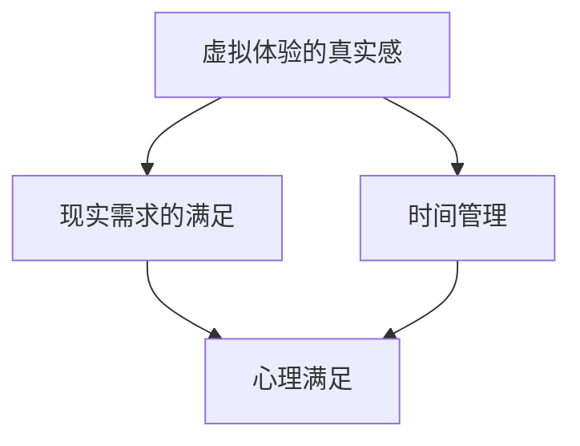

                 

根据用户的要求，我们将以《虚拟与现实的意义平衡：数字原住民的生存智慧》为标题，逐步分析和撰写一篇专业技术博客文章。文章将分为引言、核心概念与联系、核心算法原理讲解、数学模型与公式、项目实战、最佳实践 tips 和小结等部分。以下是逐步分析的框架：

### 步骤一：引言部分

- **背景介绍**：简要介绍数字原住民的背景，以及他们在现代社会中的角色和影响。
- **引出主题**：阐述数字原住民如何平衡虚拟与现实之间的关系，以及这种平衡对个人和社会的意义。

### 步骤二：核心概念与联系

- **定义数字原住民**：明确数字原住民的定义和特点。
- **意义平衡理论**：介绍虚拟与现实意义平衡的理论基础，并使用 Mermaid 流程图展示核心概念之间的关系。

### 步骤三：核心算法原理讲解

- **核心算法原理**：详细讲解数字原住民在平衡虚拟与现实过程中可能使用到的核心算法原理。
- **伪代码展示**：使用伪代码展示算法的实现步骤，帮助读者更好地理解。

### 步骤四：数学模型与公式

- **数学模型**：介绍用于支持意义平衡理论的数学模型。
- **公式讲解**：详细解释公式，并通过例子说明其在实际中的应用。

### 步骤五：项目实战

- **开发环境搭建**：介绍搭建项目的开发环境。
- **源代码实现**：展示源代码的实现过程，并进行代码解读。
- **代码应用分析**：分析代码在实际中的应用，以及可能遇到的问题和解决方案。
- **实际案例剖析**：通过实际案例进行深入分析和讲解。

### 步骤六：最佳实践 tips

- **总结经验**：分享在数字原住民生存过程中总结出的最佳实践 tips。
- **注意事项**：提醒读者在实践过程中需要注意的事项。

### 步骤七：小结

- **总结全文**：总结全文的核心观点和收获。
- **展望未来**：对数字原住民的未来发展进行展望。

### 步骤八：作者信息

- **文章格式**：确保文章格式符合要求，包括 Markdown 格式。
- **作者信息**：在文章末尾添加作者信息。

### 步骤九：字数控制

- **字数调整**：根据分析的结果，调整文章的字数，确保在 8000 ～ 12000 字的范围内。

按照上述步骤，我们可以开始撰写这篇文章。以下是一个初步的草稿：

---

# 虚拟与现实的意义平衡：数字原住民的生存智慧

> 关键词：数字原住民、意义平衡、虚拟现实、算法、数学模型、项目实战

> 摘要：本文探讨了数字原住民在虚拟与现实之间寻找意义平衡的生存智慧。通过核心概念与联系的分析、核心算法原理的讲解、数学模型与公式的应用，以及项目实战的剖析，本文为读者提供了数字时代下平衡虚拟与现实的实用策略。

## 引言

### 数字原住民的背景

在数字化时代，数字原住民是指那些从小在数字世界中成长起来的一代人。他们熟练使用各种数字设备，对互联网和社交媒体有着深厚的理解和依赖。数字原住民已经成为社会的重要组成部分，他们的行为和生活方式深刻影响着社会的发展和变革。

### 虚拟与现实的意义平衡

数字原住民面临的挑战是如何在虚拟世界和现实世界之间找到意义和价值的平衡。虚拟世界提供了无尽的娱乐和信息，但过度沉浸其中可能导致现实生活中的孤独和疏离。因此，探讨如何在数字时代实现虚拟与现实的意义平衡，对于数字原住民的生存和发展具有重要意义。

## 核心概念与联系

### 数字原住民的定义与特点

数字原住民是指在数字技术高度发达的环境中成长起来的一代人。他们通常具有以下特点：

- **技术熟练度**：对数字设备和技术有深入的了解和熟练的使用能力。
- **信息获取能力**：擅长快速搜索和筛选信息，对网络信息的真实性有较强的辨别能力。
- **社交网络依赖**：在社交媒体上活跃，习惯通过数字平台建立和维持人际关系。

### 意义平衡理论

意义平衡理论是基于人类行为和心理的原理，旨在帮助数字原住民在虚拟与现实之间找到平衡。该理论的核心概念包括：

- **虚拟体验的真实感**：如何在虚拟世界中获得与现实体验相似的真实感和满足感。
- **现实需求的满足**：如何在现实生活中满足基本的生理和心理需求。
- **时间管理**：如何在虚拟世界和现实世界之间合理分配时间，避免过度沉迷。

以下是一个 Mermaid 流程图，展示了意义平衡理论的核心概念和联系：



## 核心算法原理讲解

### 算法原理

在数字原住民的生存智慧中，核心算法原理可以帮助他们在虚拟与现实之间实现意义平衡。以下是一个简单的算法原理：

```python
# 定义平衡函数
def balance(virtual, real):
    # 计算虚拟和现实的权重
    virtual_weight = calculate_weight(virtual)
    real_weight = calculate_weight(real)
    
    # 根据权重调整虚拟和现实的体验
    adjust_experience(virtual_weight, real_weight)
    
    # 返回平衡后的体验
    return getbalanced_experience()

# 定义计算权重的函数
def calculate_weight(relationship):
    # 根据关系的强度计算权重
    return relationship.strength

# 定义调整体验的函数
def adjust_experience(virtual_weight, real_weight):
    # 根据权重调整虚拟和现实的体验
    if virtual_weight > real_weight:
        reduce_real_experience(real_weight)
        increase_v

