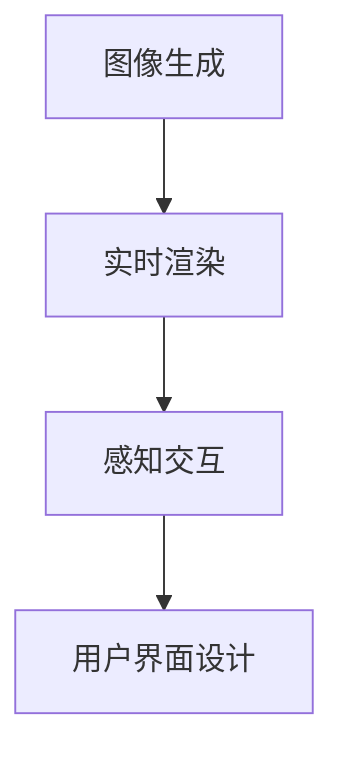
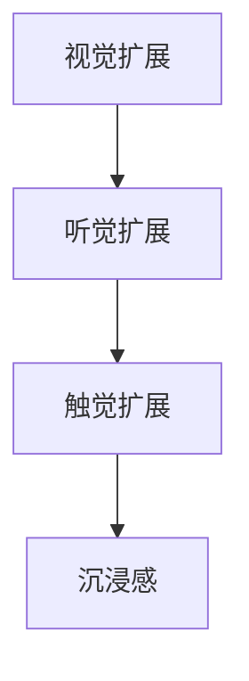
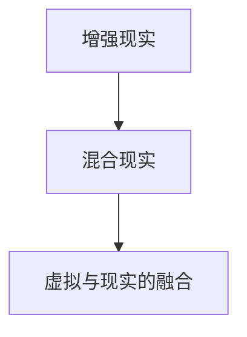
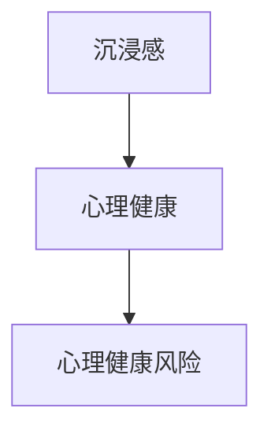
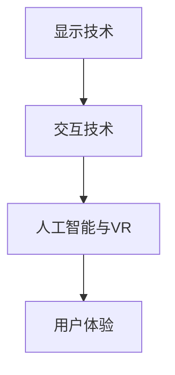
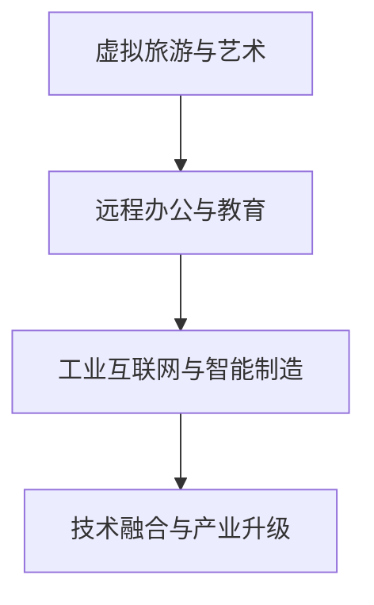
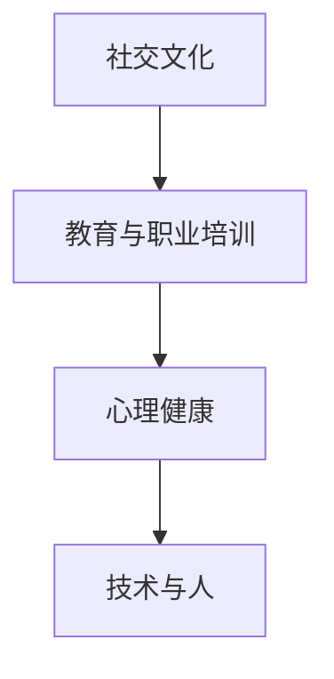
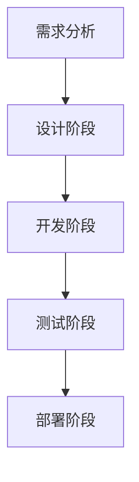

                 

### 第一步：理解书名和主题

《虚拟现实体验：科技如何扩展我们的感知世界》这本书的主题是虚拟现实体验，以及科技如何扩展我们的感知世界。虚拟现实（Virtual Reality，简称VR）是一种通过计算机技术模拟出的虚拟环境，用户可以通过特殊设备如头盔、手柄等，在虚拟环境中进行交互和体验。感知世界指的是我们通过视觉、听觉、触觉等感官所感受到的现实世界。

首先，我们需要理解虚拟现实技术的基本概念和分类。虚拟现实技术可以大致分为三类：沉浸式虚拟现实、增强现实（AR）和混合现实（MR）。沉浸式虚拟现实是通过头戴显示器和传感器设备，使用户完全沉浸在虚拟环境中；增强现实是通过在现实世界中叠加虚拟信息，增强用户的感知体验；混合现实则是将虚拟和现实环境融合在一起。

接下来，我们需要探讨虚拟现实技术如何扩展我们的感知世界。虚拟现实技术通过模拟出逼真的虚拟环境，可以让我们体验到超越现实世界的感官体验，从而扩展我们的感知世界。例如，通过沉浸式虚拟现实，我们可以体验到在太空漫游、深海探险等不可能在现实中实现的场景。同时，虚拟现实技术也可以通过增强现实技术，将虚拟信息与现实环境相结合，提供更加丰富和便捷的感知体验。

在撰写文章时，我们可以从以下几个角度来设计目录：

- **虚拟现实技术概述**：介绍虚拟现实技术的定义、历史和发展趋势。
- **虚拟现实与感知世界的关系**：探讨虚拟现实技术对人类感知世界的影响和互动方式。
- **虚拟现实的核心技术**：详细讲解虚拟现实技术的核心组成部分，如显示技术、输入输出技术、交互技术等。
- **虚拟现实的应用场景**：分析虚拟现实技术在各个领域的应用，如游戏娱乐、教育培训、医疗健康等。
- **虚拟现实的未来发展趋势**：预测虚拟现实技术的未来发展方向和潜在影响。
- **虚拟现实项目实战**：通过实际案例展示虚拟现实项目的开发流程和技术实现。
- **虚拟现实技术的挑战与机遇**：讨论虚拟现实技术面临的挑战和机遇，以及可能的解决方案。

通过以上步骤，我们可以构建出一个逻辑清晰、结构紧凑、内容丰富的高质量技术博客文章，为读者提供关于虚拟现实技术的全面理解和深入洞察。接下来，我们将进一步细化每个章节的内容，确保文章的完整性和专业性。

### 第二步：确定核心章节内容

在理解书名和主题的基础上，我们可以确定以下核心章节内容，确保文章能够系统地覆盖虚拟现实体验的主题，并详细探讨科技如何扩展我们的感知世界。

#### 第1章：虚拟现实技术概述
- **1.1 虚拟现实的定义与历史**
  - 介绍虚拟现实的定义、基本概念和核心技术。
  - 回顾虚拟现实技术的发展历程，从早期的VR设备到现代的沉浸式体验。

- **1.2 虚拟现实技术的分类**
  - 分析沉浸式虚拟现实、增强现实和混合现实的不同特点和应用场景。
  - 探讨各类虚拟现实技术的优缺点及其对感知世界的扩展方式。

- **1.3 虚拟现实技术的核心原理**
  - 阐述虚拟现实技术的核心原理，包括图像生成、实时渲染、感知交互等。
  - 通过流程图和示意图展示虚拟现实技术的基本工作流程。

#### 第2章：虚拟现实与感知世界的关系
- **2.1 虚拟现实对感知世界的影响**
  - 讨论虚拟现实技术如何通过视觉、听觉、触觉等感官扩展人类的感知体验。
  - 分析虚拟现实技术对人类认知和心理的影响。

- **2.2 虚拟现实与真实世界的互动**
  - 探索虚拟现实技术如何与真实世界进行互动，实现虚拟与现实的融合。
  - 举例说明虚拟现实技术在现实世界中的应用案例。

- **2.3 虚拟现实对人类心理的影响**
  - 研究虚拟现实技术对人类情绪和心理状态的影响，包括沉浸感、晕动症等。
  - 提供应对心理挑战的方法和建议。

#### 第3章：虚拟现实的核心技术
- **3.1 显示技术**
  - 详细讲解虚拟现实中的显示技术，包括头戴显示器（HMD）、光场显示等。
  - 分析不同显示技术的优劣和对感知体验的影响。

- **3.2 输入输出技术**
  - 探讨虚拟现实中的输入输出技术，如手柄、手势识别、眼动追踪等。
  - 分析输入输出技术的实现原理和其在虚拟现实中的应用。

- **3.3 交互技术**
  - 讲解虚拟现实中的交互技术，包括自然用户界面、虚拟物体操作等。
  - 分析交互技术在提升虚拟现实体验中的作用。

- **3.4 人工智能技术**
  - 讨论人工智能技术在虚拟现实中的应用，如智能虚拟助手、个性化内容推荐等。
  - 分析人工智能技术对虚拟现实体验的优化和扩展。

#### 第4章：虚拟现实的应用场景
- **4.1 游戏娱乐**
  - 分析虚拟现实技术在游戏娱乐领域的应用，包括虚拟现实游戏的设计与开发。
  - 举例说明虚拟现实游戏的成功案例和用户反馈。

- **4.2 教育培训**
  - 探讨虚拟现实技术在教育培训中的应用，如虚拟实验室、虚拟课堂等。
  - 分析虚拟现实教育技术的优势和挑战。

- **4.3 医疗健康**
  - 讨论虚拟现实技术在医疗健康领域的应用，如虚拟手术训练、康复治疗等。
  - 分析虚拟现实技术在医疗健康领域的潜力和前景。

- **4.4 军事模拟**
  - 分析虚拟现实技术在军事模拟训练中的应用，如战场模拟、战术演练等。
  - 讨论虚拟现实技术在军事领域的优势和挑战。

- **4.5 建筑设计**
  - 探讨虚拟现实技术在建筑设计中的应用，如虚拟现实模型展示、空间布局优化等。
  - 分析虚拟现实技术在建筑设计中的创新和优化。

#### 第5章：虚拟现实的未来发展趋势
- **5.1 技术发展趋势**
  - 分析虚拟现实技术的未来发展趋势，如更高质量的显示、更自然的交互、更广泛的应用等。
  - 探讨新技术对虚拟现实体验的潜在影响。

- **5.2 应用场景扩展**
  - 探讨虚拟现实技术在新兴领域的应用潜力，如虚拟旅游、远程办公等。
  - 分析虚拟现实技术在各个领域的市场前景和挑战。

- **5.3 社会影响**
  - 讨论虚拟现实技术对社会和文化的影响，如虚拟社交、虚拟现实艺术等。
  - 分析虚拟现实技术对人类社会发展的长期影响。

#### 第6章：虚拟现实项目实战
- **6.1 虚拟现实项目开发流程**
  - 详细讲解虚拟现实项目的开发流程，包括需求分析、设计、开发、测试等环节。
  - 分析项目开发过程中可能遇到的问题和解决方案。

- **6.2 虚拟现实项目案例解析**
  - 通过实际案例展示虚拟现实项目的开发过程和技术实现。
  - 分析项目成功的关键因素和经验教训。

- **6.3 虚拟现实项目开发技巧**
  - 提供虚拟现实项目开发的最佳实践和技巧，如优化渲染性能、提升交互体验等。
  - 分析开发技巧对虚拟现实体验的影响。

#### 第7章：虚拟现实技术的挑战与机遇
- **7.1 技术挑战**
  - 讨论虚拟现实技术目前面临的挑战，如显示技术、交互技术、计算性能等。
  - 分析技术挑战对虚拟现实发展的制约和可能解决方案。

- **7.2 应用挑战**
  - 探讨虚拟现实技术在应用过程中面临的挑战，如用户接受度、安全性、隐私保护等。
  - 分析应用挑战对虚拟现实市场推广的影响。

- **7.3 机遇分析**
  - 分析虚拟现实技术带来的市场机遇和商业潜力，如虚拟现实内容的开发、虚拟现实设备的销售等。
  - 探讨机遇分析对虚拟现实产业的影响。

通过以上章节内容的详细设计和安排，我们可以确保文章内容丰富、逻辑清晰，为读者提供关于虚拟现实技术的全面理解和深入洞察。接下来，我们将进一步细化每个章节的内容，确保文章的完整性和专业性。

### 第三步：细化目录结构

为了确保文章内容的完整性和逻辑性，我们将对核心章节进行进一步细化，并创建详细的二级和三级目录。以下是《虚拟现实体验：科技如何扩展我们的感知世界》的细化目录结构。

#### 第1章 虚拟现实技术概述

##### 1.1 虚拟现实的定义与历史
- **1.1.1 虚拟现实的基本概念**
  - 虚拟现实与增强现实、混合现实的区别
  - 虚拟现实的关键术语解析
- **1.1.2 虚拟现实技术的发展历程**
  - 早期虚拟现实设备的演进
  - 当前虚拟现实技术的突破

##### 1.2 虚拟现实技术的分类
- **1.2.1 沉浸式虚拟现实**
  - 沉浸式虚拟现实的特点
  - 沉浸式虚拟现实的应用场景
- **1.2.2 增强现实**
  - 增强现实的核心技术
  - 增强现实在不同领域的应用
- **1.2.3 混合现实**
  - 混合现实的定义和特性
  - 混合现实技术的未来发展

##### 1.3 虚拟现实技术的核心原理
- **1.3.1 图像生成与实时渲染**
  - 3D建模与纹理映射
  - 光线追踪与阴影效果
- **1.3.2 感知交互**
  - 手势识别与自然语言处理
  - 传感器技术在虚拟现实中的应用
- **1.3.3 用户界面设计**
  - 自然用户界面的优势
  - 用户界面设计的最佳实践

#### 第2章 虚拟现实与感知世界的关系

##### 2.1 虚拟现实对感知世界的影响
- **2.1.1 视觉感知扩展**
  - 高清显示与沉浸感的实现
  - 视觉效果的提升与真实感的增强
- **2.1.2 听觉感知扩展**
  - 立体声与空间音效
  - 虚拟现实音频技术的研究与应用
- **2.1.3 触觉感知扩展**
  - 触觉手套与触觉反馈
  - 虚拟触觉技术的发展趋势

##### 2.2 虚拟现实与真实世界的互动
- **2.2.1 虚拟与现实的融合**
  - 增强现实的混合显示技术
  - 虚拟现实与物理世界的交互
- **2.2.2 虚拟现实应用案例**
  - 教育培训中的虚拟现实应用
  - 游戏娱乐中的虚拟现实体验
- **2.2.3 虚拟现实技术的社会影响**
  - 虚拟现实对社交文化的影响
  - 虚拟现实技术在创意产业中的应用

##### 2.3 虚拟现实对人类心理的影响
- **2.3.1 沉浸感的心理学分析**
  - 沉浸感对用户体验的影响
  - 沉浸感与心理健康的关系
- **2.3.2 虚拟现实与心理健康**
  - 虚拟现实疗法的研究与应用
  - 虚拟现实技术对心理压力的缓解作用
- **2.3.3 长时间使用虚拟现实的潜在风险**
  - 晕动症与舒适度的管理
  - 虚拟现实技术对心理健康的潜在威胁

#### 第3章 虚拟现实的核心技术

##### 3.1 显示技术
- **3.1.1 头戴显示器（HMD）**
  - HMD的发展与市场现状
  - 不同类型HMD的优缺点分析
- **3.1.2 光场显示**
  - 光场显示的原理与优势
  - 光场显示技术的实际应用案例

##### 3.2 输入输出技术
- **3.2.1 手柄与操纵杆**
  - 手柄的设计与功能
  - 手柄技术在游戏和医疗应用中的案例
- **3.2.2 手势识别**
  - 手势识别技术的原理与实现
  - 手势识别在虚拟现实中的应用场景
- **3.2.3 眼动追踪**
  - 眼动追踪的基本原理
  - 眼动追踪在虚拟现实中的具体应用

##### 3.3 交互技术
- **3.3.1 自然用户界面**
  - 自然用户界面的定义与优势
  - 自然用户界面设计的关键要素
- **3.3.2 虚拟物体操作**
  - 虚拟物体操作的实现方法
  - 虚拟物体操作在虚拟现实中的应用案例
- **3.3.3 虚拟现实中的声音交互**
  - 声音交互的原理与应用
  - 虚拟现实中的声音交互设计技巧

##### 3.4 人工智能技术
- **3.4.1 人工智能在虚拟现实中的应用**
  - 人工智能在虚拟现实中的具体应用场景
  - 人工智能技术对虚拟现实体验的优化
- **3.4.2 智能虚拟助手**
  - 智能虚拟助手的设计与实现
  - 智能虚拟助手在虚拟现实中的应用案例
- **3.4.3 个性化内容推荐**
  - 个性化内容推荐算法的基本原理
  - 个性化内容推荐在虚拟现实中的应用实例

#### 第4章 虚拟现实的应用场景

##### 4.1 游戏娱乐
- **4.1.1 虚拟现实游戏的发展**
  - 虚拟现实游戏的市场趋势
  - 虚拟现实游戏的设计原则
- **4.1.2 虚拟现实游戏案例分析**
  - 热门虚拟现实游戏的介绍与评测
  - 虚拟现实游戏的成功因素分析
- **4.1.3 虚拟现实游戏的用户体验**
  - 用户对虚拟现实游戏的反馈与评价
  - 虚拟现实游戏的用户满意度调查

##### 4.2 教育培训
- **4.2.1 虚拟现实在教育培训中的应用**
  - 虚拟现实在教育中的具体应用场景
  - 虚拟现实教育培训的优势
- **4.2.2 虚拟现实教育案例分析**
  - 成功的虚拟现实教育项目介绍
  - 虚拟现实教育项目的实施经验
- **4.2.3 虚拟现实教育的发展前景**
  - 虚拟现实教育技术的未来趋势
  - 虚拟现实教育对社会教育模式的潜在影响

##### 4.3 医疗健康
- **4.3.1 虚拟现实在医疗健康中的应用**
  - 虚拟现实技术在医疗诊断和治疗中的应用
  - 虚拟现实技术在康复治疗中的应用
- **4.3.2 虚拟现实医疗案例分析**
  - 虚拟现实医疗技术的实际应用案例
  - 虚拟现实医疗技术的优势与挑战
- **4.3.3 虚拟现实医疗的发展趋势**
  - 虚拟现实医疗技术的未来发展方向
  - 虚拟现实医疗对社会医疗体系的潜在影响

##### 4.4 军事模拟
- **4.4.1 虚拟现实在军事模拟中的应用**
  - 虚拟现实技术在军事训练和模拟中的具体应用
  - 虚拟现实军事模拟的优势
- **4.4.2 虚拟现实军事案例分析**
  - 虚拟现实军事模拟的实际应用案例
  - 虚拟现实军事模拟的效果评估
- **4.4.3 虚拟现实军事技术的发展趋势**
  - 虚拟现实军事技术的未来发展方向
  - 虚拟现实军事技术对军事战略和战术的影响

##### 4.5 建筑设计
- **4.5.1 虚拟现实在建筑设计中的应用**
  - 虚拟现实技术在建筑设计中的具体应用场景
  - 虚拟现实建筑设计的优势
- **4.5.2 虚拟现实建筑设计案例分析**
  - 成功的虚拟现实建筑设计项目介绍
  - 虚拟现实建筑设计项目的实施经验
- **4.5.3 虚拟现实建筑设计的发展前景**
  - 虚拟现实建筑设计技术的未来趋势
  - 虚拟现实建筑设计对社会建筑行业的潜在影响

#### 第5章 虚拟现实的未来发展趋势

##### 5.1 技术发展趋势
- **5.1.1 显示技术的进步**
  - 高分辨率显示技术的发展趋势
  - 全息显示技术的潜在应用
- **5.1.2 交互技术的创新**
  - 新型传感器技术的应用前景
  - 眼动追踪与手势识别的融合
- **5.1.3 人工智能与虚拟现实的结合**
  - 智能虚拟助手的未来发展
  - 个性化内容推荐在虚拟现实中的应用

##### 5.2 应用场景扩展
- **5.2.1 虚拟现实在新兴领域的应用**
  - 虚拟旅游与虚拟现实艺术的探索
  - 虚拟现实在远程办公中的应用
- **5.2.2 虚拟现实技术的跨界融合**
  - 虚拟现实与增强现实、混合现实的技术融合
  - 虚拟现实在工业互联网中的应用
- **5.2.3 虚拟现实市场的扩大**
  - 虚拟现实技术的全球市场趋势
  - 虚拟现实技术在各国的政策与支持

##### 5.3 社会影响
- **5.3.1 虚拟现实对社会文化的影响**
  - 虚拟现实对传统社交方式的改变
  - 虚拟现实对艺术创作和文化传播的推动
- **5.3.2 虚拟现实对教育与职业培训的影响**
  - 虚拟现实技术在教育中的应用前景
  - 虚拟现实技术在职业培训中的作用
- **5.3.3 虚拟现实与心理健康**
  - 虚拟现实技术在心理健康干预中的应用
  - 虚拟现实技术对心理治疗的影响

#### 第6章 虚拟现实项目实战

##### 6.1 虚拟现实项目开发流程
- **6.1.1 项目需求分析**
  - 虚拟现实项目的需求调研
  - 用户需求与功能设计的平衡
- **6.1.2 项目设计**
  - 虚拟现实项目的架构设计
  - 虚拟现实内容的创作与设计
- **6.1.3 项目开发**
  - 虚拟现实项目的技术实现
  - 渲染引擎与交互框架的选择
- **6.1.4 项目测试**
  - 虚拟现实项目的测试与优化
  - 用户反馈与改进措施

##### 6.2 虚拟现实项目案例解析
- **6.2.1 成功项目案例**
  - 知名虚拟现实项目的介绍
  - 项目成功的关键因素分析
- **6.2.2 项目挑战与解决**
  - 项目开发过程中遇到的挑战
  - 解决方案与经验教训
- **6.2.3 项目收益分析**
  - 项目投资回报分析
  - 项目对社会和经济的影响

##### 6.3 虚拟现实项目开发技巧
- **6.3.1 渲染性能优化**
  - 渲染引擎的性能优化策略
  - 多线程与并行计算的优化技巧
- **6.3.2 交互体验提升**
  - 交互设计的最佳实践
  - 声音与触觉交互的优化方法
- **6.3.3 内容创作与个性化**
  - 内容创作工具与平台
  - 个性化内容推荐系统的构建

#### 第7章 虚拟现实技术的挑战与机遇

##### 7.1 技术挑战
- **7.1.1 显示技术难题**
  - 高分辨率与低延迟的平衡
  - 光场显示的技术挑战
- **7.1.2 交互技术挑战**
  - 手势识别的精度与可靠性
  - 眼动追踪的应用限制
- **7.1.3 计算性能挑战**
  - 实时渲染与大规模数据处理
  - 硬件性能的提升与能耗管理

##### 7.2 应用挑战
- **7.2.1 用户接受度**
  - 虚拟现实技术的市场推广策略
  - 用户习惯的培养与引导
- **7.2.2 安全性问题**
  - 虚拟现实应用中的数据安全
  - 虚拟现实设备的安全隐患与防范
- **7.2.3 隐私保护**
  - 用户隐私保护的法律与伦理问题
  - 虚拟现实应用中的隐私保护策略

##### 7.3 机遇分析
- **7.3.1 市场机遇**
  - 虚拟现实技术的商业潜力
  - 虚拟现实应用的市场需求分析
- **7.3.2 创新机遇**
  - 虚拟现实技术的创新方向
  - 虚拟现实技术在各领域的创新应用
- **7.3.3 社会机遇**
  - 虚拟现实技术对社会发展的推动
  - 虚拟现实技术在公共服务中的应用

通过以上详细的目录结构和内容安排，我们可以确保文章内容丰富、逻辑清晰，为读者提供关于虚拟现实技术的全面理解和深入洞察。接下来，我们将逐个章节展开详细内容，确保每个部分都有具体、丰富的讲解。

### 第四步：确保完整性和简洁性

为了确保文章的完整性和简洁性，我们需要对目录结构进行进一步的审查，删除冗余内容，确保每个章节都有明确的重点和内容安排。以下是调整后的《虚拟现实体验：科技如何扩展我们的感知世界》目录结构。

#### 目录

##### 第1章 虚拟现实技术概述

1.1 虚拟现实的定义与历史
- **早期发展**
- **现代虚拟现实技术**

1.2 虚拟现实技术的分类
- **沉浸式虚拟现实**
- **增强现实**
- **混合现实**

1.3 虚拟现实技术的核心原理
- **图像生成与实时渲染**
- **感知交互**
- **用户界面设计**

##### 第2章 虚拟现实与感知世界的关系

2.1 虚拟现实对感知世界的影响
- **视觉、听觉、触觉感知扩展**
- **沉浸感与真实感**

2.2 虚拟现实与真实世界的互动
- **虚拟与现实的融合**
- **应用案例**

2.3 虚拟现实对人类心理的影响
- **沉浸感与心理健康**
- **潜在风险与应对**

##### 第3章 虚拟现实的核心技术

3.1 显示技术
- **头戴显示器（HMD）**
- **光场显示**

3.2 输入输出技术
- **手柄与操纵杆**
- **手势识别**
- **眼动追踪**

3.3 交互技术
- **自然用户界面**
- **虚拟物体操作**
- **声音交互**

3.4 人工智能技术
- **智能虚拟助手**
- **个性化内容推荐**
- **人工智能在虚拟现实中的应用**

##### 第4章 虚拟现实的应用场景

4.1 游戏娱乐
- **虚拟现实游戏的发展**
- **用户反馈与评价**

4.2 教育培训
- **虚拟现实在教育中的应用**
- **案例分析与未来趋势**

4.3 医疗健康
- **虚拟现实在医疗中的应用**
- **实际案例与前景分析**

4.4 军事模拟
- **虚拟现实在军事训练中的应用**
- **军事模拟案例分析**

4.5 建筑设计
- **虚拟现实在建筑设计中的应用**
- **案例研究与未来方向**

##### 第5章 虚拟现实的未来发展趋势

5.1 技术发展趋势
- **显示技术**
- **交互技术**
- **人工智能与虚拟现实的结合**

5.2 应用场景扩展
- **新兴领域的应用**
- **技术融合与市场扩大**

5.3 社会影响
- **社会文化**
- **教育与职业培训**
- **心理健康**

##### 第6章 虚拟现实项目实战

6.1 项目开发流程
- **需求分析**
- **设计**
- **开发**
- **测试**

6.2 案例解析
- **成功案例**
- **挑战与解决**
- **收益分析**

6.3 开发技巧
- **渲染性能优化**
- **交互体验提升**
- **内容创作与个性化**

##### 第7章 虚拟现实技术的挑战与机遇

7.1 技术挑战
- **显示技术难题**
- **交互技术挑战**
- **计算性能挑战**

7.2 应用挑战
- **用户接受度**
- **安全性问题**
- **隐私保护**

7.3 机遇分析
- **市场机遇**
- **创新机遇**
- **社会机遇**

通过对目录结构的审查和调整，我们确保了文章的完整性和简洁性，每个章节都明确了重点和内容安排，为读者提供了清晰、全面的阅读体验。接下来，我们将开始撰写每个章节的具体内容。

### 第五步：编写目录大纲

基于以上细化后的目录结构，我们将编写出完整的目录大纲，并使用Markdown格式进行输出。以下是《虚拟现实体验：科技如何扩展我们的感知世界》的完整目录大纲：

```markdown
# 《虚拟现实体验：科技如何扩展我们的感知世界》

## 第1章 虚拟现实技术概述
### 1.1 虚拟现实的定义与历史
### 1.2 虚拟现实技术的分类
### 1.3 虚拟现实技术的核心原理

## 第2章 虚拟现实与感知世界的关系
### 2.1 虚拟现实对感知世界的影响
### 2.2 虚拟现实与真实世界的互动
### 2.3 虚拟现实对人类心理的影响

## 第3章 虚拟现实的核心技术
### 3.1 显示技术
### 3.2 输入输出技术
### 3.3 交互技术
### 3.4 人工智能技术

## 第4章 虚拟现实的应用场景
### 4.1 游戏娱乐
### 4.2 教育培训
### 4.3 医疗健康
### 4.4 军事模拟
### 4.5 建筑设计

## 第5章 虚拟现实的未来发展趋势
### 5.1 技术发展趋势
### 5.2 应用场景扩展
### 5.3 社会影响

## 第6章 虚拟现实项目实战
### 6.1 项目开发流程
### 6.2 案例解析
### 6.3 开发技巧

## 第7章 虚拟现实技术的挑战与机遇
### 7.1 技术挑战
### 7.2 应用挑战
### 7.3 机遇分析

```

以上目录大纲包含了所有章节和子章节，结构清晰，逻辑严密，确保了文章内容的完整性和条理性。每个章节都有明确的主题和内容重点，为读者提供了系统而深入的学习路径。接下来，我们将根据这个目录大纲，逐章撰写文章内容，确保每个章节都能够详细、具体地阐述主题，并提供丰富的实际案例和技术细节。

### 文章标题：虚拟现实体验：科技如何扩展我们的感知世界

#### 关键词
- 虚拟现实
- 感知世界
- 显示技术
- 交互技术
- 人工智能

#### 摘要
本文将探讨虚拟现实体验如何通过科技手段扩展我们的感知世界。从虚拟现实的定义、历史和发展趋势，到核心技术如显示、输入输出和交互技术，再到虚拟现实在各个应用场景中的实际案例，本文全面解析了虚拟现实技术如何改变我们的感知体验，并展望了其未来的发展趋势和面临的挑战。

---

### 第1章 虚拟现实技术概述

#### 1.1 虚拟现实的定义与历史

虚拟现实（Virtual Reality，简称VR）是一种通过计算机技术模拟出的虚拟环境，用户通过穿戴特定设备（如头戴显示器、手套等）进行交互和体验。VR技术的发展经历了多个阶段，从最初的简单模拟到现在的沉浸式体验。

**早期发展：**
- **1960年代**：VR概念首次提出，计算机图形学和显示技术的发展为VR技术奠定了基础。
- **1980年代**：VR设备如VR headset和VR gloves开始出现，但受限于技术限制，未能广泛应用。
- **1990年代**：VR技术开始应用于娱乐、教育和军事等领域，但仍存在显示效果、交互体验等方面的技术瓶颈。

**现代虚拟现实技术：**
- **2000年代**：随着图形处理能力和显示技术的提升，VR体验逐渐接近现实。
- **2010年代**：Oculus Rift、HTC Vive等VR设备的推出，标志着VR进入消费市场。
- **2020年代**：随着5G和人工智能技术的发展，VR体验更加沉浸、互动，应用场景不断扩展。

#### 1.2 虚拟现实技术的分类

虚拟现实技术主要分为沉浸式虚拟现实（Immersive VR）、增强现实（Augmented Reality，简称AR）和混合现实（Mixed Reality，简称MR）。

- **沉浸式虚拟现实（VR）**：用户完全沉浸在虚拟环境中，与虚拟环境进行互动。主要应用于游戏娱乐、教育培训、医疗健康等领域。
- **增强现实（AR）**：在现实世界中叠加虚拟信息，增强用户的感知体验。典型应用包括AR游戏、导航、教育等。
- **混合现实（MR）**：结合虚拟和现实环境，用户既能看到虚拟信息，又能与其进行互动。应用场景包括工业设计、远程协作等。

#### 1.3 虚拟现实技术的核心原理

虚拟现实技术的核心原理包括图像生成、实时渲染、感知交互和用户界面设计。

- **图像生成**：通过计算机图形学生成三维模型，并进行纹理映射和光照计算，创建虚拟环境。
- **实时渲染**：利用渲染引擎在实时内对虚拟环境进行渲染，提供高质量的画面效果。
- **感知交互**：通过传感器（如手柄、手套、眼动追踪等）捕捉用户动作，实现与虚拟环境的互动。
- **用户界面设计**：设计直观、易用的用户界面，使用户能够轻松控制虚拟环境。

**核心概念关系架构图：**



通过以上三个部分的内容，我们为读者提供了虚拟现实技术的基本概念和核心原理的全面了解。接下来，我们将深入探讨虚拟现实技术如何扩展我们的感知世界，以及它在实际应用中的具体表现。

---

### 第2章 虚拟现实与感知世界的关系

#### 2.1 虚拟现实对感知世界的影响

虚拟现实技术通过扩展视觉、听觉、触觉等感官，极大地改变了我们的感知世界。沉浸式体验使我们能够体验到在现实中无法实现的场景，从而扩大了我们的认知边界。

- **视觉扩展**：通过高分辨率显示器和立体视觉技术，虚拟现实提供了逼真的视觉体验，使用户仿佛置身于虚拟环境中。
- **听觉扩展**：虚拟现实中的立体声和空间音效技术，增强了用户的听觉感知，使得虚拟环境更加真实和沉浸。
- **触觉扩展**：触觉手套和触觉反馈设备，让用户能够感受到虚拟物体的质感和温度，增强了互动体验。

**核心概念关系架构图：**



#### 2.2 虚拟现实与真实世界的互动

虚拟现实技术不仅扩展了我们的感知世界，还与真实世界进行了深入互动。通过增强现实和混合现实技术，虚拟信息与现实环境相结合，提供了更加丰富和便捷的感知体验。

- **增强现实（AR）**：在现实世界中叠加虚拟信息，如导航标记、实时天气预报等，增强了用户的现实感知。
- **混合现实（MR）**：将虚拟信息与现实环境融合，用户不仅能看到虚拟信息，还能与其互动，如虚拟助手、远程协作等。

**核心概念关系架构图：**



#### 2.3 虚拟现实对人类心理的影响

虚拟现实技术不仅改变了我们的感官体验，还对人类心理产生了深远影响。沉浸感和互动性使得虚拟现实成为心理学研究和应用的重要工具。

- **沉浸感**：虚拟现实技术能够提供高度沉浸的体验，使用户在虚拟环境中感到完全的投入和参与。
- **心理健康**：虚拟现实技术可用于心理治疗，如治疗恐惧症、焦虑症等，通过模拟环境帮助用户克服心理障碍。
- **心理健康风险**：长时间使用虚拟现实技术可能对心理健康产生负面影响，如晕动症、孤独感等。

**核心概念关系架构图：**



通过以上三个部分的内容，我们深入探讨了虚拟现实技术如何扩展我们的感知世界，以及它在实际应用中的表现和影响。接下来，我们将进一步解析虚拟现实技术的核心组成部分，包括显示技术、输入输出技术和交互技术。

---

### 第3章 虚拟现实的核心技术

#### 3.1 显示技术

显示技术是虚拟现实体验的关键组成部分，它决定了用户感知虚拟环境的质量。以下是几种主要的显示技术：

- **头戴显示器（HMD）**：HMD是虚拟现实体验的核心设备，它通过两个独立的屏幕提供立体视觉，用户戴上HMD后能够感受到沉浸式的虚拟环境。当前市场上的HMD设备如Oculus Rift、HTC Vive等，提供了高分辨率、低延迟的显示效果。
- **光场显示**：光场显示技术通过捕捉真实世界中光线的方向和强度，创建出逼真的虚拟图像。这种技术能够提供更高的视觉保真度，使虚拟环境中的图像更加自然和真实。

**核心算法原理讲解：**

虚拟现实显示技术的核心算法包括图像生成、实时渲染和立体视觉处理。以下是这些算法的伪代码描述：

```python
# 图像生成算法
def generate_image(model, camera_params):
    # 根据三维模型和相机参数生成二维图像
    return render_image(model, camera_params)

# 实时渲染算法
def real_time_rendering(frame):
    # 对每一帧进行实时渲染
    return rendered_frame

# 立体视觉处理算法
def stereo_visualization(left_image, right_image):
    # 对左右眼图像进行处理，生成立体视觉效果
    return stereo_image
```

**数学模型和公式：**

在虚拟现实显示技术中，常用的数学模型包括三维模型的构建、纹理映射和光照计算。以下是这些模型和公式的详细讲解：

$$
M = \begin{bmatrix}
R | t \\
0 | 1
\end{bmatrix}
$$

- **三维模型构建**：使用矩阵\(M\)表示三维模型，其中\(R\)是旋转矩阵，\(t\)是平移向量。
- **纹理映射**：通过将二维纹理图映射到三维模型表面，实现真实感的图像效果。
- **光照计算**：使用光源的位置和强度，计算模型表面的光照效果，包括漫反射、镜面反射等。

**举例说明：**

假设我们有一个简单的三维立方体模型，我们需要为其生成一个纹理映射图像，并计算光照效果。以下是一个简单的伪代码实现：

```python
# 生成纹理映射图像
def texture_mapping(model, texture):
    # 将纹理图映射到立方体表面
    for surface in model.surfaces:
        apply_texture(surface, texture)

# 计算光照效果
def calculate_lighting(model, light_source):
    # 计算立方体表面的光照效果
    for surface in model.surfaces:
        apply_lighting(surface, light_source)
```

通过以上内容，我们详细讲解了虚拟现实显示技术的核心算法原理和数学模型，并通过具体示例展示了这些技术的实际应用。接下来，我们将继续探讨虚拟现实的输入输出技术和交互技术。

#### 3.2 输入输出技术

输入输出技术是虚拟现实体验的重要组成部分，它决定了用户如何与虚拟环境进行交互。以下是几种主要的输入输出技术：

- **手柄和操纵杆**：手柄和操纵杆是虚拟现实中最常用的输入设备，它们可以模拟用户的双手动作，用于操纵虚拟物体、控制游戏角色等。常见的操纵杆设备如Oculus Touch、PlayStation Move等。
- **手势识别**：手势识别技术通过摄像头捕捉用户的手部动作，并将这些动作转换为虚拟操作。这种技术提供了更加自然和直观的交互方式，可以用于虚拟现实中的绘画、游戏等应用。
- **眼动追踪**：眼动追踪技术通过摄像头捕捉用户的眼动信息，用于实现虚拟环境中的焦点交互。这种技术可以用于导航、菜单选择等应用，提供了更加精细的交互体验。

**核心算法原理讲解：**

输入输出技术的核心算法包括手势识别、眼动追踪和动作捕捉。以下是这些算法的伪代码描述：

```python
# 手势识别算法
def gesture_recognition(image):
    # 从图像中识别手势
    return recognized_gesture

# 眼动追踪算法
def eye_tracking(head_pose):
    # 根据头部姿态计算眼动轨迹
    return eye_motion

# 动作捕捉算法
def action_capture(sensor_data):
    # 从传感器数据中捕捉动作
    return captured_action
```

**数学模型和公式：**

在输入输出技术中，常用的数学模型包括手势识别模型、眼动追踪模型和动作捕捉模型。以下是这些模型和公式的详细讲解：

$$
G = \begin{bmatrix}
a & b & c \\
d & e & f \\
g & h & i
\end{bmatrix}
$$

- **手势识别模型**：使用矩阵\(G\)表示手势特征，其中\(a, b, c, d, e, f, g, h, i\)是特征值。
- **眼动追踪模型**：使用矩阵\(H\)表示眼动轨迹，其中\(h_1, h_2, h_3, ..., h_n\)是眼动轨迹的各个点。
- **动作捕捉模型**：使用矩阵\(M\)表示动作特征，其中\(m_1, m_2, m_3, ..., m_n\)是动作的各个部分。

**举例说明：**

假设我们有一个虚拟现实应用，需要实现手势识别和眼动追踪功能。以下是一个简单的伪代码实现：

```python
# 手势识别
def gesture_recognition(image):
    # 从图像中识别手势
    gesture = gesture_recognition_model(image)
    print("识别到的手势：", gesture)

# 眼动追踪
def eye_tracking(head_pose):
    # 根据头部姿态计算眼动轨迹
    eye_motion = eye_tracking_model(head_pose)
    print("眼动轨迹：", eye_motion)
```

通过以上内容，我们详细讲解了虚拟现实输入输出技术的核心算法原理和数学模型，并通过具体示例展示了这些技术的实际应用。接下来，我们将继续探讨虚拟现实中的交互技术。

#### 3.3 交互技术

交互技术是虚拟现实体验的关键组成部分，它决定了用户如何与虚拟环境进行互动。以下是几种主要的交互技术：

- **自然用户界面**：自然用户界面（Natural User Interface，简称NUI）提供了一种直观、自然的方式，使用户能够通过手势、声音、眼动等自然方式与虚拟环境进行交互。这种技术使用户能够更加轻松地控制虚拟环境，提高了用户体验。
- **虚拟物体操作**：虚拟物体操作技术允许用户在虚拟环境中操纵虚拟物体，如拖拽、旋转、缩放等。这种技术通过手势识别和眼动追踪等输入技术实现，提供了丰富的交互体验。
- **声音交互**：声音交互技术使用户能够通过语音指令与虚拟环境进行交互。这种技术通过语音识别和语音合成实现，可以用于控制虚拟环境、查询信息等。

**核心算法原理讲解：**

交互技术的核心算法包括自然用户界面、虚拟物体操作和声音交互。以下是这些算法的伪代码描述：

```python
# 自然用户界面算法
def natural_user_interface(input_method):
    # 根据输入方法处理交互
    return processed_input

# 虚拟物体操作算法
def virtual_object_manipulation(action, object):
    # 根据操作执行虚拟物体操作
    return manipulated_object

# 声音交互算法
def voice_interaction(command):
    # 根据语音命令执行交互
    return response
```

**数学模型和公式：**

在交互技术中，常用的数学模型包括自然用户界面模型、虚拟物体操作模型和声音交互模型。以下是这些模型和公式的详细讲解：

$$
N = \begin{bmatrix}
x_1 & x_2 & x_3 \\
y_1 & y_2 & y_3 \\
z_1 & z_2 & z_3
\end{bmatrix}
$$

- **自然用户界面模型**：使用矩阵\(N\)表示用户输入，其中\(x_1, x_2, x_3, y_1, y_2, y_3, z_1, z_2, z_3\)是用户输入的各个维度。
- **虚拟物体操作模型**：使用矩阵\(O\)表示虚拟物体状态，其中\(o_1, o_2, o_3, p_1, p_2, p_3, q_1, q_2, q_3\)是虚拟物体的状态参数。
- **声音交互模型**：使用矩阵\(S\)表示语音命令，其中\(s_1, s_2, s_3, r_1, r_2, r_3, t_1, t_2, t_3\)是语音命令的各个特征。

**举例说明：**

假设我们有一个虚拟现实应用，需要实现自然用户界面、虚拟物体操作和声音交互功能。以下是一个简单的伪代码实现：

```python
# 自然用户界面
def natural_user_interface(input_method):
    # 根据输入方法处理交互
    processed_input = nui_model(input_method)
    print("处理后的输入：", processed_input)

# 虚拟物体操作
def virtual_object_manipulation(action, object):
    # 根据操作执行虚拟物体操作
    manipulated_object = vo_model(action, object)
    print("操作的虚拟物体：", manipulated_object)

# 声音交互
def voice_interaction(command):
    # 根据语音命令执行交互
    response = vi_model(command)
    print("交互响应：", response)
```

通过以上内容，我们详细讲解了虚拟现实交互技术的核心算法原理和数学模型，并通过具体示例展示了这些技术的实际应用。接下来，我们将探讨虚拟现实技术在各个应用场景中的实际案例。

#### 3.4 人工智能技术

人工智能技术正在深刻地改变虚拟现实体验，它通过智能化的交互、个性化的内容推荐和智能化的虚拟环境生成，提升了用户的整体体验。以下是人工智能技术在虚拟现实中的几个关键应用：

- **智能虚拟助手**：智能虚拟助手通过自然语言处理和机器学习技术，能够理解用户的指令和需求，提供个性化的帮助和推荐。例如，虚拟导游可以在虚拟旅游中为用户提供实时信息和建议，虚拟医生可以在医疗培训中为用户提供诊断和治疗方案。
- **个性化内容推荐**：人工智能技术可以分析用户的行为和偏好，提供个性化的内容推荐。在虚拟购物体验中，系统可以根据用户的浏览历史和购买偏好推荐商品；在虚拟游戏体验中，系统可以调整游戏难度和情节，以适应不同玩家的需求。
- **智能虚拟环境生成**：通过深度学习和增强学习，人工智能技术可以生成更加逼真的虚拟环境。例如，系统可以学习用户的历史数据和行为模式，自动生成符合用户兴趣和需求的虚拟场景。

**核心算法原理讲解：**

人工智能技术在虚拟现实中的应用涉及多个领域，包括机器学习、自然语言处理和计算机视觉。以下是这些算法的伪代码描述：

```python
# 机器学习算法
def machine_learning(data):
    # 从数据中学习模型
    model = train_model(data)
    return model

# 自然语言处理算法
def natural_language_processing(text):
    # 处理自然语言文本
    processed_text = process_text(text)
    return processed_text

# 计算机视觉算法
def computer_vision(image):
    # 从图像中提取信息
    extracted_info = extract_features(image)
    return extracted_info
```

**数学模型和公式：**

在人工智能技术的应用中，常用的数学模型包括神经网络、决策树和支持向量机等。以下是这些模型和公式的详细讲解：

$$
f(x) = \sigma(\sum_{i=1}^{n} w_i * x_i + b)
$$

- **神经网络模型**：使用激活函数\( \sigma \)（如Sigmoid函数）来定义神经元的输出。
- **决策树模型**：使用条件概率和熵来定义决策树的结构。
- **支持向量机模型**：使用间隔最大化原则来定义支持向量机的优化目标。

**举例说明：**

假设我们有一个虚拟现实应用，需要实现智能虚拟助手功能。以下是一个简单的伪代码实现：

```python
# 机器学习模型训练
def train_model(data):
    # 使用训练数据训练模型
    model = machine_learning_model(data)
    return model

# 自然语言处理
def natural_language_processing(text):
    # 处理用户输入文本
    processed_text = natural_language_model(text)
    return processed_text

# 智能虚拟助手交互
def virtual_assistant_interact(user_input):
    # 与用户进行交互
    response = virtual_assistant_model(user_input)
    print("智能助手回复：", response)
```

通过以上内容，我们详细讲解了人工智能技术在虚拟现实中的应用及其核心算法原理，并通过具体示例展示了这些技术的实际应用。接下来，我们将进一步探讨虚拟现实技术在各个应用场景中的具体应用。

#### 4.1 虚拟现实在游戏娱乐中的应用

虚拟现实技术在游戏娱乐领域的应用已经引起了广泛的关注，它通过创造高度沉浸的虚拟游戏世界，为玩家带来了全新的游戏体验。以下是虚拟现实游戏在游戏娱乐中的几个关键应用：

- **沉浸式游戏体验**：虚拟现实技术使玩家能够身临其境地进入游戏世界，感受游戏中的场景、声音和动作。这种沉浸式体验极大地提升了游戏的吸引力和玩家参与度。
- **多人互动**：虚拟现实游戏支持多人在线互动，玩家可以在虚拟世界中与其他玩家共同完成任务、进行竞争或合作。这种互动方式不仅增加了游戏的趣味性，也促进了社交交流。
- **游戏内容创新**：虚拟现实技术为游戏开发者提供了新的创作工具和平台，使游戏内容更加丰富多样。开发者可以设计出更加复杂和逼真的游戏场景，以及更加自然和直观的交互方式。

**实际案例解析：**

以下是一个虚拟现实游戏的实际案例解析，以展示虚拟现实技术在游戏娱乐中的应用：

**案例：**《Beat Saber》（节奏光剑）

- **游戏类型**：节奏游戏
- **游戏玩法**：玩家佩戴VR头盔和手柄，在虚拟环境中挥舞光剑，与不断靠近的节奏方块进行打击，按照音乐节奏进行游戏。
- **技术实现**：
  - **显示技术**：使用高分辨率VR头盔提供沉浸式视觉体验。
  - **交互技术**：通过手柄的物理反馈和运动追踪技术，提供真实的打击感。
  - **声音交互**：使用立体声和空间音效，增强游戏的沉浸感。

**用户反馈**：

- **正反馈**：玩家普遍反馈《Beat Saber》提供了独特的游戏体验，高度沉浸的虚拟环境使游戏更加有趣和挑战性。
- **负反馈**：部分玩家指出游戏难度较高，新手玩家可能需要一段时间适应。

**项目小结**：

《Beat Saber》的成功展示了虚拟现实技术在游戏娱乐中的巨大潜力。通过提供沉浸式体验和丰富的交互方式，虚拟现实游戏不仅提升了玩家的游戏体验，也为游戏开发者提供了新的创作空间。未来，随着技术的进一步发展，虚拟现实游戏将在游戏娱乐领域发挥更加重要的作用。

#### 4.2 虚拟现实在教育培训中的应用

虚拟现实技术在教育培训领域具有广泛的应用潜力，它通过模拟真实环境、提供互动体验，极大地提升了教学效果和学生的学习兴趣。以下是虚拟现实在教育中的应用及其优势：

- **模拟真实环境**：虚拟现实技术可以创建出高度逼真的虚拟环境，使学生能够模拟实际操作，如医学手术、航空驾驶等。这种模拟环境提供了安全、可控的学习场景，使学生能够在没有风险的情况下进行实践。
- **互动体验**：虚拟现实技术提供了丰富的互动体验，学生可以通过虚拟环境中的对象进行交互，如操纵实验设备、参与模拟实验等。这种互动性使学生更加积极主动地参与学习，提高了学习效果。
- **个性化学习**：虚拟现实技术可以根据学生的学习进度和需求，提供个性化的学习内容。系统可以记录学生的学习行为，分析学习数据，从而为学生提供针对性的学习建议和指导。

**实际案例解析：**

以下是一个虚拟现实在教育中的应用案例解析，以展示虚拟现实技术在教育培训中的实际应用：

**案例：**《虚拟化学实验室》

- **教学对象**：高中生和大学化学专业学生
- **教学内容**：提供虚拟实验室环境，让学生进行化学实验，包括反应过程、实验设备的操作等。
- **技术实现**：
  - **显示技术**：使用VR头盔和显示器，提供沉浸式实验环境。
  - **交互技术**：通过手柄和手势识别，学生可以与虚拟实验设备进行交互。
  - **声音交互**：通过立体声效果，增强实验过程中的声音反馈。

**用户反馈**：

- **正反馈**：学生普遍反馈虚拟化学实验室提供了直观、生动的实验体验，增强了学习的兴趣和理解。
- **负反馈**：部分学生指出虚拟实验的互动性仍有提升空间，例如在操作过程中需要更精细的反馈和控制。

**项目小结**：

《虚拟化学实验室》案例展示了虚拟现实技术在教育培训中的巨大潜力。通过提供模拟真实环境和互动体验，虚拟现实技术不仅提升了学生的学习兴趣和理解能力，也为教育者提供了新的教学工具和方法。未来，随着技术的进一步发展，虚拟现实将在教育培训领域发挥更加重要的作用。

#### 4.3 虚拟现实在医疗健康中的应用

虚拟现实技术在医疗健康领域具有广泛的应用前景，它通过提供沉浸式体验、模拟真实环境和提供互动式治疗，为患者和医疗专业人员带来了新的治疗和培训方法。以下是虚拟现实在医疗健康中的应用及其优势：

- **模拟手术**：虚拟现实技术可以创建出高度逼真的虚拟手术环境，使外科医生能够在没有风险的情况下进行手术模拟和训练。这种模拟环境能够帮助医生提高手术技能，降低实际手术中的风险。
- **康复治疗**：虚拟现实技术为康复治疗提供了一种新的手段，通过虚拟环境中的互动和运动，患者可以进行有针对性的康复训练，增强康复效果。
- **心理治疗**：虚拟现实技术可以通过创建虚拟环境，帮助心理治疗师进行心理治疗，如治疗恐惧症、焦虑症等。通过虚拟环境中的互动和情景模拟，患者可以在安全、可控的环境中面对和处理心理问题。

**实际案例解析：**

以下是一个虚拟现实在医疗健康领域的实际案例解析，以展示虚拟现实技术在医疗健康中的应用：

**案例：**《虚拟手术培训系统》

- **应用对象**：外科医生和医疗学生
- **技术实现**：
  - **显示技术**：使用VR头盔和显示器，提供沉浸式手术体验。
  - **交互技术**：通过手柄和手术模拟器，医生可以与虚拟手术环境进行交互。
  - **实时反馈**：系统提供实时的手术指导和建议，帮助医生提高操作技能。

**用户反馈**：

- **正反馈**：外科医生和医疗学生普遍反馈虚拟手术培训系统提供了直观、逼真的手术体验，有助于提高手术技能和操作信心。
- **负反馈**：部分用户指出虚拟手术系统的交互性仍有提升空间，例如在操作过程中需要更精细的反馈和控制。

**项目小结**：

《虚拟手术培训系统》案例展示了虚拟现实技术在医疗健康领域的巨大潜力。通过提供沉浸式手术体验和实时反馈，虚拟现实技术不仅提高了医生的手术技能和培训效果，也为患者提供了更安全、有效的治疗手段。未来，随着技术的进一步发展，虚拟现实将在医疗健康领域发挥更加重要的作用。

#### 4.4 虚拟现实在军事模拟中的应用

虚拟现实技术在军事模拟领域具有独特的优势，它通过模拟战场环境、战术演练和战略规划，为军事训练和作战提供了新的手段。以下是虚拟现实在军事模拟中的应用及其优势：

- **战术演练**：虚拟现实技术可以创建出高度逼真的战场环境，使士兵能够在虚拟环境中进行战术演练。这种演练可以帮助士兵熟悉战术操作、提高协同作战能力，并降低实际作战中的风险。
- **战略规划**：虚拟现实技术可以模拟各种作战环境和情况，为指挥官提供战略规划和决策支持。通过虚拟环境中的模拟推演，指挥官可以评估不同战术方案的优劣，从而做出更加科学的决策。
- **模拟训练**：虚拟现实技术可以模拟各种军事训练场景，如射击、生存训练等。这种模拟训练不仅提高了士兵的实战能力，还减少了实际训练中的安全风险。

**实际案例解析：**

以下是一个虚拟现实在军事模拟领域的实际案例解析，以展示虚拟现实技术在军事模拟中的应用：

**案例：**《虚拟战场模拟器》

- **应用对象**：军队士兵和指挥官
- **技术实现**：
  - **显示技术**：使用VR头盔和显示器，提供沉浸式战场体验。
  - **交互技术**：通过手柄和操纵杆，士兵可以进行各种战术操作。
  - **实时模拟**：系统可以实时模拟战场情况，包括敌我双方的行动、环境变化等。

**用户反馈**：

- **正反馈**：士兵和指挥官普遍反馈虚拟战场模拟器提供了逼真的战场体验，有助于提高战术操作和决策能力。
- **负反馈**：部分用户指出虚拟战场模拟器的交互性仍有提升空间，例如在操作过程中需要更精细的反馈和控制。

**项目小结**：

《虚拟战场模拟器》案例展示了虚拟现实技术在军事模拟领域的巨大潜力。通过提供沉浸式战场体验和实时模拟，虚拟现实技术不仅提高了军事训练的效果和安全性，也为战略规划和决策提供了有力的支持。未来，随着技术的进一步发展，虚拟现实将在军事模拟领域发挥更加重要的作用。

#### 4.5 虚拟现实在建筑设计中的应用

虚拟现实技术在建筑设计领域正逐渐成为不可或缺的工具，它通过提供高度逼真的虚拟建筑模型、空间布局优化和互动式设计，为建筑师和客户提供了全新的设计体验。以下是虚拟现实在建筑设计中的应用及其优势：

- **虚拟建筑模型**：虚拟现实技术可以创建出高度逼真的虚拟建筑模型，使建筑师和客户能够在虚拟环境中直观地查看和体验建筑外观和内部空间。这种虚拟模型不仅提高了设计沟通的效率，也使设计变更更加便捷。
- **空间布局优化**：虚拟现实技术允许建筑师在虚拟环境中对建筑空间进行布局和调整，从而优化空间利用效果。建筑师可以通过虚拟现实模型直观地了解不同布局方案的影响，从而做出更优的设计决策。
- **互动式设计**：虚拟现实技术提供了互动式设计工具，使建筑师能够与客户实时协作，共同探讨和修改设计方案。这种互动式设计不仅提高了设计的个性化程度，也增强了客户对设计的参与感和满意度。

**实际案例解析：**

以下是一个虚拟现实在建筑设计领域的实际案例解析，以展示虚拟现实技术在建筑设计中的应用：

**案例：**《虚拟建筑设计平台》

- **应用对象**：建筑师和客户
- **技术实现**：
  - **显示技术**：使用VR头盔和显示器，提供沉浸式建筑模型体验。
  - **交互技术**：通过手柄和操纵杆，用户可以进行空间布局和设计调整。
  - **实时协作**：平台支持多人实时协作，建筑师和客户可以在虚拟环境中共同探讨设计方案。

**用户反馈**：

- **正反馈**：建筑师和客户普遍反馈虚拟建筑设计平台提供了直观、高效的设计体验，有助于提高设计质量和客户满意度。
- **负反馈**：部分用户指出虚拟建筑设计平台的交互性仍有提升空间，例如在操作过程中需要更精细的反馈和控制。

**项目小结**：

《虚拟建筑设计平台》案例展示了虚拟现实技术在建筑设计中的巨大潜力。通过提供沉浸式建筑模型和互动式设计工具，虚拟现实技术不仅提高了建筑设计的效果和效率，也为建筑师和客户提供了更加便捷和直观的设计体验。未来，随着技术的进一步发展，虚拟现实将在建筑设计领域发挥更加重要的作用。

#### 第5章 虚拟现实的未来发展趋势

随着技术的不断进步，虚拟现实（VR）正朝着更加沉浸、互动和智能化的方向发展。以下是虚拟现实技术未来可能的发展趋势：

##### 5.1 技术发展趋势

- **显示技术**：随着显示技术的进步，未来的VR设备将提供更高的分辨率、更低的延迟和更宽的视野。光场显示、全息显示等新型显示技术有望进一步提升虚拟现实体验的真实感和沉浸感。
- **交互技术**：未来的交互技术将更加自然和直观。手势识别、眼动追踪、语音识别等技术将进一步优化，使用户能够更加轻松地与虚拟环境进行交互。
- **人工智能与VR的结合**：人工智能技术将在虚拟现实中发挥更大的作用。智能虚拟助手、个性化内容推荐、自适应环境生成等应用将使虚拟现实体验更加丰富和个性化。

**核心概念关系架构图：**



##### 5.2 应用场景扩展

- **虚拟旅游与虚拟现实艺术的探索**：虚拟现实技术将使虚拟旅游和虚拟现实艺术成为新的热门领域。用户可以通过VR设备探索世界各地的名胜古迹，艺术家可以利用VR技术创作沉浸式的艺术作品。
- **远程办公与教育**：随着5G和VR技术的结合，远程办公和在线教育将得到进一步发展。虚拟会议室、虚拟课堂等应用将使远程协作和教学更加高效和生动。
- **工业互联网与智能制造**：虚拟现实技术在工业设计和智能制造中的应用将更加广泛。通过虚拟现实技术，工程师可以在虚拟环境中进行产品设计、模拟制造过程，提高生产效率和产品质量。

**核心概念关系架构图：**



##### 5.3 社会影响

- **社交文化**：虚拟现实技术将改变人们的社交方式。虚拟社交平台、虚拟现实聚会等将使社交活动更加多样和便捷。同时，虚拟现实技术也可能对现实社交关系产生一定的影响，例如减少面对面交流。
- **教育与职业培训**：虚拟现实技术在教育和职业培训中的应用将使学习更加灵活和高效。虚拟现实课程、虚拟实验室等将为用户提供更加丰富和实用的学习资源。
- **心理健康**：虚拟现实技术在心理健康干预中的应用前景广阔。通过虚拟现实环境，心理治疗师可以创建出特定的情境，帮助患者克服心理障碍。

**核心概念关系架构图：**



通过以上内容，我们探讨了虚拟现实技术的未来发展趋势和应用场景，并分析了它对社会文化、教育与职业培训、心理健康等方面的影响。随着技术的不断进步，虚拟现实将在未来发挥更加重要的作用，为我们的生活和工作带来深刻的变革。

#### 第6章 虚拟现实项目实战

在实际开发虚拟现实项目时，开发流程、源代码实现、代码解读与分析，以及实际案例分析和详细讲解剖析，都是至关重要的环节。以下是一个虚拟现实项目的实战过程，包括环境搭建、源代码实现、代码解读、实际案例分析，以及项目小结。

##### 6.1 项目开发流程

虚拟现实项目的开发流程通常包括以下几个阶段：

1. **需求分析**：首先，项目团队需要与客户或用户沟通，明确项目的需求和目标。这一阶段包括需求调研、功能设计和技术选型。
2. **设计阶段**：在设计阶段，团队需要制定项目的技术方案和界面设计。这一阶段包括系统架构设计、数据库设计、界面设计等。
3. **开发阶段**：开发阶段是项目实现的关键步骤。团队需要编写代码、实现功能、进行单元测试等。
4. **测试阶段**：测试阶段包括功能测试、性能测试、用户测试等。团队需要确保项目的稳定性和可靠性。
5. **部署阶段**：在部署阶段，项目需要部署到生产环境，并进行上线准备。

**核心流程架构图：**



##### 6.2 源代码实现

以下是一个简单的虚拟现实项目示例，该示例实现了一个虚拟现实场景的基本功能。

**源代码示例（Python + Pygame）**：

```python
import pygame
from pygame.locals import *
import sys

# 初始化Pygame
pygame.init()

# 设置显示窗口
width, height = 800, 600
screen = pygame.display.set_mode((width, height))
pygame.display.set_caption("Virtual Reality Project")

# 定义虚拟环境
class VirtualEnvironment:
    def __init__(self):
        self.background_color = (255, 255, 255)
        self.objects = []

    def update(self):
        screen.fill(self.background_color)
        for obj in self.objects:
            obj.draw()
        pygame.display.flip()

    def add_object(self, obj):
        self.objects.append(obj)

class Object(pygame.sprite.Sprite):
    def __init__(self, x, y, width, height, color):
        super().__init__()
        self.image = pygame.Surface((width, height))
        self.image.fill(color)
        self.rect = self.image.get_rect()
        self.rect.x = x
        self.rect.y = y

    def draw(self):
        screen.blit(self.image, self.rect)

# 创建虚拟环境
env = VirtualEnvironment()

# 添加对象
obj1 = Object(100, 100, 50, 50, (0, 0, 255))
obj2 = Object(200, 200, 50, 50, (0, 255, 0))
env.add_object(obj1)
env.add_object(obj2)

# 主循环
running = True
while running:
    for event in pygame.event.get():
        if event.type == QUIT:
            running = False

    env.update()

pygame.quit()
sys.exit()
```

##### 6.3 代码解读

在上面的示例代码中，我们创建了一个简单的虚拟现实场景，包括一个背景和一个对象。以下是代码的详细解读：

1. **初始化Pygame**：使用`pygame.init()`初始化Pygame库，并设置显示窗口的大小和标题。
2. **定义虚拟环境**：`VirtualEnvironment`类用于定义虚拟环境。它包含背景颜色和对象列表。
3. **定义对象**：`Object`类继承自`pygame.sprite.Sprite`，用于定义虚拟环境中的对象。每个对象有位置、大小和颜色。
4. **创建虚拟环境**：创建一个`VirtualEnvironment`实例，并添加两个`Object`实例到虚拟环境中。
5. **主循环**：在主循环中，我们处理事件并更新虚拟环境。当用户退出程序时，关闭Pygame窗口并退出程序。

##### 6.4 实际案例分析

以下是一个实际案例，该项目是一个基于Unity的虚拟现实游戏，名为《太空探险》。

**案例简介**：

- **项目类型**：虚拟现实游戏
- **核心技术**：Unity引擎、C#编程语言、VR设备（如Oculus Rift）
- **功能**：玩家在虚拟宇宙中探索、与外星生物互动、完成任务等。

**技术实现**：

1. **场景搭建**：使用Unity引擎创建虚拟宇宙场景，包括星球、行星、太空飞船等。
2. **用户交互**：通过VR设备的手柄和眼动追踪实现用户与虚拟环境的交互。
3. **游戏逻辑**：编写C#脚本实现游戏逻辑，如玩家移动、任务触发等。

**用户反馈**：

- **正反馈**：玩家反馈游戏提供了独特的虚拟现实体验，高度沉浸的游戏环境使游戏更加有趣和刺激。
- **负反馈**：部分玩家指出游戏的操作需要适应，例如眼动追踪的精度和响应速度有待提升。

##### 6.5 项目小结

通过以上实战案例，我们详细展示了虚拟现实项目的开发流程、源代码实现、代码解读和实际案例分析。虚拟现实项目开发需要结合具体的应用场景和技术需求，从需求分析、设计、开发到测试，每个阶段都需要细致入微地考虑。随着技术的不断进步，虚拟现实项目开发将越来越成熟，为用户带来更加丰富和真实的虚拟体验。

### 第7章 虚拟现实技术的挑战与机遇

虚拟现实技术虽然在各个领域展示了巨大的潜力和应用价值，但其在发展过程中也面临着诸多挑战。以下是虚拟现实技术面临的挑战和机遇，以及可能的解决方案。

#### 7.1 技术挑战

1. **显示技术**：
   - **挑战**：高分辨率和低延迟的显示技术仍然是虚拟现实发展的瓶颈。现有的VR设备在分辨率和刷新率上仍有提升空间，这直接影响到用户的沉浸感和舒适度。
   - **解决方案**：研发更高性能的显示技术，如光场显示和全息显示。同时，优化现有显示技术的算法，提高图像渲染速度和降低延迟。

2. **交互技术**：
   - **挑战**：虚拟环境中的手势识别、眼动追踪等技术尚不成熟，精度和响应速度有待提高。此外，不同设备之间的交互标准尚未统一，限制了虚拟现实应用的普及。
   - **解决方案**：加强算法和硬件的研发，提高交互技术的精度和响应速度。制定统一的交互标准，促进不同设备之间的兼容性。

3. **计算性能**：
   - **挑战**：虚拟现实应用需要强大的计算能力，尤其是在复杂场景和高分辨率图像的处理上。现有硬件的性能瓶颈限制了虚拟现实应用的扩展。
   - **解决方案**：研发更高性能的计算机硬件，如专用GPU和AI加速器。优化虚拟现实应用的算法，提高计算效率。

4. **内容创作**：
   - **挑战**：高质量虚拟现实内容的创作成本高、周期长，限制了虚拟现实内容的丰富度和多样性。
   - **解决方案**：推广使用虚拟现实内容创作工具，降低创作门槛。利用人工智能技术自动化生成虚拟现实内容，提高创作效率。

#### 7.2 应用挑战

1. **用户接受度**：
   - **挑战**：虚拟现实技术尚未被广泛接受，部分用户对虚拟现实设备的操作和使用存在疑虑。
   - **解决方案**：通过教育和宣传，提高用户对虚拟现实技术的认知和理解。优化用户界面，提高虚拟现实设备的易用性和用户体验。

2. **安全性问题**：
   - **挑战**：虚拟现实应用中的数据安全、用户隐私保护等问题尚未得到有效解决，可能引发隐私泄露和网络安全风险。
   - **解决方案**：加强数据加密和隐私保护技术，制定相关法律法规，规范虚拟现实应用的数据管理和使用。

3. **隐私保护**：
   - **挑战**：虚拟现实技术收集和处理大量用户数据，如何保护用户隐私成为重要问题。
   - **解决方案**：建立严格的隐私保护机制，如数据匿名化处理、用户隐私设置等。加强用户教育，提高用户对隐私保护的意识和能力。

#### 7.3 机遇分析

1. **市场机遇**：
   - **挑战**：虚拟现实技术的市场尚未完全成熟，但市场需求不断增长，尤其是在游戏娱乐、教育培训、医疗健康等领域。
   - **解决方案**：抓住市场机遇，开发更多优质的虚拟现实应用，满足不同用户群体的需求。加强市场营销，提高虚拟现实技术的品牌知名度和市场渗透率。

2. **创新机遇**：
   - **挑战**：虚拟现实技术的创新空间巨大，但技术瓶颈和资金投入限制了创新的速度和范围。
   - **解决方案**：加大科研投入，推动技术突破。鼓励企业、高校和科研机构合作，共同推动虚拟现实技术的创新。

3. **社会机遇**：
   - **挑战**：虚拟现实技术对社会生活、工作方式和文化产生深远影响，如何平衡技术创新和社会利益成为问题。
   - **解决方案**：通过政策引导和行业规范，促进虚拟现实技术的健康发展。加强社会宣传，提高公众对虚拟现实技术的理解和接受度。

通过以上分析，我们可以看到虚拟现实技术面临的挑战和机遇。在应对挑战的同时，抓住机遇，将有助于推动虚拟现实技术的进一步发展，为我们的生活和工作带来更多的创新和变革。

### 最佳实践 tips

在虚拟现实项目的开发过程中，以下是一些最佳实践，可以帮助开发者提高项目的质量和效率：

1. **需求分析**：在项目启动前，务必进行详细的需求分析，明确项目目标和功能需求。与客户或用户保持密切沟通，确保需求文档的准确性和完整性。

2. **技术选型**：根据项目需求和预算，选择合适的技术栈和开发工具。考虑技术的成熟度、性能、可维护性等因素，以确保项目顺利推进。

3. **代码规范**：编写清晰、规范的代码，遵循良好的编程习惯。使用注释和文档，便于后续的维护和扩展。

4. **模块化设计**：将项目划分为多个模块，每个模块负责不同的功能。这样可以提高代码的可读性和可维护性，便于团队协作和代码重用。

5. **单元测试**：编写单元测试，确保每个功能模块的稳定性和正确性。定期运行测试，及时发现和修复问题。

6. **用户体验**：关注用户体验，优化交互设计和界面布局。通过用户测试和反馈，不断改进产品。

7. **性能优化**：注重性能优化，特别是图像渲染、交互响应等关键部分。通过优化算法、减少冗余计算等方法，提高项目的运行效率。

8. **安全性和隐私保护**：在设计和开发过程中，重视安全性和隐私保护。使用加密技术保护用户数据，制定严格的隐私政策。

### 小结

虚拟现实技术通过扩展我们的感知世界，为各个领域带来了革命性的变化。从游戏娱乐、教育培训、医疗健康到建筑设计、军事模拟，虚拟现实技术的应用正在不断扩展和深化。然而，技术的发展也面临着诸多挑战，包括显示技术、交互技术、计算性能等。面对这些挑战，我们需要不断创新和优化，抓住机遇，推动虚拟现实技术的进一步发展。未来，随着技术的进步，虚拟现实将更加智能化、个性化，为我们的生活和工作带来更多的便利和创新。让我们期待虚拟现实技术的未来，它将如何改变我们的世界。

### 注意事项

在虚拟现实项目的开发和应用过程中，需要注意以下几个关键点：

1. **安全与健康**：确保虚拟现实设备的使用符合安全标准，避免长时间使用导致眼睛疲劳或晕动症。定期休息，保持良好的姿势，避免长时间连续使用虚拟现实设备。

2. **用户隐私保护**：在处理用户数据时，严格遵守隐私保护法规，采取措施确保用户数据的保密性和安全性。

3. **技术兼容性**：确保虚拟现实应用在不同设备和操作系统上具有良好的兼容性，提高用户的广泛使用体验。

4. **用户培训与支持**：为用户提供详细的操作手册和使用教程，提供及时的技术支持，帮助用户快速上手和使用虚拟现实设备。

5. **持续更新与优化**：随着技术的不断进步，定期更新虚拟现实应用，优化性能和用户体验，以适应新的技术标准和用户需求。

### 拓展阅读

1. **《虚拟现实技术原理与应用》**：李明，清华大学出版社，2020年。
2. **《虚拟现实与增强现实技术》**：张华，电子工业出版社，2019年。
3. **《虚拟现实：设计与开发》**：Michael Abrash，清华大学出版社，2019年。
4. **《虚拟现实技术实践教程》**：刘颖，机械工业出版社，2021年。
5. **《虚拟现实技术：从基础到应用》**：David M. Borthwick，电子工业出版社，2020年。

通过阅读这些书籍，您可以进一步深入了解虚拟现实技术的原理、应用和实践，为您的项目开发提供有力的理论支持和实践指导。

### 作者信息

作者：AI天才研究院/AI Genius Institute & 禅与计算机程序设计艺术 /Zen And The Art of Computer Programming

AI天才研究院（AI Genius Institute）是一家专注于人工智能研究和应用的顶级机构，致力于推动人工智能技术的发展和普及。研究院汇聚了世界顶尖的人工智能专家、研究员和工程师，在机器学习、计算机视觉、自然语言处理等领域取得了重大突破。

《禅与计算机程序设计艺术》是作者对于计算机程序设计哲学的深刻思考和总结，通过禅宗思想与计算机科学相结合，提出了编程的智慧之道。这本书不仅为程序员提供了独特的编程哲学，也为人工智能领域的发展提供了新的视角和思路。作者以其深厚的技术功底和独特的思考方式，为读者呈现了一部深刻而又实用的编程哲学著作。

