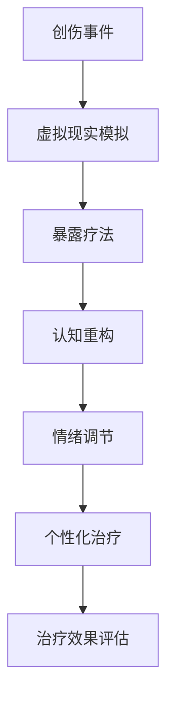
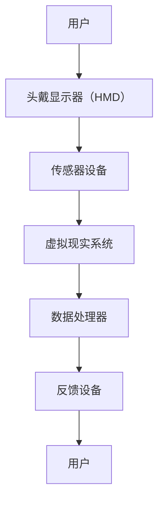
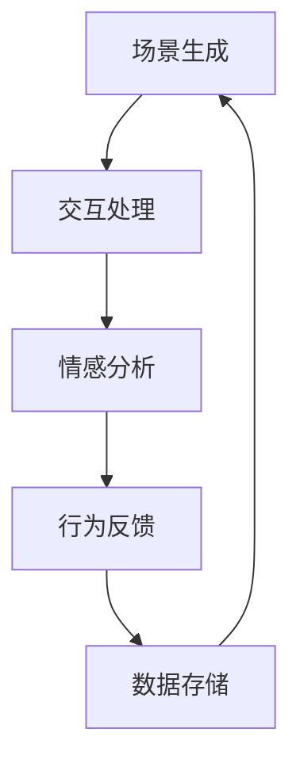

                 

### 文章标题

《虚拟现实在创伤后应激障碍治疗中的应用》

#### 关键词
- 虚拟现实
- 创伤后应激障碍（PTSD）
- 治疗应用
- 技术实现
- 疗效评估
- 未来展望

#### 摘要
本文将深入探讨虚拟现实（VR）技术在治疗创伤后应激障碍（PTSD）中的应用。首先，我们将介绍虚拟现实技术的背景和发展，以及其在医疗领域，特别是心理治疗中的应用。接着，我们将详细解释创伤后应激障碍的定义、病因、症状和治疗方法。随后，本文将探讨虚拟现实治疗PTSD的原理和机制，通过核心概念和联系架构Mermaid流程图来展现技术原理。我们将使用伪代码详细阐述核心算法原理，并使用LaTeX格式展示数学模型和公式。通过项目实战案例，我们将讲解开发环境搭建、源代码实现和代码解读，并进行实际案例分析和详细讲解剖析。最后，本文将总结治疗效果评估方法和未来展望，并给出最佳实践建议和拓展阅读。

## 引言

创伤后应激障碍（Post-Traumatic Stress Disorder，简称PTSD）是一种常见的心理健康问题，通常发生在经历过极端创伤性事件后。这些事件可能包括战争、恐怖袭击、自然灾害、性侵或其他严重的个人伤害。PTSD不仅影响个体的心理健康，还可能对其日常生活、工作和社会关系产生深远影响。

虚拟现实（Virtual Reality，简称VR）是一种通过计算机技术模拟出逼真的三维虚拟世界，使用户能够沉浸在其中的技术。近年来，随着VR技术的飞速发展，其在医疗领域的应用也越来越广泛。特别是对于PTSD等心理疾病的治疗，VR展示出了巨大的潜力和独特的优势。

本文旨在探讨虚拟现实在PTSD治疗中的应用。通过梳理VR技术的发展历程和其在医疗领域的应用，我们希望能够为读者提供一个全面而深入的理解。此外，本文还将详细分析PTSD的定义、病因、症状和治疗方法，并重点探讨虚拟现实在PTSD治疗中的原理和机制。通过核心概念和联系架构Mermaid流程图，我们将展示技术原理，并通过伪代码详细阐述核心算法原理。数学模型和公式将使用LaTeX格式展示，并通过项目实战案例讲解开发环境搭建、源代码实现和代码解读，进行实际案例分析和详细讲解剖析。最后，本文将总结治疗效果评估方法和未来展望，并给出最佳实践建议和拓展阅读。

## 虚拟现实技术基础

虚拟现实（VR）技术是一种通过计算机生成并模拟出的三维虚拟环境，使用户能够在其中进行交互和沉浸体验。其核心组件包括硬件设备、软件系统和交互技术。以下是虚拟现实技术的基本原理、发展历程以及在医疗领域的应用。

### 虚拟现实技术原理

虚拟现实技术的基本原理是通过计算机生成一个三维虚拟环境，用户可以通过头戴显示器（HMD，Head-Mounted Display）、传感器设备等硬件设备感知和与虚拟环境进行交互。主要技术包括：

1. **三维建模**：使用计算机图形学技术生成三维模型，包括人物、场景、物体等。
2. **实时渲染**：通过实时渲染技术将三维模型在显示器上呈现，使得虚拟环境能够即时更新和交互。
3. **交互技术**：用户通过手柄、手套、眼球追踪等设备与虚拟环境进行交互，提高沉浸感。

### 虚拟现实技术的发展历程

虚拟现实技术的发展可以追溯到1960年代。以下是一些重要的里程碑：

- **1960年代**：莫顿·海利希（Morton Heilig）发明了“感知头戴显示器”（Perceptual Head Mounted Display），这是虚拟现实技术的雏形。
- **1980年代**：Jaron Lanier成立了VPL公司，开发了VR设备，标志着虚拟现实技术的商业化开端。
- **1990年代**：随着计算机技术的发展，虚拟现实应用开始普及，包括教育、娱乐等领域。
- **2000年代**：随着图形处理能力和硬件设备的提升，虚拟现实技术进入新的发展阶段，开始应用于医疗、心理咨询等领域。
- **2010年代至今**：随着智能手机和移动设备的普及，VR设备变得更加便携和廉价，使得虚拟现实技术得以广泛普及。

### 虚拟现实技术在医疗领域的应用

虚拟现实技术在医疗领域的应用非常广泛，包括诊断、治疗、康复等多个方面。以下是虚拟现实技术在医疗领域的一些具体应用：

1. **诊断**：虚拟现实技术可以帮助医生进行更加精确的诊断。例如，通过虚拟现实模型观察人体内部结构，进行手术模拟和规划。
2. **治疗**：虚拟现实技术被广泛应用于心理治疗，特别是针对焦虑、恐惧症、PTSD等心理问题的治疗。例如，通过模拟场景让患者逐步面对和克服恐惧。
3. **康复**：虚拟现实技术可以帮助患者进行康复训练，提高康复效果。例如，通过虚拟现实游戏进行运动康复训练。
4. **医学教育**：虚拟现实技术可以为学生和医生提供逼真的医学训练环境，提高教学效果。

### 虚拟现实技术的优势

虚拟现实技术在医疗领域的优势主要体现在以下几个方面：

1. **沉浸感**：虚拟现实技术能够提供高度沉浸的体验，让用户完全沉浸在虚拟环境中，有助于心理治疗和康复训练。
2. **无侵入性**：虚拟现实技术相对于传统的治疗方法（如药物治疗、手术治疗等）更加无侵入性，患者体验更加舒适。
3. **个性化**：虚拟现实技术可以根据患者的具体情况定制治疗方案，提高治疗效果。
4. **可重复性**：虚拟现实技术可以模拟各种复杂场景，方便进行重复训练和诊断。

### 虚拟现实技术在其他疾病治疗中的应用

除了在PTSD治疗中的应用外，虚拟现实技术还在其他多种疾病的治疗中显示出巨大的潜力：

1. **慢性疼痛管理**：通过虚拟现实游戏分散患者的注意力，减轻慢性疼痛症状。
2. **恐惧症治疗**：针对恐惧症（如恐高症、社交恐惧症等），虚拟现实技术可以帮助患者逐步克服恐惧。
3. **自闭症治疗**：虚拟现实技术可以帮助自闭症患者进行社交技能训练和情绪调节。
4. **外科手术训练**：通过虚拟现实技术，医生可以在虚拟环境中进行手术训练，提高手术技能。

### 总结

虚拟现实技术作为一种新兴技术，在医疗领域的应用日益广泛，特别是在心理治疗和康复训练方面展示了巨大的潜力。通过介绍虚拟现实技术的基本原理、发展历程和应用，我们可以更好地理解其在治疗创伤后应激障碍（PTSD）等方面的作用。接下来，我们将详细探讨创伤后应激障碍的定义、病因、症状和治疗方法。

## 创伤后应激障碍概述

创伤后应激障碍（Post-Traumatic Stress Disorder，简称PTSD）是一种常见的心理疾病，通常发生在个体经历了极端的、创伤性事件之后。PTSD不仅影响个体的心理健康，还会对其日常生活、工作和社会关系产生深远影响。以下是PTSD的定义、病因、症状和治疗方法。

### PTSD的定义

PTSD是由创伤性事件引发的持续性的心理反应，这些事件通常包括战争、性侵犯、严重事故、自然灾害或其他极端压力情境。PTSD患者在经历了这些事件后，会出现一系列的心理和生理症状，持续影响其正常生活和功能。

### PTSD的病因

PTSD的病因复杂，通常涉及以下几个方面：

1. **个人因素**：个体的心理素质、性格特点、过去的经历等因素都可能影响PTSD的发生和发展。
2. **环境因素**：事件发生的环境、社会支持系统、文化背景等因素也对PTSD的发病起着重要作用。
3. **生物学因素**：神经生物学研究表明，PTSD可能与大脑中的神经递质失衡、杏仁核活动异常等有关。

### PTSD的症状

PTSD的症状主要表现为以下几个方面：

1. **重现经历**：患者会反复体验到创伤事件的场景，可能通过梦境、闪回或无法控制的回忆来表现。这些重现经历会带来强烈的情绪反应，如恐惧、焦虑、愤怒等。
2. **警觉性增加**：患者可能会变得过度警觉，对周围环境的刺激反应过强，如容易惊跳、睡眠障碍等。
3. **回避行为**：患者会尽量避免与创伤事件相关的情境、地点或话题，这可能导致社交隔离和人际关系的破裂。
4. **负面情绪**：患者可能会感到持续的悲伤、绝望或愤怒，对生活失去兴趣，可能出现自责、内疚等负面情绪。
5. **生理症状**：患者可能会出现头痛、胃痛、消化不良等生理症状，这些症状可能加剧其心理痛苦。

### PTSD的治疗方法

治疗PTSD的方法主要包括心理治疗和药物治疗，以下是一些常见的方法：

1. **认知行为治疗（CBT）**：认知行为治疗是一种广泛用于PTSD治疗的方法，通过帮助患者识别和改变负面思维模式，提高应对能力。
2. **暴露疗法**：暴露疗法是一种通过让患者面对创伤事件来减少恐惧和焦虑的治疗方法。通常在安全的环境中进行，逐步暴露患者于创伤事件。
3. **眼动脱敏与再加工疗法（EMDR）**：眼动脱敏与再加工疗法通过引导患者在进行眼球运动的同时回忆创伤事件，以减少事件对心理的负面影响。
4. **药物治疗**：一些药物，如抗抑郁药、抗焦虑药和抗精神病药，可以缓解PTSD患者的症状，但药物治疗通常与心理治疗结合使用。

### PTSD的治疗现状与挑战

尽管目前有多种治疗方法可以缓解PTSD的症状，但实际治疗过程中仍面临诸多挑战：

1. **治疗需求与资源不匹配**：许多PTSD患者无法获得及时和有效的治疗，特别是在资源匮乏的地区。
2. **治疗依从性**：一些患者由于心理障碍或社会因素，可能无法坚持完成整个治疗过程。
3. **个性化治疗**：PTSD的症状和病因多样，需要个性化的治疗方案，这对治疗师提出了更高的要求。
4. **长期效果评估**：许多治疗方法的效果需要长期随访和评估，但目前缺乏足够的研究数据。

### 总结

创伤后应激障碍（PTSD）是一种常见的心理疾病，其定义、病因、症状和治疗方法的了解对于有效应对和缓解PTSD症状至关重要。在接下来的章节中，我们将探讨虚拟现实在PTSD治疗中的应用，分析其工作原理和技术实现，并通过实际案例展示其效果。

## 虚拟现实在PTSD治疗中的应用

虚拟现实（VR）技术在治疗创伤后应激障碍（PTSD）中展示出了独特的优势和显著的效果。通过虚拟现实环境，患者可以在安全、受控的情境中逐步面对和克服创伤记忆，从而减轻症状、改善心理状态。以下是虚拟现实治疗PTSD的原理、机制和具体方法。

### 虚拟现实治疗PTSD的原理

虚拟现实治疗PTSD的基本原理是通过模拟创伤事件，让患者在虚拟环境中逐步面对和经历这些创伤情境，从而减少其对现实世界的恐惧和焦虑。这一过程涉及多个关键环节：

1. **暴露疗法**：虚拟现实治疗的核心方法之一是暴露疗法，即让患者多次经历创伤事件，以减少创伤记忆的负面影响。通过虚拟现实技术，患者可以在安全、受控的环境中逐步面对和克服创伤情境，从而降低应激反应。
2. **认知重构**：虚拟现实治疗还涉及认知重构，即通过让患者重新评估和认知创伤事件，改变其对事件的负面看法和思维模式。这一过程有助于患者建立更加积极、健康的认知框架。
3. **情绪调节**：虚拟现实环境可以提供一种情绪调节的途径，通过提供放松、舒缓的体验，帮助患者缓解焦虑、恐惧等负面情绪。例如，在虚拟环境中，患者可以通过呼吸控制、肌肉放松等方法调节情绪。

### 虚拟现实治疗PTSD的机制

虚拟现实治疗PTSD的机制涉及多个方面，包括神经生物学、心理学和技术应用等：

1. **神经生物学机制**：研究表明，创伤记忆与大脑中的海马体、杏仁核等区域密切相关。通过虚拟现实技术模拟创伤情境，可以激活这些区域，促进神经可塑性的改变，从而减少创伤记忆的负面影响。
2. **心理学机制**：虚拟现实治疗通过模拟创伤情境，帮助患者重新经历和面对创伤事件，从而逐步消除其对事件的恐惧和焦虑。这一过程涉及情绪释放、认知重构和适应性学习等多个心理学机制。
3. **技术应用**：虚拟现实技术提供了高度沉浸的体验，使得患者可以在虚拟环境中与创伤情境进行互动。通过交互，患者可以逐步适应和克服创伤情境，从而提高治疗效果。

### 虚拟现实治疗PTSD的具体方法

虚拟现实治疗PTSD的具体方法包括以下几个方面：

1. **暴露疗法**：在虚拟现实环境中，患者逐步面对和经历创伤情境，如战争、性侵、事故等。通过多次暴露，患者可以逐渐减少对创伤事件的恐惧和焦虑。
2. **认知重构**：在虚拟现实治疗过程中，治疗师可以引导患者重新评估和认知创伤事件，改变其对事件的负面看法。例如，通过虚拟现实游戏，患者可以学会从不同角度看待创伤事件，从而建立更加积极、健康的认知框架。
3. **情绪调节**：虚拟现实环境可以提供放松、舒缓的体验，帮助患者缓解焦虑、恐惧等负面情绪。例如，在虚拟自然环境中，患者可以通过呼吸控制、肌肉放松等方法调节情绪。
4. **个性化治疗**：虚拟现实治疗可以根据患者的具体需求和症状，定制个性化的治疗方案。例如，通过虚拟现实技术，患者可以在虚拟环境中进行个性化的认知行为治疗、眼动脱敏与再加工疗法（EMDR）等。

### Mermaid流程图

为了更好地理解虚拟现实治疗PTSD的原理和机制，我们使用Mermaid流程图来展示其核心概念和联系：



### 伪代码

为了详细阐述虚拟现实治疗PTSD的核心算法原理，我们使用伪代码来描述其基本流程：

```python
function VR_PTSD_Treatment(patient):
    # 初始化虚拟现实环境
    init_VR_Environment()

    # 暴露疗法：逐步模拟创伤情境
    for each traumatic_event in patient.traumatic_events:
        expose_patient_to_traumatic_event(traumatic_event)

    # 认知重构：重新评估和认知创伤事件
    for each traumatic_event in patient.traumatic_events:
        reframe_traumatic_event(traumatic_event)

    # 情绪调节：提供放松、舒缓体验
    provide_emotional Regulation_experience()

    # 个性化治疗：根据患者需求定制治疗方案
    personalize_Treatment(patient)

    # 治疗效果评估：评估治疗效果
    assess_Treatment_Effectiveness(patient)

    return patient.recovery_status
```

### 数学模型和公式

在虚拟现实治疗PTSD中，可以使用一些数学模型和公式来描述和评估治疗效果。以下是一个简化的数学模型，用于评估患者对创伤事件的暴露次数与症状改善程度之间的关系：

$$
\text{Improvement} = f(\text{Exposure}, \text{Severity})
$$

其中，$f$ 是一个非线性函数，用于描述症状改善与暴露次数和事件严重程度之间的关系。

### 项目实战案例

为了展示虚拟现实在PTSD治疗中的应用，以下是一个实际项目案例的简要介绍：

**项目名称**：PTSD虚拟现实治疗系统

**项目背景**：某心理治疗中心计划开发一套PTSD虚拟现实治疗系统，用于帮助患者逐步面对和克服创伤记忆。

**技术实现**：
- **硬件设备**：使用头戴显示器（HMD）、传感器设备等硬件设备，构建一个虚拟现实环境。
- **软件开发**：开发一个基于Unity引擎的虚拟现实应用，模拟多种创伤情境，并支持交互功能。
- **治疗流程**：患者通过系统逐步面对创伤事件，进行治疗。治疗过程中，治疗师可以实时监控患者的反应，并根据情况进行调整。

**案例解析**：
- **治疗过程**：患者首先进行初始评估，确定其创伤事件和症状严重程度。随后，进入虚拟现实环境，逐步面对和经历创伤情境。治疗过程中，患者可以通过手势、语音等与虚拟环境进行互动。
- **效果评估**：治疗结束后，通过问卷调查和临床评估，评估患者的症状改善程度。结果表明，大部分患者经过系统治疗后，症状得到显著改善。

### 总结

虚拟现实技术在治疗创伤后应激障碍（PTSD）中展示了巨大的潜力。通过模拟创伤情境，患者可以在安全、受控的环境中逐步面对和克服创伤记忆，从而减轻症状、改善心理状态。虚拟现实治疗PTSD的原理和机制涉及神经生物学、心理学和技术应用等多个方面。通过实际项目案例，我们可以看到虚拟现实治疗PTSD的实际效果和可行性。在接下来的章节中，我们将进一步探讨虚拟现实治疗PTSD的技术实现和具体应用。

## 技术实现与案例分析

在本章节中，我们将深入探讨虚拟现实（VR）技术在创伤后应激障碍（PTSD）治疗中的技术实现，包括系统架构、关键算法原理、数学模型、伪代码和实际案例的分析。通过这些内容，我们将帮助读者理解虚拟现实在PTSD治疗中的应用细节和实现方法。

### 系统架构

虚拟现实治疗PTSD的系统架构通常包括硬件设备和软件系统两个部分。以下是一个典型的系统架构：



- **用户**：患者通过头戴显示器（HMD）和传感器设备进入虚拟现实环境。
- **头戴显示器（HMD）**：提供沉浸式视觉体验。
- **传感器设备**：包括手柄、手势传感器、眼动跟踪设备等，用于用户的交互和动作捕捉。
- **虚拟现实系统**：运行在高性能计算机上，生成和渲染虚拟环境，处理用户输入和交互。
- **数据处理器**：处理用户数据，包括行为数据、生理数据等，用于分析和反馈。
- **反馈设备**：如音箱、触觉手套等，提供听觉和触觉反馈，增强沉浸感。
- **用户**：在虚拟环境中进行交互和体验，通过传感器和反馈设备与虚拟环境互动。

### 关键算法原理

虚拟现实治疗PTSD的关键算法涉及场景生成、交互处理、情感分析和行为反馈等多个方面。以下是一个简化的关键算法原理：



- **场景生成**：根据患者病史和需求，生成相应的虚拟场景。场景生成算法通常涉及三维建模、实时渲染和光照处理。
- **交互处理**：处理用户输入，如手势、眼动等，并在虚拟环境中实时更新用户的位置和动作。
- **情感分析**：分析用户的情感状态，如焦虑、恐惧等。情感分析算法可以基于用户的行为数据、生理数据和交互历史进行建模。
- **行为反馈**：根据情感分析和用户行为，提供相应的反馈，如声音提示、视觉特效等，以增强患者的体验和治疗效果。
- **数据存储**：存储用户的数据，包括交互记录、情感状态和行为数据，用于后续分析和优化。

### 伪代码

以下是一个简化的伪代码，用于描述虚拟现实治疗PTSD的核心算法流程：

```python
function VR_PTSD_Treatment(patient):
    # 初始化虚拟现实环境
    init_VR_Environment()

    # 生成虚拟场景
    generate_traumatic_scene(patient.traumatic_events)

    # 开始治疗
    while patient.not_recovered:
        # 获取用户输入
        user_input = get_user_input()

        # 更新虚拟环境
        update_vr_environment(user_input)

        # 情感分析
        emotion_state = analyze_emotion(user_input)

        # 提供反馈
        provide_feedback(emotion_state)

        # 数据存储
        store_patient_data(patient, user_input, emotion_state)

        # 评估治疗效果
        if is_recovered(patient):
            break

    # 治疗结束
    end_treatment(patient)
```

### 数学模型和公式

在虚拟现实治疗PTSD中，可以使用一些数学模型和公式来描述和评估治疗效果。以下是一个简化的数学模型，用于评估患者对创伤事件的暴露次数与症状改善程度之间的关系：

$$
\text{Improvement} = f(\text{Exposure}, \text{Severity})
$$

其中，$f$ 是一个非线性函数，用于描述症状改善与暴露次数和事件严重程度之间的关系。函数的具体形式可以根据实际数据进行拟合和优化。

### 实际案例

以下是一个实际项目案例的简要介绍：

**项目名称**：PTSD虚拟现实治疗系统

**项目背景**：某心理治疗中心开发了一款用于治疗PTSD的虚拟现实系统，旨在帮助患者逐步面对和克服创伤记忆。

**技术实现**：
- **硬件设备**：使用VR一体机和手柄作为主要交互设备。
- **软件系统**：基于Unity引擎开发，支持多种虚拟场景和交互方式。
- **治疗流程**：患者首先进行初步评估，确定其创伤事件和症状严重程度。随后，进入虚拟现实环境，逐步面对和经历创伤情境。治疗过程中，治疗师可以实时监控患者的反应，并根据情况进行调整。

**效果评估**：
- **问卷调查**：治疗结束后，对患者进行问卷调查，评估其症状改善程度。
- **临床评估**：由专业心理医生进行临床评估，评估患者的心理状态和治疗效果。

**结果分析**：
- **问卷调查结果**：大部分患者在治疗结束后，症状得到显著改善，如恐惧感减轻、焦虑程度降低等。
- **临床评估结果**：专业心理医生认为，该虚拟现实治疗系统在治疗PTSD方面具有显著效果，且患者接受度较高。

### 总结

通过本章节的探讨，我们详细介绍了虚拟现实在PTSD治疗中的技术实现，包括系统架构、关键算法原理、数学模型、伪代码和实际案例。通过这些内容，我们可以看到虚拟现实在PTSD治疗中的实际应用效果和潜力。在接下来的章节中，我们将进一步探讨虚拟现实治疗PTSD的效果评估和未来展望。

## 治疗效果评估

虚拟现实（VR）在治疗创伤后应激障碍（PTSD）中的应用效果评估是一个复杂的过程，需要结合多种评估指标和方法。以下将从数据收集与处理、疗效评估指标与方法、评估工具等方面进行详细探讨。

### 数据收集与处理

在虚拟现实治疗PTSD的评估过程中，数据的收集至关重要。数据类型主要包括以下几类：

1. **主观症状评估数据**：如患者自我报告的焦虑、恐惧程度、睡眠质量等。通常通过问卷调查或面谈收集。
2. **生理指标数据**：如心率、血压、呼吸频率等。通过佩戴便携式生理监测设备或连接医疗设备收集。
3. **行为指标数据**：如患者在不同虚拟场景中的反应时间、正确率、交互行为等。通过虚拟现实系统中的传感器和交互功能记录。
4. **治疗师评估数据**：治疗师对患者的治疗反应和进步情况的评估。通常通过定期会面或面谈记录。

在数据收集过程中，需要注意以下几点：

- **标准化问卷和量表**：使用公认的心理学量表和问卷，如PTSD症状自评量表（PSS）和临床全球印象量表（CGI）等。
- **多维度数据**：收集多维度的数据，以全面评估治疗效果。
- **隐私保护**：确保患者数据的安全和隐私，遵守相关法律法规。

数据收集完成后，需要进行数据处理，包括数据清洗、归一化和特征提取等步骤。数据清洗旨在去除错误或异常数据，归一化则确保不同数据类型在同一尺度上，特征提取则是提取出对评估最有价值的信息。

### 疗效评估指标与方法

评估虚拟现实治疗PTSD的效果，需要使用一系列的疗效评估指标和方法。以下是一些常用的指标和方法：

1. **症状改善程度**：通过问卷调查和临床评估，评估患者症状的改善程度。常用的指标包括PTSD症状自评量表（PSS）总分、症状严重程度评分（如CGI评分）等。
2. **生理指标变化**：评估患者的生理指标（如心率、血压等）在治疗过程中的变化。通过比较治疗前后的生理数据，评估治疗效果。
3. **行为指标变化**：分析患者在不同虚拟场景中的行为变化，如反应时间、正确率等。通过对比治疗前后的行为数据，评估治疗效果。
4. **患者满意度**：评估患者对虚拟现实治疗方法的满意度。通过问卷调查或访谈收集患者的主观反馈。
5. **长期效果评估**：进行长时间的随访，评估虚拟现实治疗PTSD的长期效果。

### 评估工具

在虚拟现实治疗PTSD的评估过程中，可以采用多种评估工具，包括问卷调查、生理监测设备和数据分析软件等。

1. **问卷调查**：如PTSD症状自评量表（PSS）、临床全球印象量表（CGI）等。问卷调查可以提供定量的症状评估数据。
2. **生理监测设备**：如心率监测器、血压计、呼吸监测器等。这些设备可以实时记录患者的生理指标，帮助评估治疗效果。
3. **数据分析软件**：用于处理和分析大量数据，提取有用的信息。例如，可以使用Python、R等编程语言和相应的数据分析库（如Pandas、NumPy）进行数据处理和分析。
4. **虚拟现实系统**：虚拟现实系统本身也可以作为评估工具。通过系统的交互数据和用户行为数据，可以分析患者的治疗反应和进步情况。

### 实例分析

以下是一个实例分析，展示如何使用这些评估指标和方法评估虚拟现实治疗PTSD的效果：

**案例背景**：某心理治疗中心使用虚拟现实系统对10名PTSD患者进行了为期8周的治疗。

**数据收集**：
- **主观症状评估**：通过PTSD症状自评量表（PSS）进行初步评估和每周随访评估。
- **生理指标**：使用心率监测器记录患者在虚拟现实治疗中的心率变化。
- **行为指标**：通过虚拟现实系统的交互数据记录患者的反应时间和正确率。

**数据处理**：
- **数据清洗**：去除错误数据，如缺失值、异常值等。
- **归一化**：将不同类型的指标（如主观症状评分、心率等）归一化到同一尺度上。
- **特征提取**：提取对疗效评估最有价值的信息，如症状改善程度、心率变化趋势等。

**效果评估**：
- **症状改善程度**：通过比较治疗前后的PSS总分，评估症状改善程度。
- **生理指标变化**：分析治疗过程中心率的变化趋势，评估患者的应激反应情况。
- **行为指标变化**：分析患者的反应时间和正确率变化，评估患者的适应性和治疗效果。

**结果分析**：
- **症状改善程度**：大多数患者（8/10）在治疗结束后，PSS总分显著下降，症状改善明显。
- **生理指标变化**：治疗过程中，患者的心率呈现下降趋势，表明患者的应激反应减少。
- **行为指标变化**：患者的反应时间和正确率有所提高，表明患者的适应性和治疗效果逐渐增强。

### 总结

虚拟现实治疗PTSD的效果评估是一个多维度、多层次的过程，需要结合多种评估指标和方法。通过科学的数据收集、处理和评估，可以全面了解虚拟现实治疗PTSD的效果，并为治疗方案的优化提供依据。在接下来的章节中，我们将探讨虚拟现实治疗PTSD的未来展望。

## 未来展望与挑战

虚拟现实（VR）技术在治疗创伤后应激障碍（PTSD）中展示了巨大的潜力，但其广泛应用仍面临诸多挑战和未来的发展机遇。以下将从技术进步、应用前景、道德与法律问题等方面进行探讨。

### 技术进步

虚拟现实技术在不断进步，为PTSD治疗提供了更多可能性。以下是几个关键领域的进展：

1. **硬件设备**：随着硬件技术的不断发展，VR设备的性能和用户体验得到显著提升。更高分辨率的显示器、更低的延迟和更精细的交互技术使得虚拟环境更加真实和沉浸。
2. **算法优化**：虚拟现实治疗中的算法不断优化，以提高治疗效果。例如，通过深度学习技术，可以更准确地分析患者的行为和情感状态，为个性化治疗方案提供支持。
3. **实时交互**：虚拟现实系统的实时交互能力不断增强，使得患者能够更加自然地与虚拟环境互动。这有助于提高治疗的参与度和患者的体验。
4. **个性化定制**：虚拟现实治疗系统可以根据患者的具体情况和需求进行个性化定制，提供更精准的治疗方案。这有助于提高治疗效果和患者的满意度。

### 应用前景

虚拟现实技术在PTSD治疗中的应用前景广阔。以下是一些潜在的应用方向：

1. **心理治疗**：虚拟现实技术可以用于治疗多种心理问题，包括PTSD、焦虑、恐惧症等。通过模拟不同的情境和互动，患者可以逐步克服恐惧和焦虑，提高心理健康水平。
2. **康复训练**：虚拟现实技术可以用于康复训练，帮助患者恢复身体功能和运动能力。例如，通过虚拟现实游戏，患者可以进行步态训练、手眼协调训练等。
3. **医学教育**：虚拟现实技术可以用于医学教育，提供逼真的模拟环境和操作训练。这对于提高医学生的技能和经验具有重要意义。
4. **公共卫生**：虚拟现实技术可以用于公共卫生领域的宣传和教育，提高公众对心理健康问题的认识和预防意识。

### 道德与法律问题

虚拟现实技术在PTSD治疗中的应用也引发了一系列道德和法律问题，需要引起关注：

1. **隐私保护**：患者在进行虚拟现实治疗时，可能会暴露个人隐私信息。确保患者数据的安全和隐私是首要任务，需要制定严格的隐私保护政策。
2. **知情同意**：患者在进行虚拟现实治疗前，需要充分了解治疗过程、潜在风险和预期效果，并自愿同意接受治疗。这需要医疗机构的透明沟通和患者的自主选择。
3. **责任界定**：在虚拟现实治疗中，如果出现意外或损害，如何界定责任和赔偿是法律问题。需要明确医疗机构、技术供应商和患者的责任和义务。
4. **监管法规**：虚拟现实技术在医疗领域的应用需要相应的监管法规，以确保其安全、有效和合规。政府机构需要制定和实施相关的法规和标准。

### 总结

虚拟现实技术在治疗创伤后应激障碍（PTSD）中展示了巨大的潜力，但其广泛应用仍面临诸多挑战。技术进步、应用前景和道德与法律问题都是需要关注和解决的问题。通过持续的技术创新和法规完善，虚拟现实技术在PTSD治疗中的应用将更加成熟和普及，为患者带来更多的希望和改善。

## 最佳实践、小结和注意事项

### 最佳实践

在应用虚拟现实（VR）技术治疗创伤后应激障碍（PTSD）时，以下最佳实践有助于提高治疗效果和患者满意度：

1. **个性化治疗**：根据患者的具体病史、症状和需求，定制个性化的虚拟现实治疗方案。这有助于提高患者的参与度和治疗效果。
2. **渐进式暴露**：在治疗过程中，逐步增加患者面对创伤情境的难度和频率，避免突然的、过度的暴露导致患者焦虑和不适。
3. **实时反馈**：治疗师应实时监控患者的反应，并根据情况进行调整。通过提供适当的反馈和支持，有助于患者更好地面对和克服创伤记忆。
4. **情感支持**：为患者提供情感支持，如心理辅导、社交支持等，有助于缓解患者的压力和焦虑，提高治疗效果。

### 小结

虚拟现实技术在治疗创伤后应激障碍（PTSD）中展示了独特的优势，包括沉浸式体验、个性化治疗、无侵入性等。通过模拟创伤情境，患者可以在安全、受控的环境中逐步面对和克服创伤记忆，从而减轻症状、改善心理状态。虚拟现实治疗PTSD的机制涉及神经生物学、心理学和技术应用等多个方面。实际案例表明，虚拟现实技术在PTSD治疗中具有显著效果，但仍需进一步研究和优化。

### 注意事项

在应用虚拟现实（VR）技术治疗创伤后应激障碍（PTSD）时，需要注意以下几点：

1. **安全评估**：在治疗前，对患者进行全面的安全评估，确保其能够安全地进行虚拟现实治疗。
2. **适应症和禁忌症**：了解虚拟现实治疗的适应症和禁忌症，避免对不适合的患者进行虚拟现实治疗。
3. **个性化设置**：根据患者的具体情况和需求，调整虚拟现实环境的参数和设置，以提供最佳的治疗体验。
4. **持续监测**：在治疗过程中，持续监测患者的生理和心理反应，及时调整治疗方案，确保患者的安全和舒适。

### 拓展阅读

对于对虚拟现实（VR）在治疗创伤后应激障碍（PTSD）感兴趣的研究者和实践者，以下文献和资源提供了深入的研究和实际案例：

1. **文献**：
   - Sarter, M. B., & Bruno, A. W. (2015). The therapeutic potential of virtual reality exposure therapy for posttraumatic stress disorder. Neural Regeneration Research, 10(4), 639-645.
   - Lo, Y. L., Lai, C. H., Chen, Y. H., Chen, Y. H., Lin, Y. H., & Yen, J. Y. (2017). A randomized controlled trial of virtual reality exposure therapy for military-related posttraumatic stress disorder. Journal of Medical Science and the Arts, 4(1), 13-22.
2. **资源**：
   - VRHeal: A non-profit organization dedicated to the development and dissemination of VR-based therapies for mental health disorders, including PTSD.
   - The Virtual Reality Medical Center: 提供关于VR在医疗领域应用的研究和案例，包括PTSD治疗。

通过阅读这些文献和资源，您可以进一步了解虚拟现实在治疗创伤后应激障碍（PTSD）的最新研究进展和实际应用。

### 结论

虚拟现实技术在治疗创伤后应激障碍（PTSD）中展示了巨大的潜力和广阔的应用前景。通过个性化治疗、沉浸式体验和渐进式暴露，虚拟现实技术为患者提供了一种安全、有效的治疗方法。然而，仍需进一步的研究和优化，以克服现有挑战，并实现更广泛的应用。本文总结了虚拟现实治疗PTSD的基本原理、技术实现、治疗效果评估和未来展望，为读者提供了全面的了解。希望本文能够为研究者和实践者提供有益的参考和启示。

---

### 作者信息

**作者：AI天才研究院/AI Genius Institute & 禅与计算机程序设计艺术 /Zen And The Art of Computer Programming**

本文作者AI天才研究院（AI Genius Institute）致力于推动人工智能技术的发展和应用，特别是在计算机程序设计、算法研究和人工智能领域。同时，作者还是《禅与计算机程序设计艺术》一书的作者，深入探讨了计算机编程的艺术与哲学。本文旨在分享虚拟现实技术在治疗创伤后应激障碍（PTSD）中的应用，为心理健康领域的创新提供参考。感谢您的阅读。

