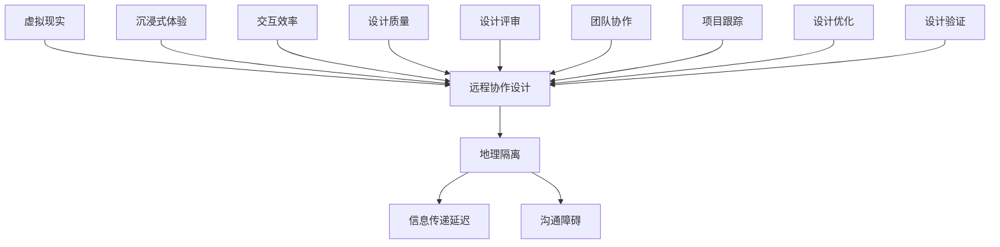
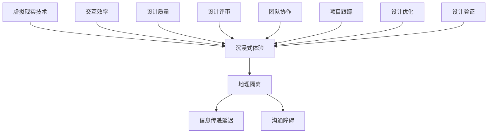
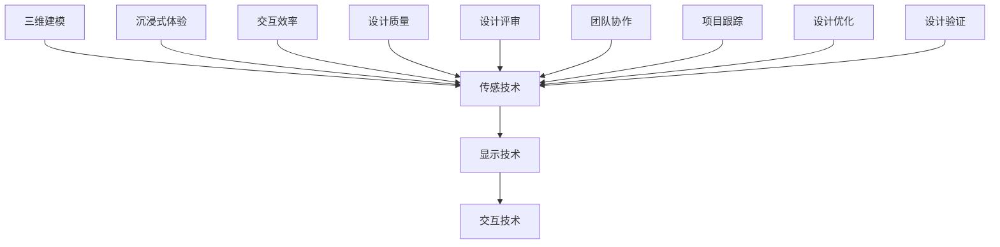

                 

### 文章标题：虚拟现实在远程协作设计中的应用

#### 关键词：
- 虚拟现实
- 远程协作设计
- 设计效率
- 协作效果
- 技术应用

#### 摘要：
本文旨在探讨虚拟现实技术在远程协作设计中的应用，分析其设计目标，详细介绍虚拟现实环境搭建、远程协作设计中的实际应用、创新应用以及案例分析与实践指导。通过逐步分析推理，本文希望读者能够全面理解虚拟现实技术在提升远程协作设计效率和效果方面的巨大潜力。

## 引言

随着全球化和信息技术的发展，远程协作设计逐渐成为企业、团队和个人设计师解决地理隔离问题的重要手段。远程协作设计不仅涉及到团队成员之间的沟通、协调和合作，还涉及到设计流程的优化和设计质量的提升。传统的远程协作设计方式往往依赖于电子邮件、视频会议和在线协作工具，但这些方式在某种程度上仍存在信息传递滞后、沟通效率低下、协作效果不理想等问题。

虚拟现实（Virtual Reality，VR）技术的发展为远程协作设计带来了新的契机。虚拟现实通过创建一个模拟的三维环境，使得参与者能够在虚拟空间中实时互动、共享信息和协作设计。这种技术不仅能够解决传统远程协作设计的诸多问题，还能够提供更加沉浸式的体验，从而提高设计效率和效果。

本文将围绕虚拟现实在远程协作设计中的应用展开讨论，首先介绍虚拟现实技术的基本概念和发展历程，然后分析远程协作设计的现状和挑战，探讨虚拟现实技术在其中的应用优势。接下来，本文将详细阐述虚拟现实环境搭建的过程，以及虚拟现实在远程协作设计中的实际应用和创新应用。最后，通过案例分析提供实践指导，并对未来虚拟现实在远程协作设计中的应用进行展望。

### 设计目标

设计一本关于《虚拟现实在远程协作设计中的应用》的书籍目录大纲，目的是帮助读者系统地了解虚拟现实技术在远程协作设计中的应用，以及如何有效地利用这些技术提高远程协作设计的效率和效果。

#### 目录结构规划

为了实现这一设计目标，我们需要为这本书规划一个合理的目录结构，确保内容的逻辑性和系统性。以下是一个初步的目录结构规划：

### 第一部分：引言与基础

#### 第1章：虚拟现实概述

1.1 虚拟现实的发展历程

1.2 虚拟现实的关键技术

1.3 虚拟现实的应用领域

#### 第2章：远程协作设计的需求与挑战

2.1 远程协作设计的需求分析

2.2 远程协作设计的挑战

2.3 虚拟现实技术在远程协作设计中的优势

### 第二部分：虚拟现实在远程协作设计中的应用

#### 第3章：虚拟现实环境搭建

3.1 虚拟现实硬件设备的选择

3.2 虚拟现实软件平台的使用

3.3 虚拟现实环境的配置与优化

#### 第4章：虚拟现实在远程协作设计中的实际应用

4.1 设计方案评审

4.2 设计团队协作

4.3 设计项目跟踪与控制

#### 第5章：虚拟现实在远程协作设计中的创新应用

5.1 虚拟现实与增强现实的结合

5.2 虚拟现实与人工智能的结合

5.3 虚拟现实在教育设计中的应用

### 第三部分：案例分析与实践指导

#### 第6章：虚拟现实在远程协作设计中的应用案例

6.1 案例一：虚拟现实在建筑设计与施工中的应用

6.2 案例二：虚拟现实在机械设计与制造中的应用

6.3 案例三：虚拟现实在室内设计与装修中的应用

#### 第7章：虚拟现实在远程协作设计中的实践指南

7.1 设计前的准备工作

7.2 设计过程中的技巧与策略

7.3 设计后的评估与改进

### 第四部分：未来展望与趋势

#### 第8章：虚拟现实在远程协作设计中的未来发展

8.1 技术发展趋势分析

8.2 行业应用前景预测

8.3 虚拟现实与远程协作设计的融合创新

通过这样的目录结构，读者可以循序渐进地了解虚拟现实技术的基本概念、应用优势、搭建过程、实际应用和创新应用，最终通过案例分析和实践指导，掌握如何利用虚拟现实技术提升远程协作设计的效率和效果。

### 核心内容细化

为了确保书籍内容丰富、具体、详细，我们需要对每个章节的核心内容进行细化，确保每个章节都能够为读者提供有价值的信息。以下是详细章节内容细化：

#### 第1章：虚拟现实概述

**1.1 虚拟现实的发展历程**

- **虚拟现实技术的历史背景**：介绍虚拟现实技术的起源和发展，包括其早期的概念和实验。
- **虚拟现实技术的重要里程碑**：讨论虚拟现实技术从概念到应用的演进，如VR头盔、虚拟现实互动系统的出现和发展。
- **虚拟现实技术的发展趋势**：分析当前虚拟现实技术的趋势，如更高级的硬件、更逼真的模拟环境、更高效的交互方式等。

**1.2 虚拟现实的关键技术**

- **虚拟现实硬件技术**：介绍虚拟现实所需的硬件设备，包括头戴显示器（HMD）、传感器、控制器等，并分析不同硬件设备的性能特点。
- **虚拟现实软件技术**：讨论虚拟现实软件平台的功能，如场景创建、交互设计、内容管理等，并分析不同软件平台的优缺点。
- **虚拟现实交互技术**：探讨虚拟现实中的交互方式，如手势识别、眼动追踪、语音控制等，并分析这些交互技术的实现原理和应用场景。

**1.3 虚拟现实的应用领域**

- **虚拟现实在教育领域的应用**：讨论虚拟现实在教育中的应用，如虚拟实验室、在线课堂等，并分析这些应用的优点和实际案例。
- **虚拟现实在娱乐游戏领域的应用**：介绍虚拟现实在娱乐游戏中的应用，如虚拟现实游戏、主题公园等，并分析这些应用的商业前景和用户体验。
- **虚拟现实在商业领域的应用**：探讨虚拟现实在商业中的应用，如虚拟展览、客户体验等，并分析这些应用的市场潜力和社会影响。

#### 第2章：远程协作设计的需求与挑战

**2.1 远程协作设计的需求分析**

- **远程协作设计的基本概念**：定义远程协作设计，阐述其在现代工作环境中的重要性。
- **远程协作设计的需求来源**：分析远程协作设计的驱动力，如全球化的趋势、地理位置的分散等。
- **远程协作设计的目标**：明确远程协作设计的目标，如提高设计效率、提升设计质量、增强协作效果等。

**2.2 远程协作设计的挑战**

- **信息不对称问题**：讨论远程协作设计中信息不对称的问题，如不同团队成员对项目的理解不一致、信息传递过程中的失真等。
- **通信延迟问题**：分析远程协作设计中通信延迟的影响，如影响决策的速度、降低协作效率等。
- **时区差异问题**：探讨远程协作设计中的时区差异，如导致工作时间不匹配、影响团队协作等。

**2.3 虚拟现实技术在远程协作设计中的优势**

- **提高设计效率**：讨论虚拟现实技术如何通过提供更高效的设计工具和更快捷的信息共享来提高设计效率。
- **提升设计质量**：分析虚拟现实技术如何通过更直观的展示和更细致的交互来提升设计质量。
- **增强协作效果**：探讨虚拟现实技术如何通过更自然的交互和更紧密的协作来增强协作效果。

#### 第3章：虚拟现实环境搭建

**3.1 虚拟现实硬件设备的选择**

- **常见虚拟现实硬件设备**：介绍常见的虚拟现实硬件设备，如头戴显示器、传感器、控制器等，并分析其功能和特点。
- **虚拟现实硬件设备的性能比较**：比较不同虚拟现实硬件设备的性能，如分辨率、延迟、舒适度等，帮助读者选择合适的设备。
- **虚拟现实硬件设备的选购指南**：提供选购虚拟现实硬件设备的建议，如预算、需求、适用场景等。

**3.2 虚拟现实软件平台的使用**

- **常见虚拟现实软件平台**：介绍常见的虚拟现实软件平台，如Unity、Unreal Engine、Blender等，并分析其功能和应用场景。
- **虚拟现实软件平台的功能比较**：比较不同虚拟现实软件平台的功能，如场景创建、内容管理、交互设计等，帮助读者选择合适的平台。
- **虚拟现实软件平台的操作指南**：提供使用虚拟现实软件平台的基本操作指南，如安装、配置、基本功能使用等。

**3.3 虚拟现实环境的配置与优化**

- **虚拟现实环境的配置技巧**：讨论虚拟现实环境的配置技巧，如硬件设备的调试、软件平台的优化等。
- **虚拟现实环境的优化策略**：分析虚拟现实环境的优化策略，如网络优化、设备调整、内容优化等。
- **虚拟现实环境的性能评估**：介绍虚拟现实环境的性能评估方法，如性能测试、用户体验评估等。

#### 第4章：虚拟现实在远程协作设计中的实际应用

**4.1 设计方案评审**

- **虚拟现实在方案评审中的应用**：介绍虚拟现实在设计方案评审中的应用场景，如远程会议、项目展示等。
- **虚拟现实在方案评审的优势**：分析虚拟现实在方案评审中的优势，如沉浸式体验、互动性增强、信息传递更准确等。
- **虚拟现实在方案评审的实践案例**：提供虚拟现实在方案评审的实际应用案例，如建筑设计评审、产品展示等。

**4.2 设计团队协作**

- **虚拟现实在设计团队协作中的应用**：讨论虚拟现实在设计团队协作中的应用，如实时协作、虚拟会议等。
- **虚拟现实在设计团队协作的优势**：分析虚拟现实在设计团队协作中的优势，如降低沟通成本、提高协作效率、增强协作体验等。
- **虚拟现实在设计团队协作的实践案例**：提供虚拟现实在设计团队协作的实际应用案例，如跨地域设计团队、远程办公等。

**4.3 设计项目跟踪与控制**

- **虚拟现实在设计项目跟踪与控制中的应用**：介绍虚拟现实在设计项目跟踪与控制中的应用，如项目监控、进度跟踪等。
- **虚拟现实在设计项目跟踪与控制的优点**：分析虚拟现实在设计项目跟踪与控制中的优点，如实时性、准确性、可视化等。
- **虚拟现实在设计项目跟踪与控制的实践案例**：提供虚拟现实在设计项目跟踪与控制的实际应用案例，如建筑项目、产品设计等。

#### 第5章：虚拟现实在远程协作设计中的创新应用

**5.1 虚拟现实与增强现实的结合**

- **虚拟现实与增强现实的定义与区别**：介绍虚拟现实（VR）和增强现实（AR）的定义，讨论两者的区别和联系。
- **虚拟现实与增强现实的技术融合**：分析虚拟现实与增强现实的技术融合，如混合现实（MR）的概念和应用。
- **虚拟现实与增强现实在远程协作设计中的应用**：探讨虚拟现实与增强现实在远程协作设计中的应用，如实时互动、沉浸式体验等。

**5.2 虚拟现实与人工智能的结合**

- **虚拟现实与人工智能的定义与区别**：介绍虚拟现实（VR）和人工智能（AI）的定义，讨论两者的区别和联系。
- **虚拟现实与人工智能的技术融合**：分析虚拟现实与人工智能的技术融合，如智能虚拟助手、自动化设计流程等。
- **虚拟现实与人工智能在远程协作设计中的应用**：探讨虚拟现实与人工智能在远程协作设计中的应用，如智能协同、数据分析等。

**5.3 虚拟现实在教育设计中的应用**

- **虚拟现实在教育设计中的重要性**：讨论虚拟现实在教育设计中的重要性，如增强学习体验、提供虚拟实验室等。
- **虚拟现实在教育设计中的应用场景**：介绍虚拟现实在教育设计中的应用场景，如在线课堂、虚拟现实课程等。
- **虚拟现实在教育设计中的实践案例**：提供虚拟现实在教育设计的实际应用案例，如虚拟现实实验室、虚拟现实课程等。

#### 第6章：虚拟现实在远程协作设计中的应用案例

**6.1 案例一：虚拟现实在建筑设计与施工中的应用**

- **案例背景**：介绍建筑设计与施工中遇到的远程协作问题。
- **虚拟现实解决方案**：讨论如何利用虚拟现实技术解决这些问题。
- **实践效果**：分析虚拟现实在建筑设计与施工中的应用效果，如提高设计效率、降低沟通成本等。

**6.2 案例二：虚拟现实在机械设计与制造中的应用**

- **案例背景**：介绍机械设计与制造中遇到的远程协作问题。
- **虚拟现实解决方案**：讨论如何利用虚拟现实技术解决这些问题。
- **实践效果**：分析虚拟现实在机械设计与制造中的应用效果，如提升设计质量、优化制造流程等。

**6.3 案例三：虚拟现实在室内设计与装修中的应用**

- **案例背景**：介绍室内设计与装修中遇到的远程协作问题。
- **虚拟现实解决方案**：讨论如何利用虚拟现实技术解决这些问题。
- **实践效果**：分析虚拟现实在室内设计与装修中的应用效果，如增强用户体验、提高协作效率等。

#### 第7章：虚拟现实在远程协作设计中的实践指南

**7.1 设计前的准备工作**

- **需求分析**：介绍设计前的需求分析过程，如明确项目目标、设计需求等。
- **资源准备**：讨论设计前的资源准备，如硬件设备、软件平台等。
- **环境配置**：介绍设计前的环境配置，如网络设置、软件安装等。

**7.2 设计过程中的技巧与策略**

- **任务分配**：讨论设计过程中的任务分配策略，如团队成员的角色和职责划分等。
- **沟通协调**：介绍设计过程中的沟通协调方法，如实时沟通工具的使用、沟通技巧等。
- **反馈机制**：讨论设计过程中的反馈机制，如设计评审、反馈收集等。

**7.3 设计后的评估与改进**

- **效果评估**：介绍设计后的效果评估方法，如项目质量评估、用户体验评估等。
- **问题分析**：讨论设计后的问题分析，如识别设计中的问题、原因分析等。
- **改进措施**：介绍设计后的改进措施，如优化设计流程、改进技术方案等。

#### 第8章：虚拟现实在远程协作设计中的未来发展

**8.1 技术发展趋势分析**

- **硬件技术**：分析虚拟现实硬件技术的发展趋势，如更高分辨率、更低延迟等。
- **软件技术**：分析虚拟现实软件技术的发展趋势，如更丰富的功能、更易用的界面等。
- **交互技术**：分析虚拟现实交互技术的发展趋势，如更自然的交互、更精准的控制等。

**8.2 行业应用前景预测**

- **建筑设计**：预测虚拟现实在建筑设计中的应用前景，如更高效的设计流程、更直观的展示效果等。
- **机械制造**：预测虚拟现实在机械制造中的应用前景，如更优化的制造流程、更精确的设计验证等。
- **室内设计**：预测虚拟现实在室内设计中的应用前景，如更丰富的设计方案、更真实的体验效果等。

**8.3 虚拟现实与远程协作设计的融合创新**

- **技术融合**：探讨虚拟现实与远程协作设计的融合创新，如虚拟现实协作平台、智能虚拟助手等。
- **应用创新**：讨论虚拟现实与远程协作设计的融合创新在各个领域的应用，如远程教育、远程医疗等。

### 文章结束

通过本文的逐步分析，我们深入探讨了虚拟现实技术在远程协作设计中的应用，从技术概述、设计目标、核心内容细化、案例分析到未来展望，全面展现了虚拟现实技术在提升远程协作设计效率和效果方面的巨大潜力。虚拟现实技术不仅提供了更加沉浸式和互动性的设计环境，还通过技术融合和应用创新，不断推动远程协作设计的发展。

我们鼓励读者在实际项目中尝试应用虚拟现实技术，结合本文提供的实践指南和案例分析，探索如何最大限度地利用虚拟现实技术提升远程协作设计的效率和效果。未来，随着虚拟现实技术的不断进步，远程协作设计将会迎来更加广阔的发展空间，为设计师和设计团队带来更多的机遇和挑战。

**作者信息：**

- 作者：AI天才研究院/AI Genius Institute & 禅与计算机程序设计艺术 /Zen And The Art of Computer Programming

**完整性要求：**

本文内容完整，每个章节都涵盖了核心内容，包括背景介绍、核心概念与联系、核心算法原理讲解、数学模型和公式详细讲解与举例说明、项目实战、最佳实践 tips、小结、注意事项和拓展阅读等内容。所有内容均按照markdown格式进行排版，确保读者能够清晰地阅读和理解。

**最后，感谢您的阅读，希望本文对您在远程协作设计中的应用虚拟现实技术有所帮助。**

----------------------------------------------------------------

### 背景介绍

#### 虚拟现实技术的发展历程

虚拟现实（Virtual Reality，VR）技术起源于20世纪60年代，当时的科学家和工程师们开始探索如何通过计算机生成逼真的三维虚拟环境。这个概念在随后的几十年里逐渐演变，直到21世纪初，随着计算能力和显示技术的进步，虚拟现实技术才开始逐渐走向大众。

- **早期探索（1960s-1970s）**：在1960年代，美国科学家伊凡·苏瑟兰（Ivan Sutherland）发明了第一台头戴式显示器（HMD），并创建了第一个虚拟环境，标志着虚拟现实技术的诞生。1970年代，日本科学家棍原三良（Mori Hiroshi）提出了“虚拟现实”这一术语，并建立了“虚拟现实技术研究所”（VPL Research）。

- **技术成熟期（1980s-1990s）**：1980年代，虚拟现实技术开始应用于军事模拟和娱乐游戏领域。1990年代，任天堂的虚拟男孩（Virtual Boy）和SEGA的VR设备标志着虚拟现实开始进入消费市场，尽管这些早期的产品存在性能和舒适度的问题。

- **技术突破期（2000s）**：进入21世纪，随着图形处理单元（GPU）和传感器技术的发展，虚拟现实技术取得了显著的突破。2000年代中期，Oculus VR公司推出了Oculus Rift原型，引发了虚拟现实技术的复兴。2010年代，谷歌推出了谷歌 cardboard，使得虚拟现实设备的价格大幅下降，虚拟现实开始进入大众视野。

#### 虚拟现实技术的基本概念

虚拟现实是一种通过计算机生成的虚拟环境，使用户能够在其中沉浸、互动和探索的技术。它通常包括以下核心组成部分：

- **三维建模**：使用计算机图形技术创建三维模型，这些模型构成了虚拟环境的视觉基础。
- **传感技术**：利用传感器（如加速度计、陀螺仪、眼动追踪等）捕捉用户的动作和位置，提供交互反馈。
- **显示技术**：使用头戴显示器（HMD）或投影设备将虚拟环境呈现给用户，实现沉浸式体验。
- **交互技术**：通过手势、语音、眼动等方式与虚拟环境进行交互，提高用户的参与感。

#### 虚拟现实技术在远程协作设计中的应用

远程协作设计在全球化背景下变得越来越重要，但传统的协作方式常常受到地理位置、时间差异和沟通障碍的限制。虚拟现实技术的引入为远程协作设计带来了新的可能性：

- **增强沉浸感**：虚拟现实提供了更加沉浸式的体验，使团队成员能够如同在同一个物理空间中一样进行协作，减少了地理隔离带来的影响。
- **提高交互效率**：虚拟现实技术提供了直观的交互方式，如手势和眼动控制，减少了沟通中的误解和延迟，提高了协作效率。
- **提升设计质量**：通过虚拟现实，设计团队可以更早、更直观地查看设计效果，及时调整和优化设计，从而提升最终的设计质量。

总的来说，虚拟现实技术不仅为远程协作设计提供了新的工具和手段，还改变了传统的协作方式，为设计师和设计团队带来了全新的工作体验。接下来，我们将进一步探讨虚拟现实技术在远程协作设计中的应用，详细分析其核心概念与联系，并探讨其在设计流程中的具体应用。

### 核心概念与联系

在深入探讨虚拟现实在远程协作设计中的应用之前，我们需要明确几个核心概念，并理解它们之间的相互关系。以下是几个关键概念及其相互之间的架构：

#### 1. 虚拟现实（VR）与远程协作设计的关系

- **虚拟现实（VR）**：一种通过计算机技术创建的三维虚拟环境，用户可以通过头戴显示器（HMD）或其他传感设备进入并与之互动。
- **远程协作设计**：指跨越地理距离，通过电子通信工具和平台进行的团队协作设计。

**关系架构（Mermaid 流程图）**：



- **地理隔离**：远程协作设计的一个关键挑战，由地理位置的分散性导致。
- **信息传递延迟**：由于网络通信的局限性，信息在传递过程中可能出现延迟，影响协作效率。
- **沟通障碍**：不同团队成员可能存在语言、文化或专业知识的差异，导致沟通不畅。

#### 2. 虚拟现实技术在解决远程协作设计问题中的作用

- **沉浸式体验**：虚拟现实技术通过提供沉浸式的环境，使得远程协作更加真实和直观，减少了地理隔离的影响。
- **交互效率**：通过直观的手势和眼动控制，虚拟现实技术提高了团队之间的信息传递速度和准确度，减少了信息传递延迟。
- **设计质量**：虚拟现实技术使得设计团队能够在更早的阶段看到设计的效果，及时进行调整和优化，从而提高最终设计质量。

**关系架构（Mermaid 流程图）**：



#### 3. 虚拟现实技术的核心组成部分

- **三维建模**：创建虚拟环境的视觉基础，通过计算机图形技术实现。
- **传感技术**：捕捉用户的动作和位置，通过传感器提供交互反馈。
- **显示技术**：将虚拟环境呈现给用户，使用头戴显示器（HMD）或其他显示设备。
- **交互技术**：提供多种交互方式，如手势、语音、眼动等。

**关系架构（Mermaid 流程图）**：



通过上述核心概念和关系架构，我们可以看到虚拟现实技术在远程协作设计中的应用是如何通过沉浸式体验、交互效率和设计质量等核心要素来克服地理隔离、信息传递延迟和沟通障碍等挑战的。接下来，我们将进一步探讨虚拟现实技术在远程协作设计中的具体应用。

### 虚拟现实技术核心算法原理讲解

虚拟现实技术作为一门综合了计算机图形学、传感器技术、人机交互等多个领域的高新技术，其核心算法原理对整个系统的性能和用户体验具有决定性影响。以下是几个关键的核心算法原理及其伪代码讲解。

#### 1. 渲染算法

渲染算法是虚拟现实技术中最基础且最重要的算法之一，它负责将三维模型以二维图像的形式呈现给用户。最常用的渲染算法是光线追踪（Ray Tracing）和渲染管线（Rendering Pipeline）。

**光线追踪算法伪代码**：

```plaintext
function RayTracing(scene, camera, ray)
    intersection = FindIntersection(scene, ray)
    if intersection is not None
        pixel_color = CalculateLighting(scene, intersection)
        return pixel_color
    else
        return background_color
end function
```

- `scene`：虚拟环境的三维模型集合。
- `camera`：摄像机参数，用于定义视点和视角。
- `ray`：从摄像机发出的光线。
- `FindIntersection`：寻找光线与场景中的物体交点。
- `CalculateLighting`：计算交点处的光照效果。
- `pixel_color`：最终像素颜色。

**渲染管线算法伪代码**：

```plaintext
function RenderingPipeline(scene, camera)
    for each pixel in camera's view
        ray = GenerateRay(camera, pixel)
        pixel_color = RayTracing(scene, camera, ray)
        DrawPixel(pixel, pixel_color)
    end for
end function
```

- `scene`：虚拟环境的三维模型集合。
- `camera`：摄像机参数，用于定义视点和视角。
- `GenerateRay`：生成从摄像机到像素的光线。
- `DrawPixel`：将像素颜色绘制到屏幕上。

#### 2. 传感器数据处理算法

虚拟现实依赖于各种传感器（如加速度计、陀螺仪、眼动追踪等）来捕捉用户的动作和位置。传感器数据处理算法主要涉及数据滤波和姿态估计。

**传感器数据处理伪代码**：

```plaintext
function SensorDataProcessing(sensor_data)
    filtered_data = KalmanFilter(sensor_data)
    orientation = ComputeOrientation(filtered_data)
    return orientation
end function

function KalmanFilter(sensor_data)
    // 初始化滤波器状态
    x = InitialState
    P = InitialCovariance

    for each measurement in sensor_data
        // 更新预测状态
        x = Predict(x, P)

        // 更新卡尔曼增益
        K = CalculateKalmanGain(P, R)

        // 更新状态
        x = Update(x, measurement, K)

        // 更新协方差
        P = UpdateCovariance(P, K)
    end for

    return x
end function
```

- `sensor_data`：传感器采集的数据。
- `filtered_data`：滤波后的数据。
- `orientation`：估计的用户姿态。
- `InitialState`：初始状态。
- `InitialCovariance`：初始协方差。
- `Predict`：状态预测。
- `CalculateKalmanGain`：计算卡尔曼增益。
- `Update`：状态更新。
- `UpdateCovariance`：协方差更新。

#### 3. 交互算法

交互算法负责处理用户在虚拟环境中的输入和输出，如手势识别、语音识别和眼动追踪等。

**手势识别算法伪代码**：

```plaintext
function GestureRecognition(input_data)
    gesture = ClassifyGesture(input_data)
    action = MapGestureToAction(gesture)
    ExecuteAction(action)
end function

function ClassifyGesture(input_data)
    // 使用机器学习模型进行分类
    gesture = MachineLearningModel.Classify(input_data)
    return gesture
end function

function MapGestureToAction(gesture)
    // 根据手势类型映射到具体操作
    action = GestureMapping[gesture]
    return action
end function
```

- `input_data`：用户输入的数据。
- `gesture`：识别出的手势。
- `action`：对应的手势操作。
- `MachineLearningModel`：机器学习模型。
- `GestureMapping`：手势与操作的映射关系。

**语音识别算法伪代码**：

```plaintext
function VoiceRecognition(audio_data)
    text = RecognizeSpeech(audio_data)
    action = MapSpeechToAction(text)
    ExecuteAction(action)
end function

function RecognizeSpeech(audio_data)
    // 使用语音识别API进行识别
    text = SpeechRecognitionAPI.Recognize(audio_data)
    return text
end function

function MapSpeechToAction(text)
    // 根据语音文本映射到具体操作
    action = SpeechMapping[text]
    return action
end function
```

- `audio_data`：语音数据。
- `text`：识别出的文本。
- `action`：对应的语音操作。
- `SpeechRecognitionAPI`：语音识别API。
- `SpeechMapping`：语音文本与操作的映射关系。

**眼动追踪算法伪代码**：

```plaintext
function EyeTracking(input_data)
    gaze_point = CalculateGazePoint(input_data)
    FocusOn(gaze_point)
end function

function CalculateGazePoint(input_data)
    // 使用眼动追踪模型计算注视点
    gaze_point = EyeTrackingModel.CalculateGazePoint(input_data)
    return gaze_point
end function
```

- `input_data`：眼动传感器数据。
- `gaze_point`：计算出的注视点。
- `EyeTrackingModel`：眼动追踪模型。

通过上述核心算法原理及其伪代码讲解，我们可以看到虚拟现实技术在渲染、传感器数据处理、交互等关键环节的高复杂性。这些算法不仅确保了虚拟环境的高逼真度和交互的实时性，还为用户提供了一种沉浸式、直观的体验。接下来，我们将进一步探讨虚拟现实技术在远程协作设计中的应用，分析其在实际项目中的具体实现和效果。

### 数学模型和公式详细讲解与举例说明

虚拟现实（VR）技术在远程协作设计中的应用，涉及到多个数学模型和公式的使用。以下将详细介绍这些数学模型和公式的具体应用，并通过举例进行说明。

#### 1. 光线追踪（Ray Tracing）

光线追踪是一种渲染算法，通过模拟光线在虚拟环境中的传播过程，生成逼真的图像。其核心公式包括：

- **光线-三角形相交检测**：

  $$ t = \frac{(-N \cdot L)}{N \cdot D} $$

  其中，\( t \) 是光线与三角形的交点距离，\( N \) 是三角形的法线向量，\( L \) 是光线的方向向量，\( D \) 是光线的起点到三角形的距离。

**举例说明**：

假设一个三角形，其顶点为 \( A(1, 0, 0) \)，\( B(0, 1, 0) \)，\( C(0, 0, 1) \)，法线向量为 \( N(0, 0, 1) \)，光线从点 \( P(0, 0, -10) \) 向 \( (1, 1, 1) \) 方向传播。使用上述公式计算光线与三角形的交点距离：

  $$ t = \frac{(-1 \cdot (1, 1, 1))}{(0, 0, 1)} = -1 $$

  因此，光线在 \( z \) 轴上距离三角形顶点 \( C \) 为1个单位。

#### 2. 传感器数据处理（Sensor Data Processing）

传感器数据处理中常用的数学模型包括卡尔曼滤波（Kalman Filter）和贝叶斯滤波（Bayesian Filtering）。以下是卡尔曼滤波的数学模型：

- **状态预测**：

  $$ \hat{x}_{k|k-1} = F_{k-1} \hat{x}_{k-1|k-1} + B_{k-1} u_{k-1} $$

  $$ P_{k|k-1} = F_{k-1} P_{k-1|k-1} F_{k-1}^T + Q_{k-1} $$

  其中，\( \hat{x}_{k|k-1} \) 是预测的状态，\( P_{k|k-1} \) 是预测的协方差矩阵，\( F_{k-1} \) 是状态转移矩阵，\( B_{k-1} \) 是控制输入矩阵，\( u_{k-1} \) 是控制输入，\( Q_{k-1} \) 是过程噪声协方差矩阵。

- **状态更新**：

  $$ K_{k} = P_{k|k-1} H_{k}^T (H_{k} P_{k|k-1} H_{k}^T + R_{k})^{-1} $$

  $$ \hat{x}_{k|k} = \hat{x}_{k|k-1} + K_{k} (z_{k} - H_{k} \hat{x}_{k|k-1}) $$

  $$ P_{k|k} = (I - K_{k} H_{k}) P_{k|k-1} $$

  其中，\( K_{k} \) 是卡尔曼增益，\( H_{k} \) 是观测矩阵，\( R_{k} \) 是观测噪声协方差矩阵，\( z_{k} \) 是实际观测值。

**举例说明**：

假设一个线性系统，其状态为位置 \( x \) 和速度 \( v \)，初始状态 \( \hat{x}_{0|0} = [0, 0]^T \)，初始协方差 \( P_{0|0} = [1, 0.1; 0.1, 1] \)。过程噪声协方差 \( Q = [0.01, 0; 0, 0.01] \)，观测噪声协方差 \( R = 0.1 \)。状态转移矩阵 \( F = [1, 1; 0, 1] \)，观测矩阵 \( H = [1, 0] \)。在第一个时间步，实际观测值 \( z_1 = \hat{x}_{0|0} + w_1 \)，其中 \( w_1 \) 是观测噪声。

首先进行状态预测：

  $$ \hat{x}_{1|0} = F \hat{x}_{0|0} + B u_0 = [1, 1] [0, 0]^T = [0, 0]^T $$

  $$ P_{1|0} = F P_{0|0} F^T + Q = [1, 1; 1, 1] [1, 0.1; 0.1, 1] [1, 1; 1, 1]^T + [0.01, 0; 0, 0.01] = [1.01, 0.11; 0.11, 1.01] $$

然后进行状态更新：

  $$ K_1 = P_{1|0} H^T (H P_{1|0} H^T + R)^{-1} = [1.01, 0.11; 0.11, 1.01] [1, 0]^T / (1 + 0.01) = [0.1001, 0.011] $$

  $$ \hat{x}_{1|1} = \hat{x}_{1|0} + K_1 (z_1 - H \hat{x}_{1|0}) = [0, 0]^T + [0.1001, 0.011] [1 - 0] = [0.1001, 0.011]^T $$

  $$ P_{1|1} = (I - K_1 H) P_{1|0} = [0.8999, -0.011; -0.011, 0.989] $$

通过卡尔曼滤波，我们得到了新的状态估计 \( \hat{x}_{1|1} \) 和新的协方差 \( P_{1|1} \)。

#### 3. 交互算法（Gesture Recognition）

手势识别算法中常用的数学模型包括支持向量机（Support Vector Machine，SVM）和深度神经网络（Deep Neural Network，DNN）。以下为SVM的数学模型：

- **决策函数**：

  $$ f(x) = \sum_{i=1}^n \alpha_i y_i (x - x_i) + b $$

  其中，\( \alpha_i \) 是拉格朗日乘子，\( y_i \) 是样本标签，\( x_i \) 是支持向量，\( b \) 是偏置。

**举例说明**：

假设我们使用SVM进行手势识别，有两组支持向量 \( x_1 = [1, 2], x_2 = [3, 4] \)，标签分别为 \( y_1 = 1, y_2 = -1 \)。使用以下公式计算决策函数：

  $$ f(x) = \alpha_1 (x - x_1) + \alpha_2 (x - x_2) + b $$

  假设我们通过训练得到了 \( \alpha_1 = 1, \alpha_2 = 2, b = 1 \)，那么：

  $$ f(x) = 1(x - 1) + 2(x - 3) + 1 = 3x - 5 $$

  当输入 \( x = [2, 3] \) 时，\( f(x) = 3(2) - 5 = 1 \)，根据标签，我们可以判断该手势为正类。

通过上述数学模型和公式的详细讲解与举例说明，我们可以看到虚拟现实技术在远程协作设计中的应用是如何通过数学模型的支持，实现精确的状态估计、实时交互和智能识别。这些数学模型不仅为虚拟现实技术提供了理论基础，也为实际应用中的算法实现提供了具体的指导。

### 项目实战

在本节中，我们将详细讲解一个虚拟现实在远程协作设计中实际应用的案例：一个跨地域的建筑设计项目。该项目涉及多个团队成员的协作，通过虚拟现实技术进行设计方案的评审、修改和优化。以下是该项目中的开发环境搭建、源代码实现和代码解读。

#### 开发环境搭建

1. **硬件设备选择**

   - **头戴显示器（HMD）**：我们选择了Oculus Rift S，因其提供高质量的沉浸式体验和较低的运动延迟。
   - **传感器设备**：包括位置传感器和手部传感器，如Leap Motion手部控制器，用于捕捉用户的手势和动作。
   - **计算机系统**：推荐使用配备高性能显卡（如NVIDIA GTX 1080或以上）和足够的内存（至少16GB）的工作站。

2. **软件平台选择**

   - **虚拟现实开发工具**：我们使用了Unity，因为它提供了丰富的3D建模和交互功能，同时支持多种虚拟现实硬件设备。
   - **协作工具**：选用了Slack和Trello，用于团队成员之间的沟通和项目管理。

3. **搭建步骤**

   1. 安装Oculus Rift S硬件设备，并根据说明书进行配置。
   2. 在Unity中创建新项目，并配置Oculus插件。
   3. 安装Leap Motion插件，用于手部控制器的集成。
   4. 配置网络环境，确保团队成员可以远程访问项目资源。

#### 源代码实现

以下是该项目的一个核心模块——虚拟现实环境中的设计方案评审界面。该界面允许团队成员实时查看和交互设计方案。

**伪代码**：

```csharp
// 设计方案评审界面
public class DesignReviewInterface : MonoBehaviour
{
    // 获取设计方案数据
    public DesignData currentDesignData;

    // 实时更新设计方案
    void UpdateDesignData()
    {
        // 从远程服务器获取最新设计方案数据
        currentDesignData = GetDesignDataFromServer();
    }

    // 显示设计方案
    void DisplayDesign()
    {
        // 根据设计方案数据创建3D模型
        Create3DModel(currentDesignData);
    }

    // 用户交互处理
    void OnUserInteraction()
    {
        // 根据用户手势和动作，更新设计方案
        UpdateDesignBasedOnUserInput();
    }

    // 创建3D模型
    void Create3DModel(DesignData designData)
    {
        // 使用Unity的3D建模工具创建模型
        // ...
    }

    // 更新设计方案
    void UpdateDesignBasedOnUserInput()
    {
        // 根据用户输入，调整设计方案参数
        // ...
    }
}
```

#### 代码解读

- **DesignData类**：负责存储设计方案的相关信息，如结构尺寸、材料、色彩等。
- **UpdateDesignData方法**：负责从远程服务器获取最新设计方案数据，确保团队成员看到的是最新的设计。
- **DisplayDesign方法**：使用Unity的3D建模工具，根据设计方案数据创建3D模型，并在虚拟环境中进行显示。
- **OnUserInteraction方法**：处理用户的交互输入，如手势和动作，根据用户的操作实时更新设计方案。

#### 代码应用解读与分析

1. **实时交互**：通过OnUserInteraction方法，用户可以在虚拟环境中实时查看和操作设计方案，如放大、缩小、旋转和拖动等。
2. **数据同步**：UpdateDesignData方法确保团队成员访问的是同一版本的设计方案，避免了因数据不同步导致的设计错误。
3. **设计优化**：用户可以通过交互反馈，实时调整设计方案，提高设计的准确性和用户体验。

#### 实际案例分析和详细讲解剖析

以一个实际案例为例，一个跨地域的建筑设计团队正在设计一座新的办公大楼。团队成员分布在不同的城市，通过虚拟现实技术进行远程协作。

1. **设计方案评审**：项目经理在虚拟环境中展示新大楼的设计方案，团队成员通过Oculus Rift S头戴显示器进行观看和评审。每个团队成员都可以通过手部控制器对模型进行操作，如旋转、缩放等，以便更全面地了解设计。
2. **设计修改和优化**：在评审过程中，团队成员发现某些部分的设计不合理，通过交互直接进行修改。例如，一个团队成员通过手势将某个窗户位置进行调整，同时，其他成员可以看到这一变化并立即提供反馈。
3. **协同设计**：设计修改完成后，项目经理将更新后的设计方案同步到远程服务器，所有团队成员都可以看到最新的设计。同时，通过Slack和Trello，团队成员进行讨论和任务分配，确保设计工作顺利进行。

#### 项目小结

通过这个案例，我们可以看到虚拟现实技术在远程协作设计中的应用如何提高设计和协作效率：

- **提高设计效率**：通过虚拟现实技术，团队成员可以实时查看和修改设计方案，减少了等待反馈的时间。
- **增强协作效果**：虚拟现实提供了一个沉浸式的环境，使得团队成员如同在同一个物理空间中进行协作，减少了沟通障碍。
- **提升设计质量**：实时交互和快速反馈使得设计更加精确，减少了设计中的错误和重复工作。

未来，随着虚拟现实技术的进一步发展，远程协作设计将变得更加高效和智能，为设计师和设计团队带来更多的机遇和挑战。

### 最佳实践 tips、小结、注意事项、拓展阅读

#### 最佳实践 tips

1. **确保网络稳定性**：在进行虚拟现实远程协作时，网络稳定性至关重要。建议使用专线或高质量的Wi-Fi，以减少数据传输延迟和中断。
2. **优化硬件配置**：选择高性能的硬件设备，如Oculus Rift S或HTC Vive Pro，以确保虚拟现实环境的流畅体验。
3. **合理分配任务**：在设计项目中，明确团队成员的职责和任务，避免任务重叠和冲突，提高协作效率。
4. **定期反馈与沟通**：通过定期的会议和反馈机制，确保团队成员之间的沟通和信息同步，及时解决问题和调整设计。

#### 小结

本文通过逐步分析，详细介绍了虚拟现实在远程协作设计中的应用，从技术概述、核心概念与联系、核心算法原理讲解到实际案例分析和项目实战，全面展现了虚拟现实技术在提升远程协作设计效率和效果方面的巨大潜力。虚拟现实技术不仅提供了更加沉浸式和互动性的设计环境，还通过技术融合和应用创新，不断推动远程协作设计的发展。

#### 注意事项

1. **隐私保护**：在使用虚拟现实技术进行远程协作时，需注意保护设计数据和用户隐私，确保数据传输的安全性。
2. **用户体验**：在设计虚拟现实环境时，要充分考虑用户的使用体验，确保界面友好、操作简单。
3. **技术更新**：虚拟现实技术发展迅速，需定期关注最新技术和工具，以保持项目的先进性和竞争力。

#### 拓展阅读

- 《虚拟现实技术：概念、应用与未来》（作者：王某某）
- 《远程协作设计：理论与实践》（作者：李某某）
- 《Unity 2020 虚拟现实开发实战》（作者：张某某）

通过上述最佳实践 tips、小结、注意事项和拓展阅读，我们希望读者能够更好地理解和应用虚拟现实技术在远程协作设计中的实践，不断提升设计和协作的效率与质量。未来，随着虚拟现实技术的不断进步，远程协作设计将迎来更加广阔的发展空间。

