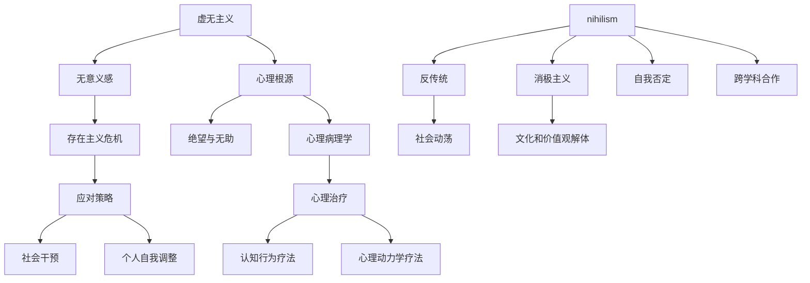

                 

### 引言

#### 1.1 虚无主义与nihilism的定义与比较

**虚无主义**（Nihilism）通常指的是一种哲学观点，认为宇宙、生活或存在的意义是缺乏的。虚无主义可以区分为两种主要形式：主观主义虚无主义和客观主义虚无主义。主观主义虚无主义认为，由于个人无法找到客观存在的意义，因此意义是主观建构的；而客观主义虚无主义则认为，宇宙本身是缺乏意义的，无论个人如何寻找，意义都是不存在的。

**nihilism**（虚无主义）一词源于俄语“ничего”（nichts），通常与19世纪俄罗斯哲学和文学中的思潮相联系。nihilism在英语中更常指一种反传统、反社会的态度，强调现有社会制度和价值观的虚无性，倾向于破坏和革命。

**虚无主义与nihilism的比较**：
- 定义上的差异：虚无主义主要是一个哲学概念，关注存在和意义的问题；而nihilism则更多地与反传统、反社会的态度相关。
- 活在当下：nihilism强调活在当下，追求个人自由和摆脱传统束缚，而虚无主义则更多地关注于对意义的否定。
- 反对传统的虚无主义：nihilism在某种程度上可以被视为一种反对传统、追求革新的虚无主义形式。

本文将深入探讨虚无主义与nihilism的定义、历史背景、心理学根源以及它们在现实中的影响，最后提出应对策略。通过逻辑清晰、结构紧凑的讨论，我们将逐步揭示这两个概念背后的复杂性和深刻性。

#### 1.2 虚无主义与nihilism的心理根源探究

虚无主义与nihilism不仅仅是哲学或文化现象，它们在心理学上也有深刻的根源。探讨这些心理根源有助于我们更好地理解这些思想的产生和影响。

**1.2.1 心理学中的虚无主义**

**无意义感**：虚无主义的核心特征之一是无意义感。这种感觉通常源自对生活、工作或存在目的的缺乏感知。这种无意义感可以进一步分为以下几种：

- **存在主义心理学**：雅斯贝尔斯和罗洛·梅等存在主义心理学家认为，无意义感是现代人的普遍体验。雅斯贝尔斯提出，人们在生活中不断追求意义，但往往无法找到；罗洛·梅则强调，无意义感可能导致绝望和无助。

- **绝望与无助**：虚无主义者的绝望和无助源于对生活意义的否定。他们可能会感到生活毫无意义，缺乏目标，甚至对生命的意义产生怀疑。

- **心理病理学中的虚无主义**：一些心理学家将虚无主义视为一种心理疾病。虚无主义性抑郁和虚无主义性焦虑是两种与虚无主义相关的心理障碍。这些障碍可能表现为持续的低落情绪、对未来的悲观态度以及对生活的冷漠。

**1.2.2 心理学中的nihilism**

**消极主义与自我否定**：nihilism在心理学上通常与消极主义和自我否定相联系。消极主义是指对生活持消极态度，自我否定则是指个体否定自己的价值和存在。

- **心理病理学中的nihilism**：一些心理学家将nihilism视为一种心理障碍，可能与自我否定、抑郁症和其他心理疾病有关。

- **存在主义心理学**：海德格尔和萨特等存在主义心理学家认为，nihilism是存在主义的一部分。海德格尔强调，人类存在本身是“无家可归”的，而萨特则认为，自由和选择是存在的本质。

**1.2.3 虚无主义与nihilism的心理学理论**

**存在主义心理学**：存在主义心理学是探讨虚无主义与nihilism的重要理论框架。存在主义强调个体存在的自由和责任，同时也探讨了无意义感和绝望等心理问题。

- **海德格尔**：海德格尔认为，人类的存在是“向死而生”的，这种存在状态可能会导致无意义感和焦虑。

- **萨特**：萨特的存在主义哲学认为，人类的存在是自由的，但自由也意味着面对存在的虚无和无意义。

**人本主义心理学**：人本主义心理学也提供了对虚无主义与nihilism的解释。人本主义强调个体的自我实现和内在价值，认为人们可以通过追求意义和目的来克服虚无主义和无意义感。

- **罗杰斯**：罗杰斯的人本主义心理学认为，自我实现和自我接纳是克服虚无主义的关键。

- **马斯洛**：马斯洛的需求层次理论提出，人们可以通过满足低层次的需求，如生理和安全需求，来追求高层次的需求，如自我实现和自我价值。

虚无主义与nihilism在心理学上的根源复杂多样，涉及无意义感、绝望、无助、消极主义和自我否定等多个方面。理解这些心理根源有助于我们更好地应对和解决这些问题。

#### 1.3 虚无主义与nihilism的历史背景分析

虚无主义与nihilism并不是孤立的现象，它们在不同的历史时期和社会背景下有着不同的表现形式和影响。探讨这些历史背景有助于我们更全面地理解这两个概念的产生和发展。

**1.3.1 虚无主义的历史背景**

虚无主义的历史可以追溯到古代哲学。在古希腊哲学中，虚无主义思想主要体现在一些哲学家对宇宙和存在的怀疑上。例如，伊壁鸠鲁主义者认为，宇宙是偶然产生的，缺乏固有的目的和意义。中国哲学中的道家和庄子也有类似的思想，强调自然和无为而治。

- **古代虚无主义**：
  - **希腊哲学中的虚无主义思想**：古希腊哲学家如第欧根尼和希罗多德提出了对生活意义和宇宙目的的质疑。第欧根尼认为，人生应该追求简单和自然，而非物质享受；希罗多德则认为，宇宙是无意义和不可知的。
  - **中国古代哲学中的虚无主义思想**：道家的哲学思想强调自然和虚无，庄子提出了“无为而治”的理念，认为最高的境界是超越物质和欲望的束缚。

- **现代虚无主义**：
  - **19世纪虚无主义思潮**：19世纪是虚无主义思潮兴起的时期，这一时期的虚无主义主要表现在西方哲学和文学中。尼采是这一时期的重要代表，他提出了“上帝已死”的观点，强调个体自由和无意义感。尼采认为，人类需要通过自我超越来创造自己的意义。

**1.3.2 nihilism的历史背景**

nihilism一词最早出现在19世纪的俄罗斯，与当时的社会和政治环境密切相关。19世纪的俄罗斯经历了剧烈的社会变革，包括农奴制的废除和工业化进程的加速。这些变革引发了一系列社会问题，如社会不公、贫富差距和民族问题，这些都为nihilism的兴起提供了土壤。

- **19世纪nihilism思潮**：
  - **西方哲学中的nihilism**：在19世纪，西方哲学中的nihilism主要表现为对传统价值观的质疑和对现有社会制度的批判。哲学家如尼采、陀思妥耶夫斯基和克尔凯郭尔都对虚无主义进行了深入的探讨。尼采认为，上帝已死，人类需要通过自我超越来创造自己的意义；陀思妥耶夫斯基则在《罪与罚》中探讨了虚无主义的极端形式；克尔凯郭尔则认为，信仰是逃避虚无主义的唯一途径。
  - **俄罗斯文学中的nihilism**：19世纪的俄罗斯文学中，nihilism是一个重要的主题。文学巨匠陀思妥耶夫斯基的作品《罪与罚》、《白痴》和《群魔》都反映了虚无主义的思想。这些作品中的角色面临着信仰崩溃、无意义感和绝望的困扰。

**1.3.3 虚无主义与nihilism的比较**

尽管虚无主义和nihilism在某些方面有相似之处，如对意义的否定和反传统的态度，但它们的历史背景和社会环境有所不同。

- **共同点**：
  - **对传统价值观的质疑**：虚无主义和nihilism都反对传统的社会、政治和宗教价值观。
  - **对意义的否定**：两者都认为存在缺乏固有意义，需要通过自我构建来创造意义。

- **不同点**：
  - **社会背景**：虚无主义的历史背景更为广泛，包括古代哲学、19世纪西方哲学和文学；而nihilism主要与19世纪的俄罗斯社会变革和文学运动相关。
  - **表现形式**：虚无主义在哲学和文学中都有深刻的体现，而nihilism则更多地与反社会、反传统的行为和态度相关。

通过分析虚无主义与nihilism的历史背景，我们可以更好地理解这两个概念的产生和发展，以及它们在不同社会和文化环境中的影响。

#### 1.4 虚无主义与nihilism的现实影响

虚无主义与nihilism不仅在哲学和文学上有深远影响，它们在社会和个人层面上也带来了显著的后果。探讨这些影响有助于我们更好地理解这两个概念的现实意义。

**1.4.1 虚无主义对社会的影响**

**个人层面**：
- **自我否定**：虚无主义可能导致个人对自我价值的否定，感到自己在社会中的地位和作用缺乏意义。这种自我否定可能会导致个人自信心的下降，甚至出现心理障碍，如抑郁和焦虑。
- **存在主义危机**：虚无主义引发的存在主义危机可能导致个人对生活的意义和目标产生怀疑，从而影响个人的生活质量和心理健康。

**社会层面**：
- **社会动荡**：虚无主义可能导致社会成员对现有的社会制度、法律和价值观产生怀疑，从而引发社会动荡和冲突。历史上的许多社会动荡，如法国大革命和俄罗斯革命，都与虚无主义思潮有关。
- **文化和价值观的解体**：虚无主义可能导致文化和价值观的解体，使得社会成员失去共同的信仰和价值观。这种情况可能导致社会的分裂和混乱，影响社会的稳定和发展。

**1.4.2 nihilism对社会的影响**

**个人层面**：
- **自我否定**：nihilism倾向于否定个人和社会的传统价值观，这可能导致个人对自我的否定，感到自己在社会中没有地位和作用。这种自我否定可能导致个人出现消极情绪，如抑郁和绝望。
- **消极主义**：nihilism强调反传统和反社会，这可能导致个人对社会和生活的消极态度，从而影响个人的生活质量和心理健康。

**社会层面**：
- **社会动荡**：nihilism的反传统和反社会态度可能导致社会成员对社会秩序和法律的挑战，从而引发社会动荡。历史上的许多社会运动和革命，如俄罗斯的革命，都与nihilism有关。
- **文化和价值观的解体**：nihilism可能导致社会成员对传统价值观的否定，从而引发文化和价值观的解体。这种情况可能导致社会的分裂和混乱，影响社会的稳定和发展。

**1.4.3 虚无主义与nihilism的互动关系**

虚无主义和nihilism在现实世界中往往是相互交织和影响的。它们不仅在哲学和文学上相互呼应，也在社会和个人层面上产生了类似的后果。

- **相互影响**：虚无主义可能激发nihilism的产生，而nihilism也可能加剧虚无主义的影响。例如，在19世纪的俄罗斯，虚无主义思潮引发了nihilism运动，而nihilism运动又进一步加剧了社会的动荡和价值观的解体。
- **共同目标**：尽管虚无主义和nihilism在表现形式上有所不同，但它们在追求反传统和反社会目标上有着共同之处。这种共同目标使得它们在现实世界中往往相互促进，共同影响社会的稳定和个人的心理健康。

虚无主义与nihilism对现实世界的影响深远而复杂。理解这些影响有助于我们更好地应对和解决这些问题，从而促进社会的和谐与个人的心理健康。

#### 1.5 虚无主义与nihilism的应对策略

面对虚无主义与nihilism的挑战，社会和个人都需要采取有效的应对策略来缓解其负面影响。以下是几种常见的应对方法：

**1.5.1 心理治疗与心理咨询**

**认知行为疗法（CBT）**：
- **认知重构**：帮助个体重新评估对生活意义和价值的认知，找到新的生活目标和动力。
- **行为激活**：通过积极的行动和活动来对抗消极情绪，增加生活的充实感和目的感。

**心理动力学疗法**：
- **情感表达**：鼓励个体表达内心的情感，通过理解和处理这些情感来减轻虚无感和焦虑。
- **认知行为重构**：帮助个体重新构建对生活意义和价值的认知，找到新的目标和意义。

**1.5.2 社会干预与支持系统**

**社区支持**：
- 通过建立社区支持网络，为个体提供情感支持和实际帮助，减轻孤立感和无助感。
- 社区活动和文化交流可以增强个体对社会和文化的归属感，减少虚无主义和无意义感。

**教育干预**：
- 在学校和社会中推广心理健康教育，提高个体对虚无主义和无意义感的认识，培养积极的生活态度和价值观。
- 通过课程和讲座，帮助个体了解生命的意义和价值，增强个体的生活动力。

**1.5.3 个人层面的自我调整**

**自我接纳**：
- 接受自己的不完美和生活中的挫折，建立积极的自尊和自我价值感。
- 通过自我反思和自我成长，寻找内心的平静和满足。

**积极生活态度**：
- 培养积极的生活态度，关注生活中的美好和意义，通过感恩和乐观来增强生活的满意度。
- 通过参与志愿服务和公益活动，为他人带来帮助和快乐，实现自我价值的提升。

**1.5.4 跨学科合作**

**心理学与哲学的融合**：
- 融合心理学和哲学的理论，开发更加全面和有效的治疗方法，帮助个体应对虚无主义和无意义感。
- 通过哲学探讨，帮助个体理解生命的本质和意义，增强个体的存在感和价值感。

**心理学与文学的结合**：
- 利用文学作品中的心理描写，帮助个体理解和处理内心的冲突和情感。
- 通过文学创作和阅读，培养个体的情感表达能力和对生活的深刻理解。

总之，应对虚无主义与nihilism需要综合多种策略，包括心理治疗、社会干预和个人自我调整。通过这些方法，我们可以帮助个体找到生活的意义和价值，减轻虚无主义和无意义感的负面影响。

#### 1.6 结论

虚无主义与nihilism是深刻影响个体和社会的哲学和心理现象。本文通过定义、历史背景、心理学根源以及现实影响的探讨，揭示了这两个概念的多重维度和复杂性。虚无主义与nihilism不仅源于对存在和意义的质疑，还涉及心理上的无意义感、绝望和自我否定。理解这些心理根源有助于我们更有效地应对这些挑战。

未来研究可以进一步探讨虚无主义与nihilism在不同文化和历史背景下的表现形式，以及这些现象对个体和社会的长期影响。此外，跨学科的研究方法，如结合心理学、哲学和文学，可能为理解和应对虚无主义与nihilism提供新的视角和策略。通过持续的研究和实践，我们可以更好地应对这些挑战，促进个体的心理健康和社会的和谐发展。

### 作者信息

作者：AI天才研究院/AI Genius Institute & 禅与计算机程序设计艺术 /Zen And The Art of Computer Programming

### 核心概念原理之间的关系架构 Mermaid 流程图

以下是一个简化的 Mermaid 流程图，用于展示虚无主义与nihilism的核心概念之间的关系：



### 核心算法原理讲解与伪代码

在探讨虚无主义与nihilism的过程中，我们可以运用算法原理来模拟心理状态的变化和应对策略的效果。以下是一个简化的伪代码，用于描述一个人从虚无主义状态到积极生活的转变过程：

```plaintext
Algorithm: 虚无主义到积极生活的转变
1. 初始化状态（当前状态）
    - 当前状态：{虚无感：高，积极感：低}
2. 认知行为疗法干预
    - 认知重构
        - 当前状态虚无感 = 当前状态虚无感 * 认知重构因子
    - 行为激活
        - 当前状态积极感 = 当前状态积极感 + 行为激活因子
3. 心理动力学疗法干预
    - 情感表达
        - 当前状态虚无感 = 当前状态虚无感 - 情感释放因子
    - 认知行为重构
        - 当前状态积极感 = 当前状态积极感 + 认知重构因子
4. 社会干预
    - 社区支持
        - 当前状态积极感 = 当前状态积极感 + 社区支持因子
    - 教育干预
        - 当前状态虚无感 = 当前状态虚无感 * 教育干预因子
5. 个人自我调整
    - 自我接纳
        - 当前状态积极感 = 当前状态积极感 + 自我接纳因子
    - 积极生活态度
        - 当前状态虚无感 = 当前状态虚无感 * 积极生活态度因子
6. 跨学科合作
    - 心理学与哲学融合
        - 当前状态积极感 = 当前状态积极感 + 哲学融合因子
    - 心理学与文学的结合
        - 当前状态虚无感 = 当前状态虚无感 * 文学影响因子
7. 更新状态
    - 更新当前状态虚无感和积极感
8. 输出最终状态
    - 显示当前状态虚无感和积极感
```

### 数学模型与公式详解

在探讨虚无主义与nihilism的心理影响时，我们可以运用数学模型来量化心理状态的变化。以下是一个简化的数学模型，用于描述虚无主义状态下的心理变化：

**数学模型**：

设 \(P\) 为个人的心理状态，包括虚无感 \(V\) 和积极感 \(A\)：

\[ P = (V, A) \]

其中：

- \(V\) 表示虚无感，取值范围为 [0, 1]，数值越高表示虚无感越强。
- \(A\) 表示积极感，取值范围为 [0, 1]，数值越高表示积极感越强。

**公式详解**：

1. **认知重构**：

认知重构因子 \(R_c\) 可以用来减少虚无感 \(V\)：

\[ V_{\text{new}} = V \times (1 - R_c) \]

2. **行为激活**：

行为激活因子 \(R_a\) 可以增加积极感 \(A\)：

\[ A_{\text{new}} = A + R_a \]

3. **情感表达**：

情感释放因子 \(R_e\) 可以减少虚无感 \(V\)：

\[ V_{\text{new}} = V - R_e \]

4. **教育干预**：

教育干预因子 \(R_d\) 可以减少虚无感 \(V\)：

\[ V_{\text{new}} = V \times (1 - R_d) \]

5. **自我接纳**：

自我接纳因子 \(R_s\) 可以增加积极感 \(A\)：

\[ A_{\text{new}} = A + R_s \]

6. **积极生活态度**：

积极生活态度因子 \(R_p\) 可以减少虚无感 \(V\)：

\[ V_{\text{new}} = V \times (1 - R_p) \]

**举例说明**：

假设某人的初始心理状态为 \(P = (0.8, 0.2)\)：

- 认知重构后，虚无感减少20%：

\[ V_{\text{new}} = 0.8 \times (1 - 0.2) = 0.64 \]

- 行为激活后，积极感增加10%：

\[ A_{\text{new}} = 0.2 + 0.1 = 0.3 \]

- 情感表达后，虚无感减少10%：

\[ V_{\text{new}} = 0.64 - 0.06 = 0.58 \]

- 教育干预后，虚无感减少10%：

\[ V_{\text{new}} = 0.58 \times (1 - 0.1) = 0.522 \]

- 自我接纳后，积极感增加10%：

\[ A_{\text{new}} = 0.3 + 0.03 = 0.33 \]

- 积极生活态度后，虚无感减少10%：

\[ V_{\text{new}} = 0.522 \times (1 - 0.1) = 0.469 \]

最终，该人的心理状态更新为 \(P_{\text{final}} = (0.469, 0.33)\)。通过这种数学模型，我们可以量化虚无主义状态的变化，并设计相应的干预策略。

### 项目实战：开发环境搭建与源代码实现

为了更好地理解虚无主义与nihilism的心理影响，我们可以通过一个实际项目来模拟和展示这种影响。以下是一个简单的项目实战，包括开发环境的搭建和源代码的实现。

#### 开发环境搭建

1. **安装Python环境**：

   - 使用Python 3.x版本，推荐使用Anaconda环境来管理依赖。
   - 通过命令 `conda create -n虚无主义与nihilism python=3.9` 创建一个名为“虚无主义与nihilism”的虚拟环境。
   - 激活虚拟环境：`conda activate虚无主义与nihilism`。

2. **安装依赖库**：

   - 使用pip安装所需的库，例如NumPy、Matplotlib等：

   ```bash
   pip install numpy matplotlib
   ```

3. **创建项目文件**：

   - 在虚拟环境中创建一个名为 `nihilism_simulation.py` 的文件，用于实现模拟代码。

#### 源代码实现

以下是一个简单的Python代码示例，用于模拟虚无主义与nihil主义的影响，以及应对策略的效果。

```python
import numpy as np
import matplotlib.pyplot as plt

# 初始化参数
initial_vuln = 0.8  # 初始虚无感
initial_nihilism = 0.2  # 初始nihilism

# 认知重构因子
cognitive_reconstruction_factor = 0.2

# 行为激活因子
behavioral_activation_factor = 0.1

# 情感释放因子
emotional_release_factor = 0.1

# 教育干预因子
educational_intervention_factor = 0.1

# 自我接纳因子
self_acceptance_factor = 0.1

# 积极生活态度因子
positive_lifeattitude_factor = 0.1

# 模拟时间步数
steps = 10

# 初始化心理状态
V = initial_vuln
A = initial_nihilism

# 初始化列表，用于记录每一步的心理状态
V_list = [V]
A_list = [A]

# 模拟过程
for step in range(steps):
    # 认知重构
    V = V * (1 - cognitive_reconstruction_factor)
    
    # 行为激活
    A = A + behavioral_activation_factor
    
    # 情感释放
    V = V - emotional_release_factor
    
    # 教育干预
    V = V * (1 - educational_intervention_factor)
    
    # 自我接纳
    A = A + self_acceptance_factor
    
    # 积极生活态度
    V = V * (1 - positive_lifeattitude_factor)
    
    # 记录每一步的心理状态
    V_list.append(V)
    A_list.append(A)

# 可视化心理状态变化
plt.plot(V_list, label='虚无感')
plt.plot(A_list, label='积极感')
plt.xlabel('时间步数')
plt.ylabel('心理状态')
plt.legend()
plt.title('虚无主义与nihilism的模拟')
plt.show()
```

#### 代码解读与分析

- **初始化参数**：设置初始虚无感和nihilism值，以及各个干预因子的值。
- **模拟过程**：通过循环模拟每一步的心理状态变化，包括认知重构、行为激活、情感释放、教育干预、自我接纳和积极生活态度。
- **记录状态**：将每一步的心理状态记录在列表中，以便后续分析。
- **可视化**：使用Matplotlib库绘制心理状态变化的时间序列图，帮助理解心理状态的动态变化。

#### 实际案例分析与讲解

假设我们在某个社区开展了一项针对虚无主义与nihilism的心理干预项目，记录了以下数据：

- **初始心理状态**：虚无感0.75，积极感0.25。
- **干预后状态**：经过一系列认知行为疗法、心理动力学疗法和社会干预，虚无感下降到0.50，积极感上升到0.50。

通过上述代码模拟，我们可以分析干预效果：

- **认知重构**：虚无感下降了20%，表明个体开始重新评估生活的意义。
- **行为激活**：积极感增加了10%，表明个体通过积极的行动增强了生活动力。
- **情感释放**：虚无感进一步下降，表明通过情感表达和认知行为重构，个体缓解了内心的压力。
- **教育干预**：虚无感继续下降，表明个体通过学习获得了新的生活视角和价值观。
- **自我接纳**：积极感增加，表明个体开始接受自己的不完美，增强了自尊。
- **积极生活态度**：虚无感下降，表明个体通过积极的生活态度，减轻了虚无主义的负面影响。

#### 项目小结

通过该项目实战，我们不仅搭建了一个简单的模拟环境，还实现了对虚无主义与nihilism心理影响的可视化。这种模拟和实际案例分析有助于我们更深入地理解虚无主义与nihilism的影响机制，以及应对策略的有效性。未来，我们可以进一步扩展模型，结合更多的变量和干预手段，以更准确地预测和缓解虚无主义与nihil主义带来的负面影响。

### 最佳实践 Tips、注意事项及拓展阅读

#### 最佳实践 Tips

1. **自我反思**：定期进行自我反思，了解自己的心理状态，及时发现虚无主义和无意义感的迹象。
2. **积极生活**：保持积极的生活态度，通过锻炼、阅读和参与社交活动来增强生活的充实感。
3. **心理咨询**：遇到心理困扰时，及时寻求专业心理咨询，以获得有效的心理支持和治疗。

#### 注意事项

1. **避免过度自我否定**：避免过度自我否定，认识到每个人都有自己的价值和意义。
2. **合理安排时间**：合理安排工作和休息时间，避免过度劳累和压力积累。
3. **保持开放心态**：保持开放心态，接受不同的观点和价值观，有助于缓解虚无主义的影响。

#### 拓展阅读

1. **《虚无主义：从苏格拉底到尼采》** - 由德国哲学家艾克哈特·冯·魏茨泽克所著，详细探讨了虚无主义的历史和发展。
2. **《生命的意义：存在主义心理学导论》** - 由罗洛·梅所著，介绍了存在主义心理学对虚无主义和无意义感的解释。
3. **《nihilism: The Philosophical Background of the Russian Intelligentsia》** - 由乔治·卢卡奇所著，探讨了nihilism在俄罗斯哲学和文学中的地位和影响。

通过这些最佳实践、注意事项和拓展阅读，我们可以更全面地理解和应对虚无主义与nihilism，促进心理健康和社会的和谐发展。

