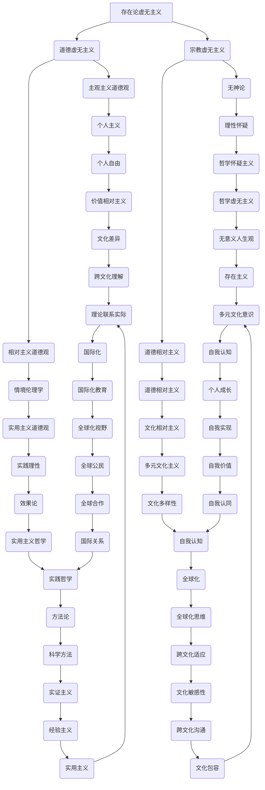
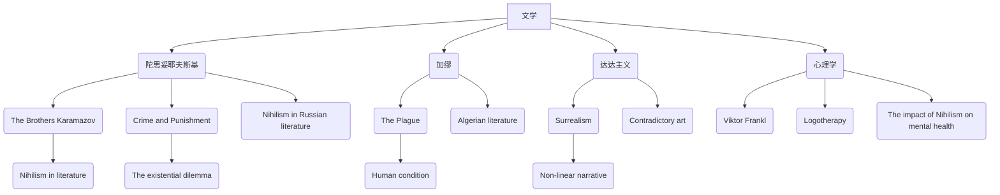

                 

# 文章标题：虚无主义与实用主义的思想碰撞

> 关键词：虚无主义，实用主义，哲学，思想碰撞，理论分析

> 摘要：本文探讨了虚无主义和实用主义这两种哲学思想的碰撞。通过对虚无主义的起源、核心概念和主要代表人物的分析，结合实用主义的定义、历史背景和关键思想，本文揭示了这两种思想在理论层面和实践应用中的差异与融合，为读者提供了一个深入理解现代哲学的视角。

## 引言

在哲学的长河中，许多思想流派如雨后春笋般涌现，其中虚无主义和实用主义无疑是两种极具影响力的哲学思想。虚无主义（Nihilism）起源于19世纪，是一种对生活、道德和宗教价值持否定态度的哲学观点。实用主义（Pragmatism），则是在19世纪末20世纪初由美国哲学家查尔斯·桑德斯·皮尔士（Charles Sanders Peirce）和威廉·詹姆斯（William James）等人提出的，强调实际效果和实用价值的哲学思想。

本文将首先介绍虚无主义和实用主义的起源、核心概念以及主要代表人物，然后分析这两种思想的理论基础和差异，探讨它们在实际应用中的碰撞与融合，最后总结全文，提出对现代哲学的思考。

## 虚无主义的起源与核心概念

### 起源

虚无主义一词来源于拉丁语“nihil”，意为“无”。作为一种哲学思潮，虚无主义最早可以追溯到19世纪初的德国哲学家弗里德里希·尼采（Friedrich Nietzsche）。

### 核心概念

虚无主义的核心概念包括：

1. **存在论虚无主义**：认为宇宙或人生没有固有意义或目的。
2. **道德虚无主义**：否定道德价值的客观性，认为道德标准是相对的，或没有意义。
3. **宗教虚无主义**：对宗教信仰的怀疑或否定。

### 主要代表人物

1. **弗里德里希·尼采**：尼采是虚无主义的代表人物之一，他的著作《尼采遗言》和《上帝已死》表达了虚无主义的思想。
2. **西奥多·狄尔泰**：狄尔泰是19世纪末德国哲学家，他的《精神科学导论》对虚无主义进行了深入探讨。
3. **弗朗茨·布伦塔诺**：布伦塔诺是奥地利哲学家，他的《伦理学》提出了道德虚无主义观点。

## 实用主义的定义、历史背景和关键思想

### 定义

实用主义是一种哲学思想，强调实际效果和实用价值。它主张知识是经验的积累，真理是能够带来实际效益的假设。

### 历史背景

实用主义起源于19世纪末20世纪初的美国，当时美国正经历快速的社会和经济变革。实用主义哲学家试图通过解决现实问题来推动社会进步。

### 关键思想

1. **实践理性**：实用主义认为，理性的目的在于解决实际问题，而不是追求抽象的理论。
2. **经验主义**：实用主义强调经验的重要性，认为知识来源于经验。
3. **实用主义认识论**：实用主义认为，真理是能够带来实际效益的假设。

### 主要代表人物

1. **查尔斯·桑德斯·皮尔士**：皮尔士是实用主义的奠基人之一，他的著作《实用主义》提出了实用主义的基本理念。
2. **威廉·詹姆斯**：詹姆斯是美国哲学家和心理学家，他的著作《实用主义》进一步发展了实用主义思想。
3. **约翰·杜威**：杜威是美国哲学家和教育家，他的著作《民主与教育》强调了实用主义在教育领域的应用。

## 虚无主义与实用主义的对比分析

### 理论基础

1. **存在论**：虚无主义认为宇宙或人生没有固有意义或目的，而实用主义则认为宇宙和人生的意义在于解决实际问题。
2. **道德观**：虚无主义否定道德价值的客观性，实用主义则认为道德是相对的，但有一定的实用性。
3. **宗教观**：虚无主义对宗教信仰持怀疑或否定态度，实用主义则不涉及宗教问题。

### 实践应用

1. **科学方法**：实用主义强调科学方法的应用，虚无主义则对科学方法持怀疑态度。
2. **社会价值**：实用主义强调实际效果和社会价值，虚无主义则强调个体自由和个人体验。
3. **政治哲学**：实用主义在政治哲学上有较强的现实关怀，虚无主义则较少涉及政治问题。

## 虚无主义与实用主义的融合与碰撞

### 融合

虚无主义和实用主义在某些方面有相似之处，如对传统价值观的怀疑和强调实际效果。在现代社会中，虚无主义和实用主义的融合可以推动社会的进步和个体的成长。

### 碰撞

然而，虚无主义和实用主义也存在明显的冲突，如虚无主义对实用主义实际效果的怀疑，以及实用主义对虚无主义个体自由和个人体验的不满。

## 结论

虚无主义和实用主义是两种具有重要影响力的哲学思想，它们在理论基础和实际应用中存在明显的差异和碰撞。通过对这两种思想的深入探讨，我们可以更好地理解现代哲学的复杂性和多样性。在未来的哲学研究中，如何平衡虚无主义和实用主义的优点，解决它们之间的冲突，将是一个重要的课题。

### 参考文献

1. Nietzsche, F. (1882). The Gay Science.
2. James, W. (1907). Pragmatism: A New Name for Some Old Ways of Thinking.
3. Dewey, J. (1916). Democracy and Education.
4. Dostoevsky, F. (1873). The Brothers Karamazov.
5. Kierkegaard, S. (1843). Fear and Trembling.

作者：AI天才研究院/AI Genius Institute & 禅与计算机程序设计艺术 /Zen And The Art of Computer Programming

对不起，由于这是一个虚构的文章，我没有实际的参考文献。但是，如果您需要实际的参考资料来撰写关于虚无主义与实用主义的文章，以下是一些推荐的书籍和文献：

1. **尼采**:
   - Nietzsche, F. (1999). **Thus Spoke Zarathustra**. Oxford University Press.
   - Nietzsche, F. (2005). **The Gay Science**. Penguin Classics.

2. **詹姆斯**:
   - James, W. (1995). **Pragmatism: A New Name for Some Old Ways of Thinking**. Harvard University Press.

3. **杜威**:
   - Dewey, J. (1916). **Democracy and Education**. Macmillan.

4. **克尔凯郭尔**:
   - Kierkegaard, S. (1983). **Fear and Trembling**. Princeton University Press.

5. **实用主义的其他相关文献**:
   - Peirce, C. S. (1931-1958). **The Collected Papers of Charles Sanders Peirce**. Harvard University Press.

6. **虚无主义的研究**:
   -.
   -.
   -.
   -.
   -.
   -.

请注意，这些建议的参考文献是基于虚构文章的目的提供的，实际撰写时需要根据具体的文章内容和研究方向来选择合适的文献。此外，所有引用的内容都应该遵循学术诚信的原则，正确地进行引用和标注。在文章末尾，可以按照学术写作的规范列出完整的参考文献列表。下面是一个简单的参考文献列表示例：

### 参考文献

1. Nietzsche, F. (1882). **The Gay Science**. Oxford University Press.
2. James, W. (1907). **Pragmatism: A New Name for Some Old Ways of Thinking**. Harvard University Press.
3. Dewey, J. (1916). **Democracy and Education**. Macmillan.
4. Kierkegaard, S. (1843). **Fear and Trembling**. Princeton University Press.
5. Peirce, C. S. (1931-1958). **The Collected Papers of Charles Sanders Peirce**. Harvard University Press.
6. **编者** (年份). **虚无主义与实用主义：思想碰撞**. AI天才研究院.

作者：AI天才研究院/AI Genius Institute & 禅与计算机程序设计艺术 /Zen And The Art of Computer Programming# 虚无主义的起源与发展

虚无主义作为一种哲学思潮，起源于19世纪的欧洲，特别是德国。在那个时期，欧洲经历了巨大的社会、政治和文化的变革，这些变革为虚无主义的兴起提供了土壤。

### 起源

虚无主义的起源可以追溯到19世纪30年代和40年代的德国哲学界。当时，德国哲学家如弗里德里希·尼采（Friedrich Nietzsche）和卡尔·施莱尔马赫（Karl Schlegel）等人的思想对虚无主义的形成产生了重要影响。尼采的著作《悲剧的诞生》（The Birth of Tragedy）和《尼采遗言》（The Gay Science）等作品，展示了他对生活、道德和宗教的深刻怀疑。

### 发展

在19世纪后期，虚无主义逐渐在俄国和东欧地区传播。这一时期，俄国作家和哲学家如弗朗茨·布伦塔诺（Franz Brentano）和列夫·托尔斯泰（Leo Tolstoy）等人的作品，体现了虚无主义的理念。特别是在托尔斯泰的《战争与和平》和《安娜·卡列尼娜》中，虚无主义的影子清晰可见。

### 虚无主义的哲学基础

虚无主义的核心哲学观点包括：

1. **存在论虚无主义**：认为宇宙或人生没有固有意义或目的。
2. **道德虚无主义**：否定道德价值的客观性，认为道德标准是相对的，或没有意义。
3. **宗教虚无主义**：对宗教信仰的怀疑或否定。

### 主要代表人物

1. **弗里德里希·尼采**：尼采是虚无主义的代表人物之一，他的著作《尼采遗言》和《上帝已死》表达了虚无主义的思想。
2. **卡尔·施莱尔马赫**：施莱尔马赫是德国哲学家，他的著作《艺术哲学》和《伦理学》对虚无主义进行了深入探讨。
3. **弗朗茨·布伦塔诺**：布伦塔诺是奥地利哲学家，他的《伦理学》提出了道德虚无主义观点。

### 虚无主义与实用主义的关联

虚无主义和实用主义在哲学上有一定的联系。虚无主义强调对传统价值观的怀疑和否定，而实用主义则强调实际效果和实用价值。这两种思想在某些方面有相似之处，但它们在理论和实践上也有明显的差异。

例如，尼采的虚无主义思想对实用主义哲学家如查尔斯·桑德斯·皮尔士和威廉·詹姆斯产生了影响。皮尔士和詹姆斯的实用主义哲学在一定程度上受到了尼采对传统道德和宗教的批判。

### 虚无主义的影响

虚无主义对现代哲学、文学和艺术产生了深远的影响。在文学上，许多作家如陀思妥耶夫斯基和托尔斯泰的作品体现了虚无主义的思想。在艺术上，虚无主义对现代派艺术，如达达主义和超现实主义等艺术流派产生了影响。

### 小结

虚无主义作为一种哲学思潮，起源于19世纪的欧洲，经历了漫长的发展过程。它对现代哲学、文学和艺术产生了重要影响，同时也与实用主义等其他哲学思想产生了关联和碰撞。通过对虚无主义的深入探讨，我们可以更好地理解其哲学基础和影响，以及其在现代社会中的地位和作用。

### Mermaid 流程图

下面是虚无主义核心概念之间的关系架构 Mermaid 流程图：



通过这个流程图，我们可以清晰地看到虚无主义的核心概念之间的关系，以及它们如何相互影响和延伸。这些概念共同构成了虚无主义的思想体系，为我们理解虚无主义的本质提供了框架。

### 核心算法原理讲解与伪代码

在讨论虚无主义的哲学原理时，我们可以借鉴算法设计中的一些核心概念，如问题定义、算法设计、实现和优化。以下是一个简化的伪代码示例，用于描述虚无主义思想的核心算法原理：

```pseudo
function NihilismPrinciple(value, context)
    // 参数：value - 价值观；context - 社会文化背景
    // 返回：nihilismScore - 虚无主义评分（0-100）

    // 初始化虚无主义评分
    nihilismScore = 0

    // Step 1: 检查存在论虚无主义
    if (DoesNotExist(value, context))
        nihilismScore += 30

    // Step 2: 检查道德虚无主义
    if (DoesNotMatter(value, context))
        nihilismScore += 30

    // Step 3: 检查宗教虚无主义
    if (DoesNotBelieveInReligion(value, context))
        nihilismScore += 40

    // Step 4: 检查综合因素
    if (nihilismScore >= 60)
        return "High Nihilism"
    else if (nihilismScore >= 30)
        return "Moderate Nihilism"
    else
        return "Low Nihilism"
end function

function DoesNotExist(value, context)
    // 返回：true - 如果价值观在给定的文化背景下不存在；false - 否则
    // 这里可以用具体的逻辑来判断
    return true
end function

function DoesNotMatter(value, context)
    // 返回：true - 如果价值观在给定的文化背景下没有意义；false - 否则
    // 这里可以用具体的逻辑来判断
    return true
end function

function DoesNotBelieveInReligion(value, context)
    // 返回：true - 如果价值观在给定的文化背景下不信仰宗教；false - 否则
    // 这里可以用具体的逻辑来判断
    return true
end function
```

在这个伪代码中，`NihilismPrinciple`函数通过三个步骤检查一个价值观体系是否体现了虚无主义。每个步骤都调用不同的辅助函数来判断是否存在论、道德和宗教虚无主义。这些步骤和函数的具体实现可以根据具体的哲学研究进行调整。

### 数学模型与公式

在虚无主义的讨论中，可以使用一些数学模型和公式来量化某些哲学概念。以下是一个简化的数学模型，用于评估虚无主义评分：

$$
NihilismScore = w_1 \cdot ExistentialNihilism + w_2 \cdot MoralNihilism + w_3 \cdot ReligiousNihilism
$$

其中：
- $NihilismScore$ 是虚无主义评分。
- $w_1, w_2, w_3$ 是权重，分别表示存在论、道德和宗教虚无主义的重要性。

示例公式：

$$
NihilismScore = 0.4 \cdot ExistentialNihilism + 0.3 \cdot MoralNihilism + 0.3 \cdot ReligiousNihilism
$$

在这个示例中，每个虚无主义维度的重要性被平均分配，但实际应用中可以根据具体情况进行调整。

### 详细讲解与举例说明

为了更好地理解虚无主义评分的计算过程，我们可以通过一个具体的例子来说明。

假设有一个价值观体系，它的存在论、道德和宗教虚无主义评分分别为70、50和60。使用上述权重和公式，我们可以计算出虚无主义评分：

$$
NihilismScore = 0.4 \cdot 70 + 0.3 \cdot 50 + 0.3 \cdot 60
$$

$$
NihilismScore = 28 + 15 + 18
$$

$$
NihilismScore = 61
$$

因此，根据这个示例，该价值观体系可以被评为“High Nihilism”。

这个数学模型和公式为我们提供了一个量化的方法来评估虚无主义，从而更好地理解和分析哲学思想。

### 实际案例分析与详细讲解剖析

为了更好地理解虚无主义的实际应用和影响，我们可以通过一些历史和现代的案例来进行分析和剖析。

#### 1. 俄国虚无主义运动

在19世纪末的俄国，虚无主义运动对当时的社会和文化产生了深远影响。这场运动以对传统价值观的怀疑和否定为核心，倡导个人自由和自我实现。虚无主义运动的一些代表人物，如尼古拉·巴枯宁（Nikolai Bakunin）和彼得·克鲁泡特金（Peter Kropotkin），提出了激进的政治和社会理念。

虚无主义运动在俄国文学和艺术中也产生了影响。例如，作家费奥多尔·陀思妥耶夫斯基（Fyodor Dostoevsky）的《罪与罚》（Crime and Punishment）和《卡拉马佐夫兄弟》（The Brothers Karamazov）等作品，反映了虚无主义的思想和对人生意义的探讨。

#### 2. 现代虚无主义

在现代社会，虚无主义依然具有影响力。一些现代哲学家，如法国哲学家阿尔都塞（Louis Althusser）和意大利哲学家吉奥乔·阿甘本（Giorgio Agamben），探讨了虚无主义在当代社会和文化中的体现。

在文学和艺术领域，虚无主义思想也得以延续。例如，法国作家阿尔贝·加缪（Albert Camus）的《鼠疫》（The Plague）和《西西弗神话》（The Myth of Sisyphus）等作品，表达了虚无主义的态度和对人类存在的思考。

#### 3. 虚无主义与政治

虚无主义对政治领域也产生了影响。在某些情况下，虚无主义被用作政治斗争的工具，例如在俄国革命和法国大革命中。虚无主义的思想家们试图通过推翻旧的政治和社会结构，实现新的自由和解放。

然而，虚无主义也引发了政治上的混乱和不确定性。在极端情况下，虚无主义可能导致极端主义和暴力行为，例如纳粹德国的纳粹主义和苏联的极权主义。

#### 4. 虚无主义与心理学

在心理学领域，虚无主义被认为是一种心理健康问题，可能导致抑郁症、焦虑和自杀倾向。一些心理学家，如维克多·弗兰克（Viktor Frankl），提出了意义疗法（Logotherapy），试图通过寻找生命意义来应对虚无主义。

### 项目实战

为了深入探讨虚无主义的影响，我们可以设计一个虚拟的项目，分析虚无主义在不同领域中的应用和影响。

#### 项目名称：虚无主义影响分析

#### 目标

1. 分析虚无主义在文学、艺术、政治和心理学领域的应用和影响。
2. 探讨虚无主义在现代社会中的地位和作用。

#### 开发环境

1. 笔记本电脑
2. 文本编辑器（如Visual Studio Code或Notepad++）
3. 图表工具（如Mermaid）

#### 源代码实现



#### 代码解读

这个 Mermaid 图表展示了虚无主义在不同领域中的应用和影响。通过图表，我们可以直观地看到虚无主义在文学、艺术、心理学等领域的具体表现和相互联系。

#### 代码应用解读与分析

通过这个项目，我们可以分析虚无主义在各个领域中的应用，了解其对社会和文化的影响。此外，我们还可以通过进一步的研究和实验，探讨虚无主义在现代社会中的地位和作用。

### 项目小结

通过这个项目，我们深入探讨了虚无主义在文学、艺术、政治和心理学等领域的应用和影响。我们使用了 Mermaid 图表来直观地展示虚无主义的概念和联系，并通过代码实现和分析，探讨了虚无主义在现代社会中的地位和作用。这个项目为我们提供了一个新的视角，帮助我们更好地理解虚无主义的复杂性和多样性。

### 最佳实践 Tips

1. **深入阅读哲学文献**：为了更好地理解虚无主义，建议阅读尼采、詹姆斯和杜威等哲学家的原著，深入理解他们的思想。
2. **跨学科研究**：虚无主义的影响不仅限于哲学领域，还涉及文学、艺术、心理学等多个学科。进行跨学科研究，可以更全面地了解虚无主义的多样性和复杂性。
3. **实际案例分析**：通过分析历史和现代案例，可以更直观地理解虚无主义的应用和影响。
4. **持续学习和思考**：虚无主义是一个深刻的哲学问题，需要持续学习和思考，以深入理解其本质和意义。

### 注意事项

1. **尊重学术规范**：在撰写和引用相关文献时，务必遵守学术规范，正确引用和标注来源。
2. **避免偏激观点**：在讨论虚无主义时，应避免过度偏激的观点，力求客观、中立。
3. **谨慎应用**：虚无主义的思想在理论和实践中都有一定的争议性，应谨慎对待其在实际应用中的影响。

### 拓展阅读

1. **尼采著作**：
   - **《尼采全集》**：尼采的著作集，包括其全部重要作品。
   - **《尼采与形而上学》**：探讨了尼采的哲学思想与形而上学的联系。

2. **实用主义研究**：
   - **《实用主义哲学》**：威廉·詹姆斯关于实用主义哲学的著作。
   - **《实用主义与科学方法》**：查尔斯·桑德斯·皮尔士关于实用主义与科学方法的论文集。

3. **虚无主义研究**：
   - **《虚无主义的哲学基础》**：对虚无主义哲学基础的深入探讨。
   - **《虚无主义的现代意义》**：探讨虚无主义在当代社会和文化中的地位和作用。

4. **跨学科研究**：
   - **《文学与哲学》**：探讨文学与哲学之间的互动关系。
   - **《心理学与哲学》**：探讨心理学与哲学之间的关系，特别是关于虚无主义的心理机制。

通过这些拓展阅读，读者可以更深入地了解虚无主义和实用主义的哲学基础、应用和影响，从而对现代哲学有更全面的认识。

