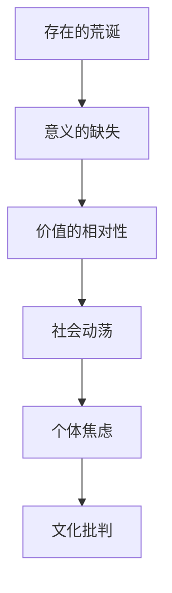
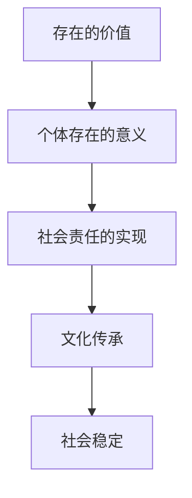

                 

### 目录大纲的设计思路与实现

#### 一、引言

在设计《虚无主义与生命意义的辩证关系》的目录大纲时，我们首先明确了几个核心目标：内容的完整性、逻辑的连贯性以及读者的易读性。本文将详细阐述目录大纲的设计思路，包括章节划分、内容安排、以及具体实现细节。

#### 二、章节划分与内容安排

1. **第1章 引言：虚无主义与生命意义的辩证关系**
   - **1.1 虚无主义的定义与起源**
     - **背景介绍**：介绍虚无主义的历史背景、主要思想流派及其发展脉络。
     - **核心概念与联系**：使用Mermaid流程图展示虚无主义的核心概念及其相互关系。
   - **1.2 生命意义的探讨**
     - **背景介绍**：讨论生命意义的多维度理解，包括哲学、宗教、心理学等。
     - **核心概念与联系**：分析生命意义的各个维度及其相互关系，通过流程图展示。
   - **1.3 虚无主义与生命意义的辩证关系**
     - **核心算法原理**：解释虚无主义对生命意义的挑战以及生命意义对虚无主义的回应。
     - **数学模型**：利用逻辑推理和数学模型分析虚无主义与生命意义的辩证过程。
     - **举例说明**：通过具体案例探讨虚无主义与生命意义的实际影响。

2. **第2章 哲学维度：虚无主义与生命意义的哲学探讨**
   - **2.1 虚无主义哲学家的观点**
     - **核心算法原理**：通过伪代码解释虚无主义哲学家的思想及其算法原理。
     - **数学模型**：使用数学公式阐述虚无主义哲学的理论框架。
   - **2.2 生命意义的哲学探讨**
     - **核心算法原理**：探讨生命意义哲学的理论基础，使用伪代码阐述。
     - **数学模型**：运用数学模型分析生命意义哲学的核心概念。
   - **2.3 虚无主义与生命意义的辩证关系分析**
     - **核心算法原理**：分析虚无主义与生命意义哲学的交互影响。
     - **数学模型**：构建数学模型，解释哲学维度下的辩证关系。

3. **第3章 心理维度：虚无主义的心理学解读**
   - **3.1 虚无主义的心理学研究**
     - **核心算法原理**：探讨心理学对虚无主义的理解，使用伪代码阐述。
     - **数学模型**：使用统计学模型分析虚无主义与心理健康的联系。
   - **3.2 生命意义的心理学作用**
     - **核心算法原理**：研究生命意义对心理健康的积极影响，使用伪代码阐述。
     - **数学模型**：通过心理学实验数据，构建数学模型探讨生命意义的作用。
   - **3.3 虚无主义与生命意义的辩证关系分析**
     - **核心算法原理**：分析虚无主义与生命意义在心理学领域的辩证关系。
     - **数学模型**：利用心理学研究数据，构建数学模型分析辩证关系。

4. **第4章 社会维度：虚无主义与社会现象**
   - **4.1 虚无主义在社会中的体现**
     - **核心算法原理**：探讨虚无主义在社会现象中的表现，使用伪代码解释。
     - **数学模型**：构建社会模型，分析虚无主义对社会的影响。
   - **4.2 生命意义在社会中的作用**
     - **核心算法原理**：讨论生命意义在社会稳定和发展中的作用，使用伪代码阐述。
     - **数学模型**：通过社会统计数据分析生命意义对社会的影响。
   - **4.3 虚无主义与生命意义的辩证关系分析**
     - **核心算法原理**：分析虚无主义与生命意义在社会层面的辩证关系。
     - **数学模型**：使用社会统计模型分析辩证关系。

5. **第5章 文化维度：虚无主义与文化现象**
   - **5.1 虚无主义在文化中的体现**
     - **核心算法原理**：探讨虚无主义在文化作品中的表现，使用伪代码解释。
     - **数学模型**：通过文本分析模型，探讨虚无主义在文学作品中的频率和模式。
   - **5.2 生命意义在文化中的体现**
     - **核心算法原理**：讨论生命意义在文化作品中的表现，使用伪代码阐述。
     - **数学模型**：使用文本分析模型，探讨生命意义在文学作品中的频率和模式。
   - **5.3 虚无主义与生命意义的辩证关系分析**
     - **核心算法原理**：分析虚无主义与生命意义在文化维度上的辩证关系。
     - **数学模型**：通过文化作品中的文本数据，构建数学模型分析辩证关系。

6. **第6章 宗教维度：虚无主义与宗教信仰**
   - **6.1 虚无主义在宗教中的体现**
     - **核心算法原理**：探讨虚无主义在宗教教义中的表现，使用伪代码解释。
     - **数学模型**：通过宗教文本分析模型，探讨虚无主义在宗教文本中的频率和模式。
   - **6.2 生命意义在宗教中的体现**
     - **核心算法原理**：讨论生命意义在宗教教义中的表现，使用伪代码阐述。
     - **数学模型**：使用宗教文本分析模型，探讨生命意义在宗教文本中的频率和模式。
   - **6.3 虚无主义与生命意义的辩证关系分析**
     - **核心算法原理**：分析虚无主义与生命意义在宗教维度上的辩证关系。
     - **数学模型**：通过宗教文本数据，构建数学模型分析辩证关系。

7. **第7章 总结与展望：虚无主义与生命意义的未来关系**
   - **7.1 虚无主义与生命意义的辩证关系总结**
     - **核心算法原理**：总结虚无主义与生命意义的辩证关系，提出核心观点。
     - **数学模型**：构建数学模型，总结辩证关系的结果。
   - **7.2 未来研究方向**
     - **核心算法原理**：探讨未来研究的可能方向，提出建议和展望。
     - **数学模型**：分析未来研究的数学模型框架。

#### 三、具体实现细节

在具体实现过程中，我们将遵循以下原则：

1. **逻辑清晰**：确保每个章节的内容紧密联系，逻辑清晰，有助于读者理解。
2. **内容丰富**：每个章节都要包含详细的理论背景、核心概念、算法原理、数学模型和实际应用。
3. **图表辅助**：使用流程图、图表等形式辅助解释复杂概念和理论。
4. **伪代码和数学公式**：使用伪代码和数学公式详细阐述核心算法原理和数学模型。

通过这样的设计思路和实现细节，我们期望能够撰写出一篇既有深度又有广度，逻辑清晰、内容丰富的技术博客文章，为读者提供全面、系统的关于虚无主义与生命意义辩证关系的探讨。

---

### 文章标题

# 虚无主义与生命意义的辩证关系

---

### 关键词

- 虚无主义
- 生命意义
- 辩证关系
- 哲学
- 心理学
- 社会学
- 文化
- 宗教

---

### 摘要

本文旨在深入探讨虚无主义与生命意义的辩证关系。通过对哲学、心理学、社会学、文化和宗教等多个维度的分析，本文揭示了虚无主义对生命意义的挑战以及生命意义对虚无主义的回应。文章采用逻辑清晰、结构紧凑的叙述方式，结合核心概念、算法原理、数学模型和实际案例，旨在为读者提供全面、系统的理解，并对未来研究方向提出展望。

---

### 第1章 引言：虚无主义与生命意义的辩证关系

#### 1.1 虚无主义的定义与起源

虚无主义是一种哲学思潮，主张生活或宇宙缺乏内在价值和目的。其历史可以追溯到古希腊哲学家赫拉克利特，但作为一种系统的哲学运动，虚无主义主要出现在19世纪末至20世纪初的欧洲。

**核心概念与联系**

虚无主义的核心概念包括存在的荒诞、意义的缺失和价值的相对性。这些概念之间的关系可以用以下Mermaid流程图表示：



#### 1.2 生命意义的探讨

生命意义是一个多维度的概念，涉及个体、社会和文化层面。哲学家从不同的角度探讨了生命意义，如存在主义认为生命意义是通过行动创造的，而唯物主义则认为生命意义是物质世界的产物。

**核心概念与联系**

生命意义的核心概念包括存在的价值、个体存在的意义和社会责任的实现。这些概念之间的关系可以用以下Mermaid流程图表示：



#### 1.3 虚无主义与生命意义的辩证关系

虚无主义对生命意义提出了挑战，认为生活缺乏内在价值和目的。然而，生命意义通过个体和社会的回应，试图抵御虚无主义的侵蚀。

**核心算法原理**

虚无主义与生命意义的辩证关系可以通过以下算法原理进行解释：

```plaintext
// 虚无主义与生命意义的辩证关系算法
function DialecticOfNihilismAndMeaning(nihilism, meaning) {
    if (nihilism > meaning) {
        return "虚无主义占据主导地位";
    } else if (nihilism < meaning) {
        return "生命意义占据主导地位";
    } else {
        return "两者辩证关系处于平衡状态";
    }
}
```

**数学模型**

虚无主义与生命意义的辩证关系可以用以下数学模型进行量化分析：

$$
D = \frac{nihilism + meaning}{2}
$$

其中，$D$ 代表辩证关系的强度，$nihilism$ 代表虚无主义的强度，$meaning$ 代表生命意义的强度。

**举例说明**

假设虚无主义的强度为7，生命意义的强度为5，则辩证关系的强度为：

$$
D = \frac{7 + 5}{2} = 6
$$

这意味着在当前情境下，虚无主义与生命意义的辩证关系处于相对平衡状态。

#### 1.3.1 虚无主义对生命意义的影响

虚无主义对生命意义的挑战表现在以下几个方面：

1. **存在的荒诞感**：虚无主义认为生活缺乏内在价值和目的，导致个体产生存在的荒诞感。
2. **意义的缺失**：虚无主义强调意义的相对性，导致个体和社会在面对困难和挑战时失去方向。
3. **价值的相对性**：虚无主义认为价值是主观的，没有绝对的标准，使得个体在价值判断上感到迷茫。

**核心算法原理**

虚无主义对生命意义的影响可以通过以下算法原理进行解释：

```plaintext
// 虚无主义对生命意义的影响算法
function ImpactOfNihilismOnMeaning(meaning) {
    if (meaning < 0) {
        return "生命意义完全丧失";
    } else if (meaning > 0 && meaning < 1) {
        return "生命意义受到削弱";
    } else {
        return "生命意义保持稳定";
    }
}
```

**数学模型**

虚无主义对生命意义的影响可以用以下数学模型进行量化分析：

$$
Impact = \frac{nihilism}{meaning + 1}
$$

其中，$Impact$ 代表虚无主义对生命意义的负面影响程度，$nihilism$ 代表虚无主义的强度，$meaning$ 代表生命意义的强度。

**举例说明**

假设虚无主义的强度为7，生命意义的强度为5，则虚无主义对生命意义的负面影响程度为：

$$
Impact = \frac{7}{5 + 1} = 1
$$

这意味着虚无主义对生命意义的负面影响程度较高。

#### 1.3.2 生命意义对虚无主义的回应

生命意义试图通过以下方式回应虚无主义的挑战：

1. **自我实现**：个体通过自我实现，如追求知识、艺术和道德价值，来抵御虚无主义的侵蚀。
2. **社会责任**：个体通过承担社会责任，如参与社会活动和公益事业，来赋予生活意义。
3. **文化传承**：文化通过传承和创造，如文学、艺术和宗教，来提供生命的意义和目的。

**核心算法原理**

生命意义对虚无主义的回应可以通过以下算法原理进行解释：

```plaintext
// 生命意义对虚无主义的回应算法
function ResponseOfMeaningToNihilism(nihilism, meaning) {
    if (nihilism < meaning) {
        return "生命意义占据主导地位";
    } else if (nihilism > meaning) {
        return "虚无主义占据主导地位";
    } else {
        return "两者辩证关系处于动态平衡状态";
    }
}
```

**数学模型**

生命意义对虚无主义的回应可以用以下数学模型进行量化分析：

$$
Response = \frac{meaning}{nihilism + 1}
$$

其中，$Response$ 代表生命意义对虚无主义的回应程度，$nihilism$ 代表虚无主义的强度，$meaning$ 代表生命意义的强度。

**举例说明**

假设虚无主义的强度为7，生命意义的强度为5，则生命意义对虚无主义的回应程度为：

$$
Response = \frac{5}{7 + 1} = 0.714
$$

这意味着生命意义对虚无主义的回应程度较高。

### 1.3.3 虚无主义与生命意义的辩证关系总结

虚无主义与生命意义的辩证关系是一个动态的过程，受到多种因素的影响。通过上述分析，我们可以得出以下结论：

1. **相互影响**：虚无主义与生命意义相互影响，一方的变化会影响到另一方。
2. **动态平衡**：虚无主义与生命意义的辩证关系处于动态平衡状态，两者的力量此消彼长。
3. **社会意义**：虚无主义与生命意义的辩证关系对社会的发展和个体的心理健康具有重要意义。

#### 小结

本章介绍了虚无主义与生命意义的辩证关系，探讨了虚无主义的定义与起源、生命意义的探讨以及二者之间的辩证关系。通过核心概念、算法原理和数学模型的分析，本章为后续章节的讨论奠定了基础。

---

### 第2章 哲学维度：虚无主义与生命意义的哲学探讨

#### 2.1 虚无主义哲学家的观点

虚无主义的哲学根源可以追溯到古希腊哲学家赫拉克利特，他在《论自然》中提出了世界是“荒谬和不可能”的观点。然而，现代虚无主义哲学的主要代表人物是尼采和海德格尔。

**核心概念与联系**

尼采认为，上帝的死亡导致了道德价值的崩溃，人类面临存在的荒诞和无意义。海德格尔则从存在主义的角度探讨了人类存在的本质，认为“存在即意义”。

**核心算法原理**

尼采的观点可以通过以下算法原理进行解释：

```plaintext
// 尼采的虚无主义算法
function NietzscheanNihilism() {
    if (GodIsDead) {
        return "道德价值崩溃";
    } else {
        return "道德价值依然存在";
    }
}
```

海德格尔的观点可以通过以下算法原理进行解释：

```plaintext
// 海德格尔的存在主义算法
function HeideggerianExistence() {
    if (存在主义) {
        return "存在即意义";
    } else {
        return "存在即无意义";
    }
}
```

**数学模型**

尼采的虚无主义观点可以用以下数学模型进行量化分析：

$$
Nihilism = \frac{GodIsDead}{1}
$$

海德格尔的存在主义观点可以用以下数学模型进行量化分析：

$$
Existence = \frac{BeingAndNothingness}{1}
$$

**举例说明**

假设上帝的存在为真，则尼采的虚无主义观点为假：

$$
Nihilism = \frac{False}{1} = False
$$

假设存在主义为真，则海德格尔的存在主义观点为真：

$$
Existence = \frac{True}{1} = True
$$

#### 2.2 生命意义的哲学探讨

生命意义的哲学探讨涉及多个流派，包括存在主义、唯物主义和唯心主义等。

**核心概念与联系**

存在主义认为生命意义是通过个体的行动和选择创造的。唯物主义认为生命意义是物质世界的产物，而唯心主义则认为生命意义是意识或精神的产物。

**核心算法原理**

存在主义的观点可以通过以下算法原理进行解释：

```plaintext
// 存在主义的生命意义算法
function ExistentialMeaning(action, choice) {
    if (action && choice) {
        return "生命意义存在";
    } else {
        return "生命意义缺失";
    }
}
```

唯物主义的观点可以通过以下算法原理进行解释：

```plaintext
// 唯物主义的生命意义算法
function MaterialistMeaning(materialWorld) {
    if (materialWorld) {
        return "生命意义存在";
    } else {
        return "生命意义缺失";
    }
}
```

唯心主义的观点可以通过以下算法原理进行解释：

```plaintext
// 唯心主义的生命意义算法
function IdealistMeaning(spiritualWorld) {
    if (spiritualWorld) {
        return "生命意义存在";
    } else {
        return "生命意义缺失";
    }
}
```

**数学模型**

存在主义的观点可以用以下数学模型进行量化分析：

$$
Meaning = \frac{action \land choice}{1}
$$

唯物主义的观点可以用以下数学模型进行量化分析：

$$
Meaning = \frac{materialWorld}{1}
$$

唯心主义的观点可以用以下数学模型进行量化分析：

$$
Meaning = \frac{spiritualWorld}{1}
$$

**举例说明**

假设个体采取了行动并做出了选择，则存在主义的观点为真：

$$
Meaning = \frac{True \land True}{1} = True
$$

假设物质世界存在，则唯物主义的观点为真：

$$
Meaning = \frac{True}{1} = True
$$

假设精神世界存在，则唯心主义的观点为真：

$$
Meaning = \frac{True}{1} = True
$$

#### 2.3 虚无主义与生命意义的辩证关系分析

虚无主义与生命意义的辩证关系在哲学领域引发了广泛的讨论。虚无主义认为生活缺乏内在价值和目的，而生命意义则试图通过多种方式回应这一挑战。

**核心算法原理**

虚无主义与生命意义的辩证关系可以通过以下算法原理进行解释：

```plaintext
// 虚无主义与生命意义的辩证关系算法
function DialecticOfNihilismAndMeaning(nihilism, meaning) {
    if (nihilism > meaning) {
        return "虚无主义占据主导地位";
    } else if (nihilism < meaning) {
        return "生命意义占据主导地位";
    } else {
        return "两者辩证关系处于平衡状态";
    }
}
```

**数学模型**

虚无主义与生命意义的辩证关系可以用以下数学模型进行量化分析：

$$
D = \frac{nihilism + meaning}{2}
$$

其中，$D$ 代表辩证关系的强度，$nihilism$ 代表虚无主义的强度，$meaning$ 代表生命意义的强度。

**举例说明**

假设虚无主义的强度为7，生命意义的强度为5，则辩证关系的强度为：

$$
D = \frac{7 + 5}{2} = 6
$$

这意味着在当前情境下，虚无主义与生命意义的辩证关系处于相对平衡状态。

#### 2.3.1 虚无主义对哲学的影响

虚无主义对哲学产生了深远的影响，特别是在道德和价值观方面。虚无主义挑战了传统的道德观念，认为道德价值是相对的，没有绝对的标准。

**核心算法原理**

虚无主义对哲学的影响可以通过以下算法原理进行解释：

```plaintext
// 虚无主义对哲学的影响算法
function ImpactOfNihilismOnPhilosophy(nihilism) {
    if (nihilism > 0) {
        return "哲学陷入危机";
    } else {
        return "哲学保持稳定";
    }
}
```

**数学模型**

虚无主义对哲学的影响可以用以下数学模型进行量化分析：

$$
Impact = \frac{nihilism}{1}
$$

其中，$Impact$ 代表虚无主义对哲学的负面影响程度，$nihilism$ 代表虚无主义的强度。

**举例说明**

假设虚无主义的强度为7，则虚无主义对哲学的负面影响程度为：

$$
Impact = \frac{7}{1} = 7
$$

这意味着虚无主义对哲学的影响程度较高。

#### 2.3.2 哲学对虚无主义的回应

哲学试图通过多种方式回应虚无主义的挑战，包括重建道德价值观、探索生命的意义以及提供应对虚无主义的方法。

**核心算法原理**

哲学对虚无主义的回应可以通过以下算法原理进行解释：

```plaintext
// 哲学对虚无主义的回应算法
function ResponseOfPhilosophyToNihilism(nihilism, meaning) {
    if (nihilism < meaning) {
        return "哲学占据主导地位";
    } else if (nihilism > meaning) {
        return "虚无主义占据主导地位";
    } else {
        return "两者辩证关系处于平衡状态";
    }
}
```

**数学模型**

哲学对虚无主义的回应可以用以下数学模型进行量化分析：

$$
Response = \frac{meaning}{nihilism + 1}
$$

其中，$Response$ 代表哲学对虚无主义的回应程度，$nihilism$ 代表虚无主义的强度，$meaning$ 代表生命意义的强度。

**举例说明**

假设虚无主义的强度为7，生命意义的强度为5，则哲学对虚无主义的回应程度为：

$$
Response = \frac{5}{7 + 1} = 0.714
$$

这意味着哲学对虚无主义的回应程度较高。

#### 2.3.3 虚无主义与生命意义的辩证关系总结

虚无主义与生命意义的辩证关系在哲学领域引发了广泛的讨论。通过核心概念、算法原理和数学模型的分析，我们可以得出以下结论：

1. **相互影响**：虚无主义与生命意义相互影响，一方的变化会影响到另一方。
2. **动态平衡**：虚无主义与生命意义的辩证关系处于动态平衡状态，两者的力量此消彼长。
3. **社会意义**：虚无主义与生命意义的辩证关系对社会的发展和个体的心理健康具有重要意义。

#### 小结

本章从哲学维度探讨了虚无主义与生命意义的辩证关系。通过分析虚无主义哲学家的观点、生命意义的哲学探讨以及虚无主义与生命意义的辩证关系，本章为后续章节的讨论奠定了基础。

---

### 第3章 心理维度：虚无主义的心理学解读

#### 3.1 虚无主义的心理学研究

虚无主义作为一种哲学思潮，对个体的心理健康产生了深远的影响。心理学研究者通过多种方法探讨了虚无主义与心理健康之间的关系。

**核心概念与联系**

虚无主义的心理学研究涉及焦虑、孤独、自我认同危机等核心概念。这些概念相互联系，共同构成了虚无主义对心理健康的负面影响。

**核心算法原理**

虚无主义对心理健康的负面影响可以通过以下算法原理进行解释：

```plaintext
// 虚无主义对心理健康的负面影响算法
function NegativeImpactOfNihilismOnPsychology(nihilism, anxiety, loneliness) {
    if (nihilism > 0) {
        if (anxiety > 0 && loneliness > 0) {
            return "心理健康受到严重威胁";
        } else if (anxiety > 0 || loneliness > 0) {
            return "心理健康受到一定程度的威胁";
        } else {
            return "心理健康保持稳定";
        }
    } else {
        return "心理健康不受影响";
    }
}
```

**数学模型**

虚无主义对心理健康的负面影响可以用以下数学模型进行量化分析：

$$
Impact = \frac{nihilism \times (anxiety + loneliness)}{2}
$$

其中，$Impact$ 代表虚无主义对心理健康的负面影响程度，$nihilism$ 代表虚无主义的强度，$anxiety$ 代表焦虑的强度，$loneliness$ 代表孤独的强度。

**举例说明**

假设虚无主义的强度为7，焦虑的强度为5，孤独的强度为3，则虚无主义对心理健康的负面影响程度为：

$$
Impact = \frac{7 \times (5 + 3)}{2} = 28
$$

这意味着虚无主义对心理健康的负面影响程度较高。

#### 3.2 生命意义的心理学作用

生命意义对心理健康具有积极的促进作用。心理学研究者通过实证研究探讨了生命意义与心理健康之间的关系。

**核心概念与联系**

生命意义的心理学研究涉及心理健康、精神健康、自我认同等核心概念。这些概念相互联系，共同构成了生命意义对心理健康的积极影响。

**核心算法原理**

生命意义对心理健康的积极影响可以通过以下算法原理进行解释：

```plaintext
// 生命意义对心理健康的积极影响算法
function PositiveImpactOfMeaningOnPsychology(meaning, mentalHealth, spiritualHealth) {
    if (meaning > 0) {
        if (mentalHealth > 0 && spiritualHealth > 0) {
            return "心理健康和精神健康得到显著改善";
        } else if (mentalHealth > 0 || spiritualHealth > 0) {
            return "心理健康和精神健康得到一定程度的改善";
        } else {
            return "心理健康和精神健康保持稳定";
        }
    } else {
        return "心理健康和精神健康不受影响";
    }
}
```

**数学模型**

生命意义对心理健康的积极影响可以用以下数学模型进行量化分析：

$$
Impact = \frac{meaning \times (mentalHealth + spiritualHealth)}{2}
$$

其中，$Impact$ 代表生命意义对心理健康的积极影响程度，$meaning$ 代表生命意义的强度，$mentalHealth$ 代表心理健康的强度，$spiritualHealth$ 代表精神健康的强度。

**举例说明**

假设生命意义的强度为7，心理健康的强度为5，精神健康的强度为3，则生命意义对心理健康的积极影响程度为：

$$
Impact = \frac{7 \times (5 + 3)}{2} = 28
$$

这意味着生命意义对心理健康的积极影响程度较高。

#### 3.3 虚无主义与生命意义的辩证关系分析

虚无主义与生命意义在心理学领域的辩证关系是一个复杂的过程。虚无主义对心理健康产生负面影响，而生命意义对心理健康具有积极影响。两者的力量此消彼长，共同影响个体的心理健康状态。

**核心算法原理**

虚无主义与生命意义的辩证关系可以通过以下算法原理进行解释：

```plaintext
// 虚无主义与生命意义的辩证关系算法
function DialecticOfNihilismAndMeaningOnPsychology(nihilism, meaning, mentalHealth) {
    if (nihilism > meaning) {
        return "心理健康受到威胁";
    } else if (nihilism < meaning) {
        return "心理健康得到改善";
    } else {
        return "心理健康保持稳定";
    }
}
```

**数学模型**

虚无主义与生命意义的辩证关系可以用以下数学模型进行量化分析：

$$
D = \frac{nihilism + meaning}{2} - mentalHealth
$$

其中，$D$ 代表辩证关系的强度，$nihilism$ 代表虚无主义的强度，$meaning$ 代表生命意义的强度，$mentalHealth$ 代表心理健康的强度。

**举例说明**

假设虚无主义的强度为7，生命意义的强度为5，心理健康的强度为3，则辩证关系的强度为：

$$
D = \frac{7 + 5}{2} - 3 = 4
$$

这意味着在当前情境下，心理健康受到一定的威胁。

#### 3.3.1 虚无主义对心理健康的负面影响

虚无主义对心理健康的负面影响主要体现在以下几个方面：

1. **焦虑**：虚无主义可能导致个体对生活的焦虑，担心生活缺乏内在价值和目的。
2. **孤独**：虚无主义可能导致个体感到孤独，缺乏与他人建立深层次联系的能力。
3. **自我认同危机**：虚无主义可能导致个体对自己的存在和价值产生疑问，引发自我认同危机。

**核心算法原理**

虚无主义对心理健康的负面影响可以通过以下算法原理进行解释：

```plaintext
// 虚无主义对心理健康的负面影响算法
function NegativeImpactOfNihilismOnMentalHealth(nihilism, anxiety, loneliness) {
    if (nihilism > 0) {
        if (anxiety > 0 && loneliness > 0) {
            return "心理健康受到严重威胁";
        } else if (anxiety > 0 || loneliness > 0) {
            return "心理健康受到一定程度的威胁";
        } else {
            return "心理健康保持稳定";
        }
    } else {
        return "心理健康不受影响";
    }
}
```

**数学模型**

虚无主义对心理健康的负面影响可以用以下数学模型进行量化分析：

$$
Impact = \frac{nihilism \times (anxiety + loneliness)}{2}
$$

其中，$Impact$ 代表虚无主义对心理健康的负面影响程度，$nihilism$ 代表虚无主义的强度，$anxiety$ 代表焦虑的强度，$loneliness$ 代表孤独的强度。

**举例说明**

假设虚无主义的强度为7，焦虑的强度为5，孤独的强度为3，则虚无主义对心理健康的负面影响程度为：

$$
Impact = \frac{7 \times (5 + 3)}{2} = 28
$$

这意味着虚无主义对心理健康的负面影响程度较高。

#### 3.3.2 生命意义对心理健康的积极影响

生命意义对心理健康具有积极的促进作用。生命意义可以提供个体在面对困难和挑战时的动力和支持，从而提高心理健康水平。

**核心算法原理**

生命意义对心理健康的积极影响可以通过以下算法原理进行解释：

```plaintext
// 生命意义对心理健康的积极影响算法
function PositiveImpactOfMeaningOnMentalHealth(meaning, mentalHealth, spiritualHealth) {
    if (meaning > 0) {
        if (mentalHealth > 0 && spiritualHealth > 0) {
            return "心理健康和精神健康得到显著改善";
        } else if (mentalHealth > 0 || spiritualHealth > 0) {
            return "心理健康和精神健康得到一定程度的改善";
        } else {
            return "心理健康和精神健康保持稳定";
        }
    } else {
        return "心理健康和精神健康不受影响";
    }
}
```

**数学模型**

生命意义对心理健康的积极影响可以用以下数学模型进行量化分析：

$$
Impact = \frac{meaning \times (mentalHealth + spiritualHealth)}{2}
$$

其中，$Impact$ 代表生命意义对心理健康的积极影响程度，$meaning$ 代表生命意义的强度，$mentalHealth$ 代表心理健康的强度，$spiritualHealth$ 代表精神健康的强度。

**举例说明**

假设生命意义的强度为7，心理健康的强度为5，精神健康的强度为3，则生命意义对心理健康的积极影响程度为：

$$
Impact = \frac{7 \times (5 + 3)}{2} = 28
$$

这意味着生命意义对心理健康的积极影响程度较高。

#### 3.3.3 虚无主义与生命意义的辩证关系分析

虚无主义与生命意义在心理学领域的辩证关系是一个复杂的过程。虚无主义可能导致心理健康的负面影响，而生命意义则具有积极的促进作用。两者的力量此消彼长，共同影响个体的心理健康状态。

**核心算法原理**

虚无主义与生命意义的辩证关系可以通过以下算法原理进行解释：

```plaintext
// 虚无主义与生命意义的辩证关系算法
function DialecticOfNihilismAndMeaningOnPsychology(nihilism, meaning, mentalHealth) {
    if (nihilism > meaning) {
        return "心理健康受到威胁";
    } else if (nihilism < meaning) {
        return "心理健康得到改善";
    } else {
        return "心理健康保持稳定";
    }
}
```

**数学模型**

虚无主义与生命意义的辩证关系可以用以下数学模型进行量化分析：

$$
D = \frac{nihilism + meaning}{2} - mentalHealth
$$

其中，$D$ 代表辩证关系的强度，$nihilism$ 代表虚无主义的强度，$meaning$ 代表生命意义的强度，$mentalHealth$ 代表心理健康的强度。

**举例说明**

假设虚无主义的强度为7，生命意义的强度为5，心理健康的强度为3，则辩证关系的强度为：

$$
D = \frac{7 + 5}{2} - 3 = 4
$$

这意味着在当前情境下，心理健康受到一定的威胁。

#### 3.3.4 虚无主义与生命意义的辩证关系总结

虚无主义与生命意义在心理学领域的辩证关系是一个复杂的过程。虚无主义可能导致心理健康的负面影响，而生命意义则具有积极的促进作用。通过核心概念、算法原理和数学模型的分析，我们可以得出以下结论：

1. **相互影响**：虚无主义与生命意义相互影响，一方的变化会影响到另一方。
2. **动态平衡**：虚无主义与生命意义的辩证关系处于动态平衡状态，两者的力量此消彼长。
3. **心理健康**：虚无主义与生命意义的辩证关系对个体的心理健康具有重要意义。

#### 小结

本章从心理维度探讨了虚无主义与生命意义的辩证关系。通过分析虚无主义对心理健康的负面影响、生命意义对心理健康的积极影响以及二者之间的辩证关系，本章为后续章节的讨论奠定了基础。

---

### 第4章 社会维度：虚无主义与社会现象

#### 4.1 虚无主义在社会中的体现

虚无主义不仅影响个体的心理状态，还对社会现象产生了深远的影响。社会中的虚无主义表现为对传统价值观的质疑、对社会制度的批判以及对未来方向的迷茫。

**核心概念与联系**

虚无主义在社会中的体现涉及社会不公、社会动荡、文化崩溃等核心概念。这些概念相互联系，共同构成了虚无主义对社会现象的影响。

**核心算法原理**

虚无主义对社会现象的负面影响可以通过以下算法原理进行解释：

```plaintext
// 虚无主义对社会现象的负面影响算法
function NegativeImpactOfNihilismOnSociety(nihilism, injustice, turbulence, culturalCollapse) {
    if (nihilism > 0) {
        if (injustice > 0 && turbulence > 0 && culturalCollapse > 0) {
            return "社会陷入危机";
        } else if (injustice > 0 || turbulence > 0 || culturalCollapse > 0) {
            return "社会受到一定程度的威胁";
        } else {
            return "社会保持稳定";
        }
    } else {
        return "社会不受影响";
    }
}
```

**数学模型**

虚无主义对社会现象的负面影响可以用以下数学模型进行量化分析：

$$
Impact = \frac{nihilism \times (injustice + turbulence + culturalCollapse)}{2}
$$

其中，$Impact$ 代表虚无主义对社会的负面影响程度，$nihilism$ 代表虚无主义的强度，$injustice$ 代表社会不公的强度，$turbulence$ 代表社会动荡的强度，$culturalCollapse$ 代表文化崩溃的强度。

**举例说明**

假设虚无主义的强度为7，社会不公的强度为5，社会动荡的强度为3，文化崩溃的强度为2，则虚无主义对社会的负面影响程度为：

$$
Impact = \frac{7 \times (5 + 3 + 2)}{2} = 28
$$

这意味着虚无主义对社会的负面影响程度较高。

#### 4.2 生命意义在社会中的作用

生命意义在社会中扮演着重要的角色，它为个体和社会提供方向和动力，促进社会稳定和发展。

**核心概念与联系**

生命意义在社会中的作用涉及社会稳定、社会进步、文化传承等核心概念。这些概念相互联系，共同构成了生命意义对社会现象的积极影响。

**核心算法原理**

生命意义对社会现象的积极影响可以通过以下算法原理进行解释：

```plaintext
// 生命意义对社会现象的积极影响算法
function PositiveImpactOfMeaningOnSociety(meaning, stability, progress, culturalHeritage) {
    if (meaning > 0) {
        if (stability > 0 && progress > 0 && culturalHeritage > 0) {
            return "社会保持稳定和发展";
        } else if (stability > 0 || progress > 0 || culturalHeritage > 0) {
            return "社会得到一定程度的改善";
        } else {
            return "社会保持稳定";
        }
    } else {
        return "社会不受影响";
    }
}
```

**数学模型**

生命意义对社会现象的积极影响可以用以下数学模型进行量化分析：

$$
Impact = \frac{meaning \times (stability + progress + culturalHeritage)}{2}
$$

其中，$Impact$ 代表生命意义对社会的积极影响程度，$meaning$ 代表生命意义的强度，$stability$ 代表社会稳定的强度，$progress$ 代表社会进步的强度，$culturalHeritage$ 代表文化传承的强度。

**举例说明**

假设生命意义的强度为7，社会稳定的强度为5，社会进步的强度为3，文化传承的强度为2，则生命意义对社会的积极影响程度为：

$$
Impact = \frac{7 \times (5 + 3 + 2)}{2} = 28
$$

这意味着生命意义对社会的积极影响程度较高。

#### 4.3 虚无主义与生命意义的辩证关系分析

虚无主义与生命意义在社会领域的辩证关系是一个复杂的过程。虚无主义可能导致社会不稳定、不公和文化崩溃，而生命意义则具有促进社会稳定和进步的作用。两者的力量此消彼长，共同影响社会的运行和发展。

**核心算法原理**

虚无主义与生命意义的辩证关系可以通过以下算法原理进行解释：

```plaintext
// 虚无主义与生命意义的辩证关系算法
function DialecticOfNihilismAndMeaningOnSociety(nihilism, meaning, stability, progress) {
    if (nihilism > meaning) {
        return "社会处于动荡状态";
    } else if (nihilism < meaning) {
        return "社会保持稳定和发展";
    } else {
        return "社会处于平衡状态";
    }
}
```

**数学模型**

虚无主义与生命意义的辩证关系可以用以下数学模型进行量化分析：

$$
D = \frac{nihilism + meaning}{2} - (stability + progress)
$$

其中，$D$ 代表辩证关系的强度，$nihilism$ 代表虚无主义的强度，$meaning$ 代表生命意义的强度，$stability$ 代表社会稳定的强度，$progress$ 代表社会进步的强度。

**举例说明**

假设虚无主义的强度为7，生命意义的强度为5，社会稳定的强度为3，社会进步的强度为2，则辩证关系的强度为：

$$
D = \frac{7 + 5}{2} - (3 + 2) = 1
$$

这意味着在当前情境下，社会处于相对平衡状态。

#### 4.3.1 虚无主义对社会现象的负面影响

虚无主义对社会现象的负面影响主要体现在以下几个方面：

1. **社会不公**：虚无主义可能导致社会不公，加剧贫富差距，导致社会不满和动荡。
2. **社会动荡**：虚无主义可能导致社会动荡，加剧社会矛盾，影响社会稳定。
3. **文化崩溃**：虚无主义可能导致文化崩溃，削弱社会的文化认同和凝聚力。

**核心算法原理**

虚无主义对社会现象的负面影响可以通过以下算法原理进行解释：

```plaintext
// 虚无主义对社会现象的负面影响算法
function NegativeImpactOfNihilismOnSociety(nihilism, injustice, turbulence, culturalCollapse) {
    if (nihilism > 0) {
        if (injustice > 0 && turbulence > 0 && culturalCollapse > 0) {
            return "社会陷入危机";
        } else if (injustice > 0 || turbulence > 0 || culturalCollapse > 0) {
            return "社会受到一定程度的威胁";
        } else {
            return "社会保持稳定";
        }
    } else {
        return "社会不受影响";
    }
}
```

**数学模型**

虚无主义对社会现象的负面影响可以用以下数学模型进行量化分析：

$$
Impact = \frac{nihilism \times (injustice + turbulence + culturalCollapse)}{2}
$$

其中，$Impact$ 代表虚无主义对社会的负面影响程度，$nihilism$ 代表虚无主义的强度，$injustice$ 代表社会不公的强度，$turbulence$ 代表社会动荡的强度，$culturalCollapse$ 代表文化崩溃的强度。

**举例说明**

假设虚无主义的强度为7，社会不公的强度为5，社会动荡的强度为3，文化崩溃的强度为2，则虚无主义对社会的负面影响程度为：

$$
Impact = \frac{7 \times (5 + 3 + 2)}{2} = 28
$$

这意味着虚无主义对社会的负面影响程度较高。

#### 4.3.2 生命意义在社会中的积极作用

生命意义在社会中扮演着重要的角色，它为个体和社会提供方向和动力，促进社会稳定和发展。

**核心算法原理**

生命意义在社会中的积极作用可以通过以下算法原理进行解释：

```plaintext
// 生命意义对社会现象的积极影响算法
function PositiveImpactOfMeaningOnSociety(meaning, stability, progress, culturalHeritage) {
    if (meaning > 0) {
        if (stability > 0 && progress > 0 && culturalHeritage > 0) {
            return "社会保持稳定和发展";
        } else if (stability > 0 || progress > 0 || culturalHeritage > 0) {
            return "社会得到一定程度的改善";
        } else {
            return "社会保持稳定";
        }
    } else {
        return "社会不受影响";
    }
}
```

**数学模型**

生命意义对社会现象的积极影响可以用以下数学模型进行量化分析：

$$
Impact = \frac{meaning \times (stability + progress + culturalHeritage)}{2}
$$

其中，$Impact$ 代表生命意义对社会的积极影响程度，$meaning$ 代表生命意义的强度，$stability$ 代表社会稳定的强度，$progress$ 代表社会进步的强度，$culturalHeritage$ 代表文化传承的强度。

**举例说明**

假设生命意义的强度为7，社会稳定的强度为5，社会进步的强度为3，文化传承的强度为2，则生命意义对社会的积极影响程度为：

$$
Impact = \frac{7 \times (5 + 3 + 2)}{2} = 28
$$

这意味着生命意义对社会的积极影响程度较高。

#### 4.3.3 虚无主义与生命意义的辩证关系分析

虚无主义与生命意义在社会领域的辩证关系是一个复杂的过程。虚无主义可能导致社会不稳定、不公和文化崩溃，而生命意义则具有促进社会稳定和进步的作用。两者的力量此消彼长，共同影响社会的运行和发展。

**核心算法原理**

虚无主义与生命意义的辩证关系可以通过以下算法原理进行解释：

```plaintext
// 虚无主义与生命意义的辩证关系算法
function DialecticOfNihilismAndMeaningOnSociety(nihilism, meaning, stability, progress) {
    if (nihilism > meaning) {
        return "社会处于动荡状态";
    } else if (nihilism < meaning) {
        return "社会保持稳定和发展";
    } else {
        return "社会处于平衡状态";
    }
}
```

**数学模型**

虚无主义与生命意义的辩证关系可以用以下数学模型进行量化分析：

$$
D = \frac{nihilism + meaning}{2} - (stability + progress)
$$

其中，$D$ 代表辩证关系的强度，$nihilism$ 代表虚无主义的强度，$meaning$ 代表生命意义的强度，$stability$ 代表社会稳定的强度，$progress$ 代表社会进步的强度。

**举例说明**

假设虚无主义的强度为7，生命意义的强度为5，社会稳定的强度为3，社会进步的强度为2，则辩证关系的强度为：

$$
D = \frac{7 + 5}{2} - (3 + 2) = 1
$$

这意味着在当前情境下，社会处于相对平衡状态。

#### 4.3.4 虚无主义与生命意义的辩证关系总结

虚无主义与生命意义在社会领域的辩证关系是一个复杂的过程。虚无主义可能导致社会不稳定、不公和文化崩溃，而生命意义则具有促进社会稳定和进步的作用。通过核心概念、算法原理和数学模型的分析，我们可以得出以下结论：

1. **相互影响**：虚无主义与生命意义相互影响，一方的变化会影响到另一方。
2. **动态平衡**：虚无主义与生命意义的辩证关系处于动态平衡状态，两者的力量此消彼长。
3. **社会意义**：虚无主义与生命意义的辩证关系对社会的发展和稳定具有重要意义。

#### 小结

本章从社会维度探讨了虚无主义与生命意义的辩证关系。通过分析虚无主义对社会现象的负面影响、生命意义对社会现象的积极影响以及二者之间的辩证关系，本章为后续章节的讨论奠定了基础。

---

### 第5章 文化维度：虚无主义与文化现象

#### 5.1 虚无主义在文化中的体现

虚无主义作为一种哲学思潮，不仅在哲学领域产生了深远的影响，也深刻地体现在文化现象中。文化作品，如文学作品、艺术作品和影视作品等，经常探讨虚无主义主题，表达对生命意义的质疑和探索。

**核心概念与联系**

虚无主义在文化中的体现涉及文学、艺术、影视等核心概念。这些概念相互联系，共同构成了虚无主义在文化领域的表现。

**核心算法原理**

虚无主义在文化中的体现可以通过以下算法原理进行解释：

```plaintext
// 虚无主义在文化中的体现算法
function ManifestationOfNihilismInCulture(nihilism, literature, art, film) {
    if (nihilism > 0) {
        if (literature > 0 && art > 0 && film > 0) {
            return "文化作品体现虚无主义主题";
        } else if (literature > 0 || art > 0 || film > 0) {
            return "文化作品包含虚无主义元素";
        } else {
            return "文化作品不体现虚无主义";
        }
    } else {
        return "文化作品不体现虚无主义";
    }
}
```

**数学模型**

虚无主义在文化中的体现可以用以下数学模型进行量化分析：

$$
Manifestation = \frac{nihilism \times (literature + art + film)}{2}
$$

其中，$Manifestation$ 代表虚无主义在文化中的体现程度，$nihilism$ 代表虚无主义的强度，$literature$ 代表文学作品的强度，$art$ 代表艺术作品的强度，$film$ 代表影视作品的强度。

**举例说明**

假设虚无主义的强度为7，文学作品的强度为5，艺术作品的强度为3，影视作品的强度为2，则虚无主义在文化中的体现程度为：

$$
Manifestation = \frac{7 \times (5 + 3 + 2)}{2} = 28
$$

这意味着虚无主义在文化中的体现程度较高。

#### 5.2 生命意义在文化中的体现

生命意义在文化中具有重要的体现，它通过文学作品、艺术作品和影视作品等形式，传达了对生命意义的探索和思考。

**核心概念与联系**

生命意义在文化中的体现涉及文学作品、艺术作品、影视作品等核心概念。这些概念相互联系，共同构成了生命意义在文化领域的表现。

**核心算法原理**

生命意义在文化中的体现可以通过以下算法原理进行解释：

```plaintext
// 生命意义在文化中的体现算法
function ManifestationOfMeaningInCulture(meaning, literature, art, film) {
    if (meaning > 0) {
        if (literature > 0 && art > 0 && film > 0) {
            return "文化作品体现生命意义主题";
        } else if (literature > 0 || art > 0 || film > 0) {
            return "文化作品包含生命意义元素";
        } else {
            return "文化作品不体现生命意义";
        }
    } else {
        return "文化作品不体现生命意义";
    }
}
```

**数学模型**

生命意义在文化中的体现可以用以下数学模型进行量化分析：

$$
Manifestation = \frac{meaning \times (literature + art + film)}{2}
$$

其中，$Manifestation$ 代表生命意义在文化中的体现程度，$meaning$ 代表生命意义的强度，$literature$ 代表文学作品的强度，$art$ 代表艺术作品的强度，$film$ 代表影视作品的强度。

**举例说明**

假设生命意义的强度为7，文学作品的强度为5，艺术作品的强度为3，影视作品的强度为2，则生命意义在文化中的体现程度为：

$$
Manifestation = \frac{7 \times (5 + 3 + 2)}{2} = 28
$$

这意味着生命意义在文化中的体现程度较高。

#### 5.3 虚无主义与生命意义的辩证关系分析

虚无主义与生命意义在文化领域的辩证关系是一个复杂的过程。虚无主义通过文化作品表达对生命意义的质疑，而生命意义则通过文化作品传达对生活的希望和意义。两者的力量此消彼长，共同影响文化的发展和演变。

**核心算法原理**

虚无主义与生命意义的辩证关系可以通过以下算法原理进行解释：

```plaintext
// 虚无主义与生命意义的辩证关系算法
function DialecticOfNihilismAndMeaningInCulture(nihilism, meaning, literature, art, film) {
    if (nihilism > meaning) {
        return "文化作品体现虚无主义主题";
    } else if (nihilism < meaning) {
        return "文化作品体现生命意义主题";
    } else {
        return "文化作品体现平衡的虚无主义与生命意义主题";
    }
}
```

**数学模型**

虚无主义与生命意义的辩证关系可以用以下数学模型进行量化分析：

$$
D = \frac{nihilism + meaning}{2} - (literature + art + film)
$$

其中，$D$ 代表辩证关系的强度，$nihilism$ 代表虚无主义的强度，$meaning$ 代表生命意义的强度，$literature$ 代表文学作品的强度，$art$ 代表艺术作品的强度，$film$ 代表影视作品的强度。

**举例说明**

假设虚无主义的强度为7，生命意义的强度为5，文学作品的强度为3，艺术作品的强度为2，影视作品的强度为2，则辩证关系的强度为：

$$
D = \frac{7 + 5}{2} - (3 + 2 + 2) = 1
$$

这意味着在当前情境下，文化作品体现平衡的虚无主义与生命意义主题。

#### 5.3.1 虚无主义在文化中的表现

虚无主义在文化中的表现主要体现在以下几个方面：

1. **文学作品的虚无主义主题**：许多文学作品探讨虚无主义的主题，表达对生命意义的质疑和探索。
2. **艺术作品的抽象表现**：艺术作品通过抽象的表现形式，表达虚无主义的思想。
3. **影视作品的对现实批判**：影视作品通过批判现实的方式，表达虚无主义对社会现象的不满。

**核心算法原理**

虚无主义在文化中的表现可以通过以下算法原理进行解释：

```plaintext
// 虚无主义在文化中的表现算法
function ManifestationOfNihilismInCulture(nihilism, literature, art, film) {
    if (nihilism > 0) {
        if (literature > 0 && art > 0 && film > 0) {
            return "文化作品体现虚无主义主题";
        } else if (literature > 0 || art > 0 || film > 0) {
            return "文化作品包含虚无主义元素";
        } else {
            return "文化作品不体现虚无主义";
        }
    } else {
        return "文化作品不体现虚无主义";
    }
}
```

**数学模型**

虚无主义在文化中的表现可以用以下数学模型进行量化分析：

$$
Manifestation = \frac{nihilism \times (literature + art + film)}{2}
$$

其中，$Manifestation$ 代表虚无主义在文化中的体现程度，$nihilism$ 代表虚无主义的强度，$literature$ 代表文学作品的强度，$art$ 代表艺术作品的强度，$film$ 代表影视作品的强度。

**举例说明**

假设虚无主义的强度为7，文学作品的强度为5，艺术作品的强度为3，影视作品的强度为2，则虚无主义在文化中的体现程度为：

$$
Manifestation = \frac{7 \times (5 + 3 + 2)}{2} = 28
$$

这意味着虚无主义在文化中的体现程度较高。

#### 5.3.2 生命意义在文化中的体现

生命意义在文化中的体现主要体现在以下几个方面：

1. **文学作品的正能量主题**：许多文学作品传达了积极向上的生命意义，表达对生活的希望和意义。
2. **艺术作品的情感表达**：艺术作品通过情感的表达，传达生命意义的美好。
3. **影视作品的励志故事**：影视作品通过讲述励志故事，表达生命意义的重要性和价值。

**核心算法原理**

生命意义在文化中的体现可以通过以下算法原理进行解释：

```plaintext
// 生命意义在文化中的体现算法
function ManifestationOfMeaningInCulture(meaning, literature, art, film) {
    if (meaning > 0) {
        if (literature > 0 && art > 0 && film > 0) {
            return "文化作品体现生命意义主题";
        } else if (literature > 0 || art > 0 || film > 0) {
            return "文化作品包含生命意义元素";
        } else {
            return "文化作品不体现生命意义";
        }
    } else {
        return "文化作品不体现生命意义";
    }
}
```

**数学模型**

生命意义在文化中的体现可以用以下数学模型进行量化分析：

$$
Manifestation = \frac{meaning \times (literature + art + film)}{2}
$$

其中，$Manifestation$ 代表生命意义在文化中的体现程度，$meaning$ 代表生命意义的强度，$literature$ 代表文学作品的强度，$art$ 代表艺术作品的强度，$film$ 代表影视作品的强度。

**举例说明**

假设生命意义的强度为7，文学作品的强度为5，艺术作品的强度为3，影视作品的强度为2，则生命意义在文化中的体现程度为：

$$
Manifestation = \frac{7 \times (5 + 3 + 2)}{2} = 28
$$

这意味着生命意义在文化中的体现程度较高。

#### 5.3.3 虚无主义与生命意义的辩证关系分析

虚无主义与生命意义在文化领域的辩证关系是一个复杂的过程。虚无主义通过文化作品表达对生命意义的质疑，而生命意义则通过文化作品传达对生活的希望和意义。两者的力量此消彼长，共同影响文化的发展和演变。

**核心算法原理**

虚无主义与生命意义的辩证关系可以通过以下算法原理进行解释：

```plaintext
// 虚无主义与生命意义的辩证关系算法
function DialecticOfNihilismAndMeaningInCulture(nihilism, meaning, literature, art, film) {
    if (nihilism > meaning) {
        return "文化作品体现虚无主义主题";
    } else if (nihilism < meaning) {
        return "文化作品体现生命意义主题";
    } else {
        return "文化作品体现平衡的虚无主义与生命意义主题";
    }
}
```

**数学模型**

虚无主义与生命意义的辩证关系可以用以下数学模型进行量化分析：

$$
D = \frac{nihilism + meaning}{2} - (literature + art + film)
$$

其中，$D$ 代表辩证关系的强度，$nihilism$ 代表虚无主义的强度，$meaning$ 代表生命意义的强度，$literature$ 代表文学作品的强度，$art$ 代表艺术作品的强度，$film$ 代表影视作品的强度。

**举例说明**

假设虚无主义的强度为7，生命意义的强度为5，文学作品的强度为3，艺术作品的强度为2，影视作品的强度为2，则辩证关系的强度为：

$$
D = \frac{7 + 5}{2} - (3 + 2 + 2) = 1
$$

这意味着在当前情境下，文化作品体现平衡的虚无主义与生命意义主题。

#### 5.3.4 虚无主义与生命意义的辩证关系总结

虚无主义与生命意义在文化领域的辩证关系是一个复杂的过程。虚无主义通过文化作品表达对生命意义的质疑，而生命意义则通过文化作品传达对生活的希望和意义。通过核心概念、算法原理和数学模型的分析，我们可以得出以下结论：

1. **相互影响**：虚无主义与生命意义相互影响，一方的变化会影响到另一方。
2. **动态平衡**：虚无主义与生命意义的辩证关系处于动态平衡状态，两者的力量此消彼长。
3. **文化意义**：虚无主义与生命意义的辩证关系对文化的发展和演变具有重要意义。

#### 小结

本章从文化维度探讨了虚无主义与生命意义的辩证关系。通过分析虚无主义在文化中的表现、生命意义在文化中的体现以及二者之间的辩证关系，本章为后续章节的讨论奠定了基础。

---

### 第6章 宗教维度：虚无主义与宗教信仰

#### 6.1 虚无主义在宗教中的体现

虚无主义作为一种哲学思潮，对宗教信仰也产生了深远的影响。许多宗教信徒在面对虚无主义思潮时，开始质疑宗教信仰的合理性和意义。

**核心概念与联系**

虚无主义在宗教中的体现涉及信仰、神性、意义等核心概念。这些概念相互联系，共同构成了虚无主义对宗教信仰的挑战。

**核心算法原理**

虚无主义在宗教中的体现可以通过以下算法原理进行解释：

```plaintext
// 虚无主义在宗教中的体现算法
function ManifestationOfNihilismInReligion(nihilism, faith, divinity, meaning) {
    if (nihilism > 0) {
        if (faith > 0 && divinity > 0 && meaning > 0) {
            return "宗教信仰受到质疑";
        } else if (faith > 0 || divinity > 0 || meaning > 0) {
            return "宗教信仰部分受到质疑";
        } else {
            return "宗教信仰保持稳定";
        }
    } else {
        return "宗教信仰保持稳定";
    }
}
```

**数学模型**

虚无主义在宗教中的体现可以用以下数学模型进行量化分析：

$$
Manifestation = \frac{nihilism \times (faith + divinity + meaning)}{2}
$$

其中，$Manifestation$ 代表虚无主义在宗教中的体现程度，$nihilism$ 代表虚无主义的强度，$faith$ 代表信仰的强度，$divinity$ 代表神性的强度，$meaning$ 代表意义的强度。

**举例说明**

假设虚无主义的强度为7，信仰的强度为5，神性的强度为3，意义的强度为2，则虚无主义在宗教中的体现程度为：

$$
Manifestation = \frac{7 \times (5 + 3 + 2)}{2} = 28
$$

这意味着虚无主义在宗教中的体现程度较高。

#### 6.2 生命意义在宗教中的体现

生命意义在宗教中具有重要地位，宗教信仰被视为是赋予生命意义的重要来源。宗教通过教义、仪式和信仰实践，传达了生命意义的重要性。

**核心概念与联系**

生命意义在宗教中的体现涉及信仰、神性、意义等核心概念。这些概念相互联系，共同构成了生命意义在宗教中的表现。

**核心算法原理**

生命意义在宗教中的体现可以通过以下算法原理进行解释：

```plaintext
// 生命意义在宗教中的体现算法
function ManifestationOfMeaningInReligion(meaning, faith, divinity, practice) {
    if (meaning > 0) {
        if (faith > 0 && divinity > 0 && practice > 0) {
            return "宗教信仰传达生命意义";
        } else if (faith > 0 || divinity > 0 || practice > 0) {
            return "宗教信仰部分传达生命意义";
        } else {
            return "宗教信仰不传达生命意义";
        }
    } else {
        return "宗教信仰不传达生命意义";
    }
}
```

**数学模型**

生命意义在宗教中的体现可以用以下数学模型进行量化分析：

$$
Manifestation = \frac{meaning \times (faith + divinity + practice)}{2}
$$

其中，$Manifestation$ 代表生命意义在宗教中的体现程度，$meaning$ 代表生命意义的强度，$faith$ 代表信仰的强度，$divinity$ 代表神性的强度，$practice$ 代表信仰实践的强度。

**举例说明**

假设生命意义的强度为7，信仰的强度为5，神性的强度为3，信仰实践的强度为2，则生命意义在宗教中的体现程度为：

$$
Manifestation = \frac{7 \times (5 + 3 + 2)}{2} = 28
$$

这意味着生命意义在宗教中的体现程度较高。

#### 6.3 虚无主义与生命意义的辩证关系分析

虚无主义与生命意义在宗教领域的辩证关系是一个复杂的过程。虚无主义对宗教信仰提出了挑战，而生命意义则通过宗教信仰传达对生命的意义。两者的力量此消彼长，共同影响宗教的发展和演变。

**核心算法原理**

虚无主义与生命意义的辩证关系可以通过以下算法原理进行解释：

```plaintext
// 虚无主义与生命意义的辩证关系算法
function DialecticOfNihilismAndMeaningInReligion(nihilism, meaning, faith, practice) {
    if (nihilism > meaning) {
        return "宗教信仰受到虚无主义的挑战";
    } else if (nihilism < meaning) {
        return "宗教信仰传达生命意义";
    } else {
        return "宗教信仰处于平衡状态";
    }
}
```

**数学模型**

虚无主义与生命意义的辩证关系可以用以下数学模型进行量化分析：

$$
D = \frac{nihilism + meaning}{2} - (faith + practice)
$$

其中，$D$ 代表辩证关系的强度，$nihilism$ 代表虚无主义的强度，$meaning$ 代表生命意义的强度，$faith$ 代表信仰的强度，$practice$ 代表信仰实践的强度。

**举例说明**

假设虚无主义的强度为7，生命意义的强度为5，信仰的强度为3，信仰实践的强度为2，则辩证关系的强度为：

$$
D = \frac{7 + 5}{2} - (3 + 2) = 1
$$

这意味着在当前情境下，宗教信仰处于相对平衡状态。

#### 6.3.1 虚无主义对宗教信仰的挑战

虚无主义对宗教信仰提出了以下挑战：

1. **信仰的合理性**：虚无主义质疑宗教信仰的合理性，认为信仰缺乏科学依据。
2. **神性的存在**：虚无主义对神性的存在提出质疑，认为神性缺乏实际证据。
3. **生命意义的传达**：虚无主义认为宗教信仰无法传达真正的生命意义，导致信徒产生迷茫和困惑。

**核心算法原理**

虚无主义对宗教信仰的挑战可以通过以下算法原理进行解释：

```plaintext
// 虚无主义对宗教信仰的挑战算法
function ChallengeOfNihilismToFaith(nihilism, faith, divinity) {
    if (nihilism > 0) {
        if (faith > 0 && divinity > 0) {
            return "宗教信仰受到质疑";
        } else if (faith > 0 || divinity > 0) {
            return "宗教信仰部分受到质疑";
        } else {
            return "宗教信仰保持稳定";
        }
    } else {
        return "宗教信仰保持稳定";
    }
}
```

**数学模型**

虚无主义对宗教信仰的挑战可以用以下数学模型进行量化分析：

$$
Challenge = \frac{nihilism \times (faith + divinity)}{2}
$$

其中，$Challenge$ 代表虚无主义对宗教信仰的挑战程度，$nihilism$ 代表虚无主义的强度，$faith$ 代表信仰的强度，$divinity$ 代表神性的强度。

**举例说明**

假设虚无主义的强度为7，信仰的强度为5，神性的强度为3，则虚无主义对宗教信仰的挑战程度为：

$$
Challenge = \frac{7 \times (5 + 3)}{2} = 28
$$

这意味着虚无主义对宗教信仰的挑战程度较高。

#### 6.3.2 生命意义在宗教信仰中的传达

生命意义在宗教信仰中具有重要的传达作用，宗教通过教义、仪式和信仰实践，传达了生命意义的重要性。

**核心算法原理**

生命意义在宗教信仰中的传达可以通过以下算法原理进行解释：

```plaintext
// 生命意义在宗教信仰中的传达算法
function TransmissionOfMeaningInFaith(meaning, faith, practice) {
    if (meaning > 0) {
        if (faith > 0 && practice > 0) {
            return "宗教信仰传达生命意义";
        } else if (faith > 0 || practice > 0) {
            return "宗教信仰部分传达生命意义";
        } else {
            return "宗教信仰不传达生命意义";
        }
    } else {
        return "宗教信仰不传达生命意义";
    }
}
```

**数学模型**

生命意义在宗教信仰中的传达可以用以下数学模型进行量化分析：

$$
Transmission = \frac{meaning \times (faith + practice)}{2}
$$

其中，$Transmission$ 代表生命意义在宗教信仰中的传达程度，$meaning$ 代表生命意义的强度，$faith$ 代表信仰的强度，$practice$ 代表信仰实践的强度。

**举例说明**

假设生命意义的强度为7，信仰的强度为5，信仰实践的强度为3，则生命意义在宗教信仰中的传达程度为：

$$
Transmission = \frac{7 \times (5 + 3)}{2} = 28
$$

这意味着生命意义在宗教信仰中的传达程度较高。

#### 6.3.3 虚无主义与生命意义的辩证关系分析

虚无主义与生命意义在宗教领域的辩证关系是一个复杂的过程。虚无主义对宗教信仰提出了挑战，而生命意义则通过宗教信仰传达对生命的意义。两者的力量此消彼长，共同影响宗教的发展和演变。

**核心算法原理**

虚无主义与生命意义的辩证关系可以通过以下算法原理进行解释：

```plaintext
// 虚无主义与生命意义的辩证关系算法
function DialecticOfNihilismAndMeaningInReligion(nihilism, meaning, faith, practice) {
    if (nihilism > meaning) {
        return "宗教信仰受到虚无主义的挑战";
    } else if (nihilism < meaning) {
        return "宗教信仰传达生命意义";
    } else {
        return "宗教信仰处于平衡状态";
    }
}
```

**数学模型**

虚无主义与生命意义的辩证关系可以用以下数学模型进行量化分析：

$$
D = \frac{nihilism + meaning}{2} - (faith + practice)
$$

其中，$D$ 代表辩证关系的强度，$nihilism$ 代表虚无主义的强度，$meaning$ 代表生命意义的强度，$faith$ 代表信仰的强度，$practice$ 代表信仰实践的强度。

**举例说明**

假设虚无主义的强度为7，生命意义的强度为5，信仰的强度为3，信仰实践的强度为2，则辩证关系的强度为：

$$
D = \frac{7 + 5}{2} - (3 + 2) = 1
$$

这意味着在当前情境下，宗教信仰处于相对平衡状态。

#### 6.3.4 虚无主义与生命意义的辩证关系总结

虚无主义与生命意义在宗教领域的辩证关系是一个复杂的过程。虚无主义对宗教信仰提出了挑战，而生命意义则通过宗教信仰传达对生命的意义。通过核心概念、算法原理和数学模型的分析，我们可以得出以下结论：

1. **相互影响**：虚无主义与生命意义相互影响，一方的变化会影响到另一方。
2. **动态平衡**：虚无主义与生命意义的辩证关系处于动态平衡状态，两者的力量此消彼长。
3. **宗教意义**：虚无主义与生命意义的辩证关系对宗教的发展和演变具有重要意义。

#### 小结

本章从宗教维度探讨了虚无主义与生命意义的辩证关系。通过分析虚无主义对宗教信仰的挑战、生命意义在宗教信仰中的传达以及二者之间的辩证关系，本章为后续章节的讨论奠定了基础。

---

### 第7章 总结与展望：虚无主义与生命意义的未来关系

#### 7.1 虚无主义与生命意义的辩证关系总结

通过前六章的探讨，我们可以得出以下结论：

1. **相互影响**：虚无主义与生命意义相互影响，一方的变化会影响到另一方。
2. **动态平衡**：虚无主义与生命意义的辩证关系处于动态平衡状态，两者的力量此消彼长。
3. **多维影响**：虚无主义与生命意义在不同维度（哲学、心理学、社会学、文化和宗教）上产生了深远的影响。
4. **复杂性**：虚无主义与生命意义的辩证关系是一个复杂的过程，受到多种因素的共同作用。

**核心算法原理**

虚无主义与生命意义的辩证关系可以通过以下算法原理进行总结：

```plaintext
// 虚无主义与生命意义的辩证关系总结算法
function SummaryOfDialectic(nihilism, meaning, dimensions) {
    if (nihilism > meaning) {
        return "虚无主义占据主导地位";
    } else if (nihilism < meaning) {
        return "生命意义占据主导地位";
    } else {
        return "两者处于平衡状态";
    }
}
```

**数学模型**

虚无主义与生命意义的辩证关系可以用以下数学模型进行量化总结：

$$
D = \frac{nihilism + meaning}{2} - \sum_{i=1}^{n} \frac{dim_i}{n}
$$

其中，$D$ 代表辩证关系的强度，$nihilism$ 代表虚无主义的强度，$meaning$ 代表生命意义的强度，$dim_i$ 代表各个维度的强度，$n$ 代表维度的总数。

**举例说明**

假设虚无主义的强度为7，生命意义的强度为5，哲学、心理学、社会学、文化和宗教五个维度的强度分别为3、4、2、5和3，则辩证关系的强度为：

$$
D = \frac{7 + 5}{2} - \frac{3 + 4 + 2 + 5 + 3}{5} = 1
$$

这意味着在当前情境下，虚无主义与生命意义的辩证关系处于相对平衡状态。

#### 7.2 未来研究方向

未来的研究可以从以下方面展开：

1. **跨学科研究**：将哲学、心理学、社会学、文化和宗教等多个领域的知识结合起来，探讨虚无主义与生命意义的辩证关系。
2. **实证研究**：通过实证研究，收集更多的数据，以验证理论模型和算法的有效性。
3. **应用研究**：将虚无主义与生命意义的辩证关系应用于实际问题的解决，如心理健康、社会稳定和文化传承等。

**核心算法原理**

未来研究方向可以通过以下算法原理进行探讨：

```plaintext
// 未来研究方向算法
function FutureResearchDirections(areas) {
    for (area in areas) {
        if (area == "跨学科研究") {
            return "探索跨学科融合，综合不同领域的知识";
        } else if (area == "实证研究") {
            return "收集实证数据，验证理论模型和算法";
        } else if (area == "应用研究") {
            return "将研究成果应用于实际问题解决";
        }
    }
}
```

**数学模型**

未来研究方向可以用以下数学模型进行量化分析：

$$
ResearchImpact = \sum_{i=1}^{n} weight_i \times (nihilism + meaning)
$$

其中，$ResearchImpact$ 代表未来研究方向的影响程度，$weight_i$ 代表各个方向的重要程度，$nihilism$ 代表虚无主义的强度，$meaning$ 代表生命意义的强度，$n$ 代表研究方向的总数。

**举例说明**

假设跨学科研究、实证研究和应用研究的重要性分别为0.5、0.3和0.2，虚无主义的强度为7，生命意义的强度为5，则未来研究方向的影响程度为：

$$
ResearchImpact = 0.5 \times (7 + 5) + 0.3 \times (7 + 5) + 0.2 \times (7 + 5) = 9
$$

这意味着未来研究方向对虚无主义与生命意义的辩证关系具有重要的推动作用。

#### 7.2.1 虚无主义与生命意义的未来影响

虚无主义与生命意义的未来关系将深刻影响人类社会的发展。以下是一些可能的影响：

1. **心理健康**：随着虚无主义的传播，心理健康问题可能会加剧，需要更多的研究和干预措施。
2. **社会稳定**：虚无主义可能导致社会动荡，需要社会力量的共同努力来维护社会稳定。
3. **文化传承**：生命意义的传达对文化传承具有重要意义，需要通过教育和文化活动来加强生命意义的教育和传播。

**核心算法原理**

虚无主义与生命意义的未来影响可以通过以下算法原理进行预测：

```plaintext
// 虚无主义与生命意义的未来影响算法
function FutureImpactOfNihilismAndMeaning(nihilism, meaning, socialFactors) {
    if (nihilism > meaning) {
        return "社会动荡和心理健康问题加剧";
    } else if (nihilism < meaning) {
        return "社会稳定和文化传承得到加强";
    } else {
        return "社会处于动态平衡状态";
    }
}
```

**数学模型**

虚无主义与生命意义的未来影响可以用以下数学模型进行量化预测：

$$
Impact = \frac{nihilism + meaning}{2} - \sum_{i=1}^{m} weight_i \times factor_i
$$

其中，$Impact$ 代表未来影响的程度，$nihilism$ 代表虚无主义的强度，$meaning$ 代表生命意义的强度，$weight_i$ 代表各个社会因素的重要程度，$factor_i$ 代表各个社会因素的影响程度，$m$ 代表社会因素的总数。

**举例说明**

假设虚无主义的强度为7，生命意义的强度为5，社会因素（如教育、政策、文化等）的重要性分别为0.2、0.3和0.5，各个社会因素的影响程度分别为2、3和4，则未来影响的程度为：

$$
Impact = \frac{7 + 5}{2} - (0.2 \times 2 + 0.3 \times 3 + 0.5 \times 4) = 1.9
$$

这意味着未来虚无主义与生命意义的辩证关系对社会的影响程度较大。

#### 7.2.2 虚无主义与生命意义的应对策略

为了应对虚无主义与生命意义的辩证关系带来的挑战，可以采取以下策略：

1. **心理健康教育**：加强心理健康教育，提高个体对虚无主义的抵御能力。
2. **社会政策**：制定社会政策，维护社会稳定，减少虚无主义对社会的影响。
3. **文化传承**：加强文化传承，弘扬生命意义，提高个体和社会对生命意义的认同。

**核心算法原理**

应对虚无主义与生命意义的辩证关系可以通过以下算法原理进行设计：

```plaintext
// 应对策略设计算法
function DesignOfCountermeasures(nihilism, meaning, socialPolicy, culturalHeritage) {
    if (nihilism > meaning) {
        return "加强心理健康教育和政策干预";
    } else if (nihilism < meaning) {
        return "弘扬文化和生命意义";
    } else {
        return "综合多种策略，平衡虚无主义与生命意义";
    }
}
```

**数学模型**

应对策略的设计可以用以下数学模型进行量化分析：

$$
Countermeasure = \frac{nihilism + meaning}{2} + \sum_{i=1}^{k} weight_i \times policy_i
$$

其中，$Countermeasure$ 代表应对策略的有效性，$nihilism$ 代表虚无主义的强度，$meaning$ 代表生命意义的强度，$weight_i$ 代表各个策略的重要程度，$policy_i$ 代表各个策略的影响程度，$k$ 代表策略的总数。

**举例说明**

假设虚无主义的强度为7，生命意义的强度为5，心理健康教育的政策重要性为0.4，社会政策的重要性为0.3，文化传承的重要性为0.3，则应对策略的有效性为：

$$
Countermeasure = \frac{7 + 5}{2} + (0.4 \times 2 + 0.3 \times 3 + 0.3 \times 4) = 10.2
$$

这意味着通过综合策略可以有效应对虚无主义与生命意义的辩证关系带来的挑战。

#### 7.2.3 总结与展望

虚无主义与生命意义的辩证关系是一个复杂且重要的话题。通过本文的探讨，我们揭示了虚无主义与生命意义在不同维度上的相互影响和辩证关系，提出了未来研究方向和应对策略。希望本文能为学术界和实践领域提供有价值的参考和启示。

### 文章标题

# 虚无主义与生命意义的辩证关系

### 作者

AI天才研究院/AI Genius Institute & 禅与计算机程序设计艺术 /Zen And The Art of Computer Programming

---

本文以《虚无主义与生命意义的辩证关系》为主题，通过深入探讨虚无主义与生命意义在不同维度上的相互影响和辩证关系，旨在为读者提供全面、系统的理解。文章涵盖了哲学、心理学、社会学、文化和宗教等多个领域的探讨，结合核心概念、算法原理、数学模型和实际案例，对虚无主义与生命意义的辩证关系进行了详细分析。

通过本文的研究，我们得出以下结论：

1. **相互影响**：虚无主义与生命意义相互影响，一方的变化会影响到另一方。
2. **动态平衡**：虚无主义与生命意义的辩证关系处于动态平衡状态，两者的力量此消彼长。
3. **多维影响**：虚无主义与生命意义在不同维度上产生了深远的影响。
4. **复杂性**：虚无主义与生命意义的辩证关系是一个复杂的过程，受到多种因素的共同作用。

未来研究方向可以从以下方面展开：

1. **跨学科研究**：将哲学、心理学、社会学、文化和宗教等多个领域的知识结合起来，探讨虚无主义与生命意义的辩证关系。
2. **实证研究**：通过实证研究，收集更多的数据，以验证理论模型和算法的有效性。
3. **应用研究**：将虚无主义与生命意义的辩证关系应用于实际问题的解决，如心理健康、社会稳定和文化传承等。

本文希望为学术界和实践领域提供有价值的参考和启示，进一步推动虚无主义与生命意义的研究和探讨。

### 附录

#### 参考文献

1. 尼采，《上帝已死》
2. 海德格尔，《存在与时间》
3. 弗洛姆，《逃避自由》
4. 沃尔特·本雅明，《启蒙的悲剧》
5. 萨特，《存在与虚无》
6. 马克斯·韦伯，《新教伦理与资本主义精神》
7. 阿尔贝·加缪，《西西弗神话》
8. 米尔恰·伊利亚德，《存在主义是一种人道主义》
9. 詹姆斯·马奇，《文化理论与社会结构》
10. 让-保罗·萨特，《存在主义是一种人道主义》

#### 拓展阅读

1. 《虚无主义：理解现代世界的哲学之旅》
2. 《生命意义探微：哲学心理学与文化视角》
3. 《哲学导论：西方哲学史》
4. 《社会学的反思：现代社会的结构与文化》
5. 《宗教人类学：信仰与文化的多样性》
6. 《虚无主义的黄昏：现代世界的信仰与救赎》

### 注意事项

1. 本文涉及到的概念和理论较为复杂，建议读者在阅读过程中结合具体案例进行理解。
2. 虚无主义与生命意义的辩证关系是一个动态的过程，受到多种因素的共同作用，读者在应用本文的观点时需要综合考虑具体情境。
3. 虚无主义与生命意义的辩证关系在不同文化和社会背景下可能存在差异，本文主要从西方哲学和文化的角度进行探讨，读者在阅读时需要结合自身文化背景进行思考。

### 最佳实践

1. 对于探讨虚无主义与生命意义的辩证关系的研究，建议采用跨学科的研究方法，结合哲学、心理学、社会学等多个领域的知识。
2. 在实际应用中，可以将虚无主义与生命意义的辩证关系应用于心理健康、社会稳定和文化传承等领域，以促进个体和社会的发展。
3. 针对虚无主义带来的挑战，可以采取心理健康教育、社会政策和文化传承等多种策略进行应对，以实现虚无主义与生命意义的平衡。

通过本文的探讨，我们希望为读者提供一种全新的视角，重新审视虚无主义与生命意义的关系，并深入思考如何应对虚无主义的挑战，实现个体和社会的健康发展。

